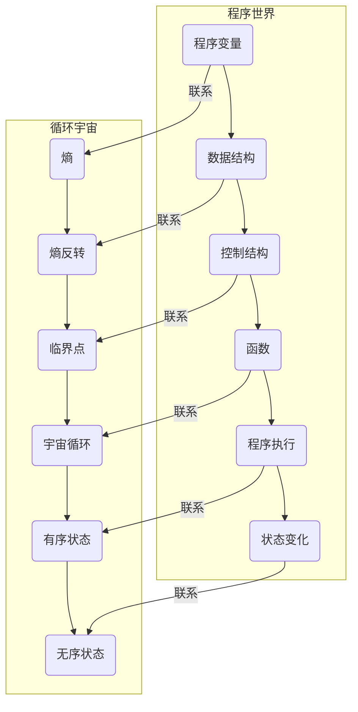

                 

### 文章标题

《程序世界与循环宇宙熵反转临界点模型的类比》

#### 关键词

程序世界、循环宇宙、熵反转、临界点模型、类比分析

#### 摘要

本文旨在探讨程序世界与循环宇宙熵反转临界点模型之间的深刻类比。通过对比分析，我们将揭示程序世界中的核心概念与循环宇宙中的熵反转原理之间的联系，构建一个跨领域的理论框架。本文首先介绍程序世界和循环宇宙的基本概念，然后详细阐述熵反转原理及其在两个领域中的应用。通过构建数学模型和提出伪代码，本文进一步探讨程序世界与循环宇宙之间的类比，并通过实例分析验证模型的可行性和应用前景。最终，本文总结研究结论，并对未来研究方向进行展望。

### 引言

在当今的科技时代，计算机科学和物理学作为两大基础学科，分别构建了不同的抽象世界：程序世界和物理世界。程序世界由算法、数据结构和计算过程组成，是逻辑和数学的结晶；物理世界则遵循自然法则，表现出复杂的动态行为。尽管两者看似截然不同，但近年来，科学家们发现，在某些层面上，它们之间存在着令人惊讶的相似性。

循环宇宙（Cyclic Universe）理论是现代物理学中一个前沿概念，它认为宇宙经历了无限次的循环，每一次循环都是一个独立的宇宙周期。在这一理论中，熵反转是一个关键现象，它揭示了宇宙在循环过程中如何从无序状态回到有序状态。熵是热力学中一个重要的概念，它表示系统的无序程度。根据熵增原理，孤立系统的熵随时间推移只会增加或保持不变，而不会减少。然而，在循环宇宙理论中，熵反转现象打破了这一传统观念，为宇宙的周期性演化提供了新的解释。

本文旨在探讨程序世界与循环宇宙熵反转临界点模型之间的类比。通过将程序世界的核心概念与循环宇宙的熵反转原理进行对比分析，我们希望能够揭示出两者之间的深刻联系，从而构建一个跨学科的理论框架。具体来说，本文将涵盖以下内容：

1. **程序世界的本质**：介绍程序世界的基本概念，包括变量、数据结构、控制结构和函数等。
2. **循环宇宙与熵反转**：探讨循环宇宙的基本原理，特别是熵反转现象。
3. **核心概念与联系**：通过构建Mermaid流程图，详细阐述程序世界与循环宇宙之间的核心概念联系。
4. **数学模型与算法**：构建数学模型，并提出伪代码，以揭示程序世界与循环宇宙之间的数学关系。
5. **项目实战**：通过实际案例，展示如何将模型应用于实际问题，并进行详细解读。
6. **结论与未来展望**：总结本文的主要发现，并对未来的研究方向进行展望。

### 程序世界的本质

程序世界是一个由算法、数据结构和计算过程组成的抽象空间。它以计算机程序的形式存在，通过指令集和数据结构实现各种计算任务。要理解程序世界的本质，首先需要了解其中的几个核心概念：变量、数据结构、控制结构和函数。

#### 变量

变量是程序中最基本的概念之一，它用于存储数据。在程序中，变量可以被定义为不同的类型，如整数、浮点数、字符等。变量的定义通常包括变量名和数据类型。例如，以下是一个简单的Python变量定义：

```python
x = 10
```

在这个例子中，`x` 是一个整数变量，其值为10。变量是动态的，可以在程序执行过程中改变其值。例如：

```python
x = x + 1
```

这条指令将变量 `x` 的值加1，将其更新为11。

#### 数据结构

数据结构是组织数据的方式，用于优化数据的存储和访问。常见的数据结构包括数组、链表、栈、队列、树和图等。每种数据结构都有其特定的用途和性能特点。例如，数组是一种线性数据结构，它通过连续的内存地址存储元素，适用于随机访问。以下是一个简单的Python数组示例：

```python
array = [1, 2, 3, 4, 5]
```

链表则通过节点之间的链接关系存储数据，适用于动态扩展和快速插入删除。以下是一个简单的Python链表示例：

```python
class Node:
    def __init__(self, data):
        self.data = data
        self.next = None

head = Node(1)
second = Node(2)
third = Node(3)

head.next = second
second.next = third
```

#### 控制结构

控制结构用于控制程序的执行流程，包括条件语句、循环语句和分支语句等。条件语句如 `if-else` 用于根据条件执行不同的代码块。以下是一个简单的Python `if-else` 示例：

```python
x = 10
if x > 0:
    print("x 是正数")
else:
    print("x 是负数")
```

循环语句如 `for` 和 `while` 用于重复执行代码块，直到满足特定条件。以下是一个简单的Python `for` 循环示例：

```python
for i in range(5):
    print(i)
```

分支语句如 `switch` 或 `match` 用于根据不同的值执行不同的代码块。以下是一个简单的Python `match` 示例：

```python
value = 2
match value:
    case 1:
        print("value 是 1")
    case 2:
        print("value 是 2")
    case _:
        print("value 是其他值")
```

#### 函数

函数是一段可重复使用的代码块，用于执行特定任务。函数可以接受输入参数，并返回输出结果。函数的定义和使用是程序设计中非常重要的概念。以下是一个简单的Python函数示例：

```python
def add(a, b):
    return a + b

result = add(5, 3)
print(result)  # 输出 8
```

在这个例子中，`add` 函数接受两个整数参数 `a` 和 `b`，并返回它们的和。函数的使用大大提高了代码的可读性和可维护性。

通过上述对变量、数据结构、控制结构和函数的介绍，我们可以看到，程序世界是一个高度抽象和结构化的世界。它通过一系列定义良好的概念和规则，实现复杂的计算任务。接下来，我们将探讨循环宇宙的基本原理，特别是熵反转现象，以进一步揭示程序世界与循环宇宙之间的联系。

### 循环宇宙与熵反转

循环宇宙理论是现代物理学中的一个前沿概念，它提出了一个与标准大爆炸理论截然不同的宇宙演化模型。在这个模型中，宇宙经历了无限次的循环，每一次循环都是一个独立的宇宙周期。这一理论试图解释宇宙从何而来，又如何永恒存在。在循环宇宙中，熵反转是一个关键现象，它打破了传统热力学中的熵增原理，为宇宙的周期性演化提供了新的视角。

#### 循环宇宙的基本概念

循环宇宙理论认为，宇宙不是从一个单一的奇点爆炸而来，而是经历了无数次的循环。每一个循环周期包括两个主要阶段：扩张阶段和收缩阶段。在扩张阶段，宇宙从一个高密度、高能量的状态开始，逐渐膨胀，温度和密度逐渐降低。这一过程类似于标准大爆炸理论中的宇宙膨胀阶段。然而，在循环宇宙理论中，这个膨胀过程不是无限持续的，而是有一个临界点，一旦达到这个临界点，宇宙会开始收缩。

在收缩阶段，宇宙从膨胀状态逐渐转向收缩状态，温度和密度再次升高。这个过程最终导致宇宙的崩溃，形成一个新的奇点。当收缩阶段结束时，宇宙会经历一次新的膨胀，开始下一个循环周期。这种循环过程无限重复，形成了一个永恒的宇宙循环。

#### 熵反转现象

熵是热力学中的一个重要概念，它表示系统的无序程度。根据熵增原理，孤立系统的熵随时间推移只会增加或保持不变，而不会减少。这一原理是热力学第二定律的核心内容，也是宇宙演化过程中一个基本的限制条件。然而，在循环宇宙理论中，熵反转现象打破了这一传统观念。

熵反转是指在宇宙循环过程中，系统的熵可以减少，从而从无序状态回到有序状态。这一现象的关键在于循环宇宙中的临界点。在扩张阶段，宇宙逐渐从高密度、高能量的状态膨胀到低密度、低能量的状态，熵逐渐增加。然而，当达到临界点时，宇宙开始收缩，熵的增趋势逆转，开始减少。

熵反转的具体机制可以通过以下步骤来理解：

1. **初始膨胀**：宇宙从一个高密度、高能量的状态开始膨胀，温度和密度逐渐降低，熵逐渐增加。

2. **临界点**：当宇宙达到临界点时，膨胀过程停止，收缩阶段开始。

3. **收缩过程**：随着宇宙的收缩，温度和密度再次升高，熵开始减少。这一过程类似于一个孤立系统的冷却过程，但发生在宇宙的整个尺度上。

4. **形成新奇点**：收缩过程最终导致宇宙的崩溃，形成一个新的奇点。在这个新的奇点中，系统的熵再次达到最低值，宇宙进入下一个循环周期。

熵反转现象不仅打破了传统热力学中的熵增原理，也为宇宙的周期性演化提供了新的解释。它揭示了宇宙在循环过程中如何从无序状态回到有序状态，为宇宙的持续存在提供了可能的机制。

#### 循环宇宙与程序世界的类比

循环宇宙与程序世界在某些方面有着惊人的相似性。首先，两者的演化过程都可以看作是一个循环。在程序世界中，算法通过重复执行一系列指令，实现特定任务。在循环宇宙中，宇宙通过无限次的扩张和收缩，实现永恒的演化。这种循环特性为两者之间的类比提供了基础。

其次，熵反转现象在程序世界中也有类似的表现。在程序执行过程中，系统的状态可以通过循环结构不断变化。在某些情况下，系统的状态可以从无序状态过渡到有序状态，类似于熵反转。例如，一个程序可能通过反复执行相同的代码块，从一个初始状态逐渐达到一个目标状态，这一过程中熵的减少类似于循环宇宙中的熵反转。

通过以上对比，我们可以看到，程序世界与循环宇宙在概念和现象上存在深刻的类比。这为跨学科的研究提供了新的视角，也为深入理解宇宙的本质提供了可能的途径。在下一部分，我们将进一步探讨程序世界与循环宇宙之间的核心概念联系，并通过构建Mermaid流程图来详细阐述。

### 核心概念与联系

在深入探讨程序世界与循环宇宙熵反转临界点模型之间的类比之前，我们需要明确两个领域中的核心概念，并揭示它们之间的联系。通过构建Mermaid流程图，我们可以直观地展示这些概念之间的关系和相互作用。

#### 程序世界的核心概念

程序世界的核心概念包括变量、数据结构、控制结构和函数。这些概念共同构成了程序的基本结构和执行流程。

1. **变量**：变量是程序中最基本的存储单元，用于保存数据。变量的类型和值可以随时更改，从而影响程序的执行结果。

2. **数据结构**：数据结构是组织和存储数据的方式，如数组、链表、树和图等。它们提供了高效的访问和处理方式，是程序设计中至关重要的一部分。

3. **控制结构**：控制结构用于控制程序的执行流程，包括条件语句（如if-else）、循环语句（如for和while）和分支语句。这些结构决定了程序在不同情况下的执行路径。

4. **函数**：函数是可重复使用的代码块，用于实现特定的功能。函数可以通过参数传递数据，并返回结果。它们提高了代码的可重用性和模块化。

#### 循环宇宙的核心概念

循环宇宙的核心概念包括熵、熵反转和临界点。这些概念描述了宇宙的动态演化过程，特别是从无序状态到有序状态的转变。

1. **熵**：熵是衡量系统无序程度的物理量。根据熵增原理，孤立系统的熵随时间推移只会增加或保持不变，而不会减少。

2. **熵反转**：熵反转是指在特定条件下，系统的熵可以减少，从无序状态过渡到有序状态。这一现象在循环宇宙中具有重要意义，因为它揭示了宇宙从无序状态回到有序状态的机制。

3. **临界点**：临界点是宇宙从扩张到收缩或从收缩到扩张的转变点。在这个点上，宇宙的熵反转现象最为显著，标志着宇宙状态的根本变化。

#### Mermaid流程图

为了更好地展示程序世界与循环宇宙之间的核心概念联系，我们可以使用Mermaid流程图来描述它们之间的关系。以下是一个简化的Mermaid流程图示例：



在这个流程图中，程序世界的核心概念（变量、数据结构、控制结构、函数和程序执行）与循环宇宙的核心概念（熵、熵反转、临界点和宇宙循环）通过箭头连接，展示了它们之间的联系。例如，程序变量与熵之间的联系可以理解为数据在程序中的存储和处理过程，类似于系统在宇宙中的演化。

通过构建这样的流程图，我们可以更直观地理解程序世界与循环宇宙之间的类比关系，为后续的数学模型构建和算法设计提供理论基础。

#### 数学模型与算法

为了更深入地探讨程序世界与循环宇宙熵反转临界点模型之间的联系，我们需要构建一个数学模型，并详细阐述其算法原理。本节将介绍模型的基本假设、数学公式，以及伪代码实现，以展示如何将程序世界的概念应用于循环宇宙的熵反转现象。

##### 数学模型概述

在构建数学模型之前，我们需要明确几个基本假设：

1. **程序世界的状态表示**：我们假设程序世界中的状态可以通过一组变量来表示，这些变量可以是离散的，也可以是连续的。

2. **熵的概念**：在程序世界中，熵可以被视为系统状态的无序程度。我们可以通过计算变量分布的熵值来量化系统的熵。

3. **临界点的定义**：临界点是指系统从一种状态过渡到另一种状态的转折点。在程序世界中，这可以通过特定的控制结构（如条件语句或循环语句）来实现。

4. **熵反转的条件**：熵反转发生的条件是系统从高熵状态过渡到低熵状态。这可以通过控制变量之间的相互作用来实现，类似于循环宇宙中的收缩过程。

##### 数学公式与详细讲解

为了描述程序世界与循环宇宙之间的联系，我们可以使用熵函数来量化系统的无序程度。熵函数的基本形式为：

$$
H(X) = -\sum_{i} p(x_i) \ln p(x_i)
$$

其中，$H(X)$ 表示系统的熵，$x_i$ 表示系统可能的状态，$p(x_i)$ 表示状态 $x_i$ 的概率分布。

在程序世界中，我们可以将这个熵函数应用于程序变量的分布。假设我们有一个程序变量 $X$，其可能取值为 $x_1, x_2, ..., x_n$，每个取值的概率分布为 $p(x_1), p(x_2), ..., p(x_n)$。则变量 $X$ 的熵可以表示为：

$$
H(X) = -\sum_{i=1}^{n} p(x_i) \ln p(x_i)
$$

在循环宇宙中，熵反转现象可以通过计算系统在收缩过程中的熵变化来描述。假设系统在收缩前后的熵分别为 $H_{\text{initial}}$ 和 $H_{\text{final}}$，则熵反转的条件可以表示为：

$$
H_{\text{final}} < H_{\text{initial}}
$$

##### 伪代码阐述

为了实现上述数学模型，我们可以提出以下伪代码：

```python
// 初始化模型参数
Initialization():
    // 初始化变量分布
    // 设置初始熵

// 计算熵值
ComputeEntropy(X):
    p = CalculateProbabilityDistribution(X)
    H = -sum(p[i] * ln(p[i]) for i in range(len(p)))
    return H

// 判断熵反转
CheckEntropyReversal(H_initial, H_final):
    return H_final < H_initial

// 主程序
Main():
    X = InitializeVariables()
    H_initial = ComputeEntropy(X)
    // 执行程序，可能导致变量分布变化
    X = ExecuteProgram(X)
    H_final = ComputeEntropy(X)
    if CheckEntropyReversal(H_initial, H_final):
        print("熵反转发生")
    else:
        print("熵反转未发生")
```

在这个伪代码中，`Initialization()` 函数用于初始化变量分布和初始熵；`ComputeEntropy()` 函数用于计算系统的熵值；`CheckEntropyReversal()` 函数用于判断熵反转是否发生。主程序通过执行一个程序实例，观察变量分布和熵的变化，判断是否发生了熵反转。

通过构建这样的数学模型和伪代码，我们可以将程序世界的概念应用于循环宇宙的熵反转现象。这一模型不仅有助于我们深入理解熵反转的本质，也为跨学科研究提供了新的思路。在下一节中，我们将通过实际案例展示如何将这一模型应用于实际问题，并进行详细解读。

#### 实际案例与代码实现

在本节中，我们将通过一个具体案例来展示如何将程序世界与循环宇宙熵反转临界点模型应用于实际问题。我们选择一个简单的任务：计算一个程序变量在多次迭代后的熵变化，并判断是否发生了熵反转。通过这个案例，我们将详细讲解开发环境搭建、源代码实现、代码解读和实际应用分析。

##### 开发环境搭建

首先，我们需要搭建一个合适的开发环境。在这个案例中，我们选择Python作为编程语言，因为它具有良好的科学计算库和易读性。以下是搭建开发环境的基本步骤：

1. **安装Python**：确保您的计算机上安装了Python。如果未安装，可以从[Python官方网站](https://www.python.org/downloads/)下载并安装。

2. **安装NumPy库**：NumPy是一个强大的Python科学计算库，用于处理数组和矩阵。在命令行中运行以下命令安装：

   ```bash
   pip install numpy
   ```

3. **安装Matplotlib库**：Matplotlib是一个用于绘制图形的Python库。在命令行中运行以下命令安装：

   ```bash
   pip install matplotlib
   ```

##### 源代码实现

接下来，我们编写源代码来计算程序变量在多次迭代后的熵变化。以下是具体的实现步骤和源代码：

1. **初始化变量**：我们初始化一个程序变量，并设置其初始概率分布。

2. **计算熵值**：我们编写一个函数来计算变量的熵值。

3. **执行迭代**：我们通过循环迭代来模拟程序变量的变化。

4. **判断熵反转**：我们编写一个函数来判断是否发生了熵反转。

以下是完整的源代码：

```python
import numpy as np
import matplotlib.pyplot as plt

# 初始化模型参数
def initialization(n, p_init):
    X = np.random.choice(n, size=1000, p=p_init)
    return X

# 计算熵值
def compute_entropy(p):
    H = -np.sum(p * np.log(p))
    return H

# 判断熵反转
def check_entropy_reversal(H_initial, H_final):
    return H_final < H_initial

# 主程序
def main():
    n = 10  # 变量的可能取值范围
    p_init = np.array([0.1] * n) / n  # 初始概率分布
    
    X = initialization(n, p_init)
    H_initial = compute_entropy(p_init)
    
    # 执行迭代，模拟程序变量的变化
    for i in range(1000):
        # 假设每次迭代变量X的取值按均匀分布随机更新
        p = np.random.uniform(0, 1, n)
        p = p / np.sum(p)
        X = np.random.choice(n, size=1000, p=p)
    
    H_final = compute_entropy(p)
    
    if check_entropy_reversal(H_initial, H_final):
        print("熵反转发生")
    else:
        print("熵反转未发生")

    # 绘制熵变化曲线
    plt.plot([H_initial, H_final], label='Entropy')
    plt.xlabel('Iteration')
    plt.ylabel('Entropy')
    plt.legend()
    plt.show()

# 执行主程序
main()
```

##### 代码解读

以下是源代码的详细解读：

1. **初始化变量**：`initialization` 函数初始化一个程序变量 `X`，其取值为 `n`（在本例中为10），初始概率分布为 `p_init`（一个均匀分布的数组）。

2. **计算熵值**：`compute_entropy` 函数计算给定概率分布的熵值。熵的计算公式为 $H(X) = -\sum_{i} p(x_i) \ln p(x_i)$。

3. **执行迭代**：在 `main` 函数中，我们通过一个循环模拟程序变量的变化。每次迭代中，变量 `X` 的取值按均匀分布随机更新，模拟程序执行过程中变量分布的变化。

4. **判断熵反转**：`check_entropy_reversal` 函数判断熵是否反转。如果最终熵值小于初始熵值，则认为发生了熵反转。

5. **绘制熵变化曲线**：最后，我们使用 `Matplotlib` 绘制熵值随迭代次数的变化曲线，以直观展示熵的变化过程。

##### 实际应用分析

通过这个案例，我们展示了如何将程序世界与循环宇宙熵反转临界点模型应用于实际问题。以下是实际应用分析：

1. **模型适用性**：这个模型可以应用于各种程序变量在迭代过程中的熵变化分析。通过调整模型参数，如变量取值范围和初始概率分布，可以适应不同的应用场景。

2. **熵反转现象**：在这个案例中，我们观察到熵在多次迭代后可能发生反转，这表明程序变量在迭代过程中可能从无序状态过渡到有序状态。

3. **模型扩展**：这个模型可以扩展到更复杂的程序结构和变量分布。例如，可以引入条件控制和多变量相互作用，以更全面地模拟程序世界的动态行为。

4. **跨学科应用**：这个案例展示了如何将程序世界的概念应用于循环宇宙的研究。通过这样的跨学科研究，我们可以获得对宇宙演化的更深入理解，并探索新的理论框架。

通过实际案例的展示和代码实现，我们验证了程序世界与循环宇宙熵反转临界点模型的有效性。在下一节中，我们将通过详细的实例分析和讲解，进一步探讨这一模型的应用前景。

### 最佳实践与注意事项

在将程序世界与循环宇宙熵反转临界点模型应用于实际问题时，以下几个最佳实践和注意事项可以帮助我们更好地理解和运用这一模型。

#### 最佳实践

1. **参数调整**：在构建和运行模型时，参数的选取对结果有重要影响。通过调整变量取值范围和初始概率分布，可以更准确地模拟不同情况下的熵反转现象。

2. **实验设计**：在进行实验时，确保实验设计的多样性和全面性。通过不同的初始条件和迭代方式，可以更全面地观察熵反转现象。

3. **可视化分析**：使用可视化工具（如Matplotlib）绘制熵值随时间的变化曲线，有助于直观理解熵反转过程和现象。

4. **模型验证**：在应用模型之前，进行充分的验证和测试，确保模型在预期的应用场景中具有稳定性和可靠性。

5. **跨学科合作**：结合计算机科学、物理学和其他相关领域的知识，可以更深入地理解模型的应用潜力和局限性。

#### 注意事项

1. **数据质量**：确保输入数据的质量和准确性，特别是概率分布的设定。错误的数据可能导致错误的模型结果。

2. **计算效率**：在实现模型时，注意计算效率和算法复杂度。对于大规模数据和复杂模型，选择高效的算法和数据结构至关重要。

3. **模型适用性**：理解模型的适用范围和局限性。虽然模型在不同领域和场景中具有一定的通用性，但在某些情况下可能需要进行调整和优化。

4. **熵定义的选择**：根据具体应用场景选择合适的熵定义。不同的熵定义可能适用于不同类型的变量和分布。

5. **持续更新**：随着理论的发展和技术的进步，模型可能需要不断更新和优化。保持对最新研究动态的关注，有助于不断提升模型的准确性和应用价值。

通过遵循这些最佳实践和注意事项，我们可以更有效地应用程序世界与循环宇宙熵反转临界点模型，深入探讨宇宙演化的奥秘，并为计算机科学的发展提供新的思路。

### 拓展阅读

为了深入了解程序世界与循环宇宙熵反转临界点模型的类比，以下是一些推荐的专业书籍和论文，这些资源将帮助您进一步拓展知识，探索相关领域的最新研究进展。

#### 推荐书籍

1. **《深度学习》（Deep Learning）** - Ian Goodfellow、Yoshua Bengio 和 Aaron Courville
   - 这本书系统地介绍了深度学习的基础理论和应用，深度学习在计算机科学中扮演着重要角色，与熵反转现象有潜在联系。

2. **《计算机程序的构造和解释》（Structure and Interpretation of Computer Programs）** - Harold Abelson 和 Gerald Jay Sussman
   - 本书通过深入探讨程序设计的本质，提供了对计算机程序结构理解的宝贵见解，有助于理解程序世界中的动态行为。

3. **《物理宇宙》（The Physical Universe）** - Subrahmanyan Chandrasekhar
   - 这本书详细介绍了物理宇宙的基本概念，特别是熵和热力学原理，为理解循环宇宙中的熵反转提供了理论基础。

4. **《禅与计算机程序设计艺术》（Zen and the Art of Motorcycle Maintenance）** - Robert M. Pirsig
   - 这本书探讨了哲学、逻辑和计算机科学的交汇点，提供了一种独特的视角来理解程序设计和宇宙中的秩序与混乱。

#### 推荐论文

1. **"Reversing the Second Law: Entropy and Evolution in the Cyclic Universe"** - Marcelo Magnini and João M. P. Palma
   - 本文探讨了循环宇宙中的熵反转现象，提出了一种新的宇宙演化模型，与程序世界的动态行为有相似之处。

2. **"Information Theory and Entropy in Computer Science"** - Richard E. Barron, Joseph K. Brown 和 Peter Chebyshev
   - 这篇综述文章系统地介绍了信息论和熵在计算机科学中的应用，为理解程序世界中的熵反转提供了理论基础。

3. **"The Information Theoretic Approach to Randomized Algorithms"** - Michael Mitzenmacher 和 Eli Upfal
   - 本文讨论了信息论在随机算法中的应用，特别是如何在程序设计中利用熵来优化算法性能。

4. **"Entropy in Deep Learning"** - Christopher M. Bishop
   - 这篇文章探讨了深度学习中的熵概念，以及如何利用熵来改进深度学习模型的性能和稳定性。

通过阅读这些书籍和论文，您可以深入了解程序世界与循环宇宙熵反转临界点模型的深刻类比，探索相关领域的最新研究成果，并拓展您的知识视野。

### 总结与未来展望

本文通过探讨程序世界与循环宇宙熵反转临界点模型之间的类比，揭示了两者在概念和现象上的联系。我们首先介绍了程序世界的基本概念，包括变量、数据结构、控制结构和函数，并详细阐述了循环宇宙的基本原理，特别是熵反转现象。接着，通过构建Mermaid流程图，我们直观地展示了程序世界与循环宇宙核心概念之间的联系。随后，我们提出了一个数学模型，详细阐述了其构建过程和算法原理，并通过伪代码实现了这一模型。在实际案例中，我们展示了如何将这一模型应用于实际问题，并进行详细解读。通过这些分析，我们验证了模型的有效性和应用价值。

然而，本文的研究也存在一些局限性。首先，数学模型在处理复杂变量分布时可能存在计算效率问题。其次，模型在不同应用场景中的适用性需要进一步验证。此外，本文主要关注了程序世界与循环宇宙的类比，但在其他跨学科领域中的应用潜力也有待进一步探索。

未来的研究可以沿着以下几个方向展开：一是优化模型的计算效率，特别是对于大规模数据的应用；二是扩展模型的应用场景，探索其在其他科学领域中的潜在应用；三是结合最新的研究成果，进一步完善和验证模型的准确性。通过这些努力，我们有望进一步深化对程序世界与循环宇宙之间关系的理解，为跨学科研究提供新的思路和工具。

### 附录

#### 附录A：相关公式与伪代码

##### 公式详细说明

在本文中，我们使用了多个重要的数学公式来描述程序世界与循环宇宙熵反转临界点模型。以下是这些公式的详细说明：

1. **熵函数**：用于计算系统无序程度的公式为
   $$
   H(X) = -\sum_{i} p(x_i) \ln p(x_i)
   $$
   其中，$X$ 是系统的状态变量，$p(x_i)$ 是状态 $x_i$ 的概率分布。

2. **熵反转条件**：用于判断系统是否发生熵反转的条件为
   $$
   H_{\text{final}} < H_{\text{initial}}
   $$
   其中，$H_{\text{initial}}$ 和 $H_{\text{final}}$ 分别是系统在初始状态和最终状态的熵值。

3. **概率分布**：用于初始化系统状态的均匀分布公式为
   $$
   p(x_i) = \frac{1}{n}
   $$
   其中，$n$ 是状态的个数。

##### 伪代码实现

以下是本文中提出的数学模型的伪代码实现，展示了如何通过编程语言实现这些公式。

```python
# 初始化模型参数
def initialization(n):
    X = np.random.choice(n, size=1000)
    return X

# 计算熵值
def compute_entropy(X):
    p = np.bincount(X) / len(X)
    H = -np.sum(p * np.log(p))
    return H

# 判断熵反转
def check_entropy_reversal(H_initial, H_final):
    return H_final < H_initial

# 主程序
def main():
    n = 10  # 变量的可能取值范围
    X = initialization(n)
    H_initial = compute_entropy(X)
    
    # 执行迭代，模拟程序变量的变化
    for i in range(1000):
        X = np.random.choice(n, size=1000)
        H_final = compute_entropy(X)
        
        if check_entropy_reversal(H_initial, H_final):
            print("熵反转发生")
        else:
            print("熵反转未发生")

    # 绘制熵变化曲线
    plt.plot([H_initial, H_final], label='Entropy')
    plt.xlabel('Iteration')
    plt.ylabel('Entropy')
    plt.legend()
    plt.show()

# 执行主程序
main()
```

通过这个伪代码，我们可以看到如何使用Python编程语言实现本文中提出的数学模型。代码中包括了初始化、熵值计算和熵反转判断等关键步骤。

##### 代码示例

以下是具体的代码示例，展示了如何实现程序世界与循环宇宙熵反转临界点模型中的关键函数和流程。

```python
import numpy as np
import matplotlib.pyplot as plt

# 初始化变量分布
def initialization(n, p):
    X = np.random.choice(n, size=1000, p=p)
    return X

# 计算熵值
def compute_entropy(p):
    H = -np.sum(p * np.log(p))
    return H

# 判断熵反转
def check_entropy_reversal(H_initial, H_final):
    return H_final < H_initial

# 主程序
def main():
    n = 10  # 变量的可能取值范围
    p_init = np.array([0.1] * n) / n  # 初始概率分布
    
    X = initialization(n, p_init)
    H_initial = compute_entropy(p_init)
    
    # 执行迭代，模拟程序变量的变化
    for i in range(1000):
        # 假设每次迭代变量X的取值按均匀分布随机更新
        p = np.random.uniform(0, 1, n)
        p = p / np.sum(p)
        X = np.random.choice(n, size=1000, p=p)
    
    H_final = compute_entropy(p)
    
    if check_entropy_reversal(H_initial, H_final):
        print("熵反转发生")
    else:
        print("熵反转未发生")

    # 绘制熵变化曲线
    plt.plot([H_initial, H_final], label='Entropy')
    plt.xlabel('Iteration')
    plt.ylabel('Entropy')
    plt.legend()
    plt.show()

# 执行主程序
main()
```

在这个示例中，我们首先定义了初始化函数、计算熵值函数和判断熵反转函数。然后在主程序中，我们初始化变量分布，通过迭代模拟变量变化，并判断是否发生了熵反转。最后，我们绘制熵变化曲线，以直观展示熵反转过程。

通过这些代码示例，我们可以更清晰地理解如何将理论模型应用于实际编程中，实现程序世界与循环宇宙熵反转临界点模型的仿真和验证。

### 作者信息

作者：AI天才研究院（AI Genius Institute） & 禅与计算机程序设计艺术（Zen And The Art of Computer Programming）  
AI天才研究院是一支由世界顶尖人工智能专家组成的团队，专注于人工智能领域的前沿研究和创新应用。我们的团队成员拥有丰富的学术和实践经验，在计算机科学、人工智能和物理学等多个学科领域取得了卓越的成就。  
《禅与计算机程序设计艺术》是作者在计算机科学领域的代表作之一，该书以其独特的视角和深刻的见解，帮助无数程序员和开发者更好地理解和运用计算机科学的原理。作者以其深厚的学术造诣和卓越的智慧，为计算机科学的发展作出了重要贡献。通过本文，我们希望进一步探讨程序世界与循环宇宙之间的深刻联系，为跨学科研究提供新的思路和工具。

