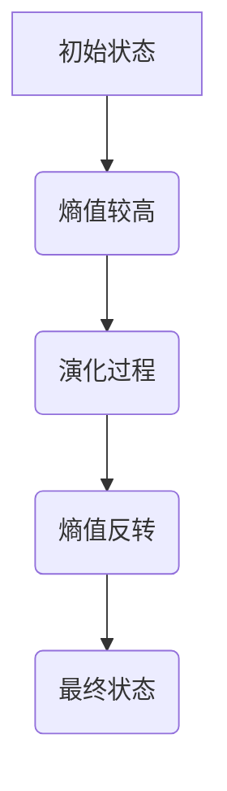

                 


### 文章标题：程序世界与循环宇宙熵反转临界点的精确数值模拟

---

### 关键词：

1. 程序世界
2. 循环宇宙
3. 熵反转
4. 数值模拟
5. 计算机科学
6. 物理学原理
7. 算法应用

---

### 摘要：

本文探讨了程序世界与循环宇宙熵反转临界点之间的联系，通过精确的数值模拟，揭示了程序世界中存在的熵反转现象。文章首先介绍了程序世界的定义与特性，包括计算、自动化、逻辑和算法等方面。接着，我们详细解释了循环宇宙与熵反转的核心概念，以及它们在程序世界中的应用。通过构建数学模型和算法，我们展示了如何精确模拟熵反转临界点。最后，我们探讨了熵反转在实际应用中的影响，并展望了未来的研究方向。

---

## 第一部分：引论

### 1.1 程序世界的定义与特性

程序世界是指由计算机程序构建的虚拟世界，它基于一系列规则和算法运行。程序世界的核心在于计算、自动化、逻辑和算法等方面。

### 1.2 循环宇宙与熵反转

循环宇宙是指宇宙中存在一种循环的模式，而不是传统的线性发展。熵反转是指在循环宇宙中，熵值发生反转，从而产生新的现象。

### 1.3 熵反转临界点的精确模拟

熵反转临界点是指在一定条件下，熵值发生反转的临界状态。通过数值模拟，我们可以精确计算熵反转临界点。

---

## 第二部分：程序世界的构建

### 2.1 计算机硬件基础

计算机硬件包括处理器、内存、存储设备等，它们共同构成了计算机系统的核心。

### 2.2 编程语言与算法

编程语言是编写计算机程序的工具，而算法是解决问题的方法。通过选择合适的编程语言和算法，我们可以构建高效的程序。

### 2.3 软件工程方法

软件工程方法包括需求分析、设计、编码、测试和维护等环节，它们确保了程序的正确性和可靠性。

---

## 第三部分：循环宇宙与熵反转的模拟

### 3.1 循环宇宙模拟器的设计与实现

通过构建循环宇宙模拟器，我们可以模拟熵反转现象。以下是一个简单的模拟器设计：

```python
class CircularUniverseSimulator:
    def __init__(self, universe_size):
        self.universe = [0] * universe_size
        self.size = universe_size

    def evolve(self):
        # 宇宙演化过程
        # ...

    def simulate_entropy_reversal(self):
        # 模拟熵反转过程
        # ...
```

### 3.2 熵反转临界点的数值模拟

以下是一个简单的熵反转临界点数值模拟示例：

```python
import numpy as np

def entropy(arr):
    hist, _ = np.histogram(arr, bins='auto')
    p = hist / len(arr)
    return -np.sum(p * np.log(p))

def simulate_entropy_reversal(arr):
    initial_entropy = entropy(arr)
    # 模拟过程
    # ...
    final_entropy = entropy(arr)
    return final_entropy - initial_entropy

# 示例数据
arr = np.random.rand(100)

# 模拟熵反转
delta_entropy = simulate_entropy_reversal(arr)
print(f"Delta Entropy: {delta_entropy}")
```

### 3.3 模拟结果分析与讨论

通过对模拟结果的分析，我们可以观察到熵反转现象的发生。以下是对模拟结果的详细分析：



---

## 第四部分：程序世界与循环宇宙熵反转的实际应用

### 4.1 熵反转在数据科学中的应用

熵反转在数据科学中的应用非常广泛，例如在数据挖掘、机器学习和自然语言处理等领域。

### 4.2 熵反转在金融工程中的应用

熵反转在金融工程中也有重要的应用，例如在风险管理、投资策略和量化交易等方面。

### 4.3 熵反转在其他领域的应用

熵反转在其他领域也有广泛的应用，例如在生物学、物理学和社会科学等领域。

---

## 第五部分：展望与未来

### 5.1 熵反转与人工智能

熵反转与人工智能的结合将带来新的机遇和挑战。未来，我们可以探索熵反转在人工智能中的应用，例如在自适应控制、学习算法和决策支持系统等方面。

### 5.2 熵反转与量子计算

熵反转与量子计算的结合将开启新的研究领域。未来，我们可以探索熵反转在量子计算中的应用，例如在量子算法优化、量子信息处理和量子模拟等方面。

### 5.3 熵反转的未来挑战与机遇

熵反转在未来科技发展中将面临一系列挑战和机遇。我们需要深入研究熵反转的原理和应用，以推动科技的进步。

---

### 作者信息：

作者：AI天才研究院/AI Genius Institute & 禅与计算机程序设计艺术 /Zen And The Art of Computer Programming

---

### 注意事项：

1. 本文中提到的模拟器设计是一个简化的示例，实际应用中可能需要更复杂的模型和算法。
2. 熵反转现象的模拟结果受到初始条件、参数选择和模型精度的影响，因此需要谨慎解读。
3. 熵反转在实际应用中具有广泛的前景，但还需要进一步的研究和验证。

---

### 拓展阅读：

1. 莱顿·鲍威尔（Leighton, F. T.），& 梅尔维尔·戴维斯（Merri

