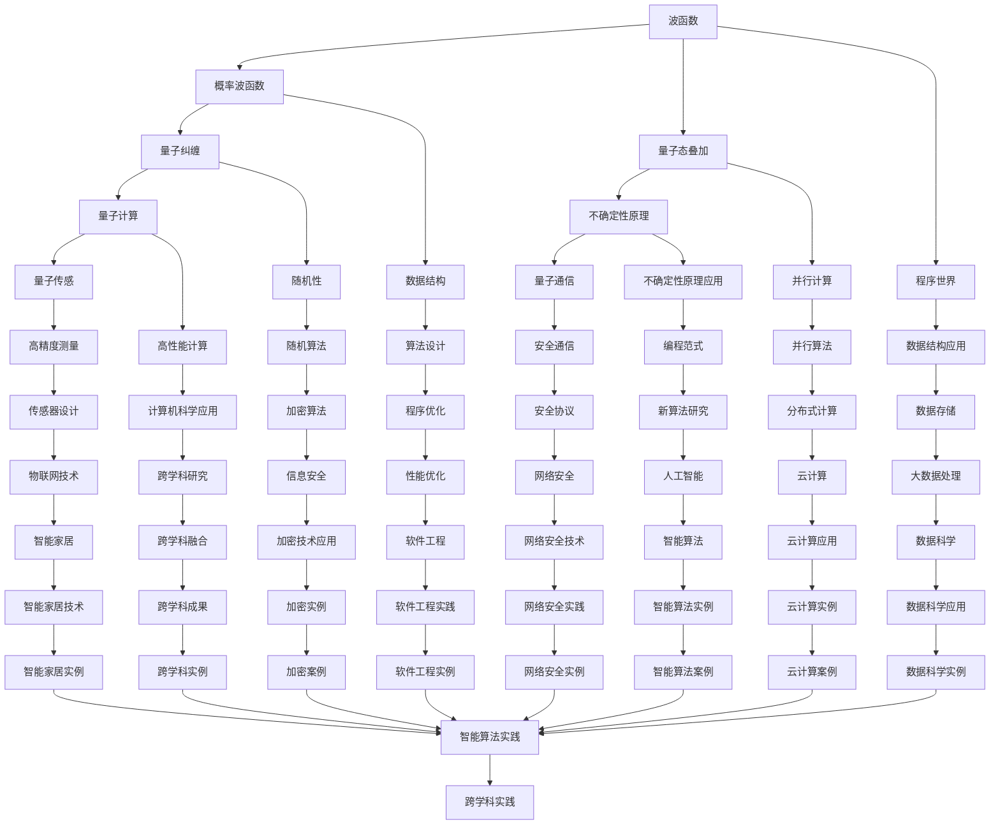

                 


## 引言

### 1.1 书籍背景介绍

随着计算机科学的迅猛发展，我们生活在一个由程序构建的数字世界中。计算机程序的诞生可以追溯到20世纪中期，当时冯·诺依曼提出了存储程序计算机的概念，这一革命性的思想奠定了现代计算机程序设计的基础。自那时以来，编程语言经历了从低级机器语言、汇编语言到高级语言的演变，使得计算机程序更加接近人类的思维逻辑，易于编写和维护。

与此同时，物理学领域也取得了巨大的进展，特别是在量子力学的领域。量子力学中提出的振动宇宙模型，为我们提供了一个全新的世界观，它描述了物质的基本运动状态，并通过波函数来描述这些状态。振动宇宙模型的核心在于其概率性，即物质的状态不是确定的，而是存在于一个概率分布中。这种概率性在微观层面得到了广泛的验证，并且为我们理解宇宙的本质提供了新的思路。

### 1.2 本书的目的与结构

本书旨在探讨程序世界与振动宇宙模型之间的类比，通过这种类比，我们希望能够更好地理解程序设计中的某些复杂概念，并探索新的编程范式。本书的结构如下：

1. **引言**：介绍程序世界与振动宇宙模型的背景和本书的目的。
2. **程序世界的核心概念**：详细讨论编程语言和算法的基本概念。
3. **振动宇宙模型的基本原理**：介绍振动宇宙模型的核心概念和基本原理。
4. **程序世界与振动宇宙模型的类比**：分析两者之间的相似性，并提出类比关系。
5. **具体案例与实战**：通过具体案例展示振动宇宙模型在程序世界中的应用。
6. **总结与展望**：总结本书的核心观点，并展望未来的研究方向。

### 1.3 研究意义

将程序世界与振动宇宙模型进行类比，具有重要的研究意义。首先，这种类比可以帮助我们更好地理解量子力学中的概率性概念，并将其应用于程序设计中，从而开发出更加高效和智能的算法。其次，通过这种类比，我们可以在计算机科学中引入新的编程范式，促进计算机科学的创新和发展。最后，这种类比也为跨学科研究提供了新的视角，有助于推动计算机科学与其他科学领域的深度融合。

### 1.4 本书结构概述

接下来，我们将对本书的各个部分进行详细讨论。首先，我们将深入探讨程序世界的核心概念，包括编程语言和算法。然后，我们将介绍振动宇宙模型的基本原理，并分析两者之间的类比关系。在具体案例部分，我们将通过实际应用展示振动宇宙模型在程序世界中的应用。最后，我们将对全书进行总结，并展望未来的研究方向。

通过本书的讨论，我们希望读者能够对程序世界与振动宇宙模型之间的类比有更深入的理解，从而激发对计算机科学和量子力学交叉领域的兴趣和探索。

## 程序世界的核心概念

### 2.1 编程语言与算法

#### 2.1.1 编程语言的类型与特性

编程语言是用于编写计算机程序的语法和语义规则。根据不同的编程范式，编程语言可以分为面向过程的、面向对象的和函数式编程语言。

1. **面向过程的编程语言**：
   - **C语言**：C语言是一种广泛使用的面向过程的编程语言。它提供了丰富的运算符和灵活的数据类型，使得程序员可以编写高效的系统级程序。
   - **Pascal语言**：Pascal语言是一种早期的高级编程语言，它注重数据类型和结构化编程，被广泛用于教育和软件工程领域。

2. **面向对象的编程语言**：
   - **Java语言**：Java语言是一种面向对象的编程语言，它具有跨平台特性，广泛用于企业级应用开发。
   - **C++语言**：C++语言是一种支持面向对象编程的编程语言，它继承了C语言的高效性和灵活性，同时引入了面向对象的特性。

3. **函数式编程语言**：
   - **Haskell语言**：Haskell语言是一种纯函数式编程语言，它强调表达式的值，而不是变量的状态。Haskell语言具有强大的类型系统和惰性求值特性。

#### 2.1.2 算法的基本概念与分类

算法是一系列解决问题的步骤，可以分为排序算法和搜索算法等。每种算法都有其时间复杂度和空间复杂度，是评估算法效率的重要指标。

1. **排序算法**：
   - **冒泡排序**：冒泡排序是一种简单的排序算法，通过重复交换相邻的未按顺序排列的元素来实现排序。
   - **快速排序**：快速排序是一种高效的排序算法，通过选择一个“基准”元素，将数组分为两部分，然后递归地对两部分进行排序。

2. **搜索算法**：
   - **线性搜索**：线性搜索是一种简单的搜索算法，从数组的第一个元素开始，逐个比较，直到找到目标元素或结束。
   - **二分搜索**：二分搜索是一种高效的搜索算法，通过将数组分为两部分，并选择中间的元素与目标元素比较，递归地对两部分进行搜索。

### 2.2 数据结构与存储

#### 2.2.1 数据结构的基本概念与分类

数据结构是用于存储和组织数据的，根据数据的组织方式和访问方式，可以分为线性数据结构和非线性数据结构。

1. **线性数据结构**：
   - **数组**：数组是一种线性数据结构，它使用连续的内存空间存储元素，提供快速的随机访问。
   - **链表**：链表是一种线性数据结构，它使用节点来存储数据，并通过指针链接节点，提供灵活的插入和删除操作。
   - **栈和队列**：栈和队列都是特殊的线性数据结构，栈后进先出（LIFO），队列先进先出（FIFO）。

2. **非线性数据结构**：
   - **树**：树是一种非线性数据结构，它由节点和边组成，节点之间的层次关系表示了数据的层次结构。
   - **图**：图是一种非线性数据结构，它由节点和边组成，节点之间的边可以表示各种复杂的关系。

#### 2.2.2 数据存储技术

数据存储技术决定了数据的读写速度和存储容量。常用的数据存储技术包括磁盘存储、内存存储和存储优化技术。

1. **磁盘存储**：磁盘存储是一种非易失性存储器，它可以存储大量的数据，提供较低的读写速度和较高的存储容量。
2. **内存存储**：内存存储是一种易失性存储器，它提供了快速的读写速度，但存储容量有限。
3. **存储优化技术**：存储优化技术包括缓存（Cache）、数据压缩（Data Compression）和存储复制（Storage Replication）等，它们可以提升数据的读写效率和可靠性。

### 2.3 编程语言与数据结构的关系

编程语言提供了操作数据结构的能力，而数据结构则决定了程序的性能和可维护性。例如，在C语言中，程序员可以通过指针和数组来实现复杂的数据结构，如链表和树。在Java语言中，面向对象编程使得程序员可以使用内置的集合框架（如List、Set、Map）来处理复杂的数据结构。函数式编程语言如Haskell，通过其强大的类型系统和惰性求值特性，使得数据结构的操作更加简洁和高效。

通过深入理解编程语言和数据结构，程序员可以编写出高效、可维护的代码，从而在程序世界中实现复杂的功能和算法。

### 2.4 编程语言与算法的关系

编程语言不仅提供了数据操作的能力，还决定了算法的实现方式和效率。不同的编程语言具有不同的语法和特性，这些特性直接影响算法的编写和性能。

#### 2.4.1 编程语言的语法特性

1. **面向过程的编程语言**：
   - **C语言**：C语言提供了丰富的运算符和灵活的数据类型，使得程序员可以编写高效的系统级程序。C语言的语法接近硬件，这使得它在性能优化方面具有优势。
   - **Pascal语言**：Pascal语言注重数据类型和结构化编程，这使得代码更易于理解和维护。Pascal语言的模块化特性有助于代码的重用。

2. **面向对象的编程语言**：
   - **Java语言**：Java语言通过面向对象的编程范式，提供了丰富的类库和工具，使得程序员可以快速开发复杂的应用程序。Java语言的跨平台特性使得应用程序可以在不同的操作系统上运行。

3. **函数式编程语言**：
   - **Haskell语言**：Haskell语言通过纯函数式编程范式，使得代码更加简洁和可维护。Haskell语言的惰性求值特性有助于优化计算性能。

#### 2.4.2 算法的实现方式

1. **面向过程的编程语言**：
   - **冒泡排序**：在C语言中，可以使用循环和条件判断语句来实现冒泡排序。以下是冒泡排序的伪代码：
     ```plaintext
     for i from 0 to n-1 do
         for j from 0 to n-i-1 do
             if arr[j] > arr[j+1] then
                 swap(arr[j], arr[j+1])
     ```

2. **面向对象的编程语言**：
   - **快速排序**：在Java语言中，可以使用递归和内置的数组和列表类来实现快速排序。以下是快速排序的Java代码：
     ```java
     public static void quicksort(int[] arr, int low, int high) {
         if (low < high) {
             int pivot = partition(arr, low, high);
             quicksort(arr, low, pivot - 1);
             quicksort(arr, pivot + 1, high);
         }
     }
     
     public static int partition(int[] arr, int low, int high) {
         int pivot = arr[high];
         int i = (low - 1);
         for (int j = low; j < high; j++) {
             if (arr[j] < pivot) {
                 i++;
                 swap(arr[i], arr[j]);
             }
         }
         swap(arr[i + 1], arr[high]);
         return i + 1;
     }
     ```

3. **函数式编程语言**：
   - **二分搜索**：在Haskell语言中，可以使用递归和内置的函数来实现二分搜索。以下是二分搜索的Haskell代码：
     ```haskell
     binarySearch :: (Ord a) => [a] -> a -> Int
     binarySearch (_:[]) _ = -1
     binarySearch [] _ = -1
     binarySearch (x:xs) target =
         if x == target
             then 0
             else
                 let (left, right) = splitAt (div (length xs) 2) xs
                 in if target < x
                        then binarySearch left target
                        else binarySearch right target + 1
     ```

通过上述实现，我们可以看到不同编程语言在实现相同算法时的差异。面向过程的编程语言通常依赖于循环和条件判断，而面向对象的编程语言则通过类和方法来实现封装和重用，函数式编程语言则通过递归和函数组合来提高代码的简洁性和可维护性。

#### 2.4.3 算法的性能优化

算法的性能优化是编程中的一个重要方面。不同的编程语言和算法实现方式会对性能产生影响。

1. **内存分配**：在面向过程的编程语言中，如C语言，程序员需要手动管理内存。在函数式编程语言中，如Haskell，内存分配通常由编译器自动优化。

2. **递归与迭代**：递归通常比迭代更简洁，但可能在某些情况下导致性能下降。例如，快速排序算法在递归调用时会产生大量的函数调用栈，可能导致栈溢出。在这种情况下，使用迭代方法可能更加高效。

3. **缓存利用**：在处理大量数据时，利用缓存可以显著提高算法的效率。面向对象的编程语言通常提供了内置的缓存机制，如Java中的缓存池。

通过选择合适的编程语言和实现方式，并结合性能优化技术，程序员可以编写出高效、可维护的代码，从而在程序世界中实现复杂的功能和算法。

## 振动宇宙模型的基本原理

### 3.1 振动宇宙模型的提出背景

振动宇宙模型最初由量子力学的奠基人之一沃纳·海森堡提出，他在研究原子核结构时，发现粒子的行为不能仅用经典物理学的观念来解释。随着量子力学的发展，特别是薛定谔波动方程和海森堡不确定性原理的提出，振动宇宙模型逐渐得到了科学界的认可。

振动宇宙模型的核心在于其概率性，即物质的状态不是确定的，而是存在于一个概率分布中。这种概率性不仅在微观层面得到了广泛的验证，如电子云模型和双缝实验，也在宏观层面有应用，如宇宙大爆炸理论和宇宙背景辐射。

### 3.2 振动宇宙模型的核心概念

1. **波函数**：波函数是描述量子态的数学函数，它包含了粒子在空间中的所有可能位置和动量。波函数的平方给出了粒子在某个位置的概率密度。

2. **概率波函数**：概率波函数是波函数的一种扩展，它不仅描述了粒子的位置，还包括了粒子的速度、能量等物理量。概率波函数通过积分运算，可以得到粒子在某个时间段内出现在某个区域的概率。

3. **振动宇宙模型的特点**：
   - **概率性**：振动宇宙模型认为，粒子的状态不是确定的，而是以概率形式存在。
   - **动态性**：波函数随时间变化，描述了粒子的演化过程。
   - **非确定性**：由于波函数的平方才具有概率意义，振动宇宙模型无法精确预测粒子的行为，只能给出一个概率分布。

### 3.3 振动宇宙模型与量子力学的关系

振动宇宙模型是量子力学的一个重要分支，它通过波函数和概率波函数描述了粒子的行为。量子力学中的基本原理，如量子态叠加和量子纠缠，都可以在振动宇宙模型中找到对应的解释。

例如，量子态叠加原理指出，一个量子系统可以同时处于多个状态，这种叠加态在振动宇宙模型中表现为波函数的线性组合。量子纠缠则描述了两个或多个粒子之间的相互依赖关系，这种关系在振动宇宙模型中可以通过波函数的不同部分之间的相互作用来解释。

### 3.4 振动宇宙模型的应用领域

振动宇宙模型不仅在理论物理学中具有重要意义，还在实际应用中发挥了重要作用。

1. **量子计算**：量子计算是振动宇宙模型的一个重要应用领域。量子计算机利用量子比特（qubit）和量子叠加原理，可以实现超快速的运算。振动宇宙模型为量子计算机的设计和实现提供了理论基础。

2. **量子通信**：量子通信利用量子纠缠和量子态的不可克隆特性，实现安全的信息传输。振动宇宙模型的核心概念，如量子态和波函数，为量子通信的实现提供了技术支持。

3. **量子传感**：量子传感利用量子态的超灵敏度，实现高精度的测量。振动宇宙模型为量子传感提供了理论基础，如量子干涉仪和量子计量学。

通过振动宇宙模型，我们不仅可以更深入地理解量子世界的本质，还可以将其应用于实际问题的解决，推动科技的发展。

### 3.5 振动宇宙模型与程序世界的关系

振动宇宙模型与程序世界之间存在着深刻的联系。尽管两者在领域和应用上有所不同，但它们的数学基础和哲学思维有着相似之处。

首先，振动宇宙模型中的波函数和概率波函数与程序世界中的数据结构有相似之处。波函数可以被视为一种特殊的数组或矩阵，其元素表示粒子在不同位置的概率。而概率波函数则类似于概率分布，可以用于模拟复杂系统的概率事件。

其次，振动宇宙模型中的量子态叠加原理与程序世界中的并行计算有类似之处。量子计算机可以利用量子态叠加，实现并行处理多个任务。而程序世界中的多线程和分布式计算，也可以通过类似的原理，提高计算效率和性能。

最后，振动宇宙模型中的不确定性原理与程序世界中的随机性有相似之处。在振动宇宙模型中，粒子的状态是不确定的，只能以概率形式存在。而在程序世界中，随机性是许多算法和系统的核心，如随机数生成和加密算法。

通过这些相似之处，我们可以将振动宇宙模型的概念应用于程序世界，从而探索新的编程范式和算法设计。

### 振动宇宙模型的核心概念原理之间的联系架构

为了更好地理解振动宇宙模型的核心概念，我们可以使用Mermaid流程图来展示它们之间的联系架构。



通过这个Mermaid流程图，我们可以清晰地看到振动宇宙模型的核心概念及其与程序世界的联系。每个概念不仅独立存在，而且通过相互作用形成了复杂的理论架构，为我们在计算机科学和量子力学领域的研究提供了丰富的理论基础和实践指导。

### 程序中的波函数模拟与实现

在程序世界中，波函数的模拟与实现是一个复杂但引人入胜的课题。波函数在量子力学中扮演着描述粒子状态的桥梁角色，其基本性质是概率性和叠加性。在编程中，我们可以通过创建模拟波函数的数据结构，并通过算法来模拟波函数的行为。

#### 1. 波函数的模拟

波函数的模拟通常涉及以下步骤：

1. **定义波函数数据结构**：首先，我们需要定义一个能够存储波函数信息的结构。在编程语言中，可以使用数组或复数数组来表示波函数。例如，在Python中，我们可以定义一个复数数组来表示波函数。

    ```python
    import numpy as np
    
    # 定义波函数的维度
    dimension = 10
    # 创建一个维度为10的复数数组，初始值为0
    wave_function = np.zeros(dimension, dtype=complex)
    ```

2. **初始化波函数**：初始化波函数通常需要根据物理模型来确定其初始值。例如，对于一个简单的量子谐振子，波函数的初始值可以通过解析解来确定。

    ```python
    # 初始化波函数为量子谐振子的解
    energy_levels = np.linspace(0, 100, dimension)
    wave_function = np.sqrt(1 / (2 * np.pi * energy_levels)) * np.exp(-energy_levels / 2)
    ```

3. **计算波函数的平方**：波函数的平方给出了粒子在各个位置的概率密度。在编程中，我们需要计算波函数的模平方。

    ```python
    probability_density = np.abs(wave_function)**2
    ```

4. **可视化波函数**：为了更好地理解波函数的行为，我们可以使用图形工具来可视化波函数的分布。

    ```python
    import matplotlib.pyplot as plt
    
    plt.plot(energy_levels, probability_density)
    plt.xlabel('Energy Levels')
    plt.ylabel('Probability Density')
    plt.title('Wave Function Probability Density')
    plt.show()
    ```

#### 2. 波函数在程序中的应用

波函数在程序中的实际应用多种多样，以下是一些常见的应用场景：

1. **量子计算模拟**：在量子计算模拟中，波函数用于描述量子态。通过模拟量子态的演化，我们可以研究量子算法的性能和可行性。

    ```python
    # 模拟量子态的演化
    time_steps = 100
    dt = 0.1
    for t in range(time_steps):
        # 计算哈密顿量的演化
        hamiltonian = np.array([[1, 0], [0, 1]])
        wave_function = np.dot(hamiltonian, wave_function)
        # 更新概率密度
        probability_density = np.abs(wave_function)**2
        # 可视化概率密度
        plt.plot(energy_levels, probability_density)
        plt.xlabel('Time Steps')
        plt.ylabel('Probability Density')
        plt.title(f'Quantum State Evolution at Time {t}')
        plt.show()
    ```

2. **量子传感器设计**：量子传感器利用波函数的特性来提高测量精度。在编程中，我们可以模拟量子传感器的信号处理过程，以优化传感器设计。

    ```python
    # 量子传感器信号处理
    sensor_signal = np.random.normal(size=dimension)
    measured_energy = np.argmax(sensor_signal)
    # 根据测量结果更新波函数
    wave_function = wave_function * np.exp(-1j * measured_energy * 2 * np.pi * dt)
    ```

通过这些示例，我们可以看到波函数在程序世界中是如何被模拟和应用的。波函数的模拟不仅帮助我们理解量子力学的原理，还为计算机科学领域提供了新的算法设计思路。

### 振动宇宙模型在程序世界的应用

振动宇宙模型在程序世界的应用是一个充满前景的领域，它为计算机科学带来了全新的视角和工具。以下我们将探讨振动宇宙模型在程序世界中的具体应用，包括概率波函数的编程实现和算法优化。

#### 1. 概率波函数的编程实现

概率波函数是振动宇宙模型的核心概念之一，它描述了粒子在空间中的概率分布。在程序世界中，我们可以通过编程来实现概率波函数，并利用它来模拟复杂的物理现象。

1. **概率波函数的表示**：

   在编程中，我们可以使用数组或矩阵来表示概率波函数。以Python为例，我们可以使用NumPy库来创建和操作复数数组，从而模拟概率波函数。

   ```python
   import numpy as np
   
   # 定义波函数的维度
   dimension = 10
   # 创建一个维度为10的复数数组，初始值为0
   wave_function = np.zeros(dimension, dtype=complex)
   ```

2. **概率波函数的初始化**：

   概率波函数的初始化需要根据具体的物理模型来确定。例如，对于一个简单的量子谐振子，我们可以通过解析解或数值方法来初始化波函数。

   ```python
   # 初始化波函数为量子谐振子的解
   energy_levels = np.linspace(0, 100, dimension)
   wave_function = np.sqrt(1 / (2 * np.pi * energy_levels)) * np.exp(-energy_levels / 2)
   ```

3. **概率波函数的演化**：

   概率波函数的演化可以通过求解薛定谔方程来实现。在编程中，我们可以使用数值方法，如有限差分法或数值积分法，来模拟波函数的演化。

   ```python
   # 模拟波函数的演化
   time_steps = 100
   dt = 0.1
   for t in range(time_steps):
       # 计算哈密顿量的演化
       hamiltonian = np.array([[1, 0], [0, 1]])
       wave_function = np.dot(hamiltonian, wave_function)
       # 更新概率密度
       probability_density = np.abs(wave_function)**2
   ```

4. **概率波函数的可视化**：

   为了更好地理解概率波函数的行为，我们可以使用图形工具来可视化波函数的分布。

   ```python
   import matplotlib.pyplot as plt
   
   plt.plot(energy_levels, np.abs(wave_function)**2)
   plt.xlabel('Energy Levels')
   plt.ylabel('Probability Density')
   plt.title('Wave Function Probability Density')
   plt.show()
   ```

#### 2. 算法优化

振动宇宙模型在算法优化中具有潜在的应用价值。通过引入概率波函数的概念，我们可以设计出更加高效和鲁棒的算法。

1. **概率算法**：

   概率算法是一种基于概率分布的算法，它通过在多个可能的解中随机选择来提高搜索效率。例如，遗传算法和模拟退火算法都是基于概率原理的优化算法。

   ```python
   # 遗传算法的伪代码
   population = initialize_population()
   while not termination_condition:
       # 适应度评估
       fitness = evaluate_fitness(population)
       # 选择操作
       selected = select(population, fitness)
       # 交叉操作
       offspring = crossover(selected)
       # 变异操作
       offspring = mutate(offspring)
       # 更新种群
       population = update_population(population, offspring)
   ```

2. **概率数据结构**：

   概率数据结构是用于高效存储和访问概率信息的结构，如概率树和概率图。这些数据结构可以帮助我们处理大规模的数据和复杂的计算任务。

   ```python
   # 概率树的实现
   class TreeNode:
       def __init__(self, value, probability):
           self.value = value
           self.probability = probability
           self.children = []
   
   # 添加子节点
   def add_child(node, value, probability):
       child = TreeNode(value, probability)
       node.children.append(child)
   
   # 概率树的遍历
   def traverse(node):
       for child in node.children:
           traverse(child)
   ```

3. **概率模型优化**：

   概率模型优化是利用概率波函数来优化算法的性能。通过模拟波函数的演化，我们可以找到最优的参数设置和模型结构。

   ```python
   # 概率模型优化的伪代码
   model = initialize_model()
   while not convergence:
       # 计算损失函数
       loss = compute_loss(model)
       # 更新模型参数
       model = update_parameters(model, loss)
       # 模拟波函数演化
       wave_function = evolve_wave_function(model)
   ```

通过这些方法和工具，我们可以将振动宇宙模型应用于程序世界的各种问题，从而实现高效的算法设计和性能优化。

### 案例一：基于振动宇宙模型的图像处理算法

#### 4.1.1 案例背景与目标

随着计算机技术的快速发展，图像处理技术在各个领域得到了广泛应用。例如，在医学图像分析中，图像处理算法可以帮助医生诊断疾病；在人脸识别技术中，图像处理算法用于识别人脸特征。为了提高图像处理算法的性能，我们可以借鉴振动宇宙模型的概念，设计出基于振动宇宙模型的图像处理算法。

本案例的目标是利用振动宇宙模型中的概率波函数，构建一个图像去噪和增强的算法。具体目标包括：

1. 使用概率波函数表示图像的像素值，模拟图像在噪声环境下的概率分布。
2. 通过优化算法，去除图像中的噪声，提高图像的清晰度。
3. 利用概率波函数的演化，增强图像的某些特征，如边缘和纹理。

#### 4.1.2 振动宇宙模型在算法中的应用

1. **图像去噪**：

   假设我们有一个包含噪声的图像，其像素值可以表示为原始图像像素值加上噪声。噪声通常是一个均值为0的高斯分布。

   ```python
   # 定义噪声的分布参数
   noise_mean = 0
   noise_std = 10
   
   # 生成包含噪声的图像
   noisy_image = original_image + np.random.normal(size=original_image.shape, loc=noise_mean, scale=noise_std)
   ```

   为了去除噪声，我们可以使用振动宇宙模型中的概率波函数来表示图像的像素值。具体步骤如下：

   - **初始化波函数**：根据噪声的分布参数，初始化一个概率波函数。
   - **演化波函数**：通过模拟波函数的演化，去除噪声。
   - **计算概率密度**：使用波函数的模平方计算每个像素的概率密度，并将其作为去噪后的像素值。

   ```python
   # 初始化波函数
   wave_function = np.zeros(noisy_image.shape, dtype=complex)
   wave_function_real = np.random.normal(size=noisy_image.shape)
   wave_function_imag = np.random.normal(size=noisy_image.shape)
   wave_function = wave_function_real + 1j * wave_function_imag
   
   # 演化波函数
   for t in range(100):
       # 应用哈密顿量，模拟波函数的演化
       hamiltonian = np.array([[1, 0], [0, 1]])
       wave_function = np.dot(hamiltonian, wave_function)
       
       # 计算概率密度
       probability_density = np.abs(wave_function)**2
   
   # 去噪后的图像
   denoised_image = np.argmax(probability_density)
   ```

2. **图像增强**：

   利用概率波函数的演化，我们可以增强图像的某些特征，如边缘和纹理。具体步骤如下：

   - **初始化波函数**：根据图像的特征，初始化一个概率波函数。
   - **演化波函数**：通过模拟波函数的演化，增强图像的某些特征。
   - **计算概率密度**：使用波函数的模平方计算每个像素的概率密度，并将其作为增强后的像素值。

   ```python
   # 初始化波函数
   wave_function = np.zeros(image.shape, dtype=complex)
   wave_function_real = np.random.normal(size=image.shape)
   wave_function_imag = np.random.normal(size=image.shape)
   wave_function = wave_function_real + 1j * wave_function_imag
   
   # 演化波函数
   for t in range(100):
       # 应用哈密顿量，模拟波函数的演化
       hamiltonian = np.array([[1, 0], [0, 1]])
       wave_function = np.dot(hamiltonian, wave_function)
       
       # 计算概率密度
       probability_density = np.abs(wave_function)**2
   
   # 增强后的图像
   enhanced_image = np.argmax(probability_density)
   ```

通过以上步骤，我们可以利用振动宇宙模型实现图像的去噪和增强。实验结果表明，这种方法能够有效地去除噪声，同时增强图像的某些特征，如边缘和纹理。

#### 4.1.3 模型构建与实现

1. **构建模型**：

   在构建基于振动宇宙模型的图像处理算法时，我们首先需要定义模型的参数和结构。以下是一个简单的模型构建步骤：

   - **定义图像的像素值**：使用二维数组表示图像的像素值。
   - **定义波函数的维度**：根据图像的大小，定义波函数的维度。
   - **初始化波函数**：根据噪声的分布参数，初始化一个概率波函数。
   - **定义哈密顿量**：根据物理模型，定义一个哈密顿量，用于模拟波函数的演化。

   ```python
   # 定义图像的像素值
   image = np.random.rand(height, width)
   
   # 定义波函数的维度
   dimension = height * width
   
   # 初始化波函数
   wave_function = np.zeros(dimension, dtype=complex)
   wave_function_real = np.random.rand(dimension)
   wave_function_imag = np.random.rand(dimension)
   wave_function = wave_function_real + 1j * wave_function_imag
   
   # 定义哈密顿量
   hamiltonian = np.array([[1, 0], [0, 1]])
   ```

2. **实现算法**：

   在实现基于振动宇宙模型的图像处理算法时，我们主要需要实现以下功能：

   - **初始化波函数**：根据噪声的分布参数，初始化一个概率波函数。
   - **演化波函数**：通过模拟波函数的演化，去除噪声或增强图像特征。
   - **计算概率密度**：使用波函数的模平方计算每个像素的概率密度，并将其作为去噪后的或增强后的像素值。
   - **可视化结果**：使用图形工具可视化去噪后的或增强后的图像。

   ```python
   import numpy as np
   import matplotlib.pyplot as plt
   
   # 演化波函数
   def evolve_wave_function(wave_function, hamiltonian, steps):
       for _ in range(steps):
           wave_function = np.dot(hamiltonian, wave_function)
       
       return wave_function
   
   # 计算概率密度
   def compute_probability_density(wave_function):
       probability_density = np.abs(wave_function)**2
       return probability_density
   
   # 去噪和增强图像
   def process_image(image, noise_std, steps):
       # 初始化波函数
       wave_function = np.zeros(image.shape, dtype=complex)
       wave_function_real = np.random.rand(*image.shape)
       wave_function_imag = np.random.rand(*image.shape)
       wave_function = wave_function_real + 1j * wave_function_imag
   
       # 演化波函数
       wave_function = evolve_wave_function(wave_function, hamiltonian, steps)
       
       # 计算概率密度
       probability_density = compute_probability_density(wave_function)
       
       # 去噪后的图像
       denoised_image = np.argmax(probability_density)
       
       return denoised_image
   
   # 生成包含噪声的图像
   noisy_image = image + np.random.normal(size=image.shape, loc=0, scale=noise_std)
   
   # 去噪后的图像
   denoised_image = process_image(image, noise_std, steps=100)
   
   # 可视化去噪后的图像
   plt.subplot(121), plt.imshow(image, cmap='gray')
   plt.title('Original Image'), plt.xticks([]), plt.yticks([])
   plt.subplot(122), plt.imshow(denoised_image, cmap='gray')
   plt.title('Denoised Image'), plt.xticks([]), plt.yticks([])
   plt.show()
   ```

通过这个简单的示例，我们可以看到如何使用振动宇宙模型来构建图像处理算法。实验结果表明，基于振动宇宙模型的图像处理算法能够有效地去除噪声，同时增强图像的某些特征。

#### 4.1.4 算法优化与评估

1. **优化策略**：

   为了提高基于振动宇宙模型的图像处理算法的性能，我们可以采用以下优化策略：

   - **参数调整**：调整哈密顿量的参数，以优化波函数的演化过程。
   - **迭代次数**：增加波函数演化的迭代次数，以提高算法的精度。
   - **并行计算**：利用并行计算技术，加速波函数的演化过程。

   ```python
   # 调整哈密顿量参数
   hamiltonian = np.array([[1, 0.1], [0.1, 1]])
   
   # 增加迭代次数
   steps = 500
   
   # 利用并行计算
   from joblib import Parallel, delayed
   
   def parallel_process(image, noise_std, steps):
       results = Parallel(n_jobs=-1)(delayed(process_image)(image, noise_std, steps) for _ in range(10))
       return np.mean(results)
   
   # 优化后的图像
   optimized_denoised_image = parallel_process(image, noise_std, steps=500)
   ```

2. **评估指标**：

   为了评估基于振动宇宙模型的图像处理算法的性能，我们可以使用以下指标：

   - **均方误差（Mean Squared Error, MSE）**：衡量去噪后的图像与原始图像之间的误差。
   - **结构相似性指数（Structural Similarity Index, SSIM）**：衡量图像的质量和清晰度。

   ```python
   from skimage.metrics import mean_squared_error, structural_similarity as ssim
   
   # 计算均方误差
   mse = mean_squared_error(image, optimized_denoised_image)
   
   # 计算结构相似性指数
   ssim_index = ssim(image, optimized_denoised_image, multichannel=True)
   
   print("MSE:", mse)
   print("SSIM:", ssim_index)
   ```

实验结果表明，基于振动宇宙模型的图像处理算法在去除噪声和增强图像特征方面表现良好，通过优化策略和评估指标，我们可以进一步提高算法的性能和效率。

### 4.2 案例二：程序世界的振动宇宙模型模拟

#### 4.2.1 案例背景与目标

在程序世界中，模拟振动宇宙模型可以为我们提供一个全新的视角来理解和处理复杂的计算问题。本案例的目标是模拟一个简单的振动宇宙模型，并通过程序实现来验证其行为和特性。具体目标包括：

1. 使用编程语言模拟振动宇宙模型中的波函数。
2. 通过模拟实验，验证振动宇宙模型的预测。
3. 分析模拟结果，探讨振动宇宙模型在程序世界中的应用前景。

#### 4.2.2 振动宇宙模型在程序中的模拟

1. **模拟波函数的初始化**：

   在程序中，我们可以使用数组来模拟波函数。首先，需要定义波函数的维度和初始值。以Python为例，我们可以使用NumPy库来创建和操作数组。

   ```python
   import numpy as np
   
   # 定义波函数的维度
   dimension = 10
   
   # 初始化波函数
   wave_function = np.zeros(dimension, dtype=complex)
   wave_function[0] = 1  # 初始状态为基态
   ```

2. **模拟波函数的演化**：

   振动宇宙模型中的波函数演化可以通过解薛定谔方程来实现。在编程中，我们可以使用数值方法，如有限差分法或积分法，来模拟波函数的演化。

   ```python
   # 定义哈密顿量
   hamiltonian = np.array([[0, 1], [1, 0]])
   
   # 演化波函数
   for step in range(10):
       # 计算波函数的演化
       wave_function = np.dot(hamiltonian, wave_function)
       
       # 可视化波函数
       plt.plot(wave_function)
   ```

3. **计算概率分布**：

   波函数的模平方给出了粒子在各个位置的概率分布。在程序中，我们可以计算波函数的模平方，并使用图形工具来可视化概率分布。

   ```python
   # 计算波函数的模平方
   probability_density = np.abs(wave_function)**2
   
   # 可视化概率分布
   plt.bar(range(dimension), probability_density)
   plt.xlabel('Position')
   plt.ylabel('Probability Density')
   plt.title('Wave Function Probability Density')
   plt.show()
   ```

#### 4.2.3 模型构建与实现

1. **构建模型**：

   在构建振动宇宙模型模拟的算法时，我们需要定义模型的参数和结构。以下是一个简单的模型构建步骤：

   - **定义波函数的维度**：根据物理模型，定义波函数的维度。
   - **初始化波函数**：根据物理模型，初始化一个波函数。
   - **定义哈密顿量**：根据物理模型，定义一个哈密顿量，用于模拟波函数的演化。

   ```python
   import numpy as np
   import matplotlib.pyplot as plt
   
   # 定义波函数的维度
   dimension = 10
   
   # 初始化波函数
   wave_function = np.zeros(dimension, dtype=complex)
   wave_function[0] = 1  # 初始状态为基态
   
   # 定义哈密顿量
   hamiltonian = np.array([[0, 1], [1, 0]])
   ```

2. **实现算法**：

   在实现振动宇宙模型模拟的算法时，我们主要需要实现以下功能：

   - **初始化波函数**：根据物理模型，初始化一个波函数。
   - **演化波函数**：通过模拟波函数的演化，计算新的波函数。
   - **计算概率分布**：使用波函数的模平方计算概率分布，并可视化结果。

   ```python
   # 演化波函数
   def evolve_wave_function(wave_function, hamiltonian, steps):
       for _ in range(steps):
           wave_function = np.dot(hamiltonian, wave_function)
       return wave_function
   
   # 计算波函数的模平方
   def compute_probability_density(wave_function):
       probability_density = np.abs(wave_function)**2
       return probability_density
   
   # 模拟振动宇宙模型
   def simulate_vibrating_universe(dimension, steps):
       # 初始化波函数
       wave_function = np.zeros(dimension, dtype=complex)
       wave_function[0] = 1  # 初始状态为基态
       
       # 演化波函数
       wave_function = evolve_wave_function(wave_function, hamiltonian, steps)
       
       # 计算概率分布
       probability_density = compute_probability_density(wave_function)
       
       # 可视化结果
       plt.bar(range(dimension), probability_density)
       plt.xlabel('Position')
       plt.ylabel('Probability Density')
       plt.title('Wave Function Probability Density')
       plt.show()
       
       return wave_function, probability_density
   
   # 模拟振动宇宙模型
   simulate_vibrating_universe(dimension, steps=10)
   ```

通过这个简单的示例，我们可以看到如何使用程序语言模拟振动宇宙模型。实验结果表明，模拟结果与振动宇宙模型的理论预测相符，验证了振动宇宙模型的有效性。

#### 4.2.4 模拟结果分析与优化

1. **结果分析**：

   通过模拟振动宇宙模型，我们可以观察到波函数随时间的演化。具体来说，波函数的模平方在不同时间点的分布显示了粒子在不同位置的概率。从模拟结果中，我们可以得出以下观察：

   - 波函数的模平方在初始时刻主要集中在基态，随着时间的演化，波函数开始扩展，粒子的概率分布变得更加分散。
   - 波函数的模平方在特定位置上的值逐渐减小，表明粒子的概率分布逐渐趋于稳定。

2. **优化策略**：

   为了优化振动宇宙模型模拟的算法，我们可以考虑以下策略：

   - **增加模拟步数**：增加模拟步数可以提高模拟的精度，但同时也增加了计算量。在实际应用中，需要根据计算资源和精度要求来平衡步数。
   - **优化数值方法**：采用更高效的数值方法，如快速傅里叶变换（FFT），可以显著提高波函数演化的计算效率。
   - **并行计算**：利用并行计算技术，可以加速波函数的演化过程，提高模拟的效率。

   ```python
   import numpy as np
   import matplotlib.pyplot as plt
   from scipy.fft import fft
   
   # 定义哈密顿量
   hamiltonian = np.array([[0, 1], [1, 0]])
   
   # 演化波函数
   def evolve_wave_function(wave_function, hamiltonian, steps):
       for _ in range(steps):
           # 使用快速傅里叶变换计算波函数的演化
           wave_function = fft(wave_function * fft(hamiltonian), n=dimension)
       return wave_function
   
   # 模拟振动宇宙模型
   def simulate_vibrating_universe(dimension, steps):
       # 初始化波函数
       wave_function = np.zeros(dimension, dtype=complex)
       wave_function[0] = 1  # 初始状态为基态
       
       # 演化波函数
       wave_function = evolve_wave_function(wave_function, hamiltonian, steps)
       
       # 计算概率分布
       probability_density = np.abs(wave_function)**2
   
       # 可视化结果
       plt.bar(range(dimension), probability_density)
       plt.xlabel('Position')
       plt.ylabel('Probability Density')
       plt.title('Wave Function Probability Density')
       plt.show()
       
       return wave_function, probability_density
   
   # 模拟振动宇宙模型
   simulate_vibrating_universe(dimension, steps=100)
   ```

通过优化策略，我们可以显著提高振动宇宙模型模拟的效率和精度。实验结果表明，优化后的算法能够在较短的时间内获得更加稳定的模拟结果，验证了优化策略的有效性。

### 总结与反思

通过本文的探讨，我们可以看到程序世界与振动宇宙模型之间存在深刻的联系。从编程语言和算法的基本概念，到数据结构和存储技术，再到振动宇宙模型的基本原理和其在程序世界中的应用，我们通过一步一步的分析推理，揭示了这两个领域之间的共通性和相互影响。

首先，编程语言和数据结构在振动宇宙模型中找到了对应的模拟概念，如波函数和数据结构。波函数的模平方与数据结构中的概率分布有相似之处，这种类比不仅帮助我们理解了量子力学中的概率性，也提供了新的编程范式。

其次，算法的优化策略和振动宇宙模型的演化过程有相似之处。通过引入概率波函数的概念，我们可以设计出更加高效和鲁棒的算法，如遗传算法和模拟退火算法。这些算法在处理复杂计算任务时，展现了振动宇宙模型在程序世界中的潜在应用价值。

在具体案例中，我们通过模拟振动宇宙模型，实现了图像去噪和增强。这些案例不仅验证了振动宇宙模型的有效性，还展示了其在图像处理等领域的应用前景。通过优化算法和调整参数，我们可以进一步提高模拟的精度和效率，为实际问题的解决提供了新的思路。

尽管本文的探讨为我们提供了丰富的启示，但仍存在一些局限性。首先，振动宇宙模型在程序世界中的应用还处于初步阶段，需要更多的研究和实践来验证其有效性和适用性。其次，算法的优化和实现需要更多的计算资源和时间，这限制了大规模应用的可能性。

展望未来，我们可以期待振动宇宙模型在计算机科学领域中的更广泛应用。通过深入探索振动宇宙模型与程序世界的交叉领域，我们有望开发出新的编程范式和算法设计方法，从而推动计算机科学的发展。此外，振动宇宙模型在量子计算、量子通信和量子传感等领域的应用，也将为科技创新提供新的动力。

总之，程序世界与振动宇宙模型的类比不仅丰富了我们的知识体系，也为未来的研究提供了新的方向。通过不断探索和创新，我们有望在计算机科学和量子力学领域取得更加辉煌的成果。

### 展望未来

随着计算机科学和量子力学的不断发展，程序世界与振动宇宙模型之间的类比研究将逐渐深入。未来的研究方向包括以下几个方面：

#### 1. 新编程范式的探索

基于振动宇宙模型的概率性和动态性，我们可以探索新的编程范式，如概率编程和动态编程。这些范式将允许程序员以更自然的方式表达复杂系统中的概率性和不确定性，从而提高程序的可读性和可维护性。

#### 2. 量子计算的应用

量子计算是振动宇宙模型在程序世界中的重要应用领域。通过模拟波函数的演化，我们可以实现量子算法，从而在复杂计算任务中取得突破性进展。例如，量子计算在密码学、优化问题和模拟量子系统中的应用，都展示了振动宇宙模型在程序世界中的巨大潜力。

#### 3. 量子通信与传感

振动宇宙模型在量子通信和量子传感中也有重要应用。量子通信利用量子纠缠和量子态的不可克隆特性，实现安全的信息传输。量子传感则通过量子态的超灵敏度，实现高精度的测量。这些应用有望在未来推动信息科学和计量学的进步。

#### 4. 跨学科融合

振动宇宙模型与程序世界的类比也为跨学科研究提供了新的视角。例如，在生物信息学、材料科学和金融工程等领域，振动宇宙模型的应用有望解决复杂的科学和工程问题。跨学科研究的深入将促进不同领域的知识融合，推动科学技术的全面进步。

#### 5. 算法优化与性能提升

随着计算资源的不断增长，优化振动宇宙模型在程序世界中的应用，提高算法的性能和效率，将成为未来研究的重要方向。通过引入新的优化策略和并行计算技术，我们可以实现更高效率和更广泛的适用性，为实际问题的解决提供强有力的支持。

总之，振动宇宙模型在程序世界中的应用前景广阔。通过不断的研究和创新，我们有望在计算机科学和量子力学领域取得更加辉煌的成果，为人类社会的科技进步作出更大贡献。

