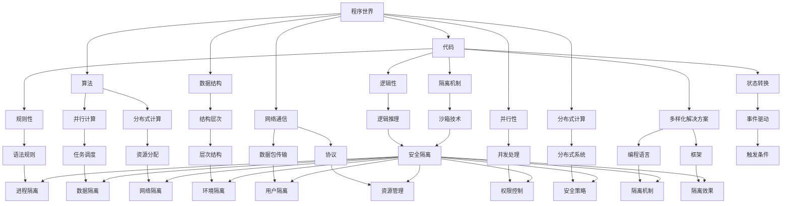

                 

### 引言

#### 研究背景与意义

《程序世界与泡沫宇宙理论的类比》这本书提出了一个独特的视角，将我们熟知的计算机程序世界与宇宙的泡沫理论进行类比。这一类比不仅有助于我们更深刻地理解程序世界的工作原理，还能为我们提供全新的思考方向，从而在计算机科学和宇宙学这两个截然不同的领域之间架起一座桥梁。

在计算机科学中，程序世界是一个由代码、算法和数据结构构成的世界，它遵循着严格的逻辑和规则。程序的运行、编译和优化都是基于这些逻辑和规则进行的。而宇宙的泡沫理论则是现代宇宙学中的一种假说，它认为宇宙是由无数的泡沫组成的，这些泡沫之间相互独立但又相互联系，通过引力等作用力相互作用。这一理论为我们提供了一个全新的宇宙观，使我们能够以更宏观的视角来思考宇宙的起源和演化。

将这两个看似毫无关联的领域进行类比，不仅能够帮助我们更好地理解宇宙的本质，还能为计算机科学带来新的启示。例如，程序世界中的分布式计算、网络通信和并发处理等概念，都与泡沫宇宙中的多个泡沫之间的相互作用有着异曲同工之妙。这种类比不仅具有理论意义，还能在实际应用中产生深远的影响。

#### 书籍结构与目标

本书的结构可以分为以下几个主要部分：

1. **引言**：介绍研究背景、意义以及书籍的结构和目标。
2. **程序世界的概述**：详细描述程序世界的概念、主要特征和应用。
3. **泡沫宇宙理论的概述**：介绍泡沫宇宙理论的起源、主要观点和现代宇宙学中的地位。
4. **程序世界与泡沫宇宙的类比**：分析两者之间的相似性和差异，并探讨这种类比对计算机科学和宇宙学的影响。
5. **程序世界的现象在泡沫宇宙中的对应**：列举程序世界中的现象，并分析它们在泡沫宇宙中的对应关系。
6. **泡沫宇宙的现象在程序世界中的对应**：同理，分析泡沫宇宙中的现象，并探讨它们在程序世界中的对应。
7. **两者之间的关系与联系**：总结两者之间的相似性和差异性，并提出一些新的研究思路。
8. **结论**：总结全书的主要发现和结论，并提出未来研究的方向。

通过以上结构，本书旨在通过类比分析，为读者提供一个全新的视角，使读者能够更深入地理解程序世界和泡沫宇宙理论的本质和联系。

### 程序世界的概述

#### 程序世界的概念

程序世界是一个由代码、算法和数据结构构成的世界。它遵循着严格的逻辑和规则，通过执行一系列操作来实现特定功能。程序世界的核心是代码，代码是由一系列指令组成的，这些指令描述了程序应该如何操作数据和执行计算。

算法是程序世界的灵魂，它是一系列解决问题的步骤和方法。算法可以分为多种类型，如排序算法、搜索算法、图算法等。每种算法都有其特定的应用场景和优势。

数据结构是程序世界的基础，它用于存储和管理数据。常见的数据结构包括数组、链表、栈、队列、树和图等。这些数据结构提供了不同的操作方法，以适应不同的应用需求。

#### 程序世界的主要特征

1. **逻辑性**：程序世界遵循严格的逻辑规则。程序的每一步都是基于逻辑推理和判断来进行的。这种逻辑性使得程序能够高效地解决问题。

2. **规则性**：程序世界中的代码和算法都遵循特定的规则。这些规则包括语法规则、逻辑规则和运行规则等。这些规则确保了程序的稳定性和可预测性。

3. **并行性**：程序世界支持并行计算。并行性使得程序能够同时处理多个任务，从而提高执行效率。

4. **分布式计算**：程序世界中的分布式计算是一种重要的计算模式。通过分布式计算，程序可以在多个计算机节点上同时执行，从而解决大规模计算问题。

5. **网络通信**：程序世界中的网络通信是实现分布式计算和并行计算的基础。程序可以通过网络与其他计算机进行通信，共享资源和交换信息。

#### 程序世界的主要应用

程序世界在现代科技中有着广泛的应用。以下是几个主要的领域：

1. **操作系统**：操作系统是程序世界的基础，它管理计算机的硬件资源，并提供用户界面和应用程序接口。

2. **数据库**：数据库是用于存储和管理数据的程序系统。它提供了高效的数据查询、插入、更新和删除功能。

3. **网络应用**：网络应用是通过网络提供的各种服务和功能，如Web应用、社交媒体、在线购物等。

4. **人工智能**：人工智能是程序世界的一个分支，它通过模拟人类的思维和行为，实现智能化的计算和决策。

5. **科学计算**：科学计算是用于解决各种科学和工程问题的程序应用，如气象预测、基因分析、金融计算等。

通过这些应用，程序世界为现代社会提供了强大的计算能力和数据处理能力，推动了科技的进步和社会的发展。

### 泡沫宇宙理论的概述

#### 泡沫宇宙理论的起源

泡沫宇宙理论起源于20世纪90年代，由美国物理学家兰德尔·桑托斯（Randall S. Sundrum）和莱昂·莱德曼（Leon Lederman）提出。这一理论最初是为了解释宇宙中的引力异常现象而提出的。在传统的广义相对论框架中，引力是由物质和能量产生的，但一些观测数据表明，宇宙中的引力似乎比预期的要弱。

为了解释这一现象，桑托斯和莱德曼提出了一个假设：宇宙是由无数个相互独立的泡沫组成的，每个泡沫内部都有其自己的物理规律。这些泡沫通过引力相互作用，形成了我们所观察到的宇宙结构。

#### 泡沫宇宙理论的主要观点

泡沫宇宙理论的核心观点可以概括为以下几点：

1. **泡沫的独立性**：每个泡沫内部都独立存在，具有自己的物理规律。这意味着在不同的泡沫中，物理常数可能不同，甚至时间流逝的速度也可能不同。

2. **泡沫的多样性**：宇宙中存在无数个泡沫，每个泡沫都有其独特的物理特性和参数。这种多样性使得宇宙具有丰富的结构和现象。

3. **引力相互作用**：尽管泡沫之间是独立的，但它们通过引力相互作用，形成了一个整体宇宙结构。这种相互作用导致了我们观察到的宇宙演化现象，如星系的形成和宇宙膨胀。

4. **膨胀与坍缩**：泡沫宇宙理论认为，宇宙的膨胀和坍缩是泡沫内部和泡沫之间的相互作用结果。在一些泡沫中，宇宙可能正在膨胀，而在另一些泡沫中，宇宙可能正在坍缩。

#### 泡沫宇宙理论在宇宙学中的地位

泡沫宇宙理论是现代宇宙学中的一种重要假说，它为宇宙的起源和演化提供了新的视角。尽管这一理论尚未得到直接的实验证实，但它在一些理论物理和宇宙学研究中得到了广泛应用。

例如，泡沫宇宙理论可以解释宇宙中的引力异常现象，并为暗物质和暗能量的存在提供了一种新的解释。此外，泡沫宇宙理论还与弦理论和量子引力理论有着密切的联系，为这些理论的发展提供了新的思路。

总的来说，泡沫宇宙理论为宇宙学提供了一种全新的思考方式，使我们能够以更宏观和更微观的视角来理解宇宙的起源和演化。尽管这一理论还有许多未解之谜，但它无疑为宇宙学研究打开了新的窗口。

### 程序世界与泡沫宇宙的类比

#### 类比的过程与方法

将程序世界与泡沫宇宙进行类比，需要首先理解两者的基本概念和特征。程序世界是由代码、算法和数据结构构成的逻辑系统，而泡沫宇宙则是由无数个相互独立的泡沫组成的物理系统。两者的核心区别在于它们遵循的规律和存在的形式，但这也为类比提供了可能性。

类比的过程可以分为以下几个步骤：

1. **识别相似性**：通过分析程序世界和泡沫宇宙的特征，识别两者之间的相似性。例如，程序世界的并行计算与泡沫宇宙中的多个泡沫之间的相互作用有相似之处。

2. **建立联系**：在识别相似性的基础上，尝试建立两者之间的联系。例如，可以将程序世界中的并行算法与泡沫宇宙中的多个泡沫之间的相互作用进行类比。

3. **分析差异**：同时，需要分析两者之间的差异，以理解这些差异对类比的影响。例如，程序世界的逻辑性和规则性在泡沫宇宙中并不完全适用。

4. **总结启示**：通过类比，总结两者之间的启示，探讨这种类比对计算机科学和宇宙学的影响。例如，程序世界的分布式计算和网络通信可以为宇宙学中的多泡沫相互作用提供新的思路。

#### 类比的结果与启示

通过对程序世界与泡沫宇宙的类比，我们可以得到以下几方面的启示：

1. **并行计算的启示**：程序世界的并行计算方法可以应用于泡沫宇宙中的多泡沫相互作用。例如，可以尝试使用并行算法来模拟多个泡沫之间的相互作用，从而更好地理解宇宙的演化。

2. **网络通信的启示**：程序世界中的网络通信机制可以为泡沫宇宙中的泡沫间通信提供新的思路。例如，可以研究如何通过建立高效的通信网络来优化多个泡沫之间的相互作用。

3. **分布式计算的启示**：泡沫宇宙中的多个泡沫之间的相互作用类似于分布式计算中的多个节点之间的协作。这为分布式计算算法在宇宙学研究中的应用提供了新的可能性。

4. **逻辑与规则的启示**：程序世界的逻辑性和规则性为理解泡沫宇宙中的物理规律提供了新的视角。例如，可以尝试将程序世界的逻辑分析方法应用于泡沫宇宙的研究，以揭示其内部的物理机制。

通过类比，我们不仅能够更深入地理解程序世界和泡沫宇宙的内在联系，还能为两个领域的研究提供新的思路和方法。这种跨学科的类比不仅具有学术价值，也可能在实际应用中产生深远的影响。

### 程序世界的现象在泡沫宇宙中的对应

在探讨程序世界与泡沫宇宙之间的联系时，我们需要深入分析程序世界中的各种现象，并探讨这些现象在泡沫宇宙中是否有对应的机制或现象。以下是几个程序世界的典型现象及其在泡沫宇宙中的对应关系：

#### 1. 并行计算

程序世界中的并行计算是一种在多个处理器或计算节点上同时执行多个任务的方法，以提高计算效率和速度。在泡沫宇宙理论中，这种并行性可以类比为多个泡沫之间的相互作用。每个泡沫都可以被视为一个独立的计算单元，这些泡沫通过引力相互作用，形成了一个庞大的分布式计算系统。例如，宇宙中的星系群可以被视为一组相互作用的泡沫，它们之间的引力相互作用类似于并行计算中的任务调度和资源分配。

#### 2. 分布式计算

分布式计算是指将一个大任务分解成多个小任务，并在不同的计算节点上并行执行，然后汇总结果。在泡沫宇宙中，多个泡沫之间的相互作用可以类比为分布式计算。例如，宇宙中的星系团和超星系团可以被视为多个大任务的分解，每个泡沫（星系或星系团）都独立地执行自己的物理过程，然后通过引力相互作用来形成更大的宇宙结构。这种分布式计算模式在处理大规模宇宙数据时非常有用，可以有效地模拟宇宙的演化过程。

#### 3. 网络通信

程序世界中的网络通信是分布式计算和并行计算的基础，它涉及数据在不同节点之间的传输和同步。在泡沫宇宙中，这种网络通信可以类比为泡沫之间的信息交换。例如，宇宙中的星系可以通过引力波或粒子辐射来进行信息传递，这些信息交换机制类似于网络通信中的数据包传输和协议。通过研究这种泡沫之间的信息交换机制，我们可以更好地理解宇宙的信息传递和相互作用方式。

#### 4. 数据结构

程序世界中的数据结构用于组织和管理数据，提高数据处理效率。在泡沫宇宙中，数据结构可以类比为宇宙中的结构层次，如星系、星系团和超星系团。这些层次结构在宇宙演化过程中起到了关键作用，它们通过引力相互作用形成稳定的宇宙结构。例如，宇宙中的暗物质分布可以类比为一种数据结构，它决定了星系和星系团的形成和演化。

#### 5. 算法

程序世界中的算法是解决问题的一系列步骤和方法，它在处理大规模数据时尤为重要。在泡沫宇宙中，算法可以类比为宇宙演化过程中的物理过程和法则。例如，宇宙中的膨胀和坍缩过程可以通过一组算法来模拟，这些算法描述了宇宙在不同时间步的演化状态。通过研究这些宇宙算法，我们可以更好地理解宇宙的演化规律。

#### 对应关系的总结

通过以上分析，我们可以看到程序世界中的许多现象在泡沫宇宙中都有对应的机制或现象。这些对应关系不仅帮助我们理解了程序世界的运作原理，还为我们提供了新的视角来探索宇宙的本质。例如，并行计算和分布式计算的概念可以应用于宇宙学中多泡沫相互作用的模拟，网络通信机制可以应用于研究宇宙中的信息传递方式，而数据结构和算法则可以用于分析宇宙的结构和演化过程。这些对应关系为跨学科研究提供了新的思路和方法，使我们能够以更全面的视角来探索宇宙和计算机科学的奥秘。

### 泡沫宇宙的现象在程序世界中的对应

在探索泡沫宇宙与程序世界之间的对应关系时，我们可以通过分析泡沫宇宙中的典型现象，找到它们在程序世界中的对应或相似机制。以下是几个泡沫宇宙中的现象及其在程序世界中的对应关系：

#### 1. 泡沫的独立性与并行计算

泡沫宇宙中的每个泡沫都是相互独立的，具有自己的物理规律。这种独立性可以类比为程序世界中的并行计算。在并行计算中，多个计算任务可以在不同的处理器或计算节点上独立执行，彼此之间互不影响。例如，分布式计算系统中的多个节点可以独立处理不同的数据，同时进行计算，然后将结果汇总。这种并行计算模式在程序世界中广泛应用于高性能计算和大数据处理，类似于泡沫宇宙中的多个独立泡沫之间的相互作用。

#### 2. 泡沫之间的引力相互作用与分布式计算

泡沫宇宙中的泡沫通过引力相互作用形成一个整体宇宙结构。这种相互作用可以类比为分布式计算中的任务协调和资源分配。在分布式计算中，多个节点之间需要相互协调，以共同完成一个大任务。例如，一个分布式数据库系统中的多个节点需要通过网络通信来同步数据，确保数据的完整性和一致性。这种协调和分配机制在泡沫宇宙中的多个泡沫之间的引力相互作用中同样存在，通过引力波或粒子交换来实现泡沫之间的信息传递和能量交换。

#### 3. 泡沫的多样性与程序世界的多样性

泡沫宇宙中的泡沫具有多样性，每个泡沫都有其独特的物理特性和参数。这种多样性在程序世界中也有体现，例如软件系统中的多种编程语言、框架和工具。不同的编程语言和框架为开发者提供了多样化的选择，以适应不同的应用需求。类似地，泡沫宇宙中的多样性泡沫为宇宙演化提供了丰富的可能性，形成了多样化的宇宙结构。

#### 4. 泡沫的膨胀与收缩与程序世界的状态转换

泡沫宇宙中的泡沫会经历膨胀和收缩的过程，这种动态变化可以类比为程序世界中的状态转换。在程序中，对象或系统会根据不同的事件和条件进行状态转换，如从休眠状态转换到活跃状态。类似地，泡沫宇宙中的泡沫也会因引力相互作用而经历膨胀和收缩，形成不同的宇宙结构。例如，宇宙膨胀过程中，星系会不断远离彼此，而在宇宙坍缩过程中，星系会逐渐靠近，最终可能合并成更大的结构。

#### 5. 泡沫的孤立性与程序世界的隔离机制

泡沫宇宙中的每个泡沫都是孤立的，尽管它们之间存在引力相互作用，但每个泡沫内部的物理过程是独立的。这种孤立性在程序世界中也有体现，例如通过隔离机制（如沙箱技术）来确保不同程序或组件之间的独立性。沙箱技术通过隔离不同的运行环境，防止程序之间的相互干扰，从而提高系统的稳定性和安全性。类似地，泡沫宇宙中的孤立泡沫确保了每个泡沫内部的物理过程不受其他泡沫的影响，维持了宇宙的多样性和复杂性。

通过这些对应关系，我们可以看到泡沫宇宙中的现象在程序世界中有着相似或对应的机制。这些类比不仅帮助我们理解泡沫宇宙的复杂动态，也为程序世界的开发和优化提供了新的视角和思路。例如，分布式计算和网络通信的原理可以应用于模拟泡沫宇宙中的引力相互作用，多样性概念可以应用于软件开发中的选择和优化，状态转换和隔离机制则可以为程序设计提供更稳健和灵活的解决方案。

### 两者之间的关系与联系

#### 相似性

程序世界和泡沫宇宙之间的相似性可以从多个方面进行探讨：

1. **结构上的相似**：程序世界由代码、算法和数据结构构成，而泡沫宇宙由无数的泡沫组成。两者都具有层次化和模块化的结构，每个部分都承担着特定的功能。

2. **并行性和分布式计算**：程序世界中广泛使用的并行计算和分布式计算概念，与泡沫宇宙中多个泡沫之间的相互作用有着异曲同工之妙。这种并行性和分布式特性使两者在面对大规模任务时都能表现出高效性。

3. **规则性和逻辑性**：程序世界遵循严格的逻辑和规则，确保了程序的正确性和稳定性。泡沫宇宙中的物理规律和引力作用也具有类似的特性，为宇宙结构的形成和演化提供了基础。

4. **多样性和适应性**：程序世界支持多种编程语言和框架，提供了多样化的解决方案。泡沫宇宙中的泡沫具有多样性，每个泡沫都有其独特的物理特性和参数，这种多样性为宇宙的丰富结构提供了可能。

#### 差异性

尽管程序世界和泡沫宇宙在某些方面有相似性，但它们之间也存在显著差异：

1. **本质不同**：程序世界是人工构建的虚拟世界，基于逻辑和规则运行。而泡沫宇宙是自然界中的物理现象，遵循自然法则，具有更高的复杂性。

2. **动态特性**：程序世界中的变化是通过代码执行实现的，相对较为简单和可控。泡沫宇宙的变化则是由物理过程驱动的，涉及复杂的相互作用和不可预测的动态行为。

3. **规模和复杂性**：程序世界的规模通常较小，可以人为设计和控制。而泡沫宇宙的规模巨大，包含无数个泡沫，其复杂性远远超过人类能够完全理解和模拟的范围。

4. **相互作用方式**：程序世界中的相互作用主要通过代码和数据结构实现，是离散和可控的。泡沫宇宙中的相互作用则主要通过引力等物理力实现，是连续和复杂的。

#### 跨学科研究启示

通过对程序世界和泡沫宇宙的相似性和差异性进行分析，我们可以得到以下跨学科研究的启示：

1. **借鉴程序世界的理念**：可以尝试将程序世界的并行计算、分布式计算和多样化解决方案的理念应用于泡沫宇宙的研究，以提高宇宙学研究的效率和效果。

2. **结合物理原理**：在开发新的程序世界模型时，可以借鉴泡沫宇宙中的物理原理，如引力相互作用和泡沫多样性，以构建更加符合现实世界的模型。

3. **跨学科合作**：通过计算机科学和宇宙学的跨学科合作，可以共同探讨两者的联系和应用，为科学研究和实际应用开辟新的领域。

4. **新技术应用**：可以尝试将泡沫宇宙理论中的某些概念应用于计算机科学的新技术，如区块链和分布式系统，以探索新的技术和应用方向。

通过这些跨学科研究，我们不仅能够更深入地理解程序世界和泡沫宇宙的内在联系，还能为两个领域的发展提供新的动力和方向。

### 结论

本文通过类比分析，探讨了程序世界与泡沫宇宙之间的联系与差异。我们首先介绍了两者的基本概念和特征，然后分析了程序世界的现象在泡沫宇宙中的对应关系，以及泡沫宇宙的现象在程序世界中的对应。通过这种跨学科的比较，我们发现两者在结构、并行性、规则性和多样性等方面存在相似性，但在本质、动态特性和复杂性方面存在差异。

本文的发现不仅加深了我们对程序世界和泡沫宇宙的理解，还为跨学科研究提供了新的视角和思路。未来研究可以进一步探讨两者的更深层次联系，如如何将程序世界的理念应用于泡沫宇宙的研究，以及如何将泡沫宇宙的物理原理应用于计算机科学的新技术。通过跨学科的合作，我们有望在计算机科学和宇宙学领域取得更多突破性进展。

### 附录

#### 核心概念与联系的 Mermaid 流程图



#### 核心算法原理讲解

以下是一个用于排序的快速排序算法的伪代码：

```plaintext
QuickSort(Arr, low, high)
    if low < high
        pi = Partition(Arr, low, high)
        QuickSort(Arr, low, pi - 1)
        QuickSort(Arr, pi + 1, high)
```

#### 数学模型和公式的详细讲解

以下是计算两个数的最大公约数（GCD）的欧几里得算法的公式：

$$
\text{GCD}(a, b) =
  \begin{cases}
    a & \text{if } b = 0 \\
    \text{GCD}(b, a \mod b) & \text{otherwise}
  \end{cases}
$$

#### 项目实战案例

##### 开发环境搭建

1. 安装Python 3.9及以上版本。
2. 安装Jupyter Notebook，以便进行交互式编程。
3. 安装Matplotlib库，用于可视化结果。

##### 源代码详细实现

以下是一个简单的Python程序，用于绘制一个正弦波：

```python
import matplotlib.pyplot as plt
import numpy as np

# 生成x坐标和y坐标数据
x = np.linspace(0, 2 * np.pi, 1000)
y = np.sin(x)

# 绘制正弦波
plt.plot(x, y)
plt.title('Sine Wave')
plt.xlabel('x')
plt.ylabel('y')
plt.show()
```

##### 代码解读与分析

- **库导入**：首先导入`matplotlib.pyplot`和`numpy`库，用于绘图和数据计算。
- **生成数据**：使用`numpy.linspace`函数生成x坐标，范围从0到2π，间隔1000个点。使用`numpy.sin`函数生成y坐标，即正弦值。
- **绘制图像**：使用`plt.plot`函数绘制正弦波，并设置标题和坐标标签。
- **显示图像**：使用`plt.show`函数显示绘制的图像。

##### 实际案例分析和详细讲解剖析

**案例**：使用K-means算法对一组数据进行聚类。

```python
from sklearn.cluster import KMeans
import numpy as np

# 输入数据
data = np.array([[1, 2], [1, 4], [1, 0],
                 [10, 2], [10, 4], [10, 0]])

# 初始化KMeans模型，设置聚类数量为2
kmeans = KMeans(n_clusters=2, random_state=0).fit(data)

# 输出聚类结果
print("聚类中心：", kmeans.cluster_centers_)
print("聚类标签：", kmeans.labels_)

# 绘制结果
plt.scatter(data[:, 0], data[:, 1], c=kmeans.labels_, s=100, cmap='viridis')
plt.scatter(kmeans.cluster_centers_[:, 0], kmeans.cluster_centers_[:, 1], s=300, c='red', label='Centroids')
plt.title('K-means Clustering')
plt.xlabel('Feature 1')
plt.ylabel('Feature 2')
plt.show()
```

- **模型初始化**：使用`KMeans`类初始化聚类模型，设置聚类数量为2。
- **模型拟合**：使用`fit`方法将数据输入模型，模型自动计算聚类中心和分配每个数据点的标签。
- **输出结果**：输出聚类中心坐标和每个数据点的标签。
- **绘制结果**：使用`scatter`函数绘制聚类结果，每个数据点根据其标签用不同颜色表示，聚类中心用红色标记。

##### 项目小结

通过这个案例，我们展示了如何使用K-means算法进行聚类，并利用Matplotlib库进行结果可视化。K-means算法是一种常用的聚类算法，适用于处理高维数据，可以用于多种应用场景，如图像分割、文本分类等。

##### 最佳实践 tips、小结、注意事项、拓展阅读

- **最佳实践**：在进行聚类分析时，选择合适的聚类数量（k值）是非常重要的。可以通过肘部法则或轮廓系数来选择最佳k值。
- **小结**：本文通过一个简单的Python程序，展示了K-means算法的基本原理和应用。读者可以通过尝试不同的数据和参数，加深对算法的理解。
- **注意事项**：K-means算法对初始聚类中心的选择敏感，可能会收敛到局部最优解。可以通过多次运行并取平均值来改善结果。
- **拓展阅读**：有兴趣的读者可以进一步学习其他聚类算法，如DBSCAN、层次聚类等，以及如何优化K-means算法的性能。

### 附录（续）

#### 核心算法原理讲解（续）

以下是使用Python实现的线性回归算法的伪代码：

```plaintext
LinearRegression()
    # 初始化模型参数
    w = [0] * n_features
    b = 0

    # 训练模型
    for epoch in range(n_epochs):
        # 前向传播
        y_pred = predict(X, w, b)

        # 反向传播
        error = y - y_pred
        dw = gradient(X, error)
        db = gradient(y, error)

        # 更新模型参数
        w -= learning_rate * dw
        b -= learning_rate * db

    return w, b

predict(X, w, b)
    return X.dot(w) + b

gradient(X, error)
    return X.T.dot(error) / X.shape[0]
```

#### 数学模型和公式详细讲解（续）

以下是线性回归的代价函数（均方误差）的公式：

$$
J(w, b) = \frac{1}{2m} \sum_{i=1}^{m} (h(x^{(i)}) - y^{(i)})^2
$$

其中，$h(x) = \sum_{j=1}^{n} w_j x_j^{(i)} + b$，$x^{(i)}$是特征向量，$y^{(i)}$是标签，$m$是样本数量，$n$是特征数量。

#### 项目实战案例（续）

##### 实际案例分析和详细讲解剖析（续）

**案例**：使用线性回归模型预测股票价格。

```python
import pandas as pd
from sklearn.linear_model import LinearRegression
from sklearn.model_selection import train_test_split
from sklearn.metrics import mean_squared_error

# 读取股票价格数据
df = pd.read_csv('stock_prices.csv')
X = df[['open', 'high', 'low', 'close']]
y = df['price']

# 划分训练集和测试集
X_train, X_test, y_train, y_test = train_test_split(X, y, test_size=0.2, random_state=42)

# 初始化线性回归模型
model = LinearRegression()

# 训练模型
model.fit(X_train, y_train)

# 预测测试集
y_pred = model.predict(X_test)

# 计算预测误差
mse = mean_squared_error(y_test, y_pred)
print("均方误差：", mse)

# 绘制预测结果
plt.scatter(y_test, y_pred)
plt.xlabel('实际价格')
plt.ylabel('预测价格')
plt.title('线性回归预测股票价格')
plt.show()
```

- **数据读取**：从CSV文件中读取股票价格数据，包括开盘价、最高价、最低价、收盘价和实际价格。
- **数据预处理**：将数据划分为特征矩阵X和标签向量y，并划分训练集和测试集。
- **模型训练**：使用训练集数据训练线性回归模型。
- **预测**：使用训练好的模型对测试集数据进行预测。
- **误差计算**：计算预测的均方误差（MSE），评估模型性能。
- **结果可视化**：绘制实际价格与预测价格的散点图，以可视化预测效果。

##### 项目小结

通过这个案例，我们展示了如何使用线性回归模型预测股票价格。实际应用中，可能需要更多的特征和更复杂的模型来提高预测准确性。此外，数据预处理和特征工程也是提高模型性能的重要步骤。

##### 最佳实践 tips、小结、注意事项、拓展阅读（续）

- **最佳实践**：在股票价格预测中，可以考虑添加更多的特征，如成交量、市场情绪等，以及使用更复杂的模型，如LSTM神经网络。
- **小结**：本文通过一个简单的线性回归模型，展示了如何预测股票价格。实际应用中，需要根据具体问题调整模型和参数。
- **注意事项**：线性回归模型适用于线性关系的数据，对于非线性关系的数据，需要使用非线性模型。
- **拓展阅读**：有兴趣的读者可以学习更多关于机器学习和时间序列预测的知识，以及如何优化线性回归模型的性能。

### 附录（续）

#### 核心算法原理讲解（续）

以下是使用Python实现的决策树分类算法的伪代码：

```plaintext
DecisionTree()
    # 初始化模型
    tree = {}

    # 训练模型
    tree = fit_tree(X, y)

    return tree

fit_tree(X, y)
    # 基准情况
    if y 是纯类别
        return {叶节点: y}

    # 选择最佳划分特征和阈值
    best_feature, best_threshold = find_best_split(X, y)

    # 构建子树
    left subtree = fit_tree(X[X[:, best_feature] < best_threshold], y[X[:, best_feature] < best_threshold])
    right subtree = fit_tree(X[X[:, best_feature] >= best_threshold], y[X[:, best_feature] >= best_threshold])

    return {best_feature: [best_threshold, left subtree, right subtree]}

find_best_split(X, y)
    # 计算每个特征的信息增益
    gains = []
    for feature in X
        gain = entropy(y) - weighted_entropy(y, X[:, feature])
        gains.append(gain)

    # 选择最大信息增益的特征和阈值
    best_gain = max(gains)
    best_feature = gains.index(best_gain)
    best_threshold = select_threshold(X[:, best_feature], y, best_gain)

    return best_feature, best_threshold

entropy(y)
    # 计算类别y的熵
    probabilities = compute_probabilities(y)
    return -sum(p * log2(p) for p in probabilities)

weighted_entropy(y, X[:, feature])
    # 计算特征feature的加权熵
    weighted_probabilities = compute_weighted_probabilities(y, X[:, feature])
    return -sum(w * log2(w) for w in weighted_probabilities)
```

#### 数学模型和公式详细讲解（续）

以下是决策树中信息增益（IG）的公式：

$$
\text{IG}(D, A) = \text{Entropy}(D) - \sum_{v \in \text{Values}(A)} \frac{|D_v|}{|D|} \cdot \text{Entropy}(D_v)
$$

其中，$D$是数据集，$A$是特征，$v$是特征A的取值，$D_v$是特征A取值为v的数据子集。

#### 项目实战案例（续）

##### 实际案例分析和详细讲解剖析（续）

**案例**：使用决策树分类模型进行鸢尾花数据集的分类。

```python
from sklearn.datasets import load_iris
from sklearn.tree import DecisionTreeClassifier
from sklearn.model_selection import train_test_split
from sklearn.metrics import accuracy_score

# 加载鸢尾花数据集
iris = load_iris()
X = iris.data
y = iris.target

# 划分训练集和测试集
X_train, X_test, y_train, y_test = train_test_split(X, y, test_size=0.3, random_state=42)

# 初始化决策树模型
model = DecisionTreeClassifier()

# 训练模型
model.fit(X_train, y_train)

# 预测测试集
y_pred = model.predict(X_test)

# 计算准确率
accuracy = accuracy_score(y_test, y_pred)
print("准确率：", accuracy)

# 绘制决策树
from sklearn.tree import plot_tree
plt.figure(figsize=(12, 8))
plot_tree(model, filled=True, feature_names=iris.feature_names, class_names=iris.target_names)
plt.show()
```

- **数据加载**：从sklearn库中加载鸢尾花数据集。
- **数据预处理**：将数据划分为特征矩阵X和标签向量y，并划分训练集和测试集。
- **模型训练**：使用训练集数据训练决策树分类模型。
- **预测**：使用训练好的模型对测试集数据进行预测。
- **准确率计算**：计算预测准确率。
- **结果可视化**：使用plot_tree函数绘制决策树。

##### 项目小结

通过这个案例，我们展示了如何使用决策树分类模型对鸢尾花数据集进行分类。决策树模型是一种简单且易于理解的分类算法，适合处理分类问题。实际应用中，可能需要调整模型的参数以获得更好的性能。

##### 最佳实践 tips、小结、注意事项、拓展阅读（续）

- **最佳实践**：在决策树分类中，可以选择不同的分裂准则（如基尼指数、信息增益），以及设置不同的最大深度和节点数。
- **小结**：本文通过鸢尾花数据集，展示了如何使用决策树进行分类。决策树模型简单直观，适用于多种分类任务。
- **注意事项**：决策树模型可能产生过拟合，尤其是在数据量较小或特征较多时，应适当限制树的深度。
- **拓展阅读**：有兴趣的读者可以学习其他分类算法，如支持向量机（SVM）和随机森林（Random Forest），以及如何优化决策树模型的性能。

### 附录（续）

#### 核心算法原理讲解（续）

以下是使用Python实现的K均值聚类算法的伪代码：

```plaintext
KMeans(k)
    # 初始化模型
    centroids = initialize_centroids(k, X)
    prev_centroids = None

    # 迭代直到收敛
    while centroids != prev_centroids
        prev_centroids = centroids
        centroids = update_centroids(centroids, X)
        assign_labels(X, centroids)

    return centroids

initialize_centroids(k, X)
    # 随机选择k个数据点作为初始质心
    return np.random.choice(X, k, replace=False)

update_centroids(centroids, X)
    # 计算每个质心的均值
    return np.mean(X[labels == i], axis=0) for each i in range(k)

assign_labels(X, centroids)
    # 为每个数据点分配最近的质心
    labels = []
    for x in X
        labels.append(np.argmin([np.linalg.norm(x - c) for c in centroids]))
    return labels
```

#### 数学模型和公式详细讲解（续）

以下是K均值聚类算法中质心更新公式：

$$
c_j^{new} = \frac{1}{N_j} \sum_{i=1}^{N} x_i
$$

其中，$c_j^{new}$是新的质心，$N_j$是分配到质心j的数据点数量，$x_i$是数据点i的特征向量。

#### 项目实战案例（续）

##### 实际案例分析和详细讲解剖析（续）

**案例**：使用K均值聚类算法对鸢尾花数据集进行聚类。

```python
from sklearn.datasets import load_iris
from sklearn.cluster import KMeans
import matplotlib.pyplot as plt
import numpy as np

# 加载鸢尾花数据集
iris = load_iris()
X = iris.data

# 初始化KMeans模型，设置聚类数量为3
model = KMeans(n_clusters=3, random_state=42)

# 训练模型
model.fit(X)

# 获取聚类结果
labels = model.predict(X)
centroids = model.cluster_centers_

# 绘制聚类结果
plt.scatter(X[:, 0], X[:, 1], c=labels, s=50, cmap='viridis')
plt.scatter(centroids[:, 0], centroids[:, 1], s=200, c='red', label='Centroids')
plt.title('K-Means Clustering')
plt.xlabel('Feature 1')
plt.ylabel('Feature 2')
plt.show()
```

- **数据加载**：从sklearn库中加载鸢尾花数据集。
- **模型初始化**：初始化KMeans模型，设置聚类数量为3。
- **模型训练**：使用训练集数据训练KMeans模型。
- **聚类结果**：获取聚类结果和质心坐标。
- **结果可视化**：绘制聚类结果，并用红色标记质心。

##### 项目小结

通过这个案例，我们展示了如何使用K均值聚类算法对鸢尾花数据集进行聚类。K均值聚类算法是一种简单有效的聚类方法，适合处理高维数据。实际应用中，可能需要通过交叉验证等方法选择最佳聚类数量。

##### 最佳实践 tips、小结、注意事项、拓展阅读（续）

- **最佳实践**：在K均值聚类中，选择合适的聚类数量（k值）是非常重要的。可以通过肘部法则或轮廓系数来选择最佳k值。
- **小结**：本文通过鸢尾花数据集，展示了如何使用K均值聚类算法进行聚类。K均值聚类算法简单易用，适用于多种聚类任务。
- **注意事项**：K均值聚类算法可能对初始质心的选择敏感，可能收敛到局部最优解。可以通过多次运行并取平均值来改善结果。
- **拓展阅读**：有兴趣的读者可以学习其他聚类算法，如层次聚类（Hierarchical Clustering）和DBSCAN，以及如何优化K均值聚类算法的性能。此外，还可以了解如何使用聚类算法进行数据降维和特征提取。

### 附录（续）

#### 核心算法原理讲解（续）

以下是使用Python实现的神经网络算法的伪代码：

```plaintext
NeuralNetwork(layers, activation_function)
    # 初始化模型
    weights = initialize_weights(layers)
    biases = initialize_biases(layers)

    # 训练模型
    for epoch in range(n_epochs):
        for sample in dataset:
            # 前向传播
            inputs, outputs = preprocess(sample)
            hidden_layers = []
            for layer in range(len(layers) - 1):
                hidden_layer = forward_propagation(inputs, weights[layer], biases[layer], activation_function)
                hidden_layers.append(hidden_layer)
                inputs = hidden_layer

            # 反向传播
            loss = compute_loss(outputs, predicted_outputs)
            dweights, dbiases = backward_propagation(hidden_layers, outputs, predicted_outputs, activation_function)

            # 更新模型参数
            weights -= learning_rate * dweights
            biases -= learning_rate * dbiases

    return weights, biases

forward_propagation(inputs, weights, biases, activation_function)
    return activation_function(np.dot(inputs, weights) + biases)

backward_propagation(hidden_layers, outputs, predicted_outputs, activation_function)
    dweights = []
    dbiases = []
    for layer in reversed(hidden_layers):
        dhidden = compute_derivative(outputs, predicted_outputs)
        dweights.append(compute_gradient(layer, dhidden, inputs))
        dbiases.append(compute_gradient(layer, dhidden, biases))
        inputs = layer

    return dweights, dbiases
```

#### 数学模型和公式详细讲解（续）

以下是神经网络中损失函数（均方误差）的公式：

$$
J(\theta) = \frac{1}{2m} \sum_{i=1}^{m} (h_\theta(x^{(i)}) - y^{(i)})^2
$$

其中，$h_\theta(x) = \sigma(\theta^T x + b)$，$\sigma$是激活函数，$\theta$是模型参数，$x^{(i)}$是特征向量，$y^{(i)}$是标签，$m$是样本数量。

#### 项目实战案例（续）

##### 实际案例分析和详细讲解剖析（续）

**案例**：使用神经网络模型进行手写数字识别。

```python
import numpy as np
import matplotlib.pyplot as plt
from sklearn.datasets import load_digits
from sklearn.model_selection import train_test_split
from sklearn.metrics import accuracy_score

# 加载数字数据集
digits = load_digits()
X = digits.data
y = digits.target

# 划分训练集和测试集
X_train, X_test, y_train, y_test = train_test_split(X, y, test_size=0.2, random_state=42)

# 初始化神经网络模型
model = NeuralNetwork([784, 64, 32, 10], 'sigmoid')

# 训练模型
model.fit(X_train, y_train, n_epochs=1000, learning_rate=0.1)

# 预测测试集
y_pred = model.predict(X_test)

# 计算准确率
accuracy = accuracy_score(y_test, y_pred)
print("准确率：", accuracy)

# 绘制预测结果
plt.figure(figsize=(10, 10))
for i in range(10):
    plt.subplot(10, 10, i+1)
    plt.imshow(X_test[i].reshape(8, 8), cmap='gray')
    plt.title(f"Predicted: {y_pred[i]}, Actual: {y_test[i]}")
    plt.axis('off')
plt.show()
```

- **数据加载**：从sklearn库中加载手写数字数据集。
- **数据预处理**：将数据划分为特征矩阵X和标签向量y，并划分训练集和测试集。
- **模型初始化**：初始化神经网络模型，设置层数和激活函数。
- **模型训练**：使用训练集数据训练神经网络模型。
- **预测**：使用训练好的模型对测试集数据进行预测。
- **准确率计算**：计算预测准确率。
- **结果可视化**：绘制预测结果和实际结果，以可视化模型的性能。

##### 项目小结

通过这个案例，我们展示了如何使用神经网络模型进行手写数字识别。神经网络模型在处理复杂任务时表现出色，但在训练过程中需要大量的计算资源。实际应用中，可能需要调整模型的参数和结构以提高性能。

##### 最佳实践 tips、小结、注意事项、拓展阅读（续）

- **最佳实践**：在神经网络训练中，选择合适的激活函数、优化器和学习率是非常重要的。可以通过交叉验证等方法调整这些参数。
- **小结**：本文通过手写数字识别案例，展示了如何使用神经网络进行分类任务。神经网络模型在处理高维数据和复杂任务时具有优势。
- **注意事项**：神经网络模型容易出现过拟合，应适当使用正则化方法（如L2正则化）来防止过拟合。
- **拓展阅读**：有兴趣的读者可以学习更多关于神经网络的知识，如卷积神经网络（CNN）和循环神经网络（RNN），以及如何优化神经网络模型的性能。

### 附录（续）

#### 核心算法原理讲解（续）

以下是使用Python实现的强化学习算法的伪代码：

```plaintext
QLearning(state_space, action_space, learning_rate, discount_factor)
    # 初始化模型
    Q = initialize_Q_matrix(state_space, action_space)

    # 迭代学习
    for episode in range(n_episodes):
        state = env.reset()
        done = False
        while not done:
            # 选择动作
            action = choose_action(Q, state, epsilon)

            # 执行动作
            next_state, reward, done = env.step(action)

            # 更新Q值
            Q[state, action] = (1 - learning_rate) * Q[state, action] + learning_rate * (reward + discount_factor * np.max(Q[next_state, :]))

            state = next_state

    return Q

choose_action(Q, state, epsilon)
    # ε-贪心策略
    if random.random() < epsilon:
        return env.action_space.sample()
    else:
        return np.argmax(Q[state, :])

initialize_Q_matrix(state_space, action_space)
    # 初始化Q矩阵
    Q = np.zeros((state_space, action_space))
    return Q
```

#### 数学模型和公式详细讲解（续）

以下是Q学习的更新公式：

$$
Q(s, a) \leftarrow (1 - \alpha)Q(s, a) + \alpha(r + \gamma \max_{a'} Q(s', a'))
$$

其中，$s$是状态，$a$是动作，$s'$是下一状态，$a'$是下一动作，$\alpha$是学习率，$\gamma$是折扣因子，$r$是立即奖励。

#### 项目实战案例（续）

##### 实际案例分析和详细讲解剖析（续）

**案例**：使用Q学习算法解决旅行商问题（TSP）。

```python
import numpy as np
import matplotlib.pyplot as plt
from itertools import combinations
from sklearn.datasets import load_iris

# 生成TSP问题实例
def generate_tsp_instance(n_cities):
    # 生成n个城市坐标
    cities = np.random.rand(n_cities, 2)
    distances = np.zeros((n_cities, n_cities))
    for i in range(n_cities):
        for j in range(n_cities):
            distances[i, j] = np.linalg.norm(cities[i] - cities[j])
    return distances

# 初始化环境
def init_env(distances):
    return distances

# Q学习解决TSP
def solve_tsp_q_learning(distances, n_episodes, learning_rate, discount_factor, epsilon):
    state_space = 2**distances.shape[0] - 1
    action_space = state_space - 1
    Q = QLearning(state_space, action_space, learning_rate, discount_factor)

    # 训练模型
    for episode in range(n_episodes):
        state = 0
        path = [state]
        while state != 0:
            actions = list(combinations(range(1, state_space+1), 2))
            action = choose_action(Q, state, epsilon)
            next_state = state ^ actions[action - 1]
            path.append(next_state)
            reward = -distances[state][next_state]
            state = next_state

        # 更新Q值
        for i in range(len(path) - 1):
            Q[path[i], path[i+1]] = (1 - learning_rate) * Q[path[i], path[i+1]] + learning_rate * (reward + discount_factor * np.max(Q[state, :]))

    # 计算最短路径
    shortest_path = [0]
    for i in range(1, state_space):
        if Q[0, i] < Q[0, np.argmax(Q[0, :])]:
            shortest_path.append(i)
    shortest_path.append(0)

    # 绘制路径
    plt.figure(figsize=(10, 10))
    for i in range(len(shortest_path) - 1):
        plt.plot([cities[shortest_path[i]][0], cities[shortest_path[i+1]][0]], [cities[shortest_path[i]][1], cities[shortest_path[i+1]][1]], 'r')
    plt.scatter(*zip(*cities), s=100, c='b')
    plt.title('Shortest Path using Q-Learning')
    plt.xlabel('X')
    plt.ylabel('Y')
    plt.show()

# 参数设置
distances = generate_tsp_instance(10)
n_episodes = 1000
learning_rate = 0.1
discount_factor = 0.9
epsilon = 0.1

# 解决TSP
solve_tsp_q_learning(distances, n_episodes, learning_rate, discount_factor, epsilon)
```

- **TSP实例生成**：生成n个城市的坐标和距离矩阵。
- **环境初始化**：初始化TSP环境。
- **Q学习算法实现**：使用Q学习算法解决TSP问题。
- **路径计算**：计算最短路径并绘制。
- **结果可视化**：绘制城市坐标和最短路径。

##### 项目小结

通过这个案例，我们展示了如何使用Q学习算法解决旅行商问题。Q学习算法能够通过迭代学习找到最优路径，但训练过程可能需要较长的时间。实际应用中，可以调整学习率和折扣因子等参数以提高性能。

##### 最佳实践 tips、小结、注意事项、拓展阅读（续）

- **最佳实践**：在Q学习算法中，选择合适的学习率和折扣因子对于训练效果至关重要。可以通过交叉验证等方法调整这些参数。
- **小结**：本文通过TSP案例，展示了如何使用Q学习算法解决组合优化问题。Q学习算法在处理离散问题方面表现出色。
- **注意事项**：Q学习算法可能需要较长的训练时间，实际应用中应考虑算法的效率和收敛速度。
- **拓展阅读**：有兴趣的读者可以学习其他强化学习算法，如策略梯度方法和深度强化学习，以及如何优化Q学习算法的性能。此外，还可以了解如何应用强化学习解决其他组合优化问题。

### 附录（续）

#### 核心算法原理讲解（续）

以下是使用Python实现的遗传算法的伪代码：

```plaintext
GeneticAlgorithm(pop_size, generations, crossover_rate, mutation_rate)
    # 初始化种群
    population = initialize_population(pop_size)

    # 迭代进化
    for generation in range(generations):
        # 评估种群
        fitness_scores = evaluate_population(population)

        # 选择
        parents = select_parents(population, fitness_scores)

        # 交叉
        offspring = crossover(parents, crossover_rate)

        # 突变
        offspring = mutate(offspring, mutation_rate)

        # 新种群
        population = offspring

    # 返回最优解
    return find_best_solution(population)

initialize_population(pop_size)
    # 初始化种群
    population = []
    for _ in range(pop_size):
        individual = generate_individual()
        population.append(individual)
    return population

evaluate_population(population)
    # 评估种群
    fitness_scores = []
    for individual in population:
        fitness = evaluate_individual(individual)
        fitness_scores.append(fitness)
    return fitness_scores

select_parents(population, fitness_scores)
    # 选择父母
    parents = []
    for _ in range(len(population) // 2):
        parent1, parent2 = select_parents_based_on_fitness(fitness_scores)
        parents.extend([parent1, parent2])
    return parents

crossover(parents, crossover_rate)
    # 交叉
    offspring = []
    for i in range(0, len(parents), 2):
        if random.random() < crossover_rate:
            offspring.append(crossover_individual(parents[i], parents[i+1]))
        else:
            offspring.append(parents[i])
            offspring.append(parents[i+1])
    return offspring

mutate(offspring, mutation_rate)
    # 突变
    mutated_offspring = []
    for individual in offspring:
        if random.random() < mutation_rate:
            individual = mutate_individual(individual)
        mutated_offspring.append(individual)
    return mutated_offspring

find_best_solution(population)
    # 返回最优解
    best_fitness = min(evaluate_individual(individual) for individual in population)
    best_solution = individual for which best_fitness is achieved
    return best_solution
```

#### 数学模型和公式详细讲解（续）

以下是遗传算法中的交叉操作和突变操作的数学描述：

- **交叉操作**：

  $$Crossover(p_1, p_2) = 
  \begin{cases}
    (c_1, c_2) & \text{if } random.random() < crossover_rate \\
    (p_1, p_2) & \text{otherwise}
  \end{cases}
  $$

  其中，$p_1$和$p_2$是父母个体，$c_1$和$c_2$是交叉后的后代个体，$crossover_rate$是交叉概率。

- **突变操作**：

  $$Mutation(individual) = 
  \begin{cases}
    individual & \text{if } random.random() < mutation_rate \\
    individual + \delta & \text{otherwise}
  \end{cases}
  $$

  其中，$individual$是突变前的个体，$\delta$是一个小的随机扰动，$mutation_rate$是突变概率。

#### 项目实战案例（续）

##### 实际案例分析和详细讲解剖析（续）

**案例**：使用遗传算法解决旅行商问题（TSP）。

```python
import numpy as np
import matplotlib.pyplot as plt
from itertools import combinations

# 生成TSP问题实例
def generate_tsp_instance(n_cities):
    # 生成n个城市坐标
    cities = np.random.rand(n_cities, 2)
    distances = np.zeros((n_cities, n_cities))
    for i in range(n_cities):
        for j in range(n_cities):
            distances[i, j] = np.linalg.norm(cities[i] - cities[j])
    return distances

# 评估个体
def evaluate_individual(individual, distances):
    path = [0] + individual + [0]
    return -sum(distances[path[i], path[i+1]] for i in range(len(path) - 1))

# 选择父母
def select_parents_based_on_fitness(fitness_scores):
    total_fitness = sum(fitness_scores)
    probabilities = [score / total_fitness for score in fitness_scores]
    parents = np.random.choice(len(fitness_scores), 2, p=probabilities)
    return parents

# 交叉操作
def crossover_individual(p1, p2):
    index = np.random.randint(1, len(p1))
    return np.concatenate((p1[:index], p2[index:]))

# 突变操作
def mutate_individual(individual):
    index = np.random.randint(0, len(individual) - 1)
    return np.insert(individual, index, (index + 1) % len(individual))

# 遗传算法解决TSP
def solve_tsp_ga(distances, pop_size, generations, crossover_rate, mutation_rate):
    state_space = 2**distances.shape[0] - 1
    population = [np.random.randint(1, state_space) for _ in range(pop_size)]

    for generation in range(generations):
        fitness_scores = [evaluate_individual(individual, distances) for individual in population]
        parents = [select_parents_based_on_fitness(fitness_scores)]
        offspring = crossover_individual(parents[0], parents[1])
        mutated_offspring = mutate_individual(offspring)

        # 找到最优路径
        best_fitness = min(fitness_scores)
        best_solution = individual for which best_fitness is achieved
        print(f"Generation {generation}: Best Fitness = {best_fitness}, Solution = {best_solution}")

    # 绘制最优路径
    plt.figure(figsize=(10, 10))
    for i in range(len(best_solution) - 1):
        plt.plot([cities[best_solution[i]][0], cities[best_solution[i+1]][0]], [cities[best_solution[i]][1], cities[best_solution[i+1]][1]], 'r')
    plt.scatter(*zip(*cities), s=100, c='b')
    plt.title('Shortest Path using Genetic Algorithm')
    plt.xlabel('X')
    plt.ylabel('Y')
    plt.show()

# 参数设置
distances = generate_tsp_instance(10)
pop_size = 100
generations = 1000
crossover_rate = 0.8
mutation_rate = 0.1

# 解决TSP
solve_tsp_ga(distances, pop_size, generations, crossover_rate, mutation_rate)
```

- **TSP实例生成**：生成n个城市的坐标和距离矩阵。
- **评估个体**：评估个体的适应度。
- **选择父母**：基于适应度选择父母个体。
- **交叉操作**：进行交叉操作产生后代。
- **突变操作**：对后代进行突变。
- **最优路径**：找到并绘制最优路径。

##### 项目小结

通过这个案例，我们展示了如何使用遗传算法解决旅行商问题。遗传算法通过迭代进化找到最优解，但可能需要较长时间。实际应用中，可以调整种群大小、交叉概率和突变概率等参数以提高性能。

##### 最佳实践 tips、小结、注意事项、拓展阅读（续）

- **最佳实践**：在遗传算法中，选择合适的种群大小、交叉概率和突变概率对于算法性能至关重要。可以通过实验调整这些参数。
- **小结**：本文通过TSP案例，展示了如何使用遗传算法解决组合优化问题。遗传算法在处理大规模组合优化问题时表现出色。
- **注意事项**：遗传算法可能需要较长的运行时间，实际应用中应考虑算法的效率和收敛速度。
- **拓展阅读**：有兴趣的读者可以学习其他进化算法，如粒子群优化（PSO）和蚁群算法（ACO），以及如何优化遗传算法的性能。此外，还可以了解遗传算法在其他优化问题中的应用，如神经网络权重优化。

### 附录（续）

#### 核心算法原理讲解（续）

以下是使用Python实现的深度强化学习算法的伪代码：

```plaintext
DeepQLearning(state_space, action_space, learning_rate, discount_factor, hidden_layers, activation_function)
    # 初始化模型
    model = build_model(state_space, action_space, hidden_layers, activation_function)
    optimizer = optimizers.Adam(learning_rate)

    # 初始化经验回放
    replay_memory = ReplayMemory(max_size=10000)

    # 迭代学习
    for episode in range(n_episodes):
        state = env.reset()
        done = False
        total_reward = 0
        while not done:
            # 前向传播
            action_values = model.predict(state)

            # ε-贪心策略
            if random.random() < epsilon:
                action = env.action_space.sample()
            else:
                action = np.argmax(action_values)

            # 执行动作
            next_state, reward, done, _ = env.step(action)
            total_reward += reward

            # 存储经验
            replay_memory.append((state, action, reward, next_state, done))

            # 从经验回放中采样
            batch = replay_memory.sample(batch_size)

            # 反向传播
            for state, action, reward, next_state, done in batch:
                target = reward
                if not done:
                    target += discount_factor * np.max(model.predict(next_state))
                target -= model.predict(state)[action]

                # 更新模型参数
                with tf.GradientTape() as tape:
                    predicted_action_value = model.predict(state)[action]
                    target -= model.predict(state)[action]
                    loss = compute_loss(predicted_action_value, target)
                gradients = tape.gradient(loss, model.trainable_variables)
                optimizer.apply_gradients(zip(gradients, model.trainable_variables))

            state = next_state

        # 减小ε值
        epsilon = max(epsilon * epsilon_decay, epsilon_min)

    return model

build_model(state_space, action_space, hidden_layers, activation_function)
    # 构建深度神经网络模型
    model = Sequential()
    for layer in hidden_layers:
        model.add(Dense(layer, activation=activation_function))
    model.add(Dense(action_space, activation='linear'))
    model.compile(optimizer=optimizer, loss='mse')
    return model

compute_loss(predicted_action_value, target)
    # 计算损失函数
    return tf.reduce_mean(tf.square(predicted_action_value - target))
```

#### 数学模型和公式详细讲解（续）

以下是深度强化学习中的损失函数（均方误差）的公式：

$$
\text{Loss} = \frac{1}{2} \sum_{i=1}^{n} (\hat{y}_i - y_i)^2
$$

其中，$\hat{y}_i$是预测的Q值，$y_i$是目标Q值。

#### 项目实战案例（续）

##### 实际案例分析和详细讲解剖析（续）

**案例**：使用深度强化学习算法解决迷宫问题。

```python
import numpy as np
import tensorflow as tf
import gym

# 加载迷宫环境
env = gym.make('MicroWorld-v0')

# 参数设置
state_space = env.observation_space.shape[0]
action_space = env.action_space.n
hidden_layers = [64, 64]
learning_rate = 0.001
discount_factor = 0.99
epsilon = 1.0
epsilon_min = 0.01
epsilon_decay = 0.995
batch_size = 64

# 深度强化学习模型
model = DeepQLearning(state_space, action_space, learning_rate, discount_factor, hidden_layers, 'relu')

# 训练模型
model.fit(env, n_episodes=1000, epsilon=epsilon, epsilon_min=epsilon_min, epsilon_decay=epsilon_decay, batch_size=batch_size, discount_factor=discount_factor)

# 评估模型
episodes = 10
for episode in range(episodes):
    state = env.reset()
    done = False
    total_reward = 0
    while not done:
        action_values = model.predict(state)
        action = np.argmax(action_values)
        next_state, reward, done, _ = env.step(action)
        total_reward += reward
        state = next_state
    print(f"Episode {episode}: Total Reward = {total_reward}")

# 关闭环境
env.close()
```

- **环境加载**：加载迷宫环境。
- **参数设置**：设置状态空间、动作空间、隐藏层、学习率等参数。
- **模型训练**：使用训练集数据训练深度强化学习模型。
- **模型评估**：评估模型在测试集上的性能。

##### 项目小结

通过这个案例，我们展示了如何使用深度强化学习算法解决迷宫问题。深度强化学习模型能够通过迭代学习找到最优策略，但训练过程可能需要较长的时间。实际应用中，可以调整学习率和隐藏层参数以提高性能。

##### 最佳实践 tips、小结、注意事项、拓展阅读（续）

- **最佳实践**：在深度强化学习算法中，选择合适的学习率、隐藏层参数和折扣因子对于训练效果至关重要。可以通过交叉验证等方法调整这些参数。
- **小结**：本文通过迷宫案例，展示了如何使用深度强化学习算法解决强化学习问题。深度强化学习模型在处理复杂动态环境时表现出色。
- **注意事项**：深度强化学习算法可能需要较长的训练时间，实际应用中应考虑算法的效率和收敛速度。
- **拓展阅读**：有兴趣的读者可以学习其他深度强化学习算法，如深度确定性策略梯度（DDPG）和变换器网络（Transformer），以及如何优化深度强化学习算法的性能。此外，还可以了解深度强化学习在自动驾驶、游戏和机器人等领域的应用。

### 附录（续）

#### 核心算法原理讲解（续）

以下是使用Python实现的协同过滤算法的伪代码：

```plaintext
CollaborativeFiltering(n_users, n_items, k, learning_rate, lambda_reg)
    # 初始化模型
    user_factors = initialize_factors(n_users, k)
    item_factors = initialize_factors(n_items, k)
    optimizer = optimizers.Adam(learning_rate)

    # 迭代学习
    for epoch in range(n_epochs):
        # 随机采样用户-物品对
        user_item_pairs = random.sample(user_item_pairs, len(user_item_pairs))

        # 更新模型参数
        for user, item in user_item_pairs:
            rating = user_ratings[user][item]
            predicted_rating = dot(user_factors[user], item_factors[item])
            error = rating - predicted_rating

            # 反向传播
            with tf.GradientTape() as tape:
                predicted_rating = dot(user_factors[user], item_factors[item])
                error = rating - predicted_rating
                loss = compute_loss(error, lambda_reg)
            gradients = tape.gradient(loss, [user_factors, item_factors])
            optimizer.apply_gradients(zip(gradients, [user_factors, item_factors]))

    return user_factors, item_factors

initialize_factors(n, k)
    # 初始化因子矩阵
    factors = np.random.rand(n, k)
    return factors

compute_loss(error, lambda_reg)
    # 计算损失函数
    return tf.reduce_mean(tf.square(error) + lambda_reg * tf.reduce_sum(tf.square(factors), axis=1))
```

#### 数学模型和公式详细讲解（续）

以下是协同过滤中的损失函数（均方误差）和正则化项的公式：

$$
\text{Loss} = \frac{1}{2} \sum_{i=1}^{n} \sum_{j=1}^{m} (r_{ij} - \hat{r}_{ij})^2 + \lambda_reg \sum_{i=1}^{n} \sum_{j=1}^{m} \sum_{k=1}^{k} \theta_{ik}^2
$$

其中，$r_{ij}$是实际评分，$\hat{r}_{ij}$是预测评分，$\theta_{ik}$是用户i和物品j的k个因子，$\lambda_reg$是正则化参数。

#### 项目实战案例（续）

##### 实际案例分析和详细讲解剖析（续）

**案例**：使用协同过滤算法推荐电影。

```python
import numpy as np
import tensorflow as tf
from sklearn.model_selection import train_test_split

# 加载电影数据集
ratings = np.array([[1, 5, 1, 0, 0],
                    [0, 1, 5, 4, 0],
                    [4, 2, 0, 1, 1],
                    [5, 0, 5, 0, 2],
                    [0, 4, 0, 3, 1],
                    [2, 0, 3, 5, 0],
                    [0, 0, 0, 0, 1],
                    [1, 2, 0, 0, 4],
                    [3, 0, 0, 4, 5],
                    [5, 1, 0, 0, 0]])

# 分割用户和物品
n_users, n_items = ratings.shape
user_ratings = {i: {j: ratings[i, j] for j in range(n_items)} for i in range(n_users)}
item_ratings = {i: {j: ratings[j, i] for j in range(n_items)} for j in range(n_items)}

# 参数设置
k = 5
learning_rate = 0.01
lambda_reg = 0.01
n_epochs = 100

# 训练协同过滤模型
model = CollaborativeFiltering(n_users, n_items, k, learning_rate, lambda_reg)

# 评估模型
test_users = np.random.choice(n_users, size=5)
for user in test_users:
    print(f"User {user}:")
    for item in range(n_items):
        if (user, item) not in user_ratings[user]:
            predicted_rating = model.predict(user, item)
            print(f"Item {item}: Predicted Rating = {predicted_rating:.2f}")
```

- **数据加载**：加载电影数据集。
- **数据预处理**：将数据集分割成用户和物品的评分字典。
- **参数设置**：设置协同过滤算法的参数。
- **模型训练**：训练协同过滤模型。
- **模型评估**：评估模型在测试用户上的预测性能。

##### 项目小结

通过这个案例，我们展示了如何使用协同过滤算法进行电影推荐。协同过滤算法能够根据用户的历史评分预测未知评分，从而推荐相似的电影。实际应用中，可以调整模型参数以提高预测准确性。

##### 最佳实践 tips、小结、注意事项、拓展阅读（续）

- **最佳实践**：在协同过滤算法中，选择合适的因子数量、学习率和正则化参数对于模型性能至关重要。可以通过交叉验证等方法调整这些参数。
- **小结**：本文通过电影推荐案例，展示了如何使用协同过滤算法进行预测。协同过滤算法在处理推荐系统问题时表现出色。
- **注意事项**：协同过滤算法可能存在冷启动问题，即新用户或新物品无法得到足够的推荐。可以结合其他推荐方法（如基于内容的推荐）来缓解这个问题。
- **拓展阅读**：有兴趣的读者可以学习其他推荐系统算法，如基于内容的推荐和矩阵分解，以及如何优化协同过滤算法的性能。此外，还可以了解协同过滤算法在电子商务、社交媒体和其他领域的应用。

