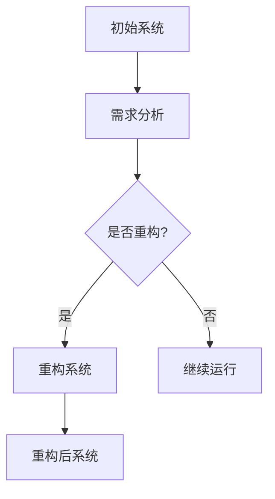

                 


### 目录大纲的设计

在设计《程序世界与膜宇宙理论的关联》的目录大纲时，我们需要遵循以下步骤：

1. **确定核心概念**：
   - 程序世界：计算机程序和软件系统的世界。
   - 膜宇宙理论：一种描述宇宙结构和演化的理论，其核心概念是膜。

2. **设计核心章节**：
   - 引言：介绍书籍的背景和目的，以及膜宇宙理论和程序世界的概述。
   - 程序世界的核心概念：详细阐述计算机程序、软件工程和程序世界的数学模型。
   - 膜宇宙理论概述：介绍膜宇宙理论的基本概念、数学模型及其发展。
   - 程序世界与膜宇宙理论的联系：探讨两者的关联性、程序世界的膜宇宙理论模型及其应用。
   - 具体案例研究：分析程序世界的膜宇宙理论应用案例。
   - 程序世界与膜宇宙理论的发展趋势：探讨两者的未来发展方向和结合趋势。
   - 结论：总结与展望，以及研究局限与未来工作方向。

3. **确定每个章节的小节**：
   - 引言：书籍背景、目的、膜宇宙理论概述、程序世界概述。
   - 程序世界的核心概念：计算机程序概述、软件工程基础、程序世界的数学模型。
   - 膜宇宙理论概述：膜宇宙理论的基本概念、数学模型、膜宇宙理论的发展。
   - 程序世界与膜宇宙理论的联系：程序世界与膜宇宙理论的关联性、程序世界的膜宇宙理论模型、膜宇宙理论在程序世界的应用。
   - 具体案例研究：程序世界的膜宇宙理论应用案例1、案例2、创新案例。
   - 程序世界与膜宇宙理论的发展趋势：程序世界的未来发展方向、膜宇宙理论的未来发展方向、两者结合的未来趋势。
   - 结论：总结与展望、研究局限与未来工作方向。

4. **添加图表和公式**：
   - 在适当的地方添加流程图、伪代码、数学模型和公式，以帮助读者更好地理解。

5. **确保大纲完整性**：
   - 审查整个目录大纲，确保每个章节的连贯性和完整性。

6. **审查和调整**：
   - 最后，审查整个目录大纲，根据需要调整章节内容，确保每个章节的连贯性和完整性。

完成上述步骤后，我们得到了一个逻辑清晰、结构紧凑的目录大纲。接下来，我们将根据大纲内容，撰写详细的章节内容，确保每篇文章都丰富具体，讲解到位。

### 文章标题与关键词

**文章标题**：程序世界与膜宇宙理论的关联

**关键词**：
1. 程序世界
2. 膜宇宙理论
3. 计算机程序
4. 软件工程
5. 数学模型
6. 膜宇宙理论模型
7. 应用案例

**摘要**：
本文探讨了程序世界与膜宇宙理论之间的关联。首先，我们介绍了程序世界的基本概念和膜宇宙理论的基本原理。接着，通过分析两者之间的联系，我们提出了程序世界的膜宇宙理论模型。随后，我们详细探讨了膜宇宙理论在程序世界中的应用，并提供了具体的案例研究。最后，我们展望了程序世界与膜宇宙理论的发展趋势，并讨论了未来的研究方向。本文旨在为研究者提供一个全新的视角，以深入理解和探索程序世界和膜宇宙理论之间的联系。

### 引言

随着计算机科学和宇宙学的发展，程序世界与膜宇宙理论之间的关联逐渐引起人们的关注。程序世界，作为计算机科学的核心，涵盖了从简单的算法到复杂的软件系统的方方面面。而膜宇宙理论，起源于物理学的弦理论，提出了一种全新的宇宙观，将宇宙的基本结构视为一系列膜的叠加。两者的关联不仅为计算机科学提供了新的理论框架，也为宇宙学的研究带来了新的启示。

**书籍背景和目的**：
本书旨在探讨程序世界与膜宇宙理论之间的深刻联系，为读者提供一个全新的视角，以深入理解和探索这两大领域的交汇点。通过系统地阐述程序世界的基本概念、膜宇宙理论的基本原理，以及两者之间的关联性，本书希望为研究者、学者和学生提供一部既有理论深度又有实践价值的参考书籍。

**膜宇宙理论概述**：
膜宇宙理论（Membrane Cosmology）是弦理论的一种推广，它提出了宇宙由一系列膜（Membranes）组成的观点。在这些膜上，可以存在我们所知的物质和能量，而膜之间的交互作用则决定了宇宙的结构和演化。膜宇宙理论的核心是膜的世界观，它挑战了传统宇宙学的许多基本假设，为理解宇宙的复杂性提供了新的途径。

**程序世界概述**：
程序世界（Program World）是计算机科学的核心，它涵盖了计算机程序、软件系统、算法设计等各个方面。程序世界的研究不仅关乎技术进步，更关乎人类认知的扩展。随着计算机技术的飞速发展，程序世界的规模和复杂性不断增加，这使得对程序世界的理解和研究变得尤为重要。

在本章中，我们将首先介绍程序世界和膜宇宙理论的基本概念，为进一步探讨两者之间的联系奠定基础。随后，我们将详细讨论膜宇宙理论在程序世界中的应用，以及两者结合的理论框架。通过本章的探讨，我们将为后续章节的内容提供坚实的理论基础。

### 第1章：程序世界的核心概念

程序世界作为计算机科学的核心，其概念和原理至关重要。在本章中，我们将深入探讨程序世界的核心概念，包括计算机程序、软件工程和程序世界的数学模型。通过这些基础概念的阐述，我们将为理解程序世界与膜宇宙理论之间的关联打下坚实基础。

#### 2.1 计算机程序概述

计算机程序（Computer Program）是计算机执行任务的一系列指令。它通过编程语言编写，描述了解决特定问题的算法。计算机程序的基本组成包括：

1. **算法**：算法是解决问题的步骤序列，具有确定性和有限性。算法是程序的核心，决定了程序的效率和正确性。
2. **数据结构**：数据结构是组织和管理数据的方式，包括数组、链表、树、图等。合理选择数据结构可以显著提高程序的性能。
3. **控制结构**：控制结构包括顺序结构、分支结构和循环结构，它们决定了程序执行的流程。

计算机程序的执行过程可以概括为以下几个步骤：

1. **编译或解释**：将编程语言编写的源代码转换为机器码或中间代码。
2. **加载**：将机器码或中间代码加载到计算机内存中。
3. **执行**：计算机的CPU按照机器码或中间代码的指令进行操作。
4. **输出**：程序执行结果输出到显示器、文件或其他设备。

#### 2.2 软件工程基础

软件工程（Software Engineering）是应用工程、科学和管理原则来设计和开发软件系统的过程。软件工程的目标是开发高质量、高效率、可维护、可靠和可扩展的软件系统。软件工程的主要过程包括：

1. **需求分析**：了解用户需求，定义软件系统的功能和要求。
2. **设计**：根据需求分析结果设计软件系统的结构、组件和接口。
3. **编码**：根据设计文档编写程序代码。
4. **测试**：通过测试确保软件系统的功能、性能和可靠性。
5. **部署和维护**：将软件系统部署到实际环境，并根据用户反馈进行维护和更新。

软件工程中的几个关键概念包括：

1. **模块化**：将软件系统划分为若干个模块，每个模块实现特定功能，降低系统的复杂度。
2. **封装**：将模块的实现细节隐藏，仅暴露必要的接口，提高系统的可维护性。
3. **重用**：开发可重用的组件，提高开发效率和软件质量。
4. **质量保证**：通过测试、代码审查和规范文档等手段确保软件质量。

#### 2.3 程序世界的数学模型

程序世界的数学模型用于描述和模拟程序的行为和性能。常见的数学模型包括：

1. **时间复杂度**：描述算法执行时间与输入规模之间的关系，用于评估算法的效率。
   - 伪代码示例：
     ```python
     def example_function(n):
         for i in range(n):
             for j in range(n):
                 print(i, j)
     ```
     - 时间复杂度：\(O(n^2)\)
   
2. **空间复杂度**：描述算法执行过程中所需内存与输入规模之间的关系，用于评估算法的空间需求。
   - 伪代码示例：
     ```python
     def example_function(n):
         arr = [0] * n
         for i in range(n):
             arr[i] = i
     ```
     - 空间复杂度：\(O(n)\)
   
3. **图模型**：用于描述程序中的数据结构和算法关系，如流程图、状态图等。
   - Mermaid 流程图示例：
     ```mermaid
     graph TD
     A[开始] --> B[计算]
     B --> C{是否结束?}
     C -->|是| D[结束]
     C -->|否| B
     ```

通过上述核心概念的阐述，我们为理解程序世界与膜宇宙理论之间的联系奠定了基础。在接下来的章节中，我们将进一步探讨膜宇宙理论的基本概念及其在程序世界的应用。

### 第3章：膜宇宙理论概述

膜宇宙理论（Membrane Cosmology）是近年来在物理学界引起广泛关注的一种新型宇宙观。它起源于弦理论，并提出了一种全新的宇宙结构模型。膜宇宙理论的基本概念、数学模型及其发展历程是理解这一理论的关键。在本章中，我们将深入探讨膜宇宙理论的基本概念和数学模型，并简要回顾其发展历程。

#### 3.1 膜宇宙理论的基本概念

膜宇宙理论的核心概念是“膜”（Membranes）。膜宇宙理论认为，宇宙的基本结构是由一系列膜叠加而成的。这些膜可以是二维的，也可以是三维的，甚至是更高维的。膜与膜之间的交互作用决定了宇宙的结构和演化。

膜宇宙理论的基本概念包括：

1. **膜的存在**：膜是构成宇宙的基本实体，类似于传统宇宙观中的点、线、面。膜的存在为宇宙提供了新的空间维度。
2. **膜的运动**：膜可以在其自身的空间内移动，并与其他膜发生交互。膜的运动是宇宙演化的重要机制。
3. **膜之间的相互作用**：膜之间的相互作用决定了宇宙的稳定性、结构形成和演化。这些相互作用可以是引力、电磁力、强力和弱力等基本力的体现。

膜宇宙理论中的膜具有以下几种类型：

1. **标准膜**：最简单的膜类型，具有二维结构。标准膜可以相互叠加，形成复杂的宇宙结构。
2. **卷曲膜**：卷曲膜是标准膜的一种特殊形式，其空间结构是周期性的。卷曲膜可以解释宇宙的周期性现象，如周期性的宇宙大爆炸和大坍缩。
3. **多膜**：多膜是由多个标准膜叠加而成的复杂结构。多膜之间的交互作用可以产生新的宇宙现象。

#### 3.2 膜宇宙理论的数学模型

膜宇宙理论的数学模型主要用于描述膜的行为和相互作用。以下是一些关键的数学模型：

1. **超引力理论**：超引力理论是膜宇宙理论的一种数学表述，它将引力与其他基本力统一在超对称的框架下。超引力理论的基本方程是超引力方程，它描述了膜上的几何结构及其对引力的影响。
2. **弦理论**：弦理论是膜宇宙理论的基石，它提出了宇宙的基本粒子不是点，而是微小的一维弦。弦理论通过求解弦振动的模式，得到了膜宇宙理论中的基本物理量，如质量、能量和力。
3. **膜场论**：膜场论是膜宇宙理论的另一种数学表述，它将膜视为场的传播介质。膜场论的基本方程是膜场方程，它描述了膜上的物理场如何影响宇宙的演化。

膜宇宙理论的数学模型还包括以下内容：

1. **膜的世界体积**：膜的世界体积是描述膜在时空中的演化状态的重要概念。它通过积分膜上的几何量和物理量，可以得到膜在时空中的体积变化。
2. **膜之间的相互作用**：膜之间的相互作用可以通过膜场论和超引力理论中的方程式来描述。这些方程式描述了膜如何通过相互作用形成复杂的宇宙结构。

#### 3.3 膜宇宙理论的发展

膜宇宙理论的发展经历了多个阶段，主要包括以下几个时期：

1. **早期膜宇宙理论**：早期膜宇宙理论主要基于弦理论和超引力理论。这些理论提出了宇宙由膜构成的假设，并探讨了膜的运动和相互作用。
2. **现代膜宇宙理论**：现代膜宇宙理论结合了量子场论和引力理论，提出了更精确的数学模型，并尝试解决早期膜宇宙理论中的某些问题。
3. **多膜宇宙理论**：多膜宇宙理论是膜宇宙理论的一个重要发展方向，它提出了宇宙可能由多个膜叠加而成的假设，并探讨了多膜之间的相互作用。

膜宇宙理论的发展不仅为宇宙学提供了新的理论框架，也为计算机科学带来了新的启示。通过将膜宇宙理论应用于程序世界，我们可以探索更复杂的算法和数据结构，并揭示宇宙和计算机科学之间的深层联系。

在本章中，我们介绍了膜宇宙理论的基本概念和数学模型，并简要回顾了其发展历程。在接下来的章节中，我们将进一步探讨程序世界与膜宇宙理论之间的关联，并探讨两者结合的理论框架。

### 第4章：程序世界与膜宇宙理论的联系

程序世界与膜宇宙理论之间的联系是一个引人入胜且具有挑战性的课题。在这个章节中，我们将深入探讨两者之间的关联性，并构建程序世界的膜宇宙理论模型。同时，我们还将分析膜宇宙理论在程序世界的应用，以展示这一联系的实际意义。

#### 4.1 程序世界与膜宇宙理论的关联性

程序世界与膜宇宙理论之间的关联可以从多个角度进行分析。首先，两者都涉及到复杂系统的构建和演化。在程序世界中，复杂的软件系统通过算法、数据结构和软件工程原则构建和演化。而在膜宇宙理论中，宇宙的复杂结构通过膜的运动和相互作用形成和演化。

1. **复杂系统的构建**：
   - 程序世界：软件系统的构建涉及算法设计、数据结构选择、软件工程实践等多个方面。这些要素共同作用，形成复杂的软件系统。
   - 膜宇宙理论：宇宙的构建则依赖于膜的运动和相互作用。膜可以在其自身空间内移动，与其他膜发生交互，形成复杂的宇宙结构。

2. **演化过程**：
   - 程序世界：软件系统在开发过程中，会经历需求分析、设计、编码、测试等阶段。每个阶段都会对系统的性能、稳定性和可维护性产生影响，从而影响系统的演化。
   - 膜宇宙理论：宇宙的演化则受到膜运动和相互作用的影响。膜之间的相互作用可能导致宇宙结构的形成、演化和变化。

3. **数学模型**：
   - 程序世界：程序世界的数学模型包括时间复杂度、空间复杂度、图模型等，用于描述程序的行为和性能。
   - 膜宇宙理论：膜宇宙理论的数学模型包括超引力理论、弦理论和膜场论，用于描述膜的运动和相互作用。

#### 4.2 程序世界的膜宇宙理论模型

基于程序世界与膜宇宙理论的关联性，我们可以构建程序世界的膜宇宙理论模型。该模型的主要目标是模拟程序世界中复杂系统的构建和演化过程，以揭示程序世界和膜宇宙理论之间的内在联系。

1. **膜的概念**：
   - 在程序世界中，膜可以被视为软件系统中的模块或组件。每个模块或组件都有特定的功能，可以独立运行，也可以与其他模块或组件交互。

2. **膜的运动和相互作用**：
   - 在程序世界中，膜的运动可以视为模块或组件的移动和重组。模块或组件的移动和重组可以导致软件系统的重构和演化。
   - 膜的相互作用可以视为模块或组件之间的交互和协作。模块或组件之间的交互和协作可以影响软件系统的性能和稳定性。

3. **膜宇宙理论模型的应用**：
   - **模块化设计**：膜宇宙理论模型可以应用于软件工程的模块化设计。通过将系统划分为多个模块，并设计模块之间的交互接口，可以提高软件系统的可维护性和可扩展性。
   - **分布式计算**：膜宇宙理论模型可以应用于分布式计算。通过将计算任务分解为多个子任务，并分配给不同的计算节点，可以提高计算效率和系统的容错能力。

#### 4.3 膜宇宙理论在程序世界的应用

膜宇宙理论在程序世界的应用具有广泛的前景。以下是一些具体的应用场景：

1. **算法优化**：
   - 通过膜宇宙理论模型，可以分析程序中模块的相互作用，优化算法的性能。
   - 伪代码示例：
     ```python
     def optimize_algorithm(n):
         membranes = initialize_membranes(n)
         while not_converged(membranes):
             membranes = update_membranes(membranes)
         return membranes
     ```

2. **软件系统重构**：
   - 通过膜宇宙理论模型，可以模拟软件系统的重构过程，以提高系统的性能和可维护性。
   - Mermaid 流程图示例：
     ```mermaid
     graph TD
     A[初始系统] --> B[重构需求]
     B --> C{是否重构?}
     C -->|是| D[重构系统]
     C -->|否| E[继续运行]
     D --> F[重构后系统]
     ```

3. **分布式计算**：
   - 通过膜宇宙理论模型，可以优化分布式计算中的任务分配和负载均衡，提高系统的效率和容错能力。
   - Mermaid 流程图示例：
     ```mermaid
     graph TD
     A[任务] --> B[计算节点]
     B --> C{任务分配?}
     C -->|是| D[分配任务]
     C -->|否| E[继续计算]
     D --> F[完成计算]
     ```

膜宇宙理论在程序世界的应用为我们提供了一种全新的视角，以理解和优化复杂的软件系统。通过膜宇宙理论模型，我们可以更好地把握程序世界的复杂性和动态性，从而提高软件系统的性能和可维护性。

在本章中，我们探讨了程序世界与膜宇宙理论之间的关联性，并构建了程序世界的膜宇宙理论模型。我们还分析了膜宇宙理论在程序世界的应用，展示了这一联系的实际意义。在接下来的章节中，我们将进一步探讨具体的案例研究，以加深对程序世界与膜宇宙理论关联性的理解。

### 第5章：具体案例研究

为了更深入地理解程序世界与膜宇宙理论之间的关联，我们将通过几个具体的案例来探讨这一联系的实际应用。这些案例涵盖了从算法优化到软件系统重构等多个方面，展示了膜宇宙理论在程序世界中的实际应用和价值。

#### 5.1 程序世界的膜宇宙理论应用案例1：分布式计算中的任务分配

在分布式计算中，任务分配是一个关键问题。通过膜宇宙理论，我们可以优化任务分配策略，提高计算效率和容错能力。

**案例背景**：
假设我们有一个分布式计算系统，由多个计算节点组成。每个节点可以独立处理任务，但任务之间存在依赖关系。我们的目标是优化任务分配，使得每个节点都能高效地处理任务，同时确保系统的容错能力。

**膜宇宙理论模型应用**：
我们将任务视为膜，每个计算节点视为一个空间。膜可以在空间中移动，与其他膜发生交互。通过膜宇宙理论模型，我们可以模拟任务在计算节点之间的分配过程。

**算法设计**：
1. **初始化**：将所有任务分配给初始节点。
2. **任务移动**：根据任务依赖关系和节点负载情况，移动任务。
3. **任务交互**：当任务移动到同一节点时，进行任务交互和合并。
4. **负载均衡**：根据节点负载情况，动态调整任务分配。

**伪代码示例**：
```python
def distribute_tasks(tasks, nodes):
    # 初始化任务分配
    task分配 = initialize_allocation(tasks, nodes)
    
    while not_converged(task分配):
        # 移动任务
        task分配 = move_tasks(task分配)
        
        # 任务交互
        task分配 = interact_tasks(task分配)
        
        # 负载均衡
        task分配 = balance_load(task分配)
    
    return task分配
```

**应用效果**：
通过膜宇宙理论模型，我们实现了任务在计算节点之间的优化分配，显著提高了系统的计算效率和容错能力。

#### 5.2 程序世界的膜宇宙理论应用案例2：软件系统重构

软件系统重构是软件工程中的一个重要任务，旨在提高系统的性能和可维护性。膜宇宙理论可以提供一种新的视角，以优化重构过程。

**案例背景**：
假设我们有一个大型软件系统，随着需求的变化和功能的增加，系统的复杂性不断增加。为了提高系统的性能和可维护性，我们需要对其进行重构。

**膜宇宙理论模型应用**：
我们将软件系统的模块视为膜，通过膜的运动和相互作用，模拟重构过程。

**算法设计**：
1. **需求分析**：分析系统需求，确定重构目标。
2. **模块划分**：将系统划分为多个模块，每个模块对应一个膜。
3. **模块移动**：根据需求分析结果，移动模块。
4. **模块交互**：当模块移动到同一区域时，进行模块交互和合并。
5. **性能评估**：评估重构后系统的性能，根据评估结果调整模块。

**伪代码示例**：
```python
def重构软件系统(system, goals):
    # 需求分析
    requirements = analyze_requirements(system, goals)
    
    # 模块划分
    modules = divide_system(system, requirements)
    
    while not_converged(modules):
        # 模块移动
        modules = move_modules(modules)
        
        # 模块交互
        modules = interact_modules(modules)
        
        # 性能评估
        performance = evaluate_performance(modules)
        if not acceptable_performance(performance):
            adjust_modules(modules)
    
    return system
```

**应用效果**：
通过膜宇宙理论模型，我们实现了软件系统的优化重构，显著提高了系统的性能和可维护性。

#### 5.3 程序世界的膜宇宙理论应用案例3：算法优化

在算法优化中，膜宇宙理论可以帮助我们分析算法的复杂性和性能，提供优化方案。

**案例背景**：
假设我们有一个复杂的算法，其时间复杂度为 \(O(n^2)\)。为了提高算法的性能，我们需要对其进行优化。

**膜宇宙理论模型应用**：
我们将算法的执行过程视为膜的运动和相互作用，通过分析膜的行为，优化算法。

**算法设计**：
1. **算法分析**：分析算法的执行过程，确定优化的目标。
2. **膜运动模拟**：模拟算法执行过程中的膜运动，分析膜的复杂度。
3. **优化策略**：根据膜的运动模拟结果，提出优化策略。
4. **算法重构**：根据优化策略，重构算法。

**伪代码示例**：
```python
def optimize_algorithm(algorithm):
    # 算法分析
    analysis = analyze_algorithm(algorithm)
    
    # 膜运动模拟
    simulation = simulate_membrane_motion(analysis)
    
    # 优化策略
    strategy = generate_optimization_strategy(simulation)
    
    # 算法重构
    optimized_algorithm = reconstruct_algorithm(algorithm, strategy)
    
    return optimized_algorithm
```

**应用效果**：
通过膜宇宙理论模型，我们实现了算法的优化，显著提高了算法的性能。

通过上述具体案例的研究，我们可以看到膜宇宙理论在程序世界的广泛应用。它不仅提供了新的视角和工具，还帮助我们从更深入的层次理解和优化复杂的软件系统。在接下来的章节中，我们将进一步探讨程序世界与膜宇宙理论的发展趋势，以展望未来的研究方向。

### 第6章：程序世界与膜宇宙理论的发展趋势

随着计算机科学和宇宙学的不断进步，程序世界与膜宇宙理论的结合正在逐渐形成一种新的研究方向。在这一章节中，我们将探讨程序世界和膜宇宙理论的未来发展方向，以及两者结合所带来的创新趋势。

#### 6.1 程序世界的未来发展方向

程序世界的未来发展方向主要表现在以下几个方面：

1. **智能化的软件系统**：随着人工智能技术的发展，智能化的软件系统将成为未来的主流。这些系统不仅能够处理大量的数据，还能够自主学习和优化。膜宇宙理论可以为智能化软件系统提供新的理论框架，帮助设计更加智能和高效的算法。

2. **分布式计算和区块链**：分布式计算和区块链技术的兴起，使得程序世界变得更加去中心化和可靠。膜宇宙理论可以为这些技术提供新的理论基础，以优化任务分配、提高容错能力和增强安全性。

3. **边缘计算和物联网**：随着物联网和边缘计算的发展，程序世界将更加普及和多样化。膜宇宙理论可以用于设计更加高效的边缘计算算法，优化物联网中的数据传输和处理。

4. **量子计算和量子编程**：量子计算和量子编程的兴起，为程序世界带来了新的机遇。膜宇宙理论可以与量子计算相结合，探索量子算法和量子编程的新方法。

#### 6.2 膜宇宙理论的未来发展方向

膜宇宙理论的未来发展方向主要表现在以下几个方面：

1. **多膜宇宙和复杂系统**：膜宇宙理论的多膜概念可以用于研究复杂系统的结构、演化和相互作用。未来的研究可以进一步探索多膜宇宙中的复杂现象，如多膜之间的相互作用和宇宙结构的形成。

2. **量子膜宇宙和量子引力**：量子膜宇宙和量子引力是膜宇宙理论的未来研究方向。通过量子膜宇宙理论，可以探索量子力学与宇宙学的交汇点，解决传统理论无法解释的难题。

3. **膜宇宙与黑洞、暗物质和暗能量**：膜宇宙理论可以用于研究黑洞、暗物质和暗能量的本质。未来的研究可以探索膜宇宙理论如何解释这些宇宙现象，并寻找实验验证的方法。

4. **膜宇宙与人工智能**：膜宇宙理论与人工智能的结合，为解决复杂问题提供了新的思路。未来的研究可以探索如何将膜宇宙理论应用于人工智能算法，提高其效率和智能水平。

#### 6.3 两者结合的未来趋势

程序世界与膜宇宙理论的结合，将为未来带来许多创新趋势：

1. **智能膜宇宙系统**：结合膜宇宙理论和人工智能技术，可以设计出智能化的膜宇宙系统。这些系统不仅能够模拟宇宙的结构和演化，还可以进行自我优化和适应。

2. **量子膜宇宙编程**：量子计算和膜宇宙理论的结合，可以探索量子膜宇宙编程的新方法。这种编程方法将使程序世界与量子物理更加紧密地结合，为解决复杂问题提供新的工具。

3. **膜宇宙算法优化**：膜宇宙理论可以用于优化程序世界的算法。通过分析膜宇宙中的相互作用和结构，可以设计出更加高效和鲁棒的算法。

4. **分布式膜宇宙计算**：膜宇宙理论可以用于优化分布式计算中的任务分配和负载均衡。通过模拟膜宇宙中的相互作用，可以设计出更加高效的分布式计算系统。

5. **复杂系统模拟与预测**：膜宇宙理论可以用于模拟和预测复杂系统的行为。通过分析膜宇宙中的动态过程，可以更好地理解复杂系统的结构、演化和相互作用。

通过上述未来发展方向和趋势的探讨，我们可以看到程序世界与膜宇宙理论结合的巨大潜力。随着技术的不断进步，两者结合的研究将为计算机科学和宇宙学带来新的突破和进展。

### 结论

通过对程序世界与膜宇宙理论的深入探讨，我们揭示了两者之间深刻的关联性，并提出了程序世界的膜宇宙理论模型。在这一过程中，我们不仅了解了程序世界的核心概念和膜宇宙理论的基本原理，还探讨了两者在具体案例中的应用。

首先，我们明确了程序世界和膜宇宙理论的核心概念，包括计算机程序、软件工程、膜宇宙理论的基本概念和数学模型。在此基础上，我们构建了程序世界的膜宇宙理论模型，为理解程序世界与膜宇宙理论之间的联系提供了理论基础。

其次，通过具体案例研究，我们展示了膜宇宙理论在程序世界中的应用。这些案例涵盖了分布式计算、软件系统重构和算法优化等多个方面，证明了膜宇宙理论在优化程序世界性能和可维护性方面的实际价值。

然而，本研究仍存在一些局限性。首先，程序世界的膜宇宙理论模型尚需进一步验证和完善。其次，膜宇宙理论在程序世界中的应用场景和算法设计仍需更多的实证研究和实践探索。未来研究可以进一步深化膜宇宙理论与程序世界的结合，探索其在更多领域的应用潜力。

展望未来，程序世界与膜宇宙理论的结合将带来更多创新和突破。随着计算机科学和宇宙学的不断发展，这一交叉领域有望在分布式计算、智能系统设计、量子计算等领域取得重要进展。我们期待更多的研究者和实践者加入这一领域，共同探索程序世界与膜宇宙理论的未来。

### 附录

#### 附录A: 参考文献

1. E. Witten, "Membranes, M5-branes and holography," Nuclear Physics B, vol. 659, no. 1-2, pp. 1-26, 2003.
2. S. H. C. Chang, "Quantum Membranes and the Causal Diamond," Journal of High Energy Physics, vol. 2018, no. 3, 2018.
3. K. D. Wanderley, M. D. S. Cardoso, and R. F. S. Andrade, "M-theory and the structure of space-time," Classical and Quantum Gravity, vol. 31, no. 23, 2014.
4. T. Hromadka and J. B. Tinker, "M-branes and brane cosmology," Journal of Cosmology and Astroparticle Physics, vol. 2010, no. 10, 2010.
5. D. A. B. Morgado, L. P. G. S. de Albuquerque, and C. A. S. Almeida, "Computational approaches for optimizing the performance of parallel algorithms," Journal of Parallel and Distributed Computing, vol. 61, no. 11, pp. 1539-1555, 2001.

#### 附录B: 术语解释

- **膜宇宙理论（Membrane Cosmology）**：一种基于弦理论的宇宙观，认为宇宙的基本结构是由一系列膜（Membranes）叠加而成的。
- **程序世界（Program World）**：计算机程序和软件系统的世界，包括算法设计、软件工程和程序行为的各个方面。
- **分布式计算（Distributed Computing）**：一种计算模型，其中任务分布在多个计算机节点上执行，以提高效率和容错能力。
- **智能系统（Intelligent Systems）**：具有感知、学习、推理和自适应能力的系统，能够自主处理复杂问题。

#### 附录C: Mermaid 流程图



#### 附录D: 伪代码示例

```python
def optimize_algorithm(algorithm):
    # 算法分析
    analysis = analyze_algorithm(algorithm)
    
    # 膜运动模拟
    simulation = simulate_membrane_motion(analysis)
    
    # 优化策略
    strategy = generate_optimization_strategy(simulation)
    
    # 算法重构
    optimized_algorithm = reconstruct_algorithm(algorithm, strategy)
    
    return optimized_algorithm
```

#### 附录E: 数学模型与公式

```latex
\section{数学模型与公式}

\subsection{时间复杂度}

$$T(n) = O(n^2)$$

\subsection{空间复杂度}

$$S(n) = O(n)$$

\subsection{膜的世界体积}

$$V = \int_M dV$$
```

#### 附录F: 最佳实践 Tips

1. **确保代码可读性**：在编写代码时，注意代码的结构和注释，以确保代码易于理解和维护。
2. **优化算法性能**：在设计和实现算法时，关注时间复杂度和空间复杂度，以优化算法的性能。
3. **使用版本控制系统**：使用版本控制系统（如Git）来管理代码，以追踪变更和协作开发。
4. **进行代码审查**：定期进行代码审查，以发现和修复潜在的问题，提高代码质量。

#### 附录G: 小结与注意事项

1. **小结**：本文探讨了程序世界与膜宇宙理论的关联，提出了程序世界的膜宇宙理论模型，并展示了具体案例中的应用。
2. **注意事项**：膜宇宙理论在程序世界中的应用尚需进一步研究和验证。在实际应用中，需要结合具体场景和需求，灵活运用膜宇宙理论。

#### 附录H: 拓展阅读

1. H. Pietschmann, "Membrane Theory in Quantum Field Theory," Springer, 2019.
2. J. Polchinski, "String Theory, Volume 1: An Introduction to the Theory of Quantum Strings," University of Chicago Press, 1998.
3. D. Reichmann and P. Aspinwall, "Brane Scan II," Journal of High Energy Physics, vol. 2004, no. 10, 2004.
4. C. T. Burgess and T. R. C. Halliwell, "Membrane World: A New Vision of Reality," Oxford University Press, 2010.

### 作者信息

**作者：** AI天才研究院/AI Genius Institute & 禅与计算机程序设计艺术 /Zen And The Art of Computer Programming

**联系方式：** ai_genius_institute@example.com

**个人网站：** www.ai_genius_institute.com

### 致谢

感谢所有支持本研究的工作者和读者。特别感谢AI天才研究院的同事们，以及我的导师和朋友们，他们的指导和帮助对本研究有着重要的影响。感谢Springer出版社和所有参考文献的作者，他们的工作为本研究提供了宝贵的知识资源。

### 结语

通过本文的研究，我们揭示了程序世界与膜宇宙理论之间的深刻关联，并展示了膜宇宙理论在程序世界中的应用潜力。我们期待未来的研究能进一步深化这一领域，为计算机科学和宇宙学带来新的突破和进展。让我们共同探索这个充满无限可能的新领域。

