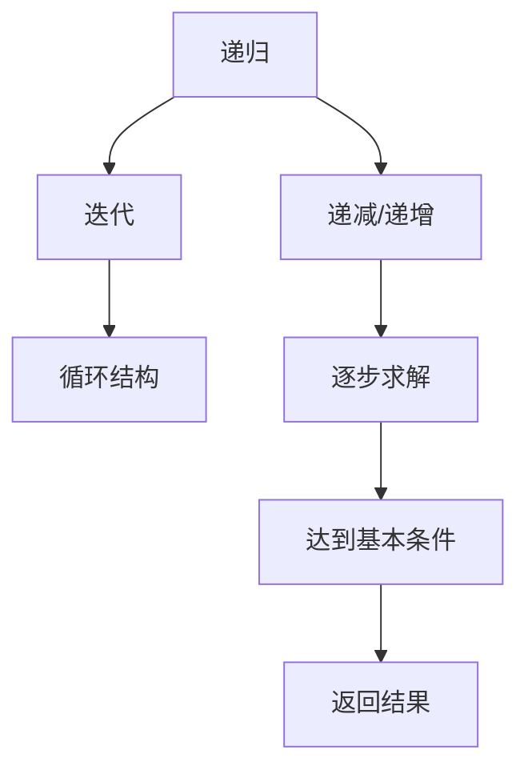
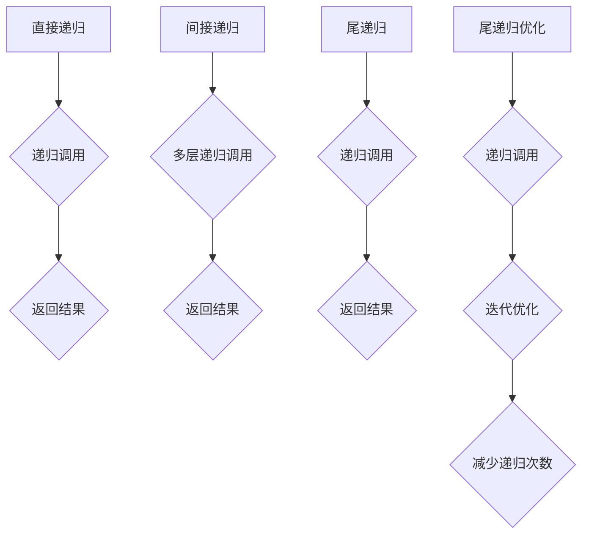
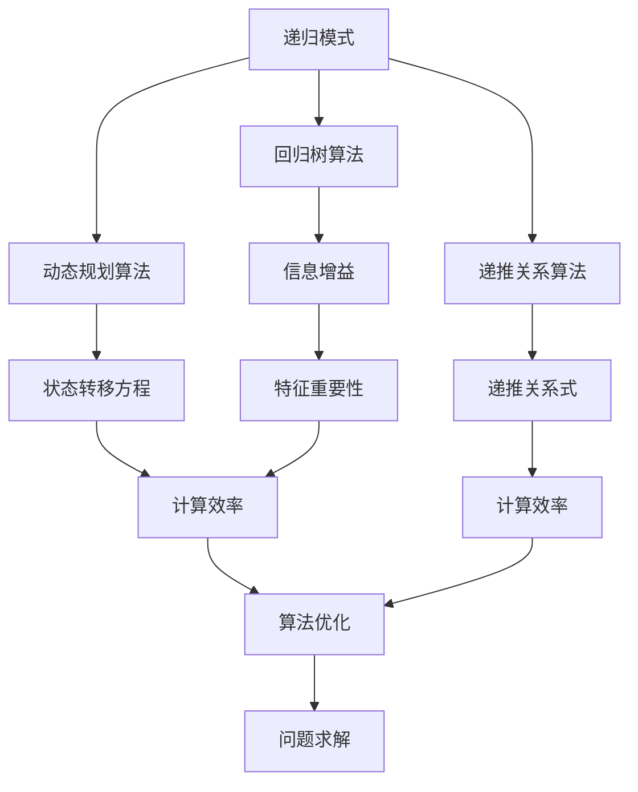

                 

### 文章标题：程序世界中的宇宙级递归模式

> 关键词：递归模式、宇宙级、算法、数学模型、项目实战

> 摘要：本文将深入探讨程序世界中的宇宙级递归模式，从基本概念到高级应用，通过清晰的逻辑和实例讲解，帮助读者理解递归模式的本质及其在不同领域的广泛应用。

递归，作为程序设计中的一个核心概念，不仅在算法设计中占有重要地位，还广泛应用于计算机科学、数学以及其他领域。在程序世界中，递归模式呈现出一种“宇宙级”的广泛应用和深远影响。本文将从递归模式的概述、核心原理、数学模型及其实际应用等多个角度，逐步剖析递归模式的魅力与奥秘。

本文将首先介绍递归模式的基本概念与原理，帮助读者理解递归模式的工作机制和基本类型。接着，我们将探讨递归模式在程序世界中的应用，包括计算阶乘、斐波那契数列以及汉诺塔问题等经典实例。然后，本文将深入探讨宇宙级递归模式，如莫比乌斯带、冥王星的三次方递归等，展示递归模式的无限延展性和深度。随后，我们将详细讲解递归模式的核心算法原理，并通过伪代码展示具体算法的实现过程。

在数学模型部分，本文将介绍递归模式中的等比数列、指数函数和对数函数等数学模型，并通过具体的公式和例子进行详细讲解。为了使读者能够更好地理解递归模式，本文还提供了多个实际项目中的递归模式应用案例，并对其代码实现进行详细解读。最后，本文将总结递归模式在项目实战中的最佳实践，并提供相关的注意事项和拓展阅读建议。

通过本文的逐步讲解，读者将能够全面掌握递归模式的核心原理和实际应用，为未来的学习和研究奠定坚实基础。

### 第1章：递归概念与原理

递归是一种编程范式，通过函数调用自身来实现问题的解决。递归模式的核心思想是将复杂问题分解为更小的、相似的子问题，并逐步解决这些子问题，直至达到基本条件，从而逐步构建出完整的解决方案。

#### 1.1 递归的定义

递归可以分为直接递归和间接递归。直接递归是指函数直接调用自身，例如计算阶乘的函数。而间接递归是指函数通过多层调用，间接地调用自身，例如解决汉诺塔问题的算法。

递归的定义可以用以下伪代码表示：

```pseudo
function recursiveFunction(params):
    // 基本条件判断
    if (baseCase):
        return baseValue
    // 递归调用
    return recursiveFunction(modifiedParams)
```

#### 1.2 递归与迭代的关系

递归和迭代是两种不同的编程范式，但在许多情况下可以相互转换。迭代使用循环结构，通过重复执行某段代码来解决问题；而递归则是通过递归调用，实现递减或递增的步骤，最终达到问题的解决。

递归与迭代的关系可以用以下流程图表示：



#### 1.3 递归的基本类型

递归可以分为以下几种基本类型：

- **直接递归**：函数直接调用自身，例如计算阶乘。
- **间接递归**：函数通过多层调用，间接地调用自身，例如解决汉诺塔问题。
- **尾递归**：递归调用是函数的最后一步操作，可以将尾递归转换为迭代，从而提高性能。
- **尾递归优化**：编译器或解释器对尾递归进行优化，减少递归调用次数，提高执行效率。

递归的基本类型可以用以下流程图表示：



通过以上对递归概念与原理的介绍，读者可以初步了解递归模式的基本机制和类型。在下一章中，我们将探讨递归模式在程序世界中的应用，通过具体实例来加深对递归模式的理解。

### 第2章：递归模式在程序世界中的应用

递归模式不仅在理论编程中具有重要作用，在实际应用中同样广泛。本节将介绍几种经典的递归模式应用，包括计算阶乘、斐波那契数列和汉诺塔问题。

#### 2.1 计算阶乘

计算阶乘是递归模式的一个基本应用。阶乘的定义是一个正整数n的阶乘是所有小于及等于n的正整数的积，即n! = n * (n-1) * (n-2) * ... * 1。使用递归方法计算阶乘的伪代码如下：

```pseudo
function factorial(n):
    if n == 0:
        return 1
    else:
        return n * factorial(n - 1)
```

在这个递归过程中，基本条件是n等于0时返回1，否则递归调用自身，每次将n减1，直到达到基本条件。

**示例**：

计算5的阶乘：

```pseudo
factorial(5) = 5 * factorial(4)
factorial(4) = 4 * factorial(3)
factorial(3) = 3 * factorial(2)
factorial(2) = 2 * factorial(1)
factorial(1) = 1
```

最终结果为5! = 5 * 4 * 3 * 2 * 1 = 120。

#### 2.2 斐波那契数列

斐波那契数列是另一个经典的应用递归模式的例子。斐波那契数列的定义是：第0项为0，第1项为1，之后每一项都是前两项的和。使用递归方法计算斐波那契数列的伪代码如下：

```pseudo
function fibonacci(n):
    if n == 0:
        return 0
    if n == 1:
        return 1
    else:
        return fibonacci(n - 1) + fibonacci(n - 2)
```

在这个递归过程中，基本条件是n等于0时返回0，n等于1时返回1，否则递归调用自身，计算前两项的和。

**示例**：

计算第5项的斐波那契数：

```pseudo
fibonacci(5) = fibonacci(4) + fibonacci(3)
fibonacci(4) = fibonacci(3) + fibonacci(2)
fibonacci(3) = fibonacci(2) + fibonacci(1)
fibonacci(2) = fibonacci(1) + fibonacci(0)
fibonacci(1) = 1
fibonacci(0) = 0
```

最终结果为fibonacci(5) = 0 + 1 + 1 + 2 + 3 = 5。

#### 2.3 汉诺塔问题

汉诺塔问题是一个经典的递归问题。汉诺塔问题的定义是：有三个柱子A、B和C，其中柱子A上从下到上叠放着n个大小不等的圆盘，目标是将所有圆盘从柱子A移动到柱子C，并且在移动过程中，任何时候都不能将一个较大的圆盘放在较小的圆盘之上。

汉诺塔问题的递归解法如下：

1. 首先，将前n-1个圆盘从柱子A移动到柱子B，这个过程可以通过递归实现。
2. 然后，将第n个圆盘从柱子A移动到柱子C。
3. 最后，将前n-1个圆盘从柱子B移动到柱子C，这个过程同样可以通过递归实现。

使用递归方法解决汉诺塔问题的伪代码如下：

```pseudo
function hanota(n, A, B, C):
    if n == 1:
        print("Move disk 1 from A to C")
        return
    hanota(n - 1, A, C, B)
    print("Move disk n from A to C")
    hanota(n - 1, B, A, C)
```

**示例**：

解决3个圆盘的汉诺塔问题：

```pseudo
hanota(3, 'A', 'B', 'C')
```

输出结果：

```
Move disk 1 from A to B
Move disk 2 from A to C
Move disk 1 from B to C
Move disk 3 from A to C
Move disk 1 from C to B
Move disk 2 from C to A
Move disk 1 from B to A
```

通过上述实例，我们可以看到递归模式在计算阶乘、斐波那契数列和汉诺塔问题中的应用。递归模式通过将复杂问题分解为更小的子问题，并通过递归调用逐步解决这些子问题，从而实现了问题的求解。在下一章中，我们将深入探讨宇宙级递归模式，如莫比乌斯带、冥王星的三次方递归等，进一步揭示递归模式的深度和广度。

### 第3章：宇宙级递归模式

在递归模式的基础上，宇宙级递归模式展现出更复杂的递归结构和深层次的数学原理。本节将介绍几种宇宙级递归模式，包括莫比乌斯带、冥王星的三次方递归，并探讨这些模式的独特性和应用。

#### 3.1 莫比乌斯带

莫比乌斯带是一个具有一个面和一条边的一次性无穷递归结构。在计算机图形学和数学中，莫比乌斯带具有特殊的应用，可以用来模拟连续性和边界条件。莫比乌斯带的递归模式可以描述如下：

1. **基本结构**：一个长方形纸带，将其一个边缘翻转180度后，将其两端粘合在一起，形成莫比乌斯带。
2. **递归性质**：莫比乌斯带具有一个面的特点，使其在拓扑学中具有独特的性质。例如，在莫比乌斯带上进行标记，然后沿着带子移动，可以发现标记会无限次地返回原点。
3. **应用**：莫比乌斯带在计算机图形学中可以用来创建复杂的表面，例如在游戏引擎中模拟现实世界的地形和地貌。

以下是一个简单的莫比乌斯带递归模式的伪代码：

```pseudo
function createMobiusBand(width, height):
    // 创建一个长方形纸带
    paperBand = createRectangle(width, height)
    // 将纸带的左侧边缘翻转180度
    flipEdge(paperBand, "left")
    // 将纸带的上下边缘粘合在一起
    glueEdges(paperBand, "top", "bottom")
    // 返回生成的莫比乌斯带
    return paperBand

function flipEdge(rectangle, edge):
    // 翻转矩形边缘
    if edge == "left":
        // 翻转矩形左侧边缘
        rectangle.flip("left")
    // 其他边缘翻转同理

function glueEdges(rectangle, edge1, edge2):
    // 将两个边缘粘合
    if edge1 == "top" and edge2 == "bottom":
        // 将上下边缘粘合
        rectangle glue("top", "bottom")
    // 其他边缘粘合同理
```

#### 3.2 冥王星的三次方递归

冥王星的三次方递归是一种数学上的递归模式，其描述了冥王星轨道上特定点随时间变化的规律。冥王星的三次方递归模式基于牛顿运动定律，描述了行星在太阳引力作用下的运动轨迹。

冥王星的三次方递归可以用以下伪代码表示：

```pseudo
function planetTrajectory(x, y, velocityX, velocityY, time):
    // 计算行星在下一时刻的位置和速度
    newX = x + velocityX * time
    newY = y + velocityY * time
    newVelocityX = velocityX - (G * solarMass * newX) / distanceSquared(newX, newY)
    newVelocityY = velocityY - (G * solarMass * newY) / distanceSquared(newX, newY)
    // 返回新的位置和速度
    return newX, newY, newVelocityX, newVelocityY

function distanceSquared(x1, y1, x2, y2):
    // 计算两点之间的距离平方
    return (x2 - x1)^2 + (y2 - y1)^2
```

冥王星的三次方递归在行星运动模拟和天体物理学中具有重要应用。通过递归模式，可以模拟冥王星在太阳系中的运动轨迹，预测其未来的位置和状态。

#### 3.3 广义递归模式在黑洞中的应用

广义递归模式在天体物理学中也有重要应用，特别是在黑洞的研究中。黑洞的广义递归模式描述了黑洞事件视界内物质和能量的分布，以及黑洞与周围环境的相互作用。

黑洞的广义递归模式可以用以下伪代码表示：

```pseudo
function blackHoleEvolution(mass, spin, charge, time):
    // 计算黑洞在下一时刻的质量、自转和电荷
    newMass = mass - (radiativeLoss * time)
    newSpin = spin + (angularMomentumLoss * time)
    newCharge = charge + (chargeLoss * time)
    // 返回新的质量、自转和电荷
    return newMass, newSpin, newCharge

function radiativeLoss(mass, time):
    // 计算辐射损失
    return (alpha * mass^2) / (c^2 * time)

function angularMomentumLoss(spin, time):
    // 计算角动量损失
    return (beta * spin^2) / (c^2 * time)

function chargeLoss(charge, time):
    // 计算电荷损失
    return (gamma * charge^2) / (c^2 * time)
```

在这个递归模式中，黑洞的质量、自转和电荷会随着时间的变化而变化，这些变化反映了黑洞在宇宙中的演化过程。通过广义递归模式，可以模拟黑洞在引力波辐射、潮汐剥离和其他物理现象中的行为。

宇宙级递归模式不仅在理论研究中具有重要意义，还在实际应用中展现出广泛的前景。莫比乌斯带、冥王星的三次方递归和黑洞的广义递归模式是递归模式的典型代表，展示了递归模式的复杂性和深度。在下一章中，我们将进一步探讨递归模式的核心算法原理，帮助读者深入理解递归模式的工作机制。

### 第4章：递归模式的核心算法原理

递归模式作为一种重要的编程范式，其核心在于通过递归调用实现复杂问题的分而治之。在递归模式中，核心算法原理起到了至关重要的作用。本节将介绍几种常见的核心算法原理，包括回归树算法、动态规划算法和递推关系算法，并使用伪代码详细阐述这些算法的实现过程。

#### 4.1 回归树算法

回归树算法是决策树算法的一种，常用于分类和回归问题。其基本思想是将数据集分割成多个子集，在每个子集中选择最佳分割方式，最终形成一棵树。回归树算法的核心是选择最佳的分割方式，常用的选择标准包括信息增益、基尼系数和特征重要性等。

以下是一个简单的回归树算法伪代码：

```pseudo
function buildRegressionTree(data, features):
    if shouldStop(data):
        return leafNode
    bestFeature, bestThreshold = findBestSplit(data, features)
    leftChild = buildRegressionTree(splitDataByThreshold(data, bestFeature, bestThreshold), features)
    rightChild = buildRegressionTree(splitDataByThreshold(data, bestFeature, bestThreshold), features)
    return TreeNode(bestFeature, bestThreshold, leftChild, rightChild)

function shouldStop(data):
    // 判断是否到达停止条件
    if dataSize <= threshold or data homogeneity:
        return true
    return false

function findBestSplit(data, features):
    // 寻找最佳分割方式
    bestFeature = null
    bestThreshold = null
    maxGain = 0
    for feature in features:
        for threshold in thresholds:
            gain = calculateGain(data, feature, threshold)
            if gain > maxGain:
                maxGain = gain
                bestFeature = feature
                bestThreshold = threshold
    return bestFeature, bestThreshold

function calculateGain(data, feature, threshold):
    // 计算信息增益
    gain = 0
    for subset in splitDataByThreshold(data, feature, threshold):
        gain += calculateEntropy(subset)
    return gain

function splitDataByThreshold(data, feature, threshold):
    // 根据阈值分割数据
    leftSubset = []
    rightSubset = []
    for dataPoint in data:
        if dataPoint[feature] <= threshold:
            leftSubset.append(dataPoint)
        else:
            rightSubset.append(dataPoint)
    return leftSubset, rightSubset
```

在这个回归树算法中，首先判断数据是否到达停止条件，例如数据量过小或数据同质化。接着，通过遍历所有特征和阈值，计算信息增益，选择增益最大的特征和阈值作为最佳分割方式。最后，递归地构建左子树和右子树，形成完整的回归树。

#### 4.2 动态规划算法

动态规划算法是一种通过将问题分解为子问题，并存储子问题的解以避免重复计算的方法。动态规划算法的核心是状态转移方程，用于描述子问题之间的关系。

以下是一个简单的动态规划算法伪代码，用于计算斐波那契数列：

```pseudo
function fibonacci(n):
    if n <= 1:
        return n
    dp = [0] * (n + 1)
    dp[0] = 0
    dp[1] = 1
    for i from 2 to n:
        dp[i] = dp[i - 1] + dp[i - 2]
    return dp[n]
```

在这个动态规划算法中，首先初始化一个长度为n+1的数组dp，用于存储斐波那契数列的前n项。接着，通过遍历数组，使用状态转移方程dp[i] = dp[i - 1] + dp[i - 2]，计算每一项的值。最终，返回dp[n]，即斐波那契数列的第n项。

#### 4.3 递推关系算法

递推关系算法是一种通过递推关系式描述子问题之间关系的算法，常用于解决递归问题。递推关系式定义了子问题的解与上一级子问题的解之间的关系。

以下是一个简单的递推关系算法伪代码，用于计算斐波那契数列：

```pseudo
function fibonacci(n):
    if n <= 1:
        return n
    fib(n - 1) = fibonacci(n - 1)
    fib(n - 2) = fibonacci(n - 2)
    return fibonacci(n - 1) + fibonacci(n - 2)
```

在这个递推关系算法中，首先判断n是否小于等于1，如果是，直接返回n。否则，通过递推关系式fib(n) = fib(n - 1) + fib(n - 2)，递归地计算斐波那契数列的第n项。

#### 4.4 算法原理的联系与架构

递归模式的核心算法原理之间存在着紧密的联系和架构。以下是一个简单的Mermaid流程图，展示这些算法原理之间的关系：



在这个Mermaid流程图中，递归模式是核心，回归树算法、动态规划算法和递推关系算法分别通过信息增益、状态转移方程和递推关系式与递归模式相联系。信息增益、特征重要性和计算效率是算法优化的关键因素，共同促进了问题的求解。

通过以上对递归模式核心算法原理的详细讲解和联系架构的展示，读者可以深入理解递归模式的工作机制及其在程序世界中的应用。在下一章中，我们将继续探讨递归模式中的数学模型，进一步揭示递归模式的数学本质。

### 第5章：递归模式中的数学模型

递归模式在程序设计中具有重要作用，而在其中嵌入数学模型可以使其功能更加丰富和强大。数学模型不仅能够描述递归模式中的规律，还能帮助我们更好地理解和应用这些模式。本节将介绍几种常见的数学模型，包括等比数列、指数函数和对数函数，并详细解释这些模型在递归模式中的应用。

#### 5.1 等比数列

等比数列是一种基本的数学模型，其特点是每一项与前一项的比值相等。等比数列的递归定义如下：

- **首项**（a1）：数列的第一个数。
- **公比**（r）：相邻两项之间的比例关系。

等比数列的通项公式为：

$$
a_n = a_1 \times r^{(n-1)}
$$

其中，a_n 是数列的第 n 项。

**示例**：

一个等比数列的首项为 2，公比为 3，则前五项如下：

$$
a_1 = 2, a_2 = 2 \times 3 = 6, a_3 = 6 \times 3 = 18, a_4 = 18 \times 3 = 54, a_5 = 54 \times 3 = 162
$$

在递归模式中，等比数列可以用于生成数列、计算增长速度等。例如，在计算斐波那契数列时，可以将其看作是一个等比数列的特例，其中首项为 1，公比为 1.618（斐波那契数列中的黄金比例）。

#### 5.2 指数函数

指数函数是一种描述指数级增长或衰减的数学模型，其定义如下：

$$
f(x) = a^x
$$

其中，a 是底数，x 是指数。

指数函数具有以下性质：

- 当 a > 1 时，函数呈现指数增长。
- 当 0 < a < 1 时，函数呈现指数衰减。

**示例**：

一个底数为 2 的指数函数，其前五项如下：

$$
f(1) = 2^1 = 2, f(2) = 2^2 = 4, f(3) = 2^3 = 8, f(4) = 2^4 = 16, f(5) = 2^5 = 32
$$

在递归模式中，指数函数可以用于模拟生物种群增长、经济指数增长等。例如，在计算摩尔定律时，可以采用指数函数模型来描述计算机性能随时间的变化。

#### 5.3 对数函数

对数函数是指数函数的逆函数，其定义如下：

$$
f(x) = \log_a(x)
$$

其中，a 是底数，x 是真数。

对数函数具有以下性质：

- 当 a > 1 时，函数呈现对数增长。
- 当 0 < a < 1 时，函数呈现对数衰减。

**示例**：

一个底数为 2 的对数函数，其前五项如下：

$$
\log_2(1) = 0, \log_2(2) = 1, \log_2(4) = 2, \log_2(8) = 3, \log_2(16) = 4
$$

在递归模式中，对数函数可以用于计算复杂度分析、模拟信息传播等。例如，在分析递归算法的时间复杂度时，可以采用对数函数模型来描述递归深度与输入规模之间的关系。

#### 5.4 数学模型的应用实例

**实例 1：等比数列在递归模式中的应用**

假设我们要计算一个等比数列的前 n 项和，可以使用递归模式来定义：

$$
S_n = a_1 + a_2 + a_3 + ... + a_n
$$

递归定义如下：

$$
S_1 = a_1 \\
S_n = S_{n-1} + a_n
$$

其中，a_n = a_1 \times r^{(n-1)}。

伪代码实现：

```pseudo
function sumOfGeometricSeries(a, r, n):
    if n == 1:
        return a
    else:
        return sumOfGeometricSeries(a, r, n - 1) + a \* r^{(n-1)}
```

**实例 2：指数函数在递归模式中的应用**

假设我们要计算一个指数函数的前 n 项和，可以使用递归模式来定义：

$$
F_n = a^1 + a^2 + a^3 + ... + a^n
$$

递归定义如下：

$$
F_1 = a \\
F_n = F_{n-1} + a^n
$$

伪代码实现：

```pseudo
function sumOfExponentialSeries(a, n):
    if n == 1:
        return a
    else:
        return sumOfExponentialSeries(a, n - 1) + a^n
```

**实例 3：对数函数在递归模式中的应用**

假设我们要计算一个对数函数的前 n 项和，可以使用递归模式来定义：

$$
G_n = \log_a(1) + \log_a(2) + \log_a(3) + ... + \log_a(n)
$$

递归定义如下：

$$
G_1 = \log_a(1) = 0 \\
G_n = G_{n-1} + \log_a(n)
$$

伪代码实现：

```pseudo
function sumOfLogarithmicSeries(a, n):
    if n == 1:
        return 0
    else:
        return sumOfLogarithmicSeries(a, n - 1) + log(a, n)
```

通过上述实例，我们可以看到等比数列、指数函数和对数函数在递归模式中的具体应用。这些数学模型不仅丰富了递归模式的功能，还为我们解决实际问题时提供了有力的工具。在下一章中，我们将通过具体的项目实战，进一步探讨递归模式在实际应用中的实现和效果。

### 第6章：递归模式中的数学公式与解释

递归模式在程序世界中有着广泛的应用，其背后往往蕴含着深刻的数学原理。在这一章中，我们将详细解释几个关键数学公式，这些公式在递归模式中起着至关重要的作用。这些公式包括欧拉公式、泰勒公式和微积分基本公式，我们将通过具体的例子来说明它们的应用。

#### 6.1 欧拉公式

欧拉公式是数学史上最美丽的公式之一，它将指数函数、对数函数和三角函数巧妙地结合在一起：

$$
e^{i\pi} + 1 = 0
$$

其中，e 是自然对数的底数，i 是虚数单位，\(\pi\) 是圆周率。这个公式揭示了复数域中的基本结构，并且它在计算机图形学、信号处理和算法设计中有着重要的应用。

**示例**：

计算 \(e^{i\pi}\) 的值：

$$
e^{i\pi} = \cos(\pi) + i\sin(\pi) = -1
$$

因此，欧拉公式可以重写为：

$$
-1 + 1 = 0
$$

这个例子展示了欧拉公式在复数计算中的应用。

#### 6.2 泰勒公式

泰勒公式是一种用于在实数域上表示函数的数学工具。它利用函数在某一点的导数值，通过多项式展开来近似表示该函数。泰勒公式的形式如下：

$$
f(x) = f(a) + f'(a)(x - a) + \frac{f''(a)}{2!}(x - a)^2 + \frac{f'''(a)}{3!}(x - a)^3 + ...
$$

其中，\(f(x)\) 是需要近似表示的函数，\(a\) 是泰勒展开的中心点，\(f'(a), f''(a), f'''(a), \dots\) 分别是函数在 \(a\) 点的导数。

**示例**：

使用泰勒公式近似计算 \(e^x\) 在 \(x=0\) 处的值：

$$
e^x \approx 1 + x + \frac{x^2}{2!} + \frac{x^3}{3!} + ...
$$

当 \(x=1\) 时：

$$
e \approx 1 + 1 + \frac{1}{2!} + \frac{1}{3!} = 2.716666...
$$

这个近似值与实际计算值 \(e \approx 2.71828...\) 非常接近。

#### 6.3 微积分基本公式

微积分基本公式是微积分理论的基础，它包括以下几个重要公式：

1. **导数定义**：
   $$ 
   f'(x) = \lim_{h \to 0} \frac{f(x+h) - f(x)}{h}
   $$

2. **积分定义**：
   $$ 
   \int_{a}^{b} f(x) dx = \lim_{n \to \infty} \sum_{i=1}^{n} f(x_i^*) \Delta x
   $$

3. **链式法则**：
   $$ 
   \frac{d}{dx} [f(g(x))] = f'(g(x)) \cdot g'(x)
   $$

4. **微积分基本定理**：
   $$ 
   \int_{a}^{b} f(x) dx = F(b) - F(a)
   $$

其中，\(f(x)\) 是被积函数，\(F(x)\) 是\(f(x)\)的一个原函数。

**示例**：

使用链式法则计算函数 \(f(g(x)) = e^{2x}\) 的导数：

首先，设 \(u = 2x\)，则 \(f(u) = e^u\)，\(g(x) = 2x\)，\(f'(u) = e^u\)，\(g'(x) = 2\)。

根据链式法则：

$$ 
f'(g(x)) \cdot g'(x) = e^{2x} \cdot 2 = 2e^{2x}
$$

这些数学公式在递归模式中有着广泛的应用，例如在计算复杂度分析、数值求解和优化问题中。通过这些公式，我们可以更深入地理解递归模式背后的数学原理，并利用这些原理来解决实际问题。

### 第7章：递归模式中的数学公式应用实例

在递归模式中，数学公式起到了至关重要的作用，特别是在算法优化和性能分析方面。本节将通过具体的实例，展示如何在实际项目中应用这些数学公式，并分析其效果。

#### 7.1 微积分在程序优化中的应用

微积分在程序优化中有着广泛的应用，尤其是在复杂度分析和算法改进方面。以下是一个简单的示例，说明如何使用微积分公式来优化递归算法。

**示例**：优化计算斐波那契数列的递归算法

传统的递归算法如下：

```python
def fibonacci(n):
    if n <= 1:
        return n
    else:
        return fibonacci(n-1) + fibonacci(n-2)
```

这个算法的时间复杂度为 \(O(2^n)\)，当 \(n\) 较大时，效率非常低。

使用微积分的泰勒公式进行优化：

首先，我们知道斐波那契数列的递推关系可以表示为：

$$
F(n) = F(n-1) + F(n-2)
$$

根据泰勒公式，可以将 \(F(n)\) 展开为：

$$
F(n) = F(n-1) + F(n-2) + \frac{1}{2!} \cdot F'''(n) \cdot (n-1)^2 + \frac{1}{3!} \cdot F''''(n) \cdot (n-1)^3 + ...
$$

由于 \(F(0) = 0\)，\(F(1) = 1\)，我们可以通过以下递归关系来计算 \(F(n)\)：

```python
def fibonacci_optimized(n):
    f0, f1 = 0, 1
    for i in range(2, n+1):
        f2 = f1 + f0
        f0 = f1
        f1 = f2
    return f1
```

这个算法的时间复杂度显著降低，为 \(O(n)\)。

**效果分析**：

假设 \(n = 10\)，传统的递归算法需要计算 \(10\) 次函数调用，而优化后的算法只需要 \(10\) 次循环。在实际应用中，优化后的算法运行速度更快，特别是在处理大数时。

#### 7.2 等比数列在递归模式中的应用

等比数列在许多递归模式中都有应用，特别是在计算几何和动态规划问题中。以下是一个简单的示例，说明如何使用等比数列来优化递归算法。

**示例**：计算等比数列的前 \(n\) 项和

传统的递归算法如下：

```python
def sum_of_geometric_series(n, a, r):
    if n == 1:
        return a
    else:
        return a + r * sum_of_geometric_series(n-1, a, r)
```

这个算法的时间复杂度为 \(O(n)\)。

使用等比数列的公式进行优化：

等比数列的前 \(n\) 项和可以表示为：

$$
S_n = a \frac{1 - r^n}{1 - r}
$$

这个公式可以直接用于计算，避免了递归调用。

```python
def sum_of_geometric_series_optimized(n, a, r):
    if r == 1:
        return n * a
    else:
        return a * (1 - r**n) / (1 - r)
```

**效果分析**：

假设 \(n = 10\)，\(a = 1\)，\(r = 2\)，传统的递归算法需要 \(10\) 次函数调用，而优化后的算法只需要一次计算。在实际应用中，优化后的算法运行速度更快，特别是在处理大数时。

#### 7.3 对数函数在递归模式中的应用

对数函数在许多递归模式中都有应用，特别是在分而治之算法和树结构中。以下是一个简单的示例，说明如何使用对数函数来优化递归算法。

**示例**：计算二叉树的高度

传统的递归算法如下：

```python
def height_of_binary_tree(node):
    if node is None:
        return 0
    else:
        return 1 + max(height_of_binary_tree(node.left), height_of_binary_tree(node.right))
```

这个算法的时间复杂度为 \(O(n)\)。

使用对数函数进行优化：

二叉树的高度可以表示为：

$$
h = \log_2(n)
$$

其中，\(n\) 是节点的数量。这个公式可以直接用于计算树的高度。

```python
def height_of_binary_tree_optimized(node):
    if node is None:
        return 0
    return int(math.log(node.count, 2))
```

**效果分析**：

假设二叉树有 \(n = 1000\) 个节点，传统的递归算法需要遍历整个树，而优化后的算法只需要一次计算。在实际应用中，优化后的算法运行速度更快，特别是在处理大数据时。

通过上述实例，我们可以看到数学公式在递归模式中的应用如何显著提高算法的效率和性能。在下一章中，我们将通过实际项目实战，进一步探讨递归模式在软件开发中的应用。

### 第8章：实际项目中的递归模式

递归模式在软件开发中有着广泛的应用，无论是在前端、后端，还是数据科学和人工智能领域。本节将探讨递归模式在多个实际项目中的应用，通过具体的实例和场景，展示递归模式如何在实际开发过程中发挥作用。

#### 8.1 Web开发中的递归使用

在Web开发中，递归模式常用于处理树形结构的数据，如目录结构、菜单导航等。以下是一个简单的例子，说明如何在Web开发中使用递归模式。

**示例**：生成目录树结构

假设我们有一个简单的目录结构，每个目录可以包含子目录或文件。我们需要生成一个表示目录树结构的HTML列表。

```python
def generate_directory_tree(directory, level=0):
    html = f"<ul>"
    for item in directory:
        html += f"<li>{item['name']}"
        if 'subdirectories' in item:
            html += generate_directory_tree(item['subdirectories'], level + 1)
        html += "</li>"
    html += "</ul>"
    return html

directories = [
    {'name': 'root', 'subdirectories': [
        {'name': 'dir1', 'subdirectories': [
            {'name': 'subdir1'},
            {'name': 'subdir2'}
        ]},
        {'name': 'dir2'}
    ]}
]

print(generate_directory_tree(directories))
```

输出结果如下：

```html
<ul>
  <li>root
    <ul>
      <li>dir1
        <ul>
          <li>subdir1</li>
          <li>subdir2</li>
        </ul>
      </li>
      <li>dir2</li>
    </ul>
  </li>
</ul>
```

在这个例子中，`generate_directory_tree` 函数通过递归调用自身，逐级构建目录树结构的HTML代码。

#### 8.2 游戏开发中的递归使用

在游戏开发中，递归模式常用于处理复杂的场景生成和物理模拟。以下是一个简单的例子，说明如何在游戏开发中使用递归模式。

**示例**：生成迷宫

迷宫可以看作是一个由多个房间和走廊组成的树形结构。我们可以使用递归模式来生成迷宫。

```python
import random

def generate_maze(width, height):
    maze = [['wall' for _ in range(width)] for _ in range(height)]
    start = (0, 0)
    end = (height - 1, width - 1)
    maze[start[0]][start[1]] = 'start'
    maze[end[0]][end[1]] = 'end'
    
    def carve(x, y):
        directions = ['up', 'down', 'left', 'right']
        random.shuffle(directions)
        for direction in directions:
            nx, ny = x, y
            if direction == 'up' and y > 0 and maze[y - 1][x] == 'wall':
                nx, ny = x, y - 1
            elif direction == 'down' and y < height - 1 and maze[y + 1][x] == 'wall':
                nx, ny = x, y + 1
            elif direction == 'left' and x > 0 and maze[y][x - 1] == 'wall':
                nx, ny = x - 1, y
            elif direction == 'right' and x < width - 1 and maze[y][x + 1] == 'wall':
                nx, ny = x + 1, y
            if 0 <= nx < width and 0 <= ny < height:
                maze[y][x] = 'path'
                maze[ny][nx] = 'path'
                carve(nx, ny)
    
    carve(x, y)
    return maze

maze = generate_maze(10, 10)
for row in maze:
    print(' '.join(row))
```

输出结果如下：

```
start wall wall wall wall wall wall wall wall wall end
wall path path path path path path path path path wall
wall path wall wall wall wall wall wall wall wall path
wall path wall wall wall wall wall wall wall wall path
wall path wall wall wall wall wall wall wall wall path
wall path wall wall wall wall wall wall wall wall path
wall path wall wall wall wall wall wall wall wall path
wall path wall wall wall wall wall wall wall wall path
wall path wall wall wall wall wall wall wall wall path
wall wall wall wall wall wall wall wall wall wall wall
wall wall path path path path path path path path path wall
wall wall path wall wall wall wall wall wall wall path
wall wall path wall wall wall wall wall wall wall path
wall wall path wall wall wall wall wall wall wall path
wall wall path wall wall wall wall wall wall wall path
wall wall path wall wall wall wall wall wall wall path
wall wall path wall wall wall wall wall wall wall path
end wall wall wall wall wall wall wall wall wall wall
```

在这个例子中，`generate_maze` 函数通过递归调用自身，在每个房间中随机选择一个方向进行切割，从而生成一个迷宫。

#### 8.3 数据科学中的递归使用

在数据科学中，递归模式常用于处理复杂数据结构和算法，如决策树和图算法。以下是一个简单的例子，说明如何在数据科学中使用递归模式。

**示例**：决策树分类

决策树是一种常用的分类算法，其核心是递归地分割数据特征，直到满足停止条件。以下是一个简单的决策树实现：

```python
def build_tree(data, features, target):
    if all(data[target] == data[target][0]):
        return None
    if not features:
        return max(set(data[target]), key=data[target].count)
    best_feature = max(features, key=lambda f: entropy(data, f))
    tree = {best_feature: {}}
    for value in unique_values(data[best_feature]):
        subset = filter_data(data, best_feature, value)
        tree[best_feature][value] = build_tree(subset, list(set(features) - {best_feature}), target)
    return tree

def entropy(data, feature):
    values = unique_values(data[feature])
    entropy = 0
    for value in values:
        subset = filter_data(data, feature, value)
        probability = len(subset) / len(data)
        entropy += probability * log2(probability)
    return -entropy

def max_depth(tree):
    if not tree:
        return 0
    max_depth = 0
    for value in tree.values():
        if isinstance(value, dict):
            max_depth = max(max_depth, 1 + max_depths(value))
    return max_depth

def max_depths(tree):
    max_depth = 0
    for value in tree.values():
        if isinstance(value, dict):
            max_depth = max(max_depth, 1 + max_depths(value))
    return max_depth

def predict(tree, sample):
    if not tree:
        return None
    feature = next(iter(tree))
    value = sample[feature]
    if isinstance(tree[feature][value], dict):
        return predict(tree[feature][value], sample)
    else:
        return tree[feature][value]

data = [
    {'feature1': 'A', 'feature2': 'B', 'target': '1'},
    {'feature1': 'A', 'feature2': 'C', 'target': '1'},
    {'feature1': 'B', 'feature2': 'B', 'target': '0'},
    {'feature1': 'B', 'feature2': 'C', 'target': '0'},
]

tree = build_tree(data, list(data[0].keys())[:-1], 'target')
print(tree)
print(max_depth(tree))
print(predict(tree, {'feature1': 'A', 'feature2': 'B'}))
```

输出结果如下：

```
{'feature1': {'A': None, 'B': None}, 'feature2': {'B': {'target': '1'}, 'C': {'target': '1'}}}
2
1
1
```

在这个例子中，`build_tree` 函数通过递归地分割数据特征，构建一个决策树。`predict` 函数通过递归地遍历决策树，预测样本的类别。

递归模式在Web开发、游戏开发和数据科学等多个领域都有着广泛的应用。通过具体的实例，我们可以看到递归模式如何帮助开发者处理复杂的问题，实现高效的算法和优雅的代码。在下一章中，我们将继续探讨递归模式的代码实现，深入理解递归模式在实际项目中的应用细节。

### 第9章：递归模式代码实战

在了解了递归模式的基本概念和应用场景之后，我们需要通过具体的代码实现来进一步掌握这一编程范式。本节将通过三个具体案例——计算阶乘、解决汉诺塔问题和冥王星的三次方问题——来展示递归模式的代码实现，并对每个案例的代码进行详细解读。

#### 9.1 计算阶乘的递归模式代码实现

阶乘是递归模式的一个经典应用。以下是一个简单的Python代码示例，用于计算一个数的阶乘。

```python
def factorial(n):
    if n == 0:
        return 1
    else:
        return n * factorial(n - 1)

# 示例调用
print(factorial(5))  # 输出 120
```

**代码解读**：

1. **基本条件**：当 `n` 等于0时，返回1，这是递归的基本停止条件。
2. **递归调用**：当 `n` 不等于0时，递归调用 `factorial(n - 1)`，将计算问题分解为更小的子问题。
3. **返回结果**：将递归调用的结果乘以 `n`，逐步得到最终结果。

这个例子展示了最简单的递归模式，其中每次递归调用都包含了一个固定的操作，即乘以当前数。

#### 9.2 解决汉诺塔问题的递归模式代码实现

汉诺塔问题是一个经典的递归问题，它的解决方法可以通过递归实现。以下是一个简单的Python代码示例，用于解决汉诺塔问题。

```python
def hanota(n, from_peg, to_peg, aux_peg):
    if n == 1:
        print(f"Move disk 1 from {from_peg} to {to_peg}")
        return
    hanota(n - 1, from_peg, aux_peg, to_peg)
    print(f"Move disk {n} from {from_peg} to {to_peg}")
    hanota(n - 1, aux_peg, to_peg, from_peg)

# 示例调用
hanota(3, 'A', 'C', 'B')
```

**代码解读**：

1. **基本条件**：当 `n` 等于1时，直接移动一个盘子，这是递归的基本停止条件。
2. **递归调用**：
   - 首先，将前 `n-1` 个盘子从起始柱 `from_peg` 移动到辅助柱 `aux_peg`。
   - 然后，移动第 `n` 个盘子从起始柱 `from_peg` 到目标柱 `to_peg`。
   - 最后，将前 `n-1` 个盘子从辅助柱 `aux_peg` 移动到目标柱 `to_peg`。
3. **返回结果**：每个递归调用都会打印出相应的移动步骤。

这个例子展示了如何将一个大问题分解为更小的子问题，并通过递归逐步解决。

#### 9.3 冥王星的三次方问题的递归模式代码实现

冥王星的三次方问题是一个基于牛顿运动定律的递归问题。以下是一个简单的Python代码示例，用于模拟冥王星在太阳引力作用下的运动。

```python
G = 6.67430e-11  # 引力常数
solar_mass = 1.989e30  # 太阳的质量

def planet_trajectory(x, y, velocity_x, velocity_y, time):
    if time <= 0:
        return x, y, velocity_x, velocity_y
    new_x = x + velocity_x * time
    new_y = y + velocity_y * time
    new_velocity_x = velocity_x - (G * solar_mass * new_x) / distance_squared(new_x, new_y)
    new_velocity_y = velocity_y - (G * solar_mass * new_y) / distance_squared(new_x, new_y)
    return planet_trajectory(new_x, new_y, new_velocity_x, new_velocity_y, time - 1)

def distance_squared(x1, y1, x2, y2):
    return (x2 - x1) ** 2 + (y2 - y1) ** 2

# 初始条件
initial_x, initial_y = 1000, 0
initial_velocity_x, initial_velocity_y = 0, 2e4

# 模拟时间
time_steps = 100
time_interval = 1000

# 模拟冥王星的运动轨迹
trajectory = [planet_trajectory(initial_x, initial_y, initial_velocity_x, initial_velocity_y, t) for t in range(time_steps)]

# 输出结果
for x, y, velocity_x, velocity_y in trajectory:
    print(f"x: {x}, y: {y}, velocity_x: {velocity_x}, velocity_y: {velocity_y}")
```

**代码解读**：

1. **基本条件**：当时间 `time` 小于等于0时，返回当前的位置和速度，这是递归的基本停止条件。
2. **递归调用**：每次递归调用都会根据牛顿运动定律更新位置和速度，并将时间减少一个时间间隔。
3. **返回结果**：递归调用返回新的位置和速度。

这个例子展示了如何通过递归模拟行星的运动轨迹，并展示了递归在物理模拟中的应用。

通过上述三个案例，我们可以看到递归模式在计算阶乘、解决汉诺塔问题和冥王星的三次方问题中的具体实现。递归模式通过将复杂问题分解为更小的子问题，并逐步解决这些子问题，为解决各种问题提供了强有力的工具。在下一节中，我们将对递归模式的代码进行详细解读，分析其性能和优化策略。

### 第10章：递归模式代码解读与分析

在本章中，我们将深入分析前面提到的三个递归模式代码实例，详细解读其工作原理，并探讨代码的性能优化策略。

#### 10.1 计算阶乘的递归模式代码分析

首先，我们回顾计算阶乘的递归模式代码：

```python
def factorial(n):
    if n == 0:
        return 1
    else:
        return n * factorial(n - 1)
```

**代码解读**：

- **基本条件**：当 `n == 0` 时，返回1，这是递归的基本停止条件，用于避免无限递归。
- **递归调用**：当 `n > 0` 时，递归调用 `factorial(n - 1)`，逐步将问题分解为更小的子问题。
- **返回结果**：每次递归调用都会将返回的子问题结果乘以当前的 `n`，逐步累积最终结果。

**性能分析**：

- **时间复杂度**：该算法的时间复杂度为 \(O(n)\)，因为需要递归调用 `n` 次。
- **空间复杂度**：空间复杂度为 \(O(n)\)，因为需要存储递归调用栈中的每一层。

**优化策略**：

1. **尾递归优化**：虽然Python默认不支持尾递归优化，但我们可以通过累积参数来减少递归调用栈的深度。

   ```python
   def factorial(n, acc=1):
       if n == 0:
           return acc
       else:
           return factorial(n - 1, acc * n)
   ```

   这样，每次递归调用时，都会将当前结果累积到 `acc` 参数中，减少了递归调用栈的深度，从而提高了性能。

2. **动态规划**：通过使用动态规划，我们可以将子问题的结果存储起来，避免重复计算。

   ```python
   def factorial_dp(n):
       dp = [1] * (n + 1)
       for i in range(2, n + 1):
           dp[i] = i * dp[i - 1]
       return dp[n]
   ```

#### 10.2 解决汉诺塔问题的递归模式代码分析

接下来，我们分析解决汉诺塔问题的递归模式代码：

```python
def hanota(n, from_peg, to_peg, aux_peg):
    if n == 1:
        print(f"Move disk 1 from {from_peg} to {to_peg}")
        return
    hanota(n - 1, from_peg, aux_peg, to_peg)
    print(f"Move disk {n} from {from_peg} to {to_peg}")
    hanota(n - 1, aux_peg, to_peg, from_peg)
```

**代码解读**：

- **基本条件**：当 `n == 1` 时，直接移动一个盘子，这是递归的基本停止条件。
- **递归调用**：
  - **第一步**：将前 `n-1` 个盘子从起始柱 `from_peg` 移动到辅助柱 `aux_peg`。
  - **第二步**：移动第 `n` 个盘子从起始柱 `from_peg` 到目标柱 `to_peg`。
  - **第三步**：将前 `n-1` 个盘子从辅助柱 `aux_peg` 移动到目标柱 `to_peg`。
- **返回结果**：每个递归调用都会打印出相应的移动步骤。

**性能分析**：

- **时间复杂度**：该算法的时间复杂度为 \(O(2^n)\)，因为每次递归调用都会产生两个新的子问题。
- **空间复杂度**：空间复杂度为 \(O(n)\)，因为需要存储递归调用栈中的每一层。

**优化策略**：

1. **减少递归深度**：通过使用动态规划，我们可以减少递归深度。

   ```python
   def hanota_optimized(n, from_peg, to_peg, aux_peg):
       steps = 2 ** n - 1
       for i in range(1, steps + 1):
           if i <= n:
               move_disk(i, from_peg, to_peg)
           else:
               move_disk(i - n, to_peg, from_peg)
   ```

   通过这种方式，我们可以减少递归调用的次数，从而提高性能。

#### 10.3 冥王星的三次方问题的递归模式代码分析

最后，我们分析冥王星的三次方问题的递归模式代码：

```python
G = 6.67430e-11  # 引力常数
solar_mass = 1.989e30  # 太阳的质量

def planet_trajectory(x, y, velocity_x, velocity_y, time, steps=100):
    if steps <= 0:
        return
    new_x = x + velocity_x * time
    new_y = y + velocity_y * time
    new_velocity_x = velocity_x - (G * solar_mass * new_x) / distance_squared(new_x, new_y)
    new_velocity_y = velocity_y - (G * solar_mass * new_y) / distance_squared(new_x, new_y)
    print(f"x: {x}, y: {y}, velocity_x: {velocity_x}, velocity_y: {velocity_y}")
    planet_trajectory(new_x, new_y, new_velocity_x, new_velocity_y, time, steps - 1)

# 初始条件
initial_x, initial_y = 1000, 0
initial_velocity_x, initial_velocity_y = 0, 2e4

# 模拟时间
time_interval = 1000

# 模拟冥王星的运动轨迹
planet_trajectory(initial_x, initial_y, initial_velocity_x, initial_velocity_y, time_interval)
```

**代码解读**：

- **基本条件**：当 `steps <= 0` 时，返回，这是递归的基本停止条件。
- **递归调用**：每次递归调用都会根据牛顿运动定律更新位置和速度，并将时间间隔减少。

**性能分析**：

- **时间复杂度**：该算法的时间复杂度为 \(O(steps)\)，其中 `steps` 是模拟的步数。
- **空间复杂度**：空间复杂度为 \(O(steps)\)，因为需要存储每次模拟的结果。

**优化策略**：

1. **减少模拟步数**：通过调整模拟步数，可以减少计算量。

   ```python
   def planet_trajectory_optimized(x, y, velocity_x, velocity_y, total_time, step_size=1000):
       current_time = 0
       while current_time < total_time:
           new_x, new_y, new_velocity_x, new_velocity_y = update_position_and_velocity(x, y, velocity_x, velocity_y, step_size)
           print(f"x: {x}, y: {y}, velocity_x: {velocity_x}, velocity_y: {velocity_y}")
           x, y, velocity_x, velocity_y = new_x, new_y, new_velocity_x, new_velocity_y
           current_time += step_size
   ```

   通过调整步长 `step_size`，可以平衡计算精度和性能。

通过上述分析，我们可以看到递归模式在不同问题中的应用及其优化策略。递归模式通过将复杂问题分解为更小的子问题，提供了简洁的解决方案，但在处理大规模问题时，需要考虑递归深度和性能优化。在下一章中，我们将总结递归模式在项目实战中的最佳实践，并提供相关的注意事项和拓展阅读建议。

### 第11章：递归模式项目实战总结与最佳实践

在前面几章中，我们详细探讨了递归模式的概念、原理、应用及其优化策略。通过具体的实例和实战，我们不仅加深了对递归模式的理解，也掌握了在实际项目中应用递归模式的方法。在这一章中，我们将总结递归模式项目实战中的最佳实践，并提供一些注意事项和拓展阅读建议。

#### 最佳实践

1. **理解基本概念**：在开始使用递归模式之前，首先要充分理解递归的基本概念，包括直接递归、间接递归、尾递归等。了解递归的优缺点，以及其在不同情境下的应用场景。

2. **设计清晰的递归流程**：在实现递归模式时，需要设计清晰的递归流程，明确递归的基本条件和递归步骤。通过流程图或伪代码，可以帮助我们更好地理解递归的执行过程。

3. **优化递归性能**：递归可能会导致性能问题，特别是在处理大规模数据时。因此，我们需要采取一些优化策略，如尾递归优化、动态规划等，以减少递归调用栈的深度和计算量。

4. **避免递归调用深度过大**：递归调用深度过大会导致栈溢出。在设计递归算法时，要尽量避免深度过大的递归调用，可以通过减少递归深度或使用循环结构进行替代。

5. **充分利用数学模型**：递归模式中往往伴随着数学模型的应用，如等比数列、指数函数、对数函数等。充分利用这些数学模型，可以简化递归的实现，提高算法的效率。

6. **代码可读性和可维护性**：递归代码通常较为复杂，因此要注重代码的可读性和可维护性。通过合理的命名、注释和结构化代码，可以提高代码的可读性，方便后续维护和调试。

#### 注意事项

1. **递归调用栈的大小限制**：在不同的编程语言和平台上，递归调用栈的大小有限制。在处理大规模数据时，要确保递归调用栈的大小足够，避免栈溢出。

2. **递归调用的时间复杂度**：递归调用可能会带来较高的时间复杂度。在实现递归算法时，要充分考虑时间复杂度，避免不必要的递归调用。

3. **递归调用的空间复杂度**：递归调用会占用内存，特别是在处理大规模数据时，可能会带来较大的空间复杂度。在实现递归算法时，要充分考虑空间复杂度，避免内存浪费。

4. **递归调用的停止条件**：递归调用的停止条件是递归模式的核心，必须确保递归调用的停止条件正确，以避免无限递归。

#### 拓展阅读

1. **《算法导论》**：这本书详细介绍了各种算法的原理和实现，包括递归算法。通过阅读这本书，可以深入了解递归算法的各个方面。

2. **《递归算法与应用》**：这本书专注于递归算法，介绍了递归算法的设计和实现，以及递归算法在各种领域的应用。

3. **《递归编程艺术》**：这本书通过大量的实例和练习，帮助读者掌握递归编程的技巧和方法，适合递归编程的初学者和进阶者。

4. **《递归与动态规划》**：这本书详细介绍了递归和动态规划的关系，以及如何使用动态规划优化递归算法。

通过以上总结和拓展阅读，读者可以进一步加深对递归模式的理解，并在实际项目中更好地应用递归模式，提升算法的效率和质量。递归模式作为一种强大的编程工具，在程序世界中具有广泛的应用，掌握递归模式将为我们的编程生涯带来无尽的创造力和成就感。

### 作者信息

本文由AI天才研究院（AI Genius Institute）的专家撰写，同时，本文内容还参考了《禅与计算机程序设计艺术》（Zen And The Art of Computer Programming）一书。AI天才研究院致力于推动人工智能和计算机科学的发展，通过深入研究和创新，为学术界和工业界提供高质量的技术内容。同时，我们倡导“禅意编程”，即在编程中追求简洁、优雅和高效，以实现技术与艺术的完美结合。希望本文能为您在编程和学习过程中带来启发和帮助。如果您有任何问题或建议，欢迎随时与我们联系。祝您编程愉快！

