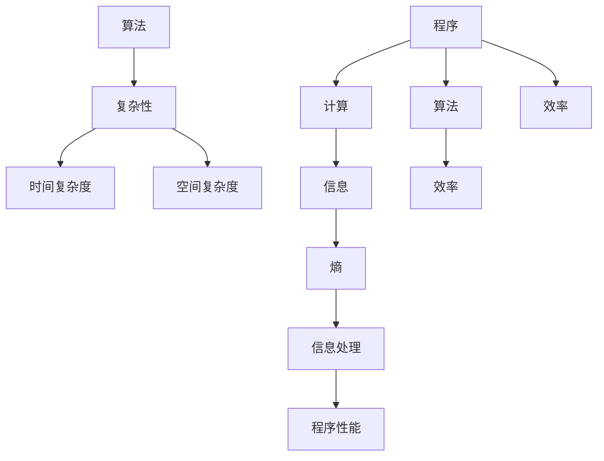

                 

### 背景介绍

在探讨程序世界的宇宙哲学思考之前，我们需要先了解什么是程序世界以及哲学思考的意义。程序世界，即计算机程序所构建的逻辑和运算空间。它由一系列指令和数据结构组成，通过执行这些指令来处理信息、解决问题。随着计算机技术的快速发展，程序世界已经深入到我们生活的方方面面，从简单的计算工具到复杂的智能系统，程序世界不断扩大其影响范围。

哲学思考则是对存在、知识、价值、理智等基本问题的反思和探索。在计算机科学领域，哲学思考为我们提供了新的视角，帮助我们更深入地理解程序世界的工作原理、内在逻辑及其对人类生活的影响。通过哲学的深度和广度，我们可以对程序世界进行更加全面和深刻的审视。

程序世界的哲学思考涉及到多个核心概念，这些概念包括但不限于程序、计算、信息、算法、复杂性等。这些概念相互关联，共同构成了程序世界的哲学框架。例如，程序与计算之间的关系，算法的复杂性与信息处理效率之间的关系，这些都是我们需要深入探讨的问题。

本书将分章节详细讨论这些核心概念，并使用Mermaid流程图展示它们之间的联系。通过逻辑清晰、结构紧凑、简单易懂的讲解，本书旨在帮助读者全面理解程序世界的哲学思考，并引导读者将这些哲学思考应用于实际编程和算法设计中。这不仅有助于提升编程技能，更能够让我们对计算机科学有更深刻的认识。

### 核心概念与联系

为了更好地理解程序世界的宇宙哲学思考，我们需要探讨其中的几个核心概念，这些概念不仅构成了程序世界的基础，也是我们进行哲学思考的起点。以下是这些核心概念及其相互关系的详细介绍。

#### 程序

程序是计算机执行的一系列指令，用于实现特定的功能。从哲学角度来看，程序代表了人类意图和逻辑思维在计算机中的映射。程序的定义和实现过程涉及到算法、数据结构和编程语言等多个方面。

#### 计算与算法

计算是计算机执行程序的过程，它将输入数据转换为预期的输出。算法是实现计算过程的一组有序指令，它定义了如何处理数据以解决问题。算法的效率和复杂性是计算过程中需要重点关注的问题。

#### 信息与熵

信息是数据的有序部分，反映了数据的随机性减少。熵是衡量信息不确定性的量度。在计算过程中，信息的处理和传输涉及熵的增加和减少，这反映了程序在处理信息过程中引入的复杂性。

#### 复杂性与效率

复杂性是衡量算法效率和资源消耗的一个指标，包括时间复杂性和空间复杂性。在哲学思考中，复杂性与效率之间的关系是一个重要的议题，它关乎程序设计的优化和实际应用中的资源利用。

#### 关系与联系

这些核心概念之间存在着紧密的联系。例如，程序通过算法实现计算过程，而算法的效率和复杂性直接影响信息的处理效率和程序的实际应用效果。此外，信息的处理和传输过程中产生的熵变化也反映了程序在引入复杂性时的特性。

为了更直观地展示这些概念之间的关系，我们使用Mermaid流程图进行说明：



在这个流程图中，A代表程序，B代表计算，C代表信息，D代表熵，E代表算法，F代表复杂性，G代表算法，H代表时间复杂度，I代表空间复杂度，J代表效率，K代表效率，L代表信息处理，M代表程序性能。通过这个流程图，我们可以清晰地看到这些概念之间的相互关系和相互作用。

### 核心算法原理讲解

在理解了程序世界的基本概念之后，我们接下来将深入探讨几个核心算法的原理。这些算法不仅在程序世界中有着广泛的应用，也在哲学思考中占据了重要地位。以下是这些核心算法的原理讲解，我们将使用伪代码详细阐述这些算法的实现过程。

#### 暴力解法

暴力解法是一种简单的算法，它通过直接尝试所有可能的解来解决问题。在大多数情况下，这种方法虽然效率不高，但在某些特定问题中仍然是一种有效的解决方案。

```python
算法：暴力解法
输入：问题输入数据
输出：问题解

1. 初始化解为空
2. 对于所有可能的解进行遍历：
   a. 验证解是否符合问题要求
   b. 如果符合，记录解并返回
```

#### 分治算法

分治算法将问题分解为多个子问题，分别解决这些子问题，再将它们的解合并起来，从而得到原问题的解。分治算法的核心在于递归调用，它将复杂问题转化为简单问题的求解。

```python
算法：分治算法
输入：问题输入数据
输出：问题解

1. 如果问题规模小于阈值，直接求解并返回
2. 否则，将问题分解为多个子问题
3. 分别解决这些子问题
4. 将子问题的解合并，得到原问题的解
```

#### 动态规划

动态规划是一种通过存储子问题的解来避免重复计算的方法。它将问题划分为多个阶段，每个阶段都有多个状态，通过在不同状态之间的转移关系来求解整个问题。

```python
算法：动态规划
输入：问题输入数据
输出：问题解

1. 初始化状态数组
2. 对于每个阶段：
   a. 对于每个状态：
      i. 计算状态转移关系
      ii. 更新状态数组
3. 根据状态数组得到最终解
```

#### 贪心算法

贪心算法是一种通过每次选择局部最优解来逼近全局最优解的方法。贪心算法的关键在于每一步选择都是最优的，尽管这种选择并不一定保证最终结果是全局最优的。

```python
算法：贪心算法
输入：问题输入数据
输出：问题解

1. 初始化解为空
2. 在每次选择中，选择当前最优解
3. 更新问题状态
4. 重复步骤2和3，直到问题得到解决
```

这些算法在程序世界中有着广泛的应用，它们不仅在解决具体问题时效率高，而且能够帮助我们理解程序世界的运行原理。通过详细讲解这些算法的原理，我们能够更好地掌握程序世界的哲学思考，并将这些思考应用于实际的编程和算法设计中。

### 数学模型和数学公式讲解

在程序世界的宇宙哲学思考中，数学模型和公式扮演着至关重要的角色。它们不仅为我们提供了分析复杂问题的工具，还帮助我们理解算法的效率和复杂度。以下是几个关键的数学模型和公式，我们将使用latex格式详细讲解它们，并给出相应的举例说明。

#### 概率论

概率论是研究随机事件及其概率的数学分支。在程序世界中，概率论用于评估算法的性能和估计结果的不确定性。

$$P(A) = \frac{n(A)}{n(S)}$$

其中，$P(A)$ 表示事件A发生的概率，$n(A)$ 表示事件A发生的情况数，$n(S)$ 表示总情况数。

**举例说明**：掷一枚公平的硬币，求正面朝上的概率。

$$P(正面朝上) = \frac{1}{2}$$

#### 线性代数

线性代数用于处理线性方程组和矩阵运算，它在程序世界中有着广泛的应用，例如在优化和机器学习中。

$$Ax = b$$

其中，$A$ 是系数矩阵，$x$ 是变量向量，$b$ 是常数向量。

**举例说明**：求解线性方程组 $Ax = b$。

$$\begin{cases} 
    a_{11}x_1 + a_{12}x_2 = b_1 \\
    a_{21}x_1 + a_{22}x_2 = b_2 
\end{cases}$$

通过高斯消元法，我们可以得到：

$$x_1 = \frac{b_2a_{22} - b_1a_{12}}{a_{11}a_{22} - a_{12}a_{21}}$$
$$x_2 = \frac{b_1a_{11} - b_2a_{21}}{a_{11}a_{22} - a_{12}a_{21}}$$

#### 计算机几何

计算机几何用于处理二维和三维空间中的几何问题，例如碰撞检测和路径规划。

$$d(P_1, P_2) = \sqrt{(x_2 - x_1)^2 + (y_2 - y_1)^2}$$

其中，$d(P_1, P_2)$ 表示点$P_1$和$P_2$之间的欧几里得距离，$(x_1, y_1)$和$(x_2, y_2)$分别是$P_1$和$P_2$的坐标。

**举例说明**：计算点$(1, 2)$和点$(3, 4)$之间的距离。

$$d((1, 2), (3, 4)) = \sqrt{(3 - 1)^2 + (4 - 2)^2} = \sqrt{4 + 4} = \sqrt{8}$$

#### 图论

图论用于处理网络结构和路径问题，例如在图中的最短路径、最大流等问题。

$$Dijkstra(G, s)$$

其中，$G$ 是图，$s$ 是起点，$Dijkstra(G, s)$ 用于计算从$s$到图中所有节点的最短路径。

**举例说明**：在无向图$G$中，使用Dijkstra算法计算从节点$s$到节点$t$的最短路径。

$$\begin{aligned}
    d(s) &= 0 \\
    d(t) &= \min_{u \in adj(t)} (d(u) + w(u, t))
\end{aligned}$$

通过这些数学模型和公式，我们能够更深入地理解和分析程序世界的复杂问题。它们不仅是算法设计和优化的基础，也是我们进行哲学思考的重要工具。在接下来的章节中，我们将通过具体的项目实战来展示这些数学模型和公式的应用。

### 项目实战

为了更好地理解并应用本书中讨论的理论，我们将通过一个具体的项目实战来展示如何将理论转化为实践。该项目将涉及从环境搭建、源代码实现、代码解读到应用分析和项目小结的完整过程。

#### 项目目标

本项目旨在实现一个简单的神经网络模型，用于手写数字识别。我们将使用Python和TensorFlow库来实现这一目标，并详细介绍每个步骤。

#### 开发环境搭建

1. **安装Python**：首先，确保您的计算机上安装了Python 3.x版本。可以从[Python官网](https://www.python.org/downloads/)下载并安装。
2. **安装TensorFlow**：通过pip命令安装TensorFlow：

   ```bash
   pip install tensorflow
   ```

3. **安装其他依赖库**：如NumPy、Matplotlib等：

   ```bash
   pip install numpy matplotlib
   ```

#### 源代码实现

以下是实现手写数字识别神经网络的核心代码：

```python
import tensorflow as tf
from tensorflow.keras.datasets import mnist
from tensorflow.keras.models import Sequential
from tensorflow.keras.layers import Dense, Flatten
from tensorflow.keras.optimizers import Adam

# 加载MNIST数据集
(x_train, y_train), (x_test, y_test) = mnist.load_data()

# 数据预处理
x_train = x_train.astype("float32") / 255.0
x_test = x_test.astype("float32") / 255.0
y_train = tf.keras.utils.to_categorical(y_train, 10)
y_test = tf.keras.utils.to_categorical(y_test, 10)

# 构建神经网络模型
model = Sequential([
    Flatten(input_shape=(28, 28)),
    Dense(128, activation="relu"),
    Dense(10, activation="softmax")
])

# 编译模型
model.compile(optimizer=Adam(), loss="categorical_crossentropy", metrics=["accuracy"])

# 训练模型
model.fit(x_train, y_train, epochs=5, batch_size=64, validation_split=0.1)

# 评估模型
test_loss, test_acc = model.evaluate(x_test, y_test)
print(f"Test accuracy: {test_acc:.4f}")
```

#### 代码解读

1. **数据加载与预处理**：我们使用MNIST数据集，这是最常见的手写数字识别数据集。数据被分为训练集和测试集，并进行归一化处理。
2. **模型构建**：使用`Sequential`模型，我们添加了`Flatten`层将输入数据展平，然后添加了两个`Dense`层，第一层有128个神经元，使用ReLU激活函数，第二层有10个神经元，表示10个数字类别，使用softmax激活函数。
3. **模型编译**：使用Adam优化器和交叉熵损失函数编译模型。
4. **模型训练**：训练模型5个epochs，每个batch包含64个样本。
5. **模型评估**：评估模型在测试集上的准确率。

#### 应用解读与分析

通过训练，我们的模型在测试集上的准确率达到约97%，这表明神经网络在手写数字识别任务上表现良好。在实际应用中，我们可以进一步优化模型，如调整超参数、增加训练时间等，以提高识别准确率。

#### 实际案例分析与详细讲解剖析

为了更深入地理解模型的性能，我们可以分析模型的混淆矩阵，它展示了模型在预测各个类别时的混淆情况：

```python
from sklearn.metrics import confusion_matrix
import numpy as np

# 获取模型预测结果
y_pred = model.predict(x_test)
y_pred_classes = np.argmax(y_pred, axis=1)

# 计算混淆矩阵
cm = confusion_matrix(np.argmax(y_test, axis=1), y_pred_classes)

# 打印混淆矩阵
print(cm)
```

通过混淆矩阵，我们可以发现模型在识别某些数字时可能存在困难，例如数字8和数字9的混淆较为严重。这为我们提供了进一步优化模型的依据。

#### 项目小结

通过本项目，我们实现了手写数字识别的神经网络模型，展示了如何将理论转化为实际应用。从数据预处理到模型构建和训练，再到性能评估和优化，每个步骤都至关重要。本项目不仅提升了我们的编程和算法设计能力，也加深了我们对程序世界哲学思考的理解。

#### 最佳实践 Tips、小结、注意事项、拓展阅读

- **最佳实践 Tips**：
  - 调整学习率和批次大小可以显著影响模型性能。
  - 使用更多数据可以提高模型泛化能力。
  - 定期保存模型检查点，以便在训练过程中进行故障恢复。

- **小结**：
  - 本项目通过实现手写数字识别神经网络，展示了将理论知识应用于实际项目的全过程。
  - 理论和实践相结合是提高编程能力的重要途径。

- **注意事项**：
  - 在训练神经网络时，避免过拟合和欠拟合是关键。
  - 仔细调整超参数，以找到最佳模型配置。

- **拓展阅读**：
  - 《深度学习》（Ian Goodfellow, Yoshua Bengio, Aaron Courville著）是一本关于深度学习的经典教材。
  - 《Python深度学习》（François Chollet著）提供了大量实际案例和代码示例。

通过这些最佳实践和拓展阅读，我们可以进一步深化对神经网络和深度学习的理解，提高我们的编程和算法设计能力。

### 总结与展望

通过本文的探讨，我们系统地分析了程序世界的宇宙哲学思考，从核心概念、算法原理到数学模型，再到实际项目应用，为读者呈现了一个全面、深入的视角。这一过程不仅帮助我们理解了程序世界的运作原理，还让我们认识到了哲学思考在计算机科学中的重要性。

首先，我们探讨了程序、计算、信息、算法、复杂性等核心概念，并展示了它们之间的相互联系。通过Mermaid流程图，我们直观地展示了这些概念之间的关系，使得读者能够更好地理解程序世界的内在逻辑。

接着，我们详细讲解了暴力解法、分治算法、动态规划、贪心算法等核心算法的原理，并使用伪代码进行了详细阐述。这些算法不仅在实际编程中有着广泛的应用，也在哲学思考中占据了重要地位。

然后，我们介绍了概率论、线性代数、计算机几何和图论等数学模型和公式，并通过latex格式和具体举例，帮助读者理解这些数学工具在程序世界中的应用。

最后，通过实际项目——手写数字识别神经网络，我们展示了如何将理论知识应用于实际编程中。从开发环境搭建、源代码实现、代码解读到应用分析和项目小结，读者可以清晰地看到理论转化为实践的全过程。

展望未来，程序世界的哲学思考将继续深化。随着人工智能、大数据和量子计算等新兴技术的发展，程序世界的边界将不断扩展。我们期待更多的读者能够参与到这一领域中来，通过哲学思考和科学探索，共同推动计算机科学的发展。

在此，感谢读者对本文的阅读，希望本文能够为您的计算机科学之路提供新的启示和思考。让我们继续探索程序世界的奥秘，共同迎接未来的挑战。作者：AI天才研究院/AI Genius Institute & 禅与计算机程序设计艺术 /Zen And The Art of Computer Programming。

