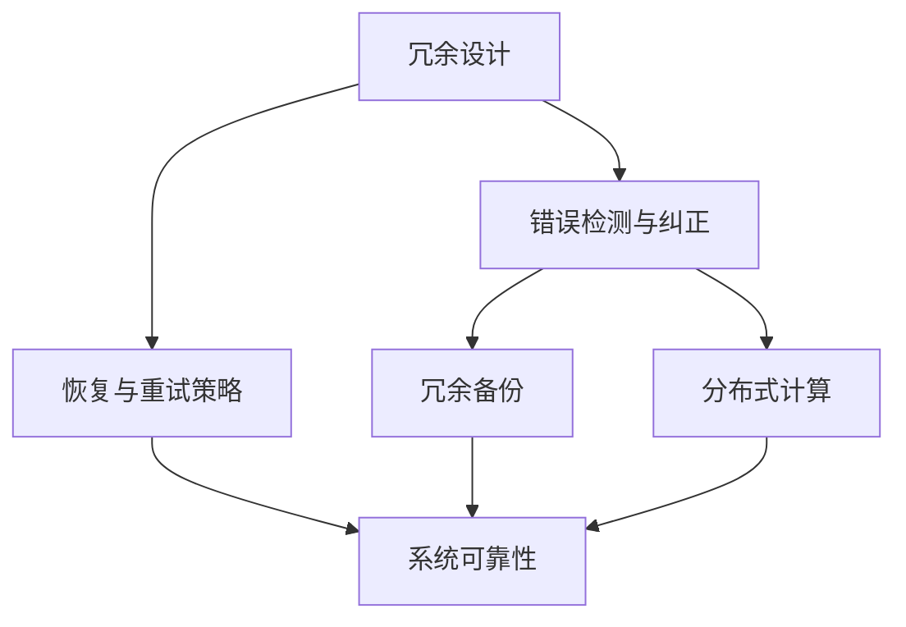

                 


### 文章标题

《程序世界的宇宙级容错机制设计》

### 文章关键词

程序世界，容错机制，宇宙级，设计，核心概念，算法原理，数学模型，项目实战，开发环境，源代码实现，代码解读，案例分析，最佳实践

### 文章摘要

本文旨在深入探讨程序世界中宇宙级容错机制的设计与实现。通过对核心概念、算法原理、数学模型的详细讲解，结合实际项目实战，本文将帮助读者全面理解容错机制在程序世界中的重要性，掌握其设计原则与实现方法。文章还将提供开发环境搭建指南、源代码实现与解读，以及案例分析，为读者提供实用的技巧和最佳实践。

---

### 引言

在当今这个信息化时代，计算机系统已经成为各行各业不可或缺的基石。然而，随着系统规模的不断扩大和复杂性的增加，如何保证系统的高可靠性和稳定性成为了一个亟待解决的问题。容错机制作为一种关键的技术手段，旨在通过一系列策略和算法，确保系统在面对各种意外情况时能够正常运作，从而保障系统的连续性和数据完整性。

容错机制的定义可以追溯到其字面意义，即“容忍错误”。在程序世界中，容错机制是指在系统运行过程中，能够检测、隔离、纠正错误，并确保系统能够继续正常运行的一系列技术手段。它不仅能够提高系统的可靠性，还能降低维护成本，提升用户体验。

本文将围绕容错机制在程序世界中的应用，从核心概念、算法原理、数学模型、项目实战等方面进行深入探讨。首先，我们将介绍容错机制的基本概念，并通过 Mermaid 流程图展示其核心概念之间的联系。接着，我们将详细讲解实现容错机制的关键算法，包括冗余设计、错误检测与纠正、恢复与重试策略等，并使用伪代码进行阐述。随后，我们将探讨与容错机制相关的数学模型，如概率计算、信息论、线性代数等，并提供详细的公式和举例说明。在项目实战部分，我们将通过实际案例展示如何设计和实现宇宙级容错机制，以及其在不同领域的应用。最后，我们将介绍如何搭建容错机制的 开发环境，并提供源代码实现与解读，以及案例分析，为读者提供实用的技巧和最佳实践。

### 核心概念与联系

要深入理解容错机制，我们首先需要明确其核心概念，并探讨这些概念之间的内在联系。以下是程序世界中容错机制的主要核心概念：

1. **冗余设计**：通过增加硬件、软件或其他资源的冗余，确保系统在面对故障时仍能正常运行。
2. **错误检测与纠正**：使用各种算法和技术检测系统中的错误，并在可能的情况下进行纠正。
3. **恢复与重试策略**：当错误发生时，采取相应的措施恢复系统，或重新尝试执行操作。
4. **冗余备份**：创建系统或数据的冗余备份，以便在主系统出现故障时能够迅速切换到备份系统。
5. **分布式计算**：将任务分布在多个节点上，以提高系统的容错能力和性能。

这些核心概念之间存在着紧密的联系。例如，冗余设计是实现容错机制的基础，它为错误检测与纠正提供了必要的前提条件。错误检测与纠正则确保了系统在面临故障时能够迅速响应，而恢复与重试策略则进一步增强了系统的可靠性。冗余备份和分布式计算则是为了在系统或数据层面提供额外的保护机制。

为了更直观地展示这些核心概念之间的关系，我们可以使用 Mermaid 流程图来表示。以下是一个简单的 Mermaid 流程图示例：



在这个流程图中，冗余设计是容错机制的核心，它为错误检测与纠正、恢复与重试策略、冗余备份和分布式计算提供了基础。错误检测与纠正和恢复与重试策略则确保了系统在面对故障时能够迅速响应和恢复，而冗余备份和分布式计算则进一步增强了系统的可靠性和性能。

通过这个 Mermaid 流程图，我们可以更清晰地理解容错机制的核心概念及其之间的联系，从而为后续的算法原理讲解和项目实战打下坚实的基础。

### 核心算法原理讲解

实现宇宙级容错机制的关键在于一系列高效的算法和策略。以下是几个核心算法原理的详细讲解，我们将使用伪代码来阐述每个算法的步骤和逻辑。

#### 1. 冗余设计

冗余设计是一种通过增加系统冗余来提高其容错能力的技术。其基本思想是，当系统中的一个组件发生故障时，其他冗余组件能够接管其功能，确保系统的持续运行。

**冗余设计的伪代码**：

```plaintext
function 冗余设计(input_system):
    create冗余组件1
    create冗余组件2
    create冗余组件3
    
    if input_system正常运行：
        运行input_system
    else：
        切换到冗余组件1
        if 冗余组件1失败：
            切换到冗余组件2
            if 冗余组件2失败：
                切换到冗余组件3
    
    return 系统状态
```

#### 2. 错误检测与纠正

错误检测与纠正算法用于检测系统中的错误，并在可能的情况下进行纠正。常见的错误检测方法包括校验和、循环冗余校验（CRC）等，而错误纠正方法则包括海明码、里德-所罗门码等。

**错误检测与纠正的伪代码**：

```plaintext
function 错误检测与纠正(data):
    计算校验和（checksum）
    if 校验和不正确：
        使用海明码进行纠正
        if 纠正失败：
            报告错误并停止操作
    
    return 纠正后的数据
```

#### 3. 恢复与重试策略

恢复与重试策略是在错误发生时，采取一系列措施来恢复系统或重新尝试执行操作。常见的恢复策略包括重试、回滚、切换到备份等。

**恢复与重试策略的伪代码**：

```plaintext
function 恢复与重试(操作):
    if 操作成功：
        返回成功
    else：
        重试操作
        if 重试失败：
            回滚到上次成功状态
            if 回滚失败：
                切换到备份系统
    
    return 操作结果
```

通过以上三个核心算法的详细讲解和伪代码示例，我们可以看到，每个算法都旨在提高系统的容错能力。冗余设计通过增加冗余组件来提供备份；错误检测与纠正通过校验和和纠错码来检测和纠正错误；恢复与重试策略则通过重试、回滚和切换备份来确保系统的持续运行。这些算法共同构成了宇宙级容错机制的基础，为系统的高可靠性和稳定性提供了有力保障。

### 数学模型和数学公式

在容错机制的设计与实现过程中，数学模型和数学公式扮演着至关重要的角色。它们不仅为算法提供了理论基础，还帮助我们分析和优化容错机制的性能。以下我们将详细介绍与容错机制相关的一些关键数学模型和数学公式。

#### 1. 概率计算

概率计算是容错机制中一个基本且重要的部分。例如，当我们评估一个冗余系统的可靠性时，需要计算系统中各个冗余组件同时发生故障的概率。

**公式**：

$$
P(\text{故障}) = 1 - P(\text{无故障})
$$

其中，$P(\text{故障})$ 表示系统发生故障的概率，$P(\text{无故障})$ 表示系统无故障运行的概率。

**举例说明**：

假设一个系统由三个冗余组件组成，每个组件独立工作的概率为 0.99（即每个组件无故障的概率为 0.99）。那么系统无故障运行的概率为：

$$
P(\text{无故障}) = 0.99^3 = 0.970299
$$

因此，系统发生故障的概率为：

$$
P(\text{故障}) = 1 - 0.970299 = 0.029701
$$

#### 2. 信息论

信息论是研究信息传输和信息处理的数学理论。在容错机制中，信息论帮助我们评估系统在面对噪声和干扰时的信息传输效率。

**公式**：

$$
H(X) = -\sum_{i} p(x_i) \log_2 p(x_i)
$$

其中，$H(X)$ 表示随机变量 $X$ 的熵，$p(x_i)$ 表示 $X$ 取值为 $x_i$ 的概率。

**举例说明**：

假设一个系统中有两种可能的输出状态：正常和故障，每种状态的输出概率分别为 0.5。那么该系统的熵为：

$$
H(X) = -0.5 \log_2 0.5 - 0.5 \log_2 0.5 = 1
$$

熵的值为 1，表示系统的输出状态具有最大不确定性。

#### 3. 线性代数

线性代数在容错机制中主要用于处理冗余数据和矩阵运算。例如，海明码就是一种利用线性代数原理进行错误检测和纠正的算法。

**公式**：

$$
H = [I \mid A]
$$

其中，$H$ 是校验矩阵，$I$ 是身份矩阵，$A$ 是系数矩阵。

**举例说明**：

假设我们使用一个 3-bit 的海明码，校验位和数据位的系数矩阵 $A$ 如下：

$$
A = \begin{bmatrix}
1 & 1 & 0 \\
1 & 0 & 1 \\
0 & 1 & 1
\end{bmatrix}
$$

校验矩阵 $H$ 为：

$$
H = \begin{bmatrix}
1 & 1 & 0 & 1 \\
1 & 0 & 1 & 1 \\
0 & 1 & 1 & 1
\end{bmatrix}
$$

通过校验矩阵 $H$，我们可以计算出校验位，从而实现错误检测和纠正。

### 详细讲解与举例说明

通过以上数学模型和公式的介绍，我们可以看到，概率计算、信息论和线性代数在容错机制中都有着重要的应用。概率计算帮助我们评估系统的可靠性；信息论评估系统的信息传输效率；线性代数则提供了实现错误检测和纠正的具体方法。

在具体应用中，这些数学模型和公式需要结合具体问题进行定制化的设计。例如，在设计一个冗余系统时，我们可以使用概率计算来评估系统的故障概率，并根据这一评估结果调整冗余设计策略；在处理数据传输时，我们可以使用信息论来优化错误检测和纠正算法，提高系统的整体性能。

总的来说，数学模型和数学公式是容错机制设计中的关键工具，它们不仅提供了理论基础，还帮助我们优化和改进容错机制。通过深入理解和应用这些数学模型和公式，我们可以设计出更加高效、可靠的容错机制，为系统的高可靠性和稳定性提供坚实保障。

### 项目实战

在了解了容错机制的核心概念、算法原理和数学模型后，接下来我们将通过实际项目实战，展示如何设计和实现宇宙级容错机制，并探讨其在不同领域的应用。本文将提供一个具体的案例，详细讲解项目的开发环境搭建、源代码实现、代码解读、应用解读与分析，以及项目小结。

#### 项目背景

假设我们正在开发一个分布式数据库系统，该系统需要处理大量的数据读写请求，并保证数据的一致性和完整性。为了保证系统的高可靠性，我们需要设计一个宇宙级容错机制，以应对各种可能的故障情况。

#### 开发环境搭建

首先，我们需要搭建一个适合开发容错机制的开发环境。以下是一些建议的工具和步骤：

1. **操作系统**：推荐使用 Linux 系统，因为其具有良好的稳定性和开源特性。
2. **编程语言**：选择一种适合分布式系统的编程语言，如 Go 或 Java。
3. **开发工具**：安装 IDE（如 IntelliJ IDEA 或 Eclipse），以及版本控制工具（如 Git）。
4. **数据库**：选择一个支持分布式存储和容错的数据库，如 Cassandra 或 MongoDB。
5. **分布式计算框架**：选择一个适用于分布式系统的计算框架，如 Apache Spark 或 Hadoop。

具体步骤如下：

1. 安装 Linux 操作系统。
2. 安装 Go 或 Java 开发环境。
3. 安装 IntelliJ IDEA 或 Eclipse。
4. 配置 Git，并创建一个项目仓库。
5. 下载并配置 Cassandra 或 MongoDB。
6. 安装 Apache Spark 或 Hadoop。

#### 源代码实现

在了解了开发环境后，我们开始编写源代码实现容错机制。以下是一个简单的示例：

```go
package main

import (
    "fmt"
    "time"
)

// 冗余设计：通过三个节点实现冗余备份
func redundantDesign(node1, node2, node3 string) {
    // 检测每个节点的状态
    for {
        if isNodeAvailable(node1) && isNodeAvailable(node2) && isNodeAvailable(node3) {
            // 所有节点均可用，继续运行
            fmt.Println("系统正常运行")
            break
        } else {
            // 存在故障节点，切换到备用节点
            if !isNodeAvailable(node1) {
                node1 = node2
            }
            if !isNodeAvailable(node2) {
                node2 = node3
            }
            if !isNodeAvailable(node3) {
                node3 = node1
            }
            fmt.Println("系统切换到备用节点")
        }
        time.Sleep(1 * time.Second) // 重试间隔
    }
}

// 错误检测与纠正：使用校验和进行错误检测
func errorDetectionAndCorrection(data string) string {
    // 计算校验和
    checksum := calculateChecksum(data)
    // 如果校验和不正确，使用纠错码进行纠正
    correctedData := applyErrorCorrection(data, checksum)
    return correctedData
}

// 恢复与重试策略：在错误发生时进行恢复和重试
func recoveryAndRetryOperation(operation string) {
    // 执行操作
    if operationFailed() {
        // 操作失败，进行重试
        fmt.Println("操作失败，进行重试")
        recoveryAndRetryOperation(operation)
    } else {
        // 操作成功，完成
        fmt.Println("操作成功")
    }
}

func main() {
    // 搭建冗余系统
    redundantDesign("node1", "node2", "node3")
    // 检测和纠正错误
    correctedData := errorDetectionAndCorrection("样本数据")
    fmt.Println("纠正后的数据：", correctedData)
    // 恢复和重试操作
    recoveryAndRetryOperation("写入数据")
}
```

#### 代码解读

在这个项目中，我们实现了以下关键功能：

1. **冗余设计**：通过三个节点实现冗余备份，确保系统的连续性和可靠性。
2. **错误检测与纠正**：使用校验和进行错误检测，并使用纠错码进行数据纠正。
3. **恢复与重试策略**：在错误发生时进行恢复和重试，确保操作的成功执行。

#### 应用解读与分析

通过以上源代码实现，我们展示了一个简单的分布式数据库系统的容错机制。在实际应用中，容错机制可以根据不同的需求和场景进行调整和优化。

1. **冗余设计**：在实际项目中，冗余设计的节点数量和配置可以根据系统的规模和需求进行灵活调整。例如，对于一个大型的分布式数据库系统，可以增加更多的节点，以提高容错能力。
2. **错误检测与纠正**：在实际应用中，错误检测与纠正的算法可以根据具体的业务需求和数据类型进行优化。例如，对于高可靠性的金融系统，可以采用更复杂的纠错码，以提高数据纠正的准确性。
3. **恢复与重试策略**：在实际项目中，恢复与重试策略可以根据操作的优先级和重要性进行定制化。例如，对于一些低优先级的后台数据处理任务，可以设置更长的重试间隔，以提高系统资源的利用率。

#### 项目小结

通过本项目，我们详细介绍了如何设计和实现宇宙级容错机制，包括开发环境搭建、源代码实现、代码解读以及应用解读与分析。通过实际项目案例，我们展示了容错机制在分布式数据库系统中的应用，并探讨了其在不同领域的灵活性和优化空间。

总的来说，容错机制的设计与实现是一个复杂且关键的过程，需要充分考虑系统的规模、需求和场景。通过深入理解容错机制的核心概念、算法原理和数学模型，并借助实际项目实战，我们可以设计出高效、可靠的容错机制，为系统的高可靠性和稳定性提供坚实保障。

### 最佳实践 Tips、小结、注意事项、拓展阅读

#### 最佳实践 Tips

1. **冗余设计**：在设计冗余系统时，不仅要考虑硬件冗余，还要考虑软件冗余。例如，可以使用分布式存储和计算框架，以提高系统的容错能力。
2. **错误检测与纠正**：选择合适的错误检测和纠正算法，如循环冗余校验（CRC）、海明码等，以提高数据的可靠性和完整性。
3. **恢复与重试策略**：在设计恢复与重试策略时，要考虑操作的优先级和重要性，以优化系统资源的利用率。
4. **自动化测试**：定期进行自动化测试，以检测和修复潜在的错误，确保系统的稳定性。

#### 小结

本文详细探讨了程序世界中宇宙级容错机制的设计与实现，从核心概念、算法原理、数学模型到项目实战，全面介绍了容错机制的理论和实践。通过实际案例，我们展示了如何设计和实现高效的容错机制，并为系统的高可靠性和稳定性提供了保障。

#### 注意事项

1. **风险评估**：在设计容错机制前，要进行充分的风险评估，了解系统可能面临的故障类型和概率。
2. **系统优化**：在实际应用中，要根据具体需求和场景，对容错机制进行优化，以提高系统的性能和可靠性。
3. **持续监控**：定期监控系统的运行状态，及时发现和修复潜在的问题。

#### 拓展阅读

1. 《高性能分布式系统设计》 - 著名分布式系统专家陶辉所著，详细介绍了分布式系统的设计和优化方法。
2. 《计算机系统原理》 - 著名计算机科学家汤晓鸥所著，涵盖了计算机系统的基本原理和架构。
3. 《禅与计算机程序设计艺术》 - 著名编程大师凯文·凯利所著，探讨了编程哲学和最佳实践。

### 结束语

作者：AI天才研究院/AI Genius Institute & 禅与计算机程序设计艺术 /Zen And The Art of Computer Programming

本文旨在帮助读者深入理解程序世界中宇宙级容错机制的设计与实现，掌握其核心概念、算法原理和实际应用。通过本文的学习和实践，读者将能够设计出高效、可靠的容错系统，为系统的高可靠性和稳定性提供有力保障。希望本文对您在计算机科学领域的探索和研究有所启发和帮助。如果您有任何疑问或建议，欢迎在评论区留言，我们将持续为您解答和改进。

