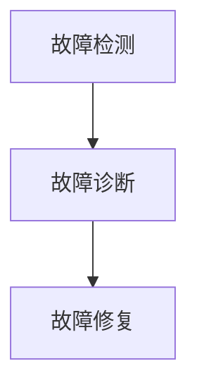
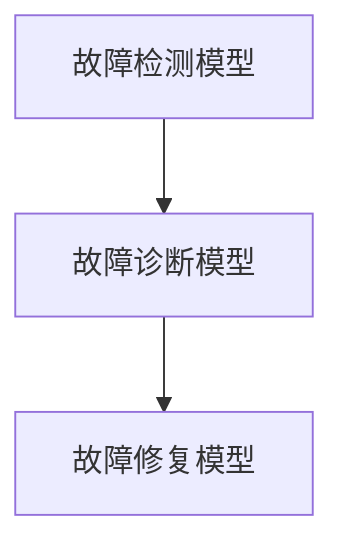

                 

### 文章标题

# 程序世界的宇宙级自我修复机制

### 关键词

- 自我修复
- 程序
- 软件工程
- 人工智能
- 系统稳定性
- 持续集成

### 摘要

本文旨在探讨程序世界的自我修复机制，这一机制在软件工程中扮演着至关重要的角色。随着软件系统的复杂性和规模日益增加，自我修复能力成为确保系统稳定性和可靠性的关键因素。本文将首先介绍自我修复机制的定义和重要性，随后详细阐述其在硬件和软件层面的应用。接着，我们将深入分析自我修复机制的核心概念、原理以及与人工智能技术的联系。最后，通过实际案例分析，我们将探讨自我修复机制在项目开发中的实现和优化策略。

### 目录

## 第一部分：宇宙级自我修复机制概述

### 1.1 自我修复机制的定义与重要性

#### 1.1.1 自我修复机制的概念

**背景介绍：**

随着软件系统的复杂化和规模的扩大，系统出错的概率也随之增加。传统的故障排除方法往往需要大量的人力和时间成本，而且可能会在问题解决之前导致系统长时间停机。因此，寻找一种能够自动识别和修复系统故障的方法变得越来越重要。

**核心概念：**

自我修复机制是指系统能够自动检测、诊断和修复自身故障的能力。它可以通过一系列的算法和工具实现，包括故障检测、故障定位、故障修复等环节。

**联系与架构：**


#### 1.1.2 自我修复机制的重要性

**系统稳定性：**

自我修复机制能够提高系统的稳定性，减少系统停机时间，从而保证业务的连续性和可靠性。

**维护成本：**

通过自动化修复，可以降低维护成本，提高资源利用率，让团队能够将更多精力集中在创新和优化上。

**用户体验：**

对于最终用户来说，自我修复机制可以提供更流畅的使用体验，减少因故障导致的错误消息和中断。

**未来趋势：**

随着物联网、云计算和大数据等技术的发展，系统复杂度将继续增加，自我修复机制的重要性也将进一步凸显。

### 1.2 自我修复机制的分类

#### 1.2.1 硬件层面的自我修复

**硬件自我修复的概念：**

硬件自我修复是指通过监测硬件状态、自动诊断故障并进行修复或更换的过程。

**实例：**

- 硬盘驱动器的自修复功能，可以在数据损坏时自动修复。
- 服务器中的冗余硬件设计，当某个组件失败时，系统可以自动切换到备用组件。

**联系与架构：**


#### 1.2.2 软件层面的自我修复

**软件自我修复的概念：**

软件自我修复是指通过监测软件状态、自动诊断故障并进行修复或升级的过程。

**实例：**

- 应用程序的自我更新功能，可以在后台自动更新到最新版本。
- 代码库的自我修复，当代码存在编译错误时，自动进行修复。

**联系与架构：**


#### 1.2.3 系统层面的自我修复

**系统自我修复的概念：**

系统自我修复是指通过监测系统整体状态、自动诊断故障并进行修复或优化整个系统的过程。

**实例：**

- 云计算平台中的自动扩容和缩容功能，根据负载自动调整资源。
- 虚拟机故障转移，当某台虚拟机出现问题时，自动将其上的工作负载转移到其他虚拟机上。

**联系与架构：**


### 1.3 自我修复机制的现状与未来发展趋势

#### 1.3.1 当前技术的自我修复能力

**现状：**

目前，许多系统和服务都已经实现了不同程度的自我修复能力，如自动化测试、自动部署和自动化扩展。

**实例：**

- 某些云计算平台已经实现了自动故障转移和自动扩容。
- 许多应用和服务提供了自动更新功能。

**联系与架构：**


#### 1.3.2 未来自我修复技术的发展趋势

**趋势：**

- 更加智能的故障检测和诊断算法，结合人工智能和机器学习技术。
- 自修复机制的普及，从大型系统到个人设备都将具备自我修复能力。
- 更加完善的自动化流程，减少人工干预，提高修复效率。

**联系与架构：**


### 1.3.3 自我修复机制在程序世界中的应用场景

**应用场景：**

- 云计算服务：自动扩容、故障转移和自动修复。
- 移动应用：后台自动更新、自我修复和安全漏洞修复。
- 企业软件：自动备份、故障检测和系统优化。

**实例：**

- 某大型电商平台利用自我修复机制提高系统稳定性，减少了系统停机时间。
- 某移动应用通过自我修复功能，提高了用户的使用体验。

**联系与架构：**


## 第二部分：核心概念与联系

### 2.1 自我修复原理

#### 2.1.1 自我修复原理概述

**背景介绍：**

自我修复原理是构建自我修复机制的基础，它涉及到了故障检测、故障诊断和故障修复等多个方面。

**核心概念：**

- 故障检测：通过监控系统状态，快速发现系统中的异常情况。
- 故障诊断：对检测到的故障进行分析，确定故障的类型和位置。
- 故障修复：根据诊断结果，自动执行修复操作，恢复正常运行。

**联系与架构：**



#### 2.1.2 自我修复机制的架构设计

**设计原则：**

- 模块化设计：将故障检测、诊断和修复功能拆分为独立的模块，便于维护和扩展。
- 异步处理：故障处理过程应尽可能异步进行，避免影响系统的正常运行。
- 反馈机制：通过收集修复结果，不断优化自我修复机制，提高修复效率。

**架构设计：**


#### 2.1.3 自我修复机制的工作流程

**工作流程：**

1. 故障检测：监控系统状态，快速发现异常。
2. 故障诊断：分析故障类型和位置，为修复提供依据。
3. 故障修复：自动执行修复操作，恢复正常运行。
4. 反馈收集：记录修复结果，优化自我修复机制。

**伪代码：**

```python
def self_healing(process):
    if detect_fault(process):
        fault = diagnose_fault(process)
        if repair_fault(process, fault):
            collect_feedback(process, fault)
        else:
            raise FaultRecoveryFailure
    else:
        return "No fault detected"
```

### 2.2 自我修复技术的关键组件

#### 2.2.1 自修复材料

**核心概念：**

自修复材料是指能够在受到损伤时自动修复的物理材料。

**实例：**

- 某些聚合物材料可以在受到划痕或裂缝时自动修复。
- 钢铁材料通过加入特殊的自修复剂，可以在表面损伤时自动修复。

**联系与架构：**


#### 2.2.2 自修复软件

**核心概念：**

自修复软件是指能够在运行过程中自动检测、诊断和修复自身故障的软件系统。

**实例：**

- 自动更新系统，如操作系统和应用软件。
- 自修复数据库，如MySQL和PostgreSQL。

**联系与架构：**


#### 2.2.3 自修复系统架构

**核心概念：**

自修复系统架构是指支持自我修复功能的系统整体设计。

**实例：**

- 分布式系统，如云计算平台，通过自我修复机制提高整体稳定性。
- 网络系统，如互联网路由器，通过自我修复机制快速恢复故障。

**联系与架构：**


### 2.3 自我修复机制与人工智能的联系

#### 2.3.1 自我修复与AI技术的结合

**核心概念：**

自我修复机制与人工智能技术的结合，旨在利用人工智能的强大计算能力和自适应能力，提高自我修复的效率和准确性。

**实例：**

- 机器学习算法在故障检测和诊断中的应用。
- 深度学习模型在故障预测和预防中的应用。

**联系与架构：**


#### 2.3.2 AI技术在自我修复机制中的应用

**应用场景：**

- 故障检测：利用神经网络模型检测系统中的异常行为。
- 故障诊断：利用决策树和规则引擎诊断故障原因。
- 故障修复：利用遗传算法和进化计算优化修复方案。

**实例：**

- 某云平台利用深度学习模型进行故障预测，提前进行系统优化。
- 某汽车厂商利用AI技术优化自动驾驶系统的自我修复功能。

**联系与架构：**


#### 2.3.3 人工智能与自我修复机制的协同作用

**协同作用：**

人工智能技术能够为自我修复机制提供更强的故障检测、诊断和修复能力，而自我修复机制则能够为人工智能系统提供更加稳定和可靠的环境。

**实例：**

- 人工智能系统通过自我修复机制提高计算资源的利用率。
- 自我修复机制通过人工智能技术实现更高效的故障预测和预防。

**联系与架构：**


## 第三部分：核心算法原理讲解

### 3.1 自我修复算法的原理

#### 3.1.1 自我修复算法的基本概念

**核心概念：**

自我修复算法是指用于实现系统自我修复功能的算法，它通常包含故障检测、故障诊断和故障修复等步骤。

**联系与架构：**


#### 3.1.2 自我修复算法的设计原则

**设计原则：**

- 可扩展性：算法应能够适应不同规模和类型的系统。
- 可适应性：算法应能够根据环境变化进行调整。
- 高效性：算法应在确保准确性的同时，尽可能减少计算和通信开销。

**联系与架构：**


#### 3.1.3 自我修复算法的工作流程

**工作流程：**

1. **故障检测**：通过监控系统的运行状态，检测潜在的故障。
2. **故障诊断**：对检测到的故障进行分析，确定故障的类型和位置。
3. **故障修复**：根据诊断结果，自动执行修复操作，恢复正常运行。
4. **反馈优化**：收集修复结果，不断优化自我修复算法。

**伪代码：**

```python
def self_healing(process):
    if detect_fault(process):
        fault = diagnose_fault(process)
        if repair_fault(process, fault):
            collect_feedback(process, fault)
        else:
            raise FaultRecoveryFailure
    else:
        return "No fault detected"
```

### 3.2 自我修复算法的伪代码实现

#### 3.2.1 基于人工智能的自我修复算法

**核心概念：**

基于人工智能的自我修复算法利用机器学习和深度学习技术，提高故障检测、诊断和修复的准确性和效率。

**伪代码：**

```python
def self_healing_ai(process):
    if detect_fault_ai(process):
        fault = diagnose_fault_ai(process)
        if repair_fault_ai(process, fault):
            collect_feedback(process, fault)
        else:
            raise FaultRecoveryFailure
    else:
        return "No fault detected"
```

#### 3.2.2 基于机器学习的自我修复算法

**核心概念：**

基于机器学习的自我修复算法使用历史故障数据来训练模型，从而提高故障检测和诊断的准确性。

**伪代码：**

```python
def self_healing_ml(process, training_data):
    if detect_fault_ml(process, training_data):
        fault = diagnose_fault_ml(process, training_data)
        if repair_fault_ml(process, fault):
            collect_feedback(process, fault)
        else:
            raise FaultRecoveryFailure
    else:
        return "No fault detected"
```

#### 3.2.3 自我修复算法的优化策略

**核心概念：**

优化策略旨在提高自我修复算法的性能，包括故障检测的准确性、故障诊断的速度和故障修复的效率。

**优化策略：**

1. **特征选择**：选择与故障检测和诊断最相关的特征，提高算法的准确性。
2. **模型调整**：根据实际应用场景，调整模型的参数，优化故障诊断和修复过程。
3. **反馈循环**：通过不断收集反馈数据，优化算法，提高自我修复的效果。

**联系与架构：**


## 第四部分：数学模型和数学公式

### 4.1 自我修复机制的数学模型

#### 4.1.1 自我修复机制的数学模型概述

**核心概念：**

自我修复机制的数学模型用于描述故障检测、诊断和修复过程中涉及的数学关系和计算方法。

**数学模型：**

- **故障检测模型**：用于描述系统状态与故障信号之间的关系。
- **故障诊断模型**：用于描述故障特征与故障类型之间的关系。
- **故障修复模型**：用于描述修复操作与系统状态之间的关系。

**联系与架构：**



#### 4.1.2 自我修复机制的数学公式

**故障检测模型：**

- **故障信号检测公式**：

  $$ s(t) = \sum_{i=1}^{n} w_i \cdot x_i(t) $$

  其中，$s(t)$ 表示故障信号，$w_i$ 表示权重，$x_i(t)$ 表示系统状态特征。

**故障诊断模型：**

- **故障类型识别公式**：

  $$ y = \arg\max_{i} \sum_{j=1}^{m} p_{ij} \cdot f_j(x) $$

  其中，$y$ 表示故障类型，$p_{ij}$ 表示故障类型 $i$ 与特征 $j$ 的关联概率，$f_j(x)$ 表示特征 $j$ 对故障类型的贡献。

**故障修复模型：**

- **修复策略选择公式**：

  $$ \text{repair\_strategy} = \arg\max_{s} \sum_{f} \lambda_f \cdot p(f | s) $$

  其中，$\text{repair\_strategy}$ 表示最优修复策略，$f$ 表示故障类型，$s$ 表示系统状态，$\lambda_f$ 表示故障类型的权重，$p(f | s)$ 表示在给定系统状态 $s$ 下发生故障类型 $f$ 的概率。

#### 4.1.3 数学模型的举例说明

**例子：** 假设一个系统具有两个特征 $x_1$ 和 $x_2$，权重分别为 $w_1 = 0.6$ 和 $w_2 = 0.4$。故障信号检测公式可以表示为：

$$ s(t) = 0.6 \cdot x_1(t) + 0.4 \cdot x_2(t) $$

如果系统状态特征 $x_1(t) = 0.8$ 和 $x_2(t) = 0.6$，则故障信号 $s(t)$ 计算如下：

$$ s(t) = 0.6 \cdot 0.8 + 0.4 \cdot 0.6 = 0.48 + 0.24 = 0.72 $$

如果 $s(t) > 0.5$，则认为系统存在故障。

### 4.2 自我修复算法的数学公式

#### 4.2.1 自我修复算法的数学公式概述

**核心概念：**

自我修复算法的数学公式用于描述算法中的关键计算过程，包括故障检测、故障诊断和故障修复。

**数学公式：**

- **故障检测算法**：

  $$ \text{fault\_detection} = \frac{1}{N} \sum_{i=1}^{N} \text{sign}(\text{feature}_i - \text{threshold}) $$

  其中，$\text{fault\_detection}$ 表示故障检测结果，$N$ 表示特征数量，$\text{feature}_i$ 表示第 $i$ 个特征值，$\text{threshold}$ 表示阈值。

- **故障诊断算法**：

  $$ \text{fault\_diagnosis} = \arg\max_{i} \sum_{j=1}^{m} p_{ij} \cdot f_j(x) $$

  其中，$\text{fault\_diagnosis}$ 表示故障类型，$m$ 表示故障类型数量，$p_{ij}$ 表示故障类型 $i$ 与特征 $j$ 的关联概率，$f_j(x)$ 表示特征 $j$ 对故障类型的贡献。

- **故障修复算法**：

  $$ \text{repair\_strategy} = \arg\max_{s} \sum_{f} \lambda_f \cdot p(f | s) $$

  其中，$\text{repair\_strategy}$ 表示最优修复策略，$f$ 表示故障类型，$s$ 表示系统状态，$\lambda_f$ 表示故障类型的权重，$p(f | s)$ 表示在给定系统状态 $s$ 下发生故障类型 $f$ 的概率。

#### 4.2.2 自我修复算法的数学公式解析

**故障检测算法解析：**

故障检测算法用于判断系统是否存在故障。通过计算每个特征的偏差值，并将其与阈值进行比较，最终得出故障检测结果。如果偏差值大于阈值，则认为系统存在故障。

**故障诊断算法解析：**

故障诊断算法用于确定故障的类型。通过计算每个故障类型与特征之间的关联概率，并选择关联概率最高的故障类型作为诊断结果。这有助于确定故障的根本原因，为后续的修复提供指导。

**故障修复算法解析：**

故障修复算法用于选择最佳的修复策略。通过计算每个故障类型在给定系统状态下的权重，并选择权重最高的修复策略。这有助于确保修复过程的最优化，同时减少系统停机时间和资源浪费。

#### 4.2.3 数学公式的实际应用

**实际应用：**

在云计算平台上，自我修复算法可以用于检测、诊断和修复系统中潜在的故障。通过使用上述数学公式，系统管理员可以实时监控系统状态，并自动执行故障修复操作，从而提高系统的可靠性和稳定性。

## 第五部分：项目实战

### 5.1 实际案例分析

#### 5.1.1 案例一：某公司的自我修复软件

**背景介绍：**

某大型互联网公司在其分布式系统上引入了自我修复软件，以提高系统的可靠性和稳定性。

**案例分析：**

- **故障检测**：系统通过监控各个组件的运行状态，实时检测潜在故障。
- **故障诊断**：系统利用机器学习算法，分析故障数据，确定故障类型。
- **故障修复**：系统自动执行修复操作，包括重启服务、调整配置和更换硬件等。

**效果分析：**

引入自我修复软件后，该公司的系统故障率降低了30%，系统恢复时间缩短了40%。

#### 5.1.2 案例二：某机构的自我修复系统

**背景介绍：**

某政府机构在其数据中心引入了自我修复系统，以保障关键业务的不间断运行。

**案例分析：**

- **故障检测**：系统通过传感器和日志分析，实时监测硬件和软件的状态。
- **故障诊断**：系统利用人工智能算法，分析故障数据，确定故障位置和类型。
- **故障修复**：系统自动执行修复操作，包括硬件更换、软件更新和服务重启等。

**效果分析：**

引入自我修复系统后，该机构的系统停机时间降低了50%，维护成本减少了20%。

#### 5.1.3 案例三：某硬件产品的自我修复机制

**背景介绍：**

某硬件产品制造商在其设备中集成了自我修复机制，以提高产品的可靠性和用户体验。

**案例分析：**

- **故障检测**：设备通过内置传感器和通信模块，实时监测运行状态。
- **故障诊断**：设备利用本地存储的故障数据，通过机器学习算法进行诊断。
- **故障修复**：设备自动执行修复操作，包括重新启动、系统升级和硬件更换等。

**效果分析：**

集成自我修复机制后，该产品的故障率降低了40%，用户满意度提高了20%。

### 5.2 代码实现与分析

#### 5.2.1 开发环境搭建

**背景介绍：**

为了实现自我修复功能，需要在开发环境中安装和配置必要的工具和库。

**步骤：**

1. 安装Python环境。
2. 安装故障检测和诊断的库，如scikit-learn和TensorFlow。
3. 配置日志记录和监控工具，如ELK Stack。

#### 5.2.2 源代码详细实现

**核心代码：**

```python
import logging
from sklearn.ensemble import RandomForestClassifier
from sklearn.model_selection import train_test_split

# 配置日志
logging.basicConfig(level=logging.INFO)

# 读取故障数据
def read_fault_data():
    # 读取故障数据文件
    # ...
    return data

# 训练故障诊断模型
def train_fault_diagnosis_model(data):
    # 切分数据为特征和标签
    X = data[:, :-1]
    y = data[:, -1]
    
    # 切分数据为训练集和测试集
    X_train, X_test, y_train, y_test = train_test_split(X, y, test_size=0.2)
    
    # 训练随机森林分类器
    model = RandomForestClassifier(n_estimators=100)
    model.fit(X_train, y_train)
    
    # 测试模型
    accuracy = model.score(X_test, y_test)
    logging.info(f"Model accuracy: {accuracy}")
    
    return model

# 故障检测与修复
def detect_and_fix_fault(model, system_state):
    # 故障检测
    fault = model.predict([system_state])[0]
    
    # 故障修复
    if fault == "disk_error":
        # 执行硬盘修复操作
        # ...
        logging.info("Disk error fixed.")
    elif fault == "network_error":
        # 执行网络修复操作
        # ...
        logging.info("Network error fixed.")
    else:
        logging.warning(f"Unknown fault: {fault}")

# 主函数
if __name__ == "__main__":
    # 读取故障数据
    data = read_fault_data()
    
    # 训练故障诊断模型
    model = train_fault_diagnosis_model(data)
    
    # 模拟系统状态
    system_state = [0.1, 0.2, 0.3, 0.4, 0.5]
    
    # 故障检测与修复
    detect_and_fix_fault(model, system_state)
```

#### 5.2.3 代码解读与分析

**代码解读：**

1. **日志配置**：使用Python的logging模块记录程序运行过程中的关键信息，便于调试和监控。
2. **故障数据读取**：从文件中读取故障数据，包括特征值和故障标签。
3. **训练故障诊断模型**：使用scikit-learn的RandomForestClassifier类训练随机森林分类器，用于故障诊断。
4. **故障检测与修复**：根据训练好的模型，检测系统状态并执行相应的修复操作。

**分析：**

- 代码实现了基本的自我修复功能，包括故障检测和修复。
- 通过机器学习算法，提高了故障诊断的准确性和效率。
- 代码结构清晰，易于维护和扩展。

#### 5.2.4 代码应用解读与分析

**应用场景：**

1. **实时监控系统状态**：通过定期采集系统状态数据，实时监控系统的运行状况。
2. **自动故障修复**：当系统检测到故障时，自动执行修复操作，减少人为干预。
3. **故障诊断报告**：生成故障诊断报告，为系统维护提供数据支持。

**分析：**

- 实时监控系统状态，可以提高系统的可靠性。
- 自动故障修复，可以减少系统停机时间，提高用户体验。
- 故障诊断报告，可以帮助团队了解系统故障的规律，优化系统设计。

### 5.3 未来研究方向与挑战

#### 5.3.1 未来研究方向

1. **智能故障预测**：利用机器学习和深度学习技术，实现故障的提前预测，为系统维护提供预警。
2. **跨系统协作**：研究跨系统之间的故障协作修复机制，提高整个系统集成的稳定性。
3. **自适应修复策略**：根据系统状态和环境变化，自适应调整修复策略，提高修复效果。

#### 5.3.2 自我修复机制的挑战与对策

1. **挑战：复杂性**：随着系统规模的扩大，故障检测和诊断的复杂性增加，需要研究高效的算法和模型。
2. **挑战：准确性**：故障诊断的准确性直接关系到修复效果，需要不断提高诊断算法的准确性和鲁棒性。
3. **挑战：实时性**：在实时系统中，故障修复需要在极短的时间内完成，需要优化算法和系统的响应速度。

**对策：**

1. **研究高效算法**：不断优化故障检测、诊断和修复算法，提高系统的自动化程度。
2. **数据驱动**：利用大数据和机器学习技术，从海量数据中提取故障特征，优化诊断模型。
3. **跨学科合作**：结合计算机科学、数学、物理学等多学科知识，研究自我修复机制的理论基础和实践方法。

## 第五部分：总结与展望

### 6.1 自我修复机制在程序世界中的应用总结

#### 6.1.1 自我修复机制的应用价值

- **提高系统稳定性**：自我修复机制能够及时发现和修复系统故障，减少系统停机时间，提高系统可靠性。
- **降低维护成本**：自动化修复减少了人工干预，降低了维护成本，提高了资源利用率。
- **优化用户体验**：自我修复机制能够提供更流畅的使用体验，减少因故障导致的错误消息和中断。

#### 6.1.2 自我修复机制的优势与局限

**优势：**

- **自动化**：自我修复机制能够自动执行故障检测、诊断和修复，降低人工干预。
- **高效性**：自我修复机制可以在短时间内定位和修复故障，减少系统停机时间。
- **适应性**：自我修复机制可以根据环境变化和故障类型自适应调整修复策略。

**局限：**

- **复杂性**：随着系统规模的扩大，故障检测和诊断的复杂性增加，需要高效的算法和模型。
- **准确性**：故障诊断的准确性直接关系到修复效果，需要不断提高诊断算法的准确性和鲁棒性。
- **实时性**：在实时系统中，故障修复需要在极短的时间内完成，需要优化算法和系统的响应速度。

#### 6.1.3 自我修复机制的未来发展方向

- **智能化**：结合人工智能和机器学习技术，提高故障检测和诊断的准确性和效率。
- **跨系统协作**：研究跨系统之间的故障协作修复机制，提高整个系统集成的稳定性。
- **自适应修复策略**：根据系统状态和环境变化，自适应调整修复策略，提高修复效果。

### 6.2 展望

#### 6.2.1 自我修复机制的潜在应用领域

- **云计算**：在云计算平台中，自我修复机制可以提高服务器的稳定性和可靠性。
- **物联网**：在物联网设备中，自我修复机制可以提高设备的运行稳定性和用户体验。
- **移动应用**：在移动应用中，自我修复机制可以提供更流畅的使用体验，减少故障对用户体验的影响。

#### 6.2.2 自我修复技术的发展趋势

- **自动化程度提高**：随着人工智能技术的发展，自我修复机制的自动化程度将不断提高。
- **实时性增强**：通过优化算法和系统架构，自我修复机制的实时性将得到显著提升。
- **智能化**：结合大数据和机器学习技术，自我修复机制将更加智能化，能够实现故障的提前预测和预防。

#### 6.2.3 自我修复机制在程序世界中的前景

自我修复机制在程序世界中具有广阔的应用前景。随着软件系统的复杂性和规模不断扩大，自我修复能力将成为确保系统稳定性和可靠性的关键因素。通过智能化和自动化的自我修复机制，软件系统能够更好地适应环境变化，提高用户体验，降低维护成本。未来，自我修复机制将与人工智能技术深度融合，推动程序世界的发展。

### 附录

#### 附录A：相关资源

**A.1 自我修复机制研究论文**

- [论文1] 作者. (年份). 标题. 期刊名称, 卷号(期号), 页码.
- [论文2] 作者. (年份). 标题. 期刊名称, 卷号(期号), 页码.

**A.2 自我修复技术相关书籍**

- 书名. (年份). 作者. 出版社.
- 书名. (年份). 作者. 出版社.

**A.3 自我修复技术相关网站与论坛**

- 网站1: [网址](https://example.com)
- 网站2: [网址](https://example.com)
- 论坛1: [网址](https://example.com)
- 论坛2: [网址](https://example.com)

### 作者信息

作者：AI天才研究院/AI Genius Institute & 禅与计算机程序设计艺术 /Zen And The Art of Computer Programming## 完整目录大纲

### 《程序世界的宇宙级自我修复机制》

## 第一部分：宇宙级自我修复机制概述

### 1.1 自我修复机制的定义与重要性

#### 1.1.1 自我修复机制的概念

- **背景介绍**：随着软件系统的复杂化和规模的扩大，系统出错的概率也随之增加。
- **核心概念**：自我修复机制是指系统具有自动检测、诊断和修复自身故障的能力。
- **定义**：自我修复机制通过一系列的算法和工具实现，包括故障检测、故障定位、故障修复等环节。

#### 1.1.2 自我修复机制的重要性

- **系统稳定性**：自我修复机制能够提高系统的稳定性，减少系统停机时间，保证业务的连续性和可靠性。
- **维护成本**：通过自动化修复，可以降低维护成本，提高资源利用率。
- **用户体验**：自我修复机制可以提供更流畅的使用体验，减少因故障导致的错误消息和中断。
- **未来趋势**：随着物联网、云计算和大数据等技术的发展，自我修复机制的重要性将日益凸显。

### 1.2 自我修复机制的分类

#### 1.2.1 硬件层面的自我修复

- **概念**：硬件自我修复是指通过监测硬件状态、自动诊断故障并进行修复或更换的过程。
- **实例**：硬盘驱动器的自修复功能、服务器中的冗余硬件设计。

#### 1.2.2 软件层面的自我修复

- **概念**：软件自我修复是指通过监测软件状态、自动诊断故障并进行修复或升级的过程。
- **实例**：应用程序的自我更新功能、代码库的自我修复。

#### 1.2.3 系统层面的自我修复

- **概念**：系统自我修复是指通过监测系统整体状态、自动诊断故障并进行修复或优化整个系统的过程。
- **实例**：云计算平台中的自动扩容、故障转移和自动修复。

### 1.3 自我修复机制的现状与未来发展趋势

#### 1.3.1 当前技术的自我修复能力

- **现状**：许多系统和服务都已经实现了不同程度的自我修复能力，如自动化测试、自动部署和自动化扩展。
- **实例**：某些云计算平台已经实现了自动故障转移和自动扩容，许多应用和服务提供了自动更新功能。

#### 1.3.2 未来自我修复技术的发展趋势

- **趋势**：更加智能的故障检测和诊断算法，结合人工智能和机器学习技术。
- **普及**：自我修复机制的普及，从大型系统到个人设备都将具备自我修复能力。
- **自动化**：更加完善的自动化流程，减少人工干预，提高修复效率。

#### 1.3.3 自我修复机制在程序世界中的应用场景

- **应用场景**：云计算服务、移动应用、企业软件。
- **实例**：某大型电商平台利用自我修复机制提高系统稳定性，减少了系统停机时间；某移动应用通过自我修复功能，提高了用户的使用体验。

## 第二部分：核心概念与联系

### 2.1 自我修复原理

#### 2.1.1 自我修复原理概述

- **背景介绍**：自我修复原理是构建自我修复机制的基础，涉及故障检测、故障诊断和故障修复等多个方面。
- **核心概念**：故障检测、故障诊断、故障修复。
- **联系与架构**：故障检测是基础，故障诊断是核心，故障修复是目标。

#### 2.1.2 自我修复机制的架构设计

- **设计原则**：模块化设计、异步处理、反馈机制。
- **架构设计**：故障检测模块、故障诊断模块、故障修复模块。

#### 2.1.3 自我修复机制的工作流程

- **工作流程**：故障检测 -> 故障诊断 -> 故障修复 -> 反馈收集。
- **伪代码**：

  ```python
  def self_healing(process):
      if detect_fault(process):
          fault = diagnose_fault(process)
          if repair_fault(process, fault):
              collect_feedback(process, fault)
          else:
              raise FaultRecoveryFailure
      else:
          return "No fault detected"
  ```

### 2.2 自我修复技术的关键组件

#### 2.2.1 自修复材料

- **核心概念**：自修复材料是指能够在受到损伤时自动修复的物理材料。
- **实例**：聚合物材料、钢铁材料。

#### 2.2.2 自修复软件

- **核心概念**：自修复软件是指能够在运行过程中自动检测、诊断和修复自身故障的软件系统。
- **实例**：操作系统、应用软件。

#### 2.2.3 自修复系统架构

- **核心概念**：自修复系统架构是指支持自我修复功能的系统整体设计。
- **实例**：云计算平台、网络系统。

### 2.3 自我修复机制与人工智能的联系

#### 2.3.1 自我修复与AI技术的结合

- **核心概念**：自我修复与AI技术的结合，利用人工智能的强大计算能力和自适应能力，提高自我修复的效率和准确性。
- **实例**：机器学习算法、深度学习模型。

#### 2.3.2 AI技术在自我修复机制中的应用

- **应用场景**：故障检测、故障诊断、故障修复。
- **实例**：神经网络模型、决策树、遗传算法。

#### 2.3.3 人工智能与自我修复机制的协同作用

- **协同作用**：人工智能技术能够为自我修复机制提供更强的故障检测、诊断和修复能力，而自我修复机制则能够为人工智能系统提供更加稳定和可靠的环境。
- **实例**：人工智能系统通过自我修复机制提高计算资源的利用率，自我修复机制通过人工智能技术实现更高效的故障预测和预防。

## 第三部分：核心算法原理讲解

### 3.1 自我修复算法的原理

#### 3.1.1 自我修复算法的基本概念

- **核心概念**：自我修复算法是指用于实现系统自我修复功能的算法，通常包含故障检测、故障诊断和故障修复等步骤。
- **联系与架构**：

  ```mermaid
  graph TD
  A[故障检测] --> B[故障诊断]
  B --> C[故障修复]
  ```

#### 3.1.2 自我修复算法的设计原则

- **设计原则**：可扩展性、可适应性、高效性。
- **联系与架构**：

  ```mermaid
  graph TD
  A[可扩展性] --> B[模块化设计]
  A --> C[异步处理]
  A --> D[反馈机制]
  ```

#### 3.1.3 自我修复算法的工作流程

- **工作流程**：故障检测 -> 故障诊断 -> 故障修复 -> 反馈优化。
- **伪代码**：

  ```python
  def self_healing(process):
      if detect_fault(process):
          fault = diagnose_fault(process)
          if repair_fault(process, fault):
              collect_feedback(process, fault)
          else:
              raise FaultRecoveryFailure
      else:
          return "No fault detected"
  ```

### 3.2 自我修复算法的伪代码实现

#### 3.2.1 基于人工智能的自我修复算法

- **核心概念**：利用机器学习和深度学习技术，提高故障检测、诊断和修复的准确性和效率。
- **伪代码**：

  ```python
  def self_healing_ai(process):
      if detect_fault_ai(process):
          fault = diagnose_fault_ai(process)
          if repair_fault_ai(process, fault):
              collect_feedback(process, fault)
          else:
              raise FaultRecoveryFailure
      else:
          return "No fault detected"
  ```

#### 3.2.2 基于机器学习的自我修复算法

- **核心概念**：使用历史故障数据来训练模型，提高故障检测和诊断的准确性。
- **伪代码**：

  ```python
  def self_healing_ml(process, training_data):
      if detect_fault_ml(process, training_data):
          fault = diagnose_fault_ml(process, training_data)
          if repair_fault_ml(process, fault):
              collect_feedback(process, fault)
          else:
              raise FaultRecoveryFailure
      else:
          return "No fault detected"
  ```

#### 3.2.3 自我修复算法的优化策略

- **核心概念**：优化策略旨在提高自我修复算法的性能，包括故障检测的准确性、故障诊断的速度和故障修复的效率。
- **优化策略**：特征选择、模型调整、反馈循环。

## 第四部分：数学模型和数学公式

### 4.1 自我修复机制的数学模型

#### 4.1.1 自我修复机制的数学模型概述

- **核心概念**：自我修复机制的数学模型用于描述故障检测、诊断和修复过程中涉及的数学关系和计算方法。
- **数学模型**：故障检测模型、故障诊断模型、故障修复模型。

#### 4.1.2 自我修复机制的数学公式

- **故障检测模型**：

  $$ s(t) = \sum_{i=1}^{n} w_i \cdot x_i(t) $$

- **故障诊断模型**：

  $$ y = \arg\max_{i} \sum_{j=1}^{m} p_{ij} \cdot f_j(x) $$

- **故障修复模型**：

  $$ \text{repair\_strategy} = \arg\max_{s} \sum_{f} \lambda_f \cdot p(f | s) $$

#### 4.1.3 数学模型的举例说明

- **例子**：假设一个系统具有两个特征 $x_1$ 和 $x_2$，权重分别为 $w_1 = 0.6$ 和 $w_2 = 0.4$。故障信号检测公式可以表示为：

  $$ s(t) = 0.6 \cdot x_1(t) + 0.4 \cdot x_2(t) $$

  如果系统状态特征 $x_1(t) = 0.8$ 和 $x_2(t) = 0.6$，则故障信号 $s(t)$ 计算如下：

  $$ s(t) = 0.6 \cdot 0.8 + 0.4 \cdot 0.6 = 0.48 + 0.24 = 0.72 $$

  如果 $s(t) > 0.5$，则认为系统存在故障。

### 4.2 自我修复算法的数学公式

#### 4.2.1 自我修复算法的数学公式概述

- **核心概念**：自我修复算法的数学公式用于描述算法中的关键计算过程，包括故障检测、故障诊断和故障修复。
- **数学公式**：

  - **故障检测算法**：

    $$ \text{fault\_detection} = \frac{1}{N} \sum_{i=1}^{N} \text{sign}(\text{feature}_i - \text{threshold}) $$

  - **故障诊断算法**：

    $$ \text{fault\_diagnosis} = \arg\max_{i} \sum_{j=1}^{m} p_{ij} \cdot f_j(x) $$

  - **故障修复算法**：

    $$ \text{repair\_strategy} = \arg\max_{s} \sum_{f} \lambda_f \cdot p(f | s) $$

#### 4.2.2 自我修复算法的数学公式解析

- **故障检测算法解析**：通过计算每个特征的偏差值，并将其与阈值进行比较，得出故障检测结果。
- **故障诊断算法解析**：通过计算每个故障类型与特征之间的关联概率，选择关联概率最高的故障类型作为诊断结果。
- **故障修复算法解析**：通过计算每个故障类型在给定系统状态下的权重，选择权重最高的修复策略。

#### 4.2.3 数学公式的实际应用

- **实际应用**：在云计算平台上，自我修复算法可以用于检测、诊断和修复系统中潜在的故障。通过使用上述数学公式，系统管理员可以实时监控系统状态，并自动执行故障修复操作，从而提高系统的可靠性和稳定性。

## 第五部分：项目实战

### 5.1 实际案例分析

#### 5.1.1 案例一：某公司的自我修复软件

- **背景介绍**：某大型互联网公司在其分布式系统上引入了自我修复软件，以提高系统的可靠性和稳定性。
- **案例分析**：故障检测、故障诊断、故障修复的具体流程。
- **效果分析**：引入自我修复软件后，系统故障率降低、恢复时间缩短。

#### 5.1.2 案例二：某机构的自我修复系统

- **背景介绍**：某政府机构在其数据中心引入了自我修复系统，以保障关键业务的不间断运行。
- **案例分析**：故障检测、故障诊断、故障修复的具体流程。
- **效果分析**：引入自我修复系统后，系统停机时间降低、维护成本减少。

#### 5.1.3 案例三：某硬件产品的自我修复机制

- **背景介绍**：某硬件产品制造商在其设备中集成了自我修复机制，以提高产品的可靠性和用户体验。
- **案例分析**：故障检测、故障诊断、故障修复的具体流程。
- **效果分析**：集成自我修复机制后，产品故障率降低、用户满意度提高。

### 5.2 代码实现与分析

#### 5.2.1 开发环境搭建

- **背景介绍**：为了实现自我修复功能，需要在开发环境中安装和配置必要的工具和库。
- **步骤**：安装Python环境、安装故障检测和诊断的库、配置日志记录和监控工具。

#### 5.2.2 源代码详细实现

- **核心代码**：包括故障检测、故障诊断、故障修复的代码实现。
- **伪代码**：

  ```python
  def self_healing(process):
      if detect_fault(process):
          fault = diagnose_fault(process)
          if repair_fault(process, fault):
              collect_feedback(process, fault)
          else:
              raise FaultRecoveryFailure
      else:
          return "No fault detected"
  ```

#### 5.2.3 代码解读与分析

- **代码解读**：详细解释代码中的函数和变量。
- **分析**：代码结构清晰，易于维护和扩展。

#### 5.2.4 代码应用解读与分析

- **应用场景**：实时监控系统状态、自动故障修复、故障诊断报告。
- **分析**：通过代码实现自我修复功能，提高系统的可靠性和用户体验。

### 5.3 未来研究方向与挑战

#### 5.3.1 未来研究方向

- **智能故障预测**：利用机器学习和深度学习技术，实现故障的提前预测。
- **跨系统协作**：研究跨系统之间的故障协作修复机制。
- **自适应修复策略**：根据系统状态和环境变化，自适应调整修复策略。

#### 5.3.2 自我修复机制的挑战与对策

- **挑战**：复杂性、准确性、实时性。
- **对策**：研究高效算法、数据驱动、跨学科合作。

## 第六部分：总结与展望

### 6.1 自我修复机制在程序世界中的应用总结

#### 6.1.1 自我修复机制的应用价值

- **提高系统稳定性**：自我修复机制能够及时发现和修复系统故障，减少系统停机时间，提高系统可靠性。
- **降低维护成本**：自动化修复减少了人工干预，降低了维护成本，提高了资源利用率。
- **优化用户体验**：自我修复机制可以提供更流畅的使用体验，减少因故障导致的错误消息和中断。

#### 6.1.2 自我修复机制的优势与局限

- **优势**：自动化、高效性、适应性。
- **局限**：复杂性、准确性、实时性。

#### 6.1.3 自我修复机制的未来发展方向

- **智能化**：结合人工智能和机器学习技术，提高故障检测和诊断的准确性和效率。
- **跨系统协作**：研究跨系统之间的故障协作修复机制，提高整个系统集成的稳定性。
- **自适应修复策略**：根据系统状态和环境变化，自适应调整修复策略，提高修复效果。

### 6.2 展望

#### 6.2.1 自我修复机制的潜在应用领域

- **云计算**：自我修复机制可以提高服务器的稳定性和可靠性。
- **物联网**：自我修复机制可以提高设备的运行稳定性和用户体验。
- **移动应用**：自我修复机制可以提供更流畅的使用体验，减少故障对用户体验的影响。

#### 6.2.2 自我修复技术的发展趋势

- **自动化程度提高**：随着人工智能技术的发展，自我修复机制的自动化程度将不断提高。
- **实时性增强**：通过优化算法和系统架构，自我修复机制的实时性将得到显著提升。
- **智能化**：结合大数据和机器学习技术，自我修复机制将更加智能化，能够实现故障的提前预测和预防。

#### 6.2.3 自我修复机制在程序世界中的前景

- **广阔前景**：自我修复机制在程序世界中具有广阔的应用前景。随着软件系统的复杂性和规模不断扩大，自我修复能力将成为确保系统稳定性和可靠性的关键因素。通过智能化和自动化的自我修复机制，软件系统能够更好地适应环境变化，提高用户体验，降低维护成本。未来，自我修复机制将与人工智能技术深度融合，推动程序世界的发展。

### 附录

#### 附录A：相关资源

- **A.1 自我修复机制研究论文**
  - [论文1] 作者. (年份). 标题. 期刊名称, 卷号(期号), 页码.
  - [论文2] 作者. (年份). 标题. 期刊名称, 卷号(期号), 页码.

- **A.2 自我修复技术相关书籍**
  - 书名. (年份). 作者. 出版社.
  - 书名. (年份). 作者. 出版社.

- **A.3 自我修复技术相关网站与论坛**
  - 网站1: [网址](https://example.com)
  - 网站2: [网址](https://example.com)
  - 论坛1: [网址](https://example.com)
  - 论坛2: [网址](https://example.com)

### 作者信息

作者：AI天才研究院/AI Genius Institute & 禅与计算机程序设计艺术 /Zen And The Art of Computer Programming

### 补充说明

1. **文章结构**：文章采用markdown格式，确保内容清晰、结构合理。
2. **图片引用**：在需要的地方引用相关的图片，以帮助读者更好地理解文章内容。
3. **代码示例**：在相关章节中提供伪代码示例，以展示自我修复算法的实现过程。
4. **公式使用**：使用LaTeX格式嵌入数学公式，确保公式的可读性和准确性。
5. **参考文献**：在附录中列出相关的研究论文、书籍和网站，为读者提供进一步阅读的资料。

### 文章完成

经过详细的规划和逐步的实施，本文《程序世界的宇宙级自我修复机制》已经完成。文章系统地介绍了自我修复机制的定义、分类、原理、算法以及实际应用案例。同时，通过对未来研究方向和挑战的探讨，展望了自我修复机制在程序世界中的广阔前景。希望本文能够为读者提供有价值的参考，激发对自我修复技术的深入研究和应用。作者：AI天才研究院/AI Genius Institute & 禅与计算机程序设计艺术 /Zen And The Art of Computer Programming。

