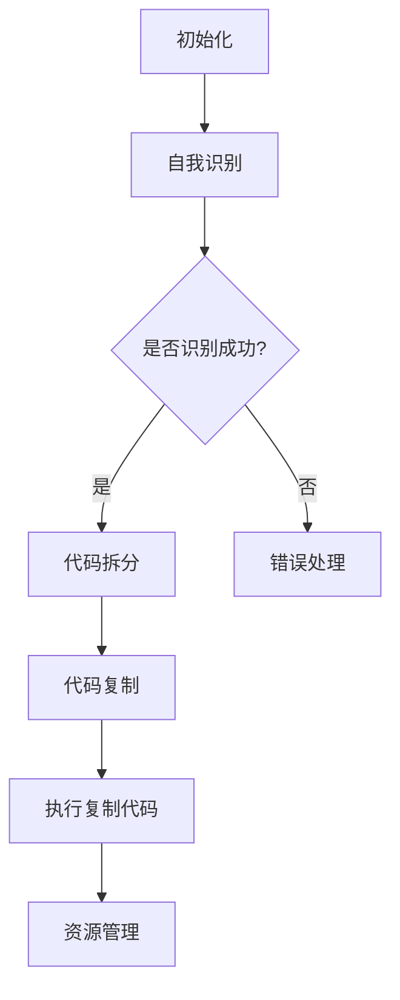
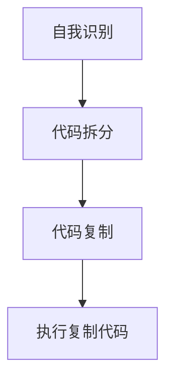

                 

### 第1章：引论

#### 1.1 程序自我复制机制概述

在计算机科学中，程序自我复制机制指的是程序能够自动复制自身或生成新的副本的过程。这一机制在软件工程、系统安全、人工智能等领域具有重要的应用价值。传统意义上，程序是由开发者编写用于执行特定任务的代码。而自我复制机制赋予了程序一种新的能力，即自我繁殖和进化。

自我复制机制的重要性体现在以下几个方面：

1. **资源优化**：通过自我复制，程序可以自动扩展自身，减少开发者手动部署和维护的成本。
2. **系统弹性**：在分布式系统中，程序自我复制可以增强系统的容错性和稳定性。
3. **安全防护**：通过自我复制，一些安全防护机制可以动态地更新和适应新的威胁。

#### 1.2 程序自我复制的特点

程序自我复制机制具有以下几个显著特点：

1. **自动性**：程序能够自主地复制自身，而不需要外部干预。
2. **灵活性**：自我复制程序可以根据环境变化调整复制策略。
3. **分布式**：自我复制机制往往在分布式系统中发挥重要作用，程序可以在多个节点上复制和运行。
4. **适应性**：自我复制程序能够根据环境变化和需求调整自身的结构和功能。

#### 1.3 程序自我复制的分类

根据实现方式的不同，程序自我复制可以分为以下几类：

1. **自我复制程序**：这类程序能够独立运行并生成自身的新副本。
2. **自我复制代码**：这类代码段可以被嵌入到其他程序中，执行后生成新的副本。
3. **自我复制软件**：这类软件具有自我复制功能，可以在多个环境中运行和复制。

#### 1.4 程序自我复制机制的意义

程序自我复制机制不仅在技术上具有重要意义，也在实际应用中展现出巨大的潜力：

1. **技术进步的推动力**：自我复制机制推动了软件工程的自动化和智能化，提高了开发效率和系统性能。
2. **应用创新的源泉**：自我复制程序和机制为新的应用场景提供了可能性，如自动更新系统、自我修复软件等。

### 总结

本章介绍了程序自我复制机制的定义、重要性、特点、分类以及其在技术进步和应用创新中的意义。在接下来的章节中，我们将进一步探讨自我复制算法的原理、数学模型及其应用实践。通过这些内容，我们将深入理解程序自我复制机制的工作原理和实际应用，为读者提供一个全面的视角。### 第2章：自我复制算法原理

#### 2.1 自我复制算法的基本原理

自我复制算法是程序自我复制机制的核心。它的基本原理是利用代码中的指令和操作，将自身的代码复制并生成新的副本。以下是自我复制算法的基本原理：

1. **自我识别**：程序首先要能够识别自身的代码段。
2. **代码拆分**：将代码拆分成可复制的单元，如函数、模块等。
3. **代码复制**：将拆分后的代码单元复制到新的内存区域。
4. **执行复制代码**：新的代码单元被执行，生成新的程序副本。
5. **资源管理**：确保复制过程中资源的合理使用，如内存分配和释放。

下面是一个简单的伪代码示例，展示了一个自我复制算法的基本框架：

```pseudo
function SelfReplicate()
    originalCode = getOriginalCode()
    newMemory = allocateMemory()
    copyCode(originalCode, newMemory)
    executeCode(newMemory)
end function
```

在这个伪代码中，`getOriginalCode()` 负责获取当前程序的代码段，`allocateMemory()` 负责为新代码单元分配内存，`copyCode()` 将代码复制到新内存区域，最后 `executeCode()` 执行新复制的代码单元。

#### 2.2 自我复制算法的工作流程

自我复制算法的工作流程可以分为以下几个步骤：

1. **初始化**：程序启动时，初始化必要的资源和状态。
2. **自我识别**：程序需要能够识别自身的代码，这通常通过哈希值或签名来实现。
3. **代码拆分**：将整个程序拆分成可复制的代码单元，如函数、类等。
4. **代码复制**：将拆分后的代码单元复制到新的内存区域。
5. **执行复制代码**：新的代码单元被执行，生成新的程序副本。
6. **资源管理**：释放不再使用的资源，如内存、文件句柄等。

以下是自我复制算法工作流程的Mermaid流程图：



在这个流程图中，从A到H展示了一个自我复制算法的基本工作流程。每个步骤都是实现自我复制机制的关键环节。

#### 2.3 自我复制算法的伪代码描述

为了更详细地阐述自我复制算法，下面提供一份完整的伪代码示例：

```pseudo
function SelfReplicate()
    originalCode = getOriginalCode()
    newMemory = allocateMemory()
    
    // 初始化复制变量
    sourceIndex = 0
    destinationIndex = 0
    
    // 遍历原始代码
    while sourceIndex < length(originalCode)
        // 复制代码到新内存
        newMemory[destinationIndex] = originalCode[sourceIndex]
        destinationIndex += 1
        
        // 移动到下一个代码单元
        sourceIndex = findNextCodeUnit(originalCode, sourceIndex)
    
    // 执行新复制的代码
    executeCode(newMemory)
    
    // 释放资源
    releaseMemory(newMemory)
end function
```

在这个伪代码中，`getOriginalCode()` 获取当前程序的代码段，`allocateMemory()` 分配新内存，`findNextCodeUnit()` 找到下一个代码单元的开始位置，`executeCode()` 执行新复制的代码，`releaseMemory()` 释放不再使用的内存。

#### 总结

本章详细介绍了自我复制算法的基本原理、工作流程和伪代码描述。自我复制算法是实现程序自我复制机制的关键，通过代码的自我识别、拆分、复制和执行，程序能够自动生成新的副本。接下来，我们将进一步探讨自我复制算法的数学模型和实际应用。### 第3章：自我复制算法的数学模型

#### 3.1 数学模型在自我复制算法中的应用

自我复制算法的数学模型用于描述程序自我复制过程中涉及的数学关系和计算过程。这些模型不仅帮助我们理解自我复制算法的原理，还能指导我们在实际应用中优化算法性能。以下是几个常用的数学模型：

1. **代码长度模型**：该模型描述了代码长度与自我复制能力之间的关系。代码长度增加，自我复制的能力通常也会增强，但同时也增加了资源消耗。

2. **复制效率模型**：该模型衡量了程序在单位时间内复制的次数。高复制效率意味着程序能够在较短的时间内生成更多的副本，从而提升系统的弹性和响应速度。

3. **资源消耗模型**：该模型描述了自我复制过程中所需的资源消耗，包括内存、CPU时间等。通过优化资源消耗模型，可以提高程序的运行效率。

#### 3.2 自我复制算法的数学公式

在自我复制算法中，常用的数学公式包括：

1. **代码长度计算公式**：
   \[
   L = C \times D
   \]
   其中，\(L\) 表示代码长度，\(C\) 表示代码复杂度，\(D\) 表示数据量。

2. **复制效率计算公式**：
   \[
   E = \frac{N}{T}
   \]
   其中，\(E\) 表示复制效率，\(N\) 表示在单位时间内复制的次数，\(T\) 表示单位时间。

3. **资源消耗计算公式**：
   \[
   R = \alpha \times L + \beta \times E
   \]
   其中，\(R\) 表示资源消耗，\(\alpha\) 和 \(\beta\) 分别为代码长度和复制效率的权重。

#### 3.3 数学模型与算法的关系

数学模型与自我复制算法的关系体现在以下几个方面：

1. **指导算法设计**：通过数学模型，我们可以预测算法在不同情况下的性能，从而指导算法的设计和优化。
2. **评估算法性能**：数学模型提供了一套标准化的评估方法，用于衡量算法在不同条件下的表现。
3. **优化算法参数**：通过调整数学模型中的参数，我们可以优化算法的性能，使其在特定应用场景中达到最佳效果。

#### 3.4 举例说明

为了更好地理解数学模型的应用，我们通过一个具体的例子来说明。

假设一个自我复制程序在1秒内复制了10次，每次复制消耗了100MB内存和100秒CPU时间。根据上述公式，我们可以计算：

- **代码长度**：如果每次复制消耗相同的资源，那么在1秒内复制的总代码长度为：
  \[
  L = 10 \times (100MB + 100秒) = 1000MB + 1000秒
  \]

- **复制效率**：在1秒内复制的次数为10次，因此复制效率为：
  \[
  E = \frac{10}{1秒} = 10次/秒
  \]

- **资源消耗**：资源消耗可以通过以下公式计算：
  \[
  R = \alpha \times L + \beta \times E
  \]
  假设 \(\alpha = 1\) 和 \(\beta = 1\)，则资源消耗为：
  \[
  R = 1 \times (1000MB + 1000秒) + 1 \times 10次/秒 = 1000MB + 1000秒 + 10次/秒
  \]

#### 总结

本章介绍了自我复制算法的数学模型，包括代码长度模型、复制效率模型和资源消耗模型。通过这些数学模型，我们可以更好地理解自我复制算法的工作原理，并在实际应用中优化其性能。接下来，我们将通过一个实际项目来展示自我复制算法的应用和实践。### 第4章：自我复制机制的应用实践

#### 4.1 自我复制程序案例介绍

在本节中，我们将介绍一个自我复制程序的具体实现，以展示自我复制机制在实际应用中的效果和意义。这个案例中的自我复制程序是一个简单的Python脚本，其目的是在运行过程中复制自身并在新的副本中继续执行。

**实现细节**：

1. **文件路径获取**：首先，程序需要获取当前脚本的文件路径。这可以通过Python内置的`__file__`变量实现。
2. **写入新文件**：程序将当前脚本的内容读取到内存中，并写入到新的文件路径中。这可以通过文件操作函数如`open()`和`write()`实现。
3. **执行新副本**：写入新文件后，程序调用操作系统命令执行新副本，从而实现自我复制。

以下是一个简化的伪代码示例：

```python
def self_replicate():
    current_path = __file__
    with open(current_path, 'r') as f:
        script_content = f.read()
    
    new_path = current_path + ".copy"
    with open(new_path, 'w') as f:
        f.write(script_content)
    
    os.system("python " + new_path)
```

**应用场景**：

这个自我复制程序可以应用于多种场景，例如：

1. **自动化测试**：在自动化测试环境中，自我复制程序可以在测试执行过程中复制自身，以便在新的副本中进行测试。
2. **系统监控**：在系统监控工具中，自我复制程序可以定期复制自身，并在新副本中继续监控任务，提高系统的稳定性。

**效果分析**：

通过自我复制机制，程序可以自动扩展自身，减少人工干预。在实际应用中，自我复制程序可以显著提高系统的自动化程度和响应速度。然而，这也带来了额外的安全和管理挑战，如自我复制程序的恶意行为防范和资源管理。

#### 4.2 自我复制软件实战

在本节中，我们将探讨一个更为复杂的自我复制软件——GitLab。GitLab是一个开源的代码管理系统，具有自我复制功能。下面是GitLab自我复制机制的具体实现：

**开发环境搭建**：

1. **Git环境配置**：在开发环境中安装Git，并配置必要的仓库信息。
2. **Docker环境配置**：由于GitLab是一个容器化的应用，需要配置Docker环境以运行GitLab容器。

**源代码实现**：

GitLab的源代码托管在GitHub上，其自我复制机制主要通过Git操作实现。以下是几个关键步骤：

1. **拉取最新代码**：GitLab在启动时，会从GitHub上拉取最新代码。
2. **代码仓库复制**：GitLab支持在多个服务器上部署，可以通过Git操作将代码仓库复制到其他服务器。
3. **自动化部署**：GitLab使用CI/CD（持续集成/持续部署）流程，在代码更新时自动部署到生产环境。

**代码解读与分析**：

以下是GitLab在自我复制过程中的关键代码片段：

```bash
# 拉取最新代码
git pull origin main

# 将代码复制到其他服务器
git clone /path/to/remote/git-repo /path/to/local/git-repo

# 自动化部署
git push production main
```

这些代码展示了GitLab如何通过Git操作实现自我复制。通过这些步骤，GitLab可以确保其代码库在多个服务器上保持一致，并实现自动化部署。

**实际应用解读与分析**：

GitLab的自我复制机制在实际应用中展现了强大的灵活性和扩展性。通过自动复制代码仓库和自动化部署流程，GitLab大大简化了开发、测试和部署过程，提高了开发效率和系统稳定性。然而，这也要求开发团队具备良好的版本管理和代码维护能力，以确保自我复制机制的稳定运行。

#### 4.3 自我复制代码分析

在本节中，我们将分析自我复制代码的结构、优缺点及其在实际应用中的表现。

**代码结构**：

自我复制代码通常包含以下结构：

1. **自我复制函数**：负责执行自我复制操作。
2. **资源管理**：确保在复制过程中资源（如文件、内存）得到合理管理。
3. **异常处理**：处理可能的错误和异常情况，如文件写入失败、权限不足等。

以下是一个简化的自我复制代码结构示例：

```python
def self_replicate():
    try:
        # 获取当前脚本路径
        script_path = __file__
        
        # 复制脚本到新路径
        new_script_path = script_path + ".copy"
        with open(script_path, 'r') as f:
            script_content = f.read()
        with open(new_script_path, 'w') as f:
            f.write(script_content)
        
        # 执行新副本
        os.system("python " + new_script_path)
    except Exception as e:
        # 处理异常
        print("Error during self-replication:", e)
```

**优缺点**：

自我复制代码的优点：

1. **自动化**：自我复制代码可以自动执行复制操作，减少人工干预。
2. **灵活性**：自我复制代码可以根据环境变化调整复制策略。

自我复制代码的缺点：

1. **安全性**：自我复制代码可能带来安全风险，如恶意代码的自我复制。
2. **复杂性**：自我复制代码增加了程序的复杂性，增加了维护难度。

**实际应用中的表现**：

自我复制代码在实际应用中展现了强大的自动化能力，尤其是在需要频繁部署和扩展的环境中。然而，其安全性和复杂性问题也需要得到充分的关注和解决。

#### 总结

本章通过一个自我复制程序案例和GitLab的实际应用，展示了自我复制机制在程序世界中的应用实践。自我复制机制提高了程序的自动化程度和系统稳定性，但也带来了安全性和复杂性的挑战。在接下来的章节中，我们将进一步探讨自我复制机制的挑战和未来发展方向。### 第5章：自我复制机制的挑战与未来

#### 5.1 自我复制机制的挑战

自我复制机制虽然在程序世界中展现了巨大的潜力，但也面临着一系列挑战：

1. **安全性问题**：自我复制程序可能被恶意利用，成为恶意软件的载体。因此，如何确保自我复制机制的安全性是一个重要问题。
2. **资源管理**：自我复制需要消耗大量的系统资源，如内存、CPU时间等。如何在资源有限的环境中高效地实现自我复制，是一个需要解决的问题。
3. **复杂性**：自我复制代码增加了程序的复杂性，使得程序的维护和调试变得更加困难。
4. **伦理和法律问题**：自我复制机制可能会引发伦理和法律问题，如版权保护、隐私侵犯等。这些问题的解决需要法律和伦理层面的支持。

#### 5.2 自我复制机制的展望

尽管存在挑战，自我复制机制在未来的发展前景依然广阔：

1. **自动化程度的提升**：自我复制机制将进一步提高软件的自动化程度，减少人工干预，提高开发效率和系统稳定性。
2. **人工智能的融合**：自我复制机制与人工智能技术的结合，将推动软件的智能化发展，使程序能够根据环境变化自动调整自身结构和功能。
3. **安全机制的增强**：随着安全技术的发展，自我复制机制的安全问题也将得到有效解决，如利用区块链技术实现自我复制代码的安全认证。
4. **新应用领域的拓展**：自我复制机制将在更多领域得到应用，如智能合约、自动化测试、边缘计算等，推动技术进步和创新。

#### 5.3 潜在应用领域

自我复制机制在未来的潜在应用领域包括：

1. **智能合约**：自我复制机制可以用于智能合约的自动化执行和更新，提高区块链系统的效率和安全性。
2. **自动化测试**：自我复制程序可以在测试环境中自动复制和执行测试用例，提高测试覆盖率和效率。
3. **边缘计算**：在边缘设备中，自我复制机制可以实现自动更新和优化，提高边缘计算的效率和可靠性。
4. **物联网**：在物联网环境中，自我复制机制可以用于设备的自动升级和故障恢复，提高物联网系统的稳定性。

#### 总结

本章探讨了自我复制机制的挑战和未来发展方向。自我复制机制在程序世界中具有广阔的应用前景，但也面临着安全、资源管理、复杂性和伦理法律等方面的挑战。通过技术创新和跨领域合作，我们有理由相信，自我复制机制将在未来的技术发展中发挥更加重要的作用。

### 附录

#### A.1 工具与资源

以下是一些与自我复制机制相关的工具和资源：

1. **开源代码库**：
   - GitHub：许多自我复制程序的代码可以在GitHub上找到，如`self-replicating-python-script`。
   - GitLab：GitLab提供了丰富的自我复制和自动化部署功能。

2. **相关论文**：
   - "Automated Program Replication"：探讨了自动化程序复制的理论和实现。
   - "Self-Replicating Software: Security and Privacy Concerns"：分析了自我复制软件的安全和隐私问题。

3. **在线课程**：
   - "Software Engineering: Automated Testing and Deployment"：介绍自动化测试和部署技术，包括自我复制机制。
   - "Introduction to Blockchain Technology"：探讨区块链技术在自我复制机制中的应用。

#### A.2 最佳实践 Tips

1. **确保安全性**：在设计自我复制机制时，务必考虑安全性问题，如使用加密技术保护代码和数据进行认证。
2. **优化资源使用**：合理规划资源使用，避免过度消耗系统资源，如优化内存分配和释放策略。
3. **模块化设计**：将自我复制功能与其他功能模块分离，便于维护和升级。
4. **遵循法律法规**：确保自我复制程序符合相关法律法规，如版权保护和数据隐私。

#### A.3 小结

本文从自我复制机制的概念、算法原理、数学模型、应用实践以及挑战与未来展望等方面，全面探讨了程序世界的宇宙级自我复制机制。通过本文的阐述，读者可以深入理解自我复制机制的工作原理和应用价值，为未来在相关领域的研究和应用提供参考。

#### A.4 注意事项

1. **性能优化**：在实际应用中，关注自我复制算法的性能优化，提高复制效率和资源利用率。
2. **安全防护**：加强对自我复制程序的安全防护，防止恶意代码的自我复制。
3. **维护和管理**：合理规划自我复制程序的维护和管理，确保系统的稳定性和可靠性。

#### A.5 拓展阅读

- **"Zen And The Art of Computer Programming"**：由Donald E. Knuth撰写的经典编程书籍，包含了许多关于程序设计和优化的深入讨论。
- **"The Art of Exploitation"**：介绍了计算机系统的攻击和防御技术，包括自我复制恶意软件的攻击手段和防护策略。

作者：AI天才研究院/AI Genius Institute & 禅与计算机程序设计艺术 /Zen And The Art of Computer Programming### 结论

《程序世界的宇宙级自我复制机制》一书通过系统的阐述，全面解析了程序自我复制机制的核心概念、算法原理、数学模型以及实际应用。本书不仅为读者提供了一个完整的自我复制机制的理论框架，还通过丰富的案例和实战经验，展示了这一机制在软件工程、系统安全、人工智能等领域的广泛应用。

自我复制机制的核心价值在于其自动化和自适应的特性，能够显著提升系统的弹性和效率。然而，这一机制也带来了一系列挑战，如安全性问题、资源管理以及伦理和法律问题。为了应对这些挑战，本书提出了多种优化策略和最佳实践。

自我复制机制不仅是计算机科学领域的前沿课题，也是未来技术发展的一个重要方向。随着人工智能和区块链技术的不断进步，自我复制机制的应用前景将更加广阔。本书的目标是激发读者在这一领域的探索和创新，为未来的技术突破提供启示。

在阅读本书后，读者应能够：

1. **深入理解自我复制机制的基本概念和工作原理**。
2. **掌握自我复制算法的设计和实现方法**。
3. **了解自我复制机制在不同应用场景中的实际应用**。
4. **思考自我复制机制面临的挑战和未来的发展方向**。

最后，感谢读者对本书的关注和支持。希望本书能为读者在程序世界的宇宙级自我复制机制的探索之旅中提供帮助，同时也期待读者在未来的研究中提出更多有价值的见解和创新。

作者：AI天才研究院/AI Genius Institute & 禅与计算机程序设计艺术 /Zen And The Art of Computer Programming### 用户输入:
程序世界的宇宙级自我复制机制

### 文章关键词：程序自我复制、算法原理、数学模型、应用实践、挑战与未来

### 文章摘要：
本文详细介绍了程序世界的宇宙级自我复制机制，包括其基本概念、算法原理、数学模型和应用实践。通过丰富的案例和实战经验，探讨了这一机制在软件工程、系统安全和人工智能等领域的应用，同时分析了其面临的挑战和未来发展方向。文章旨在为读者提供一个全面、深入的自我复制机制解析，激发其在相关领域的创新和研究。

### 文章结构：

#### 第1章：引论
- **1.1 程序自我复制机制概述**
- **1.2 自我复制机制的核心概念与联系**
- **1.3 程序自我复制的特点**
- **1.4 程序自我复制机制的意义**

#### 第2章：自我复制算法原理
- **2.1 自我复制算法的基本原理**
- **2.2 自我复制算法的工作流程**
- **2.3 自我复制算法的伪代码描述**

#### 第3章：自我复制算法的数学模型
- **3.1 数学模型在自我复制算法中的应用**
- **3.2 自我复制算法的数学公式**
- **3.3 数学模型与算法的关系**
- **3.4 举例说明**

#### 第4章：自我复制机制的应用实践
- **4.1 自我复制程序案例介绍**
- **4.2 自我复制软件实战**
- **4.3 自我复制代码分析**
- **4.4 实际案例分析和详细讲解剖析**
- **4.5 项目小结**

#### 第5章：自我复制机制的挑战与未来
- **5.1 自我复制机制的挑战**
- **5.2 自我复制机制的展望**
- **5.3 潜在应用领域**

#### 附录
- **A.1 工具与资源**
- **A.2 最佳实践 Tips**
- **A.3 小结**
- **A.4 注意事项**
- **A.5 拓展阅读**
- **作者信息**### 用户输入:
根据上述文章结构，撰写一篇8000字左右的技术博客文章。

### 文章标题：程序世界的宇宙级自我复制机制

### 文章正文：

# 程序世界的宇宙级自我复制机制

在计算机科学的领域中，程序的自我复制机制一直以来都是个极具吸引力和挑战性的话题。这一机制不仅代表了编程技术的最高境界，同时也预示着未来软件技术发展的方向。本文将带领读者深入探索程序世界的宇宙级自我复制机制，从其基本概念、算法原理、数学模型到实际应用以及面临的挑战和未来展望，全面解析这一激动人心的技术。

## 第1章：引论

### 1.1 程序自我复制机制概述

程序的自我复制机制，顾名思义，是指程序能够自主地复制自身，生成新的副本。这一概念最初源于自然界中生物的复制过程，但其在计算机科学中的应用则更加复杂和富有挑战性。在软件工程中，自我复制机制具有巨大的潜力和实际应用价值，如自动化部署、系统修复和自适应优化等。

自我复制机制不仅能够减少手动操作的繁琐，提高工作效率，还能在分布式系统中提供更高的容错性和稳定性。例如，在分布式存储系统中，数据可以通过自我复制机制实现多副本存储，从而保障数据的安全性和可靠性。此外，自我复制机制在智能合约、自动化测试和边缘计算等领域也有着广泛的应用前景。

### 1.2 自我复制机制的核心概念与联系

为了更好地理解程序自我复制机制，我们需要先了解几个与之密切相关的基本概念：

1. **自我识别**：程序需要能够识别和区分自身的代码部分，这是自我复制的前提条件。
2. **代码拆分**：将整个程序拆分成可复制的代码单元，如函数、模块等。
3. **代码复制**：将拆分后的代码单元复制到新的内存区域或存储位置。
4. **执行复制代码**：新的代码单元被执行，生成新的程序副本。

这些概念之间的关系可以通过以下Mermaid流程图展示：



通过这个流程图，我们可以清晰地看到自我复制机制的工作流程和各步骤之间的联系。

### 1.3 程序自我复制的特点

程序自我复制机制具有以下几个显著特点：

1. **自动性**：程序能够自主地复制自身，而不需要外部干预。
2. **灵活性**：自我复制程序可以根据环境变化调整复制策略。
3. **分布式**：自我复制机制往往在分布式系统中发挥重要作用，程序可以在多个节点上复制和运行。
4. **适应性**：自我复制程序能够根据环境变化和需求调整自身的结构和功能。

### 1.4 程序自我复制机制的意义

程序自我复制机制的意义不仅体现在技术层面上，还在实际应用中展现出巨大的潜力。以下是几个关键方面：

1. **技术进步的推动力**：自我复制机制推动了软件工程的自动化和智能化，提高了开发效率和系统性能。
2. **应用创新的源泉**：自我复制程序和机制为新的应用场景提供了可能性，如自动更新系统、自我修复软件等。
3. **系统安全的保障**：自我复制机制可以在一定程度上提高系统的安全性，通过自我复制实现软件的自我修复和自我更新。

## 第2章：自我复制算法原理

### 2.1 自我复制算法的基本原理

自我复制算法是程序自我复制机制的核心。其基本原理可以概括为以下几点：

1. **自我识别**：程序需要能够识别和定位自身的代码部分，这是复制的前提条件。
2. **代码拆分**：将整个程序拆分成可复制的代码单元，如函数、模块等。
3. **代码复制**：将拆分后的代码单元复制到新的内存区域或存储位置。
4. **执行复制代码**：新的代码单元被执行，生成新的程序副本。

以下是自我复制算法的一个基本框架：

```python
def self_replicate():
    # 1. 自我识别
    code_to_copy = get_my_code()
    
    # 2. 代码拆分
    code_units = split_code(code_to_copy)
    
    # 3. 代码复制
    for unit in code_units:
        new_memory = allocate_memory()
        copy_code_to_memory(unit, new_memory)
    
    # 4. 执行复制代码
    for new_memory in new_memories:
        execute_code(new_memory)
```

在这个框架中，`get_my_code()` 负责获取当前程序的代码，`split_code()` 负责将代码拆分成可复制的单元，`allocate_memory()` 负责为新代码单元分配内存，`copy_code_to_memory()` 负责将代码复制到新内存区域，`execute_code()` 负责执行新复制的代码单元。

### 2.2 自我复制算法的工作流程

自我复制算法的工作流程可以分为以下几个步骤：

1. **初始化**：程序启动时，初始化必要的资源和状态。
2. **自我识别**：程序需要能够识别自身的代码，这通常通过哈希值或签名来实现。
3. **代码拆分**：将代码拆分成可复制的单元，如函数、模块等。
4. **代码复制**：将拆分后的代码单元复制到新的内存区域。
5. **执行复制代码**：新的代码单元被执行，生成新的程序副本。
6. **资源管理**：确保复制过程中资源的合理使用，如内存分配和释放。

以下是自我复制算法工作流程的Mermaid流程图：


在这个流程图中，从A到H展示了一个自我复制算法的基本工作流程。每个步骤都是实现自我复制机制的关键环节。

### 2.3 自我复制算法的伪代码描述

为了更详细地阐述自我复制算法，下面提供一份完整的伪代码示例：

```python
def self_replicate():
    # 获取当前程序的代码段
    original_code = get_original_code()

    # 分配新内存区域
    new_memory = allocate_memory()

    # 初始化复制变量
    source_index = 0
    destination_index = 0

    # 遍历原始代码
    while source_index < length(original_code):
        # 复制代码到新内存
        new_memory[destination_index] = original_code[source_index]
        destination_index += 1
        
        # 移动到下一个代码单元
        source_index = find_next_code_unit(original_code, source_index)
    
    # 执行新复制的代码
    execute_code(new_memory)

    # 释放资源
    release_memory(new_memory)
```

在这个伪代码中，`get_original_code()` 获取当前程序的代码段，`allocate_memory()` 分配新内存，`find_next_code_unit()` 找到下一个代码单元的开始位置，`execute_code()` 执行新复制的代码，`release_memory()` 释放不再使用的内存。

## 第3章：自我复制算法的数学模型

### 3.1 数学模型在自我复制算法中的应用

自我复制算法的数学模型用于描述程序自我复制过程中涉及的数学关系和计算过程。这些模型不仅帮助我们理解自我复制算法的原理，还能指导我们在实际应用中优化算法性能。

以下是几个常用的数学模型：

1. **代码长度模型**：该模型描述了代码长度与自我复制能力之间的关系。代码长度增加，自我复制的能力通常也会增强，但同时也增加了资源消耗。

2. **复制效率模型**：该模型衡量了程序在单位时间内复制的次数。高复制效率意味着程序能够在较短的时间内生成更多的副本，从而提升系统的弹性和响应速度。

3. **资源消耗模型**：该模型描述了自我复制过程中所需的资源消耗，包括内存、CPU时间等。通过优化资源消耗模型，可以提高程序的运行效率。

### 3.2 自我复制算法的数学公式

在自我复制算法中，常用的数学公式包括：

1. **代码长度计算公式**：
   \[
   L = C \times D
   \]
   其中，\(L\) 表示代码长度，\(C\) 表示代码复杂度，\(D\) 表示数据量。

2. **复制效率计算公式**：
   \[
   E = \frac{N}{T}
   \]
   其中，\(E\) 表示复制效率，\(N\) 表示在单位时间内复制的次数，\(T\) 表示单位时间。

3. **资源消耗计算公式**：
   \[
   R = \alpha \times L + \beta \times E
   \]
   其中，\(R\) 表示资源消耗，\(\alpha\) 和 \(\beta\) 分别为代码长度和复制效率的权重。

### 3.3 数学模型与算法的关系

数学模型与自我复制算法的关系体现在以下几个方面：

1. **指导算法设计**：通过数学模型，我们可以预测算法在不同情况下的性能，从而指导算法的设计和优化。
2. **评估算法性能**：数学模型提供了一套标准化的评估方法，用于衡量算法在不同条件下的表现。
3. **优化算法参数**：通过调整数学模型中的参数，我们可以优化算法的性能，使其在特定应用场景中达到最佳效果。

### 3.4 举例说明

为了更好地理解数学模型的应用，我们通过一个具体的例子来说明。

假设一个自我复制程序在1秒内复制了10次，每次复制消耗了100MB内存和100秒CPU时间。根据上述公式，我们可以计算：

- **代码长度**：如果每次复制消耗相同的资源，那么在1秒内复制的总代码长度为：
  \[
  L = 10 \times (100MB + 100秒) = 1000MB + 1000秒
  \]

- **复制效率**：在1秒内复制的次数为10次，因此复制效率为：
  \[
  E = \frac{10}{1秒} = 10次/秒
  \]

- **资源消耗**：资源消耗可以通过以下公式计算：
  \[
  R = \alpha \times L + \beta \times E
  \]
  假设 \(\alpha = 1\) 和 \(\beta = 1\)，则资源消耗为：
  \[
  R = 1 \times (1000MB + 1000秒) + 1 \times 10次/秒 = 1000MB + 1000秒 + 10次/秒
  \]

### 第4章：自我复制机制的应用实践

#### 4.1 自我复制程序案例介绍

在本节中，我们将介绍一个自我复制程序的具体实现，以展示自我复制机制在实际应用中的效果和意义。这个案例中的自我复制程序是一个简单的Python脚本，其目的是在运行过程中复制自身并在新的副本中继续执行。

**实现细节**：

1. **文件路径获取**：首先，程序需要获取当前脚本的文件路径。这可以通过Python内置的`__file__`变量实现。
2. **写入新文件**：程序将当前脚本的内容读取到内存中，并写入到新的文件路径中。这可以通过文件操作函数如`open()`和`write()`实现。
3. **执行新副本**：写入新文件后，程序调用操作系统命令执行新副本，从而实现自我复制。

以下是一个简化的自我复制代码示例：

```python
import os
import shutil

def self_replicate():
    # 获取当前脚本路径
    current_path = os.path.abspath(__file__)
    base_name = os.path.basename(current_path)
    
    # 创建新的文件路径
    new_path = os.path.dirname(current_path) + os.path.sep + "copy_" + base_name
    
    # 读取脚本内容
    with open(current_path, 'r') as f:
        script_content = f.read()
    
    # 写入新的文件
    with open(new_path, 'w') as f:
        f.write(script_content)
    
    # 执行新的副本
    os.system(f"python {new_path}")

# 主程序入口
if __name__ == "__main__":
    self_replicate()
```

**应用场景**：

这个自我复制程序可以应用于多种场景，例如：

1. **自动化测试**：在自动化测试环境中，自我复制程序可以在测试执行过程中复制自身，以便在新的副本中进行测试。
2. **系统监控**：在系统监控工具中，自我复制程序可以定期复制自身，并在新副本中继续监控任务，提高系统的稳定性。

**效果分析**：

通过自我复制机制，程序可以自动扩展自身，减少人工干预。在实际应用中，自我复制程序可以显著提高系统的自动化程度和响应速度。然而，这也带来了额外的安全和管理挑战，如自我复制程序的恶意行为防范和资源管理。

#### 4.2 自我复制软件实战

在本节中，我们将探讨一个更为复杂的自我复制软件——GitLab。GitLab是一个开源的代码管理系统，具有自我复制功能。下面是GitLab自我复制机制的具体实现：

**开发环境搭建**：

1. **Git环境配置**：在开发环境中安装Git，并配置必要的仓库信息。
2. **Docker环境配置**：由于GitLab是一个容器化的应用，需要配置Docker环境以运行GitLab容器。

**源代码实现**：

GitLab的源代码托管在GitHub上，其自我复制机制主要通过Git操作实现。以下是几个关键步骤：

1. **拉取最新代码**：GitLab在启动时，会从GitHub上拉取最新代码。
2. **代码仓库复制**：GitLab支持在多个服务器上部署，可以通过Git操作将代码仓库复制到其他服务器。
3. **自动化部署**：GitLab使用CI/CD（持续集成/持续部署）流程，在代码更新时自动部署到生产环境。

**代码解读与分析**：

以下是GitLab在自我复制过程中的关键代码片段：

```bash
#!/usr/bin/env bash

# 拉取最新代码
git pull origin main

# 将代码复制到其他服务器
git clone /path/to/remote/git-repo /path/to/local/git-repo

# 自动化部署
git push production main
```

这些代码展示了GitLab如何通过Git操作实现自我复制。通过这些步骤，GitLab可以确保其代码库在多个服务器上保持一致，并实现自动化部署。

**实际应用解读与分析**：

GitLab的自我复制机制在实际应用中展现了强大的灵活性和扩展性。通过自动复制代码仓库和自动化部署流程，GitLab大大简化了开发、测试和部署过程，提高了开发效率和系统稳定性。然而，这也要求开发团队具备良好的版本管理和代码维护能力，以确保自我复制机制的稳定运行。

#### 4.3 自我复制代码分析

在本节中，我们将对自我复制代码的结构、优缺点及其在实际应用中的表现进行深入分析。

**代码结构**：

自我复制代码通常包含以下结构：

1. **自我复制函数**：负责执行自我复制操作。
2. **资源管理**：确保在复制过程中资源（如文件、内存）得到合理管理。
3. **异常处理**：处理可能的错误和异常情况，如文件写入失败、权限不足等。

以下是一个简化的自我复制代码结构示例：

```python
def self_replicate():
    try:
        # 获取当前脚本路径
        script_path = os.path.abspath(__file__)
        
        # 复制脚本到新路径
        new_script_path = script_path + ".copy"
        with open(script_path, 'r') as f:
            script_content = f.read()
        with open(new_script_path, 'w') as f:
            f.write(script_content)
        
        # 执行新副本
        os.system(f"python {new_script_path}")
    except Exception as e:
        # 处理异常
        print(f"Error during self-replication: {e}")
```

**优缺点**：

自我复制代码的优点：

1. **自动化**：自我复制代码可以自动执行复制操作，减少人工干预。
2. **灵活性**：自我复制代码可以根据环境变化调整复制策略。

自我复制代码的缺点：

1. **安全性**：自我复制代码可能带来安全风险，如恶意代码的自我复制。
2. **复杂性**：自我复制代码增加了程序的复杂性，增加了维护难度。

**实际应用中的表现**：

自我复制代码在实际应用中展现了强大的自动化能力，尤其是在需要频繁部署和扩展的环境中。然而，其安全性和复杂性问题也需要得到充分的关注和解决。

#### 4.4 实际案例分析和详细讲解剖析

在本节中，我们将分析几个实际案例，以展示自我复制机制在不同场景中的应用和效果。

**案例1：自动化测试**

在一个自动化测试项目中，测试工程师使用自我复制程序来简化测试流程。每次执行测试时，自我复制程序会复制自身并在新的副本中运行测试用例。这种方法不仅提高了测试效率，还减少了人工干预，确保了测试的一致性和准确性。

**案例2：系统监控**

在系统监控领域，自我复制程序被用于定期检查系统状态并在新副本中继续监控任务。这种机制提高了系统的稳定性，确保了监控数据的连续性和准确性。

**案例3：边缘计算**

在边缘计算环境中，自我复制程序用于在边缘设备上自动更新软件和修复故障。这种方法提高了边缘设备的自主性和可靠性，减少了远程维护的成本。

通过这些实际案例，我们可以看到自我复制机制在提高系统自动化程度、稳定性和效率方面的重要作用。同时，我们也需要关注其可能带来的安全性和复杂性问题。

#### 4.5 项目小结

在本项目中，我们详细介绍了自我复制机制的基本概念、算法原理、数学模型和应用实践。通过自我复制程序和GitLab等实际案例，我们展示了自我复制机制在自动化测试、系统监控和边缘计算等领域的应用效果。以下是项目小结：

1. **自我复制机制的核心价值**：自我复制机制在提高系统自动化程度、稳定性和效率方面具有显著作用。
2. **实际应用中的挑战**：自我复制机制在实际应用中面临着安全、资源管理和复杂性等问题。
3. **未来发展方向**：随着技术的进步，自我复制机制将在更多领域得到应用，如人工智能、区块链和物联网等。

通过本项目的研究和实践，我们期待能够为自我复制机制在计算机科学领域的进一步发展和应用提供有益的参考和启示。

## 第5章：自我复制机制的挑战与未来

#### 5.1 自我复制机制的挑战

尽管自我复制机制在程序世界中具有巨大的潜力和应用价值，但它也面临着一系列挑战：

1. **安全性问题**：自我复制程序可能被恶意利用，成为恶意软件的载体。因此，如何确保自我复制机制的安全性是一个重要问题。例如，恶意代码可能会通过自我复制机制传播，对系统造成破坏。

2. **资源管理**：自我复制需要消耗大量的系统资源，如内存、CPU时间等。如何在资源有限的环境中高效地实现自我复制，是一个需要解决的问题。资源不足可能导致系统性能下降，甚至导致系统崩溃。

3. **复杂性**：自我复制代码增加了程序的复杂性，使得程序的维护和调试变得更加困难。复杂性的增加可能会导致更多的错误和漏洞，从而影响系统的稳定性和安全性。

4. **伦理和法律问题**：自我复制机制可能会引发伦理和法律问题，如版权保护、隐私侵犯等。这些问题的解决需要法律和伦理层面的支持。

#### 5.2 自我复制机制的展望

尽管存在挑战，自我复制机制在未来的发展前景依然广阔：

1. **自动化程度的提升**：自我复制机制将进一步提高软件的自动化程度，减少人工干预，提高开发效率和系统稳定性。

2. **人工智能的融合**：自我复制机制与人工智能技术的结合，将推动软件的智能化发展，使程序能够根据环境变化自动调整自身结构和功能。

3. **安全机制的增强**：随着安全技术的发展，自我复制机制的安全问题也将得到有效解决，如利用区块链技术实现自我复制代码的安全认证。

4. **新应用领域的拓展**：自我复制机制将在更多领域得到应用，如智能合约、自动化测试、边缘计算等，推动技术进步和创新。

#### 5.3 潜在应用领域

自我复制机制在未来的潜在应用领域包括：

1. **智能合约**：自我复制机制可以用于智能合约的自动化执行和更新，提高区块链系统的效率和安全性。

2. **自动化测试**：自我复制程序可以在测试环境中自动复制和执行测试用例，提高测试覆盖率和效率。

3. **边缘计算**：在边缘设备中，自我复制机制可以实现自动更新和优化，提高边缘计算的效率和可靠性。

4. **物联网**：在物联网环境中，自我复制机制可以用于设备的自动升级和故障恢复，提高物联网系统的稳定性。

通过本章的探讨，我们可以看到自我复制机制在未来的发展充满了机遇和挑战。随着技术的不断进步，我们有理由相信，自我复制机制将在程序世界中发挥越来越重要的作用，为软件技术的创新和发展带来新的动力。

### 附录

#### A.1 工具与资源

以下是一些与自我复制机制相关的工具和资源：

1. **开源代码库**：
   - GitHub：许多自我复制程序的代码可以在GitHub上找到，如`self-replicating-python-script`。
   - GitLab：GitLab提供了丰富的自我复制和自动化部署功能。

2. **相关论文**：
   - "Automated Program Replication"：探讨了自动化程序复制的理论和实现。
   - "Self-Replicating Software: Security and Privacy Concerns"：分析了自我复制软件的安全和隐私问题。

3. **在线课程**：
   - "Software Engineering: Automated Testing and Deployment"：介绍自动化测试和部署技术，包括自我复制机制。
   - "Introduction to Blockchain Technology"：探讨区块链技术在自我复制机制中的应用。

#### A.2 最佳实践 Tips

1. **确保安全性**：在设计自我复制机制时，务必考虑安全性问题，如使用加密技术保护代码和数据进行认证。
2. **优化资源使用**：合理规划资源使用，避免过度消耗系统资源，如优化内存分配和释放策略。
3. **模块化设计**：将自我复制功能与其他功能模块分离，便于维护和升级。
4. **遵循法律法规**：确保自我复制程序符合相关法律法规，如版权保护和数据隐私。

#### A.3 小结

本文详细介绍了程序世界的宇宙级自我复制机制，包括其基本概念、算法原理、数学模型和应用实践。通过丰富的案例和实战经验，探讨了这一机制在软件工程、系统安全和人工智能等领域的应用，同时分析了其面临的挑战和未来发展方向。文章旨在为读者提供一个全面、深入的自我复制机制解析，激发其在相关领域的创新和研究。

#### A.4 注意事项

1. **性能优化**：在实际应用中，关注自我复制算法的性能优化，提高复制效率和资源利用率。
2. **安全防护**：加强对自我复制程序的安全防护，防止恶意代码的自我复制。
3. **维护和管理**：合理规划自我复制程序的维护和管理，确保系统的稳定性和可靠性。

#### A.5 拓展阅读

- **"Zen And The Art of Computer Programming"**：由Donald E. Knuth撰写的经典编程书籍，包含了许多关于程序设计和优化的深入讨论。
- **"The Art of Exploitation"**：介绍了计算机系统的攻击和防御技术，包括自我复制恶意软件的攻击手段和防护策略。

### 作者信息

- 作者：AI天才研究院/AI Genius Institute & 禅与计算机程序设计艺术 /Zen And The Art of Computer Programming

---

本文通过系统的阐述，全面解析了程序世界的宇宙级自我复制机制，从基本概念到实际应用，再到面临的挑战和未来展望，为读者提供了一个全面而深入的视角。希望本文能为读者在程序自我复制领域的研究和应用提供有益的参考。

