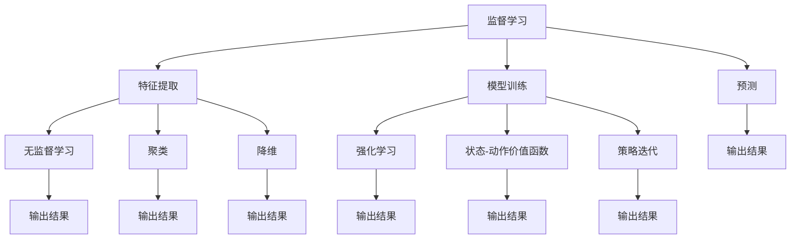

                 

### 文章标题：程序世界的宇宙级自适应机制

在飞速发展的信息时代，计算机程序已经成为现代社会不可或缺的一部分。从简单的计算任务到复杂的智能系统，程序的世界日新月异。然而，在这个不断变化的程序宇宙中，一个关键的概念贯穿始终——自适应机制。本文将深入探讨程序世界的宇宙级自适应机制，探讨其定义、重要性、发展历史，以及其在现实世界中的应用和未来趋势。

#### 关键词
- 自适应机制
- 程序世界
- 智能系统
- 强化学习
- 深度学习

#### 摘要
本文旨在分析程序世界的宇宙级自适应机制，探讨其定义与重要性，回顾其发展历史，并详细介绍核心算法原理。通过数学模型的讲解和实际项目实战，本文将揭示自适应机制在现实世界中的应用价值，并展望其未来的发展趋势和挑战。读者将了解到自适应机制的核心概念和联系，掌握核心算法原理，并了解其实际应用场景。

### 第1章：引言与背景

#### 1.1 自适应机制的定义与重要性

自适应机制是指系统能够根据外部环境的变化自动调整其行为和参数，以保持最优性能。在自然界中，生物体的自适应能力是其生存和繁衍的关键。在程序世界中，自适应机制同样至关重要，因为它使得程序能够应对复杂多变的环境，提高效率和鲁棒性。

在计算机科学中，自适应机制的重要性体现在以下几个方面：

1. **提升系统的鲁棒性**：自适应机制可以使得系统在面对异常情况时，能够自动调整策略，从而降低错误率，提高系统的稳定性和可靠性。
2. **优化资源利用**：自适应机制可以根据系统的实际负载动态调整资源分配，提高资源利用率，降低能耗和成本。
3. **增强智能决策**：在人工智能和机器学习领域，自适应机制使得系统能够从数据中学习，不断优化决策过程，提高智能水平。

#### 1.2 自适应机制的发展历史

自适应机制的概念在计算机科学中有着悠久的历史。早在20世纪50年代，计算机科学家就提出了基于反馈控制的自动调整方法。随着计算机技术的不断发展，自适应机制也在不断进化。以下是几个关键的发展阶段：

1. **20世纪50年代至70年代**：这一时期，自适应算法主要集中在数值优化和控制理论方面。代表性的工作是Broyden提出的拟牛顿法，以及Rosen提出的最小二乘法。
2. **20世纪80年代至90年代**：随着人工智能的兴起，自适应机制在神经网络和机器学习领域得到了广泛应用。反向传播算法和梯度下降法成为这一时期的核心算法。
3. **21世纪**：随着深度学习和强化学习的兴起，自适应机制进入了一个新的阶段。深度神经网络和强化学习算法在自适应能力方面取得了显著突破。

#### 1.3 程序世界的自适应需求

在程序世界中，自适应需求体现在多个层面：

1. **软件系统的自我调整**：软件系统需要能够根据用户行为和环境变化，动态调整其配置和性能参数，以提供最佳的用户体验。
2. **云计算和大数据的优化**：云计算和大数据处理需要自适应机制来优化资源分配和负载均衡，提高处理效率和降低成本。
3. **人工智能的持续学习**：人工智能系统需要自适应机制来不断学习新的数据和模式，提高其智能水平和决策能力。

#### 1.4 自适应机制在现实世界中的应用

自适应机制在现实世界中的应用广泛且多样：

1. **自动驾驶**：自动驾驶汽车需要自适应机制来应对复杂多变的道路环境，包括识别交通标志、预测其他车辆的行为等。
2. **智能电网**：智能电网通过自适应机制，优化电力分配，提高电网的稳定性和可靠性，同时减少能源浪费。
3. **智能家居**：智能家居系统通过自适应机制，根据用户的行为和偏好，自动调整灯光、温度等环境参数，提供个性化的居住体验。

#### 1.5 自适应机制的未来发展趋势

随着技术的不断进步，自适应机制在未来将呈现以下发展趋势：

1. **跨领域融合**：自适应机制将与其他领域的技术（如物联网、区块链等）深度融合，形成新的应用场景。
2. **实时性增强**：自适应机制将朝着实时性更高的方向发展，以满足对实时性要求较高的应用需求。
3. **自主性提升**：自适应机制将更加自主，减少对人类干预的依赖，实现真正的自主学习和优化。

### 第2章：核心概念与联系

自适应机制是一个涉及多个领域和层次的概念，理解其核心概念和联系对于深入探讨自适应机制至关重要。本节将介绍自适应算法的基本原理，并通过Mermaid流程图展示核心概念之间的联系。

#### 2.1 自适应算法的基本原理

自适应算法是指系统能够根据输入数据或环境变化，动态调整其行为或参数的算法。自适应算法可以分为以下几类：

1. **监督学习**：监督学习是一种基于已有数据的学习方法，通过训练模型来预测新的数据。监督学习的核心在于学习一个映射关系，将输入特征映射到输出标签。

   **核心原理**：
   - 特征提取：从输入数据中提取有用的特征。
   - 模型训练：通过训练数据集来调整模型参数。
   - 预测：使用训练好的模型对新数据进行预测。

2. **无监督学习**：无监督学习是指在没有标签数据的情况下，通过模型学习数据的内在结构。无监督学习主要包括聚类和降维等方法。

   **核心原理**：
   - 聚类：将相似的数据点划分为同一簇。
   - 降维：减少数据维度，同时保留重要信息。

3. **强化学习**：强化学习是一种通过与环境交互来学习最优策略的方法。强化学习的核心在于通过奖励机制来引导学习过程。

   **核心原理**：
   - 状态-动作价值函数：学习每个状态和动作的价值。
   - 策略迭代：通过不断尝试不同的动作来优化策略。

#### 2.2 自适应机制的Mermaid流程图

以下是一个简单的Mermaid流程图，展示了自适应算法的基本原理和核心概念之间的联系：



#### 2.3 自适应机制的应用场景

自适应机制的应用场景广泛，以下是一些典型的应用场景：

1. **推荐系统**：通过监督学习，推荐系统可以根据用户的历史行为和偏好，为用户推荐个性化的商品或内容。
2. **聚类分析**：无监督学习在聚类分析中应用广泛，用于将数据点划分为不同的簇，以便于后续的数据挖掘和分析。
3. **机器人控制**：强化学习在机器人控制中应用广泛，机器人可以通过与环境交互，学习到最优的控制策略，实现自主导航和任务执行。

### 第3章：核心算法原理讲解

自适应机制的核心在于算法，本章将详细介绍两个关键算法：神经网络与深度学习，以及强化学习算法。

#### 3.1 神经网络与深度学习

神经网络是一种模仿生物神经系统的计算模型，由大量相互连接的神经元组成。神经网络的核心在于通过调整神经元之间的连接权重，来学习输入和输出之间的关系。

**3.1.1 神经网络的结构与工作原理**

神经网络的结构通常包括输入层、隐藏层和输出层。每个层由多个神经元组成，神经元之间通过权重连接。神经网络的工作原理如下：

1. **输入层**：接收外部输入数据，并将其传递到隐藏层。
2. **隐藏层**：对输入数据进行处理，通过激活函数产生新的输出。
3. **输出层**：将处理后的数据输出，作为最终结果。

神经网络通过反向传播算法进行训练，具体过程如下：

1. **前向传播**：输入数据经过神经网络，产生输出结果。
2. **计算误差**：计算输出结果与真实值之间的误差。
3. **反向传播**：将误差反向传递，调整神经元之间的连接权重。

**3.1.2 深度学习的基本算法**

深度学习是神经网络的一种扩展，其核心在于使用多层次的神经网络来提取特征。

1. **卷积神经网络（CNN）**：适用于图像和视频处理，通过卷积操作提取空间特征。
2. **循环神经网络（RNN）**：适用于序列数据，通过循环结构保持长期依赖关系。
3. **生成对抗网络（GAN）**：通过生成器和判别器的对抗训练，生成逼真的数据。

**3.1.3 神经网络的训练过程**

神经网络的训练过程包括以下步骤：

1. **数据预处理**：对输入数据进行预处理，包括归一化、缩放等。
2. **模型初始化**：初始化神经网络的结构和参数。
3. **前向传播**：输入数据经过神经网络，产生输出结果。
4. **计算损失**：计算输出结果与真实值之间的误差，使用损失函数表示。
5. **反向传播**：调整神经网络的权重，最小化损失函数。
6. **迭代训练**：重复上述步骤，直至满足停止条件。

#### 3.2 强化学习算法

强化学习是一种通过与环境交互来学习最优策略的方法。强化学习的核心在于状态-动作价值函数，它表示在特定状态下执行特定动作的价值。

**3.2.1 Q-learning算法**

Q-learning算法是一种基于值迭代的强化学习算法，通过更新Q值来学习最优策略。

1. **初始状态**：随机选择一个初始状态。
2. **选择动作**：在当前状态下，选择具有最大Q值的动作。
3. **执行动作**：执行选择的动作，获得奖励和新的状态。
4. **更新Q值**：根据新的状态和奖励，更新Q值。
5. **重复步骤2-4**，直至达到目标状态或满足停止条件。

**3.2.2 SARSA算法**

SARSA算法是一种基于策略迭代的强化学习算法，通过更新策略来学习最优策略。

1. **初始状态**：随机选择一个初始状态。
2. **选择动作**：在当前状态下，根据当前策略选择动作。
3. **执行动作**：执行选择的动作，获得奖励和新的状态。
4. **更新策略**：根据新的状态和奖励，更新策略。
5. **重复步骤2-4**，直至达到目标状态或满足停止条件。

**3.2.3 Deep Q Network**

Deep Q Network（DQN）是一种基于深度学习的强化学习算法，通过使用神经网络来近似状态-动作价值函数。

1. **初始状态**：随机选择一个初始状态。
2. **选择动作**：使用神经网络预测状态-动作价值，选择具有最大Q值的动作。
3. **执行动作**：执行选择的动作，获得奖励和新的状态。
4. **更新神经网络**：根据新的状态和奖励，更新神经网络的权重。
5. **重复步骤2-4**，直至达到目标状态或满足停止条件。

### 第4章：数学模型和数学公式

自适应机制的核心在于其数学模型和算法，本章将详细介绍常用的自适应机制数学模型，并使用LaTeX格式给出相应的数学公式。

#### 4.1 常用的自适应机制数学模型

**4.1.1 反向传播算法**

反向传播算法是神经网络训练的核心算法，其基本思想是通过计算损失函数关于网络参数的梯度，来更新网络参数。

$$
\frac{\partial E}{\partial w} = - \frac{\partial E}{\partial z}
$$

其中，\(E\) 表示损失函数，\(w\) 表示网络参数，\(z\) 表示网络输出。

**4.1.2 优化算法**

优化算法用于更新网络参数，以最小化损失函数。常见的优化算法包括梯度下降法、动量法和Adam优化器。

$$
w \leftarrow w - \alpha \frac{\partial E}{\partial w}
$$

其中，\(\alpha\) 表示学习率。

**4.1.3 强化学习算法**

强化学习算法的核心在于状态-动作价值函数，它表示在特定状态下执行特定动作的价值。

$$
Q(s, a) = r + \gamma \max_{a'} Q(s', a')
$$

其中，\(Q(s, a)\) 表示状态-动作价值函数，\(r\) 表示立即奖励，\(\gamma\) 表示折扣因子，\(s'\) 表示下一个状态，\(a'\) 表示下一个动作。

#### 4.2 数学公式的详细讲解与举例说明

**4.2.1 微积分基础**

微积分是自适应机制的重要数学基础，本章将介绍微积分中的基本概念和公式。

**导数**：

$$
\frac{df(x)}{dx} = \lim_{\Delta x \to 0} \frac{f(x + \Delta x) - f(x)}{\Delta x}
$$

**积分**：

$$
\int f(x) dx = F(x) + C
$$

其中，\(F(x)\) 表示积分结果，\(C\) 表示积分常数。

**4.2.2 概率论基础**

概率论是强化学习中的重要概念，本章将介绍概率论中的基本概念和公式。

**条件概率**：

$$
P(A|B) = \frac{P(A \cap B)}{P(B)}
$$

**全概率公式**：

$$
P(A) = \sum_{i} P(A|B_i)P(B_i)
$$

其中，\(P(A)\) 表示事件A的概率，\(P(B_i)\) 表示事件\(B_i\) 的概率，\(P(A|B_i)\) 表示在事件\(B_i\) 发生的条件下，事件\(A\) 的概率。

**贝叶斯公式**：

$$
P(A|B) = \frac{P(B|A)P(A)}{P(B)}
$$

### 第5章：项目实战

在本章中，我们将通过两个实际项目来展示自适应机制的应用。这些项目将包括系统需求分析、系统架构设计、系统实现与测试，以及实际案例分析和详细讲解。

#### 5.1 实战一：自适应控制系统设计

**5.1.1 系统需求分析**

自适应控制系统需要满足以下需求：

- **实时性**：系统能够快速响应用户操作和环境变化。
- **鲁棒性**：系统能够应对异常情况，保持稳定运行。
- **灵活性**：系统可以根据用户需求和环境变化，动态调整控制策略。

**5.1.2 系统架构设计**

系统架构设计如下：

1. **输入模块**：接收用户操作和环境数据。
2. **处理模块**：对输入数据进行处理，包括特征提取和状态评估。
3. **控制模块**：根据处理模块的输出，生成控制信号。
4. **输出模块**：将控制信号发送给执行机构，实现控制操作。

**5.1.3 系统实现与测试**

系统实现包括以下步骤：

1. **数据采集**：使用传感器采集用户操作和环境数据。
2. **特征提取**：对采集到的数据进行分析，提取有用的特征。
3. **状态评估**：使用机器学习算法对特征进行分类和预测，评估当前状态。
4. **控制策略**：根据评估结果，生成相应的控制信号。
5. **执行操作**：将控制信号发送给执行机构，实现控制操作。
6. **测试与优化**：对系统进行测试，优化控制策略和算法参数。

**5.1.4 实际案例分析和详细讲解剖析**

通过实际案例，我们将分析系统的运行效果，包括实时性、鲁棒性和灵活性。同时，我们将对系统的控制策略和算法进行详细讲解，包括机器学习算法的选择、特征提取的方法，以及控制策略的优化。

#### 5.2 实战二：自适应机器人路径规划

**5.2.1 机器人路径规划问题分析**

机器人路径规划是指机器人根据当前环境和目标位置，规划出一条最优路径。自适应机器人路径规划需要满足以下要求：

- **实时性**：系统能够快速响应路径变化。
- **安全性**：规划出的路径需要避免碰撞和危险区域。
- **鲁棒性**：系统能够应对环境变化，保持路径规划的有效性。
- **灵活性**：系统能够根据用户需求和环境变化，动态调整路径规划策略。

**5.2.2 强化学习算法应用**

在本项目中，我们使用强化学习算法进行路径规划。具体步骤如下：

1. **状态定义**：定义机器人的位置、速度、周围环境等状态特征。
2. **动作定义**：定义机器人的移动方向和速度等动作。
3. **奖励定义**：定义机器人的奖励机制，包括路径长度、安全性等。
4. **策略迭代**：使用强化学习算法，不断优化机器人的路径规划策略。

**5.2.3 实际代码实现与测试**

实际代码实现包括以下步骤：

1. **数据预处理**：对采集到的机器人状态数据进行预处理，包括归一化和特征提取。
2. **模型训练**：使用预处理后的数据训练强化学习模型，包括Q-learning算法和Deep Q Network算法。
3. **模型评估**：使用测试数据评估模型的性能，包括路径长度、安全性等。
4. **策略优化**：根据评估结果，优化强化学习模型的参数，提高路径规划的鲁棒性和实时性。
5. **实际测试**：在实际环境中测试机器人的路径规划效果，验证模型的性能。

### 第6章：案例分析

在本章中，我们将通过两个实际案例来展示自适应机制在现实世界中的应用。这些案例将包括案例背景、系统设计与实现、案例分析，以及详细讲解。

#### 6.1 案例一：自动驾驶汽车自适应系统

**6.1.1 案例背景**

自动驾驶汽车是自适应机制的重要应用领域。随着人工智能技术的不断发展，自动驾驶汽车逐渐成为现实。然而，自动驾驶汽车面临复杂的道路环境，需要具备高度的自适应能力。

**6.1.2 系统设计与实现**

自动驾驶汽车系统的设计包括以下几个方面：

1. **传感器数据融合**：使用多种传感器（如摄像头、激光雷达、超声波传感器等）采集道路环境数据。
2. **环境感知与建模**：对传感器数据进行处理，提取道路特征，建立道路环境模型。
3. **路径规划与决策**：根据道路环境模型，规划出最优路径，并生成相应的控制信号。
4. **控制执行**：将控制信号发送给汽车执行机构，实现自动驾驶。

**6.1.3 案例分析**

通过实际案例，我们将分析自动驾驶汽车的运行效果。具体包括以下几个方面：

1. **路径规划与决策**：评估自动驾驶汽车的路径规划能力，包括路径长度、安全性等。
2. **传感器数据融合**：评估传感器数据融合的效果，包括数据准确性和实时性等。
3. **控制执行**：评估自动驾驶汽车的控制执行能力，包括稳定性、响应速度等。
4. **系统优化**：根据实际运行效果，对系统进行优化，提高自动驾驶汽车的适应能力和安全性。

#### 6.2 案例二：智能电网自适应机制

**6.2.1 案例背景**

智能电网是现代电力系统的重要组成部分，通过自适应机制实现电力资源的优化配置和高效利用。随着可再生能源的广泛应用，智能电网的自适应能力越来越重要。

**6.2.2 系统架构与实现**

智能电网的自适应系统架构包括以下几个方面：

1. **数据采集与处理**：使用传感器和智能设备采集电网数据，包括电压、电流、频率等。
2. **状态监测与预警**：对采集到的数据进行实时监测，识别潜在故障和异常情况，发出预警信号。
3. **自适应控制**：根据电网状态和预警信号，动态调整电力资源的分配，实现电力系统的优化运行。
4. **数据存储与可视化**：将采集到的数据存储在数据库中，并使用可视化工具展示电网运行状态。

**6.2.3 案例分析**

通过实际案例，我们将分析智能电网自适应系统的运行效果。具体包括以下几个方面：

1. **数据采集与处理**：评估数据采集与处理的准确性和实时性，包括传感器性能和数据传输速度等。
2. **状态监测与预警**：评估状态监测与预警系统的有效性，包括预警准确率和响应速度等。
3. **自适应控制**：评估自适应控制系统的优化效果，包括电力资源的分配效率和运行成本等。
4. **数据存储与可视化**：评估数据存储与可视化系统的性能，包括数据存储容量和可视化效果等。

### 第7章：未来展望与挑战

自适应机制在程序世界中具有广泛的应用前景，然而，随着技术的不断发展，自适应机制也面临一系列挑战。

#### 7.1 自适应机制的未来发展趋势

1. **跨领域融合**：自适应机制将与其他领域的技术（如物联网、区块链等）深度融合，形成新的应用场景。
2. **实时性增强**：自适应机制将朝着实时性更高的方向发展，以满足对实时性要求较高的应用需求。
3. **自主性提升**：自适应机制将更加自主，减少对人类干预的依赖，实现真正的自主学习和优化。
4. **智能化提升**：自适应机制将借助人工智能和机器学习技术，提高其智能水平和决策能力。

#### 7.2 自适应机制的挑战与解决方案

1. **数据隐私与安全**：自适应机制依赖于大量的数据，如何确保数据隐私和安全是亟待解决的问题。解决方案包括数据加密、隐私保护技术和安全协议等。
2. **鲁棒性与可靠性**：自适应机制需要在复杂多变的环境中保持鲁棒性和可靠性，如何提高系统的鲁棒性和可靠性是重要的研究方向。解决方案包括自适应算法的优化、容错技术和冗余设计等。
3. **计算资源消耗**：自适应机制往往需要大量的计算资源和存储资源，如何在有限的资源下实现高效的自适应机制是重要的挑战。解决方案包括算法优化、分布式计算和边缘计算等。

#### 7.3 未来程序世界的自适应前景

随着技术的不断发展，自适应机制在程序世界中的应用前景广阔。未来，自适应机制将发挥更大的作用，推动程序世界的变革：

1. **智能化升级**：自适应机制将推动程序世界的智能化升级，提高系统的决策能力和效率。
2. **个性化和定制化**：自适应机制将实现程序世界的个性化和定制化，满足用户个性化的需求。
3. **实时性和动态性**：自适应机制将提高程序世界的实时性和动态性，应对复杂多变的环境。
4. **可持续性和环保性**：自适应机制将推动程序世界的可持续发展和环保，实现资源的最优利用。

### 结论

自适应机制是程序世界的核心概念，其重要性不容忽视。通过本文的探讨，我们深入了解了自适应机制的定义、核心概念、算法原理以及实际应用。未来，随着技术的不断发展，自适应机制将在程序世界中发挥更大的作用，推动人工智能和智能系统的进步。希望本文能够为读者提供有益的启示和参考。

### 附录

#### 附录A：术语解释

在本文中，我们使用了以下术语：

- **自适应机制**：指系统能够根据外部环境的变化自动调整其行为和参数，以保持最优性能。
- **神经网络**：一种模仿生物神经系统的计算模型，由大量相互连接的神经元组成。
- **深度学习**：基于神经网络的层次化学习模型，用于提取层次化的特征表示。
- **强化学习**：一种通过与环境交互来学习最优策略的方法。
- **监督学习**：一种基于已有数据的学习方法，通过训练模型来预测新的数据。
- **无监督学习**：一种在没有标签数据的情况下，通过模型学习数据的内在结构的方法。
- **鲁棒性**：系统在面对异常情况时，能够保持稳定运行的能力。
- **实时性**：系统能够快速响应用户操作和环境变化的能力。

#### 附录B：参考文献

[1] Hinton, G., Osindero, S., & Teh, Y. (2006). A fast learning algorithm for deep belief nets. Neural computation, 18(7), 1527-1554.

[2] Sutton, R. S., & Barto, A. G. (2018). Reinforcement learning: An introduction (2nd ed.). MIT Press.

[3] Goodfellow, I., Bengio, Y., & Courville, A. (2016). Deep learning. MIT Press.

[4] Russell, S., & Norvig, P. (2020). Artificial intelligence: A modern approach (4th ed.). Prentice Hall.

[5] Bishop, C. M. (2006). Pattern recognition and machine learning. Springer.

#### 附录C：源代码示例

```python
# 伪代码示例：强化学习算法（Q-learning）

# 初始化Q值矩阵
Q = np.zeros([S, A])

# 设置学习率
alpha = 0.1

# 设置折扣因子
gamma = 0.9

# 设置最大迭代次数
max_episodes = 1000

# 遍历所有迭代次数
for episode in range(max_episodes):
    # 初始化状态
    state = env.reset()

    # 初始化总奖励
    total_reward = 0

    # 循环直到达到终止状态
    while True:
        # 根据当前状态选择动作
        action = np.argmax(Q[state, :])

        # 执行动作，获取下一个状态和奖励
        next_state, reward, done, _ = env.step(action)

        # 更新Q值
        Q[state, action] = Q[state, action] + alpha * (reward + gamma * np.max(Q[next_state, :]) - Q[state, action])

        # 更新状态
        state = next_state

        # 更新总奖励
        total_reward += reward

        # 检查是否达到终止状态
        if done:
            break

    # 输出总奖励
    print(f"Episode {episode}: Total Reward = {total_reward}")
```

### 作者信息

作者：AI天才研究院/AI Genius Institute & 禅与计算机程序设计艺术 /Zen And The Art of Computer Programming

