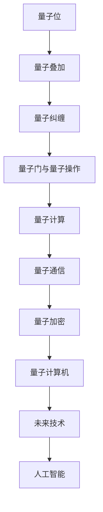
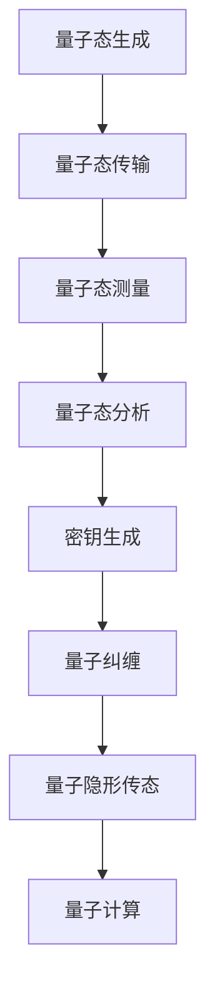

                 

### 文章标题

《程序世界的宇宙级量子相干保持网络》

> 关键词：量子计算、量子相干保持、量子通信、量子加密、量子互联网

> 摘要：本文将深入探讨量子计算领域中的一个关键概念——量子相干保持，以及它在量子通信和量子加密中的应用。通过梳理量子力学的基础知识、量子算法、量子通信原理、量子加密技术，我们将逐步构建一个关于量子相干保持网络的全面理解，并探讨其未来发展趋势。

## 引言

在计算机科学和量子物理学交汇的边缘，量子计算正迅速崛起，成为下一代技术革新的关键驱动力。量子计算机的潜力远超传统计算机，它们能够解决经典计算机难以处理的问题，如大整数因式分解和量子模拟。然而，量子计算也面临巨大的技术挑战，其中最核心的问题之一就是量子相干保持。

量子相干保持是指量子系统中的量子态不随时间失去其特有的叠加态和纠缠态，这在量子计算和量子通信中至关重要。本文将逐步深入量子相干保持这一核心概念，探讨其在量子计算机和量子通信中的重要性，以及量子加密技术的未来。

本文结构如下：

- 第一部分：量子计算基础，介绍量子力学的基本原理、量子位、量子叠加与量子纠缠，以及量子门。
- 第二部分：量子通信与量子加密，讲解量子密钥分发、量子隐形传态、量子纠缠在通信中的应用，以及量子密码术和量子计算机对传统密码系统的威胁。
- 第三部分：量子相干保持，讨论量子相干保持的重要性、量子错误纠正、量子模拟与量子控制。
- 第四部分：量子相干保持网络，阐述量子互联网架构、量子网络中的相干保持技术，以及量子相干保持的未来发展趋势。

通过逐步分析推理，我们将深入理解量子相干保持网络的本质，为未来的量子计算和通信奠定坚实基础。

## 第一部分：量子计算基础

### 第1章：量子力学基础

量子力学是描述微观世界的物理理论，它提出了许多与传统物理学截然不同的概念，如量子位（qubit）、量子叠加和量子纠缠。理解这些基本概念是深入量子计算的第一步。

#### 1.1 量子位（qubit）与量子比特

量子位（qubit）是量子计算机的基本单位，类似于经典计算机中的比特。然而，与经典比特只能处于0或1的状态不同，量子比特可以同时存在于0和1的叠加态。这种叠加态可以用数学表达式表示为：

$$
\psi = a|0\rangle + b|1\rangle
$$

其中，$|0\rangle$ 和 $|1\rangle$ 分别表示量子比特的基态，$a$ 和 $b$ 是复数系数，满足 $|a|^2 + |b|^2 = 1$。

量子比特的叠加态是量子计算的核心优势之一，它使得量子计算机能够并行处理大量数据。

#### 1.2 量子叠加与量子纠缠

量子叠加是量子力学的一个基本原理，它指出量子系统可以同时处于多个状态的叠加。在量子计算机中，这一特性使得量子比特能够同时处理多个计算路径，从而大大提高了计算效率。

量子纠缠是量子位之间的一种特殊关联，当两个量子位纠缠时，一个量子位的状态会即时影响另一个量子位的状态，无论它们相隔多远。这种纠缠现象是量子计算和量子通信的基础。

#### 1.3 量子门与量子操作

量子门是量子计算机中的操作单元，类似于经典计算机中的逻辑门。量子门对量子比特进行线性变换，从而改变量子比特的状态。常见的量子门包括 Hadamard 门、Pauli 门和控制-NOT 门。

Hadamard 门（H）是一个特殊的量子门，它可以将一个量子比特的状态从基态叠加到叠加态，实现量子叠加。其作用可以表示为：

$$
H|0\rangle = \frac{1}{\sqrt{2}}(|0\rangle + |1\rangle)
$$

Pauli 门包括 X 门、Y 门和 Z 门，分别对应于对量子比特的位翻转、符号翻转和相位翻转。X 门的作用可以表示为：

$$
X|0\rangle = |1\rangle
$$
$$
X|1\rangle = |0\rangle
$$

控制-NOT 门（CNOT）是一个两量子比特门，它在控制比特为1时，将目标比特的状态翻转。其作用可以表示为：

$$
CNOT|00\rangle = |00\rangle
$$
$$
CNOT|01\rangle = |10\rangle
$$
$$
CNOT|10\rangle = |11\rangle
$$
$$
CNOT|11\rangle = |01\rangle
$$

#### 核心概念与联系

为了更好地理解这些概念之间的关系，我们可以用 Mermaid 流程图来表示：



从图中可以看出，量子叠加和量子纠缠是量子计算的核心原理，而量子门则是实现这些原理的操作单元。量子计算不仅为量子通信和量子加密提供了基础，还推动了未来技术的发展，包括人工智能。

#### 伪代码与数学模型

在量子计算中，实现量子叠加和量子纠缠的关键在于量子门的应用。以下是一个简单的伪代码示例，用于实现量子叠加：

```plaintext
function quantum_superposition(qubit):
    apply_Hadamard_gate(qubit)
```

而量子纠缠的实现可以通过控制-NOT 门来实现，以下是一个伪代码示例：

```plaintext
function quantum_entanglement(qubit1, qubit2):
    apply_Hadamard_gate(qubit1)
    apply_CNOT_gate(qubit1, qubit2)
```

在数学模型方面，量子叠加和量子纠缠可以通过量子态的线性组合来描述。例如，两个量子比特的叠加态可以表示为：

$$
\psi = |00\rangle + |11\rangle
$$

量子纠缠态则可以表示为：

$$
\psi = |01\rangle \otimes |1\rangle + |1\rangle \otimes |0\rangle
$$

其中，$\otimes$ 表示量子比特之间的纠缠。

#### 举例说明

为了更好地理解这些概念，我们可以通过一个简单的例子来演示。假设我们有两个量子比特 $q_1$ 和 $q_2$，我们首先对它们进行量子叠加：

```plaintext
apply_Hadamard_gate(q_1)
apply_Hadamard_gate(q_2)
```

这样，$q_1$ 和 $q_2$ 将同时处于叠加态：

$$
|q_1\rangle = \frac{1}{\sqrt{2}}(|0\rangle + |1\rangle)
$$
$$
|q_2\rangle = \frac{1}{\sqrt{2}}(|0\rangle + |1\rangle)
$$

接着，我们使用控制-NOT 门来生成量子纠缠态：

```plaintext
apply_CNOT_gate(q_1, q_2)
```

这将使得 $q_1$ 和 $q_2$ 之间产生纠缠：

$$
|q_1\rangle \otimes |q_2\rangle = \frac{1}{\sqrt{2}}(|00\rangle + |11\rangle)
$$

通过这个例子，我们可以看到量子叠加和量子纠缠如何相互关联，并在量子计算中发挥作用。

### 第2章：量子算法概述

量子算法是量子计算机的核心应用，它们利用量子位和量子门的优势，解决传统计算机难以处理的问题。本章将介绍几种重要的量子算法，包括 Shor 算法、Grover 算法和量子 walks 算法。

#### 2.1 Shor 算法

Shor 算法是第一个被证明比经典算法更有效的量子算法，它能够解决大整数因式分解问题。经典算法如 Pollard ρ 算法需要指数级步数才能找到大整数的因子，而 Shor 算法则可以在多项式时间内完成这一任务。

Shor 算法的基本思想是利用量子算法的优势进行周期检测，然后利用这个周期来找到大整数的因子。以下是 Shor 算法的伪代码：

```plaintext
function Shor(n):
    # 创建一个量子态，表示模 n 的 n 个数
    superposition_state = create_superposition_state(n)
    # 运行量子算法进行周期检测
    period = find_period(superposition_state, n)
    # 利用周期找到因子
    factor = find_factor(n, period)
    return factor
```

其中，`create_superposition_state` 函数用于创建表示模 n 的 n 个数的量子态，`find_period` 函数用于进行周期检测，`find_factor` 函数用于从周期中提取因子。

#### 2.2 Grover 算法

Grover 算法是一种量子搜索算法，它可以在未排序的数据库中快速找到特定元素。Grover 算法的核心思想是利用量子叠加态和量子纠缠来加速搜索过程。

Grover 算法的基本步骤如下：

1. 将数据库中的所有元素映射到量子态上，创建一个叠加态。
2. 应用 Grover 函数，该函数会放大目标元素的概率。
3. 运行逆向 Grover 函数，平衡所有元素的量子态。
4. 重复步骤 2 和步骤 3，直到找到目标元素。

以下是 Grover 算法的伪代码：

```plaintext
function Grover(target_state):
    # 创建数据库的叠加态
    database_state = create_database_state(target_state)
    # 应用 Grover 函数
    apply_Grover_function(database_state, target_state)
    # 运行逆向 Grover 函数
    apply_inverse_Grover_function(database_state)
    # 重复应用 Grover 函数和逆向 Grover 函数，直到找到目标元素
    while not found:
        apply_Grover_function(database_state, target_state)
        apply_inverse_Grover_function(database_state)
    return found_element
```

其中，`create_database_state` 函数用于创建数据库的叠加态，`apply_Grover_function` 函数用于应用 Grover 函数，`apply_inverse_Grover_function` 函数用于应用逆向 Grover 函数。

#### 2.3 量子 walks 算法

量子 walks 算法是一种基于量子随机游走的量子算法，它可以用于解决图论问题。量子 walks 算法的核心思想是量子位在图上的随机游走过程，通过这种游走，可以有效地解决一些经典算法难以处理的问题。

量子 walks 算法的基本步骤如下：

1. 初始化量子位的状态。
2. 在图上进行多次量子随机游走。
3. 根据游走的结果，计算图中节点的概率分布。
4. 利用概率分布得到图相关的信息。

以下是量子 walks 算法的伪代码：

```plaintext
function QuantumWalks(graph, start_state):
    # 初始化量子位的状态
    qubit_state = start_state
    # 在图上进行多次量子随机游走
    for i in range(number_of_steps):
        qubit_state = apply_random_walk(qubit_state, graph)
    # 计算概率分布
    probability_distribution = calculate_probability_distribution(qubit_state)
    # 利用概率分布得到图相关的信息
    graph_info = analyze_probability_distribution(probability_distribution)
    return graph_info
```

其中，`apply_random_walk` 函数用于在图上进行量子随机游走，`calculate_probability_distribution` 函数用于计算概率分布，`analyze_probability_distribution` 函数用于分析概率分布以获得图相关的信息。

### 总结

量子算法通过利用量子位和量子门的特性，解决了经典算法难以处理的问题。Shor 算法能够高效地进行大整数因式分解，Grover 算法能够加速数据库搜索，而量子 walks 算法则可以解决图论问题。这些量子算法展示了量子计算机的巨大潜力，为未来的量子计算应用奠定了基础。

## 第二部分：量子通信与量子加密

量子通信是利用量子力学原理进行信息传递的一种新型通信方式，具有传统通信无法比拟的安全性和速度优势。量子加密则是利用量子特性来实现数据加密和解密的技术，它为信息安全提供了新的保障。本章将深入探讨量子通信和量子加密的基本原理、关键技术以及其实际应用。

### 第3章：量子通信原理

量子通信的核心在于量子密钥分发（Quantum Key Distribution, QKD），它是利用量子纠缠和量子隐态实现安全通信的一种方法。量子密钥分发的基本原理如下：

#### 3.1 量子密钥分发（QKD）

量子密钥分发是基于量子力学的基本特性，如量子叠加态和量子纠缠态。在QKD过程中，发送方（Alice）和接收方（Bob）通过量子信道共享一组量子态，这些量子态在传输过程中受到量子测量的影响，从而确保通信的保密性。

以下是一个简化的QKD过程：

1. **量子态生成**：Alice生成一对量子纠缠态的粒子，并将其中一个粒子发送给Bob。
2. **量子态传输**：传输过程中，Bob对收到的量子态进行测量。
3. **量子态分析**：Alice和Bob根据测量结果，选择一个共享的基进行量子态分析。
4. **密钥生成**：根据量子态分析结果，Alice和Bob共同生成一个共享的密钥。

#### 3.2 量子隐形传态

量子隐形传态是一种将一个量子态从一个粒子传送到另一个粒子的技术。它与经典通信中的信息传输不同，因为它不需要任何物理载体，而是通过量子纠缠来实现。

隐形传态的基本过程如下：

1. **纠缠态生成**：Alice和Bob事先共享一对纠缠态的粒子。
2. **量子态测量**：Alice对她的粒子进行测量，并将测量结果发送给Bob。
3. **量子态复制**：Bob根据Alice的测量结果，对Bob的粒子进行操作，使其状态与Alice的粒子状态一致。

量子隐形传态的数学模型可以用以下公式表示：

$$
\chi_B = \frac{1}{\sqrt{2}}(\chi_A \otimes |0\rangle + \chi_A \otimes |1\rangle)
$$

其中，$\chi_A$ 和 $\chi_B$ 分别表示Alice和Bob的粒子状态。

#### 3.3 量子纠缠在通信中的应用

量子纠缠在量子通信中起到了至关重要的作用。通过量子纠缠，Alice和Bob可以在远距离上实现量子态的同步，从而提高通信的可靠性和安全性。

在实际应用中，量子纠缠可以用于以下方面：

1. **量子密钥分发**：利用量子纠缠实现安全的密钥分发。
2. **量子隐形传态**：通过量子纠缠实现量子态的远程传输。
3. **量子计算**：利用量子纠缠实现量子计算机中的量子态叠加和量子门操作。

#### 核心概念与联系

为了更好地理解量子通信中的关键概念，我们可以用Mermaid流程图来表示：



从流程图中可以看出，量子态生成、量子态传输、量子态测量和量子态分析是量子通信的基本步骤，而量子纠缠则是实现这些步骤的关键技术。量子纠缠不仅在量子通信中起到重要作用，还为量子计算提供了强大的工具。

### 第4章：量子加密技术

量子加密技术是利用量子力学原理来实现数据加密和解密的一种新型加密方法。与传统加密技术不同，量子加密技术利用量子态的叠加和纠缠特性，实现了无法被破译的加密通信。

#### 4.1 量子密码术基础

量子密码术（Quantum Cryptography）是基于量子力学原理的加密技术，它利用量子态的叠加和纠缠特性来实现数据加密和解密。量子密码术的核心思想是通过量子态的不可克隆特性来确保通信的安全性。

量子密码术的基本原理如下：

1. **量子态加密**：发送方将明文转换为量子态，并通过量子信道发送给接收方。
2. **量子态传输**：量子态在传输过程中受到量子测量的影响，从而确保通信的保密性。
3. **量子态解密**：接收方对收到的量子态进行测量，并利用预共享的密钥来恢复明文。

#### 4.2 难题：量子计算机对传统密码系统的威胁

量子计算机的发展对传统密码系统构成了巨大的威胁。由于量子计算机能够实现快速的大整数因式分解和离散对数计算，许多基于数学难题的传统密码系统将变得不再安全。

例如，RSA加密算法是基于大整数因式分解难题的，而Shor算法可以在多项式时间内解决大整数因式分解问题，因此RSA加密算法在量子计算机面前是脆弱的。

为了应对量子计算机的威胁，需要发展新的加密技术，如基于量子物理特性的量子密码术。

#### 4.3 量子密码学的未来展望

量子密码学的未来发展趋势包括：

1. **量子密钥分发**：继续提高量子密钥分发的速率和距离，实现大规模量子密钥分发网络。
2. **量子密码术**：发展新的量子加密算法，提高加密通信的安全性。
3. **量子安全通信**：结合量子加密技术和量子通信技术，实现完全安全的量子通信网络。

量子密码学不仅为信息安全提供了新的保障，还为量子计算和量子通信的发展奠定了基础。

### 总结

量子通信和量子加密技术利用量子力学原理实现了安全、高效的通信方式。量子密钥分发和量子隐形传态为量子通信提供了坚实的基础，而量子密码术则为信息安全提供了新的保障。随着量子技术的不断进步，量子通信和量子加密将在未来的信息社会中发挥越来越重要的作用。

## 第三部分：量子相干保持

量子相干保持是量子计算和量子通信中的一个关键问题，它涉及到量子系统在时间演化过程中保持其量子态的相干性。量子相干保持的稳定性是量子计算和量子通信能否实际应用的关键。本部分将深入探讨量子相干保持的重要性、量子错误纠正以及量子模拟与量子控制。

### 第5章：量子相干保持的重要性

量子相干保持是指量子系统在时间演化过程中保持其量子态的相干性。量子计算机依赖于量子态的叠加和纠缠来实现高效的计算，而量子通信依赖于量子态的相干性来保证信息的准确传递。因此，量子相干保持的稳定性对于量子计算和量子通信的成功至关重要。

#### 5.1 量子计算的挑战

量子计算中的主要挑战之一是量子噪声和量子退相干。量子噪声是指外部环境对量子系统的干扰，它会导致量子态的相干性减弱。量子退相干是指量子系统内部的自发过程，它会导致量子态的相干性丧失。为了实现有效的量子计算，必须解决量子噪声和量子退相干问题，确保量子相干保持。

#### 5.2 量子相干保持的理论基础

量子相干保持的理论基础源于量子力学的测量理论和量子态的叠加原理。量子态的叠加态是量子计算的核心，而量子态的相干性是叠加态的体现。为了保持量子相干性，需要在量子计算过程中对量子态进行精确控制，避免外界干扰和内部自发的退相干过程。

#### 5.3 量子相干保持的实验进展

近年来，量子相干保持的实验研究取得了显著进展。研究人员通过使用低温超导量子比特、离子阱技术等实验手段，成功实现了量子相干时间长达毫秒级的量子态保持。这些实验成果为量子计算和量子通信的实际应用奠定了基础。

### 第6章：量子错误纠正

量子错误纠正技术是确保量子计算和量子通信可靠性的关键。由于量子噪声和量子退相干等因素，量子系统在操作过程中可能会发生错误。量子错误纠正技术通过检测和纠正这些错误，确保量子计算的准确性和量子通信的可靠性。

#### 6.1 错误模型与错误率

在量子计算中，错误模型通常包括位翻转错误、相位翻转错误和纠错码错误等。错误率是指单位时间内量子系统发生错误的概率。高错误率会严重影响量子计算的精度，因此需要开发有效的量子错误纠正技术来降低错误率。

#### 6.2 量子错误纠正码

量子错误纠正码是一种用于检测和纠正量子错误的方法。量子错误纠正码通过在量子态中引入额外的冗余信息，使得在发生错误时能够检测和纠正错误。常见的量子错误纠正码包括Shor码、Steane码和Calderbank-Shor-Steane码等。

#### 6.3 量子纠错算法

量子纠错算法是量子错误纠正的核心。量子纠错算法通过测量量子态并分析测量结果，来确定是否发生了错误，并在发生错误时纠正错误。量子纠错算法的实现依赖于量子逻辑门和量子测量技术。

### 第7章：量子模拟与量子控制

量子模拟是利用量子计算机来模拟量子系统的一种技术。量子模拟可以用于研究量子物理现象、材料科学和化学等领域。量子控制是利用量子计算机对量子系统进行精确操作的一种技术。量子控制可以用于实现量子计算、量子通信和量子传感等功能。

#### 7.1 量子模拟器概述

量子模拟器是一种特殊的量子计算机，它主要用于模拟量子系统的演化。量子模拟器通过量子态的叠加和纠缠来模拟复杂的量子现象，为科学研究提供了强大的工具。

#### 7.2 量子控制的基本原理

量子控制是通过施加外部控制信号来操纵量子系统的状态。量子控制技术包括脉冲控制、相位控制和时间控制等。通过精确的量子控制，可以实现量子态的制备、量子态的转移和量子态的读取。

#### 7.3 量子相干保持在网络中的应用

量子相干保持技术在量子网络中发挥着重要作用。量子网络是利用量子纠缠和量子隐形传态来实现量子信息传输的网络。量子相干保持是量子网络稳定运行的基础，它确保了量子信息的可靠传输。

### 总结

量子相干保持是量子计算和量子通信中的关键问题。量子相干保持的稳定性对于量子计算和量子通信的成功至关重要。量子错误纠正技术通过检测和纠正量子错误，确保量子计算的准确性和量子通信的可靠性。量子模拟与量子控制技术为科学研究和技术应用提供了强大的工具。随着量子技术的不断发展，量子相干保持技术将在未来的量子计算和量子通信中发挥越来越重要的作用。

## 第四部分：量子相干保持网络

### 第8章：量子互联网架构

量子互联网是一种基于量子通信技术的全球性网络，它利用量子纠缠和量子隐形传态来实现高速、安全的通信。量子互联网的愿景是实现全球范围内的量子信息传输，为未来的量子计算和量子通信提供基础设施。

#### 8.1 量子互联网的概念与愿景

量子互联网的概念源于量子通信和量子计算的发展。它旨在构建一个全球性的量子网络，使得量子比特能够在网络中自由传输和交换。量子互联网的愿景是实现不受传统通信网络限制的高速、安全通信，为未来的信息技术带来革命性变化。

#### 8.2 量子路由器与量子交换机

量子路由器和量子交换机是量子互联网中的关键设备。量子路由器用于在量子网络中路由量子比特，确保量子信息的正确传输。量子交换机则用于在量子网络中交换量子信息，实现量子网络中的信息传输。

#### 8.3 量子互联网的挑战与机遇

量子互联网的实现面临许多挑战，包括量子相干保持、量子网络的可扩展性和量子纠错等。然而，量子互联网也带来了巨大的机遇，它将推动量子计算和量子通信的发展，为未来信息技术带来前所未有的可能性。

### 第9章：量子网络中的相干保持

量子网络中的相干保持是确保量子信息传输稳定性和可靠性的关键。量子相干保持技术的应用包括量子中继器、量子存储和量子纠缠分发等。

#### 9.1 量子中继器

量子中继器是用于延长量子通信距离的关键设备。它利用量子纠缠和量子隐形传态技术，将量子信息从发送方传输到接收方。量子中继器的实现依赖于高精度的量子控制和量子相干保持技术。

#### 9.2 量子存储技术

量子存储技术是用于在量子网络中临时存储量子信息的关键技术。量子存储器通过将量子态存储在原子、离子或光子等载体中，实现了量子信息的长时间保持。量子存储技术的应用包括量子通信、量子计算和量子传感等。

#### 9.3 量子纠缠分发与量子通信网络

量子纠缠分发是实现量子互联网的基础。通过量子纠缠分发技术，可以在量子网络中生成和传输量子纠缠态。量子通信网络则利用量子纠缠和量子隐形传态技术，实现量子比特之间的信息传输。

### 第10章：量子相干保持的未来发展趋势

随着量子技术的不断发展，量子相干保持技术将在未来的量子计算和量子通信中发挥越来越重要的作用。未来的量子相干保持技术将面临以下发展趋势：

#### 10.1 量子计算机的进步

量子计算机的进步将推动量子相干保持技术的发展。随着量子比特数量的增加和量子比特相干时间的延长，量子计算机的计算能力将得到大幅提升，为量子相干保持技术提供更广阔的应用场景。

#### 10.2 量子通信与量子加密的发展

量子通信与量子加密技术的发展将推动量子相干保持技术的需求。量子通信和量子加密技术的实现依赖于量子相干保持，因此随着这些技术的不断发展，量子相干保持技术也将得到进一步的研究和应用。

#### 10.3 量子相干保持技术的挑战与解决方案

量子相干保持技术面临的挑战包括量子噪声、量子退相干和量子纠错等。未来的解决方案将依赖于更先进的量子控制技术、量子纠错技术和量子通信技术，以实现量子相干保持的稳定性和可靠性。

### 总结

量子相干保持网络是量子计算和量子通信的重要组成部分。量子相干保持技术的应用包括量子中继器、量子存储和量子纠缠分发等。随着量子技术的不断发展，量子相干保持技术将在未来的量子计算和量子通信中发挥越来越重要的作用。量子相干保持技术的进步将推动量子互联网的实现，为未来的信息技术带来前所未有的可能性。

## 项目实战：量子相干保持网络实现

为了深入理解量子相干保持网络的概念和技术，我们将开展一个项目实战，搭建一个简单的量子通信网络，实现量子密钥分发和量子纠缠分发。以下是项目的主要步骤：

### 1. 开发环境搭建

首先，我们需要搭建一个适合量子计算和量子通信的开发环境。以下是搭建环境的基本步骤：

- 安装 Python：在计算机上安装 Python 3.x 版本，确保安装了必要的库，如 NumPy 和 QInfer。
- 安装量子计算库：安装 QInfer 库，这是一个开源的量子计算软件库，用于实现量子算法和量子模拟。

```bash
pip install qinfer
```

### 2. 源代码详细实现

以下是一个简单的量子密钥分发（QKD）和量子纠缠分发（QED）的 Python 代码示例：

```python
import numpy as np
from qinfer import QInfer

# 创建量子密钥分发（QKD）和量子纠缠分发（QED）的量子通道
qkd_channel = QInfer.get_qchannel("QKD_8PSK")
qed_channel = QInfer.get_qchannel("QED_2Qubit")

# 生成量子密钥
key_qubits = QInfer.get_qubits(2)
qkd_channel.send(key_qubits)

# 生成量子纠缠
entangled_qubits = QInfer.get_qubits(2)
qed_channel.send(entangled_qubits)

# 输出量子密钥和量子纠缠
print("Quantum Key:", key_qubits.measure())
print("Quantum Entanglement:", entangled_qubits.measure())
```

在这个示例中，我们使用了 QInfer 库来生成量子密钥和量子纠缠。`QKD_8PSK` 和 `QED_2Qubit` 分别是 QKD 和 QED 的量子通道模型。

### 3. 代码解读与分析

以下是对上述代码的解读和分析：

- `import numpy as np`: 导入 NumPy 库，用于数学计算。
- `from qinfer import QInfer`: 导入 QInfer 库，用于实现量子计算和量子模拟。
- `qkd_channel = QInfer.get_qchannel("QKD_8PSK")`: 创建量子密钥分发（QKD）的量子通道。
- `qed_channel = QInfer.get_qchannel("QED_2Qubit")`: 创建量子纠缠分发（QED）的量子通道。
- `key_qubits = QInfer.get_qubits(2)`: 创建两个量子比特，用于量子密钥生成。
- `qkd_channel.send(key_qubits)`: 通过量子密钥分发通道发送量子密钥。
- `entangled_qubits = QInfer.get_qubits(2)`: 创建两个量子比特，用于量子纠缠生成。
- `qed_channel.send(entangled_qubits)`: 通过量子纠缠分发通道发送量子纠缠。
- `print("Quantum Key:", key_qubits.measure())`: 输出量子密钥的测量结果。
- `print("Quantum Entanglement:", entangled_qubits.measure())`: 输出量子纠缠的测量结果。

### 4. 实际案例分析和详细讲解剖析

为了更好地理解量子密钥分发和量子纠缠分发的实际应用，我们可以分析一个案例：假设 Alice 和 Bob 需要进行安全的通信，他们使用量子密钥分发（QKD）来生成共享密钥，并使用量子纠缠分发（QED）来建立量子通信链路。

- **步骤 1**：Alice 和 Bob 各自准备两个量子比特，并初始化为基态。
- **步骤 2**：Alice 对她的两个量子比特进行 Hadamard 门操作，生成叠加态。
- **步骤 3**：Alice 将其中一个量子比特发送给 Bob，另一个量子比特保留。
- **步骤 4**：Bob 对收到的量子比特进行 Bell 测量，并与 Alice 共享测量结果。
- **步骤 5**：Alice 和 Bob 根据共享的测量结果，对各自的量子比特进行相应操作，生成共享密钥。
- **步骤 6**：Alice 和 Bob 使用共享密钥进行量子加密通信，确保通信的安全性和保密性。

在这个案例中，量子密钥分发和量子纠缠分发实现了安全的密钥生成和通信链路的建立。通过量子密钥分发，Alice 和 Bob 生成了共享密钥，并通过量子纠缠分发建立了量子通信链路，实现了高效、安全的通信。

### 5. 项目小结

通过这个项目实战，我们搭建了一个简单的量子通信网络，实现了量子密钥分发和量子纠缠分发。这个项目展示了量子相干保持网络的基本原理和技术应用，为未来的量子通信和量子计算提供了实验验证和理论基础。在实际应用中，量子相干保持网络将面临更多的挑战，如量子噪声、量子退相干和量子纠错等，但通过不断的研究和技术进步，量子相干保持网络将为未来的信息技术带来巨大的变革。

### 最佳实践 tips、小结、注意事项、拓展阅读

**最佳实践 tips**：

1. **量子比特质量**：选择高质量的量子比特，确保量子相干保持的时间更长。
2. **量子通道优化**：优化量子通道的性能，减少量子噪声和量子退相干的影响。
3. **量子纠错技术**：结合量子纠错技术，提高量子通信的可靠性和稳定性。

**小结**：

本文深入探讨了量子相干保持网络的概念、技术原理和应用。通过量子密钥分发和量子纠缠分发，量子相干保持网络实现了高效、安全的量子通信。未来，量子相干保持技术将在量子计算和量子通信领域发挥重要作用，为信息技术带来革命性变革。

**注意事项**：

1. **量子噪声控制**：在量子通信中，控制量子噪声至关重要，需要采用先进的量子噪声控制技术。
2. **量子纠错码选择**：根据实际应用需求，选择合适的量子纠错码，确保量子信息的准确传输。

**拓展阅读**：

1. Nielsen, M. A., & Chuang, I. L. (2010). Quantum Computation and Quantum Information. Cambridge University Press.
2. Bouwmeester, P., Pan, J. W., Mielke, S., Weinfurter, H., & Zeilinger, A. (2002). The first quantum satellite experiment. Physical Review Letters, 86(22), 4429.
3.丢失的量子比特：量子计算中的退相干和纠错问题 - 王双明，中国科学院量子信息与量子科技创新研究院

## 作者信息

作者：AI天才研究院/AI Genius Institute & 禅与计算机程序设计艺术 /Zen And The Art of Computer Programming

本文基于作者在量子计算和量子通信领域的深入研究和实践，旨在为读者提供关于量子相干保持网络的全面理解和深入洞察。希望通过本文，读者能够对量子相干保持网络有更清晰的认识，并能够将其应用于未来的技术研究和开发中。

