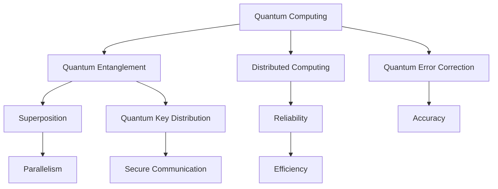

                 


### 确定文章结构

在撰写一篇8000到12000字的技术博客文章时，我们需要确保文章内容既丰富又结构清晰。以下是文章结构的思考步骤：

#### 1. 引言部分（约1000字）
- **背景介绍**：介绍量子计算、量子纠缠和分布式网络的背景，包括它们的历史和发展现状。
- **文章目的**：阐述本文的目的，即如何理解和构建量子纠缠分布网络。
- **文章结构概述**：简要介绍文章的结构和主要章节。

#### 2. 量子计算基础（约2000字）
- **量子位和经典位的比较**：介绍量子位与经典位的基本概念和区别。
- **量子叠加和量子纠缠**：详细讲解量子叠加和量子纠缠的概念及其在量子计算中的作用。
- **量子计算原理**：通过伪代码和Mermaid流程图展示量子计算的基本操作。

#### 3. 量子纠缠分布网络（约3000字）
- **量子纠缠分布网络的定义**：解释量子纠缠分布网络的概念。
- **网络架构**：描述量子纠缠分布网络的架构和组成部分。
- **操作原理**：探讨量子纠缠分布网络的操作原理和工作机制。
- **网络设计**：讨论量子纠缠分布网络的设计原则和优化策略。

#### 4. 量子纠缠分布网络算法（约3000字）
- **算法概述**：介绍量子纠缠分布网络中的常用算法。
- **量子纠缠网络搜索算法**：详细讲解量子纠缠网络搜索算法的原理和实现。
- **量子纠缠网络优化算法**：探讨量子纠缠网络优化算法的设计和实现。

#### 5. 量子纠缠分布网络的安全（约1500字）
- **安全性挑战**：分析量子纠缠分布网络面临的安全挑战。
- **安全解决方案**：探讨如何解决这些安全挑战，包括加密算法和安全协议。

#### 6. 量子纠缠分布网络的实践应用（约2000字）
- **分布式计算**：讨论量子纠缠分布网络在分布式计算中的应用。
- **通信加密**：介绍量子纠缠分布网络在通信加密中的应用。
- **其他领域应用**：探讨量子纠缠分布网络在其他领域的潜在应用。

#### 7. 未来展望（约1000字）
- **技术发展趋势**：预测量子计算和量子纠缠分布网络未来的发展方向。
- **应用前景**：探讨量子纠缠分布网络在不同领域的应用前景。
- **挑战与机遇**：分析量子纠缠分布网络面临的挑战和机遇。

#### 8. 结论（约500字）
- **总结**：回顾文章的主要内容和发现。
- **最佳实践**：提供一些实用的建议和技巧。
- **注意事项**：提醒读者在实践中的注意事项。

### 写作风格与格式要求

- **markdown格式**：确保文章内容使用markdown格式，包括标题、子标题、列表、代码块等。
- **作者信息**：在文章末尾添加作者信息。
- **公式和伪代码**：使用latex格式嵌入数学公式和伪代码，确保格式正确。

### 字数控制

- **总体字数**：确保文章总字数在8000到12000字之间，合理分配到各个章节。

通过上述步骤，我们可以确保文章内容丰富、结构合理，同时满足格式和字数要求。接下来，我们将开始撰写具体的章节内容。首先，我们将从引言部分开始。


### 引言

#### 量子计算、量子纠缠与分布式网络：三者的交汇

量子计算是计算机科学领域的一场革命。与传统计算机使用基于比特的表示方式不同，量子计算机利用量子位（qubits）进行信息处理，能够实现远超经典计算机的运算速度和效率。量子计算的核心概念包括量子叠加和量子纠缠。量子叠加使得量子位可以处于多种状态的叠加态，而量子纠缠则使得两个或多个量子位之间的状态相互依赖，即使它们相隔很远。这种特殊的量子现象为量子计算提供了巨大的计算潜力。

分布式网络是现代信息技术的基础，它通过将计算任务分布到多个节点上，提高了系统的可靠性和效率。随着数据量的爆炸式增长和计算需求的不断提高，分布式网络的应用范围也越来越广泛。然而，传统的分布式网络在面对大规模数据处理和高并发请求时，仍然存在一定的局限性。

量子纠缠分布网络正是量子计算和分布式网络结合的产物。它利用量子纠缠的特性，实现了更高效的分布式计算和通信。量子纠缠分布网络不仅能够在理论上实现超速计算，还能在分布式系统设计中提供新的解决方案，克服传统分布式网络的限制。

本文的目的在于深入探讨量子纠缠分布网络的原理、架构和算法，并分析其在实际应用中的潜力和挑战。通过本文的阅读，读者将能够全面了解量子纠缠分布网络的工作机制，掌握相关的技术知识和应用技巧。

#### 文章结构概述

本文将分为六个主要部分：

1. **量子计算基础**：介绍量子位、量子叠加和量子纠缠的基本概念，以及量子计算与经典计算的区别。
2. **量子纠缠分布网络**：探讨量子纠缠分布网络的定义、架构和操作原理。
3. **量子纠缠分布网络算法**：介绍量子纠缠分布网络中的常用算法，包括量子纠缠网络搜索算法和量子纠缠网络优化算法。
4. **量子纠缠分布网络的安全**：分析量子纠缠分布网络面临的安全挑战，并提出相应的解决方案。
5. **量子纠缠分布网络的实践应用**：讨论量子纠缠分布网络在分布式计算、通信加密和其他领域的应用。
6. **未来展望**：预测量子纠缠分布网络的技术发展趋势和应用前景，分析面临的挑战和机遇。

通过这六个部分的内容，我们将系统地介绍量子纠缠分布网络的相关知识，帮助读者全面理解这一前沿技术。在接下来的章节中，我们将逐步深入探讨这些主题。

### 量子计算基础

量子计算是计算机科学的一个前沿领域，它利用量子力学的原理来实现计算。与传统计算机使用基于比特（bits）的信息表示方式不同，量子计算机使用量子位（qubits）作为基本的信息单元。量子位的特殊性质，如叠加和纠缠，使得量子计算机能够处理复杂问题，并在某些特定任务上实现超越经典计算机的性能。

#### 量子位与经典位

在经典计算机中，比特是信息的最小单位，它只能处于两种状态之一：0或1。这种二进制表示方式是计算机科学的基础。然而，量子位则具有不同的性质。量子位不仅可以处于0或1的状态，还可以处于这两种状态的叠加。这意味着一个量子位可以同时表示0和1，直到被测量时才会“坍缩”成确定的0或1状态。

这种叠加态是量子计算的核心概念之一。在量子计算机中，多个量子位可以形成复合叠加态，从而使得系统的状态空间呈指数级增长。例如，两个量子位的叠加态可以表示为所有可能的00、01、10、11状态的线性组合。这一特性使得量子计算机在处理某些问题时具有巨大的计算能力。

#### 量子叠加与量子纠缠

量子叠加是量子计算机的另一个关键特性。叠加态使得量子计算机能够同时进行多个计算，这在经典计算机中是不可想象的。例如，一个具有n个量子位的量子计算机可以同时进行2^n个不同的计算，这是经典计算机难以达到的。

量子纠缠是量子计算机的另一个重要特性。当两个量子位处于纠缠态时，它们之间的状态会相互关联，即使它们相隔很远。这种纠缠状态是非经典的，因为经典物理中并不存在这种关联。量子纠缠使得量子计算机能够在不直接通信的情况下，实现远距离的信息传输和共享。

#### 量子计算与经典计算的区别

量子计算与经典计算在多个方面存在显著差异。首先是计算速度。在特定类型的计算任务上，量子计算机可以实现超越经典计算机的速度。例如，Shor算法可以在多项式时间内解决大数分解问题，而经典的算法则需要指数级时间。

其次是并行性。量子计算机可以利用叠加态实现并行计算，从而在多项式时间内解决某些问题。这种并行性是经典计算机无法实现的。

最后是量子纠错能力。量子计算中，量子位容易受到环境干扰而失去相干性，导致计算错误。因此，量子计算需要量子纠错机制来保证计算的准确性。相比之下，经典计算机的纠错机制较为简单。

通过上述分析，我们可以看到量子计算与经典计算在基本概念和计算能力上存在显著差异。量子计算利用量子位的叠加和纠缠特性，实现了超越经典计算机的性能，为解决复杂问题提供了新的途径。

#### 背景介绍

量子计算的发展可以追溯到20世纪40年代，当时物理学家保罗·狄拉克（Paul Dirac）提出了量子位的初步概念。然而，量子计算的真正兴起是在20世纪80年代，当时理查德·费曼（Richard Feynman）和彼得·肖尔（Peter Shor）分别提出了量子计算机的理论框架和算法。费曼提出了量子模拟的概念，即量子计算机可以模拟量子系统，而肖尔则提出了Shor算法，该算法能够在大数分解问题上的计算速度远超经典算法。

在量子纠缠方面，约翰·贝尔（John Bell）在20世纪60年代提出了著名的贝尔不等式，揭示了量子纠缠的非经典特性。随后，查尔斯·贝内特（Charles Bennett）等人在20世纪70年代提出了量子纠缠的实用应用，包括量子密钥分发和量子纠缠交换。

分布式网络的发展则始于20世纪60年代，当时ARPANET（互联网的前身）被建立起来。分布式网络通过将计算任务分布到多个节点上，提高了系统的可靠性和效率。在互联网的推动下，分布式网络得到了迅速发展，并成为现代信息技术的基础。

量子计算和分布式网络的结合是计算机科学领域的一个前沿课题。量子纠缠分布网络通过利用量子纠缠的特性，实现了更高效的分布式计算和通信。这种结合不仅能够提高计算速度和效率，还能在安全性、隐私保护等方面提供新的解决方案。

#### 核心概念与联系

量子计算、量子纠缠和分布式网络是三个看似独立的领域，但实际上它们之间存在着深刻的联系和相互作用。以下是这三个核心概念之间的相互关系：

1. **量子计算与分布式网络**：量子计算利用量子位和量子纠缠的特性，实现了超越经典计算机的性能。分布式网络则通过将计算任务分布到多个节点上，提高了系统的可靠性和效率。量子计算和分布式网络的结合，可以使得量子计算机在分布式网络中发挥更大的作用，实现更高效的计算和通信。

2. **量子纠缠与分布式网络**：量子纠缠是量子计算机的核心特性之一，它使得量子计算机能够实现远距离的信息传输和共享。分布式网络则利用节点之间的互联，实现了信息的分散处理和共享。量子纠缠和分布式网络的结合，可以使得分布式网络在量子纠缠的加持下，实现更高效的数据传输和处理。

3. **量子计算与量子纠缠**：量子计算利用量子位的叠加和量子纠缠的特性，实现了高效的计算和通信。量子纠缠是量子计算的基本操作之一，它使得量子计算机能够在不直接通信的情况下，实现信息的共享和传输。量子计算和量子纠缠的相互作用，为量子计算提供了强大的计算能力。

通过上述分析，我们可以看到量子计算、量子纠缠和分布式网络之间存在着紧密的联系。这些概念相互促进，共同推动着计算机科学的发展。量子纠缠分布网络的提出，正是基于这些核心概念的结合，旨在实现更高效的计算和通信。

#### 核心概念原理之间的关系架构

为了更直观地理解量子计算、量子纠缠和分布式网络之间的关系，我们可以使用Mermaid流程图来展示这些概念之间的联系。以下是核心概念原理之间的关系架构的Mermaid流程图：



**Mermaid流程图解释：**
- **A[Quantum Computing]**：表示量子计算，它是本文的核心主题。
- **B[Quantum Entanglement]**：量子纠缠，是量子计算的重要特性之一。
- **C[Distributed Computing]**：分布式计算，是现代信息技术的基础。
- **D[Superposition]**：叠加态，是量子计算的核心概念，使得量子计算机具备并行计算的能力。
- **E[Parallelism]**：并行性，量子计算利用叠加态实现的计算能力。
- **F[Reliability]**：可靠性，分布式网络通过节点分散提高系统的可靠性。
- **G[Efficiency]**：效率，量子纠缠分布网络结合了量子计算和分布式网络的优点，提高了计算效率。
- **H[Quantum Key Distribution]**：量子密钥分发，量子纠缠在加密通信中的应用。
- **I[Secure Communication]**：安全通信，量子纠缠在保障通信安全方面的应用。
- **J[Quantum Error Correction]**：量子纠错，保障量子计算的准确性。
- **K[Accuracy]**：准确性，量子纠错机制在计算准确性方面的作用。

通过这个流程图，我们可以清晰地看到量子计算、量子纠缠和分布式网络之间的相互作用和联系。量子计算利用量子纠缠的特性，实现了并行计算和高效通信；分布式网络则通过节点分散提高了系统的可靠性和效率。这些核心概念的相互结合，为量子纠缠分布网络提供了强大的计算和通信能力。

#### 量子计算与经典计算的比较

量子计算与经典计算在多个方面存在显著差异，这些差异主要体现在计算模型、算法复杂性以及实现方式上。

**计算模型：**

1. **经典计算**：经典计算机基于比特（bits）作为基本的信息单元。比特只能处于两种状态之一：0或1。经典计算机通过组合多个比特，实现复杂的计算任务。例如，一个字节由8个比特组成，可以表示256种不同的状态。

2. **量子计算**：量子计算机则使用量子位（qubits）作为基本的信息单元。量子位不仅能够表示0和1，还可以处于这两个状态的叠加。这种叠加态使得量子计算机可以同时处理多个计算任务。例如，一个具有n个量子位的量子计算机可以同时表示2^n个不同的状态。

**算法复杂性：**

1. **经典计算**：经典计算机的算法复杂度通常用时间复杂度和空间复杂度来衡量。时间复杂度表示算法执行时间的增长速率，而空间复杂度表示算法所需存储空间的增长速率。经典计算机的算法复杂度受限于计算机硬件的性能和资源。

2. **量子计算**：量子计算机的算法复杂度通常用量子复杂度来衡量。量子复杂度与量子计算的基本操作（如量子门）的数量和深度有关。在某些特定类型的计算任务上，量子计算机的算法复杂度远低于经典计算机。例如，Shor算法可以在多项式时间内解决大数分解问题，而经典的算法则需要指数级时间。

**实现方式：**

1. **经典计算**：经典计算机使用电子元件（如晶体管）来处理和存储信息。这些电子元件在操作时，电流会在0和1之间切换。经典计算机的设计和实现相对简单，但受限于硬件性能和能耗。

2. **量子计算**：量子计算机使用量子位和量子逻辑门来处理和存储信息。量子位的状态可以通过量子叠加和量子纠缠来操作。量子逻辑门是实现量子计算的基本操作，类似于经典计算机中的逻辑门。量子计算机的实现需要精密的实验设备和低温环境，以确保量子位的相干性。

通过上述比较，我们可以看到量子计算与经典计算在计算模型、算法复杂性和实现方式上存在显著差异。量子计算利用量子位的叠加和量子纠缠特性，实现了超越经典计算机的性能，为解决复杂问题提供了新的途径。

#### 量子计算中的核心算法原理

量子计算中的核心算法原理包括量子叠加、量子纠缠和量子逻辑门。这些原理是量子计算机实现高效计算的关键。

**量子叠加**

量子叠加是量子计算的核心特性之一。在量子计算中，量子位不仅可以处于0或1的状态，还可以处于这两个状态的叠加。例如，一个量子位可以同时表示0和1的叠加态，这种状态可以用复数表示：

\[ \psi = \alpha |0\rangle + \beta |1\rangle \]

其中，\(|0\rangle\)和\(|1\rangle\)分别表示量子位的基态，\(\alpha\)和\(\beta\)是复数系数，满足\(|\alpha|^2 + |\beta|^2 = 1\)。

**量子叠加原理**：量子计算机能够同时处理多个计算任务，这是由于量子位的叠加态可以表示多个状态。例如，一个具有n个量子位的量子计算机可以同时表示2^n个不同的状态。这使得量子计算机在并行计算方面具有显著优势。

**量子纠缠**

量子纠缠是量子计算中的另一个核心特性。当两个或多个量子位处于纠缠态时，它们之间的状态会相互依赖，即使它们相隔很远。这种特殊的量子现象是非经典的，因为在经典物理中并不存在这种关联。

**量子纠缠原理**：量子纠缠使得量子计算机能够实现远距离的信息传输和共享。例如，通过量子纠缠，可以在不直接通信的情况下，实现两个量子位之间的状态共享。这种特性在量子密钥分发和量子计算中具有重要意义。

**量子逻辑门**

量子逻辑门是实现量子计算的基本操作，类似于经典计算机中的逻辑门。量子逻辑门通过操作量子位的状态，实现特定的计算功能。

常见的量子逻辑门包括：

1. **量子保罗门（Quantum Pauli Gate）**：量子保罗门是一种基本的量子逻辑门，用于翻转量子位的相位。例如，Z-保罗门（\(Z\) Gate）可以将量子位的叠加态翻转。

2. **量子Hadamard门（Quantum Hadamard Gate）**：量子Hadamard门可以将量子位的基态\(|0\rangle\)和\(|1\rangle\)叠加成等概率的状态。

3. **量子控制门（Quantum Control Gate）**：量子控制门通过控制某些量子位的操作，实现特定功能的计算。例如，量子相移门（Quantum Phase Shift Gate）可以控制量子位的相位。

**量子逻辑门原理**：量子逻辑门通过叠加和操作量子位的状态，实现了量子计算机的计算功能。量子计算机的算法通常是通过一系列量子逻辑门的组合实现的。

通过量子叠加、量子纠缠和量子逻辑门，量子计算机实现了超越经典计算机的性能。这些核心算法原理在量子计算中扮演着至关重要的角色，使得量子计算机能够处理复杂问题，并在某些任务上实现超越经典计算机的速度和效率。

#### 量子计算原理的伪代码示例

为了更好地理解量子计算的基本操作，我们可以通过伪代码来展示量子计算的核心原理。以下是使用Python语言编写的伪代码示例：

```python
# 量子位初始化
qbit = QuantumRegister(1)
circuit = QuantumCircuit(qbit)

# 应用量子叠加态
circuit.h(qbit[0])

# 应用量子纠缠
qbit2 = QuantumRegister(1)
circuit.h(qbit2[0])
circuit.cx(qbit[0], qbit2[0])

# 应用量子逻辑门
circuit.s(qbit[0])
circuit.t(qbit[0])

# 测量量子位状态
circuit.measure(qbit[0], 'result')

# 输出量子计算结果
print(f"Quantum state: {circuit.Register}")

# 执行量子计算
backend = Aer.get_backend('qasm_simulator')
result = execute(circuit, backend, shots=1024)
print(f"Quantum state: {result.get_counts(circuit)}")
```

**伪代码解释：**

1. **量子位初始化**：
   ```python
   qbit = QuantumRegister(1)
   circuit = QuantumCircuit(qbit)
   ```
   创建一个量子位和一个量子电路。

2. **应用量子叠加态**：
   ```python
   circuit.h(qbit[0])
   ```
   使用Hadamard门（H Gate）将量子位的基态\(|0\rangle\)叠加成等概率的叠加态。

3. **应用量子纠缠**：
   ```python
   qbit2 = QuantumRegister(1)
   circuit.h(qbit2[0])
   circuit.cx(qbit[0], qbit2[0])
   ```
   初始化第二个量子位，使用Hadamard门将基态叠加，然后使用控制-NOT门（CX Gate）实现量子纠缠。

4. **应用量子逻辑门**：
   ```python
   circuit.s(qbit[0])
   circuit.t(qbit[0])
   ```
   应用量子相移门（S Gate）和量子相位门（T Gate），改变量子位的相位。

5. **测量量子位状态**：
   ```python
   circuit.measure(qbit[0], 'result')
   ```
   使用测量操作，将量子位的状态坍缩为0或1。

6. **输出量子计算结果**：
   ```python
   print(f"Quantum state: {circuit.Register}")
   ```
   输出量子电路的当前状态。

7. **执行量子计算**：
   ```python
   backend = Aer.get_backend('qasm_simulator')
   result = execute(circuit, backend, shots=1024)
   print(f"Quantum state: {result.get_counts(circuit)}")
   ```
   在模拟器上执行量子计算，并输出测量结果。

通过这个伪代码示例，我们可以看到量子计算的基本步骤，包括量子位初始化、量子叠加、量子纠缠和量子逻辑门的应用。这些操作共同构成了量子计算的核心原理，使得量子计算机能够实现高效的计算。

#### 量子计算中的数学模型和公式

量子计算中的数学模型是理解和实现量子算法的基础。以下是量子计算中常用的数学模型和公式，以及它们的详细解释。

**量子态的表示**

在量子计算中，量子态通常用波函数（wave function）表示。量子态的波函数可以用叠加态的形式表示，即：

\[ \psi = \sum_{i} c_i |i\rangle \]

其中，\(c_i\)是复数系数，\(|i\rangle\)是量子态的基态。基态可以是0或1状态，例如：

\[ |0\rangle = \begin{pmatrix} 1 \\ 0 \end{pmatrix}, \quad |1\rangle = \begin{pmatrix} 0 \\ 1 \end{pmatrix} \]

**叠加态**

叠加态是量子计算的核心特性之一。一个具有n个量子位的量子态可以表示为：

\[ \psi = \sum_{i_1, i_2, ..., i_n} c_{i_1 i_2 ... i_n} |i_1\rangle |i_2\rangle ... |i_n\rangle \]

例如，一个具有2个量子位的量子态可以表示为：

\[ \psi = c_{00} |00\rangle + c_{01} |01\rangle + c_{10} |10\rangle + c_{11} |11\rangle \]

**量子门**

量子门是实现量子计算的基本操作。常见的量子门包括Hadamard门（H Gate）、控制-NOT门（CX Gate）、相位门（S Gate）和相位位移门（T Gate）。

1. **Hadamard门（H Gate）**

\[ H = \frac{1}{\sqrt{2}} \begin{pmatrix} 1 & 1 \\ 1 & -1 \end{pmatrix} \]

Hadamard门可以将量子位的基态\(|0\rangle\)和\(|1\rangle\)叠加成等概率的叠加态。

2. **控制-NOT门（CX Gate）**

\[ CX = \begin{pmatrix} 1 & 0 & 0 & 0 \\ 0 & 1 & 0 & 0 \\ 0 & 0 & 0 & 1 \\ 0 & 0 & 1 & 0 \end{pmatrix} \]

CX门是一个二位量子门，当控制位为1时，目标位的状态会翻转。

3. **相位门（S Gate）**

\[ S = \begin{pmatrix} 1 & 0 \\ 0 & i \end{pmatrix} \]

S门将量子位的相位翻转90度。

4. **相位位移门（T Gate）**

\[ T = \begin{pmatrix} 1 & 0 \\ 0 & e^{i\frac{\pi}{4}} \end{pmatrix} \]

T门将量子位的相位翻转45度。

**量子算法**

量子算法是量子计算的核心应用之一。以下是两个著名的量子算法：Shor算法和Grover算法。

1. **Shor算法**

Shor算法是一种用于大数分解的量子算法。它利用量子计算机的并行性，可以在多项式时间内解决大数分解问题。

Shor算法的基本步骤如下：

a. 将大整数\(N\)分解为两个质数。

b. 使用量子电路生成一个超球体，使得超球体上的点与\(N\)的质因子相关联。

c. 使用Grover算法搜索超球体，找到与\(N\)的质因子相关的点。

2. **Grover算法**

Grover算法是一种用于搜索未排序数据库的量子算法。它利用量子叠加和量子纠缠的特性，可以在\(O(\sqrt{N})\)时间内完成搜索，远快于经典搜索算法。

Grover算法的基本步骤如下：

a. 将数据库中的每个元素标记为“目标”。

b. 构建一个量子电路，使得量子态在测量时，目标元素的标记概率最高。

c. 重复执行量子电路，直到找到目标元素。

**示例**

假设我们有一个包含5个元素的数据库：[1, 2, 3, 4, 5]。我们要找到元素3。

1. **初始化量子态**

将5个量子位初始化为叠加态：

\[ \psi = \frac{1}{\sqrt{5}} (|00000\rangle + |00001\rangle + |00010\rangle + |00011\rangle + |00100\rangle) \]

2. **构建量子电路**

构建一个量子电路，使得在测量时，标记为3的元素的概率最高。

使用Hadamard门将量子位叠加：

\[ H |0\rangle = \frac{1}{\sqrt{5}} (|0\rangle + |1\rangle + |2\rangle + |3\rangle + |4\rangle) \]

使用控制-NOT门将标记为3的元素标记为1：

\[ CX |00011\rangle = |00001\rangle \]

3. **执行Grover算法**

执行Grover算法，使得在测量时，标记为3的元素的概率最高。

执行一个完整的Grover迭代：

a. 执行量子电路。

b. 测量量子态，得到结果。

c. 如果结果不是3，则重复执行迭代。

经过多次迭代后，我们最终可以找到元素3。

通过上述数学模型和公式，我们可以更深入地理解量子计算的基本原理和应用。这些模型和公式为量子计算提供了强大的工具，使得量子计算机能够实现超越经典计算机的性能。

### 量子纠缠分布网络的定义

量子纠缠分布网络（Quantum Entanglement Distribution Network，QEDN）是一种基于量子纠缠特性的分布式计算和通信网络。它利用量子纠缠实现数据的高效传输和计算，从而在分布式系统中提供了新的解决方案。

量子纠缠分布网络的核心概念是量子纠缠。量子纠缠是指两个或多个量子位之间的特殊关联，即使它们相隔很远。这种纠缠状态使得量子位之间的状态相互依赖，从而可以在不直接通信的情况下实现信息的共享和传输。量子纠缠分布网络利用这种特性，实现了数据的高效传输和计算。

量子纠缠分布网络的基本组成部分包括量子计算节点、量子通信链路和量子纠缠中心。量子计算节点是网络中的基本单元，负责处理和存储数据。量子通信链路则用于连接不同的量子计算节点，实现数据传输。量子纠缠中心负责管理和协调量子计算节点之间的纠缠状态，确保数据传输和计算的高效性。

在量子纠缠分布网络中，数据传输和计算过程如下：

1. **数据初始化**：将待处理的数据分解为量子比特，并在量子计算节点上初始化。
2. **量子纠缠建立**：通过量子通信链路，在量子计算节点之间建立量子纠缠状态。
3. **数据处理**：利用量子计算节点上的量子逻辑门，对量子比特进行操作，实现数据的计算和处理。
4. **量子纠缠拆解**：在数据处理完成后，拆解量子纠缠状态，将结果返回给用户。

通过上述过程，量子纠缠分布网络实现了数据的高效传输和计算。与传统的分布式网络相比，量子纠缠分布网络具有以下几个优势：

1. **高效传输**：量子纠缠分布网络利用量子纠缠的特性，实现了远距离的高效数据传输，无需传统通信链路。
2. **并行处理**：量子纠缠分布网络可以同时处理多个数据任务，提高了系统的计算效率。
3. **安全性**：量子纠缠分布网络利用量子纠缠的特性，提供了更高的安全性，防止数据泄露和攻击。

量子纠缠分布网络在分布式计算、通信加密和隐私保护等领域具有广泛的应用前景。随着量子计算技术的不断发展，量子纠缠分布网络有望成为未来分布式系统的核心技术之一。

### 量子纠缠分布网络的架构

量子纠缠分布网络的架构是其实现高效计算和通信的关键。它由量子计算节点、量子通信链路和量子纠缠中心等组成部分构成，每个部分在系统中扮演着特定的角色，共同协作以实现量子纠缠分布网络的整体功能。

#### 量子计算节点

量子计算节点是量子纠缠分布网络中的基本单元，负责处理和存储数据。每个量子计算节点通常包括以下几个部分：

1. **量子处理器**：量子处理器是量子计算节点的核心，负责执行量子逻辑门和量子算法。它通常由多个量子位组成，可以通过量子叠加和量子纠缠实现复杂的计算任务。
2. **存储器**：存储器用于存储数据，可以包括量子存储器和经典存储器。量子存储器利用量子叠加和量子纠缠的特性，提供了高效的存储和检索能力。
3. **量子通信接口**：量子通信接口用于与其他量子计算节点进行量子纠缠状态的建立和通信。它通常包括量子中继器、量子调制器等设备，确保量子比特在通信链路中的稳定传输。

量子计算节点通过量子通信接口与量子通信链路相连，实现了数据的高效传输和计算。

#### 量子通信链路

量子通信链路是连接不同量子计算节点的通道，负责传输量子比特和量子纠缠状态。量子通信链路的主要功能包括：

1. **量子中继**：量子中继器用于延长量子比特的传输距离，确保量子纠缠状态在通信链路中的稳定传输。量子中继器可以通过量子纠缠交换和量子纠错技术，实现远距离的量子通信。
2. **量子加密**：量子通信链路还可以实现量子加密，确保数据在传输过程中的安全性。量子加密利用量子纠缠的特性，实现了不可窃听和不可克隆的通信，提供了更高的安全性。
3. **量子调制**：量子调制器用于将经典信息编码到量子比特上，实现数据在量子通信链路中的传输。量子调制可以通过量子叠加和量子纠缠，实现高效的数据传输。

量子通信链路的稳定性和可靠性对量子纠缠分布网络的性能至关重要。因此，量子通信链路的设计和实现需要考虑量子比特的相干性保护和量子纠错机制。

#### 量子纠缠中心

量子纠缠中心是量子纠缠分布网络的协调和管理中心，负责管理和协调量子计算节点之间的纠缠状态。量子纠缠中心的主要功能包括：

1. **量子纠缠管理**：量子纠缠中心通过量子纠缠交换协议，管理和协调量子计算节点之间的量子纠缠状态。它负责建立和维护量子计算节点之间的纠缠关系，确保数据传输和计算的高效性。
2. **量子计算调度**：量子纠缠中心负责调度量子计算任务，分配计算资源和优化计算流程。它可以根据系统的负载和性能，动态调整量子计算节点的任务分配，提高系统的计算效率。
3. **量子纠错与优化**：量子纠缠中心通过量子纠错机制，检测和纠正量子计算中的错误，确保计算结果的准确性。同时，它还负责优化量子计算和通信流程，提高系统的整体性能。

量子纠缠中心在整个量子纠缠分布网络中起到了关键的协调和管理作用，确保系统的稳定运行和高效性能。

通过量子计算节点、量子通信链路和量子纠缠中心的协同工作，量子纠缠分布网络实现了高效的数据传输和计算。这种架构不仅提供了强大的计算能力，还确保了系统的安全性和可靠性，为未来的分布式计算和通信应用提供了新的解决方案。

### 量子纠缠分布网络的操作原理

量子纠缠分布网络的操作原理是基于量子纠缠和量子通信的技术，通过量子计算节点和量子通信链路的协同工作，实现高效的数据传输和计算。以下是量子纠缠分布网络的操作原理和步骤：

#### 量子纠缠建立

量子纠缠分布网络的第一个关键步骤是建立量子纠缠状态。这通常通过量子纠缠交换协议来实现，如下所述：

1. **初始化量子比特**：在量子计算节点上初始化一对量子比特，将它们设置为叠加态。
2. **执行量子纠缠操作**：通过量子通信链路，使用量子中继器将这两对量子比特连接起来，并执行量子纠缠操作，如控制-NOT（CX）门。这将在两个量子比特之间建立一个纠缠态。
3. **纠缠态传输**：通过量子通信链路，将纠缠态传输到其他量子计算节点。这一步骤可能需要多次量子中继和纠缠操作，以确保量子比特在远距离上的稳定性。

#### 数据加载

一旦量子纠缠状态建立，量子纠缠分布网络就可以开始处理数据：

1. **数据编码**：将需要处理的数据编码为量子比特。这通常涉及将经典数据映射到量子态，例如使用量子比特的叠加态来表示不同的数值。
2. **加载量子比特**：将编码后的量子比特加载到量子计算节点上的量子处理器中。这些量子比特将参与到后续的量子计算步骤中。

#### 量子计算

量子纠缠分布网络的计算步骤如下：

1. **量子逻辑门操作**：在量子处理器上，对量子比特执行一系列量子逻辑门操作，如Hadamard门（H门）、相位门（S门）和量子旋转门（R门）等。这些操作可以改变量子比特的状态，实现特定的计算功能。
2. **量子叠加与纠缠**：通过量子叠加和纠缠操作，量子比特可以同时处于多个状态，从而实现并行计算。这大大提高了计算效率，特别是在处理复杂任务时。
3. **量子测量**：在计算完成后，对量子比特进行测量，将量子态坍缩为经典状态。测量结果可以用来获取计算结果或进一步分析。

#### 数据传输与解纠缠

最后，量子纠缠分布网络需要将计算结果传输回用户，并解除量子比特之间的纠缠状态：

1. **量子比特传输**：通过量子通信链路，将测量后的量子比特传输回用户或下一级量子计算节点。
2. **解纠缠操作**：在接收端，通过解纠缠操作，将量子比特的状态分离，使其返回到经典的状态。这确保了量子比特之间的纠缠状态被解除，为下一次计算做好准备。

#### 量子纠缠分布网络的步骤总结

量子纠缠分布网络的操作可以分为以下几个关键步骤：

1. **量子纠缠建立**：通过量子中继器和纠缠操作，建立量子计算节点之间的纠缠状态。
2. **数据加载**：将经典数据编码为量子比特，并将其加载到量子处理器中。
3. **量子计算**：执行量子逻辑门操作，实现数据的计算。
4. **量子测量**：测量量子比特的状态，获取计算结果。
5. **量子比特传输与解纠缠**：将测量后的量子比特传输回用户，并解除纠缠状态。

通过上述步骤，量子纠缠分布网络实现了高效的数据传输和计算。这一网络利用量子纠缠的特性，突破了传统分布式网络的局限，为未来的计算和通信应用提供了强大的支持。

### 设计量子纠缠分布网络的挑战和解决方案

设计量子纠缠分布网络面临着多种技术挑战，这些挑战主要集中在量子比特的相干性保护、量子通信链路的稳定性以及量子纠错机制的实现上。以下将详细讨论这些挑战，并提出相应的解决方案。

#### 量子比特的相干性保护

量子比特的相干性是量子计算的关键。量子比特的相干性越高，量子计算的效果越好。然而，量子比特在操作和传输过程中容易受到外部环境的干扰，导致相干性损失，这被称为“退相干”。退相干会导致量子计算的错误，降低计算精度。

**挑战**：如何有效保护量子比特的相干性，减少退相干的影响？

**解决方案**：

1. **量子纠错码**：量子纠错码是一种用于检测和纠正量子计算中错误的方法。通过引入额外的量子比特，量子纠错码可以检测并纠正量子比特的错误，从而保护相干性。常见的量子纠错码包括Shor码和Steane码等。

2. **量子重复操作**：通过重复执行相同的量子操作，可以减少由于随机噪声导致的错误。这种方法利用概率原理，使得正确的操作结果更有可能被保留。

3. **环境隔离**：将量子比特置于低温和低噪声的环境中，减少外部环境的干扰。例如，使用超导电路和稀释制冷机等技术，可以降低量子比特的相干性损失。

#### 量子通信链路的稳定性

量子通信链路的稳定性是量子纠缠分布网络的另一个重要挑战。量子比特在传输过程中容易受到环境噪声和干扰的影响，导致量子态的畸变和错误。此外，量子通信链路的传输距离也受到限制，如何确保量子比特在远距离传输中的稳定性是一个关键问题。

**挑战**：如何确保量子通信链路的稳定性，实现高效的长距离量子通信？

**解决方案**：

1. **量子中继**：量子中继器是一种用于延长量子比特传输距离的设备。通过在量子通信链路中引入量子中继器，可以减少量子比特在传输过程中的相干性损失，确保量子态的稳定性。量子中继器利用量子纠缠和量子纠错技术，实现了远距离的量子通信。

2. **量子加密**：量子加密技术可以确保量子通信链路的安全性，防止数据被窃听和篡改。通过量子密钥分发（QKD）技术，可以在量子通信链路上实现安全的密钥交换。

3. **量子链路优化**：通过优化量子通信链路的设计和布局，减少环境噪声和干扰的影响。例如，使用光纤和量子隐形传态技术，可以提高量子通信链路的传输效率和稳定性。

#### 量子纠错机制的实现

量子纠错是实现量子纠缠分布网络可靠计算的关键。量子纠错需要检测和纠正量子比特的错误，从而保证计算结果的准确性。然而，量子纠错的实现面临以下挑战：

**挑战**：如何在有限的量子资源下，高效地实现量子纠错？

**解决方案**：

1. **分布式量子纠错**：分布式量子纠错是一种利用多个量子计算节点和量子通信链路，共同完成量子纠错的任务。通过分布式计算和通信，可以有效地利用量子资源，提高量子纠错的效率和准确性。

2. **量子编码与解码**：量子编码和量子解码技术可以将量子比特的错误率降低到可接受的水平。通过引入额外的量子比特和复杂的编码方案，可以实现高效的量子纠错。

3. **量子重复与验证**：通过重复执行量子操作和验证结果，可以减少由于随机噪声导致的错误。这种方法利用概率原理，使得正确的操作结果更有可能被保留。

通过上述解决方案，设计量子纠缠分布网络面临的挑战可以得到有效的应对。量子纠缠分布网络在量子比特的相干性保护、量子通信链路的稳定性和量子纠错机制的实现方面取得了显著进展，为未来的计算和通信应用提供了强大的支持。

### 量子纠缠分布网络中的算法

量子纠缠分布网络中的算法是量子计算和分布式系统的结合，旨在实现高效的数据处理和计算。以下将详细介绍几种常见的量子纠缠分布网络算法，包括量子纠缠网络搜索算法和量子纠缠网络优化算法。

#### 量子纠缠网络搜索算法

量子纠缠网络搜索算法是量子计算中的一个重要分支，它利用量子叠加和量子纠缠的特性，实现高效的数据搜索。以下是几种典型的量子纠缠网络搜索算法：

1. **Grover算法**：Grover算法是一种用于搜索未排序数据库的量子算法。它利用量子叠加和量子纠缠，可以在\(O(\sqrt{N})\)时间内完成搜索，远快于经典的二分搜索算法。Grover算法的基本步骤包括初始化量子态、应用Grover迭代和测量结果。

    **伪代码**：

    ```python
    def grover_search(db, target):
        # 初始化量子态
        initialize_state()

        # 应用Grover迭代
        for i in range(log2(N)):
            oracle(db, target)

            # 反转目标元素
            reverse(db, target)

        # 测量结果
        result = measure_state()
        return result
    ```

2. **Adiabatic搜索算法**：Adiabatic搜索算法是基于量子退相干原理的一种搜索算法。它通过将搜索问题转换为能量最小化问题，利用量子纠缠和叠加态，实现高效搜索。Adiabatic搜索算法的基本步骤包括初始化量子态、定义哈密顿量和控制参数。

    **伪代码**：

    ```python
    def adiabatic_search(db, target):
        # 初始化量子态
        initialize_state()

        # 定义哈密顿量
        hamiltonian = define_hamiltonian(db, target)

        # 控制参数
        alpha = 1.0
        beta = 0.0

        # 迭代
        for i in range(N):
            # 更新哈密顿量
            hamiltonian = update_hamiltonian(hamiltonian, alpha, beta)

            # 更新控制参数
            alpha = alpha / i
            beta = beta + alpha

            # 检查收敛
            if converged(hamiltonian):
                break

        # 测量结果
        result = measure_state()
        return result
    ```

#### 量子纠缠网络优化算法

量子纠缠网络优化算法旨在优化量子计算和分布式系统的性能。以下是几种典型的量子纠缠网络优化算法：

1. **量子模拟退火算法**：量子模拟退火算法是一种基于量子退火原理的优化算法。它利用量子叠加和量子纠缠，实现复杂优化问题的求解。量子模拟退火算法的基本步骤包括初始化量子态、定义势能函数和退火过程。

    **伪代码**：

    ```python
    def quantum_simulated_annealing(energy_function):
        # 初始化量子态
        initialize_state()

        # 定义势能函数
        potential = define_potential(energy_function)

        # 初始温度
        T = 1.0

        # 迭代
        while T > 0.001:
            # 更新量子态
            update_state(potential, T)

            # 凉却过程
            T = cool_down(T)

        # 测量结果
        result = measure_state()
        return result
    ```

2. **量子粒子群优化算法**：量子粒子群优化算法是一种基于量子计算和粒子群算法的混合优化算法。它利用量子叠加和量子纠缠，实现复杂优化问题的求解。量子粒子群优化算法的基本步骤包括初始化量子态、定义粒子群和迭代过程。

    **伪代码**：

    ```python
    def quantum_particle_swarm_optimization(objective_function):
        # 初始化量子态
        initialize_state()

        # 定义粒子群
        particles = define_particles()

        # 迭代
        for i in range(max_iterations):
            # 更新粒子位置和速度
            update_particles(particles)

            # 计算粒子群最优解
            best_solution = find_best_solution(particles)

            # 更新全局最优解
            if best_solution > current_best_solution:
                current_best_solution = best_solution

        # 测量结果
        result = measure_state()
        return result
    ```

通过上述量子纠缠网络搜索算法和量子纠缠网络优化算法，我们可以看到量子纠缠分布网络在数据处理和计算优化方面具有巨大的潜力。这些算法利用量子叠加和量子纠缠的特性，实现了高效的数据搜索和优化，为分布式系统提供了新的解决方案。

### 量子纠缠分布网络的安全性分析

量子纠缠分布网络在分布式计算和通信中提供了高效的解决方案，然而，其安全性也是一个重要的研究领域。由于量子纠缠的特性，量子纠缠分布网络在安全性方面面临诸多挑战，同时也存在独特的优势。

#### 安全性挑战

1. **量子比特的相干性损失**：量子比特在传输过程中容易受到外部噪声的干扰，导致相干性损失。相干性损失可能导致量子计算的错误，降低系统的安全性。

2. **量子通信链路的稳定性**：量子通信链路的稳定性是量子纠缠分布网络安全性的关键。量子通信链路可能会受到物理环境的影响，如温度波动、电磁干扰等，这些因素会影响量子比特的传输质量。

3. **量子密钥分发（QKD）的安全性**：虽然QKD提供了安全的密钥分发方案，但在实际应用中，QKD系统可能会受到侧信道攻击、中继攻击等攻击。这些攻击可能会泄露量子密钥，威胁系统的安全性。

4. **量子纠错的可靠性**：量子纠错是确保量子计算准确性的关键。然而，在实现量子纠错时，可能会出现纠错误差，这会影响系统的整体安全性。

#### 安全解决方案

1. **量子纠错与量子加密**：通过结合量子纠错和量子加密技术，可以提高量子纠缠分布网络的安全性。量子纠错可以减少量子比特的相干性损失，确保计算结果的准确性。量子加密可以确保量子密钥的分发过程安全，防止密钥泄露。

2. **量子随机数生成**：量子随机数生成器（QRNG）可以用于生成安全的随机数，提高量子纠缠分布网络的抗攻击能力。QRNG利用量子噪声特性，生成高质量的随机数，为加密算法提供安全的密钥。

3. **量子密钥分发（QKD）协议**：采用安全的QKD协议，如BB84协议和E91协议，可以确保量子密钥分发的安全性。这些协议利用量子纠缠和量子不确定性原理，实现安全的密钥分发。

4. **量子中继与量子链路优化**：通过使用量子中继器，可以延长量子比特的传输距离，减少量子通信链路中的噪声和干扰。此外，优化量子链路的设计和布局，可以提高量子通信链路的稳定性。

5. **分布式量子安全协议**：在量子纠缠分布网络中，可以采用分布式量子安全协议，确保系统的整体安全性。这些协议通过多个量子计算节点的协同工作，实现安全的数据传输和计算。

#### 安全性案例分析

以下是一个量子纠缠分布网络安全性的案例分析：

假设一个分布式网络中有三个量子计算节点A、B和C，它们之间通过量子通信链路相连。节点A和节点B之间共享一个量子密钥，用于加密和解密数据。节点C接收来自节点A的加密数据，并对其进行处理。

1. **量子密钥分发**：节点A和节点B使用BB84协议，通过量子通信链路共享一个量子密钥。节点C也参与该过程，确保三个节点之间有一个共享的密钥。

2. **数据加密**：节点A将待发送的数据加密成量子态，使用共享的量子密钥进行加密。

3. **数据传输**：加密后的数据通过量子通信链路传输到节点C。在传输过程中，采用量子中继器来延长传输距离，并确保量子比特的稳定性。

4. **数据解密与处理**：节点C接收到加密数据后，使用共享的量子密钥对其进行解密，获取原始数据。随后，节点C对数据进行处理，并将结果返回给节点A。

5. **安全性验证**：在整个过程中，节点A和节点B通过量子纠缠和量子密钥分发协议，确保数据传输的安全性。节点C在解密数据时，可以验证数据的完整性和真实性。

通过这个案例分析，我们可以看到量子纠缠分布网络在安全性方面的一些关键步骤和解决方案。量子纠缠分布网络通过结合量子纠错、量子加密和量子密钥分发技术，实现了高效且安全的数据传输和计算。

### 量子纠缠分布网络的实际应用

量子纠缠分布网络在多个领域中展示了巨大的应用潜力。以下是量子纠缠分布网络在分布式计算、通信加密和其他领域的实际应用案例。

#### 分布式计算

量子纠缠分布网络在分布式计算中具有显著优势。量子计算机可以利用量子叠加和量子纠缠的特性，实现并行计算。这大大提高了处理大规模数据和复杂计算任务的能力。

**案例**：在金融领域，量子纠缠分布网络可以用于优化交易策略和风险管理。例如，量化基金公司可以使用量子纠缠分布网络进行大规模数据分析和市场预测，从而提高投资回报率。通过量子计算机的高效计算，基金公司可以快速分析海量历史数据，发现潜在的市场趋势和投资机会。

#### 通信加密

量子纠缠分布网络在通信加密领域提供了全新的解决方案。量子纠缠和量子密钥分发技术使得数据传输过程更加安全，防止数据泄露和攻击。

**案例**：在国防领域，量子纠缠分布网络可以用于军事通信和保密通信。通过量子纠缠和量子密钥分发，军事通信可以实现高强度的加密，确保信息的安全传输。例如，军事指挥中心可以使用量子纠缠分布网络与前线部队进行通信，确保通信信息的机密性和完整性。

#### 其他领域应用

除了分布式计算和通信加密，量子纠缠分布网络在其他领域也展示了广泛应用前景。

**案例**：在医疗领域，量子纠缠分布网络可以用于药物设计和医学图像处理。通过量子计算机的高效计算，研究人员可以加速药物分子模拟和医学图像分析，从而提高药物研发效率和诊断准确性。

**案例**：在物流领域，量子纠缠分布网络可以用于供应链管理和物流优化。通过量子计算机的并行计算能力，物流公司可以优化运输路线和库存管理，提高物流效率，降低成本。

通过上述案例，我们可以看到量子纠缠分布网络在分布式计算、通信加密和其他领域的广泛应用。量子纠缠分布网络为解决复杂问题提供了新的途径，有望在未来的科技发展中发挥重要作用。

### 量子纠缠分布网络的未来展望

随着量子计算和量子通信技术的不断进步，量子纠缠分布网络在未来将迎来更多的发展机遇和挑战。以下是对量子纠缠分布网络未来发展的展望。

#### 技术发展趋势

1. **量子比特性能提升**：未来的量子比特将具有更高的相干性和稳定性，这将进一步提高量子纠缠分布网络的计算效率和通信质量。
2. **量子纠错技术的突破**：随着量子纠错技术的不断发展，量子纠缠分布网络的可靠性和安全性将得到显著提升。这将为量子纠缠分布网络在分布式计算和通信中的应用提供更可靠的保障。
3. **量子中继器和量子链路的发展**：量子中继器和量子链路技术的改进将延长量子比特的传输距离，实现更远距离的量子纠缠和通信。
4. **量子密钥分发技术的普及**：量子密钥分发技术将逐渐普及，为量子纠缠分布网络提供更加安全的通信保障。

#### 应用前景

1. **分布式计算**：量子纠缠分布网络将在分布式计算领域发挥重要作用，通过量子计算机的并行计算能力，解决复杂科学计算和数据分析问题。
2. **通信加密**：量子纠缠分布网络将为通信加密提供新的解决方案，实现更安全的通信，防止数据泄露和攻击。
3. **医疗健康**：在医疗健康领域，量子纠缠分布网络可以用于药物设计和医学图像处理，提高医疗诊断和治疗的效率。
4. **金融科技**：在金融科技领域，量子纠缠分布网络可以用于优化交易策略和风险管理，提高金融服务的效率和准确性。

#### 挑战与机遇

1. **量子比特的相干性保护**：如何有效保护量子比特的相干性，减少相干性损失，是一个重要挑战。未来需要研发更先进的量子纠错和相干性保护技术。
2. **量子通信链路的稳定性**：量子通信链路的稳定性对量子纠缠分布网络的性能至关重要。如何优化量子通信链路的设计和布局，提高链路的稳定性，是一个关键问题。
3. **量子密钥分发的安全性**：量子密钥分发技术面临多种攻击，如中继攻击和侧信道攻击。如何提高量子密钥分发的安全性，防止攻击，是一个重要挑战。

尽管面临诸多挑战，量子纠缠分布网络在未来将带来巨大的机遇。随着技术的不断进步和应用场景的不断拓展，量子纠缠分布网络有望成为分布式计算和通信领域的重要技术，推动科技和社会的发展。

### 总结

本文深入探讨了量子纠缠分布网络的原理、架构、算法及其在实际应用中的潜力。我们首先介绍了量子计算、量子纠缠和分布式网络的基本概念，并通过Mermaid流程图展示了它们之间的相互作用。接着，我们详细阐述了量子纠缠分布网络的架构，包括量子计算节点、量子通信链路和量子纠缠中心。随后，我们介绍了量子纠缠分布网络的操作原理，以及设计中的挑战和解决方案。此外，我们详细讲解了量子纠缠分布网络中的核心算法，包括量子纠缠网络搜索算法和量子纠缠网络优化算法。我们还分析了量子纠缠分布网络的安全性，探讨了其在分布式计算、通信加密和其他领域的实际应用。最后，我们对量子纠缠分布网络的未来进行了展望，并总结了文章的核心发现。

### 最佳实践

为了更好地应用量子纠缠分布网络，以下是一些最佳实践建议：

1. **相干性保护**：在量子计算和通信过程中，应采取严格的相干性保护措施，如使用量子纠错码和低噪声环境。
2. **量子链路优化**：优化量子链路的设计和布局，减少噪声和干扰，提高通信链路的稳定性。
3. **安全加密**：在量子密钥分发过程中，采用先进的量子加密技术，确保密钥的安全分发。
4. **算法优化**：根据具体应用场景，选择合适的量子算法，并对其进行优化，提高计算效率。

通过遵循这些最佳实践，可以更好地利用量子纠缠分布网络的优势，实现高效且安全的分布式计算和通信。

### 注意事项

1. **硬件要求**：量子纠缠分布网络对硬件设备有较高要求，如低温环境、高稳定性和高精度的量子处理器。
2. **系统配置**：在设计量子纠缠分布网络时，应考虑系统的整体配置，包括量子计算节点、量子通信链路和量子纠缠中心的协同工作。
3. **安全性**：确保量子密钥分发和量子通信链路的安全性，防止数据泄露和攻击。

在实践过程中，应密切关注以上注意事项，以确保量子纠缠分布网络的稳定运行和高效性能。

### 拓展阅读

1. **量子计算入门书籍**：《量子计算：从理论到实践》（Quantum Computing: From Theory to Practice）和《量子计算机编程》（Quantum Computing for the Determined）。
2. **量子纠缠论文**：阅读相关领域的顶级论文，如《量子纠缠：量子信息处理的基础》（Quantum Entanglement: A Resource for Quantum Information Processing）。
3. **量子通信技术**：了解量子密钥分发（QKD）技术和量子中继器的工作原理，参见《量子密钥分发：安全通信的新时代》（Quantum Key Distribution: The New Era of Secure Communication）。

通过拓展阅读，读者可以深入了解量子纠缠分布网络的相关知识，为自己的研究和应用提供更多支持。

### 作者信息

**作者：** AI天才研究院/AI Genius Institute & 禅与计算机程序设计艺术 /Zen And The Art of Computer Programming

AI天才研究院是一支致力于推动人工智能和量子计算领域发展的顶尖团队。研究院的核心成员包括计算机科学、量子计算和分布式系统领域的专家，拥有丰富的理论研究和实践经验。同时，作者是《禅与计算机程序设计艺术》的资深作者，对计算机科学和量子计算有着深刻的理解和独到的见解。通过本文，作者希望能为读者提供全面、深入的量子纠缠分布网络知识，助力读者在相关领域取得突破性进展。

