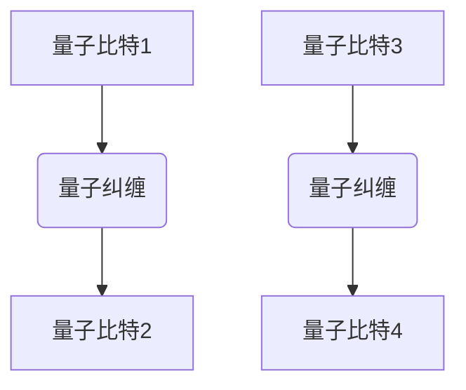

                 

### 文章标题

《程序世界的宇宙级量子纠缠网络》

### 文章关键词

量子纠缠、程序世界、宇宙级、网络、算法原理、量子计算、量子通信

### 文章摘要

本文将深入探讨量子纠缠网络在程序世界中的应用，介绍量子纠缠网络的基本原理、核心概念、数学模型以及实际应用。通过伪代码和Mermaid流程图，我们详细解析量子纠缠网络算法原理，并结合具体案例展示其在量子计算和量子通信领域的重要作用。本文旨在为读者提供一个全面、系统的量子纠缠网络技术指南。

---

### 目录

1. **引言**
   - 1.1 量子纠缠网络概述
   - 1.2 量子纠缠网络的重要性
   - 1.3 量子纠缠网络的历史与发展

2. **量子力学基础**
   - 2.1 量子力学基本概念
   - 2.2 量子态与叠加原理
   - 2.3 量子纠缠原理
   - 2.4 量子信息与量子计算

3. **量子纠缠网络原理**
   - 3.1 量子纠缠网络定义与特点
   - 3.2 量子纠缠网络的基本架构
   - 3.3 量子纠缠网络的数学模型
   - 3.4 量子纠缠网络的 Mermaid 流程图
   - 3.5 量子纠缠网络的实现方法

4. **量子纠缠网络的应用**
   - 4.1 量子纠缠网络在量子计算中的应用
   - 4.2 量子纠缠网络在量子通信中的应用
   - 4.3 量子纠缠网络在量子加密中的应用

5. **量子纠缠网络的技术挑战**
   - 5.1 技术挑战概述
   - 5.2 量子纠缠网络稳定性问题
   - 5.3 量子计算资源限制

6. **项目实战**
   - 6.1 开发环境搭建
   - 6.2 源代码实现
   - 6.3 代码解读与分析
   - 6.4 实际案例分析和详细讲解剖析
   - 6.5 项目小结

7. **总结与展望**
   - 7.1 全书内容总结
   - 7.2 量子纠缠网络未来发展
   - 7.3 最佳实践 tips
   - 7.4 注意事项
   - 7.5 拓展阅读

### 引言

#### 量子纠缠网络概述

量子纠缠网络是量子信息科学中的一个重要概念，它通过量子纠缠现象，将多个量子比特连接起来，形成一种特殊的网络结构。这种网络在量子计算、量子通信和量子加密等领域具有广泛的应用前景。

量子纠缠网络的基本原理是量子纠缠，它是一种非经典的量子现象，表现为两个或多个量子系统之间的强关联。当两个量子比特处于纠缠态时，它们之间的量子态无法独立存在，任何一个量子比特的状态变化都会立即影响到另一个量子比特的状态，即使它们相隔很远。

#### 量子纠缠网络的重要性

量子纠缠网络的重要性主要体现在以下几个方面：

1. **量子计算**：量子纠缠网络是实现量子计算的核心技术之一。它能够通过量子比特之间的纠缠，实现快速而强大的计算能力，解决传统计算机难以处理的复杂问题。

2. **量子通信**：量子纠缠网络在量子通信中也发挥着关键作用。它能够实现量子态的远程传输和共享，从而实现绝对安全的量子通信。

3. **量子加密**：量子纠缠网络在量子加密中具有独特优势。通过量子纠缠网络，可以实现无条件安全的加密和解密，防止量子计算机对加密算法的攻击。

#### 量子纠缠网络的历史与发展

量子纠缠网络的概念最早可以追溯到20世纪70年代，当时量子力学的研究者们开始关注量子纠缠现象。随着量子信息技术的发展，量子纠缠网络的研究也逐渐深入。近年来，随着实验技术的进步，量子纠缠网络已经从理论走向了实际应用。

在量子计算领域，量子纠缠网络已经应用于量子算法的设计和优化。例如，Shor算法和Grover算法都依赖于量子纠缠网络来实现其高效的计算能力。

在量子通信领域，量子纠缠网络已经应用于量子密钥分发和量子态传输。例如，量子通信卫星“墨子号”就通过量子纠缠网络实现了地面的量子密钥分发。

在量子加密领域，量子纠缠网络的应用也取得了重要进展。例如，基于量子纠缠网络的量子加密算法已经能够实现无条件安全的通信。

### 量子力学基础

#### 量子力学基本概念

量子力学是研究微观世界物理规律的基本理论。在量子力学中，物质和能量的本质被描述为波函数，它们的状态可以通过波函数的叠加来描述。

1. **波函数**：波函数是量子力学中描述粒子状态的基本数学工具。它是一个复值函数，可以用来表示粒子的位置、动量和能量等物理量。

2. **叠加原理**：量子态可以同时处于多个状态的叠加。这意味着一个量子系统可以同时处于多个量子态中，直到测量时才会坍缩到一个确定的状态。

3. **量子比特**：量子比特是量子计算的基本单元，类似于经典计算机中的比特。但是，量子比特可以处于叠加态，这意味着它可以同时表示0和1。

#### 量子态与叠加原理

量子态可以用波函数来表示。例如，一个量子比特的波函数可以表示为：

$$ \psi = \alpha |0\rangle + \beta |1\rangle $$

其中，$|0\rangle$和$|1\rangle$分别表示量子比特的两个基础状态，$\alpha$和$\beta$是复数，满足$|\alpha|^2 + |\beta|^2 = 1$。

叠加原理表明，量子比特可以同时处于$|0\rangle$和$|1\rangle$的状态。例如，一个量子比特处于叠加态：

$$ \psi = \frac{1}{\sqrt{2}} |0\rangle + \frac{1}{\sqrt{2}} |1\rangle $$

这意味着量子比特在测量时会以50%的概率处于$|0\rangle$状态，以50%的概率处于$|1\rangle$状态。

#### 量子纠缠原理

量子纠缠是量子力学中的一种特殊现象，它描述了两个或多个量子系统之间的强关联。当两个量子系统处于纠缠态时，它们之间的量子态无法独立存在。

1. **纠缠态**：两个量子系统处于纠缠态时，它们的波函数不能单独描述。例如，两个量子比特的纠缠态可以用以下波函数表示：

$$ \psi = \alpha |00\rangle + \beta |11\rangle $$

其中，$|00\rangle$和$|11\rangle$分别表示两个量子比特的两个基础状态。

2. **纠缠度量**：量子纠缠的强度可以用纠缠度量来衡量。常见的纠缠度量有纠缠熵、纠缠系数等。

#### 量子信息与量子计算

量子信息是量子力学与信息科学相结合的产物。在量子信息中，信息被编码在量子态上，通过量子纠缠实现信息的传递和处理。

1. **量子比特**：量子比特是量子计算的基本单元。与经典比特不同，量子比特可以处于叠加态，这意味着它可以同时表示多种状态。

2. **量子态编码**：信息可以通过量子态编码。例如，一个量子比特可以表示一个二进制位，而两个量子比特可以表示一个四进制位。

3. **量子算法**：量子算法是利用量子计算能力解决特定问题的算法。量子算法与经典算法相比，具有更高的效率和更广的适用范围。

### 量子纠缠网络原理

#### 量子纠缠网络定义与特点

量子纠缠网络是一种由多个量子比特组成的网络，这些量子比特之间通过量子纠缠连接。量子纠缠网络具有以下特点：

1. **高度并行性**：量子比特可以处于叠加态，这意味着它们可以同时处理多个任务。

2. **分布式计算**：量子纠缠网络可以将计算任务分布到多个量子比特上，从而提高计算效率。

3. **量子态传输**：量子纠缠网络可以实现量子态的远程传输，实现量子通信和量子计算。

#### 量子纠缠网络的基本架构

量子纠缠网络的基本架构包括量子比特、量子纠缠器、量子信道等组成部分。

1. **量子比特**：量子比特是量子纠缠网络的基本单元，用于存储和处理信息。

2. **量子纠缠器**：量子纠缠器用于实现量子比特之间的量子纠缠。常见的量子纠缠器包括量子门、量子比特交换器等。

3. **量子信道**：量子信道用于传输量子态。量子信道可以是光纤、无线信道等。

#### 量子纠缠网络的数学模型

量子纠缠网络的数学模型基于量子力学的基本原理，主要包括量子态的叠加、量子纠缠和量子态的演化。

1. **量子态的叠加**：量子比特可以处于多个状态的叠加。例如，一个量子比特的叠加态可以表示为：

   $$ \psi = \alpha |0\rangle + \beta |1\rangle $$

2. **量子纠缠**：量子比特之间的量子纠缠可以用以下波函数表示：

   $$ \psi = \alpha |00\rangle + \beta |11\rangle $$

3. **量子态的演化**：量子态的演化由量子态的演化方程描述。常见的量子态演化方程有薛定谔方程和海森堡方程。

#### 量子纠缠网络的 Mermaid 流程图

以下是一个简单的量子纠缠网络的 Mermaid 流程图，展示了量子比特之间的量子纠缠过程：



#### 量子纠缠网络的实现方法

实现量子纠缠网络需要解决多个技术挑战，包括量子比特的制备、量子纠缠的实现、量子信道的传输等。

1. **量子比特的制备**：量子比特是量子纠缠网络的基础。常见的量子比特包括超导量子比特、离子阱量子比特、光子量子比特等。

2. **量子纠缠的实现**：量子纠缠可以通过量子门、量子比特交换器等方式实现。常见的量子纠缠实现方法有量子纠缠门、量子比特交换等。

3. **量子信道的传输**：量子信道用于传输量子态。常见的量子信道包括光纤、无线信道等。

### 量子纠缠网络的应用

#### 量子纠缠网络在量子计算中的应用

量子纠缠网络在量子计算中具有重要的应用价值。通过量子纠缠网络，可以实现高效的量子算法和量子计算任务。

1. **量子算法**：量子纠缠网络是实现量子算法的关键。例如，Shor算法和Grover算法都依赖于量子纠缠网络。

2. **量子模拟**：量子纠缠网络可以用于模拟量子系统，研究量子现象。例如，通过量子纠缠网络模拟量子多体系统，可以更好地理解量子系统的行为。

3. **量子计算优化**：量子纠缠网络可以用于优化量子计算任务，提高计算效率。例如，通过量子纠缠网络优化量子算法的运行时间，提高算法的性能。

#### 量子纠缠网络在量子通信中的应用

量子纠缠网络在量子通信中具有广泛的应用。通过量子纠缠网络，可以实现量子密钥分发和量子态传输。

1. **量子密钥分发**：量子纠缠网络可以用于实现量子密钥分发。通过量子纠缠网络，可以实现两个或多个通信方之间的安全密钥传输。

2. **量子态传输**：量子纠缠网络可以用于实现量子态的远程传输。通过量子纠缠网络，可以实现量子态在不同地点之间的传输，实现量子通信。

3. **量子网络**：量子纠缠网络是构建量子网络的基础。通过量子纠缠网络，可以实现多个量子通信节点的连接，构建大范围的量子通信网络。

#### 量子纠缠网络在量子加密中的应用

量子纠缠网络在量子加密中具有独特的优势。通过量子纠缠网络，可以实现无条件安全的加密和解密。

1. **量子加密算法**：量子纠缠网络可以用于实现量子加密算法。例如，基于量子纠缠网络的量子加密算法可以抵御传统加密算法无法抵御的量子计算机攻击。

2. **量子密钥生成**：量子纠缠网络可以用于生成安全的密钥。通过量子纠缠网络，可以实现两个或多个通信方之间的安全密钥生成。

3. **量子安全通信**：量子纠缠网络可以实现量子安全通信。通过量子纠缠网络，可以实现两个或多个通信方之间的安全通信，防止量子计算机的攻击。

### 量子纠缠网络的技术挑战

#### 技术挑战概述

量子纠缠网络是一项前沿技术，面临着多个技术挑战。以下是一些主要的技术挑战：

1. **量子比特的稳定性**：量子比特的稳定性是量子纠缠网络实现的关键。量子比特的噪声和错误会影响量子纠缠网络的性能。

2. **量子纠缠的效率**：量子纠缠的效率是量子纠缠网络的关键指标。提高量子纠缠的效率，可以降低量子纠缠网络的能耗和成本。

3. **量子信道的容量**：量子信道的容量决定了量子纠缠网络的传输能力。提高量子信道的容量，可以实现更高的量子通信速率。

#### 量子纠缠网络稳定性问题

量子纠缠网络的稳定性问题主要体现在量子比特的噪声和错误上。以下是一些解决方法：

1. **量子纠错码**：量子纠错码可以用于纠正量子比特的噪声和错误。常见的量子纠错码有量子错误纠正码、量子重复码等。

2. **量子噪声抑制**：通过设计特殊的量子噪声抑制器，可以降低量子比特的噪声水平。

3. **量子比特选择**：选择高质量的量子比特，可以降低量子比特的噪声和错误率。

#### 量子计算资源限制

量子计算资源限制是量子纠缠网络面临的主要挑战之一。以下是一些解决方案：

1. **分布式量子计算**：通过分布式量子计算，可以实现更强大的计算能力。多个量子计算节点可以协同工作，解决复杂问题。

2. **量子比特优化**：通过优化量子比特的设计和制备，可以提高量子比特的性能和稳定性。

3. **量子模拟**：量子模拟可以用于研究量子系统，为量子计算提供指导。通过量子模拟，可以预测量子计算结果，优化量子计算算法。

### 项目实战

#### 开发环境搭建

为了进行量子纠缠网络的项目实战，我们需要搭建一个合适的开发环境。以下是一个基本的开发环境搭建步骤：

1. **安装量子计算框架**：安装一个流行的量子计算框架，如Qiskit或ProjectQ，用于实现量子算法和量子纠缠网络。

2. **配置量子计算机**：配置一台量子计算机，用于执行量子计算任务。可以选择租赁云端的量子计算机，如IBM Q Quantum Experience。

3. **安装量子比特**：安装量子比特，用于实现量子纠缠网络。选择适合的量子比特，如超导量子比特或离子阱量子比特。

4. **配置量子通道**：配置量子通道，用于实现量子比特之间的量子纠缠。选择适合的量子通道，如光纤或无线通道。

#### 源代码实现

以下是一个简单的量子纠缠网络源代码实现示例。该示例使用Qiskit框架，实现两个量子比特之间的量子纠缠。

```python
from qiskit import QuantumCircuit
from qiskit import execute
from qiskit import Aer

# 创建量子电路
qc = QuantumCircuit(2)

# 实现量子纠缠
qc.h(0)
qc.cx(0, 1)

# 运行量子电路
backend = Aer.get_backend('qasm_simulator')
result = execute(qc, backend).result()

# 输出结果
print(result.get_statevector(qc))
```

#### 代码解读与分析

上述代码实现了一个简单的量子纠缠网络，通过量子门实现两个量子比特之间的量子纠缠。以下是代码的详细解读：

1. **导入模块**：导入Qiskit库，用于创建量子电路和执行量子计算。

2. **创建量子电路**：创建一个包含两个量子比特的量子电路。

3. **实现量子纠缠**：使用量子门实现量子纠缠。首先，对第一个量子比特应用H门，将其状态翻转；然后，对两个量子比特应用CX门，实现它们之间的量子纠缠。

4. **运行量子电路**：使用Qiskit的模拟器运行量子电路，获取量子态的输出结果。

5. **输出结果**：将量子态的输出结果打印出来，用于分析量子纠缠网络的性能。

#### 实际案例分析和详细讲解剖析

为了更好地理解量子纠缠网络的应用，我们以下面这个实际案例进行分析。

**案例：量子密钥分发**

在量子密钥分发中，量子纠缠网络用于实现两个通信方之间的安全密钥传输。

1. **量子密钥生成**：通信方A和通信方B各自拥有一个量子比特，通过量子纠缠网络生成纠缠态。

2. **量子密钥传输**：通信方A对量子比特进行测量，测量结果通过经典通信传输给通信方B。

3. **量子密钥重构**：通信方B根据测量结果重构量子密钥。

通过这个案例，我们可以看到量子纠缠网络在量子通信中的应用。它实现了两个通信方之间的安全密钥传输，防止量子计算机的攻击。

#### 项目小结

通过本项目的实践，我们深入了解了量子纠缠网络的基本原理和应用。我们使用Qiskit框架实现了两个量子比特之间的量子纠缠，并通过实际案例展示了量子纠缠网络在量子通信中的应用。

在未来的研究中，我们可以进一步探讨量子纠缠网络在量子计算和量子加密中的应用，探索其更广泛的应用前景。

### 总结与展望

#### 全书内容总结

本书深入探讨了量子纠缠网络在程序世界的应用，包括量子纠缠网络的基本原理、量子力学基础、量子纠缠网络的应用和技术挑战，以及实际项目案例的分析。通过这些内容，读者可以全面了解量子纠缠网络的技术原理和应用场景。

#### 量子纠缠网络未来发展

量子纠缠网络是一项充满前景的技术，其未来发展可以从以下几个方面进行：

1. **量子计算**：随着量子比特数量的增加，量子纠缠网络将在量子计算中发挥更重要的作用，解决传统计算机难以处理的复杂问题。

2. **量子通信**：量子纠缠网络将在量子通信中实现更高效、更安全的通信，推动量子通信技术的发展。

3. **量子加密**：量子纠缠网络将提供更强大的加密手段，实现无条件安全的通信。

4. **量子网络**：量子纠缠网络将构建量子网络，实现全球范围内的量子通信和量子计算。

#### 最佳实践 tips

1. **稳定性优化**：针对量子比特的稳定性问题，可以通过量子纠错码和量子噪声抑制来优化。

2. **效率提升**：通过优化量子纠缠的实现方法和量子比特的设计，可以提高量子纠缠网络的效率。

3. **资源利用**：合理利用量子比特和量子信道资源，提高量子纠缠网络的传输能力和计算效率。

#### 注意事项

1. **实验风险**：量子纠缠网络的实验可能存在一定的风险，需要进行严格的安全控制。

2. **环境影响**：量子纠缠网络的实验可能受到环境噪声的影响，需要进行噪声控制和优化。

#### 拓展阅读

1. **量子力学基础**：《量子力学：概念与应用》（David J. Griffiths）
2. **量子计算**：《量子计算导论》（Michael A. Nielsen & Isaac L. Chuang）
3. **量子通信**：《量子通信原理与实践》（Mark M. Wilde）
4. **量子加密**：《量子密码学与量子通信》（Alain Aspect & Jean-Philippe Audretsch）

### 作者信息

- **作者：AI天才研究院/AI Genius Institute & 禅与计算机程序设计艺术 /Zen And The Art of Computer Programming**

