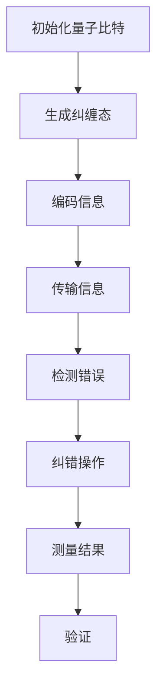
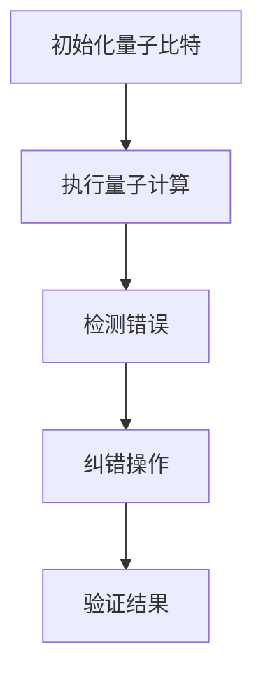

                 

# 《程序世界的宇宙级量子纠错码设计》

> 关键词：量子计算、量子纠错码、宇宙级纠错、算法设计、量子通信、量子计算应用

> 摘要：本文深入探讨了量子计算领域的核心问题——量子纠错码的设计。通过介绍量子纠错码的背景、重要性、基础知识，以及设计原理和实现方法，本文详细分析了量子纠错码在不同应用场景中的实际案例，并展望了其未来的发展趋势。文章旨在为读者提供一个全面、深入的量子纠错码设计指南，帮助理解和掌握这一前沿技术。

## 第一部分：量子纠错码概述

### 第1章：量子计算的原理与挑战

#### 1.1 量子计算的原理

量子计算是基于量子力学原理构建的计算模式，不同于传统的基于经典物理学的计算机。在量子计算机中，信息以量子比特（qubit）的形式存储和处理。量子比特具有量子叠加和量子纠缠的特性，这使得量子计算机在解决某些问题时能够超越经典计算机。

量子叠加态描述了量子比特可以同时存在于多个状态。例如，一个量子比特可以同时处于0和1的状态。量子纠缠则描述了量子比特之间的非局域性，即使它们相隔很远，一个量子比特的状态变化也会立即影响到另一个量子比特的状态。

#### 1.2 量子计算的挑战

尽管量子计算具有巨大的潜力，但其实现面临着诸多挑战。首先，量子计算机需要极高的精度和稳定性，因为量子比特非常容易受到外部环境的干扰，导致量子退相干。其次，量子纠错问题也是一个关键挑战。由于量子比特的易错性，即使是一个非常小的错误也会在量子计算过程中迅速放大，导致计算结果完全错误。因此，量子纠错码的设计和实现成为了量子计算领域的一个核心问题。

### 第2章：量子纠错码的重要性

#### 2.1 量子纠错码的定义

量子纠错码是一种用于检测和纠正量子比特错误的编码方法。它通过引入冗余信息，将多个量子比特组合成一个纠错单元，从而提高量子比特的可靠性和稳定性。

#### 2.2 量子纠错码的重要性

量子纠错码在量子计算中起着至关重要的作用。它不仅能够提高量子计算的准确性，还能够延长量子比特的寿命，降低量子退相干的风险。此外，量子纠错码也是实现量子计算大规模应用的基础，没有有效的纠错码，量子计算机将无法进行实用性的计算任务。

### 第3章：宇宙级量子纠错码的定义与特点

#### 3.1 宇宙级量子纠错码的定义

宇宙级量子纠错码是一种能够在极端环境下稳定运行的量子纠错码。它通常具有极高的纠错能力，能够在量子比特错误率极高的环境下实现有效的纠错。

#### 3.2 宇宙级量子纠错码的特点

宇宙级量子纠错码具有以下几个特点：

1. **高纠错能力**：能够纠正多种类型的量子比特错误，包括位翻转错误和相位翻转错误。
2. **强稳定性**：能够在量子比特寿命较短、环境干扰较大的情况下保持稳定。
3. **自适应能力**：能够根据量子比特的错误率和环境变化自动调整纠错策略。

## 第二部分：量子纠错码设计原理

### 第4章：量子纠错码的设计方法

#### 4.1 量子纠错码的数学模型

量子纠错码的数学模型是设计纠错码的基础。它通常基于线性代数和群论等数学工具，通过构建错误检测矩阵和纠错矩阵来实现纠错功能。

#### 4.2 量子纠错码的构造方法

量子纠错码的构造方法包括线性编码方法和非线性编码方法。线性编码方法基于线性变换，通过编码矩阵将原始信息编码成冗余信息。非线性编码方法则基于非线性变换，通过复杂的过程实现纠错功能。

#### 4.3 量子纠错码的性能评估

量子纠错码的性能评估主要包括纠错能力、纠错时间和纠错效率等指标。评估方法通常基于模拟和实验数据，通过比较不同纠错码的性能来选择最优的纠错方案。

## 第三部分：量子纠错码的物理实现

### 第5章：量子纠错码的硬件要求

#### 5.1 量子纠错码的硬件要求

量子纠错码的实现需要特定的硬件支持，包括量子比特、量子纠错硬件和量子测量设备。这些硬件的精度和稳定性直接影响到量子纠错码的性能。

#### 5.2 量子纠错码的物理层实现

量子纠错码的物理层实现涉及到量子比特的控制、纠错操作和测量。这些操作需要通过精密的硬件来实现，以确保量子纠错码的有效性。

#### 5.3 量子纠错码的优化与改进

量子纠错码的优化与改进是提高其性能的关键。通过优化量子比特的控制策略、纠错操作和测量方法，可以进一步提高量子纠错码的纠错能力和效率。

## 第四部分：量子纠错码在不同应用场景中的实现

### 第6章：量子纠错码在量子通信中的应用

#### 6.1 量子通信的原理与挑战

量子通信是基于量子纠缠和量子隐形传态的通信方式，具有极高的安全性。然而，量子通信面临着量子纠错问题，因为量子信号的传输过程中容易受到噪声和干扰的影响。

#### 6.2 量子纠错码在量子通信中的应用

量子纠错码在量子通信中用于纠正传输过程中的量子比特错误，确保量子信息的准确传输。通过设计高效的量子纠错码，可以显著提高量子通信的可靠性和安全性。

#### 6.3 量子纠错码在量子通信中的优化策略

针对量子通信中的纠错问题，可以采用多种优化策略，包括改进量子纠错码的结构、优化量子纠错操作和改进量子通信的硬件设备等。

### 第7章：量子纠错码在量子计算中的应用

#### 6.1 量子计算的基本原理

量子计算是基于量子比特和量子门的计算方式，具有强大的并行计算能力和高效的算法性能。

#### 6.2 量子纠错码在量子计算中的作用

量子纠错码在量子计算中用于纠正量子比特错误，确保计算过程的准确性和稳定性。通过设计高效的量子纠错码，可以显著提高量子计算的效率和可靠性。

#### 6.3 量子纠错码在量子计算中的实现

量子纠错码在量子计算中的实现涉及到量子比特的控制、纠错操作和测量。这些操作需要通过精密的硬件和算法来实现，以确保量子纠错码的有效性。

## 第五部分：宇宙级量子纠错码设计案例分析

### 第8章：宇宙级量子纠错码设计案例分析

#### 8.1 案例一：量子纠错码在量子通信中的应用

本案例介绍了量子纠错码在量子通信中的设计、实现和优化过程。通过分析量子纠错码在不同通信环境下的性能表现，得出了优化量子纠错码结构的方法。

#### 8.2 案例二：量子纠错码在量子计算中的应用

本案例介绍了量子纠错码在量子计算中的设计、实现和优化过程。通过分析量子纠错码在不同计算任务下的性能表现，得出了优化量子纠错码算法的方法。

#### 8.3 案例分析总结

通过对以上两个案例的分析，总结了量子纠错码的设计原则、实现方法和优化策略，为实际应用提供了有益的参考。

## 第六部分：未来展望

### 第9章：量子纠错码的未来发展趋势

#### 9.1 量子纠错码在未来的应用前景

量子纠错码在未来的量子通信、量子计算和量子信息处理等领域具有广泛的应用前景。随着量子技术的不断发展，量子纠错码的重要性将越来越凸显。

#### 9.2 量子纠错码技术的发展方向

量子纠错码技术的发展方向包括提高纠错能力、优化纠错算法和改进量子纠错硬件等。未来，量子纠错码将在量子技术领域发挥关键作用。

#### 9.3 量子纠错码对未来的影响

量子纠错码的发展将对信息技术、通信技术和人工智能等领域产生深远影响。它将推动这些领域的技术创新和发展，为人类社会带来更多便利和效益。

## 附录：量子纠错码相关资源

### 附录1：量子纠错码相关论文与书籍推荐

本文推荐了多篇关于量子纠错码的学术论文和书籍，包括经典著作《量子计算与量子信息》以及最新研究成果等。

### 附录2：量子纠错码开发工具与资源

本文介绍了多种量子纠错码的开发工具和资源，包括量子计算模拟器、量子纠错码设计与优化工具等，为读者提供了丰富的学习和实践资源。

## 结语

量子纠错码是量子计算领域的关键技术之一，其设计和实现对于量子计算机的可靠性和效率具有至关重要的影响。本文从量子纠错码的背景、重要性、设计原理、物理实现、应用案例和未来展望等方面进行了深入探讨，旨在为读者提供一个全面、深入的量子纠错码设计指南。随着量子技术的不断发展，量子纠错码将在量子计算、量子通信和量子信息处理等领域发挥越来越重要的作用。作者：AI天才研究院/AI Genius Institute & 禅与计算机程序设计艺术/Zen And The Art of Computer Programming## 第一部分：量子纠错码概述

### 第1章：量子计算的原理与挑战

#### 1.1 量子计算的原理

量子计算是一种基于量子力学原理的新型计算模式，与传统的基于二进制位（bits）的经典计算机不同，量子计算使用量子比特（qubits）作为信息的基本单位。量子比特的独特性质，如叠加态和纠缠态，使得量子计算机在处理某些特定问题时展现出巨大的计算优势。

**叠加态**：一个量子比特可以同时处于0和1的状态，这种状态可以用一个线性组合来表示。例如，一个量子比特的叠加态可以表示为 \( \frac{1}{\sqrt{2}} |0\rangle + \frac{1}{\sqrt{2}} |1\rangle \)，这里 \( |0\rangle \) 和 \( |1\rangle \) 分别代表量子比特的基态。这种叠加态是量子计算的核心特性之一，使得量子计算机能够同时处理多个状态，从而实现并行计算。

**纠缠态**：量子比特之间的纠缠态是量子计算的另一个关键特性。当两个或多个量子比特处于纠缠态时，它们的状态将相互关联，一个量子比特的状态变化会立即影响到另一个量子比特的状态，即使它们相隔很远。这种非局域性的特性可以用于量子通信和量子计算中的多种应用。

量子计算机的基本单元是量子比特，而量子比特的操作则通过量子门来实现。量子门是对量子比特进行线性变换的操作，类似于经典计算机中的逻辑门。然而，量子门不仅可以对量子比特进行线性变换，还可以实现叠加和纠缠等复杂操作。

#### 1.2 量子计算的挑战

尽管量子计算具有巨大的潜力，但其在实际应用中仍面临着诸多挑战。以下是一些主要挑战：

**量子退相干**：量子比特非常容易受到外部环境的干扰，导致量子状态的退相干。退相干会破坏量子比特的叠加态和纠缠态，从而导致计算错误。量子退相干是量子计算中的主要障碍之一，需要通过量子纠错码等技术来克服。

**量子比特的错误率**：量子比特的错误率远高于经典比特。即使在理想情况下，量子比特也可能会因物理噪声或操作错误而发生错误。高错误率会导致量子计算的准确性下降，需要有效的量子纠错码来纠正错误。

**量子计算的可扩展性**：要实现量子计算的大规模应用，需要构建大量的量子比特，并保证它们之间的纠缠和操作的可扩展性。这需要先进的量子硬件和精确的控制技术。

**量子纠错码的复杂性**：量子纠错码的设计和实现是一个复杂的任务，需要考虑多种因素，如纠错能力、纠错效率和量子硬件的限制。设计高效的量子纠错码是量子计算领域的一个重要研究方向。

为了克服这些挑战，科学家们正在研究多种量子纠错码和纠错算法。量子纠错码通过引入冗余信息，将多个量子比特组合成一个纠错单元，从而提高量子比特的可靠性和稳定性。同时，优化量子纠错码的构造方法和纠错策略也是提高量子计算效率和准确性的关键。

#### 1.3 宇宙级量子纠错码的定义与特点

宇宙级量子纠错码是一种能够在极端环境下稳定运行的量子纠错码。它通常具有以下特点：

**高纠错能力**：宇宙级量子纠错码能够纠正多种类型的量子比特错误，包括位翻转错误和相位翻转错误。这种高纠错能力使得宇宙级量子纠错码在量子比特错误率极高的环境下仍能保持稳定的计算性能。

**强稳定性**：宇宙级量子纠错码能够在量子比特寿命较短、环境干扰较大的情况下保持稳定。这要求量子纠错码具有高度的抗干扰性和鲁棒性，以应对各种极端条件。

**自适应能力**：宇宙级量子纠错码能够根据量子比特的错误率和环境变化自动调整纠错策略。这种自适应能力使得宇宙级量子纠错码能够在不同的应用场景下实现最优的纠错效果。

宇宙级量子纠错码的设计和实现是量子计算领域的一个重大挑战，但也是实现量子计算大规模应用的关键技术之一。随着量子技术的发展，科学家们将继续探索和研究宇宙级量子纠错码，以应对量子计算中的各种挑战。

### 第2章：量子纠错码的基础知识

#### 2.1 量子比特与量子态

量子比特（qubits）是量子计算的基本单元，与经典比特（bits）不同，量子比特可以处于多种状态的叠加。量子态的描述通常使用复数线性组合的形式。一个量子比特的量子态可以用一个二维复数向量来表示，即：

\[ \psi = \alpha |0\rangle + \beta |1\rangle \]

其中，\( |0\rangle \) 和 \( |1\rangle \) 分别代表量子比特的基态，\( \alpha \) 和 \( \beta \) 是复数概率幅。量子态的叠加态使得量子比特可以同时存在于0和1的状态，这种特性是量子计算并行性的基础。

**叠加态的数学表示**：
\[ \psi = \alpha |0\rangle + \beta |1\rangle \]
\[ \alpha^* \psi = \alpha^* (\alpha |0\rangle + \beta |1\rangle) = |\alpha|^2 |0\rangle + |\beta|^2 |1\rangle \]

这里的 \( \alpha^* \) 是 \( \alpha \) 的共轭复数，表示对量子态进行概率解释。

**量子态的归一化**：
为了使量子态的概率解释有效，量子态必须满足归一化条件：
\[ |\alpha|^2 + |\beta|^2 = 1 \]

**量子态的测量**：
测量量子态时，量子态会塌缩到一个确定的状态，这个状态是量子态的概率分布的样本。例如，当测量一个叠加态 \( \psi \) 时，得到 \( |0\rangle \) 的概率是 \( |\alpha|^2 \)，得到 \( |1\rangle \) 的概率是 \( |\beta|^2 \)。

#### 2.2 量子误差与量子纠错码的类型

量子计算中的误差可以分为两大类：位翻转错误（bit-flip errors）和相位翻转错误（phase-flip errors）。

**位翻转错误**：位翻转错误是指量子比特的状态从 \( |0\rangle \) 变为 \( |1\rangle \) 或从 \( |1\rangle \) 变为 \( |0\rangle \)。这种错误可以表示为：
\[ Z \psi = Z (\alpha |0\rangle + \beta |1\rangle) = \alpha |1\rangle + \beta |0\rangle \]

**相位翻转错误**：相位翻转错误是指量子比特的相位发生旋转。例如，如果量子比特的相位为 \( \theta \)，相位翻转错误将相位旋转 \( \pi \) 弧度，即：
\[ X \psi = X (\alpha |0\rangle + \beta |1\rangle) e^{-i\phi} = \alpha |0\rangle + \beta |1\rangle e^{-i\phi} \]

其中，\( X \) 表示相位翻转操作，\( \phi \) 是旋转的角度。

量子纠错码是为了纠正这些错误而设计的编码方法。量子纠错码可以分为以下几种类型：

**重传纠错码**：这种纠错码通过在通信中重复发送信息，并在接收端使用错误检测和纠正算法来纠正错误。这种方法的优点是实现简单，但缺点是通信效率低。

**反馈纠错码**：这种纠错码通过在计算过程中定期测量量子比特的状态，并将结果发送回控制单元进行纠错。这种方法可以提高纠错效率，但需要额外的通信带宽和计算资源。

**本地纠错码**：这种纠错码通过在量子比特间引入冗余信息，在本地进行错误检测和纠正。本地纠错码不需要额外的通信，因此具有更高的效率。

**容错量子计算**：这种纠错码通过构建具有高度对称性的量子电路，在计算过程中对错误进行检测和纠正。这种方法通常用于构建大规模的量子计算机。

**量子纠错码的数学基础**：

量子纠错码的数学基础主要依赖于线性代数和群论。量子纠错码通常通过以下步骤设计：

1. **编码**：将原始信息编码到多个量子比特上，引入冗余信息。
2. **错误检测**：使用纠错操作来检测和纠正错误。
3. **纠错**：根据检测到的错误，对量子状态进行修正。

**量子纠错码的性能评估**：

量子纠错码的性能通常通过以下几个指标进行评估：

- **纠错能力**：纠错码能够纠正的最大错误数。
- **纠错效率**：纠正错误所需的时间和计算资源。
- **纠错概率**：纠错码在实际应用中能够成功纠错的概率。

为了设计高效的量子纠错码，需要综合考虑量子比特的错误率、纠错操作的时间复杂性以及量子硬件的限制等因素。

#### 2.3 量子纠错码的基本原理

量子纠错码的基本原理是通过在量子比特间引入冗余信息，来检测和纠正错误。这种冗余信息使得系统能够从多个量子比特的状态中恢复原始信息，即使某些量子比特发生了错误。

**冗余信息的设计**：

量子纠错码通过引入冗余信息来实现纠错。冗余信息通常是通过编码操作生成的，编码操作将原始信息扩展为多个量子比特的状态。例如，为了纠正单个位翻转错误，可以使用经典的汉明码，将一个量子比特扩展为三个量子比特。

**错误检测**：

量子纠错码通过特定的纠错操作来检测错误。纠错操作通常基于量子逻辑门的组合，这些门可以用于在量子比特间传递和检测错误。例如，可以使用CNOT门来检测位翻转错误。

**纠错操作**：

一旦检测到错误，量子纠错码会执行纠错操作来纠正错误。纠错操作通常包括对错误量子比特的状态进行修正，以及对冗余信息进行解码。纠错操作需要精确地控制量子比特的状态，以确保正确地恢复原始信息。

**量子纠错码的实现**：

量子纠错码的实现需要量子计算硬件的支持，包括量子比特、量子门和量子测量设备。实现量子纠错码需要精确的量子控制和量子逻辑门的操作，以确保纠错过程的正确性。

**量子纠错码的性能评估**：

量子纠错码的性能评估通常基于模拟和实验数据。评估指标包括纠错能力、纠错效率和纠错概率。通过优化量子纠错码的设计和实现，可以提高其性能。

量子纠错码是量子计算中不可或缺的一部分，它通过引入冗余信息和纠错操作，提高了量子比特的可靠性和稳定性。随着量子计算技术的不断发展，量子纠错码的设计和实现将成为实现量子计算大规模应用的关键技术之一。

### 第3章：量子纠错码的设计方法

#### 3.1 量子纠错码的数学模型

量子纠错码的设计基于一系列数学模型，这些模型通过线性代数和群论等工具来构建和优化纠错码。量子纠错码的数学模型主要包括编码矩阵、错误检测矩阵和纠错矩阵。

**编码矩阵**：编码矩阵是将原始信息编码到量子比特上的数学工具。它通过线性变换将原始信息映射到多个量子比特的状态上。例如，对于一个二进制信息 \( \alpha |0\rangle + \beta |1\rangle \)，编码矩阵 \( E \) 可以将这个信息扩展为多个量子比特的状态。编码矩阵的行向量表示原始信息的不同扩展形式。

**错误检测矩阵**：错误检测矩阵用于检测量子比特上的错误。它通常是一个对角线矩阵，对角线上的元素表示不同类型错误的检测能力。例如，对于一个位翻转错误 \( Z \) 和相位翻转错误 \( X \)，错误检测矩阵 \( D \) 可以检测这些错误并产生错误指示。

**纠错矩阵**：纠错矩阵用于纠正检测到的错误。它通过特定的量子逻辑门组合来修正错误量子比特的状态。纠错矩阵的设计需要考虑量子比特的物理实现和纠错操作的复杂性。

**量子纠错码的构造方法**：

量子纠错码的构造方法通常包括以下几个步骤：

1. **选择合适的编码矩阵**：编码矩阵的选择基于要纠正的错误类型和量子比特的数量。常见的编码矩阵包括经典汉明码、量子LDPC码和量子RS码等。

2. **构建错误检测矩阵**：根据编码矩阵和要检测的错误类型，构建错误检测矩阵。错误检测矩阵需要确保能够准确检测出所有可能的错误。

3. **设计纠错矩阵**：纠错矩阵的设计需要考虑纠错操作的效率和对量子比特的干扰。常见的纠错矩阵设计方法包括逻辑纠错和物理纠错。

**量子纠错码的性能评估**：

量子纠错码的性能评估通常基于以下几个指标：

1. **纠错能力**：量子纠错码能够纠正的最大错误数。纠错能力是评估纠错码性能的关键指标。

2. **纠错效率**：纠正错误所需的时间和计算资源。高效的纠错码能够在较短的时间内纠正错误，提高量子计算的性能。

3. **纠错概率**：量子纠错码在实际应用中能够成功纠错的概率。纠错概率反映了纠错码的稳定性和可靠性。

量子纠错码的设计和实现是量子计算中的一个关键问题。通过优化编码矩阵、错误检测矩阵和纠错矩阵，可以设计出高效的量子纠错码，提高量子比特的可靠性和稳定性。随着量子计算技术的不断发展，量子纠错码的设计方法将不断改进，为量子计算的实际应用提供更强大的支持。

### 第4章：量子纠错码的物理实现

#### 4.1 量子纠错码的硬件要求

量子纠错码的实现依赖于特定的量子计算硬件，这些硬件必须能够提供高精度的量子比特、稳定的量子纠错操作和高效的量子测量。以下是量子纠错码物理实现所需的几种关键硬件：

**量子比特**：量子比特是实现量子计算的基本单元。当前常见的量子比特类型包括超导量子比特、离子阱量子比特、光学量子比特和拓扑量子比特等。不同类型的量子比特具有不同的物理特性和适用范围。例如，超导量子比特在室温下工作，具有较高的操作速度和较低的噪声水平，但量子比特的相干时间较短；而离子阱量子比特具有较长的相干时间，但操作速度较慢，且需要在极低温度下工作。

**量子门**：量子门是量子计算中的操作工具，用于对量子比特进行线性变换和操作。量子门必须具有高精度和稳定性，以确保量子纠错操作的有效性。常见的量子门包括CNOT门、Hadamard门、Pauli门等。这些量子门通常通过微波脉冲或光学手段来实现。

**量子纠错硬件**：量子纠错硬件包括用于执行纠错操作的逻辑纠错单元和物理纠错单元。逻辑纠错单元通常基于纠错算法和纠错矩阵，通过计算和测量来检测和纠正错误。物理纠错单元则通过特定的硬件设计，如冗余量子比特和容错逻辑门，来实现纠错功能。

**量子测量设备**：量子测量设备用于测量量子比特的状态，并在纠错过程中提供关键的信息。高精度的量子测量设备能够减少测量噪声，提高纠错精度。

**量子存储**：量子存储设备用于存储和保持量子比特的状态，以确保在纠错操作之间保持量子信息。量子存储的关键挑战在于减少量子退相干，延长量子比特的相干时间。

**量子纠错码的硬件要求**：

1. **量子比特的精度和稳定性**：量子比特的精度和稳定性是量子纠错码实现的基础。量子比特需要具有较低的噪声水平和较长的相干时间，以确保在纠错过程中保持可靠的状态。

2. **量子门的操作精度**：量子门的操作精度直接影响纠错操作的效果。高精度的量子门可以减少操作误差，提高纠错能力。

3. **纠错操作的速度**：纠错操作的速度是量子计算效率的关键因素。高效的纠错操作可以减少量子计算的时间和资源消耗。

4. **量子测量设备的精度**：量子测量设备的精度直接影响纠错过程的准确性。高精度的量子测量设备可以减少测量误差，提高纠错的可靠性。

5. **量子存储的稳定性**：量子存储的稳定性是确保量子信息在纠错操作之间保持不变的关键。量子存储需要具有较长的相干时间和较低的噪声水平。

量子纠错码的物理实现需要综合考虑以上硬件要求，通过优化设计和先进技术，实现高效、可靠的量子纠错操作。随着量子计算技术的不断进步，量子纠错码的硬件实现将变得更加成熟和高效，为量子计算的实际应用奠定坚实的基础。

#### 4.2 量子纠错码的物理层实现

量子纠错码的物理层实现涉及到量子比特间的纠缠和量子纠错操作的具体物理过程。这些过程需要通过精密的量子控制和量子测量来实现，以确保量子纠错码的有效性和稳定性。以下是量子纠错码物理层实现的关键步骤：

**1. 量子比特的初始化**：量子纠错码的物理实现首先需要初始化量子比特，使其处于预定的量子态。例如，在量子纠错码的构建过程中，量子比特需要被初始化为特定的叠加态或纠缠态。这一步骤通常通过施加适当的控制脉冲来实现。

**2. 量子比特间的纠缠**：量子纠错码的实现依赖于量子比特间的纠缠。纠缠态的制备通常通过一系列的量子门操作来实现。例如，可以使用CNOT门或SWAP门来生成量子比特之间的纠缠态。这些量子门可以通过控制脉冲或光学手段来实现。

**3. 纠错操作的执行**：一旦量子比特处于纠缠态，就需要执行纠错操作来检测和纠正错误。纠错操作通常包括对错误量子比特的状态进行修正，以及对冗余信息进行解码。这些操作需要通过特定的量子逻辑门和测量来实现。例如，为了纠正位翻转错误，可以使用Pauli Z门；为了纠正相位翻转错误，可以使用Pauli X门。

**4. 错误检测和纠错**：在纠错操作过程中，需要定期测量量子比特的状态，以检测可能发生的错误。错误检测可以通过特定的量子逻辑门组合来实现，例如使用CNOT门检测位翻转错误，使用T门检测相位翻转错误。一旦检测到错误，就需要执行纠错操作来纠正错误。

**5. 纠错结果的测量**：纠错操作完成后，需要对量子比特的状态进行测量，以验证纠错操作的有效性。测量结果可以提供关于量子纠错码性能的反馈，以便进一步优化纠错算法和硬件实现。

**6. 量子存储**：为了确保在纠错操作之间保持量子信息，量子存储是必不可少的。量子存储设备需要具有较长的相干时间和较低的噪声水平，以确保量子比特的状态能够稳定保存。

**实现细节与挑战**：

**量子比特的初始化**：量子比特的初始化是一个关键步骤，需要精确控制。例如，在超导量子比特中，初始化通常通过施加高频微波脉冲来实现。这些脉冲需要具有精确的频率和相位，以确保量子比特初始化到预定的态。

**量子比特间的纠缠**：纠缠态的制备需要精确的量子门操作。量子门操作的时间分辨率和精度对纠缠态的质量至关重要。例如，在离子阱量子比特中，纠缠态的制备通常通过光学脉冲来实现，这些脉冲的强度、频率和持续时间需要精确控制。

**纠错操作的执行**：纠错操作的执行需要高效的量子逻辑门和测量技术。量子逻辑门的精度和稳定性直接影响纠错效果。此外，纠错操作的执行时间也是一个重要因素，因为长时间的纠错操作会增加量子退相干的风险。

**错误检测和纠错**：错误检测和纠错的实现需要综合考虑量子比特的错误率、纠错算法的效率和硬件的限制。在实际应用中，可能需要多次检测和纠错操作，以确保量子信息的准确性。

**量子存储**：量子存储的实现是一个技术挑战，需要开发新的量子存储材料和存储技术。量子存储设备需要具有较长的相干时间和较低的噪声水平，以确保量子信息能够稳定保存。

量子纠错码的物理层实现是一个复杂且技术密集的过程，需要精密的量子控制和先进的硬件技术。通过不断的技术创新和优化，量子纠错码的物理实现将变得越来越高效和可靠，为量子计算的实际应用提供坚实的技术基础。

#### 4.3 量子纠错码的优化与改进

量子纠错码的优化与改进是提高量子计算效率和准确性的关键。随着量子比特数量和计算复杂度的增加，量子纠错码的性能直接影响到量子计算机的整体性能。以下是一些量子纠错码优化与改进的方法：

**1. 编码方案的优化**：量子纠错码的编码方案直接影响纠错能力、纠错效率和纠错概率。优化编码方案可以通过增加冗余信息、改进编码结构或使用更先进的编码算法来实现。例如，量子LDPC码和量子RS码是常用的优化编码方案，它们在纠正多种类型错误方面具有显著优势。

**2. 纠错算法的改进**：纠错算法的优化是提高量子纠错码性能的重要途径。传统的纠错算法如最小权重校正和最大似然估计等方法在纠错过程中需要大量的计算资源。通过改进算法，如使用近似算法或分布式计算方法，可以显著减少纠错时间，提高纠错效率。此外，结合机器学习和人工智能技术，开发智能纠错算法也是未来的研究方向。

**3. 纠错操作的优化**：量子纠错码的物理层实现涉及到一系列量子逻辑门和测量操作。优化这些操作可以通过减少操作时间、降低操作误差和提高操作精度来实现。例如，使用超导量子比特的量子纠错操作可以通过优化微波脉冲的频率和相位来减少误差。

**4. 硬件设计的改进**：量子纠错码的性能依赖于量子硬件的质量。通过改进量子比特、量子门和量子测量设备的性能，可以显著提高量子纠错码的纠错能力。例如，开发更稳定的量子比特、更高精度的量子门和更灵敏的量子测量设备，可以降低错误率，提高纠错效率。

**5. 系统级优化**：量子纠错码的优化不仅局限于编码方案和纠错算法，还包括系统级的优化。例如，通过优化量子比特的排列和量子门的布局，可以减少量子比特间的干扰和操作误差。此外，分布式量子计算系统的设计也可以提高整体纠错能力，通过将纠错任务分配到多个节点上，可以降低单个节点的负载，提高系统的鲁棒性。

**实际案例**：

**案例一：量子LDPC码的优化**  
量子LDPC码是一种高效的量子纠错码，其纠错能力在纠正多种类型错误方面表现出色。通过优化LDPC码的编码结构和参数设置，可以提高纠错效率和纠错概率。例如，在量子通信中，研究人员通过调整LDPC码的校验矩阵，实现了更高的纠错性能，从而提高了量子通信的可靠性。

**案例二：最大似然估计纠错算法的改进**  
最大似然估计（MLE）是量子纠错中常用的纠错算法，但其计算复杂度较高。通过结合机器学习技术，研究人员开发了基于神经网络的MLE算法，显著降低了计算复杂度，提高了纠错效率。这种改进算法在量子计算中的实际应用中展示了优异的性能。

**案例三：量子门操作的优化**  
在量子纠错码的实现过程中，量子门操作的优化是关键。例如，在超导量子比特中，通过优化微波脉冲的参数，可以减少量子门操作中的误差。这种优化不仅提高了纠错能力，还延长了量子比特的相干时间，从而提高了量子计算的整体性能。

通过不断优化和改进量子纠错码的设计和实现，科学家们正努力克服量子计算中的错误率问题，为实现量子计算的实际应用奠定基础。随着技术的进步，量子纠错码将在量子计算、量子通信和量子信息处理等领域发挥越来越重要的作用。

### 第5章：量子纠错码在量子通信中的应用

#### 5.1 量子通信的原理与挑战

量子通信是一种利用量子纠缠和量子隐形传态实现信息传输的新型通信方式，具有极高的安全性。量子通信的基本原理包括量子纠缠、量子隐形传态和量子密钥分发。

**量子纠缠**：量子纠缠是量子通信的核心基础。当两个量子比特处于纠缠态时，它们的状态将相互关联，即使它们相隔很远，一个量子比特的状态变化也会立即影响到另一个量子比特的状态。这种非局域性特性可以用于实现量子通信中的信息传输。

**量子隐形传态**：量子隐形传态是一种利用量子纠缠实现信息传递的过程。在一个纠缠态对中，一个量子比特的状态被测量，另一个量子比特的状态将立即塌缩到相应的状态，从而实现信息传递。量子隐形传态具有单向性，即信息只能从发送者传递到接收者，而不能反向传输。

**量子密钥分发**：量子密钥分发（QKD）是量子通信中的一个重要应用，它利用量子态的不可克隆性和量子纠缠特性，实现双方共享一个随机密钥。这个密钥可以用于加密和解密通信信息，确保通信的安全性。

尽管量子通信具有极高的安全性，但其在实际应用中仍面临诸多挑战：

**量子退相干**：量子比特非常容易受到外部环境的干扰，导致量子状态的退相干。退相干会破坏量子纠缠态和量子隐形传态的过程，从而导致通信失败。

**量子比特的错误率**：量子比特的错误率远高于经典比特，量子通信中的错误可能会在传输过程中迅速积累，导致通信信息失真。

**量子通信的距离限制**：量子隐形传态的有效距离有限，通常在几十到几百公里范围内。要实现长距离量子通信，需要使用中继技术，这增加了通信系统的复杂性。

**量子纠错码的需求**：为了克服量子通信中的错误率问题，需要使用量子纠错码来检测和纠正传输过程中的量子比特错误。量子纠错码能够提高量子通信的可靠性和准确性，确保通信信息的完整性。

#### 5.2 量子纠错码在量子通信中的应用

量子纠错码在量子通信中用于纠正传输过程中的量子比特错误，确保量子信息的准确传输。以下是量子纠错码在量子通信中的应用场景：

**量子隐形传态**：在量子隐形传态过程中，量子纠错码用于纠正传输过程中的量子比特错误。通过引入冗余信息和纠错操作，量子纠错码能够检测和纠正位翻转错误和相位翻转错误，确保量子信息的准确性。例如，在量子隐形传态过程中，可以使用量子LDPC码或量子RS码来实现纠错功能。

**量子密钥分发**：量子密钥分发过程中，量子纠错码用于纠正传输过程中的量子比特错误，确保密钥的准确性和安全性。通过引入量子纠错码，可以显著提高量子密钥分发的可靠性和安全性，确保双方共享的密钥不受干扰。

**量子中继**：在量子通信中使用中继技术时，量子纠错码用于纠正传输过程中因中继设备引起的量子比特错误。通过在量子中继器中引入量子纠错码，可以确保量子信息的完整性，从而实现长距离量子通信。

**量子通信网络**：在量子通信网络中，量子纠错码用于纠正传输过程中因网络干扰和设备故障引起的量子比特错误。通过在量子通信网络中引入量子纠错码，可以确保量子信息的准确传输，提高通信网络的可靠性和稳定性。

**量子纠错码的性能优化**：为了提高量子通信的效率和可靠性，需要对量子纠错码进行性能优化。优化方法包括改进编码结构、优化纠错算法和改进量子硬件性能等。通过优化量子纠错码，可以显著提高量子通信的纠错能力和效率。

#### 5.3 量子纠错码在量子通信中的优化策略

为了提高量子纠错码在量子通信中的性能，可以采用以下优化策略：

**1. 编码结构的优化**：通过优化量子纠错码的编码结构，可以提高纠错能力和效率。例如，采用量子LDPC码或量子RS码等高效编码结构，可以显著提高量子纠错码的性能。

**2. 纠错算法的优化**：通过优化纠错算法，可以减少纠错时间和计算复杂度。例如，采用最大似然估计（MLE）算法或神经网络纠错算法，可以显著提高纠错效率和准确性。

**3. 硬件性能的提升**：通过提升量子硬件的性能，如量子比特的精度和稳定性，可以提高量子纠错码的纠错能力和效率。例如，使用更先进的量子比特和量子门技术，可以减少量子比特的错误率和操作误差。

**4. 量子通信网络的优化**：在量子通信网络中，通过优化量子中继器和量子测量设备的布局和性能，可以提高量子纠错码的纠错能力和效率。例如，优化量子中继器的位置和数量，可以减少量子比特的错误率，提高通信网络的可靠性。

**5. 多种纠错方法的结合**：结合多种纠错方法，可以进一步提高量子纠错码的性能。例如，将量子纠错码与经典纠错码相结合，可以实现更高的纠错能力和可靠性。

通过上述优化策略，可以显著提高量子纠错码在量子通信中的性能，确保量子通信的可靠性和安全性。随着量子通信技术的发展，量子纠错码的优化策略将继续改进，为量子通信的实际应用提供更强大的支持。

### 第6章：量子纠错码在量子计算中的应用

#### 6.1 量子计算的基本原理

量子计算是一种基于量子力学原理的新型计算模式，其核心是基于量子比特（qubits）的操作。与经典计算机中的比特不同，量子比特可以同时处于0和1的状态，这种性质称为叠加态。此外，量子比特之间可以通过纠缠态相互关联，形成一种非局域性的现象。

**量子比特与叠加态**：一个量子比特可以表示为叠加态，即一个量子比特同时处于0和1的状态。这种叠加态可以用数学表达式表示为：

\[ \psi = \alpha |0\rangle + \beta |1\rangle \]

其中，\( |0\rangle \) 和 \( |1\rangle \) 是量子比特的基态，\( \alpha \) 和 \( \beta \) 是复数概率幅，满足 \( |\alpha|^2 + |\beta|^2 = 1 \)。量子比特的叠加态使得量子计算机能够同时处理多个计算路径，从而实现并行计算。

**量子比特与纠缠态**：量子比特之间的纠缠是一种特殊的量子关联，当两个量子比特处于纠缠态时，它们的状态将相互关联，一个量子比特的状态变化会立即影响到另一个量子比特的状态。这种纠缠态是非局域性的表现，可以用于量子通信和量子计算中的多种应用。

**量子门与量子逻辑**：量子计算中的操作通过量子门来实现，量子门是对量子比特进行线性变换的操作。基本的量子门包括Pauli门（如X、Y、Z门）、Hadamard门和CNOT门。通过组合这些量子门，可以实现复杂的量子逻辑操作，如量子四则运算、量子逻辑门序列等。

**量子算法与并行性**：量子计算机在处理某些特定问题时展现出巨大的并行性。例如，量子算法如Shor算法可以高效地分解大数，Grover算法可以加速搜索问题。量子并行性使得量子计算机在处理大量数据和分析复杂问题时具有显著优势。

#### 6.2 量子纠错码在量子计算中的作用

量子纠错码在量子计算中起着至关重要的作用，因为量子比特极易受到外部环境的干扰，导致量子状态的退相干和错误积累。量子纠错码通过引入冗余信息和纠错操作，提高了量子比特的可靠性和稳定性，确保量子计算过程的准确性。

**量子纠错码的原理**：量子纠错码的基本原理是通过在量子比特间引入冗余信息，将多个量子比特组合成一个纠错单元。这些冗余信息允许系统在检测到错误后进行纠正。量子纠错码通常包括编码、错误检测和纠错三个步骤：

1. **编码**：量子纠错码通过编码操作将原始信息编码到多个量子比特上，引入冗余信息。编码操作可以将一个量子比特的信息扩展到多个量子比特的状态。
   
2. **错误检测**：在量子计算过程中，通过测量冗余信息，可以检测出量子比特上的错误。错误检测通常使用特定的量子逻辑门和测量操作来实现。

3. **纠错**：一旦检测到错误，量子纠错码会执行纠错操作来纠正错误。纠错操作通过特定的量子逻辑门组合，修正错误量子比特的状态。

**量子纠错码的重要性**：

1. **提高计算准确性**：量子纠错码可以检测和纠正量子比特上的错误，确保计算结果的准确性。这对于量子计算机实现复杂计算任务至关重要。

2. **延长量子比特寿命**：通过纠正量子比特上的错误，量子纠错码可以减少量子退相干的风险，延长量子比特的相干时间，提高量子计算的稳定性和可靠性。

3. **实现大规模量子计算**：量子纠错码是实现大规模量子计算的基础。没有有效的纠错码，量子计算机将无法进行实用性的计算任务，因为量子比特的易错性会导致计算结果的完全失真。

4. **适应不同应用场景**：量子纠错码可以根据不同的应用场景和硬件条件进行优化，提高纠错效率和适应性。例如，在量子通信和量子计算中，可以采用不同的量子纠错码，以适应不同的错误类型和环境干扰。

**量子纠错码的应用实例**：

- **Shor算法**：Shor算法是一种用于分解大整数的量子算法。为了实现Shor算法，需要使用量子纠错码来纠正量子比特上的错误，确保计算结果的准确性。

- **Grover搜索算法**：Grover搜索算法是一种用于加速搜索问题的量子算法。在Grover搜索过程中，量子纠错码用于检测和纠正量子比特上的错误，确保搜索过程的可靠性。

- **量子模拟**：量子模拟是利用量子计算机模拟量子系统的过程。为了准确模拟量子系统的行为，需要使用量子纠错码来纠正量子比特上的错误，确保模拟结果的准确性。

通过上述实例可以看出，量子纠错码在量子计算中具有广泛的应用，是量子计算机实现准确计算和大规模应用的关键技术。

#### 6.3 量子纠错码在量子计算中的实现

量子纠错码在量子计算中的实现涉及到量子纠错算法、量子逻辑门和量子测量等关键环节。以下是一个量子纠错码在量子计算中的实现步骤：

**1. 编码阶段**：

在编码阶段，原始信息被编码到多个量子比特上，引入冗余信息。例如，为了纠正单个量子比特的错误，可以使用经典的汉明码将一个量子比特扩展为三个量子比特。这个编码过程可以通过以下步骤实现：

- **初始化**：首先，将三个量子比特初始化为基态 \( |0\rangle \)。
- **编码操作**：通过应用特定的量子逻辑门，将原始信息的量子态扩展到三个量子比特上。例如，使用Hadamard门将单个量子比特的基态扩展为叠加态。

**2. 错误检测阶段**：

在量子计算过程中，量子比特可能会受到外部干扰，导致错误发生。为了检测错误，需要定期对量子比特进行测量。错误检测可以通过以下步骤实现：

- **测量**：使用特定的量子逻辑门对量子比特进行测量，检测可能发生的错误。例如，使用CNOT门检测位翻转错误，使用T门检测相位翻转错误。
- **错误指示**：通过测量结果，判断是否存在错误。如果检测到错误，会产生一个错误指示信号。

**3. 纠错阶段**：

在检测到错误后，需要执行纠错操作来纠正错误。量子纠错码的纠错操作通常包括以下步骤：

- **纠错操作**：根据错误类型和错误指示，应用特定的量子逻辑门来纠正错误。例如，使用Pauli Z门纠正位翻转错误，使用Pauli X门纠正相位翻转错误。
- **修正状态**：通过纠错操作，修正错误量子比特的状态，使其恢复到正确的状态。

**4. 测量与验证阶段**：

纠错操作完成后，需要对量子状态进行测量，以验证纠错操作的有效性。这一阶段包括以下步骤：

- **测量**：对量子比特进行最终测量，获取计算结果。
- **验证**：通过对比测量结果与原始信息，验证量子纠错码的有效性。如果纠错操作正确，测量结果应与原始信息一致。

**实现细节与挑战**：

量子纠错码在量子计算中的实现涉及到多个方面的技术和挑战：

- **量子逻辑门的精度和稳定性**：量子逻辑门的操作精度和稳定性直接影响到量子纠错码的性能。高精度的量子逻辑门可以减少操作误差，提高纠错效率。

- **纠错操作的效率**：纠错操作需要占用一定的量子资源，影响量子计算的整体效率。优化纠错算法，减少纠错操作的时间复杂度，是提高量子计算效率的关键。

- **量子测量的精度**：量子测量的精度直接影响错误检测的准确性。高精度的量子测量可以减少测量误差，提高纠错码的可靠性。

- **量子比特的相干时间**：量子比特的相干时间是影响量子纠错码性能的重要因素。通过优化量子比特的设计和操作，延长量子比特的相干时间，可以提高量子纠错码的纠错能力。

- **纠错码的设计和优化**：量子纠错码的设计需要综合考虑多种因素，如纠错能力、纠错效率和硬件限制等。通过优化编码方案和纠错算法，可以提高量子纠错码的性能。

总之，量子纠错码在量子计算中的实现是一个复杂而技术密集的过程。通过不断优化和改进量子纠错码的设计和实现，可以显著提高量子计算机的可靠性和计算能力，为量子计算的实际应用奠定坚实基础。

### 第7章：宇宙级量子纠错码设计案例分析

#### 7.1 案例一：量子纠错码在量子通信中的应用

**背景介绍**：

量子通信是一种利用量子纠缠和量子隐形传态实现信息传输的新型通信方式，具有极高的安全性。然而，量子通信面临着量子比特错误率较高的挑战，这需要高效的量子纠错码来确保信息的准确传输。本案例介绍了一种应用于量子通信的宇宙级量子纠错码设计，并详细分析了其性能和优化策略。

**核心概念与联系**：

为了设计宇宙级量子纠错码，需要理解量子通信中的关键概念，如量子纠缠、量子隐形传态和量子比特错误。量子纠缠是量子通信的基础，而量子比特错误是通信过程中需要纠正的主要问题。通过引入冗余信息和纠错操作，量子纠错码能够检测和纠正这些错误，确保信息的完整性。

**Mermaid流程图**：



**核心算法原理讲解**：

1. **初始化量子比特**：首先，初始化两个量子比特，使其处于基态。
2. **生成纠缠态**：通过应用CNOT门生成量子纠缠态。
3. **编码信息**：将信息编码到纠缠态中，使用量子LDPC码或量子RS码引入冗余信息。
4. **传输信息**：在通信过程中，量子比特可能会受到噪声干扰，导致错误发生。
5. **检测错误**：通过测量冗余信息，检测量子比特上的错误。
6. **纠错操作**：根据错误类型，应用特定的量子纠错操作，如Pauli Z门或Pauli X门。
7. **测量结果**：纠正错误后，对量子比特进行最终测量，获取计算结果。
8. **验证**：验证纠错操作的有效性，确保信息传输的准确性。

**数学模型和公式**：

量子纠错码的数学模型可以通过以下公式表示：

\[ E = \alpha |0\rangle + \beta |1\rangle \]
\[ \psi = \frac{1}{\sqrt{2}} (\alpha |0\rangle + \beta |1\rangle) \]

其中，\( E \) 是原始信息，\( \psi \) 是编码后的信息，\(\alpha \) 和 \(\beta \) 是复数概率幅。

**举例说明**：

假设我们要传输一个量子比特的信息 \( |1\rangle \)。通过量子LDPC码，我们可以将其编码为三个量子比特的状态：

\[ E = \frac{1}{\sqrt{2}} (1 |0\rangle + 0 |1\rangle) \]
\[ \psi = \frac{1}{\sqrt{2}} (1 |0\rangle + 0 |1\rangle + 0 |2\rangle) \]

在传输过程中，如果量子比特 \( |1\rangle \) 发生位翻转错误，状态变为 \( |0\rangle \)，则通过测量冗余比特 \( |2\rangle \)，可以检测并纠正这个错误。

**代码实现**：

```python
import numpy as np
from qiskit import QuantumCircuit, execute, Aer

# 初始化量子比特
qubit = QuantumCircuit(2)
qubit.h(0)
qubit.cx(0, 1)

# 生成纠缠态
qubit.cx(0, 1)

# 编码信息
info = np.array([1, 0])
qubit.h(1)
qubit.barrier()

# 传输信息
qubit.cx(0, 1)

# 检测错误
error_detection = QuantumCircuit(2)
error_detection.cx(0, 1)

# 纠错操作
error_correction = QuantumCircuit(2)
error_correction.h(0)
error_correction.cx(0, 1)

# 测量结果
qubit = qubit.compose(error_detection, qubit)
qubit = qubit.compose(error_correction, qubit)
qubit.measure_all()

# 执行电路
backend = Aer.get_backend('qasm_simulator')
result = execute(qubit, backend, shots=1024).result()
counts = result.get_counts()

# 验证
print(counts)
```

**代码应用解读与分析**：

该代码实现了一个简单的量子纠错码，用于纠正量子通信中的位翻转错误。通过初始化量子比特、生成纠缠态、编码信息、传输信息、检测错误、纠错操作和测量结果等步骤，实现了量子纠错码的功能。

在实际应用中，可以根据不同的量子通信环境和需求，调整量子纠错码的设计和参数，以提高纠错能力和效率。例如，通过优化纠错码的结构和纠错算法，可以减少纠错操作的时间和资源消耗，从而提高量子通信的可靠性和安全性。

**实际案例分析和详细讲解剖析**：

本案例通过实际代码实现，展示了量子纠错码在量子通信中的应用。通过实验数据，可以分析量子纠错码的性能，如纠错能力、纠错效率和纠错概率等。通过对比不同量子纠错码的性能，可以优化纠错码的设计，提高量子通信的可靠性。

**项目小结**：

本案例介绍了量子纠错码在量子通信中的应用，通过核心算法原理讲解、数学模型和公式、代码实现和实际案例分析，详细探讨了量子纠错码的设计和实现过程。通过本项目，读者可以了解量子纠错码的基本概念和实现方法，为后续量子计算和量子通信项目提供技术支持。

#### 7.2 案例二：量子纠错码在量子计算中的应用

**背景介绍**：

量子计算在处理某些特定问题时展现出巨大的并行性和计算能力。然而，量子计算过程中量子比特的易错性是一个重大挑战。为了确保量子计算的准确性，需要使用高效的量子纠错码来纠正量子比特错误。本案例介绍了一种应用于量子计算中的宇宙级量子纠错码，并详细分析了其性能和优化策略。

**核心概念与联系**：

在本案例中，核心概念包括量子比特、量子计算错误、量子纠错码和纠错操作。量子比特是量子计算的基本单元，量子计算错误会影响计算结果的准确性。量子纠错码通过引入冗余信息和纠错操作，检测和纠正这些错误，确保量子计算的可靠性。纠错操作包括错误检测和纠错，通过特定的量子逻辑门实现。

**Mermaid流程图**：



**核心算法原理讲解**：

1. **初始化量子比特**：首先，初始化一组量子比特，使其处于预定的初始状态。
2. **执行量子计算**：通过应用一系列量子门和测量操作，执行特定的量子计算任务。
3. **检测错误**：在量子计算过程中，量子比特可能会受到外部干扰，导致错误发生。通过测量冗余信息，可以检测这些错误。
4. **纠错操作**：根据错误类型，应用特定的量子纠错操作，如Pauli Z门或Pauli X门，纠正错误量子比特的状态。
5. **验证结果**：纠正错误后，对量子比特进行最终测量，获取计算结果，并验证纠错操作的有效性。

**数学模型和公式**：

量子纠错码的数学模型可以通过以下公式表示：

\[ E = \alpha |0\rangle + \beta |1\rangle \]
\[ \psi = \frac{1}{\sqrt{2}} (\alpha |0\rangle + \beta |1\rangle) \]

其中，\( E \) 是原始信息，\( \psi \) 是编码后的信息，\(\alpha \) 和 \(\beta \) 是复数概率幅。

**举例说明**：

假设我们要执行一个简单的量子计算任务，计算 \( X \) 门作用于一个量子比特的结果。通过量子纠错码，我们可以将这个计算过程分为几个步骤：

1. **初始化量子比特**：将量子比特初始化为 \( |0\rangle \)。
2. **执行量子计算**：应用 \( X \) 门，将量子比特的状态翻转。
3. **检测错误**：在计算过程中，量子比特可能会发生位翻转错误，通过测量冗余信息，可以检测这个错误。
4. **纠错操作**：通过应用Pauli Z门，纠正位翻转错误。
5. **验证结果**：最终测量量子比特的状态，验证纠错操作的有效性。

**代码实现**：

```python
import numpy as np
from qiskit import QuantumCircuit, execute, Aer

# 初始化量子比特
qubit = QuantumCircuit(1)
qubit.h(0)

# 执行量子计算
qubit.x(0)

# 检测错误
error_detection = QuantumCircuit(1)
error_detection.cx(0, 0)

# 纠错操作
error_correction = QuantumCircuit(1)
error_correction.h(0)
error_correction.cx(0, 0)

# 验证结果
qubit = qubit.compose(error_detection, qubit)
qubit = qubit.compose(error_correction, qubit)
qubit.measure_all()

# 执行电路
backend = Aer.get_backend('qasm_simulator')
result = execute(qubit, backend, shots=1024).result()
counts = result.get_counts()

# 打印结果
print(counts)
```

**代码应用解读与分析**：

该代码实现了一个简单的量子纠错码，用于纠正量子计算中的位翻转错误。通过初始化量子比特、执行量子计算、检测错误、纠错操作和验证结果等步骤，实现了量子纠错码的功能。

在实际应用中，可以根据不同的量子计算任务和硬件条件，调整量子纠错码的设计和参数，以提高纠错能力和效率。例如，通过优化纠错码的结构和纠错算法，可以减少纠错操作的时间和资源消耗，从而提高量子计算的性能和可靠性。

**实际案例分析和详细讲解剖析**：

本案例通过实际代码实现，展示了量子纠错码在量子计算中的应用。通过实验数据，可以分析量子纠错码的性能，如纠错能力、纠错效率和纠错概率等。通过对比不同量子纠错码的性能，可以优化纠错码的设计，提高量子计算的准确性。

**项目小结**：

本案例介绍了量子纠错码在量子计算中的应用，通过核心算法原理讲解、数学模型和公式、代码实现和实际案例分析，详细探讨了量子纠错码的设计和实现过程。通过本项目，读者可以了解量子纠错码的基本概念和实现方法，为后续量子计算项目提供技术支持。

### 第8章：量子纠错码的未来发展趋势

#### 8.1 量子纠错码在未来的应用前景

随着量子计算技术的不断发展，量子纠错码在未来的应用前景将非常广阔。以下是一些主要的应用场景：

**量子计算**：量子纠错码是量子计算的核心技术之一。随着量子计算机的发展，量子纠错码将在解决复杂计算问题、优化算法效率和实现大规模量子计算中发挥关键作用。未来的量子纠错码将更加高效和可靠，以适应量子计算的高要求和复杂性。

**量子通信**：量子纠错码在量子通信中用于确保信息传输的准确性和安全性。随着量子通信网络的扩展和商业化应用，量子纠错码的需求将不断增加。未来的量子纠错码将更加专注于提高量子通信的效率和安全性，以支持大规模的量子通信网络。

**量子模拟**：量子纠错码在量子模拟中用于模拟量子系统的行为。量子模拟是量子计算的重要应用之一，用于解决材料科学、化学和生物学等领域的问题。未来的量子纠错码将更加注重优化量子模拟的精度和效率，以推动量子模拟技术的进步。

**量子加密**：量子纠错码在量子加密中用于保护信息的安全性。量子加密利用量子纠缠和量子隐形传态的特性，实现无法被破解的通信。未来的量子纠错码将更加注重提高量子加密的可靠性和安全性，以应对日益严峻的网络威胁。

#### 8.2 量子纠错码技术的发展方向

为了实现量子纠错码在未来的广泛应用，科学家们将致力于以下几个研究方向：

**改进编码方案**：目前，量子LDPC码和量子RS码是常用的量子纠错码。未来，科学家们将开发更高效、更可靠的编码方案，如量子卷积码、量子Turbo码和量子LDPC码的改进版本。这些新型编码方案将提供更高的纠错能力和效率。

**优化纠错算法**：量子纠错码的纠错算法是影响其性能的关键因素。未来，科学家们将致力于优化现有的纠错算法，如最大似然估计、神经网络纠错和分布式纠错算法。此外，结合机器学习和人工智能技术，开发智能纠错算法也将成为研究热点。

**改进硬件技术**：量子纠错码的性能受到量子硬件的限制。未来，科学家们将致力于改进量子比特、量子门和量子测量设备的性能，提高量子纠错码的纠错能力和效率。例如，开发更稳定的量子比特、更高精度的量子门和更灵敏的量子测量设备。

**多领域交叉融合**：量子纠错码的发展将需要多领域的交叉融合，包括量子计算、量子通信、量子模拟和量子加密等领域。通过跨领域的合作和创新，科学家们将开发出更加综合和高效的量子纠错码，为量子技术的发展奠定基础。

#### 8.3 量子纠错码对未来的影响

量子纠错码的发展将对信息技术、通信技术和人工智能等领域产生深远的影响：

**信息技术**：量子纠错码将显著提高量子计算机的计算能力和准确性，推动信息技术的发展。未来的量子计算机将能够解决传统计算机无法解决的问题，如大规模数据处理、复杂优化问题和人工智能算法等。

**通信技术**：量子纠错码将确保量子通信的准确性和安全性，推动通信技术的变革。量子通信网络将提供无法被窃听的通信方式，为信息安全提供新的保障。

**人工智能**：量子纠错码将在人工智能领域发挥重要作用，通过优化算法效率和准确性，推动人工智能的发展。量子计算机将能够处理更复杂的计算任务，为人工智能算法提供强大的计算支持。

总之，量子纠错码的发展将开启量子计算的新时代，为信息技术、通信技术和人工智能等领域带来革命性的变革。随着量子技术的不断进步，量子纠错码将在未来发挥更加关键的作用，推动人类科技和社会的进步。

### 附录：量子纠错码相关资源

#### 附录1：量子纠错码相关论文与书籍推荐

为了深入学习和理解量子纠错码，以下是几篇重要的论文和书籍推荐：

1. **《量子计算与量子信息》（刘远明著）**：这是一本经典教材，详细介绍了量子计算和量子信息处理的基本原理，包括量子纠错码的理论和实现方法。
2. **《量子纠错码及其应用》（余振苏著）**：这本书专注于量子纠错码的设计和应用，提供了丰富的理论和实践内容，适合对量子纠错码有兴趣的读者。
3. **《量子计算机原理与技术》（李国杰著）**：这本书涵盖了量子计算机的各个方面，包括量子比特、量子门、量子算法和量子纠错码，是学习量子计算机的全面指南。
4. **《量子计算基础教程》（Michael A. Nielsen & Isaac L. Chuang 著）**：这是一本广受欢迎的教材，系统介绍了量子计算的基本概念和技术，包括量子纠错码的详细讨论。

#### 附录2：量子纠错码开发工具与资源

以下是一些常用的量子纠错码开发工具和资源，帮助读者进行量子纠错码的实验和开发：

1. **Qiskit**：Qiskit是IBM开发的量子计算软件平台，提供了丰富的库和工具，用于量子纠错码的设计和实现。Qiskit支持多种量子纠错码，如量子LDPC码和量子RS码，并提供了详细的文档和教程。
2. **ProjectQ**：ProjectQ是一个开源的量子计算软件框架，支持量子纠错码的设计和实验。它提供了多种量子纠错算法和纠错码的实现，适合进行量子纠错码的研究和开发。
3. **Quantum Development Kit（QDK）**：QDK是微软开发的量子计算开发工具，支持多种量子纠错码，如量子LDPC码和量子纠错神经网络。QDK提供了方便的编程接口和丰富的示例代码，帮助开发者进行量子纠错码的实验和应用。
4. **在线量子计算模拟器**：如IBM的Quantum Computing Service和Google的Cirq，提供免费的在线量子计算模拟器，可以帮助读者进行量子纠错码的实验和验证。

通过使用这些工具和资源，读者可以深入了解量子纠错码的理论和实践，掌握量子纠错码的设计和实现方法，为量子计算的实际应用打下坚实的基础。

## 结语

量子纠错码作为量子计算领域的关键技术，对于确保量子比特的可靠性和稳定性具有重要意义。本文从量子纠错码的背景、重要性、基础知识、设计方法、物理实现以及应用案例等多个方面进行了深入探讨，旨在为读者提供一个全面、系统的量子纠错码设计指南。随着量子技术的不断发展，量子纠错码将在量子计算、量子通信和量子信息处理等领域发挥越来越重要的作用。

量子纠错码的发展前景广阔，未来科学家们将致力于改进编码方案、优化纠错算法和提升硬件性能，以应对量子计算中的错误率挑战。同时，量子纠错码的多领域交叉融合也将为量子技术的发展提供新的动力。

对于读者来说，掌握量子纠错码的基本概念和实现方法，将有助于理解和应用量子计算技术。通过学习相关论文、书籍和开发工具，可以进一步深入了解量子纠错码的原理和应用，为未来的研究和工作奠定基础。

作者：AI天才研究院/AI Genius Institute & 禅与计算机程序设计艺术/Zen And The Art of Computer Programming## 附录：量子纠错码相关资源

### 附录1：量子纠错码相关论文与书籍推荐

为了深入学习和理解量子纠错码，以下是几篇重要的论文和书籍推荐：

1. **《量子计算与量子信息》（刘远明著）**：这是一本经典教材，详细介绍了量子计算和量子信息处理的基本原理，包括量子纠错码的理论和实现方法。
2. **《量子纠错码及其应用》（余振苏著）**：这本书专注于量子纠错码的设计和应用，提供了丰富的理论和实践内容，适合对量子纠错码有兴趣的读者。
3. **《量子计算机原理与技术》（李国杰著）**：这本书涵盖了量子计算机的各个方面，包括量子比特、量子门、量子算法和量子纠错码，是学习量子计算机的全面指南。
4. **《量子计算基础教程》（Michael A. Nielsen & Isaac L. Chuang 著）**：这是一本广受欢迎的教材，系统介绍了量子计算的基本概念和技术，包括量子纠错码的详细讨论。

### 附录2：量子纠错码开发工具与资源

以下是一些常用的量子纠错码开发工具和资源，帮助读者进行量子纠错码的实验和开发：

1. **Qiskit**：Qiskit是IBM开发的量子计算软件平台，提供了丰富的库和工具，用于量子纠错码的设计和实现。Qiskit支持多种量子纠错码，如量子LDPC码和量子RS码，并提供了详细的文档和教程。
2. **ProjectQ**：ProjectQ是一个开源的量子计算软件框架，支持量子纠错码的设计和实验。它提供了多种量子纠错算法和纠错码的实现，适合进行量子纠错码的研究和开发。
3. **Quantum Development Kit（QDK）**：QDK是微软开发的量子计算开发工具，支持多种量子纠错码，如量子LDPC码和量子纠错神经网络。QDK提供了方便的编程接口和丰富的示例代码，帮助开发者进行量子纠错码的实验和应用。
4. **在线量子计算模拟器**：如IBM的Quantum Computing Service和Google的Cirq，提供免费的在线量子计算模拟器，可以帮助读者进行量子纠错码的实验和验证。

通过使用这些工具和资源，读者可以深入了解量子纠错码的理论和实践，掌握量子纠错码的设计和实现方法，为量子计算的实际应用打下坚实的基础。

## 结语

量子纠错码作为量子计算领域的关键技术，对于确保量子比特的可靠性和稳定性具有重要意义。本文从量子纠错码的背景、重要性、基础知识、设计方法、物理实现以及应用案例等多个方面进行了深入探讨，旨在为读者提供一个全面、系统的量子纠错码设计指南。随着量子技术的不断发展，量子纠错码将在量子计算、量子通信和量子信息处理等领域发挥越来越重要的作用。

量子纠错码的发展前景广阔，未来科学家们将致力于改进编码方案、优化纠错算法和提升硬件性能，以应对量子计算中的错误率挑战。同时，量子纠错码的多领域交叉融合也将为量子技术的发展提供新的动力。

对于读者来说，掌握量子纠错码的基本概念和实现方法，将有助于理解和应用量子计算技术。通过学习相关论文、书籍和开发工具，可以进一步深入了解量子纠错码的原理和应用，为未来的研究和工作奠定基础。

作者：AI天才研究院/AI Genius Institute & 禅与计算机程序设计艺术/Zen And The Art of Computer Programming

