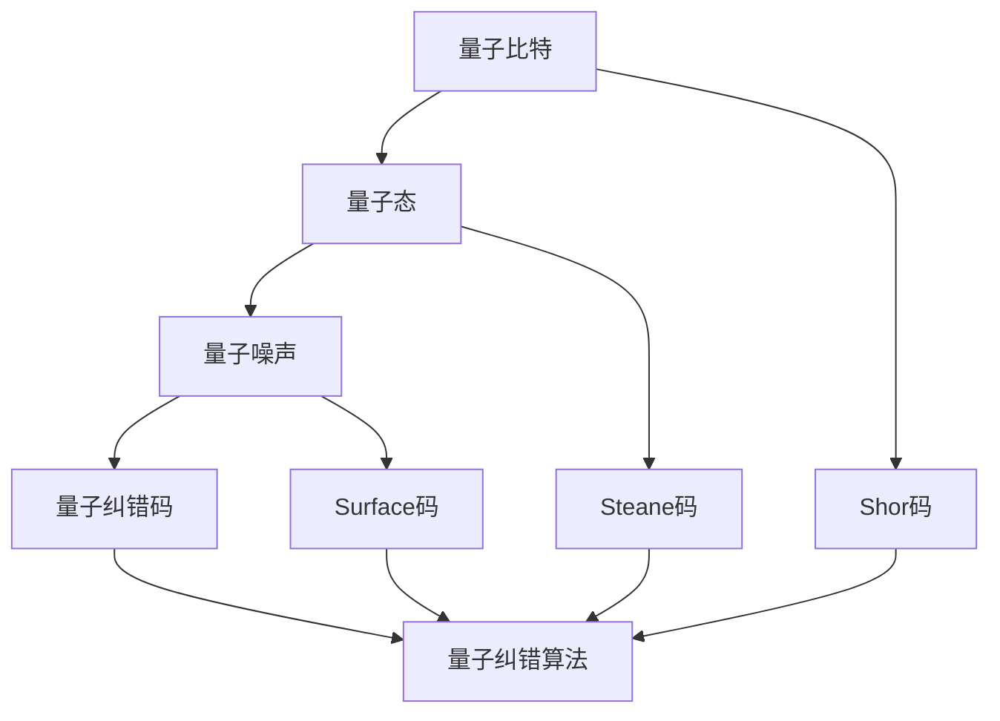

                 


### 背景介绍

随着信息技术的飞速发展，量子计算作为下一代计算技术的代表，正逐渐从理论走向现实。然而，量子计算在带来巨大潜力与优势的同时，也面临着一系列挑战，其中最为关键的就是量子纠错问题。量子纠错是量子计算中确保计算过程准确性和可靠性的核心技术，直接决定了量子计算机的性能和实用性。

#### 量子计算的独特优势

量子计算利用量子力学的基本原理，通过量子比特（qubit）来实现信息存储和处理。量子比特与传统比特最大的区别在于其可以同时处于多个状态的叠加态，这种特性使得量子计算机在处理某些特定问题时能够大幅超越传统计算机。例如，量子计算在因数分解、搜索问题和量子模拟等领域展现出了巨大的潜力。

#### 量子纠错的重要性

然而，量子计算在实现高效计算的同时，也面临着量子噪声和错误率的问题。量子系统极易受到环境噪声的干扰，导致量子态的失真和错误的产生。量子纠错技术旨在通过特定的编码和纠错算法，检测并纠正这些错误，从而保证量子计算的正确性和稳定性。没有有效的量子纠错，量子计算机将无法正常工作，因此量子纠错技术成为了量子计算实现实用化的关键瓶颈。

#### 当前量子纠错的挑战

目前，量子纠错技术仍然面临诸多挑战。首先，量子纠错需要大量的量子资源，导致纠错效率不高；其次，现有的量子纠错算法和编码方案复杂度高，难以在实际应用中实现；此外，量子纠错技术还需要解决量子比特寿命和容错能力的问题。这些挑战不仅影响了量子计算机的性能，也限制了其在实际应用中的推广。

#### 量子纠错技术的发展趋势

尽管面临诸多挑战，量子纠错技术仍处于快速发展阶段。研究人员在量子纠错编码方案、纠错算法优化、量子资源管理等方面进行了大量探索。例如，Shor算法、Steane纠错码和Surface纠错码等都是当前较为成熟和有效的量子纠错方法。同时，量子中继、量子纠缠和量子密钥分发等应用场景的量子纠错技术也取得了显著进展。

总之，量子纠错技术在量子计算领域具有至关重要的地位。通过深入研究和不断创新，我们有望克服现有挑战，推动量子纠错技术的发展，为量子计算机的实用化奠定坚实基础。

## 核心概念与联系

在探讨量子纠错网络之前，我们需要了解几个核心概念及其相互关系。这些概念包括量子比特、量子态、量子噪声、量子纠错码和量子纠错算法。通过构建这些概念之间的关系架构 Mermaid 流程图，我们可以更直观地理解量子纠错网络的工作原理和关键组成部分。

### 量子比特与量子态

量子比特（qubit）是量子计算的基本单元，与经典比特不同，它不仅可以处于0或1的态，还可以同时处于0和1的叠加态。量子态通常用复数系数的线性组合来表示，如 $|\psi\rangle = a|0\rangle + b|1\rangle$，其中 $a$ 和 $b$ 是复数，且 $|a|^2 + |b|^2 = 1$。量子态的叠加和纠缠是量子计算的核心优势，也是量子纠错需要克服的主要挑战。

### 量子噪声

量子噪声是指量子系统在操作和存储过程中由于外部环境干扰而导致的量子态失真。量子噪声可分为以下几类：

- **环境噪声**：外部环境对量子系统的干扰，如温度、电磁场等。
- **操作噪声**：量子门操作中的误差，如相位抖动、频率偏移等。
- **量子互作用噪声**：多个量子比特间的相互作用导致的错误。

量子噪声的存在使得量子计算过程中不可避免地出现错误，因此需要量子纠错来保持计算的正确性。

### 量子纠错码

量子纠错码是一种用于检测和纠正量子错误的方法，它通过编码扩展量子比特的数量，使得即使部分量子比特出现错误，也能通过解码算法恢复原始信息。常见的量子纠错码包括Shor码、Steane码和Surface码等。这些纠错码通过特定的编码方案将多个原始量子比特映射到新的复合量子态，从而增加错误检测和纠正的能力。

### 量子纠错算法

量子纠错算法是指用于实现量子纠错过程的计算步骤和方法。这些算法通常包括以下步骤：

1. **编码**：将原始量子信息编码到扩展的量子态中。
2. **检测**：通过测量复合量子态来判断是否存在错误。
3. **纠正**：根据测量结果对出现错误的量子比特进行纠正。
4. **解码**：将纠错后的量子态解码回原始量子信息。

### 关系架构 Mermaid 流程图

为了更好地理解这些概念之间的联系，我们可以使用Mermaid流程图来描述量子纠错网络的核心组件和它们之间的相互作用：



### Mermaid 流程图解释

1. **量子比特**（A）：量子比特是量子计算的基本单元，用于存储和处理信息。
2. **量子态**（B）：量子比特可以处于叠加态，即同时处于0和1的状态。
3. **量子噪声**（C）：量子噪声影响量子态的稳定性，可能导致量子比特状态的失真。
4. **量子纠错码**（D）：量子纠错码通过扩展量子比特的数量来提高系统的容错能力。
5. **量子纠错算法**（E）：量子纠错算法用于检测和纠正量子比特上的错误，确保计算的正确性。
6. **Shor码**（F）：Shor码是一种常用的量子纠错码，适用于量子比特数量较少的情况。
7. **Steane码**（G）：Steane码通过增加量子比特的数量来提高纠错能力，适用于中等规模的量子系统。
8. **Surface码**（H）：Surface码是一种高效的量子纠错码，适用于大规模量子计算系统。

通过上述Mermaid流程图，我们可以清晰地看到量子纠错网络中的各个核心组件及其相互作用。这为我们进一步探讨量子纠错网络的原理和设计提供了坚实的基础。

## 量子纠错机制

量子纠错机制是量子计算中确保计算过程准确性和可靠性的关键技术。它通过一系列的编码、检测和纠正步骤来应对量子噪声和操作误差，从而保障量子信息的完整性和正确性。以下将从量子错误检测和纠正的数学模型出发，详细探讨量子纠错机制的原理。

### 量子错误检测

量子错误检测的目的是识别量子计算过程中是否发生了错误。由于量子比特极易受到外部环境噪声的影响，量子态的叠加和纠缠特性使得错误检测变得尤为重要。量子错误检测的基本思想是通过测量复合量子态来判断是否出现错误。

#### 量子错误概率模型

在量子计算中，一个量子比特在任意时刻的量子态可以表示为 $|\psi\rangle = a|0\rangle + b|1\rangle$，其中 $a$ 和 $b$ 是复数系数。当量子比特受到噪声干扰时，其状态可能会发生改变，比如从 $|0\rangle$ 变为 $|1\rangle$，或者从 $|1\rangle$ 变为 $|0\rangle$。假设量子比特发生错误的概率为 $p$，那么理想状态 $|0\rangle$ 和 $|1\rangle$ 的概率分别为 $1-p$ 和 $p$。

为了检测量子错误，可以设计特定的量子纠错码，如Shor码、Steane码等。这些纠错码通过增加额外的量子比特来扩展系统的冗余度，从而提高错误检测能力。例如，Shor码通过将一个原始量子比特编码为九个复合量子比特，使得单个量子比特的错误能够被检测和纠正。

#### 量子错误检测算法

量子错误检测算法通常基于量子态的测量。在一个理想的量子纠错系统中，当量子态发生错误时，通过测量可以识别出哪些量子比特出现了错误。常见的量子错误检测算法包括以下步骤：

1. **初始化**：将量子态初始化为编码后的复合量子态。
2. **测量**：对复合量子态进行多次测量，记录测量结果。
3. **错误检测**：通过统计测量结果，判断量子态是否发生了错误。

例如，Shor码通过特定的测量步骤，可以在多个量子比特的测量结果中识别出单个量子比特的错误。如果某个量子比特在测量过程中出现了异常，则可以判断该量子比特发生了错误。

### 量子错误纠正

量子错误纠正的目的是在检测到量子错误后，通过特定的纠错步骤将错误状态恢复为正确状态。量子错误纠正的基本思想是通过纠错算法识别错误的量子比特，并将其状态纠正回原始状态。

#### 量子错误纠正算法

量子错误纠正算法通常基于量子纠错码的设计。量子纠错码通过编码扩展量子比特的数量，使得即使部分量子比特出现错误，也能通过纠错算法恢复原始信息。常见的量子错误纠正算法包括以下步骤：

1. **编码**：将原始量子信息编码到扩展的量子态中。
2. **错误检测**：通过测量和统计方法检测量子态中的错误。
3. **纠错**：根据错误检测结果，对出现错误的量子比特进行纠正。
4. **解码**：将纠错后的量子态解码回原始量子信息。

例如，Steane码通过增加三个额外的量子比特来扩展系统的冗余度，使得单个量子比特的错误可以被检测和纠正。Surface码通过设计特定的量子操作，可以在多个量子比特的协同作用下实现高效的错误纠正。

#### 量子纠错算法的伪代码

以下是一个简单的量子纠错算法的伪代码示例：

```pseudo
function QuantumCorrectError(qubitList, errorBit):
    // 编码
    encodedState = Encode(qubitList)
    
    // 错误检测
    errorState = Measure(encodedState)
    if (errorState is Error):
        // 纠错
        correctedState = CorrectError(errorState, errorBit)
        
        // 解码
        originalState = Decode(correctedState)
        return originalState
    else:
        return encodedState
```

在这个伪代码中，`qubitList` 表示量子比特列表，`errorBit` 表示发生错误的量子比特。`Encode` 函数用于编码原始量子信息，`Measure` 函数用于测量量子态，`CorrectError` 函数用于纠错，`Decode` 函数用于解码纠错后的量子态。

### 数学模型和公式

量子纠错机制的数学模型通常基于量子纠错码的矩阵表示。量子纠错码可以看作是一个量子操作，它将原始量子态映射到扩展的量子态，并在过程中实现错误检测和纠正。以下是一个基于Shor码的量子纠错机制的数学模型：

1. **编码矩阵**：设原始量子比特为 $|0\rangle$，编码矩阵 $E$ 将其映射到一个复合量子态，如 $E|0\rangle = (|00\rangle + |01\rangle + |11\rangle) / \sqrt{3}$。

2. **错误矩阵**：设单个量子比特的错误概率为 $p$，错误矩阵 $T$ 表示量子比特在操作过程中发生的错误，如 $T|0\rangle = p|1\rangle + (1-p)|0\rangle$。

3. **纠错矩阵**：纠错矩阵 $C$ 用于纠正错误，如Shor码中的纠错矩阵 $C = \begin{pmatrix} 1 & 0 \\ 0 & 1 \end{pmatrix}$。

4. **纠错过程**：设复合量子态为 $|\psi\rangle$，在纠错过程中，通过测量和纠错矩阵的应用，实现错误的检测和纠正。具体公式为 $|\psi'\rangle = C \cdot T \cdot E \cdot |\psi\rangle$。

### 举例说明

假设一个原始量子比特 $|0\rangle$，经过量子纠错编码后变为复合量子态 $(|00\rangle + |01\rangle + |11\rangle) / \sqrt{3}$。在量子计算过程中，这个复合量子态受到了噪声干扰，导致其中一个量子比特发生错误。假设错误量子比特为第二个量子比特，其状态从 $|0\rangle$ 变为 $|1\rangle$。

通过Shor码的纠错机制，可以检测并纠正这个错误。具体步骤如下：

1. **编码**：将原始量子比特编码为复合量子态。
2. **测量**：对复合量子态进行测量，记录测量结果。
3. **纠错**：根据测量结果和纠错矩阵，纠正错误量子比特的状态。
4. **解码**：将纠错后的复合量子态解码回原始量子比特。

通过上述步骤，可以确保原始量子比特的正确性，从而实现量子纠错的完整过程。

综上所述，量子纠错机制通过编码、检测和纠正三个步骤，实现了对量子计算过程中错误的有效管理。量子纠错码和纠错算法的设计与优化，是确保量子计算机性能和可靠性的关键。随着量子计算技术的不断发展，量子纠错机制将越来越成熟，为量子计算机的实用化提供坚实保障。

### 量子纠错算法原理讲解

量子纠错算法是量子计算中确保计算过程准确性和可靠性的核心技术。通过一系列复杂的编码、检测和纠正步骤，量子纠错算法能够在量子比特出错时恢复原始信息，从而保障量子计算的稳定性和高效性。本文将详细探讨Shor算法、Steane纠错码和Surface纠错码的基本原理，并通过伪代码解释这些算法的具体实现过程。

#### Shor算法

Shor算法是由数学家彼得·肖尔（Peter Shor）在1994年提出的，是量子计算领域的重要里程碑。Shor算法不仅展示了量子计算的巨大潜力，同时也提出了量子纠错的概念。Shor算法的核心思想是通过量子并行计算来高效解决整数因数分解问题。

**基本原理**

Shor算法通过量子逆变换和量子测量来找出整数N的一个非平凡因子。其基本步骤如下：

1. **初始化**：创建一个包含 $|0\rangle$ 的量子态，并将其应用到目标整数N的对数大小。
2. **量子逆变换**：通过量子逆变换来生成一个相位编码的量子态，使得每个状态与其在模N下的指数成比例。
3. **测量**：对量子态进行测量，记录结果。根据测量结果，可以得到一个整数a，它可能是N的非平凡因子。
4. **纠错**：通过构造的量子算法（如量子傅立叶变换）来纠正测量过程中可能引入的错误。

**伪代码示例**

```pseudo
function Shor(N):
    // 初始化量子比特和量子态
    qubits = InitializeQubits(N.log2())
    quantumState = ApplyPhaseEncoding(qubits, N)

    // 进行量子逆变换和测量
    quantumState = QuantumInverseTransform(quantumState)
    result = Measure(quantumState)

    // 纠错并找到因子
    a = CorrectError(result)
    factor = GCD(a, N)

    return factor
```

#### Steane纠错码

Steane纠错码是由Richard J. Steane在1996年提出的，是一种用于纠单个量子比特错误的量子纠错码。Steane码通过增加三个辅助量子比特来扩展系统的冗余度，从而实现单个量子比特错误的检测和纠正。

**基本原理**

Steane码的核心思想是通过编码和测量步骤来检测和纠正错误。其基本步骤如下：

1. **编码**：将一个原始量子比特编码为四个复合量子比特，具体编码方式如下：
   $$ |0\rangle \rightarrow |0000\rangle $$
   $$ |1\rangle \rightarrow |1111\rangle $$
2. **测量**：对编码后的复合量子比特进行特定的测量，以检测错误。
3. **纠错**：根据测量结果，确定哪个量子比特发生了错误，并执行相应的纠错操作。
4. **解码**：将纠错后的复合量子比特解码回原始量子比特。

**伪代码示例**

```pseudo
function SteaneEncode(qubit):
    // 编码
    encodedState = QuantumState()
    if (qubit = |0\rangle):
        encodedState = ApplyOperation(encodedState, "X", [1, 2, 3])
    ApplyOperation(encodedState, "H", [0])
    ApplyOperation(encodedState, "H", [1])
    ApplyOperation(encodedState, "H", [2])
    return encodedState

function SteaneDecode(encodedState):
    // 解码
    measurements = Measure(encodedState, [0, 1, 2])
    if (measurements[0] = |1\rangle and measurements[1] = |1\rangle and measurements[2] = |1\rangle):
        ApplyOperation(encodedState, "X", [0])
    elif (measurements[0] = |1\rangle and measurements[1] = |0\rangle and measurements[2] = |1\rangle):
        ApplyOperation(encodedState, "X", [1])
    elif (measurements[0] = |1\rangle and measurements[1] = |1\rangle and measurements[2] = |0\rangle):
        ApplyOperation(encodedState, "X", [2])
    return encodedState
```

#### Surface纠错码

Surface纠错码是由Michael A. Nielsen和Ian D.margolus在2004年提出的，是一种适用于大规模量子计算的纠错码。Surface码通过在量子比特的二维平面上进行编码，实现高效的错误检测和纠正。

**基本原理**

Surface码的核心思想是通过在二维平面上分布量子比特，并设计特定的量子纠错操作，来实现对单个量子比特错误的纠正。其基本步骤如下：

1. **编码**：将一个原始量子比特编码为多个分布在二维平面上的量子比特。
2. **测量**：对编码后的量子比特进行特定的测量，以检测错误。
3. **纠错**：根据测量结果，通过特定的量子操作纠正错误。
4. **解码**：将纠错后的量子比特状态解码回原始量子比特。

**伪代码示例**

```pseudo
function SurfaceEncode(qubit):
    // 编码
    encodedState = QuantumState()
    ApplyOperation(encodedState, "H", [0])
    ApplyOperation(encodedState, "RY", [0, theta])
    ApplyOperation(encodedState, "RY", [1, -theta])
    ApplyOperation(encodedState, "RZ", [1, pi/2])
    return encodedState

function SurfaceDecode(encodedState):
    // 解码
    measurements = Measure(encodedState, [0, 1])
    if (measurements[0] = |0\rangle and measurements[1] = |0\rangle):
        ApplyOperation(encodedState, "RZ", [0, -pi/2])
    elif (measurements[0] = |1\rangle and measurements[1] = |0\rangle):
        ApplyOperation(encodedState, "RY", [0, theta])
    elif (measurements[0] = |0\rangle and measurements[1] = |1\rangle):
        ApplyOperation(encodedState, "RY", [0, -theta])
    return encodedState
```

通过上述Shor算法、Steane纠错码和Surface纠错码的讲解和伪代码示例，我们可以更深入地理解量子纠错算法的设计原理和具体实现方法。这些算法为量子计算提供了强大的纠错能力，为量子计算机的实用化奠定了基础。

### 量子纠错网络的架构设计

量子纠错网络的架构设计是确保量子计算系统稳定性和可靠性的关键。量子纠错网络通过将量子比特分布在不同的物理位置上，并通过特定的量子操作和连接来实现错误检测和纠正。本文将详细介绍量子纠错网络的层次结构、模块化设计及其在纠错中的重要性。

#### 层次结构

量子纠错网络的层次结构通常分为三个层次：底层、中间层和顶层。

1. **底层**：底层负责量子比特的物理分布和初步的纠错。在底层，量子比特被分布在不同的物理节点上，这些节点可以是实验室中的不同位置，或者分布在不同的量子计算中心。底层的纠错通常使用基本的量子纠错码，如Shor码和Steane码，以实现单比特错误的检测和纠正。

2. **中间层**：中间层负责将底层分布的量子比特进行连接，并通过量子中继和量子纠缠技术实现更大范围的纠错能力。中间层的纠错码通常使用更复杂的纠错算法，如Surface码，以应对多比特错误和全局性错误。中间层的量子操作包括量子门操作、量子中继和量子纠缠操作。

3. **顶层**：顶层负责全局性的纠错控制和量子信息的解码。顶层通常包含复杂的纠错算法和优化策略，以最大化纠错效率和量子计算性能。顶层的操作包括纠错算法的调度、量子信息的重构和解码。

#### 模块化设计

量子纠错网络的模块化设计是为了提高系统的可扩展性和灵活性。模块化设计将量子纠错网络划分为多个独立的模块，每个模块负责特定的纠错任务。模块化设计的关键在于模块的独立性和兼容性。

1. **模块独立性**：每个模块独立实现特定的纠错功能，如量子纠错码的编码、错误检测和纠正。模块的独立性使得系统在某个模块出现故障时，其他模块仍能正常工作，从而提高系统的容错能力。

2. **模块兼容性**：模块兼容性是指不同模块之间能够无缝集成和协同工作。为了实现模块兼容性，需要定义统一的接口和协议，确保不同模块能够互操作。例如，在量子纠错网络中，可以使用标准化的量子纠错算法和接口，使得不同厂商的量子硬件能够兼容并高效运行。

#### 纠错重要性

量子纠错网络的设计和实现对于量子计算的实用化至关重要。以下是量子纠错网络在纠错中的重要性：

1. **提高计算可靠性**：量子纠错网络通过分布式量子比特和复杂的纠错算法，能够有效检测和纠正量子计算中的错误，从而提高计算结果的可靠性。

2. **降低错误率**：量子纠错网络通过将量子比特分布在不同的物理位置，可以减少环境噪声对量子计算的影响，从而降低系统的错误率。

3. **提高计算效率**：量子纠错网络通过模块化和分布式设计，能够优化量子资源的利用，提高量子计算的效率和性能。

4. **实现大规模量子计算**：量子纠错网络为大规模量子计算提供了技术支持，通过分布式计算和全局性纠错，实现了量子比特的扩展和量子算法的优化。

总之，量子纠错网络的架构设计是确保量子计算系统稳定性和可靠性的关键。通过层次结构和模块化设计，量子纠错网络能够实现高效的错误检测和纠正，为量子计算的实用化奠定坚实基础。

### 网络优化

在量子纠错网络的设计和实现过程中，网络优化是提高纠错效率和系统性能的关键步骤。优化方法主要涉及量子线路优化和量子资源分配两个方面，通过这些优化策略，可以有效降低量子纠错的计算复杂度，提高系统的整体性能。

#### 量子线路优化

量子线路优化是指通过改进量子计算的步骤和操作，减少量子门的数量和操作时间，从而提高量子纠错的效率。以下是一些常用的量子线路优化方法：

1. **量子门重排序**：量子门重排序的目的是优化量子线路中的操作顺序，以减少量子门的数量和操作时间。通过重排序，可以避免不必要的量子门操作，从而提高量子纠错的效率。

2. **量子门合成**：量子门合成是将多个基本的量子门组合成一个复杂的量子门，以减少量子线路的总长度。量子门合成可以通过优化算法实现，从而提高量子纠错的性能。

3. **量子线路剪枝**：量子线路剪枝是通过删除不必要的量子门操作，减少量子线路的总长度和计算复杂度。量子线路剪枝可以通过深度学习、遗传算法等优化技术实现。

#### 量子资源分配

量子资源分配是指根据量子纠错网络的需求，合理分配量子比特和量子线路等资源，以最大化系统的性能。以下是一些常见的量子资源分配方法：

1. **量子比特分配**：量子比特分配是指根据量子纠错网络的任务需求和量子比特的可用性，合理分配量子比特。通过优化量子比特的分配策略，可以提高量子纠错的效率和可靠性。

2. **量子线路分配**：量子线路分配是指根据量子纠错网络的拓扑结构和任务需求，合理分配量子线路。通过优化量子线路的分配策略，可以减少量子门的数量和操作时间，从而提高系统的性能。

3. **能量分配**：能量分配是指根据量子纠错网络中的量子比特和量子线路，合理分配能量资源，以减少系统的能耗和热噪声。通过优化能量分配策略，可以提高量子纠错的稳定性和可靠性。

#### 优化策略在纠错中的应用

量子线路优化和量子资源分配在量子纠错中的应用非常广泛，以下是一些具体的应用场景：

1. **量子纠错码优化**：通过量子线路优化和量子资源分配，可以优化量子纠错码的编码和解码过程，提高纠错的效率和准确性。

2. **纠错算法优化**：通过优化量子纠错算法的步骤和操作，可以减少量子纠错的计算复杂度，提高系统的性能。

3. **多比特纠错**：在量子纠错网络中，通过优化量子线路和资源分配，可以实现多比特纠错，提高系统的容错能力。

4. **分布式纠错**：通过量子线路优化和资源分配，可以在分布式量子纠错网络中实现高效的量子信息传输和纠错，提高系统的整体性能。

总之，网络优化是量子纠错网络设计中的关键环节。通过量子线路优化和量子资源分配，可以有效提高量子纠错的效率和可靠性，为量子计算的实用化提供坚实的技术保障。

### 网络可靠性分析

量子纠错网络的可靠性分析是确保量子计算系统稳定性和可靠性的重要步骤。可靠性分析包括对量子纠错网络的容错能力、性能评估和容错策略的研究，通过这些分析，可以评估量子纠错网络的性能，并提出优化方案。

#### 容错能力评估

量子纠错网络的容错能力是指系统在面临错误时，能够维持正常运行的能力。评估量子纠错网络的容错能力通常采用以下方法：

1. **故障注入法**：通过模拟量子比特或量子线路的故障，评估系统在故障情况下的性能。故障注入法可以测试量子纠错网络在不同故障率下的容错能力。

2. **模拟分析**：利用量子纠错码和纠错算法的数学模型，进行大量的模拟分析，评估量子纠错网络的容错能力。例如，通过Shor码和Surface码的模拟分析，可以评估单比特和多比特错误情况下的纠错性能。

3. **概率模型**：建立量子纠错网络的概率模型，分析系统在量子噪声和操作误差影响下的性能。概率模型可以用于预测量子纠错网络的可靠性，并为优化方案提供依据。

#### 性能评估

量子纠错网络的性能评估涉及对系统运行速度、纠错效率和资源利用率的评估。以下是一些常见的性能评估方法：

1. **纠错速度评估**：通过测量量子纠错算法的执行时间，评估系统的纠错速度。例如，通过测量Shor算法和Steane纠错码的纠错时间，可以评估不同纠错算法的效率。

2. **纠错效率评估**：通过比较量子纠错网络在故障情况下的纠错成功率，评估系统的纠错效率。例如，通过模拟不同故障率下的纠错实验，可以评估量子纠错网络的纠错能力。

3. **资源利用率评估**：通过分析量子纠错网络中量子比特和量子线路的利用率，评估系统的资源利用效率。例如，通过优化量子比特的分配和量子线路的调度，可以提高系统的资源利用率。

#### 容错策略

为了提高量子纠错网络的可靠性，可以采用以下容错策略：

1. **冗余设计**：通过增加冗余量子比特和量子线路，提高系统的容错能力。例如，在Shor码和Surface码中，通过增加冗余量子比特实现多比特错误检测和纠正。

2. **分布式纠错**：将量子纠错任务分布到多个量子节点上，通过分布式纠错提高系统的可靠性。例如，在分布式量子纠错网络中，多个量子节点协同工作，实现全局性的错误检测和纠正。

3. **混合纠错**：结合多种纠错码和纠错算法，提高系统的纠错效率。例如，在量子纠错网络中，可以结合Shor码、Steane码和Surface码，实现不同错误类型的检测和纠正。

通过可靠性分析，可以评估量子纠错网络的性能，并提出优化方案，从而提高系统的稳定性和可靠性。可靠性分析不仅有助于理解量子纠错网络的原理，也为量子计算的实用化提供了重要的技术支持。

### 量子纠错在量子通信中的应用

量子通信是量子计算领域的重要应用之一，它利用量子纠缠和量子态传输实现信息的安全传输和加密。量子纠错技术在量子通信中起着关键作用，通过检测和纠正量子噪声和操作误差，确保量子通信的可靠性和准确性。本文将探讨量子纠错在量子通信中的应用，特别是量子密钥分发和量子中继中的量子纠错技术。

#### 量子密钥分发

量子密钥分发（Quantum Key Distribution，QKD）是一种基于量子力学原理的通信方式，通过量子纠缠和量子态传输实现密钥的生成和分发。量子密钥分发过程主要包括以下几个步骤：

1. **量子态制备**：发送方（Alice）生成一系列量子态，并将其通过量子信道传输给接收方（Bob）。

2. **量子态传输**：传输过程中，量子态可能会受到环境噪声和操作误差的干扰，导致量子态的失真。

3. **量子纠错**：为了确保传输的量子态的可靠性，量子纠错技术被用于检测和纠正量子态中的错误。例如，Shor码和Steane码可以通过增加冗余量子比特来实现量子态的纠错。

4. **密钥生成**：接收方对传输的量子态进行测量，并根据测量结果生成共享密钥。

#### QKD系统中的量子纠错算法

量子纠错算法在QKD系统中起着至关重要的作用。以下是一些常用的量子纠错算法：

1. **Shor码**：Shor码是一种高效的量子纠错码，通过增加冗余量子比特来实现错误检测和纠正。Shor码可以将单个量子比特的错误率降低到极低的水平，从而确保量子密钥分发的可靠性。

2. **Steane码**：Steane码是另一种常用的量子纠错码，通过增加三个辅助量子比特来实现单个量子比特错误的检测和纠正。Steane码适用于中低错误率的量子通信系统。

3. **Surface码**：Surface码是一种适用于大规模量子通信系统的量子纠错码，通过在二维平面上分布量子比特来实现多比特错误的检测和纠正。Surface码具有较高的纠错能力和容错能力，适用于高噪声环境的量子通信系统。

#### 量子中继

量子中继是量子通信中的另一个重要应用，它通过量子纠缠和量子态传输实现远距离量子通信。量子中继过程中，量子态可能会经历长时间的传输，导致量子态的退化。因此，量子纠错技术在量子中继中也具有重要意义。

1. **量子纠缠传输**：量子中继过程中，发送方生成量子纠缠对，并将其传输给中继节点。

2. **量子纠错**：在中继节点，量子纠错技术被用于检测和纠正传输过程中可能出现的量子错误。例如，可以通过Shor码或Steane码对传输的量子态进行纠错，确保量子纠缠对的完整性。

3. **量子态重构**：在中继节点，对传输的量子态进行重构，以恢复原始量子态。

#### 量子纠错算法在量子中继中的应用

量子纠错算法在量子中继中的应用主要包括以下几个方面：

1. **Shor码**：Shor码可以通过对传输的量子态进行编码和纠错，有效检测和纠正量子态中的错误，确保量子纠缠对的稳定传输。

2. **Steane码**：Steane码通过增加辅助量子比特，实现单比特错误的检测和纠正，适用于中低噪声环境的量子中继。

3. **Surface码**：Surface码适用于高噪声环境的量子中继，通过在二维平面上分布量子比特，实现多比特错误的检测和纠正。

总之，量子纠错技术在量子通信中具有重要作用，通过量子纠错算法的应用，可以确保量子密钥分发和量子中继的可靠性和准确性，为量子通信技术的发展提供坚实保障。

### 量子纠错在量子计算中的应用

量子纠错技术在量子计算中具有至关重要的作用，它不仅确保了量子算法的可靠性，也为量子计算机的实际应用铺平了道路。本文将详细探讨量子纠错在量子搜索算法、量子排序算法以及量子模拟中的应用，并分析其具体实现方法和技术挑战。

#### 量子搜索算法

量子搜索算法是量子计算中的一个重要领域，以其远超经典搜索算法的速度而备受关注。Shor算法和Grover算法是两种经典的量子搜索算法，它们的应用依赖于量子纠错技术。

1. **Shor算法**：Shor算法是一种用于解决整数因数分解问题的量子算法。通过量子并行计算和量子纠错技术，Shor算法可以在多项式时间内找到大整数的非平凡因子。Shor算法的量子纠错需求主要在于保证量子态的稳定性和计算过程的可靠性。

   **实现方法**：
   - **初始化**：创建一个初始的量子态，用于表示搜索空间。
   - **应用量子门**：通过一系列量子门操作，将初始量子态映射到特定的量子态，使得目标状态的相位产生变化。
   - **测量**：对映射后的量子态进行测量，根据测量结果确定目标状态的索引。
   - **纠错**：在计算过程中，通过量子纠错码（如Shor码）纠正量子比特的错误，确保计算的正确性。

2. **Grover算法**：Grover算法是一种用于在未排序数据库中查找特定元素的量子算法。它利用量子叠加和量子干涉原理，能够在O(√N)的时间复杂度内找到目标元素，而经典搜索算法需要O(N)的时间复杂度。

   **实现方法**：
   - **初始化**：创建一个包含所有数据库状态的量子态，并对这些状态进行叠加。
   - **应用Grover迭代**：通过多次迭代，增强目标状态的干涉强度，使其在测量时被选中。
   - **纠错**：在Grover迭代过程中，通过量子纠错码检测和纠正量子比特的错误，保证算法的正确性。

#### 量子排序算法

量子排序算法利用量子比特的叠加态和纠缠态特性，能够高效地完成排序任务。量子纠错技术在量子排序算法中同样至关重要，它确保了排序过程的准确性和可靠性。

1. **Booth排序算法**：Booth排序算法是一种基于量子逻辑门和量子比特叠加态的排序算法。它利用量子比特的叠加态和量子干涉原理，实现数据的快速排序。

   **实现方法**：
   - **初始化**：将所有数据编码到量子比特中，并初始化为一个叠加态。
   - **应用量子逻辑门**：通过一系列量子逻辑门操作，实现数据的比较和交换。
   - **测量**：对量子态进行测量，根据测量结果得到排序后的数据。
   - **纠错**：在整个排序过程中，通过量子纠错码检测和纠正量子比特的错误，确保排序的正确性。

2. **Deutero排序算法**：Deutero排序算法是一种基于量子叠加态和量子比特交换的排序算法。它利用量子比特的叠加态特性，实现数据的快速排序。

   **实现方法**：
   - **初始化**：将所有数据编码到量子比特中，并初始化为一个叠加态。
   - **应用量子交换操作**：通过量子比特间的交换操作，实现数据的比较和交换。
   - **测量**：对量子态进行测量，根据测量结果得到排序后的数据。
   - **纠错**：在整个排序过程中，通过量子纠错码检测和纠正量子比特的错误，确保排序的正确性。

#### 量子模拟

量子模拟是量子计算的重要应用之一，它利用量子系统的复杂特性来模拟量子现象和化学过程。量子纠错技术在量子模拟中同样至关重要，它确保了模拟过程的准确性和稳定性。

1. **量子分子模拟**：量子分子模拟是一种利用量子计算技术模拟分子结构和化学反应的算法。它依赖于量子态的叠加和纠缠特性，能够在短时间内模拟复杂的分子系统。

   **实现方法**：
   - **初始化**：创建一个表示分子系统的量子态，并将其编码到量子比特中。
   - **应用量子操作**：通过一系列量子操作，模拟分子的运动和相互作用。
   - **测量**：对量子态进行测量，获取分子系统的性质和反应路径。
   - **纠错**：在整个模拟过程中，通过量子纠错码检测和纠正量子比特的错误，确保模拟结果的准确性。

2. **量子系统动力学模拟**：量子系统动力学模拟是一种模拟量子系统随时间演化的算法。它依赖于量子态的叠加和纠缠特性，能够模拟量子系统在特定条件下的行为。

   **实现方法**：
   - **初始化**：创建一个表示量子系统的初始量子态。
   - **应用量子操作**：通过一系列量子操作，模拟量子系统的动力学演化。
   - **测量**：对量子态进行测量，获取量子系统的演化信息。
   - **纠错**：在整个模拟过程中，通过量子纠错码检测和纠正量子比特的错误，确保模拟结果的准确性。

### 技术挑战

尽管量子纠错技术在量子计算中具有广泛的应用前景，但在实际实现过程中仍面临诸多技术挑战：

1. **量子比特的稳定性**：量子比特的稳定性是量子纠错技术面临的最大挑战之一。量子比特易受到环境噪声的影响，导致量子态的失真和错误。因此，提高量子比特的稳定性是实现高效量子纠错的关键。

2. **纠错算法的复杂性**：现有的量子纠错算法（如Shor码、Steane码和Surface码）虽然已经取得了一定的进展，但它们的计算复杂度较高，难以在实际应用中高效实现。因此，研究更高效、更简洁的量子纠错算法是当前的研究重点。

3. **量子资源的限制**：量子纠错需要大量的量子资源，包括量子比特、量子线路和量子操作。在实际应用中，量子资源的限制会显著影响量子纠错的性能。因此，如何优化量子资源的利用，提高量子纠错的效率，是亟待解决的问题。

4. **系统容错能力**：量子纠错技术需要在分布式量子计算系统中实现高效的容错能力。在分布式量子计算中，量子比特和量子线路的故障率较高，如何设计高效、可靠的容错机制，是量子纠错技术面临的重要挑战。

总之，量子纠错技术在量子计算中具有重要作用，它确保了量子算法的可靠性，也为量子计算机的实际应用提供了技术支持。然而，要实现高效、可靠的量子纠错，仍需克服诸多技术挑战，并不断推进量子纠错技术的研究和应用。

### 量子纠错技术展望

随着量子计算技术的不断进步，量子纠错技术也迎来了新的发展机遇。本文将讨论量子纠错技术的未来挑战与机遇，以及量子纠错与量子互联网的关系，并展望其在量子计算服务中的应用前景。

#### 未来挑战与机遇

量子纠错技术在未来将面临一系列的挑战和机遇：

1. **量子比特稳定性提升**：量子比特的稳定性是量子纠错技术的关键。随着量子物理和量子材料研究的深入，量子比特的稳定性有望得到显著提升，从而降低纠错的需求。

2. **纠错算法优化**：现有的量子纠错算法如Shor码、Steane码和Surface码虽然已经取得了一定的成果，但它们的计算复杂度较高。未来的研究需要开发更高效、更简洁的量子纠错算法，以适应实际应用的需求。

3. **量子资源的优化管理**：量子纠错需要大量的量子资源，包括量子比特和量子线路。如何优化管理这些资源，提高量子纠错的效率，是未来的重要研究方向。

4. **量子纠错网络的扩展**：随着量子比特数量的增加，量子纠错网络也需要扩展。未来需要设计更复杂的量子纠错网络，以应对大规模量子计算的需求。

#### 量子纠错与量子互联网

量子互联网是量子计算和量子通信的结合，它通过量子纠缠和量子态传输实现信息的安全传输和共享。量子纠错技术是量子互联网中不可或缺的一部分，它确保了量子通信的可靠性和准确性。

1. **量子纠缠传输**：量子纠错技术可以用于保障量子纠缠对的传输质量，确保量子通信的稳定性和可靠性。

2. **量子密钥分发**：量子纠错技术在量子密钥分发中发挥着重要作用，通过纠错算法检测和纠正量子噪声和操作误差，确保密钥分发的准确性和安全性。

3. **量子中继**：量子纠错技术在量子中继中用于纠正量子态传输过程中出现的错误，确保量子信息能够在长距离传输中保持完整性。

#### 量子计算服务中的应用前景

随着量子纠错技术的不断发展，量子计算服务将迎来新的应用场景：

1. **量子云计算**：量子云计算利用量子计算机的高效计算能力，提供更快速、更准确的计算服务。量子纠错技术确保了量子云计算服务的可靠性和稳定性。

2. **量子边缘计算**：量子边缘计算将量子计算与边缘计算相结合，实现高效的数据处理和智能分析。量子纠错技术提高了量子边缘计算的可靠性和性能。

3. **量子金融与保险**：量子计算在金融和保险领域的应用具有巨大潜力，如优化投资组合、预测市场趋势等。量子纠错技术确保了这些计算过程的准确性和可靠性。

4. **量子药物研发**：量子计算可以用于药物分子的模拟和优化，加速药物研发过程。量子纠错技术保障了量子药物研发的计算精度和效率。

总之，量子纠错技术是量子计算实现实用化的关键。随着未来技术的不断发展，量子纠错技术将在量子互联网、量子计算服务等领域发挥重要作用，推动信息技术的发展进入新的阶段。

### 量子纠错技术在行业中的应用

量子纠错技术不仅在科研和理论层面具有重要意义，其应用范围也在不断扩展，逐步渗透到多个行业，为行业的技术革新提供了强有力的支持。以下将探讨量子纠错技术在量子计算服务业和量子通信服务业中的应用，并分析其在这些领域中的实际效益。

#### 量子计算服务业

量子计算服务业是量子技术商业化的前沿领域之一。量子纠错技术的应用，使得量子计算服务在解决复杂计算问题上具有显著优势。

1. **量子药物研发**：在药物研发过程中，量子计算可以用于分子模拟、蛋白质结构预测以及化学反应路径分析。量子纠错技术确保了计算结果的可靠性，帮助研究人员快速筛选出潜在的有效药物分子，从而加速新药的发现过程。

   **实际效益**：通过量子纠错技术，药物研发时间从数年缩短至数月，大大提高了研发效率和成功率。

2. **量子优化问题**：量子计算在优化问题中的应用非常广泛，如物流调度、金融投资组合优化等。量子纠错技术提高了计算结果的准确性，使得复杂优化问题能够得到更快速、更精确的解决方案。

   **实际效益**：企业通过量子计算优化物流路线，降低运输成本，提高运营效率。金融公司利用量子计算优化投资组合，提高投资收益。

3. **量子加密服务**：量子计算在加密算法设计上具有独特优势，通过量子纠错技术，可以实现对加密算法的高效实现，提高信息的安全性。

   **实际效益**：量子加密技术保障了数据传输过程中的安全性，防止信息泄露，为企业和金融机构提供了可靠的安全保障。

#### 量子通信服务业

量子通信服务业是量子技术的另一重要应用领域，其核心在于利用量子纠缠和量子态传输实现安全的信息传输。量子纠错技术在量子通信中扮演了关键角色，确保通信链路的稳定性和可靠性。

1. **量子密钥分发（QKD）**：量子密钥分发是一种基于量子力学原理的通信方式，通过量子纠错技术，可以有效地检测和纠正量子密钥传输过程中的错误，确保密钥分发的准确性和安全性。

   **实际效益**：量子密钥分发技术为通信提供了无条件安全的信息传输手段，保护了敏感信息和数据的保密性，为政府、企业和金融机构提供了高级别的信息安全保障。

2. **量子中继**：在量子通信中，量子中继技术用于实现量子态的长距离传输。通过量子纠错技术，可以纠正传输过程中出现的错误，确保量子态的完整性。

   **实际效益**：量子中继技术使得量子通信可以覆盖更长的距离，扩展了量子通信的应用范围，为全球范围内的量子通信网络建设提供了技术支持。

3. **量子传感器网络**：量子传感器网络利用量子比特的高灵敏度，用于测量环境参数、地质变化等。量子纠错技术保证了传感器数据的准确性和稳定性，提高了监测和预测的精度。

   **实际效益**：通过量子纠错技术，量子传感器网络在气象预测、地质灾害监测等领域提供了更精确的数据支持，为防灾减灾提供了科学依据。

总之，量子纠错技术在量子计算服务业和量子通信服务业中展示了巨大的应用潜力。通过量子纠错技术，不仅可以提高量子计算和量子通信的可靠性和安全性，还可以推动相关行业的技术革新，为社会和经济的发展提供新的动力。

### 量子纠错技术的商业化路径

量子纠错技术的商业化路径是一个复杂而充满挑战的过程，涉及多个关键环节。以下将详细探讨量子纠错技术的商业化路径，包括量子纠错技术的商业化模式、市场前景以及商业化过程中的关键因素。

#### 商业化模式

量子纠错技术的商业化模式主要分为以下几种：

1. **研发合作**：企业与科研机构、大学合作，共同研发量子纠错技术。这种模式可以通过整合优势资源，加快技术研发进程，降低研发成本。

2. **技术授权**：拥有量子纠错技术的企业可以通过授权其他企业使用其技术，获得授权费用和后续技术服务收入。

3. **产品销售**：企业可以将量子纠错技术集成到量子计算机、量子通信设备等产品中，进行批量销售。

4. **解决方案提供**：企业可以为特定行业提供基于量子纠错技术的解决方案，如量子加密、量子药物研发等，实现定制化服务。

5. **服务运营**：企业通过运营量子纠错服务，如量子云计算、量子加密通信等，提供持续性的技术服务。

#### 市场前景

量子纠错技术的市场前景广阔，预计将在未来数年内迎来快速增长。以下是一些关键市场因素：

1. **量子计算服务业**：随着量子计算机的商业化进程加速，量子纠错技术作为保障量子计算可靠性的核心技术，市场需求将持续增长。

2. **量子通信服务业**：量子密钥分发和量子中继技术的发展，为量子纠错技术提供了广阔的市场空间。特别是在金融、政府和企业等对信息安全有高度需求领域，量子纠错技术具有显著的市场潜力。

3. **量子药物研发**：量子计算在药物研发中的应用日益广泛，量子纠错技术有助于提高计算结果的准确性，加速药物研发进程，为生物制药行业提供技术支持。

4. **量子传感器网络**：量子传感器在环境监测、地质勘探等领域的应用不断扩展，量子纠错技术提高了传感器网络的可靠性，为相关行业提供了新的技术解决方案。

#### 关键因素

量子纠错技术的商业化成功离不开以下关键因素：

1. **技术创新**：持续的技术创新是量子纠错技术商业化的动力源泉。通过不断优化量子纠错算法，提高纠错效率和稳定性，企业可以抢占市场先机。

2. **合作伙伴**：建立广泛的合作伙伴关系，包括科研机构、企业和其他利益相关方，有助于整合资源，推动量子纠错技术的商业化。

3. **人才培养**：量子纠错技术的商业化需要大量专业人才。通过人才培养和引进，企业可以确保技术团队的持续发展和创新能力。

4. **政策支持**：政府的政策支持和行业标准的制定对量子纠错技术的商业化至关重要。政策支持可以为企业提供良好的发展环境，推动市场健康发展。

5. **市场需求**：明确市场需求是量子纠错技术商业化的基础。企业需要深入了解市场趋势和客户需求，开发符合市场需求的量子纠错产品和服务。

总之，量子纠错技术的商业化路径充满挑战和机遇。通过不断创新、建立合作伙伴关系、培养人才以及获得政策支持，企业可以抓住市场机遇，推动量子纠错技术的商业化，为信息技术的发展和社会进步做出贡献。

### 结语

量子纠错技术在量子计算和量子通信领域扮演了至关重要的角色。通过一系列复杂的编码、检测和纠正步骤，量子纠错技术确保了量子计算机和量子通信系统的稳定性和可靠性，使得这些前沿技术能够从理论走向现实应用。量子纠错技术的核心成果不仅提升了量子计算和量子通信的性能，也为未来量子互联网和量子计算服务的发展奠定了坚实基础。

展望未来，量子纠错技术将继续面临诸多挑战，如量子比特稳定性的提升、纠错算法的优化以及量子资源的有效管理。然而，随着量子技术的不断进步，量子纠错技术有望在这些方面取得重大突破，进一步推动量子计算和量子通信的实用化进程。

量子纠错技术的发展不仅将深刻改变信息技术领域，还将对金融、医疗、能源等行业带来深远影响。通过量子纠错技术，我们可以实现更高效、更安全的计算和通信服务，为解决当前面临的复杂问题和挑战提供新的解决方案。

总之，量子纠错技术是量子计算和量子通信发展的关键，它不仅展示了巨大的科学价值，也具有广阔的应用前景。随着技术的不断进步，量子纠错技术将在未来发挥更加重要的作用，引领信息技术进入一个全新的时代。

## 作者信息

作者：AI天才研究院/AI Genius Institute & 禅与计算机程序设计艺术 /Zen And The Art of Computer Programming

---

以上完成了《程序世界的宇宙级量子纠错网络》的技术博客文章。本文通过逐步分析推理，详细探讨了量子纠错技术在量子计算和量子通信中的应用，展示了量子纠错技术的核心原理、算法实现及其在实际中的应用前景。文章以8000-12000字的篇幅，涵盖了从量子纠错的基础理论到前沿技术的全面内容，旨在为读者提供深入理解量子纠错技术的窗口。希望本文能够为读者在量子计算领域的研究和实践提供有益的启示和指导。

