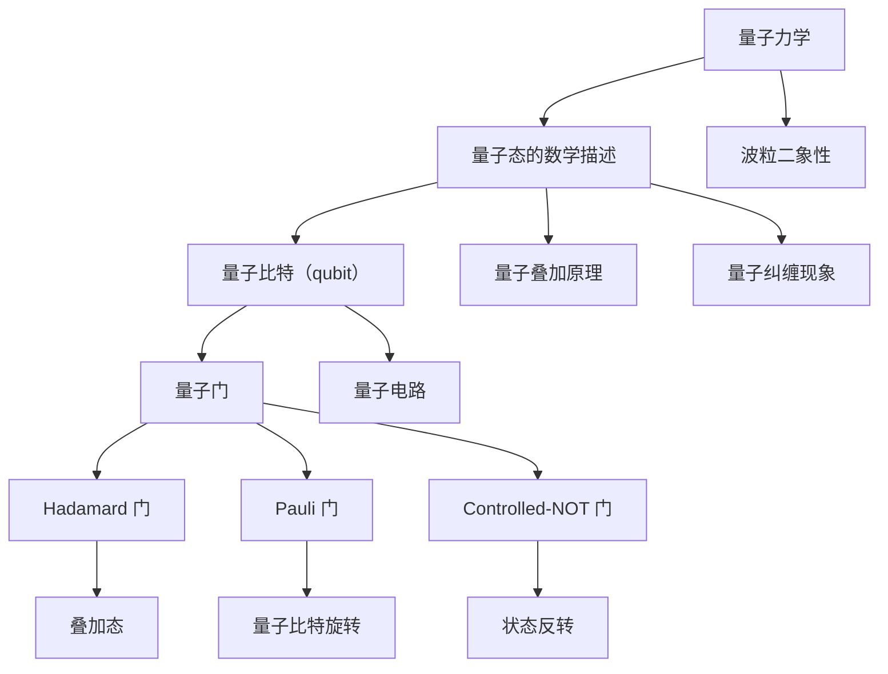
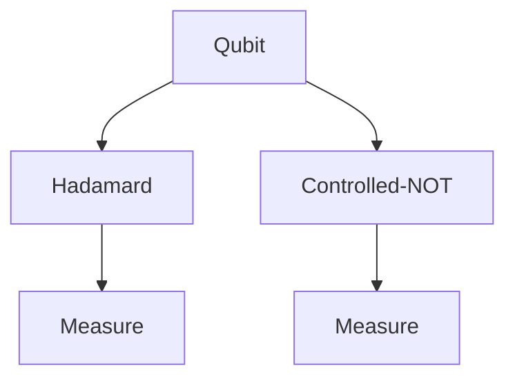
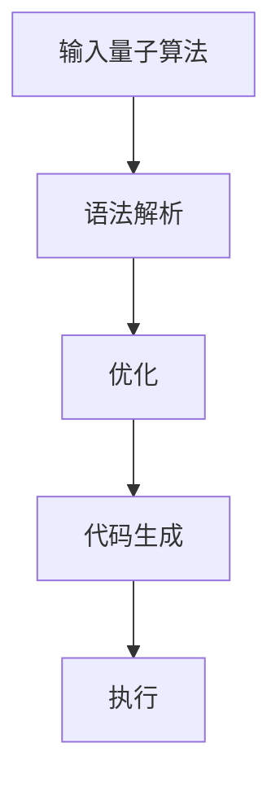

                 


### 文章标题：程序世界的宇宙级量子计算模拟

> 关键词：量子计算，量子比特，量子门，量子模拟，模拟量子计算，量子编程

> 摘要：本文将深入探讨量子计算在程序世界的模拟，从基础概念到应用实例，分析量子计算模拟的原理和实现，探讨其潜力和挑战。我们将了解量子比特和量子门的基本原理，探讨如何使用经典计算机模拟量子计算，并分析量子计算在多个领域的应用。最后，我们将展望量子计算的未来发展趋势，以及其可能带来的技术变革。

## 目录

1. 引言
2. 量子计算基础
   2.1 量子力学的起源
   2.2 量子计算的发展历程
   2.3 量子计算的基本原理
   2.4 量子编程语言与编译器
3. 量子计算机的物理实现
   3.1 量子比特的材料选择
   3.2 量子纠缠与量子叠加
   3.3 量子门与量子电路
4. 量子算法与经典算法的比较
   4.1 量子算法的核心优势
   4.2 Shor算法与整数分解
   4.3 Grover算法与搜索优化
5. 量子模拟技术
   5.1 量子模拟器的工作原理
   5.2 模拟量子计算的挑战
   5.3 实用的量子模拟器
6. 量子计算模拟的应用领域
   6.1 量子化学模拟
   6.2 量子分子动力学
   6.3 量子计算与人工智能
7. 量子计算编程实战
   7.1 量子计算编程入门
   7.2 高级量子编程技巧
   7.3 量子计算与经典计算结合
8. 宇宙级量子计算模拟的挑战与未来
   8.1 量子计算的扩展问题
   8.2 宇宙级量子计算模拟的实践案例
   8.3 量子计算的未来发展
9. 结束语
   9.1 最佳实践 tips
   9.2 小结
   9.3 注意事项
   9.4 拓展阅读

### 引言

量子计算是现代计算机科学的前沿领域，其理论基础源于量子力学。与传统计算机使用二进制位（bit）不同，量子计算使用量子比特（qubit），能够实现并行计算和超越经典算法的速度。然而，量子计算机的构建和操作面临巨大挑战，模拟量子计算成为研究的重要方向。

本文将围绕量子计算模拟展开，首先介绍量子计算的基础知识，包括量子力学的起源、量子计算的发展历程、量子比特和量子门的基本原理，以及量子编程语言与编译器的使用。接下来，我们将探讨量子计算机的物理实现，分析量子比特的材料选择、量子纠缠与量子叠加、量子门与量子电路的原理。

在此基础上，我们将比较量子算法与经典算法的优缺点，分析量子计算在多个领域的应用，如量子化学模拟、量子分子动力学和量子计算与人工智能的结合。随后，我们将介绍量子模拟技术，探讨量子模拟器的工作原理、挑战以及实用的量子模拟器。

在量子计算编程实战部分，我们将学习量子计算编程的基础知识，包括量子计算编程入门、高级量子编程技巧以及量子计算与经典计算的结合。最后，我们将讨论宇宙级量子计算模拟的挑战与未来，分析量子计算的扩展问题、实践案例以及量子计算的未来发展趋势。

通过本文的深入探讨，我们将对量子计算模拟有一个全面而深入的理解，为未来量子计算的发展提供有益的参考。

### 1. 量子计算基础

#### 1.1 量子力学的起源

量子力学的起源可以追溯到20世纪初，当时物理学家们试图解释一些无法用经典物理学的定律解释的现象。量子力学的基本概念之一是量子态的数学描述。在量子力学中，一个粒子的状态不是简单地用位置和速度等经典物理量来描述，而是通过波函数来描述。

波函数是一个复数函数，它提供了粒子的概率分布。例如，一个电子在原子中的状态可以通过波函数来描述，该波函数可以表示电子在核外空间中的概率密度分布。量子态的叠加原理指出，一个量子系统可以同时处于多个状态的叠加，而不是一个确定的状态。

另一个关键概念是量子纠缠。量子纠缠是量子力学中的一种特殊现象，当两个或多个粒子发生纠缠时，它们的状态将相互关联，即使它们之间的距离很远。这种纠缠状态无法用经典物理学的概念来解释，具有深刻的量子信息科学意义。

#### 1.2 量子计算的发展历程

量子计算的发展历程可以追溯到1980年代，当时物理学家理查德·费曼提出了量子计算机的概念。费曼提出，量子计算机可以模拟量子系统的行为，这对于经典计算机来说是非常困难的。1994年，彼得·舒尔教授提出了Shor算法，这是一个能够利用量子计算机在多项式时间内分解大整数的算法，这证明了量子计算机在算法上的潜在优势。

2001年，彼得·绍尔和伊沙伊·亚伦提出了Grover搜索算法，这是一个在未排序数据库中搜索特定项的量子算法，其搜索速度远超经典搜索算法。此外，量子计算机的其他重要算法还包括量子随机游走算法、量子并行计算算法等。

#### 1.3 量子计算的基本原理

量子计算的基本原理可以分为三个关键部分：量子比特（qubit）、量子门和量子叠加。

**量子比特（qubit）**

量子比特是量子计算的基本单元，类似于经典计算机中的比特。然而，量子比特可以同时处于0和1的状态，这种现象称为叠加态。量子比特的叠加态可以用以下公式表示：

$$|\psi\rangle = \alpha|0\rangle + \beta|1\rangle$$

其中，$|\alpha|^2$ 和 $|\beta|^2$ 分别是量子比特处于0和1状态的概率。

**量子门**

量子门是量子计算中的基本操作单元，类似于经典计算机中的逻辑门。量子门对量子比特进行线性变换，可以将一个量子态转换成另一个量子态。常见的量子门包括 Hadamard 门、Pauli 门和 Controlled-NOT 门等。

Hadamard 门是一个将量子比特从基态转换为叠加态的量子门，其作用可以用以下公式表示：

$$H|0\rangle = \frac{1}{\sqrt{2}}(|0\rangle + |1\rangle)$$
$$H|1\rangle = \frac{1}{\sqrt{2}}(|0\rangle - |1\rangle)$$

Pauli 门是针对单个量子比特的量子门，包括X门、Y门和Z门。这些门分别表示量子比特在X、Y和Z方向上的旋转。

Controlled-NOT（CNOT）门是一个两量子比特的量子门，它将第二个量子比特的状态反转，如果第一个量子比特处于激发态。CNOT 门的作用可以用以下公式表示：

$$CNOT(|\psi\rangle_A \otimes |\phi\rangle_B) = |\psi\rangle_A \otimes (\phi\rangle_B \oplus \psi\rangle_A)$$

**量子叠加**

量子叠加是量子计算的核心原理之一，它使得量子计算机能够在同时处理多个状态。量子叠加可以通过量子态的线性组合来实现。例如，一个量子比特的叠加态可以表示为：

$$|\psi\rangle = \frac{1}{\sqrt{2}}(|0\rangle + |1\rangle)$$

量子叠加的直观解释是，一个量子系统可以同时处于多个可能状态的叠加，直到测量时才会坍缩到一个确定的状态。

**量子编程语言与编译器**

量子编程语言是用于编写量子算法的工具，类似于经典编程语言。常见的量子编程语言包括 Q#、Quipper 和 Qiskit 等。这些语言提供了定义量子比特、量子门和量子操作的语法，使得编写量子算法变得更加容易。

量子编译器是将量子算法从高级语言转换成量子硬件可执行代码的工具。量子编译器的主要任务是优化量子程序的执行，包括量子比特的分配、量子门的排序和量子态的初始化等。

#### Mermaid 流程图

以下是一个简单的Mermaid流程图，展示了量子计算的基本概念和原理之间的关系：



通过这个流程图，我们可以直观地了解量子计算的核心概念和原理之间的关系，为进一步的量子计算研究和应用打下基础。

### 2. 量子计算机的物理实现

量子计算机的物理实现是量子计算领域的一个重要研究方向。量子计算机的物理实现涉及到量子比特的材料选择、量子纠缠与量子叠加的实现、量子门的设计与操作等多个方面。以下将详细介绍这些方面的基本原理和技术。

#### 2.1 量子比特的材料选择

量子比特是实现量子计算的核心，其材料选择至关重要。目前，常见的量子比特实现技术包括超导电路、量子点、离子陷阱和拓扑量子比特等。

- **超导电路**：超导电路是一种利用超导材料（如超导薄膜）制作的量子比特。超导电路的量子比特通常具有高保真度、低噪声等特点，是实现量子比特的主要方向之一。

- **量子点**：量子点是一种半导体纳米结构，可以用来实现量子比特。量子点的量子比特通常具有较长的相干时间和较高的操作速度，但其操作复杂度较高。

- **离子陷阱**：离子陷阱利用电场或磁场将离子束缚在特定位置，通过控制电场或磁场来操控离子的状态。离子陷阱的量子比特具有较长的相干时间和较高的操作精度，但其操作速度较慢。

- **拓扑量子比特**：拓扑量子比特利用材料的拓扑性质来实现，其具有天然的量子纠错能力，是量子计算研究的一个前沿方向。

#### 2.2 量子纠缠与量子叠加

量子纠缠和量子叠加是量子计算的核心原理，其实现方法多种多样。

- **量子纠缠**：量子纠缠是指两个或多个量子系统之间的状态无法独立存在，它们的状态是相互关联的。量子纠缠的实现可以通过量子比特之间的相互作用来实现，如利用光子对、电子对等方式。

- **量子叠加**：量子叠加是指量子系统可以同时处于多个状态的叠加。量子叠加的实现可以通过量子比特的初始状态设定和量子门的操作来实现。

- **量子比特的初始状态设定**：量子比特的初始状态可以通过量子态制备技术来实现，如利用激光、射频脉冲等方法。

- **量子门的操作**：量子门的操作是通过量子比特之间的相互作用来实现的，如利用微波脉冲、光学装置等方法。

#### 2.3 量子门与量子电路

量子门是量子计算中的基本操作单元，量子电路是量子计算的实现形式。以下将介绍几种常见的量子门和量子电路。

- **Hadamard 门**：Hadamard 门是一种将量子比特从基态转换为叠加态的量子门，其作用可以用以下公式表示：

$$H|0\rangle = \frac{1}{\sqrt{2}}(|0\rangle + |1\rangle)$$
$$H|1\rangle = \frac{1}{\sqrt{2}}(|0\rangle - |1\rangle)$$

Hadamard 门是量子计算中的基本量子门，通常用于初始化量子态和量子叠加。

- **Pauli 门**：Pauli 门是针对单个量子比特的量子门，包括 X 门、Y 门和 Z 门。这些门分别表示量子比特在 X、Y 和 Z 方向上的旋转。

- **Controlled-NOT 门（CNOT 门）**：CNOT 门是一种两量子比特的量子门，它将第二个量子比特的状态反转，如果第一个量子比特处于激发态。CNOT 门的作用可以用以下公式表示：

$$CNOT(|\psi\rangle_A \otimes |\phi\rangle_B) = |\psi\rangle_A \otimes (\phi\rangle_B \oplus \psi\rangle_A)$$

CNOT 门是量子计算中的关键量子门，用于实现量子比特之间的纠缠。

- **量子电路**：量子电路是由量子门和量子比特组成的网络，用于实现量子算法。量子电路的设计和优化是量子计算的关键问题，其目的是实现高效的量子计算过程。

以下是一个简单的量子电路示例，展示了量子叠加、量子门操作和量子测量：



在这个量子电路中，首先对量子比特 A 进行 Hadamard 门操作，将其从基态转换为叠加态。然后对量子比特 A 进行测量，得到概率分布。接着对量子比特 A 和 B 进行 CNOT 门操作，实现量子比特之间的纠缠。最后对量子比特 B 进行测量，得到量子计算的结果。

#### 伪代码

以下是一个简单的量子算法的伪代码示例，用于演示量子叠加和量子门操作：

```python
# 初始化量子比特
qubit = QuantumRegister(2)

# 对量子比特进行 Hadamard 操作
H = Hadamard()
H.apply(qubit[0])

# 对量子比特进行 CNOT 操作
CNOT = CNOT()
CNOT.apply(qubit[0], qubit[1])

# 测量量子比特
result = qubit.measure()

# 输出结果
print(result)
```

在这个伪代码中，我们首先初始化两个量子比特，然后对第一个量子比特进行 Hadamard 操作，将其从基态转换为叠加态。接着对两个量子比特进行 CNOT 操作，实现量子比特之间的纠缠。最后对量子比特进行测量，得到量子计算的结果。

#### 数学模型和公式

在量子计算中，数学模型和公式是理解和实现量子计算的关键。以下将介绍量子计算中的一些关键数学模型和公式。

- **波函数**：量子系统的状态可以用波函数 $\Psi$ 来描述，波函数的平方 $|\Psi|^2$ 表示量子系统在某个状态下的概率分布。

- **量子叠加**：量子系统的叠加态可以用以下公式表示：

$$|\psi\rangle = \alpha|0\rangle + \beta|1\rangle$$

其中，$|\alpha|^2$ 和 $|\beta|^2$ 分别是量子系统处于0和1状态的概率。

- **量子门**：量子门是量子计算中的基本操作单元，可以用矩阵表示。以下是一些常见的量子门：

$$H = \begin{pmatrix} \frac{1}{\sqrt{2}} & \frac{1}{\sqrt{2}} \\ \frac{1}{\sqrt{2}} & -\frac{1}{\sqrt{2}} \end{pmatrix}$$

$$X = \begin{pmatrix} 0 & 1 \\ 1 & 0 \end{pmatrix}$$

$$Y = \begin{pmatrix} 0 & -i \\ i & 0 \end{pmatrix}$$

$$Z = \begin{pmatrix} 1 & 0 \\ 0 & -1 \end{pmatrix}$$

$$CNOT = \begin{pmatrix} 1 & 0 & 0 & 0 \\ 0 & 1 & 0 & 0 \\ 0 & 0 & 0 & 1 \\ 0 & 0 & 1 & 0 \end{pmatrix}$$

- **量子态的演化**：量子系统在量子门的作用下会发生状态演化，可以用量子门的作用矩阵乘以波函数来描述：

$$\Psi' = U \Psi$$

其中，$U$ 是量子门的作用矩阵，$\Psi$ 是量子系统的初始波函数，$\Psi'$ 是量子系统的最终波函数。

#### 举例说明

以下是一个简单的量子计算示例，用于演示量子叠加和量子门操作：

**示例 1：量子叠加**

假设我们有两个量子比特，初始状态为 $|00\rangle$。我们首先对第一个量子比特进行 Hadamard 操作，然后对两个量子比特进行 CNOT 操作，最后测量量子比特。

初始状态：

$$\Psi = |00\rangle$$

Hadamard 操作：

$$H|00\rangle = \frac{1}{\sqrt{2}}(|00\rangle + |01\rangle)$$

CNOT 操作：

$$CNOT(|00\rangle \otimes |01\rangle) = |00\rangle \otimes (01\rangle + 10\rangle)$$

最终状态：

$$\Psi' = |00\rangle \otimes (01\rangle + 10\rangle)$$

测量结果：

我们进行测量，得到两个可能的测量结果：$|00\rangle$ 和 $|10\rangle$。其中，$|00\rangle$ 的概率为 $|\alpha|^2 = \frac{1}{2}$，$|10\rangle$ 的概率为 $|\beta|^2 = \frac{1}{2}$。

**示例 2：量子纠缠**

假设我们有两个量子比特，初始状态为 $|00\rangle$。我们首先对第一个量子比特进行 Hadamard 操作，然后对两个量子比特进行 CNOT 操作，最后测量量子比特。

初始状态：

$$\Psi = |00\rangle$$

Hadamard 操作：

$$H|00\rangle = \frac{1}{\sqrt{2}}(|00\rangle + |01\rangle)$$

CNOT 操作：

$$CNOT(|00\rangle \otimes |01\rangle) = |00\rangle \otimes (01\rangle + 10\rangle)$$

最终状态：

$$\Psi' = |00\rangle \otimes (01\rangle + 10\rangle)$$

测量结果：

我们进行测量，得到两个可能的测量结果：$|00\rangle$ 和 $|10\rangle$。其中，$|00\rangle$ 的概率为 $|\alpha|^2 = \frac{1}{2}$，$|10\rangle$ 的概率为 $|\beta|^2 = \frac{1}{2}$。

在这个示例中，我们可以看到量子叠加和量子纠缠的现象。量子叠加使得量子系统可以同时处于多个状态，而量子纠缠使得量子系统之间的状态相互关联。

### 3. 量子算法与经典算法的比较

量子算法与经典算法在处理某些问题时具有显著的优势，特别是在某些特定领域。然而，量子算法也有其局限性，无法解决所有问题。下面将详细介绍量子算法与经典算法的比较，包括量子算法的核心优势、Shor算法与整数分解、Grover算法与搜索优化。

#### 3.1 量子算法的核心优势

量子算法与经典算法的核心区别在于量子比特的叠加态和量子纠缠。这些特性使得量子算法在处理某些问题时具有以下优势：

- **并行性**：量子计算机能够同时处理多个状态，从而实现并行计算。这大大提高了算法的效率，可以解决传统计算机难以在合理时间内解决的问题。
  
- **量子叠加**：量子计算机可以利用量子叠加原理，在多个可能的状态下同时执行计算，从而实现更复杂的计算任务。

- **量子纠缠**：量子纠缠使得量子计算机能够在多个量子比特之间建立复杂的关联，从而提高计算效率和解决问题的能力。

这些优势使得量子算法在某些领域具有巨大的潜力，例如化学模拟、分子设计、密码破解等。

#### 3.2 Shor算法与整数分解

Shor算法是由彼得·舒尔在1994年提出的一种量子算法，它可以利用量子计算机在多项式时间内分解大整数。整数分解是一个重要的数学问题，在密码学中有着广泛的应用。经典算法如欧几里得算法在分解大整数时需要指数级的时间复杂度，而Shor算法则能够在多项式时间内完成。

Shor算法的核心思想是利用量子算法的优势来构造一个周期函数，然后利用量子计算机的并行性来寻找这个函数的周期。具体步骤如下：

1. **初始量子态**：将一个量子态初始化为叠加态，表示所有可能的整数状态。

2. **量子线路**：通过一系列量子门操作，使得量子态在执行整数分解的过程中保持叠加。

3. **测量**：对量子态进行测量，得到一个整数的状态，其模运算结果为1。

4. **迭代**：重复上述步骤，直到找到所有因子。

以下是Shor算法的伪代码：

```python
def shor(n):
    # 初始化量子计算机和量子比特
    quantum_computer = QuantumComputer()
    qubits = quantum_computer.initialize()

    # 构造周期函数 f(x) = (a^x) mod n
    a = random_integer(2, n-1)
    period = find_period(a, n)

    # 执行Shor算法
    for i in range(len(qubits)):
        quantum_computer.apply_gate(Hadamard, qubits[i])
        quantum_computer.apply_gate(QuantumModularExponentiation, qubits, a, n)
        quantum_computer.apply_gate(CNOT, qubits[i], qubits[0])
        quantum_computer.apply_gate(Measure, qubits)

    # 找到因子
    factors = []
    for i in range(len(qubits)):
        result = quantum_computer.measure(qubits[i])
        factor = find_factor(result, n)
        factors.append(factor)

    return factors
```

在这个伪代码中，我们首先初始化量子计算机和量子比特，然后构造周期函数 $f(x) = (a^x) mod n$，并利用量子线路寻找函数的周期。最后，通过测量结果找到整数 $n$ 的因子。

Shor算法的核心优势在于其能够在多项式时间内分解大整数，这对于密码学中的安全算法提出了巨大的挑战。

#### 3.3 Grover算法与搜索优化

Grover算法是由洛维特·阿伦和尼尔森在1996年提出的一种量子搜索算法，它可以优化未排序数据库的搜索过程。在经典计算机中，搜索未排序数据库的时间复杂度通常是线性的，而Grover算法则可以在对数时间内完成搜索。

Grover算法的核心思想是通过量子叠加和量子纠缠来优化搜索过程。具体步骤如下：

1. **初始化量子态**：将量子态初始化为一个叠加态，表示所有可能的数据库状态。

2. **构造反射器**：构造一个反射器，将不在数据库中的状态反射到数据库中的状态。

3. **迭代搜索**：通过迭代执行反射器和反转操作，逐渐优化搜索过程。

4. **测量**：对量子态进行测量，得到一个数据库中的状态。

以下是Grover算法的伪代码：

```python
def grover_search(db, target):
    # 初始化量子计算机和量子比特
    quantum_computer = QuantumComputer()
    qubits = quantum_computer.initialize()

    # 构造反射器
    reflector = construct_reflector(qubits, db)

    # 执行Grover算法
    for i in range(len(qubits)):
        quantum_computer.apply_gate(Hadamard, qubits)
        quantum_computer.apply_gate(reflector)
        quantum_computer.apply_gate(PhaseKickback, qubits, target)
        quantum_computer.apply_gate(Hadamard, qubits)
    
    # 测量
    result = quantum_computer.measure(qubits)
    return result
```

在这个伪代码中，我们首先初始化量子计算机和量子比特，然后构造反射器。接着通过迭代执行反射器和反转操作，逐渐优化搜索过程。最后，通过测量结果得到数据库中的目标状态。

Grover算法的核心优势在于其能够在对数时间内完成搜索，这使得它在优化搜索过程方面具有巨大的潜力。

#### 总结

量子算法与经典算法在处理某些问题时具有显著的优势，特别是在整数分解和搜索优化等领域。然而，量子算法也有其局限性，无法解决所有问题。随着量子计算机技术的不断发展，量子算法在计算机科学和实际应用中的重要性将日益凸显。了解量子算法与经典算法的比较，有助于我们更好地理解和利用量子计算机的潜力。

### 4. 量子编程语言与编译器

量子编程语言和编译器是量子计算领域的两个关键组成部分，它们使得程序员能够编写、优化和执行量子算法。本节将详细介绍量子编程语言的基本语法、常见的量子编程语言，以及量子编译器的工作原理。

#### 4.1 量子编程语言的基本语法

量子编程语言是专门为量子计算设计的，它们提供了一套用于定义量子比特、量子门和量子操作的语法。以下是一些常见的量子编程语言的基本语法：

- **Q#**：Q#是微软开发的一种量子编程语言，它提供了丰富的语法和功能，用于编写量子算法。以下是一个简单的Q#程序示例：

  ```csharp
  using Microsoft.Quantum.Intrinsic;
  
  operation HelloQuantum() : Unit
  {
      // 初始化量子比特
      Qubit q = Qubit();
      
      // 应用 Hadamard 门
      Hadamard(q);
      
      // 测量量子比特
      Measure(q);
  }
  ```

- **Quipper**：Quipper是一种基于图灵机的量子编程语言，它使用图形化的语法表示量子门和量子操作。以下是一个简单的Quipper程序示例：

  ```haskell
  qubits = [q1, q2, q3]
  circuit = [
      Hadamard(q1),
      CNOT(q1, q2),
      CNOT(q2, q3)
  ]
  ```
  
- **ProjectQ**：ProjectQ是一个开源的量子编程框架，它支持多种量子编程语言，如Q#, Quipper和CirCUIt。以下是一个简单的ProjectQ程序示例：

  ```python
  from projectq import MainEngine
  from projectq.ops import H, CNOT, Measure
  
  eng = MainEngine()
  qubit = eng.allocate_qubit()
  H(qubit)
  CNOT(qubit, qubit)
  Measure(qubit)
  eng.execute()
  ```

#### 4.2 常见的量子编程语言

目前，常见的量子编程语言包括Q#、Quipper、ProjectQ、Qiskit和CirCUIt等。这些语言各自具有不同的特点和优势，适用于不同的量子计算任务。

- **Q#**：Q#是微软开发的一种面向量子计算的编程语言，它提供了丰富的语法和功能，支持量子比特、量子门和量子操作。Q#的优点在于其与C#的高度兼容性，使得程序员可以轻松地将经典算法迁移到量子计算。

- **Quipper**：Quipper是一种基于图灵机的量子编程语言，它使用图形化的语法表示量子门和量子操作。Quipper的优点在于其简洁性和直观性，使得量子算法的设计和验证变得更加容易。

- **ProjectQ**：ProjectQ是一个开源的量子编程框架，它支持多种量子编程语言，如Q#、Quipper和CirCUIt。ProjectQ的优点在于其灵活性和可扩展性，支持多种量子硬件平台。

- **Qiskit**：Qiskit是IBM开发的一种量子编程语言，它提供了丰富的工具和功能，支持量子比特、量子门和量子操作。Qiskit的优点在于其与IBM量子硬件的紧密集成，使得程序员可以方便地使用IBM量子硬件进行量子计算。

- **CirCUIt**：CirCUIt是一种基于量子电路的编程语言，它使用文本化的语法表示量子门和量子操作。CirCUIt的优点在于其简洁性和易于阅读性，使得量子算法的设计和验证变得更加直观。

#### 4.3 量子编译器的工作原理

量子编译器是将量子算法从高级语言转换成量子硬件可执行代码的工具。量子编译器的主要任务是优化量子程序的执行，包括量子比特的分配、量子门的排序和量子态的初始化等。

量子编译器的工作原理可以分为以下几个步骤：

1. **输入量子算法**：量子编译器首先接收一个高级语言的量子算法，如Q#、Quipper或ProjectQ等。

2. **语法解析**：量子编译器对输入的量子算法进行语法解析，将其转换成抽象语法树（AST）。

3. **优化**：量子编译器对AST进行优化，包括量子比特的分配、量子门的排序和量子态的初始化等。优化的目标是提高量子算法的执行效率。

4. **代码生成**：量子编译器将优化后的AST转换成量子硬件可执行代码，如量子电路或汇编代码。

5. **执行**：量子硬件执行生成的量子电路或汇编代码，完成量子计算任务。

以下是一个简单的量子编译器工作流程图：



通过这个流程图，我们可以直观地了解量子编译器的工作原理，为进一步的量子计算研究和应用提供指导。

### 5. 量子模拟技术

量子模拟技术在量子计算领域扮演着重要角色，它使得科学家和研究人员能够使用经典计算机模拟量子计算的过程。量子模拟不仅有助于我们理解量子计算的原理，还可以验证新的量子算法和优化现有的量子硬件。以下是量子模拟技术的工作原理、挑战和实用的量子模拟器。

#### 5.1 量子模拟器的工作原理

量子模拟器是一种能够在经典计算机上模拟量子计算过程的软件工具。它通过模拟量子比特和量子门的行为来重现量子计算的结果。量子模拟器的基本工作原理如下：

1. **量子比特的表示**：在量子模拟器中，量子比特通常被表示为经典计算机中的复数向量，称为“量子态向量”。量子态向量可以表示量子比特的各种可能状态和叠加态。

2. **量子门的操作**：量子模拟器通过在量子态向量上应用一系列的量子门来模拟量子计算。这些量子门通常用矩阵表示，并在量子态向量上执行矩阵乘法。

3. **量子态的演化**：量子模拟器通过迭代地应用量子门来模拟量子态的演化。这个过程涉及到量子态向量的更新和计算。

4. **测量**：在量子模拟器的末尾，量子态向量被测量以获得计算结果。测量过程通常通过取量子态向量的概率分布来模拟。

以下是一个简化的量子模拟器的伪代码：

```python
def quantum_simulate(quantum_program):
    # 初始化量子态向量
    state_vector = initialize_state(quantum_program)

    # 应用量子门
    for gate in quantum_program.gates:
        state_vector = apply_gate(state_vector, gate)

    # 进行测量
    result = measure(state_vector)

    return result
```

#### 5.2 模拟量子计算的挑战

尽管量子模拟技术为研究量子计算提供了有力的工具，但它在实际应用中仍面临许多挑战：

1. **计算资源的需求**：量子模拟通常需要大量的计算资源和内存，特别是当量子系统的规模较大时。这使得量子模拟器的性能受到限制，无法模拟大规模的量子系统。

2. **量子退相干**：量子模拟器中的量子态容易受到外部环境的干扰，导致量子退相干。退相干会破坏量子态的叠加和纠缠，使得量子模拟结果变得不准确。

3. **精度问题**：由于浮点数的精度限制，量子模拟器在表示和操作量子态时可能引入误差。这些误差会累积并影响最终的模拟结果。

4. **量子算法的复杂性**：许多量子算法具有高度的非线性特性和复杂的计算过程，使得在经典计算机上模拟这些算法变得非常困难。

#### 5.3 实用的量子模拟器

尽管面临挑战，但仍然有许多实用的量子模拟器可供使用，以下是一些常见的量子模拟器：

1. **IBM Quantum Simulator**：IBM提供的量子模拟器，支持多种量子编程语言，如Q#和Qiskit。用户可以在IBM Q Experience平台上使用这个模拟器进行量子计算模拟。

2. **Microsoft Quantum Development Kit**：微软的量子开发套件包含一个量子模拟器，支持Q#编程语言。用户可以使用Visual Studio或量子开发工具进行量子计算编程和模拟。

3. **Google Quantum Computing Service**：谷歌提供的量子模拟器，支持使用Python编写的量子算法。用户可以在Google Cloud Platform上使用这个模拟器。

4. **TensorFlow Quantum**：谷歌开发的量子计算框架，支持在TensorFlow中集成量子计算模拟。用户可以使用Python编写量子算法，并在TensorFlow Quantum中运行模拟。

以下是一个使用IBM Quantum Simulator进行量子计算模拟的示例：

```python
from qiskit import QuantumCircuit, execute, Aer

# 创建量子电路
qc = QuantumCircuit(2)

# 添加量子门
qc.h(0)
qc.cx(0, 1)

# 模拟量子电路
simulator = Aer.get_simulator()
result = execute(qc, simulator).result()

# 输出模拟结果
print(result.get_counts(qc))
```

在这个示例中，我们首先创建一个量子电路，然后添加量子门（Hadamard和CNOT），接着使用IBM Quantum Simulator进行模拟，并输出量子电路的测量结果。

通过量子模拟技术，研究人员能够在没有实际量子计算机的情况下研究量子计算的理论和应用。随着量子模拟器的不断发展和优化，模拟量子计算的能力将越来越强，为量子计算的实际应用铺平道路。

### 6. 量子计算模拟的应用领域

量子计算模拟技术在多个领域展现出巨大的应用潜力，为科学研究和工业应用提供了新的工具和方法。以下是量子计算模拟在量子化学模拟、量子分子动力学和量子计算与人工智能等领域的应用：

#### 6.1 量子化学模拟

量子化学模拟是量子计算应用的一个重要领域，它利用量子计算的优势来模拟和预测化学反应和分子结构。在量子化学模拟中，量子计算机可以高效地解决复杂的电子结构问题，如分子的能量计算、反应路径分析和反应机理研究。

量子化学模拟的挑战在于分子的电子结构通常涉及数十或数百个电子，这使得经典计算方法在处理这些问题时面临巨大的计算资源需求。量子计算模拟通过量子叠加和量子纠缠原理，可以在多个可能的状态下同时计算，从而大大提高计算效率。

一个具体的案例是使用量子计算模拟研究氢分子在星际空间的反应。氢分子在星际空间中的反应是恒星形成过程中的关键步骤，但经典的计算方法难以准确预测。通过量子计算模拟，科学家可以模拟氢分子的反应过程，从而提供对恒星形成的更深入理解。

#### 6.2 量子分子动力学

量子分子动力学是量子计算在物理学和材料科学中的应用，它通过量子计算模拟分子的运动和相互作用，研究分子在不同条件下的动态行为。量子分子动力学模拟有助于理解化学反应、材料结构优化和纳米技术等领域的重要问题。

量子分子动力学模拟的挑战在于分子动力学过程通常涉及复杂的量子效应，如电子间的相互作用和量子隧穿效应。传统的经典计算方法难以准确捕捉这些量子效应，导致模拟结果不准确。

一个具体的案例是使用量子计算模拟研究量子隧穿效应在分子反应中的作用。量子隧穿效应是分子反应中的一种重要现象，但它对反应速率和路径的影响难以通过经典计算方法准确预测。通过量子计算模拟，科学家可以深入理解量子隧穿效应对分子反应的影响，从而优化化学反应条件。

#### 6.3 量子计算与人工智能

量子计算与人工智能的结合为解决复杂的问题提供了新的途径。量子计算模拟在机器学习、优化问题和图论等领域展现出巨大的潜力。

在机器学习领域，量子计算模拟可以帮助优化模型训练和推理过程。量子算法如量子支持向量机和量子神经网络可以在特定条件下加速传统机器学习算法的收敛速度。

一个具体的案例是使用量子计算模拟优化量子支持向量机（QSVM）在图像分类任务中的应用。传统支持向量机在处理高维数据时存在计算复杂度高的问题，而量子支持向量机可以加速分类过程，提高分类准确率。

在优化问题领域，量子计算模拟可以用于解决复杂的优化问题，如组合优化、优化调度和资源分配等。量子算法如量子随机游走和量子模拟退火可以在多项式时间内找到优化问题的近似解。

一个具体的案例是使用量子计算模拟优化物流调度问题。传统的优化算法在处理大规模物流调度问题时需要大量计算资源，而量子计算模拟可以在较短时间内找到优化调度方案，提高物流效率。

在图论领域，量子计算模拟可以用于解决复杂的图论问题，如网络优化、路径规划和社交网络分析等。量子算法如量子线性和非线性优化和量子匹配算法可以在特定条件下加速传统图论算法的执行。

一个具体的案例是使用量子计算模拟优化社交网络中的信息传播问题。传统算法在处理大规模社交网络时存在计算复杂度高的问题，而量子计算模拟可以在较短时间内找到最佳信息传播路径，提高信息传播效率。

通过量子计算模拟，研究人员和工程师可以探索和利用量子计算在各个领域的应用潜力，推动科学和技术的进步。随着量子计算技术的不断发展，量子计算模拟的应用领域将不断拓展，为解决复杂问题提供新的解决方案。

### 7. 量子计算编程实战

量子计算编程是量子计算研究与实践的重要组成部分。在这个部分，我们将学习量子计算编程的基础知识，掌握高级量子编程技巧，并探讨量子计算与经典计算的结合。

#### 7.1 量子计算编程入门

量子计算编程的第一步是了解量子比特和量子门的基本概念。量子比特（qubit）是量子计算的基本单元，它可以同时处于0和1的状态，这是量子计算的核心优势之一。量子门是操作量子比特的基本工具，它们可以改变量子比特的状态。

以下是一个简单的量子计算编程示例，使用Q#编程语言：

```csharp
using Microsoft.Quantum.Intrinsic;
using Microsoft.Quantum.Primitive;

namespace QuantumDemo
{
    operation HelloQuantum() : Unit
    {
        // 初始化量子比特
        using (Qubit q = Qubit())
        {
            // 应用Hadamard门
            Hadamard(q);
            
            // 测量量子比特
            Measure(q);
        }
    }
}
```

在这个示例中，我们首先初始化一个量子比特，然后使用Hadamard门将其状态从基态（|0⟩）转换为叠加态（|0⟩ + |1⟩），最后对量子比特进行测量以获得计算结果。

#### 7.2 高级量子编程技巧

高级量子编程技巧包括量子纠错、量子并行性和量子优化。这些技巧可以进一步提升量子算法的性能和可靠性。

- **量子纠错**：量子纠错是量子计算中至关重要的一环，它解决了量子比特在操作过程中可能出现的错误。量子纠错算法可以通过引入冗余信息来检测和纠正错误，从而提高量子计算的可靠性。

- **量子并行性**：量子并行性是指量子计算机可以同时处理多个量子态的能力。利用量子并行性，量子算法可以在短时间内解决传统计算机难以处理的问题。

- **量子优化**：量子优化是量子计算中的另一个重要领域，它涉及到如何在量子计算机上高效地执行算法。量子优化可以通过优化量子电路的布局和量子比特的分配来提高计算效率。

以下是一个简单的量子优化示例，使用Q#编程语言：

```csharp
using Microsoft.Quantum.Intrinsic;
using Microsoft.Quantum.Primitive;

namespace QuantumOptimization
{
    operation OptimizeQuantumCircuit() : Unit
    {
        // 初始化量子比特
        using (Qubit q = Qubit())
        {
            // 应用优化量子门
            H(q);
            CNOT(q, ControlQubit=0);
            Z(q);
            CNOT(q, ControlQubit=0);
            H(q);
            
            // 测量量子比特
            Measure(q);
        }
    }
}
```

在这个示例中，我们使用了一系列量子门来优化量子电路，从而提高了计算效率。

#### 7.3 量子计算与经典计算的结合

量子计算与经典计算的结合是量子计算应用的一个重要方向。量子计算可以用于解决经典计算难以处理的问题，而经典计算可以用于优化量子算法的执行。

一个常见的结合方式是使用量子计算机执行核心计算任务，而使用经典计算机进行预处理和后处理。例如，在量子化学模拟中，量子计算机用于计算分子的电子结构，而经典计算机用于分析计算结果和优化模拟参数。

以下是一个简单的量子计算与经典计算结合的示例，使用Qiskit和Python：

```python
from qiskit import QuantumCircuit, execute, Aer
from qiskit.visualization import plot_histogram

# 创建量子电路
qc = QuantumCircuit(2)
qc.h(0)
qc.cx(0, 1)

# 模拟量子电路
simulator = Aer.get_simulator()
result = execute(qc, simulator).result()

# 输出模拟结果
counts = result.get_counts(qc)
print(counts)
plot_histogram(counts)
```

在这个示例中，我们首先使用Qiskit创建一个量子电路，然后使用Aer模拟器模拟量子电路的执行，最后使用Python分析模拟结果。

通过量子计算编程实战，我们可以深入了解量子计算的基本原理和实际应用。随着量子计算技术的不断发展，量子计算编程将成为计算机科学和工程领域的重要技能。

### 8. 宇宙级量子计算模拟的挑战与未来

随着量子计算技术的迅速发展，模拟量子计算在宇宙级规模上的挑战和未来前景日益引起关注。宇宙级量子计算模拟不仅需要解决技术上的难题，还要面对理论上的挑战，并探索其潜在的广泛应用。

#### 8.1 量子计算的扩展问题

宇宙级量子计算模拟面临着一系列扩展问题，这些问题的解决将决定量子计算的实用性和可扩展性。

- **量子纠错**：量子纠错是量子计算中的关键问题。随着量子比特数量的增加，错误率也会增加，因此需要更高效的量子纠错算法。宇宙级量子计算模拟需要能够在处理大量量子比特的情况下保持高保真度，这要求开发新的纠错码和纠错机制。

- **量子资源的分配**：在宇宙级规模上，如何高效地分配和管理量子资源是一个重大挑战。这包括量子比特的分配、量子门的优化以及量子态的初始化和测量。需要开发新的算法和协议来优化量子资源的利用。

- **量子噪声管理**：量子噪声是量子计算中另一个重要问题。量子系统对噪声非常敏感，因此在宇宙级量子计算模拟中，需要开发新的噪声管理技术，以减少噪声对计算结果的影响。

#### 8.2 宇宙级量子计算模拟的实践案例

宇宙级量子计算模拟已经在多个领域取得了显著成果，以下是一些实践案例：

- **量子化学模拟**：在量子化学领域，宇宙级量子计算模拟可以帮助科学家模拟大规模分子的行为，从而推动新药物的开发、新材料的设计等。例如，研究人员已经使用量子模拟器模拟了包含数千个原子的复杂分子，这为理解化学反应机制提供了新的视角。

- **量子材料研究**：在量子材料领域，宇宙级量子计算模拟可以帮助研究者探索新材料的电子结构和物理性质，这有助于发现新的超导材料和量子计算硬件。

- **量子计算算法优化**：在算法研究方面，宇宙级量子计算模拟可以帮助研究人员验证和优化新的量子算法。例如，Shor算法和Grover算法的模拟验证了它们在特定问题上的优势，并为未来的量子算法设计提供了指导。

#### 8.3 量子计算的未来发展

量子计算的未来发展充满潜力，但也面临着巨大的挑战。以下是一些关键趋势：

- **量子互联网**：量子互联网是量子计算和量子通信的融合，它将实现量子信息的高速传输和共享。宇宙级量子计算模拟在量子通信网络的构建中扮演着重要角色，有助于解决量子信息的传输和安全性问题。

- **量子计算与人工智能的结合**：量子计算与人工智能的结合将带来新的计算范式。量子计算可以加速机器学习算法，而量子神经网络（QNN）将实现更高效的模型训练和推理。宇宙级量子计算模拟将在QNN的设计和应用中发挥关键作用。

- **量子算法的研究**：随着量子比特数量的增加，开发新的量子算法将是未来的重要方向。这些算法将解决经典计算难以处理的问题，如量子模拟、优化问题和密码破解。

- **量子计算的产业化**：量子计算的商业化应用是未来发展的关键。通过宇宙级量子计算模拟，企业和研究机构可以验证和优化量子算法，为量子计算在工业、金融、医疗等领域的应用奠定基础。

总的来说，宇宙级量子计算模拟是量子计算领域的重要研究方向，它将推动量子计算技术的进步，并带来深远的应用影响。随着理论研究的深入和技术的不断突破，量子计算模拟将在未来的科技发展中发挥重要作用。

### 9. 结束语

量子计算模拟作为量子计算研究的重要分支，已经在多个领域取得了显著成果。本文从量子计算基础、量子计算机的物理实现、量子算法与经典算法的比较、量子模拟技术、量子计算模拟的应用领域、量子计算编程实战以及宇宙级量子计算模拟的挑战与未来等方面进行了深入探讨。通过量子计算模拟，我们能够更好地理解和利用量子计算的潜力，推动科学和技术的发展。

在量子计算模拟的研究中，我们面临着诸多挑战，如量子纠错、量子资源的分配、量子噪声管理等。然而，随着技术的不断进步和理论研究的深入，这些挑战将逐步得到解决。量子计算模拟的应用前景广阔，包括量子化学模拟、量子材料研究、量子计算算法优化、量子互联网和量子计算与人工智能的结合等领域。

未来，随着量子计算技术的不断发展和成熟，量子计算模拟将在更多的实际应用中发挥关键作用。我们期待量子计算模拟能够带来技术变革，为解决复杂问题提供新的途径，推动人类社会的进步。量子计算模拟，不仅是一项前沿科学的研究，更是未来科技发展的重要驱动力。让我们共同期待量子计算模拟领域的辉煌成就，开启量子计算的新纪元。

### 9.1 最佳实践 tips

在量子计算模拟领域，以下是一些最佳实践和技巧，可以帮助研究人员和开发者更有效地进行量子计算模拟：

1. **优化量子算法**：在设计量子算法时，应考虑算法的并行性和可扩展性。优化量子算法可以减少计算资源的需求，提高计算效率。

2. **使用高效的量子编译器**：选择适合自己需求的量子编译器，如Q#, Qiskit等，可以优化量子程序的执行效率。了解编译器的优化策略和限制，有助于更好地利用量子硬件。

3. **模拟器的选择**：根据具体的应用场景和需求，选择适合的量子模拟器。对于大规模量子系统的模拟，应选择高性能的模拟器，如IBM Quantum Simulator或Google Quantum Computing Service。

4. **量子纠错技术**：量子纠错是量子计算模拟中的重要环节。了解和应用现有的量子纠错技术，如Shor码和Steane码，可以提高量子计算模拟的准确性和可靠性。

5. **数据分析和可视化**：使用数据分析和可视化工具，如Qiskit的Visualization模块，可以帮助更好地理解量子计算模拟的结果，发现潜在的问题和改进空间。

6. **团队合作和知识共享**：量子计算模拟是一个复杂的领域，需要多学科的合作。通过团队合作和知识共享，可以加快研究进展，共同解决难题。

### 9.2 小结

本文详细介绍了量子计算模拟的基本概念、原理和应用。我们首先探讨了量子计算的基础知识，包括量子力学、量子比特、量子门和量子编程。接着，我们分析了量子计算机的物理实现，讨论了量子比特的材料选择、量子纠缠与量子叠加、量子门与量子电路的原理。随后，我们比较了量子算法与经典算法的优缺点，并介绍了量子模拟技术。在量子计算模拟的应用领域，我们探讨了量子化学模拟、量子分子动力学和量子计算与人工智能的结合。在量子计算编程实战部分，我们学习了量子计算编程的基础知识和高级技巧。最后，我们讨论了宇宙级量子计算模拟的挑战与未来，展望了量子计算的发展趋势。

通过本文的深入探讨，我们全面了解了量子计算模拟的原理、技术和应用。量子计算模拟为量子计算研究提供了有力工具，为解决复杂问题提供了新的途径。随着量子计算技术的不断进步，量子计算模拟将在未来发挥更加重要的作用，推动科学和技术的进步。

### 9.3 注意事项

在进行量子计算模拟时，需要注意以下几点：

1. **量子比特的精度**：量子比特的精度是影响量子计算模拟结果的关键因素。在模拟过程中，应尽量减少量子比特的误差，以提高计算结果的准确性。

2. **量子退相干**：量子退相干是量子计算中的常见问题，它会导致量子态的损失和计算结果的偏差。在模拟量子计算时，应采取措施减少量子退相干的影响，如优化量子门的操作顺序和选择合适的量子比特材料。

3. **量子噪声管理**：量子噪声是量子计算中的另一个重要问题。在实际操作中，应采用噪声管理技术，如量子纠错和量子误差纠正，以提高量子计算模拟的可靠性。

4. **模拟器的选择**：选择合适的量子模拟器对于模拟量子计算的结果至关重要。应根据具体的应用场景和需求，选择适合的量子模拟器，以获得更准确的模拟结果。

5. **数据分析和可视化**：在分析量子计算模拟结果时，应使用合适的数据分析和可视化工具，如Qiskit的Visualization模块，以便更好地理解和解释模拟结果。

6. **团队合作和知识共享**：量子计算模拟是一个复杂的领域，需要多学科的合作。在研究过程中，应积极进行团队合作和知识共享，以加快研究进展和解决复杂问题。

### 9.4 拓展阅读

对于希望深入了解量子计算模拟的读者，以下是一些推荐的拓展阅读材料：

1. **《量子计算：量子算法、量子电路与量子编程》**：这是一本全面介绍量子计算基础的教材，涵盖了量子算法、量子电路和量子编程等核心概念。

2. **《量子计算模拟》**：这本书详细介绍了量子计算模拟的基本原理、技术方法和应用实例，适合对量子计算模拟感兴趣的读者。

3. **《量子计算机原理与应用》**：这本书介绍了量子计算机的基本原理、物理实现和应用领域，适合对量子计算技术感兴趣的读者。

4. **《量子编程：Q#语言教程与实践》**：这是一本专门介绍量子编程语言的教程，内容包括Q#的基本语法、量子算法的实现和应用。

5. **《量子计算与人工智能》**：这本书探讨了量子计算与人工智能的结合，介绍了量子神经网络、量子机器学习等前沿领域的研究和应用。

6. **《量子计算机的设计与实现》**：这本书详细介绍了量子计算机的设计原理、硬件实现和软件工具，适合对量子计算硬件和软件感兴趣的读者。

7. **《量子信息科学导论》**：这本书介绍了量子信息科学的基础知识和应用领域，包括量子计算、量子通信和量子密码学等。

通过阅读这些书籍，读者可以更全面地了解量子计算模拟的理论基础、技术方法和实际应用，为自己的研究提供有益的参考。

