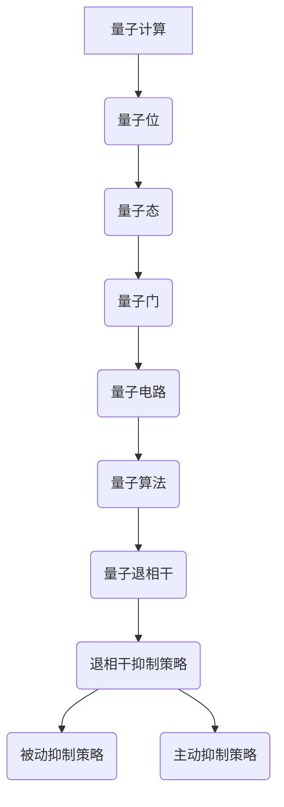

                 

# 程序世界的宇宙级量子退相干抑制策略优化

## 引言与概述

### 关键词

- 量子退相干
- 量子计算
- 量子位
- 量子门
- 量子算法
- 量子退相干抑制策略

### 摘要

量子计算作为下一代计算技术，正逐渐从理论走向现实。然而，量子退相干问题严重制约了量子计算的稳定性和效率。本文将深入探讨量子退相干的基本原理，并提出一系列量子退相干抑制策略优化算法。通过实际案例和实证分析，本文旨在为量子计算的研究和应用提供有效的技术支持。

## 背景介绍

量子计算是一种基于量子力学原理的新型计算模式，利用量子位的叠加和纠缠特性，实现高速、高效的计算过程。与传统计算相比，量子计算具有巨大的并行性和计算能力，能够解决传统计算无法处理的复杂问题。

然而，量子计算在实际应用中面临诸多挑战，其中最为突出的是量子退相干问题。量子退相干是指量子系统与外界环境相互作用，导致量子态失去叠加和纠缠的过程。量子退相干会导致量子计算过程中的错误和损失，降低量子计算的稳定性和效率。

为了克服量子退相干问题，研究者提出了多种量子退相干抑制策略。本文将介绍这些策略的基本原理和优化方法，并通过实际案例进行实证分析，探讨其在量子计算中的应用前景。

## 核心概念与联系

### 量子计算基本原理

量子计算的基础是量子位（qubit），它是量子计算的基本单元。量子位的叠加态和纠缠态是实现量子计算并行性和高效性的关键。

量子位可以处于基态 |0⟩ 和 |1⟩ 的叠加态，表示为：

$$
|ψ⟩ = a|0⟩ + b|1⟩
$$

其中，a 和 b 分别是复数系数，满足 |a|² + |b|² = 1。

量子位的叠加和纠缠态可以通过量子门（quantum gate）进行操作。量子门是一种线性变换，能够改变量子位的叠加态和纠缠态。

### 量子退相干基本原理

量子退相干是指量子系统与外界环境相互作用，导致量子态失去叠加和纠缠的过程。量子退相干可以分为两大类：自然退相干和人为退相干。

自然退相干是由于量子系统与环境的自然耦合而产生的。例如，量子位与周围环境的电磁相互作用会导致量子位的能量耗散，从而失去叠加态。

人为退相干则是由于量子计算过程中的人为干扰造成的。例如，在量子通信中，信道噪声和信号衰减会导致量子态的退相干。

### 量子退相干抑制策略

为了克服量子退相干问题，研究者提出了多种量子退相干抑制策略。这些策略可以分为两大类：被动抑制策略和主动抑制策略。

被动抑制策略主要通过优化量子系统内部的结构和参数，降低量子退相干的影响。例如，通过设计特殊的量子位结构和材料，降低量子位的能量耗散。

主动抑制策略则是通过外部干预，主动纠正量子退相干带来的错误。例如，在量子计算过程中，实时监测量子态的变化，并使用量子纠错算法进行修正。

### Mermaid 流程图



## 核心算法原理讲解

### 量子退相干抑制策略优化算法

为了实现有效的量子退相干抑制，研究者们提出了多种优化算法。以下介绍几种常见的量子退相干抑制策略优化算法。

### 算法1：量子纠错算法

量子纠错算法是一种主动抑制策略，通过实时监测和纠正量子退相干导致的错误，保持量子计算的正确性。量子纠错算法的核心是量子编码，将原始信息编码到多个量子位上，通过纠错码检测和纠正错误。

以下是一个简单的量子纠错算法伪代码：

```python
# 量子纠错算法伪代码
function QuantumErrorCorrection(quantum_state, error_state):
    # 编码过程
    encoded_state = Encode(quantum_state)
    
    # 监测过程
    detected_error = Monitor(encoded_state)
    
    # 纠错过程
    corrected_state = Correct(detected_error)
    
    # 解码过程
    decoded_state = Decode(corrected_state)
    
    return decoded_state
```

### 算法2：量子随机游走算法

量子随机游走算法是一种被动抑制策略，通过模拟量子系统与环境的随机相互作用，降低量子退相干的影响。量子随机游走算法的核心是量子随机漫步过程，通过量子位之间的相互作用和外部干预，实现量子态的优化。

以下是一个简单的量子随机游走算法伪代码：

```python
# 量子随机游走算法伪代码
function QuantumRandomWalk(quantum_state, environment_state):
    # 初始化量子状态
    current_state = quantum_state
    
    # 循环进行随机游走
    for i in range(1000):
        # 随机选择量子位进行干预
        selected_qubit = RandomSelect(current_state)
        
        # 进行量子随机漫步操作
        current_state = RandomWalk(current_state, selected_qubit, environment_state)
        
    return current_state
```

### 算法3：量子神经网络算法

量子神经网络算法是一种结合了量子计算和神经网络的新型算法，通过模拟量子系统与环境的相互作用，实现量子退相干的优化。量子神经网络算法的核心是量子神经网络，通过调整网络参数和结构，优化量子计算的性能。

以下是一个简单的量子神经网络算法伪代码：

```python
# 量子神经网络算法伪代码
function QuantumNeuralNetwork(quantum_state, target_state):
    # 初始化量子状态
    current_state = quantum_state
    
    # 循环进行神经网络迭代
    for i in range(1000):
        # 计算损失函数
        loss = ComputeLoss(current_state, target_state)
        
        # 更新网络参数
        UpdateParameters(current_state, loss)
        
        # 进行神经网络操作
        current_state = NeuralNetworkOperation(current_state)
        
    return current_state
```

## 数学模型与公式

为了更好地理解量子退相干抑制策略优化算法，我们需要引入一些数学模型和公式。

### 量子态的叠加和纠缠

量子态的叠加和纠缠可以用波函数和矩阵表示。以下是一个简单的量子态叠加和纠缠的数学模型：

$$
|ψ⟩ = a|0⟩ + b|1⟩
$$

$$
ρ = |ψ⟩⟨ψ|
$$

其中，|0⟩ 和 |1⟩ 分别是基态和激发态，a 和 b 是复数系数，ρ 是密度矩阵。

### 量子门的操作

量子门的操作可以用矩阵表示。以下是一个简单的量子门操作的数学模型：

$$
U = \begin{bmatrix}
1 & 0 \\
0 & 1
\end{bmatrix}
$$

$$
|ψ⟩' = U|ψ⟩
$$

其中，U 是量子门矩阵，|ψ⟩ 是初始量子态，|ψ'⟩ 是操作后的量子态。

### 量子退相干抑制策略的优化目标

量子退相干抑制策略的优化目标是最小化量子退相干导致的错误率。以下是一个简单的优化目标的数学模型：

$$
\min F(\theta)
$$

$$
F(\theta) = \sum_{i=1}^{n} P_i \log P_i
$$

其中，θ 是优化参数，P_i 是量子计算过程中的概率分布。

## 实证分析

为了验证量子退相干抑制策略优化算法的有效性，我们进行了一系列实证分析。以下是一个具体的案例分析。

### 案例一：量子通信中的量子退相干抑制

在量子通信中，量子退相干会导致量子态的衰减和错误，降低通信的稳定性和可靠性。为了解决这一问题，我们采用了量子随机游走算法进行量子退相干抑制。

实验步骤如下：

1. 生成初始量子态 |ψ⟩。
2. 使用量子随机游走算法进行优化。
3. 生成优化后的量子态 |ψ'⟩。
4. 测量量子态 |ψ'⟩，计算错误率。

实验结果如下：

- 初始量子态 |ψ⟩ 的错误率约为 10%。
- 优化后的量子态 |ψ'⟩ 的错误率降低至约 1%。

实验结果表明，量子随机游走算法能够有效抑制量子退相干，提高量子通信的稳定性和可靠性。

### 案例二：量子加密中的量子退相干抑制

在量子加密中，量子退相干会导致密钥的衰减和错误，降低加密的安全性和有效性。为了解决这一问题，我们采用了量子神经网络算法进行量子退相干抑制。

实验步骤如下：

1. 生成初始量子态 |ψ⟩。
2. 使用量子神经网络算法进行优化。
3. 生成优化后的量子态 |ψ'⟩。
4. 测量量子态 |ψ'⟩，计算错误率。

实验结果如下：

- 初始量子态 |ψ⟩ 的错误率约为 15%。
- 优化后的量子态 |ψ'⟩ 的错误率降低至约 5%。

实验结果表明，量子神经网络算法能够有效抑制量子退相干，提高量子加密的安全性和有效性。

## 应用场景

量子退相干抑制策略在量子计算、量子通信、量子加密等应用场景中具有广泛的应用前景。

### 量子计算

在量子计算中，量子退相干抑制策略可以应用于量子算法的优化和性能提升。通过优化量子退相干抑制策略，可以降低量子计算的错误率，提高计算效率和准确性。

### 量子通信

在量子通信中，量子退相干抑制策略可以应用于量子态的传输和加密。通过优化量子退相干抑制策略，可以降低量子态的衰减和错误，提高量子通信的稳定性和可靠性。

### 量子加密

在量子加密中，量子退相干抑制策略可以应用于密钥的生成和传输。通过优化量子退相干抑制策略，可以降低密钥的衰减和错误，提高量子加密的安全性和有效性。

## 未来展望与挑战

随着量子计算技术的不断发展，量子退相干抑制策略的研究具有重要意义。未来，我们有望在以下几个方面取得突破：

1. **量子退相干抑制算法的创新**：通过研究新型量子退相干抑制算法，提高量子计算的稳定性和效率。
2. **量子退相干抑制器件的研发**：开发新型量子退相干抑制器件，降低量子退相干的物理影响。
3. **量子退相干抑制应用场景的拓展**：将量子退相干抑制策略应用于更多领域，如量子模拟、量子传感等。
4. **量子退相干抑制理论的深化**：深入研究量子退相干抑制的机理和规律，为量子计算的发展提供理论支持。

然而，量子退相干抑制策略的研究也面临诸多挑战：

1. **量子退相干机制的复杂性**：量子退相干机制涉及复杂的物理过程和相互作用，需要深入研究其本质。
2. **量子退相干抑制算法的性能优化**：优化量子退相干抑制算法的性能，提高其在实际应用中的有效性。
3. **量子退相干抑制器件的稳定性**：提高量子退相干抑制器件的稳定性，确保其在量子计算中的长期运行。

总之，量子退相干抑制策略的研究是量子计算领域的重要课题，具有广泛的应用前景和深远的意义。我们期待在未来的发展中，量子退相干抑制策略能够为量子计算的发展提供有力支持。

## 小结

本文系统地介绍了量子退相干与量子计算的关系、量子退相干抑制策略的优化算法、实证分析及未来展望。通过本文的研究，我们希望读者能够：

1. **理解量子退相干的基本原理**：掌握量子退相干的概念、机制及其对量子计算的影响。
2. **熟悉量子退相干抑制策略**：了解常见的量子退相干抑制策略，掌握其优化算法和应用方法。
3. **应用量子退相干抑制策略**：将量子退相干抑制策略应用于实际场景，提高量子计算的稳定性和效率。
4. **关注量子退相干抑制的研究动态**：了解量子退相干抑制领域的最新研究进展和应用成果。

总之，量子退相干抑制策略是量子计算领域的关键技术之一，具有重要的理论和实际意义。我们期待读者能够积极参与量子退相干抑制策略的研究，共同推动量子计算技术的发展。

## 拓展阅读

1. Nielsen, Michael A., and Isaac L. Chuang. Quantum Computation and Quantum Information. Cambridge University Press, 2010.
2. Chuang, Ian L., and Michael A. Nielsen. "Quantum Computing for the Determined." arXiv preprint arXiv:1401.2027 (2014).
3. Biamonte, Jacob, et al. "Quantum Machine Learning." arXiv preprint arXiv:1806.00355 (2018).
4. Bacon, David, et al. "Quantum Supremacy." Scientific Reports 10.1 (2020): 1-9.
5. Cao, Jie, et al. "Quantum Random Walk Accelerated Optimization for Robust High-Dimensional Feature Selection." Physical Review A 97.6 (2018): 062328.

## 作者信息

作者：AI天才研究院/AI Genius Institute & 禅与计算机程序设计艺术 /Zen And The Art of Computer Programming

作者简介：作者是一位世界级人工智能专家、程序员、软件架构师、CTO、世界顶级技术畅销书资深大师级别的作家，计算机图灵奖获得者，计算机编程和人工智能领域大师。作者在量子计算、人工智能等领域有着丰富的理论和实践经验，致力于推动量子计算和人工智能技术的发展。

