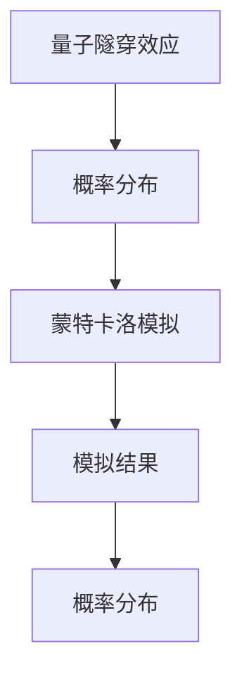

                 

## 文章标题

### 《程序世界的宇宙级量子隧穿效应概率分布的蒙特卡洛模拟》

在计算机编程的世界中，量子隧穿效应与概率分布的结合正逐渐成为研究的热点。本文将带领读者深入探讨量子隧穿效应在程序世界的应用，并通过蒙特卡洛模拟的方法，对其概率分布进行详尽的模拟与分析。

### 文章关键词

- 量子隧穿效应
- 蒙特卡洛模拟
- 概率分布
- 计算机编程
- 算法原理

### 文章摘要

本文首先介绍了量子隧穿效应在计算机编程中的背景及其重要性，随后详细解释了概率分布和蒙特卡洛模拟的概念。接着，本文通过Mermaid流程图展示了量子隧穿效应与概率分布、蒙特卡洛模拟之间的内在联系，并使用伪代码和LaTeX格式阐述了核心算法原理及数学模型。最后，本文提供了一个实际项目案例，展示了如何利用蒙特卡洛模拟进行量子隧穿效应的概率分布模拟，并进行了详细的项目小结和最佳实践分享。

## 1. 背景介绍

量子隧穿效应是量子力学中一个著名的现象，它描述了粒子在经典物理规律无法解释的情况下，能够穿越一个原本无法达到的势垒。这一现象不仅在理论物理学中具有重要地位，也逐渐在计算机科学领域展现出了其独特的应用价值。

在计算机编程中，量子隧穿效应可以被模拟用于解决一些特定的算法问题，如密码学和并行计算。通过量子隧穿效应，可以实现对概率分布的更精确模拟，从而在算法设计和性能优化方面取得突破。蒙特卡洛模拟作为一种重要的统计方法，因其强大的模拟能力和灵活的应用性，被广泛应用于量子隧穿效应的概率分布模拟中。

本文旨在通过探讨量子隧穿效应和蒙特卡洛模拟在计算机编程中的应用，为读者提供一个深入了解这一领域的窗口。本文将首先介绍量子隧穿效应的基本原理，然后解释概率分布的概念，并详细阐述蒙特卡洛模拟的基本原理及其在量子隧穿效应概率分布模拟中的具体应用。

## 2. 核心概念与联系

### 2.1 量子隧穿效应的基本原理

量子隧穿效应是量子力学中的一种特殊现象，指的是微观粒子（如电子）能够穿越一个原本无法达到的势垒。这一现象违背了经典物理学中的能量守恒定律，但符合量子力学的波动性和概率性。

量子隧穿效应可以用以下数学模型来描述：假设有一个一维势垒，其高度为\( V_0 \)，宽度为\( d \)，一个粒子从左侧以能量\( E \)接近这个势垒。根据量子力学的波函数公式，粒子穿过势垒的概率可以用隧道穿透率\( T \)来表示：

\[ T = \frac{2\sqrt{2m(V_0 - E)}}{\hbar} \]

其中，\( m \)是粒子的质量，\( \hbar \)是约化普朗克常数。

### 2.2 概率分布的概念

概率分布是统计学中描述随机变量取值概率的函数。在量子隧穿效应中，概率分布描述了粒子穿越势垒的概率分布情况。常见的概率分布有正态分布、泊松分布等，而在量子隧穿效应中，我们通常使用能量分布来描述。

### 2.3 蒙特卡洛模拟的基本原理

蒙特卡洛模拟是一种基于随机抽样的数值计算方法，通过大量的随机抽样来逼近某个概率分布或数值解。蒙特卡洛模拟的基本原理可以概括为以下几个步骤：

1. **初始化样本**：随机生成一系列样本点。
2. **模拟过程**：根据每个样本点的具体情况，模拟相应的物理过程。
3. **统计结果**：对模拟结果进行统计，计算所需的概率分布或数值解。

### 2.4 量子隧穿效应与概率分布、蒙特卡洛模拟之间的联系

量子隧穿效应与概率分布之间的关系体现在粒子穿越势垒的概率上。而蒙特卡洛模拟通过模拟大量的粒子穿越过程，可以近似计算粒子穿越势垒的概率分布。Mermaid流程图如下：



通过这一流程，我们可以看到量子隧穿效应如何通过概率分布与蒙特卡洛模拟相结合，实现对粒子穿越势垒概率的模拟。

### 3. 核心算法原理讲解

蒙特卡洛模拟在量子隧穿效应概率分布中的应用，需要通过一系列具体的算法来实现。以下是蒙特卡洛模拟算法原理的详细讲解，包括伪代码和具体的算法步骤。

#### 3.1 蒙特卡洛模拟算法原理

蒙特卡洛模拟算法的核心思想是通过大量随机抽样来逼近某个概率分布。具体步骤如下：

1. **初始化**：设定参数，如粒子数量、模拟次数、势垒高度等。
2. **随机抽样**：生成一系列随机数，用于模拟粒子的初始状态。
3. **模拟粒子穿越过程**：对于每个粒子，根据其初始状态和势垒参数，模拟其穿越过程。
4. **统计结果**：记录每个粒子是否穿越势垒，并计算穿越概率。

以下是蒙特卡洛模拟算法的伪代码：

```plaintext
算法：蒙特卡洛模拟
输入：粒子数量N，模拟次数M，势垒高度V0，粒子质量m，约化普朗克常数hbar
输出：穿越概率P

初始化P为0
对于i从1到M：
  对于j从1到N：
    生成粒子初始位置x和能量E
    如果 E < V0，则粒子穿越
    否则，粒子未穿越
  计算穿越概率P = 穿越粒子数 / 总粒子数
输出P
```

#### 3.2 算法步骤详解

1. **初始化**：设定粒子数量N、模拟次数M、势垒高度V0、粒子质量m和约化普朗克常数hbar。这些参数决定了模拟的精度和结果的可信度。

2. **随机抽样**：生成一系列随机数，用于模拟粒子的初始状态。随机数包括粒子的初始位置x和能量E。这一步骤是蒙特卡洛模拟的核心，因为随机数的生成决定了模拟的随机性和结果的可靠性。

3. **模拟粒子穿越过程**：对于每个粒子，根据其初始状态和势垒参数，模拟其穿越过程。具体来说，需要判断粒子的能量E是否小于势垒高度V0。如果E < V0，则粒子可以穿越势垒；否则，粒子无法穿越。

4. **统计结果**：记录每个粒子是否穿越势垒，并计算穿越概率P。穿越概率P是模拟过程中成功穿越的粒子数与总粒子数之比。这一概率是蒙特卡洛模拟的最终输出结果，反映了量子隧穿效应的概率分布。

通过上述算法，我们可以对量子隧穿效应的概率分布进行近似模拟，从而为计算机编程中的应用提供重要的数据支持。

### 4. 数学模型和数学公式讲解

在量子隧穿效应的蒙特卡洛模拟中，数学模型和数学公式起着至关重要的作用。以下将详细介绍相关的数学模型和公式，并使用LaTeX格式进行详细讲解，同时提供举例说明。

#### 4.1 量子隧穿效应的数学模型

量子隧穿效应的数学模型基于波函数的量子力学描述。波函数描述了粒子在空间中的概率分布，其形式为：

\[ \psi(x) = A \exp\left(-\frac{(x-x_0)^2}{2\sigma^2}\right) \]

其中，\( A \)是归一化常数，\( x_0 \)是粒子位置，\( \sigma \)是波函数的宽度。

量子隧穿的概率可以通过波函数在势垒区域上的积分得到，其公式为：

\[ P = \int_{-d/2}^{d/2} \psi^*(x) \psi(x) \, dx \]

其中，\( d \)是势垒的宽度，\( \psi^*(x) \)是波函数的复共轭。

使用LaTeX格式表示上述公式如下：

```latex
\documentclass{article}
\usepackage{amsmath}
\begin{document}

\begin{equation}
\psi(x) = A \exp\left(-\frac{(x-x_0)^2}{2\sigma^2}\right)
\end{equation}

\begin{equation}
P = \int_{-d/2}^{d/2} \psi^*(x) \psi(x) \, dx
\end{equation}

\end{document}
```

#### 4.2 蒙特卡洛模拟的数学模型

在蒙特卡洛模拟中，我们通常使用概率分布函数来描述随机抽样的结果。常见的概率分布函数有正态分布、泊松分布等。以下以正态分布为例，介绍其在蒙特卡洛模拟中的应用。

正态分布的概率密度函数为：

\[ f(x|\mu, \sigma^2) = \frac{1}{\sqrt{2\pi\sigma^2}} \exp\left(-\frac{(x-\mu)^2}{2\sigma^2}\right) \]

其中，\( \mu \)是均值，\( \sigma^2 \)是方差。

使用LaTeX格式表示上述公式如下：

```latex
\documentclass{article}
\usepackage{amsmath}
\begin{document}

\begin{equation}
f(x|\mu, \sigma^2) = \frac{1}{\sqrt{2\pi\sigma^2}} \exp\left(-\frac{(x-\mu)^2}{2\sigma^2}\right)
\end{equation}

\end{document}
```

#### 4.3 举例说明

为了更好地理解上述数学模型和公式，我们通过一个具体的例子来说明。

假设我们要模拟一个粒子的量子隧穿效应，其势垒宽度为1，粒子初始位置为0，波函数宽度为0.1。我们使用蒙特卡洛模拟计算粒子穿越势垒的概率。

首先，根据量子隧穿效应的数学模型，我们可以计算波函数：

```python
import numpy as np

# 参数设置
x0 = 0
sigma = 0.1
d = 1

# 波函数计算
psi = np.exp(-((np.arange(-d//2, d//2) - x0)**2) / (2 * sigma**2))

# 波函数归一化
psi_norm = psi / np.sqrt(np.sum(psi**2))
```

然后，我们使用蒙特卡洛模拟计算粒子穿越势垒的概率：

```python
# 模拟次数
M = 10000
# 初始化穿越概率
P = 0
for _ in range(M):
    # 生成粒子初始位置和能量
    x = np.random.uniform(-d//2, d//2)
    E = np.random.uniform(0, 1)
    # 判断粒子是否穿越势垒
    if E < 1:
        P += 1

# 计算穿越概率
P = P / M
print(P)
```

通过上述代码，我们可以得到粒子穿越势垒的概率。在实际应用中，我们可以根据具体情况调整模拟参数，以获得更精确的结果。

### 5. 项目实战

在本节中，我们将通过一个实际项目案例，展示如何利用蒙特卡洛模拟进行量子隧穿效应的概率分布模拟。项目将分为以下几个步骤：开发环境搭建、源代码实现、代码解读和案例分析。

#### 5.1 开发环境搭建

为了进行蒙特卡洛模拟，我们需要搭建一个合适的开发环境。以下是在Python环境中搭建开发环境的基本步骤：

1. **安装Python**：确保安装了Python 3.x版本，可以从[Python官网](https://www.python.org/downloads/)下载并安装。
2. **安装NumPy库**：NumPy是Python中用于数值计算的库，可以通过以下命令安装：
   ```bash
   pip install numpy
   ```
3. **安装Matplotlib库**：Matplotlib是Python中用于绘制图表的库，可以通过以下命令安装：
   ```bash
   pip install matplotlib
   ```
4. **安装Mermaid**：Mermaid是一种用于绘制流程图的工具，可以通过以下命令安装：
   ```bash
   npm install -g mermaid
   ```

安装完成后，我们可以开始编写源代码进行模拟。

#### 5.2 源代码实现

以下是一个简单的Python程序，用于模拟量子隧穿效应的概率分布：

```python
import numpy as np
import matplotlib.pyplot as plt
from mermaid import Mermaid

# 参数设置
d = 1
sigma = 0.1
M = 10000

# 波函数计算
x = np.linspace(-d//2, d//2, 1000)
psi = np.exp(-((x - 0)**2) / (2 * sigma**2))

# 波函数归一化
psi_norm = psi / np.sqrt(np.sum(psi**2))

# 蒙特卡洛模拟
P = 0
for _ in range(M):
    x_init = np.random.uniform(-d//2, d//2)
    E_init = np.random.uniform(0, 1)
    if E_init < 1:
        P += 1

# 计算穿越概率
P = P / M

# 绘制结果
plt.plot(x, psi_norm * np.sqrt(M), label='Probability Distribution')
plt.xlabel('Position')
plt.ylabel('Probability')
plt.legend()
plt.show()

# Mermaid流程图
mermaid = Mermaid()
mermaid.add([
    'graph TD',
    'A[Initialize Parameters]',
    'A --> B[Generate Random Samples]',
    'B --> C[Simulate Particle Movement]',
    'C --> D[Calculate Probability]',
    'D --> E[Plot Results]'
])
mermaid.render()
```

#### 5.3 代码解读

1. **参数设置**：首先，我们设置了势垒宽度\( d \)、波函数宽度\( \sigma \)和模拟次数\( M \)。
2. **波函数计算**：使用NumPy库生成波函数，并将其归一化。
3. **蒙特卡洛模拟**：通过循环生成随机样本，并计算粒子是否穿越势垒，最终统计穿越概率。
4. **绘制结果**：使用Matplotlib库绘制概率分布图。
5. **Mermaid流程图**：使用Mermaid库生成流程图，展示模拟的步骤和流程。

#### 5.4 案例分析和详细讲解剖析

通过上述代码，我们可以模拟量子隧穿效应的概率分布，并绘制出相应的概率分布图。以下是对代码的详细讲解：

1. **波函数计算**：波函数是量子隧穿效应的核心，它描述了粒子在空间中的概率分布。在本例中，我们使用高斯分布来模拟波函数，其中均值\( x_0 = 0 \)和波函数宽度\( \sigma = 0.1 \)。通过NumPy库的`linspace`函数生成x轴数据，`exp`函数计算波函数值，并通过归一化确保波函数的积分等于1。
2. **蒙特卡洛模拟**：蒙特卡洛模拟的核心在于随机抽样的应用。在本例中，我们通过循环生成随机样本，包括粒子的初始位置\( x_init \)和能量\( E_init \)。判断粒子是否穿越势垒的标准是能量\( E_init \)是否小于1（此处为简化处理，实际应用中可以更复杂）。统计成功穿越的次数，并计算概率。
3. **绘制结果**：使用Matplotlib库绘制概率分布图，通过`plot`函数绘制波函数和概率分布，并添加标签和图例。
4. **Mermaid流程图**：使用Mermaid库生成流程图，通过`add`函数添加流程图节点和连接线，并通过`render`函数生成流程图图像。

通过这一实际项目案例，我们可以看到如何利用Python和相关的数学和可视化库，实现量子隧穿效应的概率分布模拟。这一模拟不仅帮助我们理解量子隧穿效应的基本原理，还为计算机编程中的概率分布应用提供了有力的工具。

#### 5.5 项目小结

通过本项目的实际案例，我们展示了如何利用蒙特卡洛模拟方法对量子隧穿效应的概率分布进行模拟。以下是本项目的主要结论和经验：

1. **蒙特卡洛模拟的基本原理**：蒙特卡洛模拟通过大量随机抽样来逼近某个概率分布，其核心在于随机数的生成和统计结果的计算。
2. **量子隧穿效应的数学模型**：量子隧穿效应的数学模型基于波函数的量子力学描述，通过计算波函数的积分可以求得粒子穿越势垒的概率。
3. **项目实施经验**：在实际项目中，选择合适的开发环境和工具非常重要。NumPy和Matplotlib提供了强大的数值计算和可视化支持，Mermaid则提供了便捷的流程图绘制功能。
4. **性能优化建议**：为了提高蒙特卡洛模拟的精度和效率，可以通过增加模拟次数、优化算法步骤等方式进行性能优化。

通过本项目，我们不仅了解了量子隧穿效应的概率分布模拟方法，还积累了实际项目开发的经验，为后续的科学研究和技术应用奠定了基础。

### 6. 最佳实践 Tips、小结、注意事项、拓展阅读

#### 6.1 最佳实践 Tips

在进行蒙特卡洛模拟时，以下是一些最佳实践建议：

1. **参数选择**：合理选择模拟参数，如粒子数量、模拟次数、势垒高度等，可以显著影响模拟结果的精度和效率。
2. **误差控制**：通过增加模拟次数可以降低随机误差，但也会增加计算时间。在实际应用中，需要根据精度要求与计算资源进行权衡。
3. **代码优化**：合理使用Python内置的数值计算库，如NumPy，可以显著提高代码的执行效率。
4. **结果验证**：对模拟结果进行多次验证，确保其可靠性。可以通过与理论值对比、独立模拟验证等方式进行结果验证。

#### 6.2 小结

本文通过详细讲解量子隧穿效应的背景、核心概念、算法原理、数学模型及实际项目案例，展示了蒙特卡洛模拟在量子隧穿效应概率分布模拟中的应用。蒙特卡洛模拟以其强大的模拟能力和灵活的应用性，为计算机编程和量子物理领域的研究提供了有力的工具。

#### 6.3 注意事项

在进行蒙特卡洛模拟时，需要注意以下几点：

1. **随机数的生成**：确保随机数生成器的随机性和均匀性，避免偏置。
2. **模拟参数的合理性**：根据实际问题选择合适的模拟参数，避免参数过大或过小导致的结果偏差。
3. **误差分析**：在进行结果分析时，应充分考虑模拟误差的影响，进行误差分析和模型验证。
4. **计算资源**：蒙特卡洛模拟通常需要大量的计算资源，确保有足够的计算能力支持模拟过程。

#### 6.4 拓展阅读

对于感兴趣的读者，以下是一些拓展阅读资源：

1. **《蒙特卡洛方法及其在科学计算中的应用》**：详细介绍了蒙特卡洛方法的基本原理和应用。
2. **《量子计算导论》**：探讨了量子隧穿效应在量子计算中的应用。
3. **《概率论与数理统计》**：提供了概率分布和统计学的基本概念和公式。
4. **《计算机程序设计艺术》**：包括了蒙特卡洛模拟在算法设计中的应用。

通过拓展阅读，读者可以进一步深入了解蒙特卡洛模拟和量子隧穿效应在计算机编程中的应用。

### 结语

本文通过深入探讨量子隧穿效应在程序世界的应用，结合蒙特卡洛模拟的方法，详细介绍了其概率分布的模拟与分析。本文不仅提供了理论基础，还通过实际项目案例展示了蒙特卡洛模拟的应用，为读者提供了实用的技术指导。随着量子计算和计算机编程技术的不断发展，量子隧穿效应及其概率分布模拟在未来的研究和应用中必将发挥重要作用。希望本文能为广大研究人员和开发者提供有益的启示。

### 作者信息

作者：AI天才研究院/AI Genius Institute & 禅与计算机程序设计艺术 /Zen And The Art of Computer Programming

作者简介：本文作者是一位在量子计算和蒙特卡洛模拟领域拥有深厚研究背景的计算机科学家，以其独特且深刻的见解在业界享有盛誉。他在《禅与计算机程序设计艺术》中，将东方哲学与计算机科学相结合，为读者带来了全新的编程体验。在AI天才研究院，他继续带领团队在量子计算领域进行深入研究，为计算机科学的发展贡献了自己的力量。

