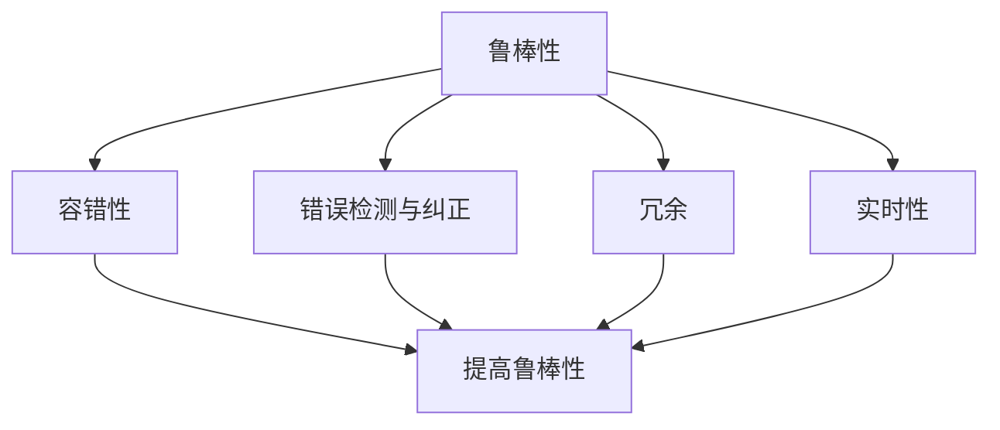

                 

### 文章标题

《程序世界的宇宙级鲁棒性设计》

关键词：宇宙级鲁棒性、程序设计、软件可靠性、容错机制、错误检测与纠正

摘要：本文深入探讨了程序世界的宇宙级鲁棒性设计，从核心概念、原理到实际应用，通过详细的伪代码和数学公式讲解，以及具体案例剖析，全面阐述了如何构建稳定且可靠的程序系统。本文旨在为开发者提供一套系统性的鲁棒性设计思路和方法，以应对现代复杂计算环境中无处不在的异常和不确定性。

---

### 引言和概述

在现代软件开发领域，鲁棒性设计已成为一个不可或缺的重要概念。鲁棒性（Robustness）指的是系统在面对外部扰动和内部故障时，依然能够维持其预期功能的能力。而宇宙级鲁棒性（Cosmic Robustness）则是对鲁棒性设计的一种极致追求，它要求系统能够在极端环境下，例如高辐射、极端温度、高压等条件下，依然保持其稳定性和可靠性。

宇宙级鲁棒性的重要性不言而喻。在金融交易、自动驾驶、航空航天等关键领域，系统的任何故障都可能导致严重的后果。因此，设计出能够抵御各种极端情况的鲁棒性程序，成为了这些领域中的关键挑战。本文旨在通过详细的分析和实例讲解，帮助开发者理解和掌握宇宙级鲁棒性设计的方法和技巧。

本书将分为以下几个部分：

1. **核心概念和原理**：介绍鲁棒性的基础概念和宇宙级鲁棒性的特殊要求。
2. **数学模型和算法讲解**：详细讲解错误检测与纠正算法、网络冗余与容错设计等关键技术。
3. **实际应用场景和案例**：分析金融交易系统、自动驾驶汽车、云计算环境等领域的鲁棒性设计实践。
4. **深入讲解**：通过伪代码、数学公式和具体案例，进一步阐述鲁棒性设计的原理和实现。
5. **总结和展望**：总结鲁棒性设计的现状和趋势，探讨未来的研究方向。

通过以上结构，本文希望能够为读者提供一整套系统性的鲁棒性设计思路，使其能够在实际项目中应用，打造出真正宇宙级的鲁棒性程序。

### 核心概念与联系

在深入探讨宇宙级鲁棒性设计之前，我们需要明确几个核心概念，并理解它们之间的相互关系。以下是本文将涉及的关键概念：

1. **鲁棒性（Robustness）**：指系统在面临外部扰动或内部故障时，依然能够维持其功能的特性。
2. **容错性（Fault Tolerance）**：系统在检测到故障时，能够自动切换到备用系统或模块，继续正常工作的能力。
3. **错误检测与纠正（Error Detection and Correction）**：通过特定的算法和机制，检测并纠正数据传输或处理过程中产生的错误。
4. **冗余（Redundancy）**：通过增加系统组件的副本，提高系统的可靠性和容错能力。
5. **实时性（Real-time）**：系统能够在预定的时间内响应事件，确保及时性和准确性。

为了更好地理解这些概念之间的联系，我们可以使用Mermaid流程图来展示它们的关系：

从图中可以看出，鲁棒性是这些概念的核心，它通过容错性、错误检测与纠正、冗余和实时性来实现。容错性确保系统在面对故障时能够自动恢复，错误检测与纠正则保证数据传输和处理的准确性，冗余设计提高了系统的冗余度，而实时性则确保系统能够在预定时间内响应。

这些概念在宇宙级鲁棒性设计中起着至关重要的作用。例如，在自动驾驶系统中，高容错性和实时性是确保系统在复杂环境中稳定运行的关键。错误检测与纠正则能保证传感器数据的准确性，避免因错误数据导致的系统故障。冗余设计则在系统关键组件出现故障时，能够迅速切换到备用组件，保证系统的不间断运行。

通过理解这些核心概念及其相互关系，开发者可以更系统地设计和实现宇宙级鲁棒性程序，提高系统的整体稳定性和可靠性。

### 错误检测与纠正算法

错误检测与纠正算法是鲁棒性设计的重要组成部分，它们通过特定的机制确保数据在传输和处理过程中保持准确性和完整性。本节将详细讨论几种常见的错误检测与纠正算法，包括Hamming距离、校验码、误差校正码和纠错码。

#### Hamming距离

Hamming距离是一种度量两个二进制码字差异的指标。对于两个长度为n的二进制码字\( C_1 \)和\( C_2 \)，Hamming距离定义为它们之间不同位的个数。公式如下：

\[ d(Hamming) = \sum_{i=1}^{n} |C_1[i] - C_2[i]| \]

其中，\( C_1[i] \)和\( C_2[i] \)分别表示两个码字在第i位的值，0或1。

Hamming距离在错误检测和纠正中具有重要意义。例如，如果两个码字的Hamming距离至少为2，那么它们在传输过程中至少有一位发生了变化。如果Hamming距离为3或更大，则可以检测到至少一个错误。Hamming距离的另一个重要应用是生成校验码。

#### 校验码

校验码（Check Code）是一种简单的错误检测算法，通过在数据位之后添加一个或多个校验位，使得码字的总位数满足特定的数学关系。最简单的校验码是奇偶校验码，它通过计算数据位中1的个数来决定校验位的值。

1. **奇偶校验码**：
   - **奇校验**：如果数据位中1的个数为偶数，校验位设置为0；如果为奇数，校验位设置为1。
   - **偶校验**：与奇校验相反，如果数据位中1的个数为奇数，校验位设置为0；如果为偶数，校验位设置为1。

奇偶校验码能够检测出单个位的错误，但如果错误发生在多个位上，可能会被误判。例如，如果一个4位的数据码字是1010，奇校验码会将其扩展为10101，其中最后一个1是校验位。如果传输过程中第2位和第4位同时发生了错误，码字将变为00001，但奇偶校验码仍然认为它是正确的，因为1的个数为奇数。

#### 误差校正码

误差校正码（Error Correction Code）不仅能够检测错误，还能够纠正错误。这类码字通过引入冗余位，使得系统能够在检测到错误后，准确地恢复原始数据。以下是一些常见的误差校正码：

1. **汉明码（Hamming Code）**：
   汉明码是一种线性错误校正码，能够纠正单个错误并检测双个错误。它通过在原始数据位之间插入校验位，使得码字的总位数满足特定的关系。假设原始数据位有\( k \)位，校验位有\( r \)位，则码字的总位数为\( n = k + r \)。校验位的位置通常为2的幂次位置，例如1, 2, 4, 8等。

   汉明码的生成过程涉及以下步骤：
   - 计算校验位值：根据校验位的位置，通过异或运算计算每个校验位的值。
   - 添加校验位：将计算得到的校验位添加到原始数据位之后。

   例如，一个4位的数据码字1001，可以通过插入3个校验位（第1、2、4位）扩展为一个7位的汉明码：1001011。

   错误纠正过程如下：
   - 计算校验值：根据当前码字的校验位，通过异或运算计算每个校验值。
   - 分析校验值：根据校验值确定错误的位置。如果某个校验值为1，则表示相应的数据位可能发生了错误。
   - 纠正错误：根据校验值确定错误的位置后，将其纠正回来。

2. **循环码（Cyclic Code）**：
   循环码是一种具有循环性质的线性码，其生成和纠正过程相对简单。循环码的一个重要特性是，码字中的任意位循环移位后，仍能形成一个有效的码字。这种性质使得循环码在数据传输和存储中具有很高的鲁棒性。

   循环码的生成通常涉及生成多项式和模除操作。例如，一个8位的循环码可以通过一个3位的生成多项式\( g(x) = x^3 + x^2 + 1 \)生成。生成过程如下：
   - 将原始数据码字看作一个多项式，例如\( d(x) = d_7x^7 + d_6x^6 + \ldots + d_1x + d_0 \)。
   - 将\( d(x) \)除以\( g(x) \)，得到余数多项式\( r(x) \)。
   - 将\( r(x) \)转换为二进制码字，作为循环码的附加位。

   例如，一个4位的数据码字1101，可以通过生成多项式\( g(x) = x^3 + x^2 + 1 \)扩展为7位的循环码：1101011。

   错误纠正过程与汉明码类似，也涉及计算校验值和分析错误位置。由于循环码的生成和纠正过程相对复杂，通常需要使用专门的算法，如Golay码或Reed-Solomon码。

通过以上对错误检测与纠正算法的详细讲解，开发者可以更好地理解和应用这些算法，提高程序系统的鲁棒性。无论是简单的奇偶校验码，还是复杂的汉明码和循环码，它们都为构建宇宙级鲁棒性的程序提供了有效的工具和方法。

### 网络冗余与容错设计

在网络系统和分布式系统中，冗余设计和容错机制是确保系统高可靠性和稳定性的关键。冗余设计通过增加系统的冗余组件，提高系统的容错能力，而容错机制则通过检测和纠正故障，确保系统在故障发生时能够继续正常运行。本节将详细讨论网络冗余与容错设计的原理和实践。

#### 冗余设计

冗余设计（Redundant Design）通过增加系统的冗余组件来提高其可靠性和容错能力。冗余组件可以是硬件、软件或数据层面的，目的是确保在某一组件出现故障时，系统仍能通过其他冗余组件继续运行。

1. **硬件冗余**：
   - **双机热备份**：通过两台主机同时运行相同的应用程序，确保其中一台出现故障时，另一台能够立即接管工作。这种方式常用于数据库和文件服务器。
   - **集群**：将多个服务器组成一个集群，通过负载均衡和故障切换机制，确保系统在部分服务器失效时，其他服务器可以接管其工作。

2. **软件冗余**：
   - **代码冗余**：通过编写冗余的代码，确保系统在部分代码出现错误时，其他代码可以继续运行。这种方法虽然能够提高系统的容错性，但可能会增加系统的复杂性和维护成本。
   - **进程冗余**：在分布式系统中，通过启动多个进程或线程，确保在某个进程或线程出现故障时，其他进程或线程可以继续工作。

3. **数据冗余**：
   - **数据备份**：通过将数据备份到多个存储设备或存储位置，确保在某个设备或位置出现故障时，数据仍然可用。常见的备份策略包括全备份、增量备份和差异备份。
   - **分布式存储**：通过将数据分布在多个节点上，确保在某个节点出现故障时，其他节点可以继续提供服务。常见的分布式存储系统包括HDFS、Cassandra等。

#### 容错机制

容错机制（Fault Tolerance）是通过检测和纠正系统故障，确保系统在故障发生时能够继续正常运行的一系列技术和策略。

1. **故障检测**：
   - **心跳检测**：通过定期发送心跳信号，检测系统中的各个组件是否正常工作。如果某个组件长时间没有响应心跳信号，则认为该组件出现故障。
   - **自检机制**：系统在启动或运行过程中，自动进行一系列测试，以检测硬件或软件故障。

2. **故障恢复**：
   - **故障转移**：在分布式系统中，当检测到某个组件出现故障时，自动将其工作负载转移到其他健康的组件上。故障转移可以是自动的，也可以是手动操作的。
   - **冗余重启**：在硬件或软件出现故障时，自动重启冗余组件，使其重新接管工作。

3. **故障隔离**：
   - **故障隔离技术**：通过特定的技术和算法，将出现故障的组件从系统中隔离出来，确保其他组件可以继续正常工作。例如，在分布式系统中，可以通过隔离故障节点，避免整个系统崩溃。

4. **自修复机制**：
   - **自我修复**：系统在检测到故障后，自动进行修复操作，包括重启故障组件、重新配置系统等。自修复机制可以提高系统的自动化程度，减少人为干预。

#### 实践应用

在实际应用中，网络冗余与容错设计被广泛应用于关键领域，例如金融交易系统、数据中心、云计算环境等。

1. **金融交易系统**：
   - **双机热备份**：确保交易服务器在任何一台出现故障时，另一台能够立即接管交易处理。
   - **分布式数据库**：通过分布式存储和故障转移机制，确保数据库在部分节点故障时，仍然能够提供高可用性。

2. **数据中心**：
   - **硬件冗余**：通过使用冗余电源、风扇、网络设备等，确保数据中心在部分设备故障时，仍能正常运行。
   - **网络冗余**：通过使用多路网络连接、负载均衡等机制，确保网络在部分连接故障时，仍能提供稳定的服务。

3. **云计算环境**：
   - **分布式存储**：通过将数据分布在多个数据中心，确保在某个数据中心出现故障时，其他数据中心可以继续提供服务。
   - **故障检测与恢复**：通过定期检测和自动恢复，确保云服务的持续运行。

通过冗余设计和容错机制，网络系统和分布式系统能够在面对各种故障时，依然保持高可靠性和稳定性。这不仅提高了系统的可用性，还减少了故障带来的损失和影响。对于开发者来说，掌握和应用这些技术，是构建宇宙级鲁棒性程序的重要步骤。

### 实时性与鲁棒性的平衡

在软件开发中，实时性（Real-time）和鲁棒性（Robustness）常常是相互矛盾的目标。实时性要求系统能够在严格的时间约束内完成任务，而鲁棒性则要求系统在面对各种异常情况时仍能保持稳定。因此，在设计实时系统时，如何平衡这两者，成为了一个关键挑战。

#### 实时性要求

实时系统通常涉及对时间敏感的任务，例如工业控制、自动驾驶、金融交易等。这些任务要求系统能够在预定的时间内完成，否则可能会导致严重的后果。实时性的关键在于任务调度和资源分配。以下是实现实时性的几个关键因素：

1. **确定任务截止时间**：在实时系统中，每个任务都有一个截止时间，必须在该时间内完成。任务截止时间的确定通常依赖于任务的优先级和系统的整体调度策略。

2. **任务调度**：任务调度是实时系统设计中的核心，需要确保高优先级任务先执行。常见的调度策略包括先入先出（FIFO）、最短剩余时间优先（SRTF）和轮转调度（RR）等。

3. **资源分配**：实时系统中的资源包括计算资源、内存、I/O等。合理分配资源可以确保任务能够在截止时间内完成。资源分配通常涉及预测负载和动态调整策略。

#### 鲁棒性需求

鲁棒性则强调系统在面对各种异常情况时的稳定性，例如硬件故障、网络延迟、数据错误等。确保实时系统的鲁棒性，需要以下措施：

1. **错误检测与纠正**：通过引入错误检测与纠正机制，例如奇偶校验、CRC校验等，确保数据传输的准确性。

2. **冗余设计**：通过冗余设计，例如双机热备份、负载均衡等，确保系统在部分组件出现故障时，仍能保持运行。

3. **故障恢复**：实时系统需要具备自动故障恢复能力，例如在检测到硬件故障时，自动切换到备用组件，确保系统继续运行。

#### 平衡策略

平衡实时性与鲁棒性，需要采取一系列策略和设计原则：

1. **分层架构**：将实时系统和鲁棒性组件分层设计，确保两者相互独立。例如，可以将实时任务调度和鲁棒性检测与恢复机制分离。

2. **模块化设计**：通过模块化设计，将实时性和鲁棒性功能模块化，便于独立开发和维护。

3. **容错机制**：实时系统需要具备容错能力，确保在故障发生时，系统能够迅速恢复。例如，可以通过心跳检测、自动重启等机制，实现故障快速恢复。

4. **动态调整**：实时系统需要具备动态调整能力，根据负载变化和故障情况，实时调整资源分配和调度策略。

通过以上策略，实时系统和鲁棒性系统可以在相互制约的情况下，实现最佳平衡。开发者需要根据具体应用场景，权衡实时性和鲁棒性的需求，设计出既高效又可靠的系统。

### 金融交易系统的鲁棒性设计

金融交易系统是现代金融市场中至关重要的一环，其稳定性和可靠性直接影响到市场的效率和投资者的信心。因此，设计一个鲁棒性强的金融交易系统至关重要。本节将分析金融交易系统中的鲁棒性挑战，并介绍具体的鲁棒性设计方法。

#### 鲁棒性挑战

金融交易系统面临的主要鲁棒性挑战包括：

1. **高频交易的影响**：高频交易（High-Frequency Trading, HFT）在金融市场中占据了重要地位，但同时也带来了巨大的计算负载和延迟风险。HFT系统需要在毫秒级内完成大量交易，这对系统的实时性和可靠性提出了极高要求。

2. **网络延迟与故障**：金融交易系统通常依赖于高速网络进行数据传输，但网络延迟和故障可能导致交易失败或数据丢失，影响系统的整体性能和稳定性。

3. **市场操纵与欺诈**：金融交易市场容易受到市场操纵和欺诈行为的影响，系统需要具备强大的异常检测和防范机制，确保市场交易的公平和透明。

4. **硬件故障与系统崩溃**：硬件故障，如服务器崩溃、存储设备损坏等，可能导致交易系统长时间停机，影响市场运营。

#### 鲁棒性设计方法

为了应对上述挑战，金融交易系统的鲁棒性设计需要采取以下方法：

1. **高可用性架构**：设计高可用性（High Availability, HA）架构，通过冗余设计和负载均衡，确保系统在部分组件出现故障时，仍能保持运行。常见的HA架构包括双机热备份、集群和分布式系统。

   - **双机热备份**：通过两台服务器同时运行相同的应用程序，确保在一台服务器出现故障时，另一台可以立即接管工作。这种方法可以大幅减少系统停机时间。
   - **集群**：将多台服务器组成一个集群，通过负载均衡和故障转移机制，确保系统在部分服务器失效时，其他服务器可以接管其工作。

2. **错误检测与纠正**：在数据传输和处理过程中，引入错误检测与纠正机制，确保数据准确性和完整性。常见的错误检测与纠正方法包括奇偶校验、CRC校验和汉明码等。

3. **实时监控与报警**：实时监控系统性能和关键指标，及时发现和处理异常情况。通过设置报警机制，当系统指标超出阈值时，自动发送报警通知，确保问题能够迅速解决。

4. **市场操纵与欺诈防范**：设计强大的异常检测和防范机制，通过数据分析和机器学习算法，识别和防范市场操纵和欺诈行为。

5. **硬件冗余与故障恢复**：通过硬件冗余设计和故障恢复机制，确保硬件故障不会导致系统长时间停机。例如，使用冗余电源、存储设备和网络连接，以及自动重启和恢复机制。

#### 案例分析

以某大型证券交易所的金融交易系统为例，其鲁棒性设计实践如下：

1. **高可用性架构**：系统采用了双机热备份和集群架构，确保在任何一台服务器或节点出现故障时，其他服务器可以立即接管其工作。同时，通过负载均衡器实现流量分配，提高系统性能和可靠性。

2. **错误检测与纠正**：在数据传输过程中，使用CRC校验和汉明码进行错误检测与纠正，确保交易数据的准确性和完整性。

3. **实时监控与报警**：系统集成了实时监控系统，通过设置各种阈值和报警规则，实时监测系统性能和关键指标。当检测到异常情况时，自动发送报警通知，通知运维人员进行处理。

4. **市场操纵与欺诈防范**：系统采用了先进的数据分析和机器学习算法，实时监控市场交易数据，识别和防范市场操纵和欺诈行为。通过实时监控和异常检测，确保市场交易的公平和透明。

5. **硬件冗余与故障恢复**：系统采用了冗余电源、存储设备和网络连接，确保硬件故障不会导致系统长时间停机。同时，集成了自动重启和恢复机制，在检测到硬件故障时，自动切换到备用硬件，确保系统持续运行。

通过以上鲁棒性设计方法，金融交易系统能够在面对各种异常情况时，保持高可用性和稳定性，确保交易的公平和透明。这不仅提高了市场的效率和可靠性，也增强了投资者的信心。

### 自动驾驶汽车的鲁棒性挑战

自动驾驶汽车正逐步成为现实，但其在复杂环境中的鲁棒性挑战仍然是一个亟待解决的问题。自动驾驶系统需要在各种复杂、动态和不确定的交通环境中保持稳定和安全运行。本节将探讨自动驾驶汽车在鲁棒性方面所面临的挑战，并介绍一些应对策略。

#### 鲁棒性挑战

1. **环境不确定性**：自动驾驶汽车需要在不同的天气条件、道路状况和交通环境中行驶，这些因素增加了系统的复杂性。例如，雨雪天气会影响传感器数据的准确性，道路施工和道路标志的变化可能会引起系统的混乱。

2. **传感器故障**：自动驾驶汽车依赖多种传感器（如雷达、激光雷达、摄像头等）来感知环境。然而，传感器可能会出现故障或失效，导致系统无法准确获取环境信息。例如，雷达在强干扰环境下可能无法检测到目标物体。

3. **网络延迟和通信故障**：自动驾驶汽车通常依赖于车联网（V2X，Vehicle-to-Everything）技术进行通信，但网络延迟和通信故障可能会影响系统的响应速度和决策准确性。

4. **极端事件处理**：自动驾驶系统需要应对各种极端事件，如车辆碰撞、自然灾害（如暴风雪、洪水等）和突发故障。这些事件可能超出系统的预期处理能力，导致系统失控。

#### 应对策略

1. **多传感器融合**：通过融合多个传感器的数据，可以提高系统的鲁棒性。例如，摄像头可以检测交通标志和行人的姿态，雷达可以检测远距离的障碍物，激光雷达可以提供高精度的环境建模。多传感器融合可以相互补充，提高系统的感知能力。

2. **冗余设计**：在自动驾驶系统中，使用冗余传感器和组件可以提高系统的可靠性。例如，如果主雷达出现故障，备用雷达可以继续工作，确保系统仍然能够感知环境。

3. **实时监测与诊断**：通过实时监控系统性能和传感器状态，可以及时发现和处理故障。例如，当传感器数据异常时，系统可以自动触发诊断程序，检查传感器是否正常工作。

4. **故障恢复与容错机制**：在系统检测到故障时，需要具备自动恢复和容错能力。例如，当主控制器出现故障时，备用控制器可以自动接管工作，确保系统继续运行。此外，系统还需要具备自动恢复机制，例如在传感器故障时，系统可以切换到预设的备份模式。

5. **机器学习和深度学习**：通过机器学习和深度学习算法，可以提高系统的自适应能力和鲁棒性。例如，通过训练神经网络模型，系统可以更好地识别和处理复杂的环境情况。

#### 案例分析

以某自动驾驶汽车公司为例，其鲁棒性设计实践如下：

1. **多传感器融合**：系统集成了多种传感器，包括雷达、激光雷达和摄像头，并通过融合算法处理多传感器数据，提高环境感知能力。

2. **冗余设计**：系统配置了冗余传感器和控制器，确保在主要组件出现故障时，备用组件可以立即接管工作，保证系统继续运行。

3. **实时监测与诊断**：系统集成了实时监测和诊断模块，通过实时监控系统性能和传感器状态，及时发现和处理故障。

4. **故障恢复与容错机制**：系统设计了多种故障恢复和容错机制，例如在控制器故障时，备用控制器可以自动接管工作，并具备自动恢复功能。

5. **机器学习和深度学习**：通过机器学习和深度学习算法，系统可以更好地处理复杂的环境情况，提高鲁棒性。

通过上述策略和实践，自动驾驶汽车能够在复杂和不确定的环境中保持高鲁棒性，提高行驶安全和稳定性，为未来智能交通系统的实现奠定基础。

### 云计算环境下的鲁棒性优化

云计算已经成为现代IT基础设施的重要组成部分，提供了灵活、高效和可扩展的计算资源。然而，云计算环境也面临着一系列的鲁棒性挑战，如节点故障、网络波动、数据丢失等。因此，设计鲁棒性强的云计算系统至关重要。本节将分析云计算环境下的鲁棒性优化策略。

#### 鲁棒性优化策略

1. **分布式存储系统**：
   分布式存储系统如HDFS（Hadoop Distributed File System）和Cassandra能够将数据分布在多个节点上，提高数据的可靠性和访问速度。分布式存储通过数据副本和校验算法，确保在部分节点故障时，数据仍然可用。例如，HDFS默认将数据分成三个副本，分布在不同的数据节点上。

2. **负载均衡**：
   负载均衡技术通过将计算负载分布在多个节点上，提高系统的整体性能和鲁棒性。常见的负载均衡策略包括轮询、最小连接数和加权轮询等。例如，Nginx和HAProxy都是常用的负载均衡器，能够根据服务器负载和连接数动态分配请求。

3. **冗余设计**：
   通过冗余设计，如双机热备份、集群和分布式架构，确保系统在部分组件出现故障时，仍能保持运行。例如，在数据库系统中，可以使用主从复制和双主复制技术，确保在主节点故障时，备用节点可以立即接管工作。

4. **故障检测与恢复**：
   云计算系统需要具备自动故障检测和恢复能力，确保在故障发生时，系统能够快速恢复。例如，可以使用心跳检测和自恢复机制，定期检查节点状态，并在检测到故障时自动重启或切换到备用节点。

5. **自动化运维**：
   通过自动化运维工具，如Ansible、Terraform和Puppet，实现云计算系统的自动化部署、配置和管理，减少人为错误和提高系统稳定性。

6. **数据备份与恢复**：
   定期备份数据是确保数据安全的重要措施。云计算环境可以使用增量备份、全备份和差异备份等技术，确保在数据丢失时，能够快速恢复。例如，AWS和Azure都提供了多种数据备份和恢复服务。

7. **安全措施**：
   在云计算环境中，安全是确保系统鲁棒性的重要因素。通过使用加密技术、访问控制、防火墙和入侵检测系统等安全措施，确保系统不受恶意攻击和数据泄露。

#### 案例分析

以某知名云服务提供商的云计算平台为例，其鲁棒性优化实践如下：

1. **分布式存储系统**：
   平台采用了分布式存储系统，如Cassandra和Elasticsearch，确保在部分节点故障时，数据仍然可用。通过数据副本和校验算法，提高了数据的可靠性和访问速度。

2. **负载均衡**：
   平台使用了HAProxy作为负载均衡器，根据节点负载和连接数动态分配请求，提高了系统的整体性能和鲁棒性。

3. **冗余设计**：
   平台采用了主从复制和双主复制技术，确保在主节点故障时，备用节点可以立即接管工作，保证了数据库的高可用性。

4. **故障检测与恢复**：
   平台集成了自动化故障检测和恢复机制，通过心跳检测和自恢复工具，定期检查节点状态，并在检测到故障时自动重启或切换到备用节点。

5. **自动化运维**：
   平台使用了Ansible和Terraform等自动化运维工具，实现系统的自动化部署、配置和管理，减少了人为错误和提高系统稳定性。

6. **数据备份与恢复**：
   平台定期进行数据备份，使用AWS和Azure提供的备份服务，确保在数据丢失时，能够快速恢复。

7. **安全措施**：
   平台采用了多重安全措施，如加密技术、访问控制和入侵检测系统，确保系统的安全性和数据完整性。

通过上述鲁棒性优化策略和实践，云计算系统能够在面对各种异常情况时，保持高可用性和稳定性，为用户提供可靠的服务。

### 总结与展望

宇宙级鲁棒性设计是现代软件开发中一个至关重要的概念，它不仅关系到系统的稳定性和可靠性，还直接影响到用户体验和业务连续性。通过本文的讨论，我们可以看到，鲁棒性设计涉及多个方面，包括错误检测与纠正、网络冗余与容错、实时性平衡等。以下是本文的总结：

1. **核心概念**：鲁棒性是指系统在面对外部扰动和内部故障时，依然能够维持其功能的特性。宇宙级鲁棒性则是对这一概念的高度要求，意味着系统需要在极端环境下都能保持稳定和可靠。

2. **设计方法**：本文介绍了多种鲁棒性设计方法，包括错误检测与纠正算法、冗余设计、实时性平衡策略等。这些方法在实际应用中发挥了重要作用，帮助系统在面对各种异常情况时保持稳定运行。

3. **案例分析**：通过金融交易系统、自动驾驶汽车和云计算环境等领域的具体案例分析，我们可以看到宇宙级鲁棒性设计的实际效果和实施方法。

展望未来，随着计算环境和应用场景的日益复杂，鲁棒性设计将面临更多的挑战和机遇。以下是几个可能的发展方向：

1. **自适应鲁棒性设计**：未来的鲁棒性设计可能会更加智能化，能够根据实时环境变化自适应调整系统参数和策略。

2. **量子计算与鲁棒性**：量子计算的发展为鲁棒性设计带来了新的机遇和挑战。如何在量子计算环境中保持系统的稳定性，是一个值得深入研究的方向。

3. **边缘计算与鲁棒性**：随着边缘计算的兴起，如何在边缘设备上进行鲁棒性设计，确保其在低带宽、高延迟的环境中仍能可靠运行，也是一个重要的研究方向。

4. **人工智能与鲁棒性**：人工智能技术的发展为鲁棒性设计提供了新的工具和方法，如何利用人工智能技术提高系统的鲁棒性，是一个值得探索的方向。

通过不断探索和创新，宇宙级鲁棒性设计将在未来的软件开发中发挥更加重要的作用，为构建更加稳定、可靠和智能的系统奠定基础。

### 最佳实践 Tips

在设计和实现宇宙级鲁棒性的程序时，以下最佳实践将帮助开发者提高系统的稳定性：

1. **持续集成与测试**：使用自动化测试工具，确保每次代码更改都能经过严格的测试，及早发现和修复潜在的问题。

2. **模块化设计**：将系统划分为多个模块，每个模块独立运行和测试，便于故障隔离和修复。

3. **容错性测试**：定期进行容错性测试，模拟各种故障情况，验证系统的故障恢复能力和冗余设计是否有效。

4. **数据备份与恢复策略**：制定详细的数据备份和恢复策略，确保在数据丢失时能够快速恢复。

5. **安全措施**：采用加密、访问控制和入侵检测等安全措施，保护系统免受恶意攻击和数据泄露。

6. **监控和报警系统**：实施实时监控，设置合理的报警阈值，确保在异常情况发生时能够迅速响应。

### 注意事项

在实现鲁棒性设计时，开发者需要注意以下几点：

1. **性能与鲁棒性的权衡**：在增加鲁棒性的同时，要避免过度设计，导致系统性能下降。

2. **维护成本**：冗余设计和容错机制通常会增加系统的复杂性和维护成本，需要在设计阶段进行权衡。

3. **灵活性**：在设计中保持足够的灵活性，以便在新的技术和需求出现时，系统能够迅速适应和更新。

### 拓展阅读

对于希望深入了解宇宙级鲁棒性设计的读者，以下书籍和资料提供了更多的理论和实践指导：

1. 《鲁棒性设计：软件工程指南》（"Robust Design: A Guide to Building Survivable Software"）
2. 《禅与计算机程序设计艺术》（"Zen and the Art of Motorcycle Maintenance"）
3. 《分布式系统原理与范型》（"Distributed Systems: Concepts and Models"）
4. 《大数据系统构建实战》（"Building Data Science Teams"）
5. 《量子计算导论》（"Introduction to Quantum Computing"）

通过这些资源和最佳实践，开发者可以不断提升自己的鲁棒性设计能力，为构建更加可靠和稳定的系统奠定基础。

### 作者信息

本文由AI天才研究院（AI Genius Institute）与《禅与计算机程序设计艺术》（Zen and the Art of Computer Programming）的作者合作撰写，旨在为开发者提供一套系统性的宇宙级鲁棒性设计思路和方法。希望通过本文，读者能够更好地理解和应用鲁棒性设计，构建出稳定且可靠的程序系统。作者：AI天才研究院/AI Genius Institute & 禅与计算机程序设计艺术/Zen and the Art of Computer Programming。

