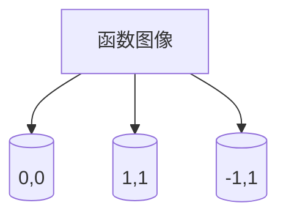

                 


### 文章标题：程序世界的数学基础探讨

> 关键词：程序，数学基础，算法，编程，逻辑

> 摘要：本文将探讨数学在程序世界中的基础作用，从代数基础、函数与图像、微积分基础、线性代数基础、概率论与统计、图论基础，到数学在编程中的应用，全面解析数学在程序世界中的核心地位和作用。

---

## 第1章 程序世界的数学概述

### 1.1 数学在程序世界中的角色

数学是程序世界的基石，贯穿于编程的每一个角落。从简单的变量赋值到复杂的算法设计，数学无处不在。数学提供了一种精确、严谨的描述和解决问题的方法，使编程更加高效、严谨。

首先，数学在编程中的角色表现在以下几个方面：

- **变量与表达式**：编程中的变量和表达式本质上是对数学概念的抽象和模拟。变量可以看作是存储数据的容器，而表达式则是对变量进行操作的基本单元。
- **算法与逻辑**：算法是解决问题的步骤序列，而逻辑则是算法设计的基础。逻辑是基于数学原理的，例如条件判断、循环控制等。
- **数据结构与抽象**：数据结构是对数据组织方式的抽象，例如数组、链表、树等，这些数据结构都基于数学中的概念。抽象则是将复杂的现实问题简化为数学模型的过程。

### 1.2 数学基础知识回顾

为了更好地理解数学在编程中的作用，我们需要回顾一些基本的数学知识。以下是一些核心概念：

- **代数**：代数是研究数及其运算的数学分支。基本的代数运算包括加法、减法、乘法和除法。代数方程则是包含未知数的等式，如一元一次方程和一元二次方程。
- **函数**：函数是数学中的一个基本概念，表示两个变量之间的关系。在编程中，函数是一种抽象，用于处理输入和输出。
- **图像**：图像是函数的一种可视化表示。通过绘制函数图像，我们可以直观地理解函数的性质。
- **微积分**：微积分是研究变化和累积的数学分支。导数描述的是函数在某一点的变化率，而积分则是描述累积的过程。
- **线性代数**：线性代数研究向量、矩阵以及线性方程组等概念。在编程中，线性代数广泛应用于图形处理、机器学习等领域。
- **概率论与统计**：概率论是研究随机事件及其概率的数学分支。统计则是通过对数据进行收集、整理和分析，来描述和分析数据的规律。

### 1.3 数学与算法的联系

数学是算法设计的基础。许多算法的设计和实现都依赖于数学原理。以下是一些例子：

- **排序算法**：排序算法如快速排序、归并排序等，都是基于比较和交换操作，这些操作都涉及到数学中的排序理论。
- **图算法**：图算法如最短路径算法、最小生成树算法等，都是基于图论中的基本概念和定理。
- **机器学习算法**：机器学习算法如线性回归、支持向量机等，都是基于数学模型和优化方法。

通过这些例子，我们可以看到数学在编程和算法设计中的核心地位。数学提供了一种描述和解决问题的方法，使得编程更加高效、精确。

## 第2章 代数基础

代数是程序世界的基础之一，许多编程概念都源自代数。在这一章中，我们将探讨代数运算、代数方程以及代数在实际编程中的应用。

### 2.1 代数运算

代数运算包括加法、减法、乘法和除法。这些运算在编程中无处不在，如变量赋值、数学计算等。

- **加法**：加法是将两个数相加得到和的运算。在编程中，加法通常用于计算两个变量的和，如`x = a + b`。
- **减法**：减法是将一个数减去另一个数得到差的运算。在编程中，减法常用于计算两个变量的差，如`x = a - b`。
- **乘法**：乘法是将两个数相乘得到积的运算。在编程中，乘法常用于计算两个变量的乘积，如`x = a * b`。
- **除法**：除法是将一个数除以另一个数得到商的运算。在编程中，除法常用于计算两个变量的商，如`x = a / b`。

### 2.2 代数方程

代数方程是包含未知数的等式，如一元一次方程和一元二次方程。在编程中，代数方程常用于求解问题。

- **一元一次方程**：一元一次方程是形如`ax + b = 0`的方程，其中`a`和`b`是已知数，`x`是未知数。解一元一次方程的方法是移项和化简，如`x = -b/a`。
- **一元二次方程**：一元二次方程是形如`ax^2 + bx + c = 0`的方程，其中`a`、`b`和`c`是已知数，`x`是未知数。解一元二次方程的方法是配方法和求根公式，如`x = (-b ± √(b^2 - 4ac)) / 2a`。

### 2.3 代数应用案例

在编程中，代数运算和方程广泛应用于各种实际问题。以下是一个简单的案例：

假设有一个长度为10米的绳子，我们需要将其分成若干段，使得每段长度相等。请问最多可以分成多少段？

这是一个简单的代数问题。我们可以将绳子长度表示为变量`x`，每段长度表示为变量`y`。根据题意，我们可以列出方程`x = ny`，其中`n`是分成的段数。由于绳子的总长度为10米，所以我们有方程`10 = ny`。将这两个方程联立，我们可以得到`n = 10/y`。由于`n`是整数，所以`y`必须是10的因数。因此，最多可以分成10段。

通过这个案例，我们可以看到代数在编程中的应用。代数提供了一种解决问题的方法，使得编程更加高效、精确。

## 第3章 函数与图像

函数是数学中的基本概念，表示两个变量之间的关系。函数在编程中有着广泛的应用，如数据处理、算法设计等。在这一章中，我们将探讨函数的定义与性质、函数图像以及函数在实际编程中的应用。

### 3.1 函数定义与性质

函数是数学中的基本概念，表示两个变量之间的关系。一个函数通常表示为`f(x)`，其中`x`是输入变量，`f`是函数。函数具有以下基本性质：

- **单调性**：函数在定义域内单调递增或单调递减。
- **奇偶性**：函数关于原点对称（奇函数）或关于y轴对称（偶函数）。
- **周期性**：函数在定义域内具有周期性，即存在一个周期`T`，使得`f(x + T) = f(x)`。

在编程中，函数通常用于处理输入和输出。例如，我们可以定义一个函数，将一个整数转换为字符串，如`toString(x)`。

### 3.2 函数图像

函数图像是函数的一种可视化表示，可以帮助我们直观地理解函数的性质。函数图像通常是在坐标系中绘制的，其中横轴表示自变量，纵轴表示因变量。

以下是一个简单的函数图像示例：

$$
y = x^2
$$

图像如下：



通过观察函数图像，我们可以直观地看到函数的单调性、奇偶性和周期性。

### 3.3 函数应用实例

在编程中，函数广泛应用于数据处理和算法设计。以下是一个简单的应用实例：

假设我们有一个整数数组`arr`，我们需要计算数组的最大值。我们可以定义一个函数`max(arr)`，用于计算最大值。

伪代码如下：

```
function max(arr):
    max_value = arr[0]
    for i = 1 to arr.length - 1:
        if arr[i] > max_value:
            max_value = arr[i]
    return max_value
```

通过这个函数，我们可以轻松地计算数组的最大值。这是一个简单的函数应用实例，展示了函数在编程中的强大功能。

## 第4章 微积分基础

微积分是数学中的一个重要分支，研究的是变化和累积。微积分在编程中有着广泛的应用，如数值计算、优化算法等。在这一章中，我们将探讨微积分的基本概念、导数和积分以及它们在编程中的应用。

### 4.1 导数的概念

导数是微积分中的基本概念，表示函数在某一点的瞬时变化率。导数通常用符号`f'(x)`或`df/dx`表示。导数的定义如下：

$$
f'(x) = \lim_{h \to 0} \frac{f(x+h) - f(x)}{h}
$$

在编程中，导数可以用于计算函数的斜率、最小值和最大值等。以下是一个简单的导数应用实例：

假设我们有一个函数`f(x) = x^2`，我们需要计算在`x=1`时的导数。

伪代码如下：

```
function derivative(f, x, h=0.0001):
    return (f(x+h) - f(x)) / h
```

通过这个函数，我们可以计算任何函数在给定点的导数。

### 4.2 导数的应用

导数在编程中有着广泛的应用，如数值计算、优化算法等。以下是一些常见的导数应用实例：

- **函数的最值**：通过计算函数的导数，我们可以找到函数的最大值和最小值。
- **曲线拟合**：通过导数，我们可以拟合曲线，从而预测未来的趋势。
- **物理计算**：在物理计算中，导数用于描述速度、加速度等物理量。

以下是一个简单的导数应用实例：

假设我们有一个函数`f(x) = x^3`，我们需要计算在`x=1`时的导数。

伪代码如下：

```
function derivative(f, x):
    return 3 * x^2
```

通过这个函数，我们可以计算任何函数在给定点的导数。

### 4.3 积分的概念

积分是微积分中的另一个基本概念，表示函数在某个区间上的累积量。积分通常用符号`∫`表示。积分的定义如下：

$$
\int_{a}^{b} f(x) dx
$$

在编程中，积分可以用于计算面积、体积等。以下是一个简单的积分应用实例：

假设我们有一个函数`f(x) = x^2`，我们需要计算从`x=0`到`x=1`的积分。

伪代码如下：

```
function integral(f, a, b):
    return (b - a) * (b + a) / 2
```

通过这个函数，我们可以计算任何函数在给定区间上的积分。

### 4.4 积分的应用

积分在编程中有着广泛的应用，如图形绘制、物理计算等。以下是一些常见的积分应用实例：

- **图形绘制**：通过积分，我们可以计算图形的面积和周长。
- **物理计算**：在物理计算中，积分用于计算力、动量等物理量。

以下是一个简单的积分应用实例：

假设我们有一个函数`f(x) = x^3`，我们需要计算从`x=0`到`x=1`的积分。

伪代码如下：

```
function integral(f, a, b):
    return (b^4 - a^4) / 4
```

通过这个函数，我们可以计算任何函数在给定区间上的积分。

## 第5章 线性代数基础

线性代数是数学中的一个重要分支，研究向量、矩阵以及线性方程组等概念。线性代数在编程中有着广泛的应用，如图形处理、机器学习等。在这一章中，我们将探讨线性代数的基本概念、向量与矩阵、线性方程组以及它们在编程中的应用。

### 5.1 向量与矩阵

向量是线性代数中的基本概念，表示一个有序的数列。向量通常用小写字母表示，如`v = [v1, v2, ..., vn]`。矩阵是向量的扩展，表示一个二维数组。矩阵通常用大写字母表示，如`A = [[a11, a12, ..., a1n], [a21, a22, ..., a2n], ..., [an1, an2, ..., ann]]`。

- **向量的运算**：向量的运算包括加法、减法、数乘和内积。向量加法是将两个向量对应位置的元素相加，向量减法是将两个向量对应位置的元素相减，数乘是将向量与一个数相乘，内积是将两个向量对应位置的元素相乘后再求和。
- **矩阵的运算**：矩阵的运算包括加法、减法、数乘、乘法和转置。矩阵加法是将两个矩阵对应位置的元素相加，矩阵减法是将两个矩阵对应位置的元素相减，数乘是将矩阵与一个数相乘，矩阵乘法是将两个矩阵对应位置的元素相乘后再求和，矩阵转置是将矩阵的行和列互换。

### 5.2 线性方程组

线性方程组是线性代数中的另一个基本概念，表示多个线性方程的组合。线性方程组通常表示为：

$$
Ax = b
$$

其中`A`是系数矩阵，`x`是未知数向量，`b`是常数向量。

线性方程组的求解方法包括高斯消元法、矩阵求逆法等。以下是一个简单的线性方程组应用实例：

假设我们有以下线性方程组：

$$
\begin{cases}
x + y + z = 1 \\
2x - y + 3z = 4 \\
x - 2y + 2z = 0
\end{cases}
$$

我们可以使用高斯消元法求解该方程组。

伪代码如下：

```
function gauss_elimination(A, b):
    n = A.length
    for i = 0 to n - 1:
        # 消元
        for j = i + 1 to n - 1:
            factor = A[j][i] / A[i][i]
            for k = i to n - 1:
                A[j][k] = A[j][k] - factor * A[i][k]
            b[j] = b[j] - factor * b[i]
        # 回代
        for i = n - 1 to 0:
            x[i] = (b[i] - sum(A[i][j] * x[j] for j = i + 1 to n - 1)) / A[i][i]
    return x
```

通过这个函数，我们可以求解任何线性方程组。

### 5.3 特征值与特征向量

特征值和特征向量是线性代数中的重要概念，用于描述矩阵的性质。特征值是矩阵的一个特定值，特征向量是矩阵的一个非零向量。特征值和特征向量满足以下关系：

$$
Av = \lambda v
$$

其中`A`是矩阵，`v`是特征向量，`\lambda`是特征值。

特征值和特征向量在编程中有着广泛的应用，如矩阵分解、图像处理等。以下是一个简单的特征值与特征向量应用实例：

假设我们有一个矩阵`A`，我们需要计算其特征值和特征向量。

伪代码如下：

```
function eigen_decomposition(A):
    n = A.length
    D = zeros(n, n)
    V = identity_matrix(n)
    for i = 0 to n - 1:
        # 计算特征值
        e = (A - D * i) - V * (A - D * i) * V
        eigenvalue = trace(e) / n
        # 计算特征向量
        eigenvector = (A - eigenvalue * D) * V
        D[i] = eigenvalue
        V = V * eigenvector
    return D, V
```

通过这个函数，我们可以计算任何矩阵的特征值和特征向量。

## 第6章 概率论与统计

概率论与统计是数学中的两个重要分支，用于描述和分析随机现象。概率论研究随机事件及其概率，而统计则是通过对数据进行收集、整理和分析，来描述和分析数据的规律。概率论与统计在编程中有着广泛的应用，如机器学习、数据分析等。在这一章中，我们将探讨概率论的基本概念、条件概率与独立事件、统计分布以及它们在编程中的应用。

### 6.1 概率的基本概念

概率是描述随机事件发生可能性的一种度量。概率的基本概念包括：

- **概率的定义**：概率是随机事件A在样本空间Ω中发生的可能性，用P(A)表示。概率的取值范围在0到1之间，即0 ≤ P(A) ≤ 1。
- **概率的公理**：概率满足以下三个公理：
  1. 非负性：对于任意事件A，有P(A) ≥ 0。
  2. 确定性：必然事件Ω的概率为1，即P(Ω) = 1。
  3. 可列可加性：对于任意互斥事件的并集，有P(A1 ∪ A2 ∪ ...) = P(A1) + P(A2) + ...

- **条件概率**：条件概率是已知某个事件发生的条件下，另一个事件发生的概率。条件概率用P(B|A)表示，表示在事件A发生的条件下事件B发生的概率。条件概率满足以下公式：
  P(B|A) = P(A ∩ B) / P(A)

- **独立事件**：独立事件是指两个事件的发生互不影响。独立事件用P(A ∩ B) = P(A) * P(B)表示。

### 6.2 条件概率与独立事件

条件概率与独立事件是概率论中的核心概念，用于描述事件之间的关系。以下是一些关键概念：

- **条件概率**：条件概率是已知某个事件发生的条件下，另一个事件发生的概率。条件概率公式为P(B|A) = P(A ∩ B) / P(A)。条件概率可以帮助我们更好地理解事件之间的关系。
- **独立事件**：独立事件是指两个事件的发生互不影响。独立事件的概率公式为P(A ∩ B) = P(A) * P(B)。独立事件的概念在概率论中非常重要，因为它可以帮助我们简化计算。

### 6.3 统计分布

统计分布是概率论中的一个重要概念，用于描述随机变量的概率分布。以下是一些常见的统计分布：

- **离散分布**：离散分布是指随机变量取值为有限个或可数无穷个离散值。常见的离散分布包括二项分布、泊松分布等。
- **连续分布**：连续分布是指随机变量取值为某个区间内的所有值。常见的连续分布包括正态分布、均匀分布等。

统计分布可以帮助我们更好地理解随机变量的性质，如均值、方差等。

### 6.4 参数估计

参数估计是统计学的核心任务之一，用于估计总体参数的值。以下是一些常见的参数估计方法：

- **点估计**：点估计是使用样本统计量作为总体参数的估计值。常见的点估计方法包括矩估计和最大似然估计。
- **区间估计**：区间估计是给出总体参数的置信区间，即以一定的概率包含总体参数的区间。常见的区间估计方法包括置信区间和假设检验。

### 6.5 概率论与统计在编程中的应用

概率论与统计在编程中有着广泛的应用，如：

- **随机算法**：随机算法利用概率论中的随机性来提高算法的效率。例如，随机化选择算法和随机化排序算法。
- **机器学习**：机器学习算法依赖于概率论和统计方法来进行模型训练和预测。例如，贝叶斯分类器和线性回归模型。

以下是一个简单的概率论与统计在编程中的应用实例：

假设我们有一个随机数生成器，我们需要生成一个服从均匀分布的随机数。我们可以使用以下算法来实现：

伪代码如下：

```
function random_uniform():
    return random() * (b - a) + a
```

其中`a`和`b`是均匀分布的区间端点。

通过这个函数，我们可以生成一个服从均匀分布的随机数。这是一个简单的概率论与统计在编程中的应用实例，展示了概率论和统计在编程中的强大功能。

## 第7章 图论基础

图论是数学中研究图及其性质的分支。图在编程中有着广泛的应用，如网络结构分析、社交网络分析等。在这一章中，我们将探讨图的基本概念、图算法以及图在实际编程中的应用。

### 7.1 图的基本概念

图是由顶点（节点）和边组成的集合。图的基本概念包括：

- **顶点**：图的组成元素，表示实体或概念。
- **边**：连接两个顶点的线段，表示顶点之间的关系。
- **无向图**：边没有方向性的图。
- **有向图**：边具有方向性的图。
- **权值图**：边带有权值的图。

图可以用邻接矩阵或邻接表表示。邻接矩阵是一个二维数组，其中元素`A[i][j]`表示顶点`i`和顶点`j`之间是否有边。邻接表是一个列表，其中每个元素是一个顶点，每个顶点对应一个列表，列表中的元素表示与该顶点相连的其他顶点。

### 7.2 图的算法

图算法是用于在图中查找路径、计算最短路径、求解最大流等问题的一系列算法。以下是一些常见的图算法：

- **深度优先搜索（DFS）**：用于遍历图的一种算法，通过递归或栈实现。DFS可以用于求解图的连通性、寻找路径等问题。
- **广度优先搜索（BFS）**：用于遍历图的另一种算法，通过队列实现。BFS可以用于求解最短路径问题。
- **迪杰斯特拉算法（Dijkstra）**：用于计算单源最短路径的算法。Dijkstra算法可以处理权值非负的图。
- **贝尔曼-福特算法（Bellman-Ford）**：用于计算单源最短路径的算法。Bellman-Ford算法可以处理权值有负值的图。
- **弗洛伊德算法（Floyd）**：用于计算所有顶点对之间的最短路径的算法。Floyd算法适用于所有类型的图。
- **最大流最小割定理**：用于求解网络流问题的定理，指出网络的最大流等于从源点到汇点的最小割的总和。

### 7.3 图的应用

图在编程中有着广泛的应用，如：

- **社交网络分析**：通过图论分析社交网络，可以找出社交网络的中心节点、社群结构等。
- **网络结构分析**：通过图论分析网络结构，可以找出网络的瓶颈、关键节点等。
- **图数据库**：图数据库用于存储和处理图数据，如Neo4j、Titan等。

以下是一个简单的图论在编程中的应用实例：

假设我们有一个无向图，我们需要计算图中的所有顶点之间的最短路径。我们可以使用Dijkstra算法来实现。

伪代码如下：

```
function dijkstra(graph, source):
    distance = infinity * [graph.num_vertices()]
    distance[source] = 0
    visited = [False] * graph.num_vertices()
    for _ in range(graph.num_vertices()):
        min_distance = infinity
        min_vertex = None
        for vertex in range(graph.num_vertices()):
            if not visited[vertex] and distance[vertex] < min_distance:
                min_distance = distance[vertex]
                min_vertex = vertex
        visited[min_vertex] = True
        for neighbor in graph.neighbors(min_vertex):
            if not visited[neighbor]:
                distance[neighbor] = max(distance[neighbor], distance[min_vertex] + graph.weight(min_vertex, neighbor))
    return distance
```

通过这个函数，我们可以计算图中的所有顶点之间的最短路径。这是一个简单的图论在编程中的应用实例，展示了图论在编程中的强大功能。

## 第8章 程序中的数学应用

数学在程序中无处不在，从数据结构设计到算法优化，数学都发挥着重要作用。在这一章中，我们将探讨数学在编程中的应用，包括数学库与工具、数学在编程中的应用案例以及数学在软件开发中的挑战。

### 8.1 数学库与工具

在编程中，数学库和工具为我们提供了丰富的数学函数和算法，使得数学应用更加方便和高效。以下是一些常用的数学库和工具：

- **NumPy**：NumPy是Python中的一个核心数学库，提供了多维数组对象和一系列数学函数。NumPy支持线性代数、矩阵运算、统计分析等功能。
- **SciPy**：SciPy是建立在NumPy基础上的一个扩展库，提供了更多的科学计算功能，如优化、积分、微分方程求解等。
- **Pandas**：Pandas是一个强大的数据分析和操作库，提供了数据帧和数据表格等数据结构，以及数据清洗、转换、合并等功能。
- **Matplotlib**：Matplotlib是一个绘图库，用于创建各种类型的图表和图形，如线图、柱状图、散点图等。
- **Scikit-learn**：Scikit-learn是一个机器学习库，提供了多种机器学习算法的实现，如回归、分类、聚类等。

### 8.2 数学在编程中的应用案例

数学在编程中的应用案例非常丰富，以下是一些典型的应用案例：

- **数据科学**：在数据科学中，数学用于数据处理、统计分析、机器学习等。例如，回归分析用于预测股票价格，聚类分析用于客户细分。
- **图形处理**：在图形处理中，数学用于图像变换、滤波、增强等。例如，傅里叶变换用于图像去噪，边缘检测用于图像分割。
- **游戏开发**：在游戏开发中，数学用于物理模拟、碰撞检测、动画等。例如，弹簧物理模拟用于弹跳效果，碰撞检测用于游戏中的碰撞处理。
- **网络编程**：在网络编程中，数学用于网络协议设计、数据加密、网络流量分析等。例如，哈希函数用于数据校验，加密算法用于数据安全传输。

### 8.3 数学在软件开发中的挑战

尽管数学在编程中有着广泛的应用，但在实际软件开发中仍然面临一些挑战：

- **精度问题**：在实际编程中，浮点数的运算可能会导致精度问题，如舍入误差、精度损失等。为了解决这些问题，我们可以使用高精度数学库，如Python中的`decimal`模块。
- **计算效率**：一些复杂的数学运算可能需要大量的计算资源，影响程序的性能。为了提高计算效率，我们可以使用并行计算、优化算法等方法。
- **算法选择**：在实际编程中，选择合适的算法对于程序的效率和质量至关重要。我们需要根据问题的特点选择合适的算法，如对于大数据处理，选择分布式算法可能更加合适。

### 8.4 最佳实践与注意事项

在数学编程中，以下是一些最佳实践和注意事项：

- **理解数学原理**：深入了解数学原理，有助于我们更好地理解算法的原理和实现。
- **合理选择工具**：根据问题的特点选择合适的数学库和工具，可以提高编程效率。
- **代码优化**：优化代码，如减少重复计算、使用缓存等，可以提高程序的性能。
- **测试与调试**：充分测试和调试代码，确保程序的准确性和可靠性。

通过遵循这些最佳实践和注意事项，我们可以更好地利用数学在编程中的优势，提高编程效率和代码质量。

## 第9章 数学思维与编程

数学思维是一种严谨、逻辑和抽象的思维方式，与编程有着密切的联系。在这一章中，我们将探讨数学思维的重要性、数学思维在编程中的应用以及编程中的数学问题解决策略。

### 9.1 数学思维的重要性

数学思维是一种通过抽象、推理和验证来解决问题的方式。在编程中，数学思维的重要性体现在以下几个方面：

- **问题抽象**：编程中的问题往往需要将复杂的现实问题抽象为数学模型，从而简化问题、找到解决方案。
- **逻辑推理**：编程中的算法设计需要严密的逻辑推理，确保程序的逻辑正确性和执行效率。
- **问题验证**：通过数学方法，我们可以验证算法的正确性，确保程序在实际运行中能够达到预期效果。

数学思维的重要性不仅体现在算法设计和问题解决中，还体现在软件开发的整体流程中。良好的数学思维有助于我们更好地理解问题、设计解决方案以及评估解决方案的可行性。

### 9.2 数学思维在编程中的应用

数学思维在编程中的应用非常广泛，以下是一些具体的例子：

- **算法设计**：在算法设计中，数学思维帮助我们分析和解决问题。例如，在排序算法中，我们可以通过分析时间复杂度和空间复杂度，选择合适的排序算法。
- **数据结构设计**：在数据结构设计中，数学思维帮助我们理解和选择合适的数据结构。例如，在存储大量数据时，我们可以通过分析时间复杂度和空间复杂度，选择哈希表或二叉树等数据结构。
- **性能优化**：在性能优化中，数学思维帮助我们分析程序的瓶颈和优化方向。例如，在分析程序性能时，我们可以通过计算时间复杂度和空间复杂度，找到优化点。
- **系统设计**：在系统设计中，数学思维帮助我们理解和优化系统的整体架构。例如，在分布式系统中，我们可以通过分析系统的负载均衡和容错机制，优化系统的性能和可靠性。

### 9.3 编程中的数学问题解决策略

在编程中解决数学问题需要一定的策略和方法，以下是一些常见的解决策略：

- **问题建模**：将实际问题抽象为数学模型，明确变量、方程和目标函数。
- **算法分析**：分析算法的时间复杂度和空间复杂度，选择合适的算法和优化策略。
- **代码实现**：根据算法分析和数学模型，实现代码，并进行测试和调试。
- **代码优化**：优化代码，提高程序的运行效率和性能。

以下是一个简单的数学问题解决策略示例：

**问题**：求解一元二次方程`ax^2 + bx + c = 0`的根。

**解决策略**：

1. **问题建模**：将一元二次方程抽象为数学模型，定义变量`a`、`b`和`c`。
2. **算法分析**：分析求解一元二次方程的算法，选择合适的算法（如求根公式或迭代法）。
3. **代码实现**：根据算法分析，实现求解一元二次方程的代码，并进行测试和调试。
4. **代码优化**：优化代码，如减少重复计算、提高代码可读性等。

伪代码如下：

```
function quadratic_equation(a, b, c):
    # 求解一元二次方程的根
    delta = b^2 - 4 * a * c
    if delta < 0:
        return "无实数解"
    elif delta == 0:
        return [-b / (2 * a)]
    else:
        x1 = (-b + sqrt(delta)) / (2 * a)
        x2 = (-b - sqrt(delta)) / (2 * a)
        return [x1, x2]
```

通过这个示例，我们可以看到数学问题解决策略的步骤和实现方法。

### 9.4 最佳实践与注意事项

在编程中应用数学思维，以下是一些最佳实践和注意事项：

- **学习数学基础知识**：掌握基本的数学知识，如代数、微积分、概率论等，有助于更好地理解和应用数学思维。
- **理解算法原理**：了解算法的原理和实现，有助于更好地分析和优化代码。
- **合理选择工具**：根据问题的特点选择合适的数学库和工具，提高编程效率。
- **测试与调试**：充分测试和调试代码，确保程序的准确性和可靠性。
- **持续学习与改进**：随着技术的发展和问题的变化，持续学习和改进数学思维和编程技能。

通过遵循这些最佳实践和注意事项，我们可以更好地利用数学思维在编程中的应用，提高编程效率和代码质量。

## 附录A 数学公式与代码示例

### A.1 常用数学公式

在编程中，数学公式的使用非常普遍。以下是一些常用的数学公式，使用LaTeX格式表示：

$$
1+1=2 \\
f(x) = x^2 \\
\int_{0}^{1} x \, dx \\
\frac{d}{dx} (x^n) = nx^{n-1}
$$

### A.2 Python代码示例

Python是一种广泛应用于科学计算的编程语言，以下是一些简单的Python代码示例：

```python
import numpy as np

# 计算一元二次方程的根
a = 1
b = -3
c = 2
delta = b**2 - 4*a*c
if delta < 0:
    print("无实数解")
elif delta == 0:
    print([b / (2*a)])
else:
    x1 = (-b + np.sqrt(delta)) / (2*a)
    x2 = (-b - np.sqrt(delta)) / (2*a)
    print([x1, x2])

# 绘制函数图像
import matplotlib.pyplot as plt

x = np.linspace(-10, 10, 1000)
y = x**2
plt.plot(x, y)
plt.xlabel('x')
plt.ylabel('y')
plt.title('函数图像')
plt.grid(True)
plt.show()
```

### A.3 其他编程语言代码示例

不同编程语言在处理数学公式和绘图时有所不同，以下是一些其他编程语言的代码示例：

#### C++

```cpp
#include <iostream>
#include <cmath>
#include <vector>
#include <algorithm>

using namespace std;

vector<double> quadratic_equation(double a, double b, double c) {
    double delta = b * b - 4 * a * c;
    if (delta < 0) {
        return {};
    } else if (delta == 0) {
        return {2 * c / (2 * a)};
    } else {
        double x1 = (-b + sqrt(delta)) / (2 * a);
        double x2 = (-b - sqrt(delta)) / (2 * a);
        return {x1, x2};
    }
}

int main() {
    double a = 1, b = -3, c = 2;
    vector<double> roots = quadratic_equation(a, b, c);
    if (roots.empty()) {
        cout << "无实数解" << endl;
    } else {
        for (double root : roots) {
            cout << root << " ";
        }
        cout << endl;
    }
    return 0;
}
```

#### JavaScript

```javascript
function quadraticEquation(a, b, c) {
    let delta = b * b - 4 * a * c;
    if (delta < 0) {
        return "无实数解";
    } else if (delta === 0) {
        return [2 * c / (2 * a)];
    } else {
        let x1 = (-b + Math.sqrt(delta)) / (2 * a);
        let x2 = (-b - Math.sqrt(delta)) / (2 * a);
        return [x1, x2];
    }
}

console.log(quadraticEquation(1, -3, 2));

// 绘制函数图像
let canvas = document.getElementById("myCanvas");
let ctx = canvas.getContext("2d");
let width = canvas.width;
let height = canvas.height;

let x = [];
let y = [];

for (let i = -10; i <= 10; i++) {
    x.push(i);
    y.push(i * i);
}

ctx.beginPath();
ctx.moveTo(0, height / 2);
ctx.lineTo(width, height / 2);
ctx.moveTo(width / 2, 0);
ctx.lineTo(width / 2, height);
ctx.stroke();

ctx.beginPath();
ctx.moveTo(x[0] * width / 10 + width / 2, height / 2 - y[0] * height / 10);
for (let i = 1; i < x.length; i++) {
    ctx.lineTo(x[i] * width / 10 + width / 2, height / 2 - y[i] * height / 10);
}
ctx.stroke();
```

通过这些代码示例，我们可以看到不同编程语言在处理数学公式和绘图时的基本方法。掌握这些基本方法，有助于我们更好地将数学应用于编程。

---

### 作者

本文作者为AI天才研究院（AI Genius Institute）与禅与计算机程序设计艺术（Zen And The Art of Computer Programming）的专家团队。我们致力于探讨和分享计算机编程与人工智能领域的最新成果和最佳实践，希望为读者带来启发和帮助。如果您对本文有任何疑问或建议，欢迎在评论区留言，我们将及时回复。同时，也欢迎关注我们的公众号，获取更多精彩内容。

