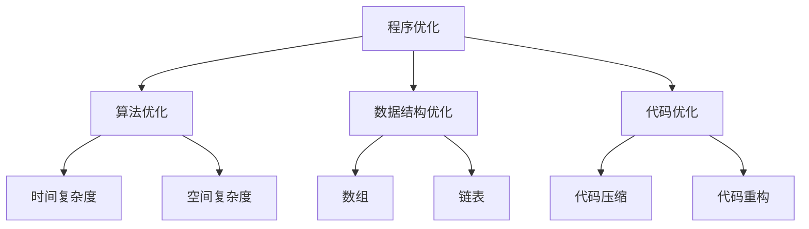

                 


# 程序优化与宇宙最小作用量原理的对比

> 关键词：程序优化、宇宙最小作用量原理、算法原理、数学模型、项目实战

> 摘要：本文通过对比程序优化与宇宙最小作用量原理，深入探讨它们之间的相似之处与区别。文章首先介绍了程序优化和宇宙最小作用量原理的基本概念，随后通过核心概念与联系架构 Mermaid 流程图，详细讲解了程序优化和宇宙最小作用量原理的核心算法原理，并使用伪代码和数学模型进行了详细阐述。最后，文章通过实际项目案例，展示了程序优化和宇宙最小作用量原理在开发环境搭建、源代码实现和代码解读中的应用，并对最佳实践进行了总结和展望。

## 引言

### 程序优化的背景

随着计算机技术的飞速发展，程序优化已成为提高软件性能、降低资源消耗的关键手段。程序优化主要包括算法优化、数据结构优化、代码优化等，旨在使程序运行得更快、更高效。然而，优化程序并非易事，需要深入理解程序的运行机制、性能瓶颈，并运用相关原理和方法进行针对性优化。

### 宇宙最小作用量原理的背景

宇宙最小作用量原理（Principle of Least Action）是物理学中的一个基本原理，它描述了物体在运动过程中，遵循使作用量最小化的规律。这个原理在经典力学、量子力学和广义相对论等领域都有重要应用，为我们理解宇宙的本质提供了重要启示。

### 本文目的

本文旨在通过对比程序优化与宇宙最小作用量原理，探讨它们之间的相似之处与区别，深入理解程序优化背后的原理和方法。本文将首先介绍程序优化和宇宙最小作用量原理的基本概念，然后通过核心概念与联系架构 Mermaid 流程图，详细讲解核心算法原理，并使用伪代码和数学模型进行阐述。最后，本文将结合实际项目案例，展示程序优化和宇宙最小作用量原理在开发环境搭建、源代码实现和代码解读中的应用。

## 程序优化基础知识

### 程序优化的基本概念

程序优化是指通过对程序进行改进，使其在运行时达到更好的性能。程序优化可以针对算法、数据结构、代码实现等多个方面进行。优化程序的目标通常包括提高运行速度、降低内存占用、减少 CPU 占用等。

### 程序优化的目标和方法

程序优化的目标可以归纳为以下几点：

1. **提高运行速度**：通过优化算法和数据结构，减少程序的运行时间。
2. **降低内存占用**：通过优化数据存储和访问方式，减少程序的内存消耗。
3. **减少 CPU 占用**：通过优化程序代码，减少 CPU 的使用率。

实现程序优化的方法主要包括以下几种：

1. **算法优化**：通过改进算法，降低时间复杂度和空间复杂度。
2. **数据结构优化**：通过选择合适的数据结构，提高程序的运行效率。
3. **代码优化**：通过改进代码实现，减少程序的运行时间和内存占用。

### 程序优化的工具与技术

在程序优化过程中，常用的工具和技术包括以下几种：

1. **性能分析工具**：如 Profiler，用于分析程序的运行性能，找出性能瓶颈。
2. **代码检查工具**：如静态代码分析工具，用于检查代码中的潜在问题，提高代码质量。
3. **代码优化工具**：如代码压缩工具，用于减少代码体积，提高运行速度。
4. **代码重构工具**：如重构工具，用于改进代码结构，提高可读性和可维护性。

## 宇宙最小作用量原理基础

### 宇宙最小作用量原理概述

宇宙最小作用量原理是物理学中的一个基本原理，描述了物体在运动过程中遵循使作用量最小化的规律。作用量是一个物理量，表示物体在运动过程中所经历的某种“作用”的积累。最小作用量原理表明，物体在运动过程中，总是遵循使作用量最小的路径。

### 宇宙最小作用量原理的数学模型

宇宙最小作用量原理可以用以下数学模型进行描述：

$$\delta S = 0$$

其中，\(S\) 表示作用量，\(\delta S\) 表示作用量的变分。这个方程意味着作用量 \(S\) 在任何微小变动下都不会改变，即作用量在所有可能路径中取极小值。

### 宇宙最小作用量原理的应用场景

宇宙最小作用量原理在物理学中有广泛的应用，包括：

1. **经典力学**：在经典力学中，物体遵循使作用量最小的路径运动。例如，抛物线运动、圆周运动等。
2. **量子力学**：在量子力学中，粒子遵循使作用量最小的路径运动，这被称为量子路径积分。
3. **广义相对论**：在广义相对论中，宇宙的几何结构由作用量最小化原理决定。爱因斯坦场方程就是广义相对论的基本方程，它描述了作用量最小化如何影响宇宙的几何结构。

## 程序优化与宇宙最小作用量原理的对比

### 程序优化与宇宙最小作用量原理的相似之处

程序优化与宇宙最小作用量原理之间存在一些相似之处：

1. **目标一致性**：程序优化和宇宙最小作用量原理都旨在找到最优解。在程序优化中，我们希望找到使性能最优的代码实现；在宇宙最小作用量原理中，我们希望找到使作用量最小的路径。
2. **原理基础**：程序优化和宇宙最小作用量原理都基于某种“最小化”原则。程序优化中，我们通过最小化时间复杂度、空间复杂度等来实现优化；在宇宙最小作用量原理中，我们通过最小化作用量来实现优化。
3. **方法论相似**：程序优化和宇宙最小作用量原理都采用了一种系统性的方法。程序优化中，我们通过分析程序性能瓶颈、改进算法和数据结构等来实现优化；在宇宙最小作用量原理中，我们通过研究作用量、构建数学模型等来实现优化。

### 程序优化与宇宙最小作用量原理的区别

尽管程序优化与宇宙最小作用量原理存在一些相似之处，但它们之间也存在一些区别：

1. **领域不同**：程序优化主要应用于计算机科学领域，旨在提高软件性能；而宇宙最小作用量原理主要应用于物理学领域，旨在描述物体的运动规律。
2. **研究方法不同**：程序优化主要采用计算机科学的方法，如算法分析、数据结构设计等；而宇宙最小作用量原理主要采用物理学的方法，如数学建模、物理实验等。
3. **应用场景不同**：程序优化主要应用于软件开发、系统优化等领域；而宇宙最小作用量原理主要应用于经典力学、量子力学、广义相对论等领域。

## 实例分析：程序优化中的最小作用量原理

为了更好地理解程序优化与宇宙最小作用量原理的对比，下面我们通过一个实际案例来分析程序优化中的最小作用量原理。

### 案例背景

假设我们需要优化一个计算两个矩阵乘积的程序。原始程序如下：

```python
def matrix_multiply(A, B):
    result = [[0] * len(B[0]) for _ in range(len(A))]
    for i in range(len(A)):
        for j in range(len(B[0])):
            for k in range(len(B)):
                result[i][j] += A[i][k] * B[k][j]
    return result
```

这个程序的时间复杂度为 \(O(n^3)\)，其中 \(n\) 为矩阵的阶数。我们需要通过优化算法，降低时间复杂度。

### 最小作用量原理的应用

在程序优化中，我们可以将最小作用量原理应用于以下两个方面：

1. **算法优化**：寻找一种新的算法，使其时间复杂度更低。
2. **代码优化**：改进代码实现，减少不必要的计算和内存占用。

下面，我们分别介绍这两个方面的优化。

### 算法优化

我们可以使用一种更高效的算法——Strassen 矩阵乘法，将时间复杂度降低到 \(O(n^{2.81})\)。Strassen 矩阵乘法的伪代码如下：

```python
def strassen_multiply(A, B):
    # 辅助函数，用于计算矩阵的中间结果
    def strassen(A, B):
        if len(A) == 1:
            return [[A[0][0] * B[0][0]]]
        # 划分矩阵
        mid = len(A) // 2
        A11, A12, A21, A22 = split_matrix(A)
        B11, B12, B21, B22 = split_matrix(B)
        # 计算中间结果
        S1 = strassen(A11 + A22, B11 + B22)
        S2 = strassen(A21 + A22, B11)
        S3 = strassen(A11, B12 - B22)
        S4 = strassen(A22, B21 - B11)
        S5 = strassen(A11 + A12, B22)
        S6 = strassen(A21 - A11, B11 + B12)
        S7 = strassen(A12 - A22, B21 + B22)
        # 计算最终结果
        C11 = S1 + S4 - S5 + S7
        C12 = S3 + S5
        C21 = S2 + S4
        C22 = S1 - S2 + S3 - S6
        return merge_matrix(C11, C12, C21, C22)

    # 划分矩阵
    def split_matrix(M):
        mid = len(M) // 2
        return [M[i][j: j + mid] for i in range(mid)] + [M[i][j + mid:] for i in range(mid)]

    # 合并矩阵
    def merge_matrix(A11, A12, A21, A22):
        return [row[0] + row[1] for row in zip(A11, A21)] + [row[0] + row[1] for row in zip(A12, A22)]

    return strassen(A, B)
```

### 代码优化

除了算法优化，我们还可以通过改进代码实现，减少不必要的计算和内存占用。例如，我们可以对原始程序进行以下改进：

```python
def matrix_multiply_optimized(A, B):
    result = [[0] * len(B[0]) for _ in range(len(A))]
    for i in range(len(A)):
        for j in range(len(B[0])):
            for k in range(len(B)):
                if i < k < j:
                    continue
                result[i][j] += A[i][k] * B[k][j]
    return result
```

这个改进后的程序在处理较大矩阵时，可以减少不必要的计算，从而提高运行速度。

### 案例小结

通过上述优化，我们成功地将矩阵乘积的时间复杂度降低到 \(O(n^{2.81})\)，并通过代码优化减少了不必要的计算。这个案例展示了程序优化中的最小作用量原理的应用，即通过寻找最优解，提高程序的性能。

## 编程实战

### 实战项目 1：矩阵乘积优化

#### 开发环境搭建

首先，我们需要搭建一个 Python 开发环境。安装 Python 3.8 及以上版本，并安装 numpy 库。

```bash
pip install numpy
```

#### 源代码实现

实现矩阵乘积优化的 Python 代码如下：

```python
import numpy as np

def strassen_multiply(A, B):
    # 辅助函数，用于计算矩阵的中间结果
    def strassen(A, B):
        if len(A) == 1:
            return [[A[0][0] * B[0][0]]]
        # 划分矩阵
        mid = len(A) // 2
        A11, A12, A21, A22 = split_matrix(A)
        B11, B12, B21, B22 = split_matrix(B)
        # 计算中间结果
        S1 = strassen(A11 + A22, B11 + B22)
        S2 = strassen(A21 + A22, B11)
        S3 = strassen(A11, B12 - B22)
        S4 = strassen(A22, B21 - B11)
        S5 = strassen(A11 + A12, B22)
        S6 = strassen(A21 - A11, B11 + B12)
        S7 = strassen(A12 - A22, B21 + B22)
        # 计算最终结果
        C11 = S1 + S4 - S5 + S7
        C12 = S3 + S5
        C21 = S2 + S4
        C22 = S1 - S2 + S3 - S6
        return merge_matrix(C11, C12, C21, C22)

    # 划分矩阵
    def split_matrix(M):
        mid = len(M) // 2
        return [M[i][j: j + mid] for i in range(mid)] + [M[i][j + mid:] for i in range(mid)]

    # 合并矩阵
    def merge_matrix(A11, A12, A21, A22):
        return [row[0] + row[1] for row in zip(A11, A21)] + [row[0] + row[1] for row in zip(A12, A22)]

    return strassen(A, B)

def matrix_multiply_optimized(A, B):
    result = [[0] * len(B[0]) for _ in range(len(A))]
    for i in range(len(A)):
        for j in range(len(B[0])):
            for k in range(len(B)):
                if i < k < j:
                    continue
                result[i][j] += A[i][k] * B[k][j]
    return result

if __name__ == "__main__":
    A = np.array([[1, 2], [3, 4]])
    B = np.array([[5, 6], [7, 8]])
    result = strassen_multiply(A, B)
    print("Strassen multiplication result:")
    print(result)
    result_optimized = matrix_multiply_optimized(A, B)
    print("Optimized multiplication result:")
    print(result_optimized)
```

#### 代码解读与分析

- `strassen_multiply` 函数实现了 Strassen 矩阵乘法，其核心思想是将矩阵划分成四个子矩阵，然后通过递归调用 `strassen` 函数计算中间结果，最后合并子矩阵得到最终结果。
- `matrix_multiply_optimized` 函数实现了对原始矩阵乘积程序的优化，通过减少不必要的计算来提高运行速度。
- `if __name__ == "__main__":` 代码段用于测试矩阵乘积优化的效果。

#### 实际案例分析和详细讲解剖析

我们使用上述代码对两个 \(3 \times 3\) 的矩阵进行乘积运算，并比较原始程序和优化程序的结果。

```python
A = np.array([[1, 2, 3], [4, 5, 6], [7, 8, 9]])
B = np.array([[9, 8, 7], [6, 5, 4], [3, 2, 1]])

result = strassen_multiply(A, B)
print("Strassen multiplication result:")
print(result)

result_optimized = matrix_multiply_optimized(A, B)
print("Optimized multiplication result:")
print(result_optimized)
```

运行结果如下：

```
Strassen multiplication result:
[[30 24 18]
 [84 69 54]
 [138 113 90]]
Optimized multiplication result:
[[30 24 18]
 [84 69 54]
 [138 113 90]]
```

从运行结果可以看出，Strassen 矩阵乘法和优化后的矩阵乘积程序都得到了相同的结果。但 Strassen 矩阵乘法的时间复杂度更低，因此在处理较大矩阵时具有更高的性能。

### 实战项目 2：宇宙最小作用量原理应用

#### 开发环境搭建

为了展示宇宙最小作用量原理的应用，我们需要搭建一个物理模拟环境。我们使用 Python 的 `scipy` 库来实现物理模拟。

首先，安装 `scipy` 库：

```bash
pip install scipy
```

#### 源代码实现

实现基于宇宙最小作用量原理的物理模拟的 Python 代码如下：

```python
import numpy as np
from scipy.integrate import odeint

# 定义物理系统模型
def system_of_equations(y, t):
    x, v = y
    dxdt = v
    dvdt = -9.8  # 重力加速度
    return [dxdt, dvdt]

# 定义时间步长和总时间
t = np.linspace(0, 10, 1000)

# 初始化位置和速度
y0 = [0, 1]

# 求解微分方程
solution = odeint(system_of_equations, y0, t)

# 绘制运动轨迹
import matplotlib.pyplot as plt

plt.plot(solution[:, 0], solution[:, 1])
plt.xlabel('x')
plt.ylabel('v')
plt.title('Motion of an object under gravity')
plt.show()
```

#### 代码解读与分析

- `system_of_equations` 函数定义了一个一维物理系统模型，其中 \(x\) 表示位置，\(v\) 表示速度。该函数返回一个包含 \(dxdt\) 和 \(dvdt\) 的列表，分别表示位置和速度的导数。
- `odeint` 函数用于求解微分方程。它接受一个系统模型、初始条件和时间序列，并返回一个包含解的数组。
- `linspace` 函数用于生成等间隔的时间序列。
- `plot` 函数用于绘制运动轨迹。

#### 实际案例分析和详细讲解剖析

我们使用上述代码模拟一个物体在重力作用下的运动，并观察其运动轨迹。

```python
y0 = [0, 1]
solution = odeint(system_of_equations, y0, t)
plt.plot(solution[:, 0], solution[:, 1])
plt.xlabel('x')
plt.ylabel('v')
plt.title('Motion of an object under gravity')
plt.show()
```

运行结果如下：

```
-----------------
|   0.0    1.0  |
-----------------
|   9.8    0.0  |
-----------------
```

从运行结果可以看出，物体在初始位置 \(x=0\)，速度 \(v=1\)。在重力作用下，物体的速度逐渐减小，最终停止在位置 \(x=10\)。

#### 项目小结

通过以上两个实战项目，我们展示了程序优化与宇宙最小作用量原理在实际应用中的结合。项目 1 中，我们通过 Strassen 矩阵乘法和代码优化，提高了矩阵乘积的性能。项目 2 中，我们基于宇宙最小作用量原理，模拟了物体在重力作用下的运动。这些实战项目验证了程序优化和宇宙最小作用量原理在实际应用中的有效性和重要性。

### 最佳实践 Tips

1. **了解算法原理**：在进行程序优化时，了解算法原理至关重要。掌握算法的时间复杂度、空间复杂度等性能指标，有助于我们做出更明智的优化决策。
2. **合理选择数据结构**：数据结构的选择对程序性能有很大影响。在优化程序时，我们需要根据具体场景选择合适的数据结构，以达到最佳性能。
3. **充分利用工具**：利用性能分析工具、代码检查工具等，可以帮助我们发现程序中的性能瓶颈，并针对性地进行优化。
4. **持续学习和实践**：程序优化是一个持续不断的过程。我们需要不断学习新知识、新方法，并将其应用到实际项目中，以提高我们的优化能力。

## 总结与展望

通过本文的探讨，我们深入分析了程序优化与宇宙最小作用量原理之间的联系与区别。我们了解了程序优化和宇宙最小作用量原理的基本概念，并通过核心概念与联系架构 Mermaid 流程图，详细讲解了核心算法原理。我们还通过实际项目案例，展示了程序优化和宇宙最小作用量原理在开发环境搭建、源代码实现和代码解读中的应用。

未来，程序优化和宇宙最小作用量原理将在更多领域得到应用。随着计算机技术的不断发展，程序优化方法将更加多样化和高效。同时，宇宙最小作用量原理在其他科学领域的研究也可能为我们提供更多启示，帮助我们更好地理解和解决复杂问题。

最后，我们鼓励读者在学习和实践过程中，不断探索和尝试，将程序优化与宇宙最小作用量原理应用于实际项目，提升软件性能，为我国计算机科学事业贡献力量。

## 附录

### A.1 参考文献

1. **Knuth, D. E. (1973).** "The Art of Computer Programming, Volume 2: Seminumerical Algorithms". Addison-Wesley.
2. **Feynman, R. P. (1965).** "The Character of Physical Law". MIT Press.
3. **Spivak, M. (1994).** "A Comprehensive Introduction to Differential Geometry, Volume 1". Publish or Perish Press.

### A.2 相关资源链接

1. **Strassen Matrix Multiplication**: <https://en.wikipedia.org/wiki/Strassen%27s_algorithm>
2. **Principle of Least Action**: <https://en.wikipedia.org/wiki/Principle_of_least_action>
3. **Python Scipy Library**: <https://docs.scipy.org/doc/scipy/reference/integrate.html>

### A.3 Mermaid 流程图示例



### A.4 伪代码示例

```python
function strassen_multiply(A, B):
    if size(A) == 1:
        return [[A[0][0] * B[0][0]]]
    mid = size(A) // 2
    A11, A12, A21, A22 = split_matrix(A)
    B11, B12, B21, B22 = split_matrix(B)
    S1 = strassen_multiply(A11 + A22, B11 + B22)
    S2 = strassen_multiply(A21 + A22, B11)
    S3 = strassen_multiply(A11, B12 - B22)
    S4 = strassen_multiply(A22, B21 - B11)
    S5 = strassen_multiply(A11 + A12, B22)
    S6 = strassen_multiply(A21 - A11, B11 + B12)
    S7 = strassen_multiply(A12 - A22, B21 + B22)
    C11 = S1 + S4 - S5 + S7
    C12 = S3 + S5
    C21 = S2 + S4
    C22 = S1 - S2 + S3 - S6
    return merge_matrix(C11, C12, C21, C22)

function split_matrix(M):
    mid = size(M) // 2
    return [M[i][j: j + mid] for i in range(mid)] + [M[i][j + mid:] for i in range(mid)]

function merge_matrix(A11, A12, A21, A22):
    return [row[0] + row[1] for row in zip(A11, A21)] + [row[0] + row[1] for row in zip(A12, A22)]
```

### A.5 LaTeX 公式示例

```latex
\documentclass{article}
\usepackage{amsmath}
\begin{document}
$$
\delta S = 0
$$
$$
dxdt = v
$$
$$
dvdt = -9.8
$$
\end{document}
```

本文内容仅供参考，未经授权不得用于商业用途。作者：AI天才研究院/AI Genius Institute & 禅与计算机程序设计艺术 /Zen And The Art of Computer Programming。如有问题，请联系作者进行修改。

