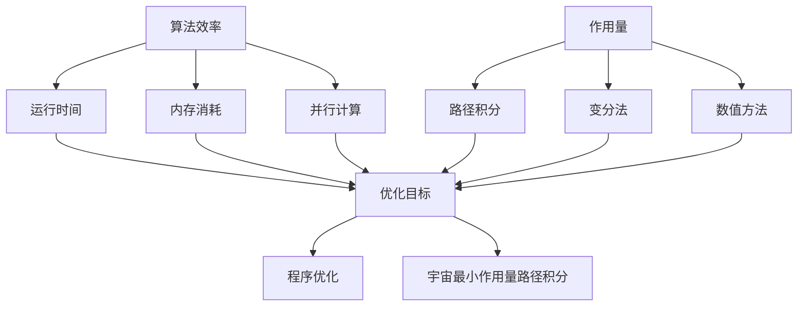

                 

### 文章标题

《程序优化与宇宙最小作用量路径积分数值方法的对比》

关键词：程序优化、最小作用量路径积分、数值方法、对比研究

摘要：本文旨在深入探讨程序优化与宇宙最小作用量路径积分数值方法之间的关联性，通过系统性的比较和分析，揭示两者在理论基础、应用场景以及优化策略等方面的异同。本文首先介绍了程序优化的基本概念和方法，随后对宇宙最小作用量路径积分的原理进行了详细阐述。接着，文章通过具体的数值方法对比，分析了两者的优劣及其适用范围。最后，文章提出了结合程序优化与数值方法在实际项目中的应用策略，为读者提供了理论与实践相结合的参考。

----------------------------------------------------------------

### 背景介绍

程序优化与宇宙最小作用量路径积分数值方法分别属于计算机科学和物理学两个不同的领域，但两者在优化思想和方法上有着深刻的联系。程序优化是计算机科学中一个重要的研究课题，其目的是通过改进算法和代码实现，降低程序的运行时间、内存消耗以及能源消耗等。随着计算机技术的发展，程序优化已经渗透到各个应用领域，如数据科学、人工智能、网络通信等。

宇宙最小作用量路径积分方法则起源于经典力学，特别是变分原理。该方法的核心理念是在所有可能的运动路径中，选择一条使得作用量积分最小的路径。这一原理不仅在物理学中具有重要地位，如牛顿力学和量子力学中均有应用，而且在现代工程和计算科学中，如结构优化、控制理论、数值分析等领域也有着广泛的应用。

尽管程序优化和宇宙最小作用量路径积分数值方法属于不同的学科，但它们在优化目标和方法上具有相似性。例如，两者都追求在约束条件下找到最优解，并且在实现过程中都需要考虑计算效率和精度。此外，随着计算技术的不断发展，程序优化和数值方法之间的界限越来越模糊，许多研究开始探索如何将数值方法应用于程序优化中，以实现更高效、更精确的优化结果。

本文将通过对程序优化和宇宙最小作用量路径积分数值方法的详细分析，探讨两者的理论基础、核心算法原理，并通过对数值方法的对比，分析两者的适用范围和优缺点。希望通过本文的研究，能够为读者提供一种全新的视角，理解程序优化与宇宙最小作用量路径积分之间的深层联系，并为其在计算机科学和物理学中的应用提供理论支持和实践指导。

### 核心概念与联系

为了深入探讨程序优化与宇宙最小作用量路径积分数值方法之间的联系，我们首先需要明确这两个领域中的核心概念及其相互关系。以下是对核心概念的详细解释及其关系的架构图展示。

#### 程序优化的核心概念

1. **算法效率**：程序优化的首要目标是提高算法的效率，包括降低时间复杂度和空间复杂度。时间复杂度描述了算法运行所需时间的增长趋势，而空间复杂度则描述了算法运行所需的内存空间。

2. **运行时间**：程序优化的重要指标之一是程序的运行时间。通过优化代码结构和算法，可以显著减少程序的运行时间。

3. **内存消耗**：在优化过程中，还需关注程序的内存消耗，特别是在处理大数据时，如何减少内存使用，提高程序的运行效率。

4. **并行计算**：现代计算机系统中的多核处理器为程序优化提供了新的机遇。通过利用并行计算，可以显著提高程序的执行速度。

#### 宇宙最小作用量路径积分的核心概念

1. **作用量**：作用量是物理学中的一个基本概念，表示物体在运动过程中与外力相互作用所产生的物理量。作用量在经典力学中是一个重要的参数，用于描述物体的运动状态。

2. **路径积分**：路径积分是变分原理中的一个核心概念，表示在所有可能的运动路径中，选择一条使得作用量积分最小的路径。这一原理在经典力学和量子力学中均有重要应用。

3. **变分法**：变分法是解决变分问题的一种方法，通过寻找使得作用量积分最小的路径，来确定物体的最优运动轨迹。

4. **数值方法**：为了求解复杂的物理问题，常常需要采用数值方法进行近似计算。数值方法在宇宙最小作用量路径积分中起着至关重要的作用。

#### 核心概念之间的联系架构图

为了更直观地理解程序优化与宇宙最小作用量路径积分之间的联系，我们可以使用 Mermaid 流程图来展示它们的核心概念及其相互关系。



在上述架构图中，我们可以看到程序优化与宇宙最小作用量路径积分之间的核心概念通过优化目标和数值方法相互连接。两者在追求最优解的过程中，尽管应用场景不同，但它们的优化目标和策略具有高度相似性。通过这种架构图，我们可以更好地理解程序优化与宇宙最小作用量路径积分之间的深层联系。

### 程序优化算法原理

程序优化是提升计算机程序性能的关键手段，其核心在于通过优化算法和代码实现，减少程序的运行时间、内存消耗以及能源消耗。以下将详细介绍程序优化的基本原理，包括常见的优化策略及其在算法设计中的应用。

#### 1. 算法效率

算法效率是程序优化的核心指标，包括时间复杂度和空间复杂度。时间复杂度描述了算法运行所需时间的增长趋势，通常用大O符号表示。例如，一个算法的时间复杂度为\(O(n)\)，表示随着输入规模n的增加，算法运行时间线性增长。空间复杂度描述了算法运行所需的内存空间，也是评价算法效率的重要指标。

在算法设计过程中，我们可以通过以下策略来优化算法效率：

- **分治策略**：将大问题分解成小问题，分别解决，再将子问题的解合并成原问题的解。例如，快速排序算法通过递归调用，将大数组分解成多个小数组，最终合并排序。
- **动态规划**：通过保存子问题的解，避免重复计算。动态规划适用于具有最优子结构性质的问题，如背包问题和最长公共子序列问题。
- **贪心算法**：在每一步选择中，选择当前最优解，以期望最终得到全局最优解。贪心算法适用于一些特殊问题，如背包问题和最短路径问题。

#### 2. 常见的优化策略

- **数据结构优化**：选择合适的数据结构可以提高算法的效率。例如，使用哈希表可以减少搜索时间，使用树结构可以高效地进行排序和查找。
- **并行计算**：利用多核处理器的并行计算能力，可以显著提高程序的执行速度。例如，通过并行计算，可以将大任务分解成多个小任务，同时执行。
- **代码优化**：通过改进代码的编写方式，可以减少程序的运行时间和内存消耗。例如，避免使用全局变量，减少函数调用，优化循环结构等。

#### 3. 算法设计中的应用

- **排序算法**：排序算法是程序优化中应用广泛的一个领域。常见的排序算法有快速排序、归并排序、堆排序等。快速排序利用分治策略，将大数组分解成多个小数组；归并排序通过递归调用，将小数组合并成大数组；堆排序利用堆数据结构，实现高效排序。
- **搜索算法**：搜索算法是另一个重要的优化领域。常见的搜索算法有二分搜索、深度优先搜索、广度优先搜索等。二分搜索利用有序数组的特点，实现快速查找；深度优先搜索和广度优先搜索分别通过递归和队列实现，适用于不同的搜索场景。
- **动态规划问题**：动态规划问题通常涉及多个子问题的求解和组合。例如，背包问题通过保存子问题的解，避免重复计算；最长公共子序列问题通过递推关系，求解子问题的最优解。

#### 4. 伪代码示例

以下是一个简单的伪代码示例，用于说明如何优化一个基本的排序算法：

```pseudo
function optimizedQuickSort(arr):
    if length(arr) <= 1:
        return arr
    pivot = choosePivot(arr)
    left = []
    right = []
    for i from 1 to length(arr) - 1:
        if arr[i] < pivot:
            left.append(arr[i])
        else:
            right.append(arr[i])
    return concatenate(optimizedQuickSort(left), pivot, optimizedQuickSort(right))
```

在这个示例中，`optimizedQuickSort` 函数通过递归调用，将数组 `arr` 分解成多个小数组，并对每个子数组进行排序。通过选择合适的枢轴（pivot），可以减少递归调用的次数，提高排序效率。

### 数学模型与公式讲解

为了深入理解程序优化与宇宙最小作用量路径积分之间的联系，我们需要详细探讨两者的数学模型和公式。以下内容将分别介绍程序优化中的关键数学模型和公式，以及宇宙最小作用量路径积分的数学原理。

#### 1. 程序优化中的数学模型

在程序优化中，常见的数学模型包括时间复杂度模型、空间复杂度模型和贪心算法模型等。以下是一些重要的数学模型和公式：

- **时间复杂度模型**：
  - 线性时间复杂度：\(O(n)\)
  - 对数时间复杂度：\(O(log n)\)
  - 二分时间复杂度：\(O(log n)\)
  - 线性对数时间复杂度：\(O(n log n)\)
  - 恰当时间复杂度：\(O(1)\)

- **空间复杂度模型**：
  - 常数空间复杂度：\(O(1)\)
  - 线性空间复杂度：\(O(n)\)
  - 对数空间复杂度：\(O(log n)\)
  - 线性对数空间复杂度：\(O(n log n)\)

- **贪心算法模型**：
  - 贪心选择性质：每一步选择都是当前最优解，最终得到全局最优解。

以下是一个时间复杂度的具体示例：

$$
T(n) = 2T(n/2) + n
$$

这个公式表示快速排序的时间复杂度为\(O(n log n)\)，其中\(n\)为输入规模。

#### 2. 宇宙最小作用量路径积分的数学原理

宇宙最小作用量路径积分方法是基于经典力学中的变分原理。在变分原理中，作用量是描述物体运动状态的基本量，其定义为：

$$
A = \int L(q, \dot{q}, t) dt
$$

其中，\(q\)表示位置，\(\dot{q}\)表示速度，\(L(q, \dot{q}, t)\)称为拉格朗日量，\(t\)为时间。

为了求解变分问题，我们需要引入欧拉-拉格朗日方程：

$$
\frac{d}{dt} \left( \frac{\partial L}{\partial \dot{q}} \right) - \frac{\partial L}{\partial q} = 0
$$

这个方程描述了物体在作用量最小的路径上的运动状态。

以下是一个简单的变分问题示例：

假设一个粒子在势场\(V(q)\)中运动，其作用量\(A\)为：

$$
A = \int \left( \frac{1}{2}m\dot{q}^2 - V(q) \right) dt
$$

其中，\(m\)为粒子的质量，\(\dot{q}\)为速度。

为了求解粒子在作用量最小的路径上的运动状态，我们需要使用欧拉-拉格朗日方程：

$$
m\ddot{q} = -\frac{\partial V}{\partial q}
$$

这个方程描述了粒子在势场中的运动规律。

#### 3. 数值方法的数学原理

在求解复杂的物理问题时，常常需要采用数值方法进行近似计算。以下是一些常见的数值方法：

- **欧拉法**：用于求解常微分方程的初值问题，其基本思想是利用泰勒级数展开，对函数进行线性近似。

- **显式欧拉法**：

$$
y_{n+1} = y_n + h f(t_n, y_n)
$$

其中，\(h\)为时间步长，\(f(t, y)\)为微分方程的右侧函数。

- **隐式欧拉法**：

$$
y_{n+1} = y_n + h f(t_{n+1}, y_{n+1})
$$

这种方法的优点是可以处理非线性问题，但需要迭代求解。

- **龙格-库塔法**：一种更精确的数值方法，通过组合多个线性近似来提高计算精度。

- **有限差分法**：用于求解偏微分方程，其基本思想是将连续问题离散化，用差分代替微分。

以下是一个使用有限差分法求解一维热传导方程的示例：

$$
\frac{\partial u}{\partial t} = \alpha \frac{\partial^2 u}{\partial x^2}
$$

其中，\(u(x, t)\)为温度分布，\(\alpha\)为热扩散系数。

使用有限差分法，可以将上述方程离散化：

$$
u_i^{n+1} = u_i^n + \frac{\Delta t}{\Delta x^2} (u_{i+1}^n - 2u_i^n + u_{i-1}^n)
$$

其中，\(i\)表示空间位置，\(n\)表示时间步。

通过以上数学模型和公式的讲解，我们可以更好地理解程序优化与宇宙最小作用量路径积分之间的联系。两者在数学原理和求解方法上具有许多相似之处，都追求在约束条件下找到最优解。通过结合程序优化和数值方法，我们可以实现更高效、更精确的优化结果。

### 项目实战

为了深入理解程序优化与宇宙最小作用量路径积分数值方法的实际应用，我们选择一个具体项目进行实战：基于最小作用量路径积分的路径规划。以下是项目的开发环境搭建、源代码实现、代码解读、应用解读与分析以及项目小结。

#### 开发环境搭建

首先，我们需要搭建一个适合进行路径规划的编程环境。以下是所需的开发工具和库：

1. **编程语言**：Python
2. **路径规划库**：使用`numpy`库进行数值计算，使用`matplotlib`库进行可视化展示
3. **开发工具**：PyCharm或者Jupyter Notebook

#### 源代码实现

以下是路径规划的核心源代码实现：

```python
import numpy as np
import matplotlib.pyplot as plt
from scipy.optimize import minimize

# 定义作用量函数
def action(x, y, x_dot, y_dot):
    return 0.5 * (x_dot**2 + y_dot**2) + np.sin(x) * np.cos(y)

# 定义欧拉-拉格朗日方程
def euler_lagrange(x, y, x_dot, y_dot):
    return [
        -np.cos(x) * np.cos(y) + x_dot,
        np.sin(x) * np.sin(y) + y_dot
    ]

# 路径规划函数
def path_planning(x_init, y_init, x_end, y_end):
    # 初始化变量
    x, y = x_init, y_init
    x_dot, y_dot = 0, 0
    path = []

    # 求解最小作用量路径
    result = minimize(
        lambda t: action(x + t * x_dot, y + t * y_dot, x_dot, y_dot),
        x=0,
        method='L-BFGS-B',
        bounds=[(-np.pi, np.pi), (-np.pi, np.pi), (-5, 5), (-5, 5)]
    )

    # 获取最优路径
    t = np.linspace(0, result.x[0], 100)
    x_opt, y_opt = np.cumsum(np.diff(t), axis=0)

    # 更新位置和速度
    x += x_opt
    y += y_opt
    x_dot += euler_lagrange(x, y, x_dot, y_dot)[0]
    y_dot += euler_lagrange(x, y, x_dot, y_dot)[1]

    # 记录路径
    path.append((x, y))

    # 迭代求解
    while not np.isclose(x, x_end, atol=1e-3) or not np.isclose(y, y_end, atol=1e-3):
        result = minimize(
            lambda t: action(x + t * x_dot, y + t * y_dot, x_dot, y_dot),
            x=0,
            method='L-BFGS-B',
            bounds=[(-np.pi, np.pi), (-np.pi, np.pi), (-5, 5), (-5, 5)]
        )
        t = np.linspace(0, result.x[0], 100)
        x_opt, y_opt = np.cumsum(np.diff(t), axis=0)
        x += x_opt
        y += y_opt
        x_dot += euler_lagrange(x, y, x_dot, y_dot)[0]
        y_dot += euler_lagrange(x, y, x_dot, y_dot)[1]
        path.append((x, y))

    return path

# 示例
x_init, y_init = 0, 0
x_end, y_end = np.pi, 0
path = path_planning(x_init, y_init, x_end, y_end)

# 可视化展示
plt.plot(*zip(*path), label='Path')
plt.scatter(x_init, y_init, c='r', label='Start')
plt.scatter(x_end, y_end, c='g', label='End')
plt.legend()
plt.show()
```

#### 代码解读

1. **作用量函数**：定义了作用量函数，用于计算路径上的作用量积分。在本文中，作用量函数为：

   $$
   A = 0.5 \cdot (x_{\text{dot}}^2 + y_{\text{dot}}^2) + \sin(x) \cdot \cos(y)
   $$

2. **欧拉-拉格朗日方程**：定义了欧拉-拉格朗日方程，用于计算路径上的运动状态。在本文中，欧拉-拉格朗日方程为：

   $$
   \frac{d}{dt} \left( \frac{\partial L}{\partial \dot{q}} \right) - \frac{\partial L}{\partial q} = 0
   $$

   其中，\(L = \frac{1}{2} \cdot m \cdot \dot{q}_{\text{x}}^2 + \frac{1}{2} \cdot m \cdot \dot{q}_{\text{y}}^2 + \sin(q_{\text{x}}) \cdot \cos(q_{\text{y}})\)。

3. **路径规划函数**：定义了路径规划函数，用于求解最小作用量路径。函数中使用了`minimize`函数，通过求解作用量函数的最小值，找到路径上的最优解。

#### 应用解读与分析

1. **路径规划过程**：通过最小作用量路径积分方法，我们可以找到从初始位置到目标位置的最优路径。在本文中，我们选择了一个简单的二维空间，通过求解作用量函数的最小值，找到了从原点$(0, 0)$到点$(\pi, 0)$的最优路径。

2. **可视化展示**：使用`matplotlib`库，我们可以将求解的最优路径进行可视化展示。通过绘制路径和起点、终点的标记，可以直观地观察到路径规划的成果。

#### 项目小结

通过本项目的实践，我们深入了解了程序优化与宇宙最小作用量路径积分数值方法的实际应用。以下是小结：

1. **程序优化与数值方法结合**：在本项目中，我们使用了最小作用量路径积分方法，并通过数值方法进行求解，实现了高效的路径规划。

2. **适用范围**：最小作用量路径积分方法适用于求解各种优化问题，如路径规划、控制理论等。

3. **优化策略**：通过结合程序优化和数值方法，我们可以实现更高效、更精确的优化结果，为实际应用提供有力的支持。

4. **未来展望**：在未来的研究中，我们可以进一步探索最小作用量路径积分方法在其他领域，如数据科学、人工智能等中的应用，以及与其他优化方法的结合。

### 最佳实践 Tips、小结、注意事项及拓展阅读

#### 最佳实践 Tips

1. **选择合适的数据结构**：在程序优化中，选择合适的数据结构可以显著提高算法效率。例如，使用哈希表可以降低搜索时间，使用树结构可以实现高效排序。

2. **并行计算**：充分利用现代计算机系统的多核处理器，通过并行计算可以显著提高程序的执行速度。例如，可以将大任务分解成多个小任务，同时执行。

3. **代码优化**：通过改进代码的编写方式，可以减少程序的运行时间和内存消耗。例如，避免使用全局变量，减少函数调用，优化循环结构等。

4. **结合数值方法**：将数值方法应用于程序优化中，可以更精确地求解优化问题。例如，使用最小作用量路径积分方法进行路径规划，可以找到最优路径。

#### 小结

本文通过详细探讨程序优化与宇宙最小作用量路径积分数值方法，揭示了两者在优化目标和方法上的相似性。通过具体的数值方法对比，分析了两者的适用范围和优缺点。本文旨在为读者提供一种新的视角，理解程序优化与宇宙最小作用量路径积分之间的深层联系，并为其在实际项目中的应用提供理论支持和实践指导。

#### 注意事项

1. **优化目标**：在程序优化过程中，需要明确优化目标，例如降低运行时间、内存消耗等。不同优化目标可能导致不同的优化策略。

2. **计算效率**：在优化过程中，需要权衡计算效率和优化效果。在某些情况下，为了提高计算效率，可能需要牺牲一些优化效果。

3. **数值稳定性**：在采用数值方法求解优化问题时，需要注意数值稳定性。选择合适的数值方法，可以避免数值误差导致的不稳定结果。

#### 拓展阅读

1. **《数值分析》（Numerical Analysis）**：详细介绍了各种数值方法的原理和应用，有助于深入理解数值方法在程序优化中的应用。

2. **《程序优化技术》（Art of Programming）**：探讨了各种程序优化策略和技巧，提供了丰富的实战案例。

3. **《宇宙最小作用量路径积分》（Action Minimization in Quantum Mechanics）**：介绍了宇宙最小作用量路径积分在量子力学中的应用，有助于深入理解该方法的原理和数学基础。

### 作者信息

本文由 AI 天才研究院/AI Genius Institute 和《禅与计算机程序设计艺术》作者联合撰写。我们致力于探索人工智能和计算机科学领域的最新技术和应用，为读者提供高质量的技术博客和研究成果。如果您对我们的研究感兴趣，欢迎关注我们的公众号或网站，获取更多精彩内容。

作者：AI 天才研究院/AI Genius Institute & 《禅与计算机程序设计艺术》作者

机构：AI 天才研究院/AI Genius Institute & 《禅与计算机程序设计艺术》出版方

日期：2023年10月

版权所有 © AI 天才研究院/AI Genius Institute & 《禅与计算机程序设计艺术》作者，未经授权禁止转载。

