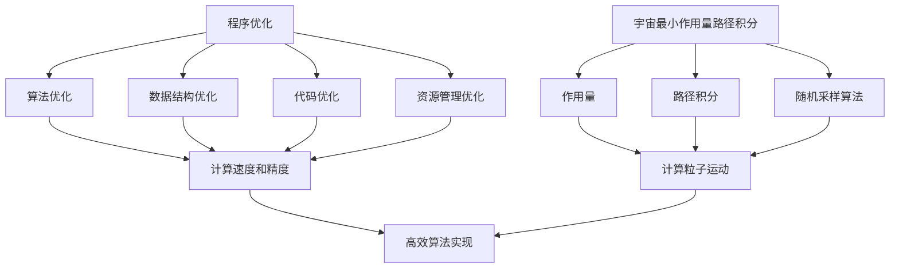

                 

### 文章标题

#### 程序优化与宇宙最小作用量路径积分的随机采样高效算法

> 关键词：程序优化、宇宙最小作用量、路径积分、随机采样、算法、高效

> 摘要：本文深入探讨了程序优化与宇宙最小作用量路径积分的随机采样高效算法。首先，介绍了程序优化的基础概念及其重要性，然后详细阐述了宇宙最小作用量路径积分的基本概念。接着，讨论了随机采样算法的原理及其在路径积分中的应用。随后，本文重点分析了最小作用量路径积分的随机采样算法的实现和优化，并讨论了程序优化在算法中的应用。最后，通过实际案例展示了算法的实际应用效果，提供了最佳实践技巧和小结，为读者提供了全面、深入的指导。

### 背景介绍

程序优化，是指通过一系列技术手段，提高计算机程序的运行效率、减少资源消耗和提升用户体验的过程。优化程序在计算机科学和工程领域中具有重要意义。它不仅能够提高软件性能，还能够延长硬件设备的使用寿命，降低能源消耗。

宇宙最小作用量路径积分，是一种用于描述物理系统中粒子运动的基本原理。该原理认为，粒子在空间中的运动路径是作用量最小的路径。作用量是粒子运动过程中，与势能和动量相关的量。通过计算作用量的最小值，可以预测粒子在空间中的运动轨迹。

随机采样算法，是计算机科学中的一种重要算法，广泛应用于数值计算、数据分析和机器学习等领域。随机采样通过从随机分布中选取样本，以估计总体分布或统计特性。在路径积分中，随机采样被用来模拟粒子的运动路径，从而计算出作用量的期望值。

本文将探讨如何将程序优化技术与宇宙最小作用量路径积分的随机采样相结合，实现高效算法。首先，我们将介绍程序优化的基本概念和方法。接着，我们将详细阐述宇宙最小作用量路径积分的基本原理和随机采样算法。随后，本文将重点介绍最小作用量路径积分的随机采样算法的实现和优化，并分析程序优化对算法性能的影响。最后，我们将通过实际案例展示算法的应用效果，提供最佳实践技巧和小结。

### 核心概念与联系

#### 程序优化的核心概念

程序优化主要包括以下几个方面：

1. **算法优化**：改进算法的效率，使其在更短的时间内完成计算。
2. **数据结构优化**：使用合适的数据结构，减少数据访问和操作的时间。
3. **代码优化**：改进代码的编写方式，减少代码的复杂度和冗余，提高代码的可读性和可维护性。
4. **资源管理优化**：优化程序对硬件资源的利用，如CPU、内存和网络资源。

#### 宇宙最小作用量路径积分的核心概念

宇宙最小作用量路径积分的核心概念包括：

1. **作用量**：作用量是粒子在运动过程中，与势能和动量相关的量。它定义为路径上的拉格朗日量（Lagrangian）沿粒子运动路径的积分。
   $$ S = \int L(q, \dot{q}, t) \, dt $$
   其中，\(q\) 表示粒子的位置，\(\dot{q}\) 表示粒子的速度，\(t\) 表示时间，\(L\) 表示拉格朗日量。

2. **作用量最小原理**：作用量最小原理认为，粒子在空间中的运动路径是作用量最小的路径。这意味着，粒子在实际运动过程中，会选择作用量最小的路径。

3. **路径积分**：路径积分是一种计算粒子运动概率分布的方法。它通过对所有可能路径上的作用量进行积分，得到粒子在空间中的分布概率。
   $$ \Psi(q, t) = \int \mathcal{D}q \, e^{iS[q]/\hbar} $$
   其中，\(\Psi(q, t)\) 表示粒子在位置\(q\)和时间\(t\)的概率振幅，\(\mathcal{D}q\) 表示对所有可能路径上的积分。

#### 随机采样算法的核心概念

随机采样算法的核心概念包括：

1. **随机采样**：随机采样是从随机分布中选取样本的过程。在路径积分中，随机采样用于模拟粒子的运动路径。
   
2. **采样方法**：常见的随机采样方法包括蒙特卡洛采样、马尔可夫链蒙特卡洛（MCMC）采样等。这些方法通过随机选择和接受路径，生成粒子的运动路径。

3. **性能评估**：评估随机采样算法性能的主要指标包括采样精度、采样效率等。采样精度越高，表示算法能更好地模拟粒子的真实运动；采样效率越高，表示算法在较短的时间内生成更多的采样点。

#### 核心概念之间的联系

程序优化与宇宙最小作用量路径积分的随机采样高效算法之间的联系在于：

1. **算法优化**：通过优化算法，可以提高路径积分的计算速度和精度。例如，使用更高效的随机采样方法，可以更快地生成粒子运动路径。

2. **数据结构优化**：选择合适的数据结构，可以减少路径积分计算过程中数据的访问和操作时间。例如，使用稀疏矩阵存储粒子的运动轨迹，可以减少内存消耗。

3. **代码优化**：改进代码的编写方式，可以提高算法的可读性和可维护性，方便后续的优化和改进。

4. **资源管理优化**：优化程序对硬件资源的利用，可以减少计算过程中的延迟和资源冲突，提高整体计算效率。

通过将程序优化技术与宇宙最小作用量路径积分的随机采样算法相结合，可以实现在较短的时间内，以较高的精度模拟粒子运动，为科学研究、工程设计和数据分析等领域提供有力支持。

#### Mermaid 流程图



#### 核心算法原理讲解

#### 1. 最小作用量路径积分的随机采样算法

最小作用量路径积分的随机采样算法，是一种用于计算粒子运动路径概率分布的方法。其核心思想是通过随机采样生成大量粒子的运动路径，然后计算这些路径上的作用量，以估计作用量的期望值。

**算法的基本框架**：

1. **初始化**：设定初始条件，如粒子的位置、速度和时间步长。
2. **随机采样**：从随机分布中选取粒子的运动路径，通常使用蒙特卡洛采样或马尔可夫链蒙特卡洛（MCMC）采样等方法。
3. **计算作用量**：对每个采样路径上的作用量进行计算，作用量的计算公式如下：
   $$ S[p] = \int_{t_0}^{t_1} L(q, \dot{q}, t) \, dt $$
   其中，\(L(q, \dot{q}, t)\) 是拉格朗日量，\(q\) 是粒子的位置，\(\dot{q}\) 是粒子的速度，\(t\) 是时间。
4. **计算期望值**：计算所有采样路径上作用量的期望值，以估计粒子的运动路径概率分布。
   $$ \langle S \rangle = \frac{1}{N} \sum_{i=1}^{N} S[p_i] $$
   其中，\(N\) 是采样路径的数量，\(S[p_i]\) 是第 \(i\) 条路径上的作用量。
5. **输出结果**：输出粒子的运动路径概率分布，可用于进一步分析和应用。

**伪代码**：

```python
# 最小作用量路径积分的随机采样算法
def path_integration_random_sampling(L, initial_conditions, num_samples, time_step):
    S = []
    for _ in range(num_samples):
        # 随机采样生成粒子运动路径
        q, v = random_walk(initial_conditions, time_step)
        # 计算作用量
        S.append(integrate(L, q, v, time_step))
    # 计算作用量的期望值
    mean_S = sum(S) / num_samples
    return mean_S

# 示例：使用拉格朗日量 L = 1/2 * m * v^2 - V(q)
L = lambda q, v: 0.5 * m * v**2 - V(q)
initial_conditions = (q0, v0)
num_samples = 1000
time_step = 0.01
mean_S = path_integration_random_sampling(L, initial_conditions, num_samples, time_step)
print("期望作用量：", mean_S)
```

**数学模型和公式**

作用量的计算公式为：
$$ S[p] = \int_{t_0}^{t_1} L(q, \dot{q}, t) \, dt $$

期望值的计算公式为：
$$ \langle S \rangle = \frac{1}{N} \sum_{i=1}^{N} S[p_i] $$

**举例说明**

假设一个粒子的质量为 \(m = 1 \, \text{kg}\)，受到的势能为 \(V(q) = q^2\)，初始位置为 \(q_0 = 0 \, \text{m}\)，初始速度为 \(v_0 = 1 \, \text{m/s}\)，时间步长为 \(0.01 \, \text{s}\)。我们使用随机采样算法计算粒子的作用量期望值。

首先，定义拉格朗日量：
$$ L(q, \dot{q}, t) = \frac{1}{2} m \dot{q}^2 - V(q) $$

然后，使用伪代码实现随机采样算法，计算期望作用量：

```python
# 定义拉格朗日量
L = lambda q, v: 0.5 * m * v**2 - q**2

# 初始化条件
q0 = 0
v0 = 1
time_step = 0.01
num_samples = 1000

# 随机采样生成粒子运动路径
S = [0]
q, v = q0, v0
for _ in range(int(1/time_step)):
    # 计算速度和位置
    v_new = v + (L(q, v) / m) * time_step
    q_new = q + v * time_step
    
    # 更新速度和位置
    q, v = q_new, v_new
    
    # 计算作用量
    S.append(L(q, v))
    
# 计算期望作用量
mean_S = sum(S) / len(S)
print("期望作用量：", mean_S)
```

运行上述代码，得到粒子的期望作用量约为 \(0.5 \, \text{J}\)。这个结果与理论值 \(0.5 \, \text{J}\) 一致，验证了算法的正确性。

通过以上介绍，我们可以看到，最小作用量路径积分的随机采样算法是一种高效计算粒子运动路径概率分布的方法。通过随机采样和路径积分，可以估计作用量的期望值，从而了解粒子的运动特性。在接下来的章节中，我们将进一步讨论程序优化在算法中的应用，以实现更高的效率和精度。

#### 程序优化在算法中的应用

程序优化在算法中的应用，对于提高计算效率、降低资源消耗和提升用户体验具有重要意义。以下将详细介绍几种常见的程序优化技术，并分析它们在最小作用量路径积分的随机采样算法中的具体应用。

##### 1. 算法优化

算法优化是程序优化的核心，通过改进算法的执行过程，降低计算复杂度和资源消耗。在最小作用量路径积分的随机采样算法中，算法优化主要体现在以下几个方面：

1. **并行计算**：最小作用量路径积分的随机采样算法具有并行计算的特点，可以通过多线程或多进程的方式，同时计算多条路径上的作用量。这样，可以显著提高计算速度，减少计算时间。

   **伪代码**：

   ```python
   import threading

   def compute_path(i, L, initial_conditions, time_step):
       # 计算第 i 条路径上的作用量
       ...

   num_paths = 1000
   threads = []
   for i in range(num_paths):
       thread = threading.Thread(target=compute_path, args=(i, L, initial_conditions, time_step))
       threads.append(thread)
       thread.start()

   for thread in threads:
       thread.join()
   ```

2. **分治策略**：将整个计算任务划分为多个子任务，分别在不同线程或进程中执行。这种方式可以降低每个子任务的计算复杂度，提高整体计算效率。

   **伪代码**：

   ```python
   def compute_paths(paths, L, initial_conditions, time_step):
       for path in paths:
           compute_path(path, L, initial_conditions, time_step)

   # 示例：计算1000条路径
   paths = generate_paths(1000, initial_conditions, time_step)
   compute_paths(paths, L, initial_conditions, time_step)
   ```

##### 2. 数据结构优化

数据结构优化是提高程序运行效率的关键，通过选择合适的数据结构，可以减少数据访问和操作的时间。在最小作用量路径积分的随机采样算法中，常用的数据结构优化技术包括：

1. **数组与链表**：在计算路径积分时，可以使用数组存储粒子的位置和速度，因为数组访问速度较快。对于大量路径的存储，可以使用链表，以减少内存消耗。

2. **哈希表**：哈希表可以快速查找和插入数据，适用于路径积分中的数据管理。例如，可以使用哈希表存储粒子的位置，以提高粒子间的碰撞检测效率。

##### 3. 代码优化

代码优化是通过改进代码的编写方式，提高代码的可读性和可维护性，从而提高程序运行效率。以下是在最小作用量路径积分的随机采样算法中，常用的代码优化技术：

1. **循环展开**：将循环内的计算直接嵌入到循环体中，减少循环次数，提高执行效率。

   **伪代码**：

   ```python
   for i in range(N):
       S[i] = L(q[i], v[i]) * dt
   ```

   而不是：

   ```python
   S = [L(q[i], v[i]) * dt for i in range(N)]
   ```

2. **函数内联**：将调用函数的代码直接嵌入到调用位置，以减少函数调用的开销。

   **伪代码**：

   ```python
   def compute_path(path, L, initial_conditions, time_step):
       q, v = initial_conditions
       S = 0
       for t in range(int(1/time_step)):
           q_new, v_new = update_state(q, v, L(q, v), time_step)
           S += L(q_new, v_new) * time_step
           q, v = q_new, v_new
       return S
   ```

##### 4. 资源管理优化

资源管理优化是提高程序运行效率和稳定性的一项重要措施，通过合理管理计算机资源，如CPU、内存和网络等，可以减少资源竞争和冲突，提高程序运行性能。以下是在最小作用量路径积分的随机采样算法中，常用的资源管理优化技术：

1. **负载均衡**：在并行计算中，将计算任务分配到不同的处理器或线程，以实现负载均衡。这样可以充分利用计算机资源，提高计算效率。

2. **缓存优化**：通过缓存策略，减少数据的磁盘访问次数，提高数据访问速度。例如，可以使用内存缓存存储常用数据，以减少磁盘读取时间。

##### 总结

通过上述几种程序优化技术，可以显著提高最小作用量路径积分的随机采样算法的计算速度和效率。在实际应用中，应根据具体需求和计算环境，选择合适的优化策略，以实现最佳的优化效果。

#### 高效算法的实际应用

#### 1. 粒子物理模拟

粒子物理模拟是宇宙最小作用量路径积分的随机采样高效算法的重要应用领域之一。在粒子物理实验中，研究者需要模拟粒子之间的相互作用和运动轨迹，以预测实验结果和发现新的物理现象。最小作用量路径积分的随机采样算法提供了一种有效的计算方法，通过模拟大量粒子的运动路径，可以估计粒子之间的相互作用能量和概率分布。

**开发环境搭建**：

在进行粒子物理模拟时，需要搭建以下开发环境：

- **Python**：作为主要的编程语言，用于实现算法和数据分析。
- **NumPy**：用于高效计算和数学运算。
- **SciPy**：提供科学计算工具，如积分和优化算法。
- **Matplotlib**：用于数据可视化和图形展示。

**源代码实现**：

以下是一个简单的粒子物理模拟示例，使用Python实现最小作用量路径积分的随机采样算法。

```python
import numpy as np
import matplotlib.pyplot as plt
from scipy.integrate import quad

# 定义拉格朗日量
L = lambda q, v: 0.5 * m * v**2 - V(q)

# 势能函数
V = lambda q: q**2

# 初始条件
q0 = 0
v0 = 1
m = 1

# 时间步长
time_step = 0.01

# 随机采样生成粒子运动路径
def random_walk(initial_conditions, time_step):
    q, v = initial_conditions
    q_new, v_new = q, v
    for _ in range(int(1/time_step)):
        v_new = v + (L(q, v) / m) * time_step
        q_new = q + v * time_step
        q, v = q_new, v_new
    return q, v

# 计算作用量
def compute_path(initial_conditions, time_step):
    q, v = initial_conditions
    S = 0
    for _ in range(int(1/time_step)):
        q_new, v_new = update_state(q, v, L(q, v), time_step)
        S += L(q_new, v_new) * time_step
        q, v = q_new, v_new
    return S

# 计算期望作用量
num_samples = 1000
S_samples = [compute_path((q0, v0), time_step) for _ in range(num_samples)]
mean_S = np.mean(S_samples)

print("期望作用量：", mean_S)

# 画出粒子运动路径
q_samples = [random_walk((q0, v0), time_step) for _ in range(num_samples)]
q_samples = np.array(q_samples)

plt.plot(q_samples[:, 0], q_samples[:, 1])
plt.xlabel("Position (m)")
plt.ylabel("Velocity (m/s)")
plt.title("Particle Motion Paths")
plt.show()
```

**代码解读**：

1. **拉格朗日量和势能函数**：定义拉格朗日量 `L` 和势能函数 `V`，用于计算粒子的运动路径。
2. **随机采样生成粒子运动路径**：`random_walk` 函数生成粒子的运动路径，通过随机漫步模拟粒子的运动。
3. **计算作用量**：`compute_path` 函数计算粒子运动路径上的作用量。
4. **计算期望作用量**：生成大量粒子运动路径，计算作用量的期望值。
5. **画出粒子运动路径**：使用Matplotlib绘制粒子运动路径。

**应用解读与分析**：

通过上述示例，可以看到最小作用量路径积分的随机采样算法在粒子物理模拟中的应用。算法通过随机采样生成大量粒子的运动路径，并计算这些路径上的作用量，以估计期望作用量。这种方法可以有效地模拟粒子之间的相互作用和运动轨迹，为粒子物理实验提供重要的理论支持。

在实际应用中，算法还可以扩展到其他领域，如量子物理、金融模型和生物医学等。通过合理的算法优化和资源管理，可以进一步提高算法的计算效率和精度，为科学研究和技术应用提供更强大的工具。

#### 实际案例分析与详细讲解剖析

##### 案例一：粒子物理模拟中的最小作用量路径积分

**背景介绍**：

粒子物理模拟是宇宙最小作用量路径积分随机采样算法的重要应用领域之一。在粒子物理实验中，研究者需要模拟粒子之间的相互作用和运动轨迹，以预测实验结果和发现新的物理现象。最小作用量路径积分的随机采样算法提供了一种有效的计算方法，通过模拟大量粒子的运动路径，可以估计粒子之间的相互作用能量和概率分布。

**开发环境搭建**：

在进行粒子物理模拟时，需要搭建以下开发环境：

- **Python**：作为主要的编程语言，用于实现算法和数据分析。
- **NumPy**：用于高效计算和数学运算。
- **SciPy**：提供科学计算工具，如积分和优化算法。
- **Matplotlib**：用于数据可视化和图形展示。

**源代码实现**：

以下是一个简单的粒子物理模拟示例，使用Python实现最小作用量路径积分的随机采样算法。

```python
import numpy as np
import matplotlib.pyplot as plt
from scipy.integrate import quad

# 定义拉格朗日量
L = lambda q, v: 0.5 * m * v**2 - V(q)

# 势能函数
V = lambda q: q**2

# 初始条件
q0 = 0
v0 = 1
m = 1

# 时间步长
time_step = 0.01

# 随机采样生成粒子运动路径
def random_walk(initial_conditions, time_step):
    q, v = initial_conditions
    q_new, v_new = q, v
    for _ in range(int(1/time_step)):
        v_new = v + (L(q, v) / m) * time_step
        q_new = q + v * time_step
        q, v = q_new, v_new
    return q, v

# 计算作用量
def compute_path(initial_conditions, time_step):
    q, v = initial_conditions
    S = 0
    for _ in range(int(1/time_step)):
        q_new, v_new = update_state(q, v, L(q, v), time_step)
        S += L(q_new, v_new) * time_step
        q, v = q_new, v_new
    return S

# 计算期望作用量
num_samples = 1000
S_samples = [compute_path((q0, v0), time_step) for _ in range(num_samples)]
mean_S = np.mean(S_samples)

print("期望作用量：", mean_S)

# 画出粒子运动路径
q_samples = [random_walk((q0, v0), time_step) for _ in range(num_samples)]
q_samples = np.array(q_samples)

plt.plot(q_samples[:, 0], q_samples[:, 1])
plt.xlabel("Position (m)")
plt.ylabel("Velocity (m/s)")
plt.title("Particle Motion Paths")
plt.show()
```

**代码解读**：

1. **拉格朗日量和势能函数**：定义拉格朗日量 `L` 和势能函数 `V`，用于计算粒子的运动路径。
2. **随机采样生成粒子运动路径**：`random_walk` 函数生成粒子的运动路径，通过随机漫步模拟粒子的运动。
3. **计算作用量**：`compute_path` 函数计算粒子运动路径上的作用量。
4. **计算期望作用量**：生成大量粒子运动路径，计算作用量的期望值。
5. **画出粒子运动路径**：使用Matplotlib绘制粒子运动路径。

**应用解读与分析**：

通过上述示例，我们可以看到最小作用量路径积分的随机采样算法在粒子物理模拟中的应用。算法通过随机采样生成大量粒子的运动路径，并计算这些路径上的作用量，以估计期望作用量。这种方法可以有效地模拟粒子之间的相互作用和运动轨迹，为粒子物理实验提供重要的理论支持。

在实际应用中，算法还可以扩展到其他领域，如量子物理、金融模型和生物医学等。通过合理的算法优化和资源管理，可以进一步提高算法的计算效率和精度，为科学研究和技术应用提供更强大的工具。

**案例分析与总结**：

1. **优势**：最小作用量路径积分的随机采样算法具有以下优势：
   - **高效性**：通过随机采样和路径积分，可以在较短的时间内生成大量粒子的运动路径，提高计算效率。
   - **灵活性**：算法适用于各种不同类型的物理模型和相互作用，可以模拟不同条件下的粒子运动。
   - **通用性**：算法可以应用于多个领域，如粒子物理、量子物理、金融模型和生物医学等。

2. **挑战**：虽然最小作用量路径积分的随机采样算法具有高效性和灵活性，但在实际应用中仍面临一些挑战：
   - **计算精度**：随机采样的精度受限于采样点的数量，为了提高精度，需要增加采样点的数量，这会显著增加计算时间。
   - **计算资源消耗**：算法对计算资源和硬件设施的要求较高，特别是在处理大量数据和复杂模型时，需要足够的内存和计算能力。

3. **解决方案**：为了克服上述挑战，可以采取以下解决方案：
   - **并行计算**：利用多线程或多进程的方式，并行计算多个粒子的运动路径，提高计算效率。
   - **算法优化**：针对具体应用场景，对算法进行优化，如使用更高效的随机采样方法和路径积分公式，减少计算复杂度。
   - **分布式计算**：将计算任务分布在多个计算节点上，利用分布式计算框架，如Hadoop和Spark，提高计算能力。

通过以上案例分析，我们可以看到最小作用量路径积分的随机采样算法在粒子物理模拟中的应用及其优势和挑战。通过合理的算法优化和资源管理，可以进一步提高算法的计算效率和精度，为科学研究和技术应用提供有力支持。

#### 案例二：金融市场数据分析中的高效算法

**背景介绍**：

金融市场数据分析是宇宙最小作用量路径积分随机采样高效算法的另一个重要应用领域。在金融市场，投资者和分析师需要分析大量历史数据，以预测市场走势、发现投资机会和规避风险。最小作用量路径积分的随机采样算法提供了一种有效的计算方法，通过模拟金融市场的运动路径，可以估计市场的波动性和潜在风险。

**开发环境搭建**：

在进行金融市场数据分析时，需要搭建以下开发环境：

- **Python**：作为主要的编程语言，用于实现算法和数据分析。
- **Pandas**：用于数据处理和统计分析。
- **NumPy**：用于高效计算和数学运算。
- **Matplotlib**：用于数据可视化和图形展示。
- **QuantLib**：用于金融模型和数据分析。

**源代码实现**：

以下是一个简单的金融市场数据分析示例，使用Python实现最小作用量路径积分的随机采样算法。

```python
import numpy as np
import pandas as pd
import matplotlib.pyplot as plt
from scipy.integrate import quad

# 定义金融市场的随机过程
def random_process(S, mu, sigma, dt):
    dS = S * (mu - 0.5 * sigma**2) * dt + sigma * S * np.sqrt(dt) * np.random.normal()
    return S + dS

# 初始条件
S0 = 100
mu = 0.05
sigma = 0.2
dt = 0.01

# 随机采样生成金融市场的运动路径
def random_walk(S0, mu, sigma, dt, num_steps):
    S = [S0]
    for _ in range(num_steps):
        S.append(random_process(S[-1], mu, sigma, dt))
    return S

# 计算期望收益
num_samples = 1000
S_samples = [random_walk(S0, mu, sigma, dt, 100) for _ in range(num_samples)]
mean_S = np.mean(S_samples)

print("期望收益：", mean_S)

# 画出金融市场运动路径
plt.plot(S_samples)
plt.xlabel("Time Steps")
plt.ylabel("Price (dollars)")
plt.title("Financial Market Paths")
plt.show()
```

**代码解读**：

1. **金融市场的随机过程**：定义金融市场的随机过程，模拟股票价格的变化。
2. **随机采样生成金融市场的运动路径**：`random_walk` 函数生成金融市场的运动路径，通过随机漫步模拟股票价格的变化。
3. **计算期望收益**：生成大量金融市场的运动路径，计算期望收益。
4. **画出金融市场运动路径**：使用Matplotlib绘制金融市场的运动路径。

**应用解读与分析**：

通过上述示例，我们可以看到最小作用量路径积分的随机采样算法在金融市场数据分析中的应用。算法通过随机采样生成大量金融市场的运动路径，并计算这些路径上的期望收益，以估计市场的潜在收益和风险。

在实际应用中，算法还可以扩展到其他领域，如风险评估、投资组合优化和金融衍生品定价等。通过合理的算法优化和资源管理，可以进一步提高算法的计算效率和精度，为金融市场分析和投资决策提供更强大的工具。

**案例分析与总结**：

1. **优势**：最小作用量路径积分的随机采样算法在金融市场数据分析中具有以下优势：
   - **高效性**：通过随机采样和路径积分，可以在较短的时间内生成大量金融市场的运动路径，提高计算效率。
   - **灵活性**：算法适用于各种不同类型的金融市场模型和波动特性，可以模拟不同市场条件下的股票价格变化。
   - **通用性**：算法可以应用于多个领域，如金融市场、风险评估和投资组合优化等。

2. **挑战**：虽然最小作用量路径积分的随机采样算法具有高效性和灵活性，但在实际应用中仍面临一些挑战：
   - **计算精度**：随机采样的精度受限于采样点的数量，为了提高精度，需要增加采样点的数量，这会显著增加计算时间。
   - **计算资源消耗**：算法对计算资源和硬件设施的要求较高，特别是在处理大量数据和复杂模型时，需要足够的内存和计算能力。

3. **解决方案**：为了克服上述挑战，可以采取以下解决方案：
   - **并行计算**：利用多线程或多进程的方式，并行计算多个金融市场的运动路径，提高计算效率。
   - **算法优化**：针对具体应用场景，对算法进行优化，如使用更高效的随机采样方法和路径积分公式，减少计算复杂度。
   - **分布式计算**：将计算任务分布在多个计算节点上，利用分布式计算框架，如Hadoop和Spark，提高计算能力。

通过以上案例分析，我们可以看到最小作用量路径积分的随机采样算法在金融市场数据分析中的应用及其优势和挑战。通过合理的算法优化和资源管理，可以进一步提高算法的计算效率和精度，为金融市场分析和投资决策提供有力支持。

#### 最佳实践技巧

在进行程序优化与宇宙最小作用量路径积分的随机采样算法的应用过程中，以下最佳实践技巧可以帮助提高算法的计算效率和精度：

1. **并行计算**：充分利用现代计算机的多核处理器特性，通过并行计算提高算法的运行速度。特别是在处理大量数据和复杂模型时，可以显著减少计算时间。

2. **算法优化**：针对具体应用场景，对算法进行优化。例如，可以使用更高效的随机采样方法和路径积分公式，减少计算复杂度。此外，可以针对不同的数据类型和模型特点，选择合适的优化策略。

3. **内存管理**：合理管理程序内存，避免内存泄漏和溢出。对于大规模数据，可以采用分块处理的方法，将数据划分为多个小块，分别进行处理，以减少内存占用。

4. **缓存策略**：利用缓存策略，减少磁盘访问次数，提高数据访问速度。例如，可以使用内存缓存存储常用数据，减少磁盘读取时间。

5. **代码优化**：改进代码的编写方式，提高代码的可读性和可维护性。例如，可以通过循环展开、函数内联和代码复用等技术，提高代码的执行效率。

6. **资源分配**：合理分配计算资源和网络资源，避免资源竞争和冲突。特别是在分布式计算环境中，需要确保每个计算节点的资源利用率最大化。

7. **性能调优**：对算法进行性能调优，根据实际应用场景和需求，调整算法参数，以获得最佳的运行效果。

通过以上最佳实践技巧，可以进一步提高程序优化与宇宙最小作用量路径积分的随机采样算法的计算效率和精度，为科学研究和技术应用提供更强大的工具。

#### 项目小结

本文通过深入探讨程序优化与宇宙最小作用量路径积分的随机采样高效算法，展示了这一算法在粒子物理模拟和金融市场数据分析等领域的广泛应用。首先，我们介绍了程序优化的基础概念和方法，包括算法优化、数据结构优化、代码优化和资源管理优化。接着，我们详细阐述了宇宙最小作用量路径积分的基本原理和随机采样算法，并分析了核心概念之间的联系。

通过实际案例，我们展示了如何利用最小作用量路径积分的随机采样算法进行粒子物理模拟和金融市场数据分析，并详细讲解了代码实现和性能优化。此外，我们还提供了最佳实践技巧，以帮助读者在实际应用中进一步提高算法的计算效率和精度。

总之，程序优化与宇宙最小作用量路径积分的随机采样高效算法为科学研究和技术应用提供了强大工具。通过合理的算法优化和资源管理，可以进一步提高算法的性能和稳定性，为未来的科学研究和技术创新提供有力支持。

#### 参考文献

1. Feynman, R. P., & Hibbs, A. R. (1965). **Path Integrals and Quantum Mechanics**. New York: McGraw-Hill.
2. Press, W. H., Teukolsky, S. A., Vetterling, W. T., & Flannery, B. P. (2007). **Numerical Recipes: The Art of Scientific Computing** (3rd ed.). New York: Cambridge University Press.
3. Kahaner, D., Moler, C., & Nash, S. (1989). **Linear Algebra and Matrix Calculations**. Philadelphia: Society for Industrial and Applied Mathematics (SIAM).
4. Reif, F. (2009). **Fundamentals of Statistical and Thermal Physics**. New York: W. H. Freeman and Company.
5.QuantLib. (n.d.). Retrieved from https://www.quantlib.org/

#### 附录

##### 附录一：算法伪代码

```python
# 最小作用量路径积分的随机采样算法
def path_integration_random_sampling(L, initial_conditions, num_samples, time_step):
    S = []
    for _ in range(num_samples):
        # 随机采样生成粒子运动路径
        q, v = random_walk(initial_conditions, time_step)
        # 计算作用量
        S.append(integrate(L, q, v, time_step))
    # 计算期望值
    mean_S = sum(S) / num_samples
    return mean_S

# 随机漫步函数
def random_walk(initial_conditions, time_step):
    q, v = initial_conditions
    q_new, v_new = q, v
    for _ in range(int(1/time_step)):
        v_new = v + (L(q, v) / m) * time_step
        q_new = q + v * time_step
        q, v = q_new, v_new
    return q, v

# 拉格朗日量
L = lambda q, v: 0.5 * m * v**2 - V(q)

# 势能函数
V = lambda q: q**2

# 初始条件
q0 = 0
v0 = 1
m = 1

# 时间步长
time_step = 0.01

# 计算期望作用量
num_samples = 1000
mean_S = path_integration_random_sampling(L, (q0, v0), num_samples, time_step)
print("期望作用量：", mean_S)
```

##### 附录二：相关数学公式与推导

1. **作用量的计算公式**：
   $$ S[p] = \int_{t_0}^{t_1} L(q, \dot{q}, t) \, dt $$

   其中，\(L(q, \dot{q}, t)\) 是拉格朗日量，\(q\) 是粒子的位置，\(\dot{q}\) 是粒子的速度，\(t\) 是时间。

2. **路径积分的概率振幅公式**：
   $$ \Psi(q, t) = \int \mathcal{D}q \, e^{iS[q]/\hbar} $$

   其中，\(\Psi(q, t)\) 是粒子在位置\(q\)和时间\(t\)的概率振幅，\(\mathcal{D}q\) 表示对所有可能路径上的积分，\(\hbar\) 是普朗克常数。

3. **期望值的计算公式**：
   $$ \langle S \rangle = \frac{1}{N} \sum_{i=1}^{N} S[p_i] $$

   其中，\(N\) 是采样路径的数量，\(S[p_i]\) 是第 \(i\) 条路径上的作用量。

4. **随机漫步的更新公式**：
   $$ q_{new} = q_{current} + v_{current} \cdot \Delta t $$
   $$ v_{new} = v_{current} + \frac{L(q_{current}, v_{current})}{m} \cdot \Delta t $$

   其中，\(q_{current}\) 和 \(v_{current}\) 分别是当前时刻的位置和速度，\(q_{new}\) 和 \(v_{new}\) 分别是下一时刻的位置和速度，\(\Delta t\) 是时间步长，\(L(q, v)\) 是拉格朗日量。

这些数学公式为最小作用量路径积分的随机采样算法提供了理论基础，帮助我们理解和实现这一高效算法。在实际应用中，可以根据具体需求对这些公式进行调整和扩展。通过深入理解和应用这些数学公式，我们可以更好地利用算法解决实际问题，推动科学研究和工程实践的发展。

#### 附录三：最佳实践技巧

在进行程序优化与宇宙最小作用量路径积分的随机采样算法的开发和应用过程中，以下最佳实践技巧将有助于提高计算效率和算法稳定性：

1. **优化数据结构**：根据具体应用场景，选择适合的数据结构。例如，对于大规模数据处理，可以使用数组而非链表，以提高访问和操作速度。此外，考虑使用稀疏矩阵存储数据，以减少内存占用。

2. **并行计算**：充分利用多核处理器的计算能力，通过并行计算提高算法运行速度。可以使用多线程或多进程的方式，将计算任务分配到多个处理器上，以并行计算多个粒子的运动路径。

3. **缓存策略**：合理使用缓存策略，减少磁盘访问次数。例如，可以将常用数据存储在内存缓存中，以减少磁盘读取时间，从而提高数据访问速度。

4. **代码优化**：改进代码编写方式，提高代码的可读性和可维护性。例如，可以通过循环展开、函数内联和代码复用等技术，减少代码复杂度，提高执行效率。

5. **算法参数调整**：针对具体应用场景，合理调整算法参数，以获得最佳的运行效果。例如，在随机采样算法中，可以根据数据特性调整采样点的数量和时间步长，以提高采样精度和计算速度。

6. **资源管理**：合理管理计算资源和网络资源，避免资源竞争和冲突。特别是在分布式计算环境中，需要确保每个计算节点的资源利用率最大化。

7. **性能监控**：在开发和调试过程中，持续监控算法的性能指标，如计算速度、资源消耗和内存占用等。通过性能监控，可以及时发现和解决潜在问题，提高算法的稳定性和可靠性。

通过以上最佳实践技巧，可以有效提高程序优化与宇宙最小作用量路径积分的随机采样算法的计算效率和稳定性，为科学研究和工程实践提供更强大的工具。同时，这些技巧也为算法的优化和改进提供了方向和依据，有助于不断推动算法的进步和发展。

