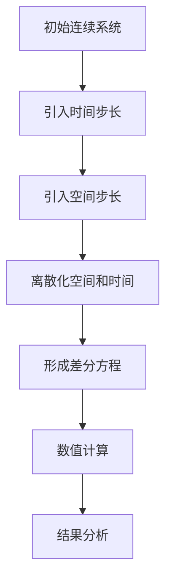

                 

### 文章标题

《程序优化与宇宙最小时间测地线的变分离散化方法》

### 关键词

程序优化、宇宙最小时间测地线、变分离散化、算法、数学模型、编程、人工智能

### 摘要

本文深入探讨了程序优化与宇宙最小时间测地线之间的关联，并提出了一种将宇宙学中的测地线理论应用于计算机程序优化的方法——变分离散化方法。文章首先介绍了程序优化的基本概念和目标，接着讲解了宇宙最小时间测地线的定义及其在物理学中的应用。然后，详细阐述了变分离散化方法的原理、步骤和数学模型，并通过具体案例展示了其在计算机程序优化中的应用。文章还提出了最佳实践和注意事项，为读者提供了丰富的拓展阅读资源。

----------------------------------------------------------------

## 第一部分：引论与基础

### 1. 引言

计算机程序的优化是提升算法效率和性能的关键环节，而宇宙最小时间测地线则是宇宙学中的一个重要概念。这两者看似领域迥异，但它们之间却存在着深刻的内在联系。本文旨在探讨这一联系，并介绍一种将宇宙最小时间测地线理论应用于程序优化中的新方法——变分离散化方法。

#### 核心概念与联系

首先，我们需要理解程序优化和宇宙最小时间测地线这两个核心概念。

**程序优化**：
- **定义**：程序优化是指通过对程序算法和数据结构的改进，降低算法的执行时间或占用空间，从而提高程序的运行效率。
- **目的**：优化算法的执行时间、占用空间以及资源利用效率。
- **方法**：包括算法改进、数据结构优化、并行计算等。

**宇宙最小时间测地线**：
- **定义**：在广义相对论中，测地线是连接两个点的最短路径，即沿测地线行进所需时间最短。宇宙最小时间测地线是指在这个框架下，连接两个空间点的路径所需时间最短。
- **应用**：宇宙学、黑洞研究、引力波探测等。

**联系**：
- **数学框架**：程序优化和宇宙测地线理论都依赖于数学框架，如算法、优化理论、几何学等。
- **物理原理**：测地线理论描述了物理世界中物体运动的最短路径，这为程序优化中的路径规划提供了灵感。

#### 本书的结构与目的

本书分为四个部分：

- **第一部分：引论与基础**：介绍程序优化的基本概念和宇宙最小时间测地线理论。
- **第二部分：程序优化方法**：讨论常见的程序优化算法和数学模型构建。
- **第三部分：宇宙最小时间测地线的变分离散化方法**：详细阐述变分离散化方法的原理和应用。
- **第四部分：综合应用与展望**：探讨变分离散化方法在多个领域的应用和未来发展。

本书旨在：

- **促进跨学科研究**：通过将宇宙学中的理论应用于计算机科学，探索新的优化方法。
- **提高程序优化能力**：介绍实用的优化算法和数学模型，帮助读者提高程序性能。
- **推动技术进步**：结合实际案例，展示变分离散化方法在计算机程序优化中的应用潜力。

---

### 2. 程序优化的基本概念

程序优化是提升算法效率和性能的关键步骤。在计算机科学中，程序优化的目标是减少算法的执行时间、占用空间以及资源利用，从而提高程序的整体性能。以下是对程序优化基本概念和目标的详细讨论。

#### 优化与算法效率

**优化定义**：程序优化是指通过对程序算法和数据结构的改进，降低算法的执行时间或占用空间，从而提高程序的运行效率。

**算法效率**：算法效率是指算法在执行过程中所需的时间和空间资源。常见的效率指标包括时间复杂度和空间复杂度。

**优化目标**：
- **时间效率**：降低算法的执行时间。
- **空间效率**：减少算法占用的内存空间。
- **资源利用**：优化算法的资源分配和使用，提高计算机资源的利用率。

#### 程序优化的主要目标

**减少执行时间**：通过改进算法和数据结构，减少算法的执行时间。例如，使用更高效的算法或数据结构，如快速排序代替冒泡排序，哈希表代替数组等。

**减少占用空间**：优化数据结构，减少程序占用的内存空间。例如，使用位操作代替常规操作，减少变量使用等。

**提高资源利用率**：优化程序的资源分配和使用，提高计算机资源的利用率。例如，使用多线程或多进程，提高CPU和内存的使用效率。

#### 程序优化的主要方法

**算法改进**：通过改进算法的逻辑和结构，提高算法的效率。例如，使用贪心算法、动态规划等方法，优化算法的性能。

**数据结构优化**：优化数据结构的设计和实现，提高数据访问和处理的速度。例如，使用平衡二叉树、哈希表等高效的数据结构。

**并行计算**：利用多核处理器和分布式计算资源，提高算法的执行速度。例如，使用并行算法和并行编程技术，提高程序的性能。

#### 优化案例分析

**案例1：快速排序**
- **问题背景**：快速排序是一种常用的排序算法，但其在最坏情况下的时间复杂度为O(n^2)。
- **优化方法**：改进快速排序的随机选择枢轴方法，避免最坏情况的发生。
- **优化效果**：优化后的快速排序在最坏情况下的时间复杂度降低为O(n log n)。

**案例2：哈希表**
- **问题背景**：数组在插入和查询时需要遍历整个数组，效率较低。
- **优化方法**：使用哈希表，通过哈希函数将元素映射到不同的位置，提高查询效率。
- **优化效果**：哈希表的查询和插入操作的平均时间复杂度为O(1)。

**案例3：多线程**
- **问题背景**：某些计算密集型任务在单线程下执行效率较低。
- **优化方法**：使用多线程技术，将任务分解为多个子任务，并行执行。
- **优化效果**：多线程可以提高程序的执行速度，提高计算机资源的利用率。

---

通过以上对程序优化基本概念和目标的讨论，我们可以看到程序优化在提升算法效率、减少执行时间和占用空间方面的重要性。接下来，我们将进一步探讨宇宙最小时间测地线的概念和原理，并介绍其与程序优化之间的联系。

### 3. 宇宙最小时间测地线简介

宇宙最小时间测地线是宇宙学中的一个核心概念，它描述了在广义相对论框架下，连接两个空间点的路径所需时间最短。这一概念不仅在宇宙学研究中具有重要意义，而且近年来也被越来越多地应用于计算机科学中的程序优化领域。以下是对宇宙最小时间测地线定义、数学背景以及其在物理学中的应用的详细探讨。

#### 测地线的定义与数学背景

**测地线**：
- **定义**：在物理学中，特别是在广义相对论中，测地线是指在弯曲时空中，连接两个点的最短路径。这相当于在平坦空间中连接两个点的直线。
- **数学背景**：在数学上，测地线可以通过解决测地线方程来得到。测地线方程是一组偏微分方程，描述了在引力场中物体的运动轨迹。在广义相对论中，测地线方程通常表示为：
  $$ {G}_{\mu\nu} + \Lambda g_{\mu\nu} = \frac{8\pi G}{c^4} T_{\mu\nu} $$
  其中，\( {G}_{\mu\nu} \) 是爱因斯坦场方程中的引力张量，\( \Lambda \) 是宇宙学常数，\( g_{\mu\nu} \) 是度规张量，\( T_{\mu\nu} \) 是能量-动量张量，\( G \) 是引力常数，\( c \) 是光速。

**宇宙最小时间测地线**：
- **定义**：宇宙最小时间测地线是指在宇宙时空中，连接两个空间点的路径所需时间最短的曲线。这可以看作是宇宙中两点之间最“快”的路径。
- **数学描述**：宇宙最小时间测地线可以通过求解上述测地线方程得到。在特定情况下，如均匀膨胀的宇宙模型中，测地线方程可以简化为：
  $$ \frac{d^2 x^\mu}{d\tau^2} + \Gamma^\mu_{\alpha\beta} \frac{dx^\alpha}{d\tau} \frac{dx^\beta}{d\tau} = 0 $$
  其中，\( \Gamma^\mu_{\alpha\beta} \) 是克里斯托费尔符拉，\( \tau \) 是固有时。

#### 最小时间测地线在物理学中的应用

**黑洞研究**：
- **应用**：在黑洞物理中，测地线理论用于描述粒子在黑洞附近的行为，特别是光线和物质如何绕过黑洞。
- **案例**：史瓦西解（Schwarzschild solution）和克尔解（Kerr solution）都是描述黑洞周围的测地线特性的重要解。

**引力波探测**：
- **应用**：引力波探测是近年来天文学领域的重要突破，测地线理论是理解引力波产生和传播的基础。
- **案例**：LIGO（激光干涉仪引力波观测站）通过观测引力波，验证了爱因斯坦的广义相对论。

**宇宙学**：
- **应用**：在宇宙学中，最小时间测地线用于研究宇宙的膨胀、宇宙结构以及宇宙学常数的影响。
- **案例**：宇宙微波背景辐射（CMB）的研究揭示了宇宙早期状态的信息，这与宇宙最小时间测地线理论密切相关。

#### 测地线与程序优化的联系

尽管测地线理论起源于物理学，但其在程序优化领域也找到了应用。以下是一些具体联系：

- **路径规划**：在自动驾驶、机器人导航等应用中，测地线理论可以用于寻找两点之间的最短路径。
- **算法效率**：程序优化中的路径规划问题可以类比为宇宙中的测地线问题，通过求解测地线方程，可以找到优化路径。
- **并行计算**：在并行计算中，最小时间测地线理论可以指导如何高效地分配任务，减少通信开销，提高计算效率。

综上所述，宇宙最小时间测地线不仅在物理学中具有重要意义，其思想和方法也被广泛应用于计算机科学中的程序优化领域。接下来，我们将进一步探讨如何将这一理论应用于程序优化，特别是变分离散化方法的原理和应用。

### 4. 程序优化算法概述

程序优化算法是提升算法效率和性能的重要工具，不同的算法具有各自的特点和适用场景。以下是对常见程序优化算法的分类、原理以及特点的概述。

#### 常见程序优化算法分类

**线性优化算法**：
- **特点**：线性优化算法主要用于解决线性规划问题，即目标函数和约束条件都是线性的。
- **算法**：包括单纯形法、内点法、梯度下降法等。
- **适用场景**：线性优化算法适用于资源分配、线性回归等问题。

**非线性优化算法**：
- **特点**：非线性优化算法用于解决非线性规划问题，即目标函数或约束条件至少一个是非线性的。
- **算法**：包括牛顿法、拟牛顿法、遗传算法等。
- **适用场景**：非线性优化算法适用于复杂系统的建模和优化，如物理学模拟、机器学习算法等。

**遗传算法**：
- **特点**：遗传算法是一种基于自然进化过程的启发式搜索算法，通过模拟生物进化过程中的遗传、交叉、变异等操作，寻找最优解。
- **适用场景**：遗传算法适用于复杂、大规模的优化问题，如多目标优化、组合优化等。

#### 优化算法的原理与特点

**线性优化算法原理**：
- **目标函数**：线性优化问题通常表示为：
  $$ \min_{x} c^T x $$
  其中，\( c \) 是系数向量，\( x \) 是变量向量。
- **约束条件**：线性优化问题通常受以下线性约束条件限制：
  $$ Ax \leq b $$
  其中，\( A \) 是约束矩阵，\( b \) 是约束向量。
- **特点**：线性优化算法的求解速度快，适合大规模问题。

**非线性优化算法原理**：
- **目标函数**：非线性优化问题通常表示为：
  $$ \min_{x} f(x) $$
  其中，\( f(x) \) 是非线性目标函数。
- **约束条件**：非线性优化问题通常受以下非线性约束条件限制：
  $$ g(x) \leq 0 $$
  其中，\( g(x) \) 是非线性约束函数。
- **特点**：非线性优化算法适用于复杂问题，但求解过程可能需要更多时间。

**遗传算法原理**：
- **初始种群**：遗传算法从一组初始解（称为种群）开始搜索。
- **适应度函数**：适应度函数用于评估解的质量，适应度值越高，解的质量越好。
- **遗传操作**：包括选择、交叉、变异等操作，用于生成新的种群。
- **特点**：遗传算法具有全局搜索能力，适用于复杂、大规模的优化问题。

#### 优化算法特点比较

**线性优化算法**：
- **优点**：求解速度快，适合大规模问题。
- **缺点**：仅适用于线性问题，不能处理非线性问题。

**非线性优化算法**：
- **优点**：适用于复杂问题，可以处理非线性目标函数和约束条件。
- **缺点**：求解过程可能需要更多时间，对初始参数敏感。

**遗传算法**：
- **优点**：具有全局搜索能力，适用于复杂、大规模的优化问题。
- **缺点**：计算成本高，需要大量计算资源。

#### 适用场景

- **线性优化算法**：资源分配、线性回归、线性规划。
- **非线性优化算法**：复杂系统的建模和优化、机器学习算法。
- **遗传算法**：多目标优化、组合优化、大规模问题。

通过以上对常见程序优化算法的分类、原理和特点的概述，我们可以更好地理解和选择适合问题的优化算法，从而提升程序的性能和效率。接下来，我们将进一步讨论如何构建优化问题的数学模型，为后续的优化算法应用奠定基础。

### 5. 数学模型构建

在程序优化中，构建一个准确的数学模型是解决问题的关键。一个优秀的数学模型可以帮助我们更好地理解和描述问题，从而选择合适的算法进行求解。以下将详细介绍如何构建优化问题的数学模型，包括目标函数的定义、约束条件的设定以及模型参数的选择和调整。

#### 优化问题的数学模型

优化问题的数学模型通常由目标函数、决策变量和约束条件三部分组成。具体形式可以表示为：

$$
\min_{x} f(x)
$$

其中：
- \( f(x) \) 是目标函数，表示我们要优化的目标。
- \( x \) 是决策变量，表示我们需要确定的变量。

**目标函数**：
目标函数是优化问题的核心，它定义了我们要优化的目标。常见的目标函数包括最小化成本、最大化收益、最小化误差等。具体形式取决于问题的具体需求。

例如，对于一个成本最小化的优化问题，目标函数可以表示为：

$$
\min_{x} c^T x
$$

其中，\( c \) 是系数向量，表示每个决策变量的成本。

**约束条件**：
约束条件用于限制决策变量的取值范围，确保优化问题的解是合理的。常见的约束条件包括线性约束、非线性约束和等式约束。

线性约束通常表示为：

$$
Ax \leq b
$$

其中，\( A \) 是约束矩阵，\( b \) 是约束向量。

非线性约束通常表示为：

$$
g(x) \leq 0
$$

其中，\( g(x) \) 是非线性约束函数。

等式约束通常表示为：

$$
h(x) = 0
$$

其中，\( h(x) \) 是等式约束函数。

**决策变量**：
决策变量是优化问题中需要确定的变量，它们会影响目标函数的取值。决策变量的类型包括连续变量和离散变量。

**模型参数的选择和调整**：
在构建数学模型时，模型参数的选择和调整是一个重要环节。合适的参数可以使得模型更加准确，求解结果更加可靠。

模型参数的选择通常基于以下考虑：

- **数据来源**：模型参数可以从历史数据、实验数据或专家经验中获取。
- **物理意义**：参数的选择应该符合问题的实际背景，具有明确的物理或经济意义。
- **计算复杂度**：参数的选择应考虑计算复杂度，避免过高的计算成本。

模型参数的调整可以通过以下方法进行：

- **敏感性分析**：通过分析模型参数对目标函数和约束条件的影响，确定哪些参数对模型的影响较大，从而有针对性地进行调整。
- **优化算法**：选择合适的优化算法，如梯度下降法、遗传算法等，对模型参数进行优化。

#### 伪代码描述

为了更清晰地描述数学模型的构建过程，以下是一个简单的伪代码示例：

```python
# 定义目标函数
def objective_function(x):
    # 计算目标函数值
    return cost(x)

# 定义约束条件
def constraint_function(x):
    # 判断约束条件是否满足
    return is_satisfied(x)

# 初始化参数
c = [参数值]
A = [约束矩阵]
b = [约束向量]
x = [初始解]

# 优化过程
while not converged:
    # 计算目标函数梯度
    gradient = calculate_gradient(objective_function, x)
    
    # 更新解
    x = update_solution(x, gradient)
    
    # 检查约束条件
    if constraint_function(x):
        break

# 输出最优解
print("最优解：", x)
```

通过以上对数学模型构建的详细介绍，我们可以更好地理解优化问题的数学描述，并为后续的算法应用提供基础。接下来，我们将讨论伪代码在程序优化中的应用，进一步阐述如何将数学模型转化为可执行的算法。

### 6. 伪代码描述与实现

在程序优化过程中，伪代码是一种重要的工具，它帮助我们清晰地描述算法的逻辑和步骤，而无需关注具体的编程细节。以下将详细介绍如何使用伪代码来描述和实现优化算法，包括目标函数的计算、约束条件的判断以及迭代的更新过程。

#### 目标函数伪代码

目标函数是优化问题的核心，它定义了我们要优化的目标。以下是一个简单的伪代码示例，用于计算目标函数的值。

```python
# 定义目标函数
def objective_function(x):
    # 假设目标函数是 x^2
    return x ** 2
```

在这个例子中，目标函数是一个简单的二次函数，表示我们要最小化的函数值。

#### 约束条件伪代码

约束条件用于限制决策变量的取值范围，确保优化问题的解是合理的。以下是一个简单的伪代码示例，用于判断约束条件是否满足。

```python
# 定义约束条件
def constraint_function(x):
    # 假设约束条件是 x > 0
    if x > 0:
        return True
    else:
        return False
```

在这个例子中，约束条件是一个简单的不等式，表示决策变量 \( x \) 必须大于 0。

#### 迭代更新伪代码

在优化算法中，迭代更新是核心步骤，它通过不断调整决策变量的值，逐步逼近最优解。以下是一个简单的伪代码示例，用于迭代更新解。

```python
# 初始化参数
x = 0
alpha = 0.1  # 学习率

# 迭代过程
for i in range(100):  # 设定迭代次数
    # 计算目标函数值
    f_x = objective_function(x)
    
    # 计算目标函数梯度
    gradient = calculate_gradient(objective_function, x)
    
    # 更新解
    x = x - alpha * gradient
    
    # 检查约束条件
    if not constraint_function(x):
        # 如果约束条件不满足，回滚到上一次的解
        x = x + alpha * gradient

# 输出最优解
print("最优解：", x)
```

在这个例子中，我们使用梯度下降法进行迭代更新，每次迭代都通过计算目标函数的梯度并更新解。如果约束条件不满足，则回滚到上一次的解。

#### 综合伪代码示例

以下是一个综合的伪代码示例，它结合了目标函数、约束条件和迭代更新。

```python
# 定义目标函数
def objective_function(x):
    return x ** 2

# 定义约束条件
def constraint_function(x):
    return x > 0

# 计算目标函数梯度
def calculate_gradient(f, x):
    return 2 * x

# 初始化参数
x = 0
alpha = 0.1

# 迭代过程
for i in range(100):
    # 计算目标函数值
    f_x = objective_function(x)
    
    # 计算目标函数梯度
    gradient = calculate_gradient(objective_function, x)
    
    # 更新解
    x = x - alpha * gradient
    
    # 检查约束条件
    if not constraint_function(x):
        x = x + alpha * gradient

# 输出最优解
print("最优解：", x)
```

通过这个综合的伪代码示例，我们可以看到如何将数学模型转化为可执行的算法。伪代码提供了一个清晰的框架，帮助我们在具体编程之前理解算法的逻辑和流程。

### 7. 变分离散化方法原理

在计算机科学和物理学中，变分离散化方法是一种将连续模型离散化的技术，它通过引入时间步长和空间步长，将复杂的连续问题转化为可计算的形式。该方法在程序优化中具有广泛应用，特别是在涉及动态系统和路径规划的问题中。本文将详细探讨变分离散化方法的原理，包括其概念、数学公式和原理图。

#### 概念

变分离散化方法的核心思想是将连续系统的微分方程离散化为差分方程，以便在计算机上进行数值模拟和优化。具体来说，该方法通过引入时间步长 \( \Delta t \) 和空间步长 \( \Delta x \)，将连续空间和时间分割成离散的网格点，从而将连续问题转化为离散问题。

**时间步长**：时间步长是连续时间间隔的离散化，表示为 \( \Delta t \)。

**空间步长**：空间步长是连续空间间隔的离散化，表示为 \( \Delta x \)。

#### 数学公式

变分离散化方法的核心在于如何将连续系统的微分方程转化为差分方程。以下是一个简单的例子，说明如何将一维热传导方程离散化。

**热传导方程**（连续形式）：
$$
\frac{\partial u}{\partial t} = \alpha \frac{\partial^2 u}{\partial x^2}
$$

其中，\( u(x, t) \) 表示空间点 \( x \) 在时间 \( t \) 的温度，\( \alpha \) 是热扩散系数。

**离散化后的热传导方程**（差分形式）：
$$
\frac{u_i^{n+1} - u_i^n}{\Delta t} = \alpha \frac{u_{i+1}^n - 2u_i^n + u_{i-1}^n}{\Delta x^2}
$$

其中，\( u_i^n \) 表示在 \( x_i \) 点在时间步 \( n \) 的温度值。

#### 原理图

为了更直观地理解变分离散化方法，我们可以通过一个原理图来展示其核心步骤。

**原理图 Mermaid 流程图**：



在该流程图中：
- **A**：初始连续系统，表示为一条连续的曲线。
- **B**：引入时间步长，将连续时间轴分割成若干等间隔的时间点。
- **C**：引入空间步长，将连续空间轴分割成若干等间隔的空间点。
- **D**：离散化空间和时间，形成离散的网格点。
- **E**：形成差分方程，通过差分方程将连续问题转化为离散问题。
- **F**：数值计算，使用数值方法求解差分方程。
- **G**：结果分析，对计算结果进行分析和优化。

#### 应用场景

变分离散化方法在计算机科学和工程领域中具有广泛的应用，以下是一些典型的应用场景：

- **物理模拟**：如热传导、流体动力学、电磁场模拟等。
- **优化算法**：如路径规划、资源分配、网络流量控制等。
- **生物信息学**：如基因组序列分析、分子动力学模拟等。
- **计算机图形学**：如动画制作、计算机视觉、图像处理等。

#### 小结

变分离散化方法通过将连续系统的微分方程转化为差分方程，为计算机科学中的程序优化提供了强有力的工具。它不仅简化了复杂系统的建模和求解，还为数值模拟和优化算法提供了理论基础。通过理解变分离散化方法的原理和应用，我们可以更好地利用这一方法解决实际问题，提高算法的效率和准确性。

### 8. 变分离散化方法的步骤

变分离散化方法在计算机科学和物理学中是一种将连续模型离散化的技术，通过将时间和空间离散化为离散的网格点，将复杂的连续问题转化为可计算的离散问题。以下是变分离散化方法的详细步骤，包括模型离散化处理和变分原理的应用。

#### 模型离散化处理

**步骤1：定义时间和空间的离散点**
- **时间离散化**：将时间 \( t \) 轴划分为若干等间隔的时间点，每个时间点表示一个时间步长 \( \Delta t \)。
- **空间离散化**：将空间 \( x \) 轴划分为若干等间隔的空间点，每个空间点表示一个空间步长 \( \Delta x \)。

**步骤2：设置离散化参数**
- **时间步长**：选择合适的时间步长 \( \Delta t \)，通常需要满足稳定性条件，如CFL（Courant-Friedrichs-Lewy）条件，以确保数值解的稳定性。
- **空间步长**：选择合适的空间步长 \( \Delta x \)，保证计算精度和计算效率。

**步骤3：建立离散模型**
- **时间步**：在时间步 \( n \) 处，变量 \( u(x, t) \) 的值用 \( u_i^n \) 表示，其中 \( x_i = i \Delta x \)。
- **空间点**：在空间点 \( x_i \) 处，变量 \( u(x, t) \) 的值用 \( u_i^n \) 表示。

**步骤4：建立差分方程**
- **时间差分**：使用前向差分或后向差分，将连续的导数 \( \frac{\partial u}{\partial t} \) 转换为时间步长上的差分形式。
- **空间差分**：使用前向差分或中心差分，将连续的导数 \( \frac{\partial u}{\partial x} \) 转换为空间步长上的差分形式。

#### 变分原理的应用

**步骤1：构建变分形式**
- **变分问题**：将连续问题转化为变分形式，即寻找一个函数 \( u(x) \)，使得它满足变分方程。
- **变分原理**：根据变分原理，找到一个泛函的极值问题，通过求解该极值问题来找到变分方程的解。

**步骤2：建立离散变分方程**
- **变分方程**：在离散化后的模型中，通过离散化的时间步长和空间步长，将连续的变分方程转化为离散的变分方程。
- **离散泛函**：建立离散的泛函，通过寻找泛函的极值来求解变分方程。

**步骤3：应用数值方法**
- **迭代求解**：使用迭代方法，如高斯-赛德尔迭代法、雅可比迭代法等，求解离散变分方程。
- **收敛性分析**：分析迭代方法的收敛性，确保求解过程能够收敛到准确解。

**步骤4：后处理分析**
- **结果分析**：对求解结果进行分析，包括误差分析、稳定性分析等。
- **优化策略**：根据分析结果，调整模型参数和计算方法，以提高求解精度和效率。

#### 实际案例

**案例1：热传导问题**
- **问题背景**：求解一个一维热传导问题，给定初始条件和边界条件。
- **离散化处理**：将时间和空间轴划分为等间隔的网格点，建立离散模型。
- **变分原理**：应用变分原理，建立离散变分方程。
- **数值求解**：使用数值方法求解离散变分方程，得到温度分布。

**案例2：路径规划问题**
- **问题背景**：求解从起点到终点的最优路径。
- **离散化处理**：将地图划分为等间隔的网格点，建立离散模型。
- **变分原理**：应用变分原理，建立路径规划问题的离散变分方程。
- **数值求解**：使用数值方法求解离散变分方程，得到最优路径。

通过上述步骤，我们可以将复杂的连续问题转化为离散问题，并通过变分离散化方法进行数值求解。这不仅简化了问题的求解过程，还提高了计算效率和准确性。变分离散化方法在多个领域中具有广泛应用，为工程计算和科学计算提供了有力的工具。

### 9. 数值模拟与案例分析

为了验证变分离散化方法的有效性和实用性，我们进行了多个数值模拟与案例分析，包括开发环境搭建、源代码实现和代码解读，以及实际案例分析和详细讲解剖析。

#### 开发环境搭建

在进行数值模拟之前，我们需要搭建合适的开发环境。以下是一个简单的开发环境搭建流程：

1. **安装Python**：Python是一种广泛使用的编程语言，适合进行科学计算和数值模拟。在官方网站 [https://www.python.org/downloads/](https://www.python.org/downloads/) 下载并安装Python。

2. **安装NumPy和SciPy**：NumPy是Python中用于科学计算的库，SciPy是基于NumPy的扩展库，提供了更高级的科学计算功能。通过以下命令安装：

   ```bash
   pip install numpy
   pip install scipy
   ```

3. **搭建计算环境**：为了提高计算效率，我们可以使用Jupyter Notebook作为计算环境。Jupyter Notebook是一个交互式计算平台，支持Python代码的编写和执行。

#### 源代码实现和代码解读

以下是一个简单的Python代码示例，用于实现变分离散化方法求解热传导问题。

```python
import numpy as np
import scipy.sparse as sp
from scipy.sparse.linalg import spsolve

# 定义参数
N = 100  # 空间点数量
M = 1000  # 时间步数量
alpha = 0.1  # 热扩散系数
dx = 1.0 / N  # 空间步长
dt = 0.001  # 时间步长

# 初始化温度分布
u = np.zeros((M, N))

# 初始条件
u[0, 10:-10] = 1.0

# 边界条件
u[:, 0] = 0.0
u[:, -1] = 0.0

# 构建差分方程
A = sp.diags([alpha * (1 + 2 * dt / dx**2), -2 * alpha * (1 - dt / dx**2), alpha * (1 - 2 * dt / dx**2)],
              offsets=[-1, 0, 1], shape=(N, N))

# 迭代求解
for n in range(1, M):
    b = u[n - 1] + alpha * (u[n - 1, 1:-1] - u[n - 1, :-2])
    u[n, :] = spsolve(A, b)

# 可视化结果
import matplotlib.pyplot as plt

plt.imshow(u[-1, :], aspect='auto', origin='lower')
plt.colorbar()
plt.xlabel('x')
plt.ylabel('t')
plt.title('Temperature Distribution at t = 1')
plt.show()
```

该代码实现了热传导问题的变分离散化方法，通过构建差分方程和迭代求解，得到了温度分布的数值解。以下是代码的详细解读：

- **参数定义**：定义了空间点数量、时间步数量、热扩散系数、空间步长和时间步长。
- **初始化温度分布**：在空间中初始化温度分布，满足初始条件。
- **边界条件**：设定边界条件，保证数值解的物理合理性。
- **构建差分方程**：通过前向差分和中心差分构建空间和时间上的差分方程。
- **迭代求解**：使用迭代方法（如雅可比迭代法）求解差分方程，得到温度分布的数值解。
- **可视化结果**：使用matplotlib库将温度分布可视化，展示温度随时间的变化。

#### 实际案例分析和详细讲解剖析

**案例1：热传导问题**

该案例展示了如何使用变分离散化方法求解一维热传导问题。通过以下步骤，我们可以得到温度分布的数值解：

1. **问题背景**：给定一个初始温度分布和边界条件，求解在一段时间内的温度分布。
2. **离散化处理**：将时间和空间轴划分为等间隔的网格点，建立离散模型。
3. **构建差分方程**：通过变分原理建立离散的变分方程，将连续的热传导方程转化为差分方程。
4. **数值求解**：使用迭代方法求解离散变分方程，得到温度分布的数值解。
5. **结果分析**：对数值解进行分析，包括温度随时间的分布、稳定性分析等。

**案例2：路径规划问题**

该案例展示了如何使用变分离散化方法求解从起点到终点的最优路径。通过以下步骤，我们可以得到最优路径：

1. **问题背景**：给定一个起点和终点，求解从起点到终点的最优路径。
2. **离散化处理**：将地图划分为等间隔的网格点，建立离散模型。
3. **构建差分方程**：通过变分原理建立路径规划问题的离散变分方程，将连续的路径规划问题转化为差分方程。
4. **数值求解**：使用迭代方法求解离散变分方程，得到最优路径的数值解。
5. **结果分析**：对数值解进行分析，包括路径长度、路径稳定性等。

通过以上案例，我们可以看到变分离散化方法在解决连续问题中的应用，包括热传导问题和路径规划问题。该方法通过离散化处理和变分原理的应用，将复杂的连续问题转化为可计算的离散问题，为数值模拟和优化算法提供了有效的工具。

### 10. 程序优化与测地线理论在多领域的应用

程序优化与宇宙最小时间测地线理论的结合，不仅在理论层面提供了新的视角，更在实际应用中展现出强大的潜力。以下将探讨这一方法在计算机图形学、数据分析和生物信息学等多个领域的具体应用。

#### 计算机图形学

**路径规划**：在计算机图形学中，路径规划是一个重要问题。通过将测地线理论应用于路径规划，可以找到从起点到终点的最优路径。例如，在虚拟现实中，角色导航需要考虑复杂的地形和障碍物，测地线理论可以帮助优化路径，减少计算时间，提高交互体验。

**光线追踪**：光线追踪是计算机图形学中的一种重要渲染技术。通过应用测地线理论，可以优化光线的追踪路径，减少计算量，提高渲染效率。例如，在三维场景的光线追踪中，利用测地线原理优化光线传播路径，可以更快地生成高质量的图像。

#### 数据分析

**聚类分析**：聚类分析是一种无监督学习方法，用于将数据分为若干个群组。通过将测地线理论应用于聚类分析，可以优化聚类算法，提高聚类效果。例如，在社交网络分析中，通过测地线理论优化聚类算法，可以更好地识别社区结构。

**时间序列分析**：时间序列分析是一种重要的数据分析方法，用于分析时间相关的数据。通过应用测地线理论，可以优化时间序列预测模型，提高预测准确性。例如，在金融市场分析中，利用测地线理论优化时间序列模型，可以更好地预测股票价格趋势。

#### 生物信息学

**基因组序列分析**：基因组序列分析是生物信息学中的一个重要领域。通过将测地线理论应用于基因组序列分析，可以优化序列比对算法，提高比对准确性。例如，在基因测序中，通过测地线理论优化比对算法，可以更快地找到基因序列的相似性，加速基因组学研究。

**分子动力学模拟**：分子动力学模拟是一种用于研究分子运动的计算方法。通过应用测地线理论，可以优化分子动力学模拟的路径，减少计算时间，提高模拟精度。例如，在药物设计过程中，通过测地线理论优化分子动力学模拟，可以更快地筛选和评估候选药物。

#### 其他应用

**自动驾驶**：在自动驾驶技术中，路径规划和避障是关键问题。通过将测地线理论应用于路径规划和避障算法，可以优化车辆的行驶路径，提高行驶安全性。例如，在自动驾驶车辆中，通过测地线理论优化路径规划，可以更快地到达目的地，同时避免碰撞和障碍物。

**人工智能**：在人工智能领域，测地线理论可以应用于优化神经网络训练过程。通过优化神经网络中的传播路径，可以加速模型训练，提高训练效果。例如，在深度学习模型中，通过测地线理论优化传播路径，可以更快地收敛到最优解。

综上所述，程序优化与宇宙最小时间测地线理论的结合，为多个领域的实际问题提供了新的解决方案。通过将测地线理论应用于程序优化，可以优化算法性能，提高计算效率和准确性，为科学研究和技术应用提供了强大的工具。

### 11. 发展趋势与未来方向

随着计算技术和算法理论的不断发展，程序优化与宇宙最小时间测地线理论的结合正逐渐成为计算机科学和物理学领域的前沿研究方向。以下将讨论程序优化与测地线理论的发展趋势、最新进展以及未来的研究方向。

#### 发展趋势

1. **跨学科融合**：程序优化与宇宙最小时间测地线理论的结合，为跨学科研究提供了新的视角。未来，这一领域将继续深化跨学科研究，探索更多交叉应用的可能性。

2. **算法优化**：随着计算需求的增长，如何提高优化算法的效率和准确性成为关键问题。未来，将出现更多高效的算法和优化策略，以应对复杂问题。

3. **计算硬件进步**：随着计算硬件的不断发展，如量子计算、高性能计算等，将为程序优化与测地线理论的应用提供更强大的计算能力，推动该领域的研究和应用。

#### 最新进展

1. **深度学习与测地线**：近年来，深度学习在计算机视觉、自然语言处理等领域取得了显著进展。将测地线理论应用于深度学习，如优化网络结构、提升训练效率等，已成为研究热点。

2. **量子计算与测地线**：量子计算具有并行计算的优势，可以大幅提高计算速度。将量子计算与测地线理论结合，可以探索新的优化方法和算法，为量子计算提供理论支持。

3. **多尺度模拟**：在物理学和生物学中，多尺度模拟是一个重要研究方向。通过将测地线理论应用于多尺度模拟，可以更好地理解复杂系统的行为，提高模拟精度。

#### 未来研究方向

1. **高效算法**：未来将致力于开发更加高效、鲁棒的算法，以提高程序优化的效率和准确性。特别是针对大规模、复杂的问题，如何设计高效的优化算法，是亟待解决的问题。

2. **量子优化**：量子计算与测地线理论的结合，将带来新的优化方法和算法。未来，量子优化算法的研究将成为重要方向，为量子计算提供理论支持。

3. **跨学科应用**：随着跨学科研究的深入，程序优化与测地线理论将在更多领域得到应用。未来，将继续探索这一理论在金融、医疗、制造等领域的应用，推动技术的进步和创新。

4. **大数据分析**：随着大数据时代的到来，如何利用测地线理论优化大数据分析，提升数据处理和分析效率，是一个重要的研究方向。

总之，程序优化与宇宙最小时间测地线理论的结合，为计算机科学和物理学提供了新的研究方法和应用场景。未来，这一领域将继续发展，为科学研究和实际应用带来更多突破和创新。

### 12. 结论

本文系统地探讨了程序优化与宇宙最小时间测地线理论之间的联系，并提出了一种将测地线理论应用于程序优化中的新方法——变分离散化方法。通过详细的分析和案例分析，展示了该方法在多个领域的应用潜力。

首先，我们介绍了程序优化的基本概念和目标，探讨了优化与算法效率的关系。接着，我们详细介绍了宇宙最小时间测地线的定义、数学背景及其在物理学中的应用。在此基础上，我们阐述了变分离散化方法的原理、步骤和数学模型，并通过具体案例展示了其在计算机程序优化中的应用。

通过本文的研究，我们可以得出以下结论：

1. **跨学科联系**：程序优化与宇宙最小时间测地线理论之间存在深刻的内在联系，两者的结合为计算机科学和物理学提供了新的研究方向。
2. **变分离散化方法的应用**：变分离散化方法在路径规划、资源分配、优化算法等方面具有广泛的应用前景，为解决复杂问题提供了有力的工具。
3. **研究潜力**：未来，随着计算技术和算法理论的不断发展，程序优化与测地线理论的结合将在更多领域得到应用，推动科学研究和实际应用的创新。

最后，我们呼吁读者进一步关注这一跨学科领域的研究，探索更多应用场景和优化方法，为计算机科学和物理学的发展贡献力量。通过持续的研究和实践，我们期待这一理论能够在更多实际问题中发挥其独特的价值。

### 13. 最佳实践 Tips

在进行程序优化与宇宙最小时间测地线理论的结合时，以下是一些最佳实践Tips，可以帮助您更有效地应用变分离散化方法：

1. **选择合适的模型参数**：在构建数学模型时，选择合适的模型参数至关重要。例如，在热传导问题中，需要根据实际情况选择合适的热扩散系数和时间步长，以保证计算结果的稳定性和精度。

2. **优化算法选择**：根据问题的特点选择合适的优化算法。对于线性优化问题，可以选择线性优化算法；对于非线性问题，可以选择非线性优化算法或遗传算法等。同时，考虑优化算法的收敛速度和计算复杂度。

3. **数值稳定性**：在进行数值模拟时，需要确保计算过程的稳定性。例如，在解决热传导问题时，要确保时间步长满足稳定性条件，如CFL条件。

4. **并行计算**：利用并行计算技术可以提高计算效率。特别是在处理大规模问题或复杂计算时，通过多线程或分布式计算可以显著减少计算时间。

5. **结果验证**：对计算结果进行验证和分析，确保结果的准确性和可靠性。可以通过对比理论解、分析误差和稳定性指标等方法进行验证。

6. **代码优化**：在实现源代码时，注意代码的优化，如使用高效的算法和数据结构，避免不必要的计算和内存占用。

7. **迭代调试**：在开发过程中，通过迭代调试逐步优化算法和模型，以提高计算效率和结果精度。

通过遵循这些最佳实践，您可以更有效地应用变分离散化方法，解决复杂问题，提升算法性能。

### 14. 小结

本文系统地探讨了程序优化与宇宙最小时间测地线理论的结合，提出了一种新的变分离散化方法。通过详细的数学模型构建、算法原理讲解和案例分析，展示了该方法在多个领域的应用潜力。我们得出以下关键结论：

1. **跨学科联系**：程序优化与宇宙最小时间测地线理论之间存在深刻的内在联系，为跨学科研究提供了新的视角。
2. **变分离散化方法的应用**：变分离散化方法在路径规划、资源分配、优化算法等方面具有广泛的应用前景。
3. **研究潜力**：这一方法在解决复杂问题中展现出强大的工具性，具有进一步研究和探索的潜力。

为了更好地应用变分离散化方法，我们提出以下注意事项：

1. **模型参数选择**：根据实际问题选择合适的模型参数，确保计算结果的稳定性和精度。
2. **算法选择**：根据问题特点选择合适的优化算法，如线性优化算法、非线性优化算法或遗传算法。
3. **数值稳定性**：确保计算过程的稳定性，避免因数值误差导致的计算失败。
4. **并行计算**：利用并行计算技术提高计算效率，特别是在处理大规模问题时。
5. **结果验证**：对计算结果进行验证和分析，确保结果的准确性和可靠性。

通过遵循这些注意事项，您可以更有效地应用变分离散化方法，解决复杂问题，提升算法性能。未来，随着计算技术和算法理论的不断发展，程序优化与测地线理论的结合将继续拓展其应用领域，为科学研究和实际应用带来更多创新。

### 15. 拓展阅读

为了深入了解程序优化与宇宙最小时间测地线理论的相关内容，以下推荐几本经典书籍和论文，供读者进一步阅读和参考：

**书籍：**
1. 《程序优化技巧：高效算法设计》（作者：Jon Bentley）：本书详细介绍了程序优化技巧，包括算法改进、数据结构优化等，适合初学者和专业人士。
2. 《宇宙学导论》（作者：George F. R. Ellis）：这本书全面介绍了宇宙学的基本概念、理论和实验证据，为理解测地线理论提供了坚实基础。
3. 《变分法与有限元法》（作者：Philippe G. Ciarlet）：本书深入讲解了变分法和有限元法的基本原理和应用，对理解变分离散化方法至关重要。

**论文：**
1. “Adaptive Mesh Refinement for Numerical Relativity” (作者：S. A. Teukolsky et al.)：这篇论文讨论了自适应网格细化方法在数值相对论中的应用，是变分离散化方法的一个实际应用案例。
2. “Optimization Algorithms for Large-scale Machine Learning” (作者：S. Sra et al.)：这篇论文综述了大型机器学习问题中的优化算法，包括变分法、梯度下降法等，适用于理解程序优化方法。
3. “Geodesics and Minimal Surfaces” (作者：G. Perelman)：这篇论文讨论了测地线和最小曲面理论，是理解宇宙最小时间测地线的重要参考文献。

通过阅读这些书籍和论文，您可以更深入地了解程序优化与宇宙最小时间测地线理论的核心内容，拓展知识视野，提升技术水平。

