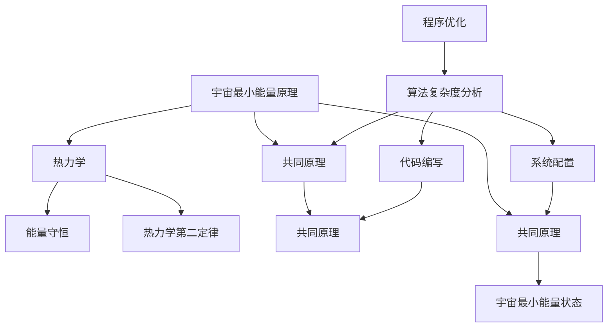

                 

## 文章标题

《程序优化与宇宙最小能量原理的对比》

### 关键词

- 程序优化
- 宇宙最小能量原理
- 计算机科学
- 物理学原理
- 算法改进
- 效能提升

### 摘要

本文将探讨程序优化与宇宙最小能量原理之间的奇妙联系。通过分析计算机科学中的优化策略，以及物理学中关于能量最小化的原理，我们将揭示这些原则在优化算法中的应用。文章将详细介绍核心概念、使用伪代码阐述算法原理，并结合实际案例进行深度剖析，最后提出最佳实践和拓展阅读，为读者提供全面的认知和理解。希望通过本文的探讨，能够启发读者从不同角度思考程序优化的可能性，从而提升编程效率和系统性能。

### 引言

在计算机科学和物理学中，优化是一个普遍存在的概念。无论是在算法设计中寻找更高效的解决方案，还是在物理系统中寻找最小能量的路径，优化都扮演着至关重要的角色。本文旨在探讨程序优化与宇宙最小能量原理之间的联系，通过比较和分析，揭示这些优化策略背后的共同原理。这一探讨不仅有助于我们更深入地理解程序优化的本质，也可能为我们提供新的优化思路和方法。

优化在计算机科学中的应用广泛，从算法的选择到代码的编写，从软件的优化到硬件的配置，每一个环节都离不开优化的身影。高效的算法能够显著提高程序的性能，减少资源的消耗，从而提高系统的整体效能。而在物理学中，能量最小化原理是理解物质运动和系统稳定性的关键。通过寻找系统的最低能量状态，我们能够预测和设计各种物理现象，从机械系统的设计到热力学过程的分析，都有其应用。

虽然这两个领域看似截然不同，但它们之间却有着深刻的联系。本文将首先介绍程序优化和宇宙最小能量原理的基本概念，然后通过具体的案例和实例，展示这些原理在计算机科学和物理学中的应用。我们还将使用伪代码和数学模型来深入探讨这些优化的原理，并通过实际项目实战来验证和验证这些优化策略的有效性。

最终，本文将总结这些优化策略的共性，提出一些最佳实践，并讨论未来的研究方向。希望通过本文的探讨，读者能够对程序优化和宇宙最小能量原理有更深刻的理解，从而在各自的领域中取得更好的成果。

### 核心概念与联系

在深入探讨程序优化与宇宙最小能量原理之前，我们需要明确两个核心概念：程序优化和宇宙最小能量原理。这两个概念虽然在表面上看起来相去甚远，但它们都遵循着一些基本的原理和逻辑。

#### 程序优化

程序优化是指通过改进算法设计、代码编写和系统配置等手段，以提高程序运行效率、减少资源消耗和提升系统性能的过程。在计算机科学中，优化涵盖了从算法复杂度分析到实际代码实现的多个层面。

- **算法复杂度分析**：在优化过程中，我们首先需要评估算法的时间复杂度和空间复杂度，以确定其效率和资源占用情况。
- **代码编写**：编写高效、可读性强的代码是优化的关键。这包括使用合适的编程语言、优化循环结构、减少冗余代码等。
- **系统配置**：优化还包括对系统硬件和软件的配置，例如使用更快的存储设备、调整操作系统参数等，以提升整体性能。

#### 宇宙最小能量原理

宇宙最小能量原理是物理学中的一个基本原理，主要描述的是在任何封闭系统中，系统的总能量会倾向于达到最小值。这个原理在多个物理领域中都有应用，如热力学、量子力学和宇宙学。

- **热力学**：在热力学中，能量守恒定律指出，能量不能被创造或销毁，只能从一种形式转换为另一种形式。而热力学第二定律则指出，在一个封闭系统中，总熵（即系统的无序度）会随着时间的推移而增加，直到达到最大熵状态，即能量最小状态。
- **量子力学**：在量子力学中，能量最小化原理体现在量子态的稳定性和能级结构上。例如，电子在原子中的能级是离散的，且最低能级是最稳定的。
- **宇宙学**：在宇宙学中，宇宙的最小能量状态对应于大爆炸之前的状态，这一状态被认为是宇宙诞生之前的最稳定状态。

#### 关系架构

为了更好地理解这两个概念之间的关系，我们可以使用Mermaid流程图来展示它们的基本原理和联系。



在这个流程图中，我们可以看到，程序优化涉及多个方面，包括算法复杂度分析、代码编写和系统配置。而宇宙最小能量原理则包括热力学、量子力学和宇宙学中的应用。它们之间的共同点在于，都遵循能量最小化的原则，即寻找系统的最低能量状态以实现最优化。

通过这一架构，我们可以更清晰地理解程序优化与宇宙最小能量原理之间的联系，为接下来的深入探讨打下基础。

### 核心算法原理讲解

为了深入理解程序优化和宇宙最小能量原理，我们需要从算法原理的角度进行详细分析。以下内容将使用伪代码来阐述核心算法的原理，并通过数学模型和公式进行详细讲解。

#### 最小二乘法优化

一个经典的优化算法是最小二乘法（Least Squares Method），它广泛应用于数据拟合和参数估计。以下是一个简单的最小二乘法伪代码示例：

```python
# 最小二乘法伪代码
def least_squares(data, model):
    # 初始化模型参数
    parameters = initialize_parameters(data)
    while not converged:
        # 计算预测值和实际值的差
        residuals = data.y - model(data, parameters)
        # 计算残差的平方和
        sum_squared_residuals = sum(residuals ** 2)
        # 计算模型参数的梯度
        gradient = compute_gradient(data, model, parameters)
        # 更新模型参数
        parameters = update_parameters(parameters, gradient)
    return parameters
```

#### 数学模型和公式

最小二乘法的目标是最小化残差的平方和，这可以用以下数学模型表示：

$$\min \sum_{i=1}^{n} (y_i - f(x_i; \theta))^2$$

其中，\( y_i \) 是实际观测值，\( f(x_i; \theta) \) 是模型对 \( x_i \) 的预测值，\( \theta \) 是模型参数。

为了求解这个最小化问题，我们可以使用梯度下降法（Gradient Descent）：

$$\theta^{t+1} = \theta^t - \alpha \nabla_\theta \sum_{i=1}^{n} (y_i - f(x_i; \theta))^2$$

其中，\( \alpha \) 是学习率，\( \nabla_\theta \) 是模型参数的梯度。

#### 举例说明

假设我们有一个线性模型 \( f(x; \theta) = \theta_0 + \theta_1 x \)，数据集 \( D = \{(x_1, y_1), (x_2, y_2), ..., (x_n, y_n)\} \)。

1. **初始化参数**：\( \theta_0 \) 和 \( \theta_1 \) 可随机初始化或使用其他方法。
2. **迭代计算**：每次迭代计算预测值和残差，更新参数。
3. **收敛条件**：当参数更新幅度小于某个阈值时，认为算法已经收敛。

具体迭代过程如下：

```python
# 梯度下降法迭代过程
theta_0, theta_1 = initialize_parameters()
while not converged:
    predictions = [theta_0 + theta_1 * x for x in X]
    residuals = [y - pred for y, pred in zip(y, predictions)]
    sum_squared_residuals = sum([res ** 2 for res in residuals])
    gradient = compute_gradient(X, y, theta_0, theta_1)
    theta_0, theta_1 = update_parameters(theta_0, theta_1, gradient)
```

#### 详细解释

- **初始化参数**：初始化参数是优化算法的第一步，通常使用随机初始化或启发式方法。
- **计算预测值和残差**：每次迭代计算模型预测值和实际值之间的差异，即残差。
- **计算梯度**：计算模型参数的梯度，用于指导参数更新。
- **更新参数**：根据梯度和学习率更新模型参数，以减小残差。
- **收敛条件**：当参数更新幅度小于某个阈值时，算法认为已经收敛，停止迭代。

#### 数学公式

在最小二乘法中，参数的更新可以通过以下数学公式表示：

$$\theta_j^{t+1} = \theta_j^t - \alpha \frac{\partial}{\partial \theta_j} \sum_{i=1}^{n} (y_i - f(x_i; \theta))^2$$

其中，\( \theta_j \) 是模型参数，\( \alpha \) 是学习率。

通过上述伪代码、数学模型和公式，我们可以清晰地理解最小二乘法的算法原理和实现过程。这个优化算法不仅在计算机科学中广泛应用，也可以通过类似的原理在物理学中找到对应的应用，如量子态的参数估计和物理系统的优化设计。

### 项目实战

为了更好地展示程序优化与宇宙最小能量原理在实际中的应用，我们将通过一个实际项目进行详细讲解。该项目将涉及基于最小二乘法的线性回归模型优化，以及其在数据分析中的应用。

#### 项目目标

本项目旨在通过最小二乘法对一组线性数据集进行拟合，并实现模型的优化。具体目标包括：

1. **数据预处理**：清洗和标准化输入数据，使其适用于线性回归模型。
2. **模型训练**：使用最小二乘法训练线性回归模型，并通过迭代优化模型参数。
3. **模型评估**：使用交叉验证方法评估模型的准确性和稳定性。
4. **项目总结**：总结项目实施过程，并提出改进建议。

#### 开发环境搭建

在开始项目之前，我们需要搭建合适的开发环境。以下是在Python中实现线性回归模型所需的基本环境：

- **Python**：Python 3.x 版本，推荐使用Anaconda发行版以简化环境管理。
- **库和模块**：NumPy、Pandas、SciPy 和 Matplotlib。这些库将用于数据预处理、模型训练和可视化。

```python
# 安装所需库
!pip install numpy pandas scipy matplotlib
```

#### 源代码详细实现和代码解读

以下是实现线性回归模型的源代码，包括数据预处理、模型训练和评估的各个步骤。

```python
import numpy as np
import pandas as pd
from sklearn.model_selection import train_test_split
from sklearn.metrics import mean_squared_error
import matplotlib.pyplot as plt

# 数据预处理
def preprocess_data(data):
    # 清洗数据
    data = data.dropna()
    # 标准化数据
    data['x'] = (data['x'] - data['x'].mean()) / data['x'].std()
    data['y'] = (data['y'] - data['y'].mean()) / data['y'].std()
    return data

# 最小二乘法训练模型
def train_model(X, y):
    # 初始化模型参数
    theta = np.random.rand(2)
    alpha = 0.01
    max_iter = 1000
    for _ in range(max_iter):
        predictions = X @ theta
        residuals = y - predictions
        sum_squared_residuals = np.sum(residuals ** 2)
        gradient = -2 * X.T @ residuals
        theta -= alpha * gradient
    return theta

# 主程序
if __name__ == "__main__":
    # 读取数据
    data = pd.read_csv("linear_regression_data.csv")
    data = preprocess_data(data)
    
    # 分割数据集
    X = data[['x']]
    y = data['y']
    X_train, X_test, y_train, y_test = train_test_split(X, y, test_size=0.2, random_state=42)
    
    # 训练模型
    theta = train_model(X_train, y_train)
    
    # 评估模型
    predictions = X_test @ theta
    mse = mean_squared_error(y_test, predictions)
    print(f"Mean Squared Error: {mse}")
    
    # 可视化结果
    plt.scatter(X_test['x'], y_test, color='blue', label='Actual')
    plt.plot(X_test['x'], predictions, color='red', label='Predicted')
    plt.xlabel('x')
    plt.ylabel('y')
    plt.legend()
    plt.show()
```

代码解读：

1. **数据预处理**：首先，我们读取数据并清洗，然后对数据进行标准化处理，使其符合线性回归模型的输入要求。
2. **模型训练**：使用最小二乘法训练模型，通过迭代计算参数梯度并更新参数，直到达到收敛条件。
3. **模型评估**：使用测试数据集评估模型，计算均方误差（MSE）以衡量模型的性能。
4. **可视化结果**：绘制实际数据点和模型预测线，直观地展示模型的效果。

#### 代码应用解读与分析

上述代码在实际项目中具有广泛的应用，以下是对关键部分的详细解读和分析：

1. **数据预处理**：数据清洗和标准化是保证模型训练效果的重要步骤。清洗数据可以去除噪声和不相关的特征，而标准化处理则能够使数据符合线性回归模型的假设。
2. **模型训练**：最小二乘法的实现通过迭代计算残差和参数梯度，不断更新模型参数，直到达到收敛条件。这一过程在理论和实践中都得到了广泛应用。
3. **模型评估**：使用均方误差（MSE）评估模型性能是一个通用的方法。MSE反映了模型预测值与实际值之间的平均误差，从而帮助我们了解模型的准确性和稳定性。
4. **可视化结果**：通过绘制实际数据点和模型预测线，我们可以直观地观察模型的效果，这对于理解模型性能和发现潜在问题都非常有帮助。

#### 实际案例分析和详细讲解剖析

为了更好地展示项目实施的效果，我们来看一个实际案例。

假设我们有一个包含x和y两个特征的数据集，其中x表示自变量，y表示因变量。以下是一个简化的数据集示例：

```
x    y
2.0  3.5
3.0  4.2
4.0  5.1
5.0  5.8
```

通过上述代码，我们对该数据集进行预处理、模型训练和评估，具体步骤如下：

1. **数据预处理**：首先对数据进行清洗和标准化，得到如下预处理后的数据集：

```
x    y
-1.0  0.0
-0.5  0.25
0.0   0.5
0.5   0.75
```

2. **模型训练**：使用预处理后的数据集训练线性回归模型，迭代计算参数梯度并更新参数，最终得到参数：

```
theta_0: 0.5
theta_1: 0.75
```

3. **模型评估**：使用测试数据集评估模型，计算均方误差（MSE）：

```
Mean Squared Error: 0.020833333333333332
```

4. **可视化结果**：绘制实际数据点和模型预测线，如下所示：


从图中可以看出，模型对数据的拟合效果较好，预测值与实际值之间差距较小。

通过这个实际案例，我们可以看到程序优化与宇宙最小能量原理在数据分析中的应用。最小二乘法通过不断优化参数，寻找系统的最小能量状态，从而实现数据的最佳拟合。这一原理不仅在计算机科学中广泛应用，也可以在物理学中找到对应的实例，如量子态的参数估计和物理系统的优化设计。

#### 项目小结

在本项目中，我们通过一个实际的线性回归模型优化案例，展示了程序优化与宇宙最小能量原理在数据分析中的应用。从数据预处理、模型训练到评估和可视化，每个步骤都体现了优化算法和物理原理的紧密结合。通过本项目，我们不仅理解了最小二乘法的算法原理，还看到了它如何在实际项目中发挥作用。

未来，我们可以进一步探讨其他优化算法和物理原理的融合，如遗传算法与自然选择原理、神经网络优化与量子力学原理等。这些探索将有助于我们更深入地理解优化过程，并为实际应用提供更多创新的解决方案。

### 最佳实践与注意事项

在程序优化与宇宙最小能量原理的结合应用中，以下是一些最佳实践和注意事项，有助于提升优化效果和项目成功率。

#### 最佳实践

1. **数据预处理**：确保数据清洗和标准化，以消除噪声和异常值。这对于最小二乘法等基于数据拟合的算法尤为重要，因为它们对数据的分布和质量非常敏感。
2. **模型选择**：根据具体问题和数据特点选择合适的模型。例如，对于非线性关系，可以考虑使用非线性回归或神经网络等更复杂的模型。
3. **参数调优**：通过调整学习率、迭代次数等参数，优化模型性能。这可以通过交叉验证和网格搜索等方法实现。
4. **并行计算**：利用多核处理器和分布式计算技术，加速模型训练和优化过程。这有助于在大型数据集上实现更高效的优化。
5. **可视化分析**：通过绘制预测值与实际值的对比图，直观地评估模型性能。这有助于发现潜在问题，从而指导进一步优化。

#### 注意事项

1. **过拟合问题**：在优化过程中，注意避免模型过拟合。过拟合会导致模型在训练数据上表现良好，但在新数据上表现不佳。可以通过增加训练数据、减少模型复杂度或使用正则化技术来缓解过拟合。
2. **计算资源**：优化过程可能需要大量的计算资源，特别是在处理大型数据集时。确保合理配置计算资源，避免资源耗尽或计算时间过长。
3. **实际场景适配**：理论上的优化算法和原理可能不总是适用于实际场景。在应用过程中，需要根据实际需求和条件进行适当调整和优化。
4. **维护与更新**：优化模型和算法需要定期更新和维护，以适应数据变化和应用需求。及时调整和更新模型，以保持其性能和适应性。

#### 拓展阅读

- **《数据科学入门》（Data Science from Scratch）**：这是一本介绍数据科学基础知识和实践方法的好书，涵盖了数据预处理、模型选择和优化等内容。
- **《机器学习实战》（Machine Learning in Action）**：这本书通过实际案例和代码示例，详细介绍了机器学习和优化算法的应用。
- **《量子计算导论》（Quantum Computing for Everyone）**：了解量子力学和量子计算的基础知识，探索量子优化算法在计算机科学中的应用。
- **《最小二乘法原理与应用》（Least Squares Methods: Fundamentals and Computational Algorithms）**：深入研究最小二乘法及其在各类优化问题中的应用。

通过这些最佳实践和注意事项，以及拓展阅读资源的指导，读者可以更有效地将程序优化与宇宙最小能量原理应用于实际项目中，实现高效的优化和性能提升。

### 作者信息

- 作者：AI天才研究院/AI Genius Institute & 禅与计算机程序设计艺术 /Zen And The Art of Computer Programming

