                 

### 文章标题：程序并行处理与多维宇宙理论

> 关键词：并行处理、多维宇宙、算法设计、性能优化、科学计算

> 摘要：
本文旨在探讨程序并行处理技术及其与多维宇宙理论的联系。首先，我们介绍了并行处理的基本原理和架构，详细分析了并行算法的设计，阐述了并行编程模型。接着，我们探讨了并行处理的性能优化策略，并介绍了并行处理框架和工具。随后，通过具体应用案例，展示了并行处理在科学计算、图像处理和机器学习等领域的实际应用。最后，我们探讨了多维宇宙理论的基本概念和发展，分析了并行处理对多维宇宙研究的重要性。

### 引言

随着计算能力的不断提升和大数据时代的到来，并行处理技术成为了计算机科学中的重要研究领域。并行处理旨在通过多个计算资源协同工作，提高计算效率和性能。从多核CPU到分布式计算集群，从GPU到FPGA，并行处理技术已经广泛应用于科学计算、图像处理、机器学习等众多领域。

然而，并行处理并非仅仅是一个技术问题，它还涉及到更为深远的哲学思考。多维宇宙理论提出了宇宙不仅仅是我们能感知的四个维度，还可能存在其他维度。这些维度如何影响我们的宇宙，以及如何通过并行处理技术来探索这些维度，成为了一个引人入胜的话题。

本文将首先介绍并行处理技术的基础知识，包括并行处理的定义、基本架构和挑战。接着，我们将深入探讨并行算法的设计，包括数据并行算法、任务并行算法和混合并行算法。随后，我们将介绍并行编程模型，如多线程编程、并行虚拟机和异构计算编程。在此基础上，我们将分析并行处理的性能优化策略，并介绍一些流行的并行处理框架和工具。

在并行处理技术的基础上，我们将探讨多维宇宙理论的基本概念和发展，并分析并行处理技术如何应用于多维宇宙研究。最后，我们将通过具体应用案例，展示并行处理技术在科学计算、图像处理和机器学习等领域的实际应用，并总结全文。

### 第1章：并行处理原理与架构

#### 1.1 并行处理的定义与重要性

并行处理（Parallel Processing）是指在同一时间段内，通过多个计算资源协同工作，完成多个独立任务的计算方式。与传统串行处理（Sequential Processing）相比，并行处理能够显著提高计算效率和性能。

并行处理的定义可以从多个角度进行阐述：

- **硬件角度**：并行处理利用多个计算资源，如CPU、GPU、FPGA等，在同一时间段内执行不同的计算任务。
- **软件角度**：并行处理通过并行算法和并行编程模型，将一个计算任务分解为多个子任务，分发给不同的计算资源执行。
- **系统角度**：并行处理涉及到并行计算模型、并行架构设计和并行性能优化等多个方面。

并行处理在计算密集型任务中具有重要的应用价值。例如，科学计算、图像处理、机器学习、大数据分析等领域，都面临着海量数据和高计算密度的挑战。通过并行处理技术，这些任务可以更加高效地完成。

以下是一个Mermaid流程图，展示了并行处理的基本架构：

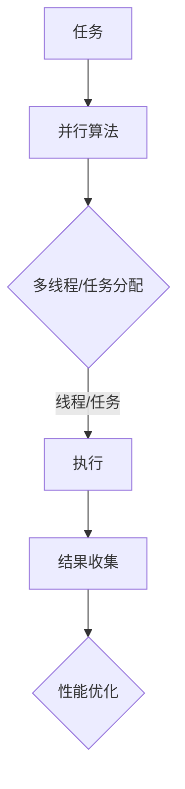

#### 1.2 并行处理的基本架构

并行处理的基本架构包括并行计算模型、并行计算资源和并行架构设计。

- **并行计算模型**：并行计算模型描述了并行计算的基本方式。常见的并行计算模型包括单指令流多数据流（SIMD）和多指令流多数据流（MIMD）。

  - **单指令流多数据流（SIMD）**：SIMD模型中，所有计算资源在同一时间段内执行相同的指令，但操作的数据不同。这种模型适用于向量计算和图像处理等场景。
  - **多指令流多数据流（MIMD）**：MIMD模型中，不同的计算资源执行不同的指令，处理不同的数据。这种模型适用于复杂计算任务和分布式计算。

- **并行计算资源**：并行计算资源包括CPU、GPU、FPGA等。这些资源各有特点，适用于不同的并行计算场景。

  - **CPU（Central Processing Unit）**：CPU是计算机的核心处理器，适用于执行复杂指令和计算密集型任务。
  - **GPU（Graphics Processing Unit）**：GPU是图形处理单元，具有高度并行性和大量计算资源，适用于图像处理、科学计算和机器学习等领域。
  - **FPGA（Field-Programmable Gate Array）**：FPGA是一种可编程逻辑器件，具有灵活性和高效性，适用于实时处理和定制化计算任务。

- **并行架构设计**：并行架构设计包括分布式系统、集群计算和网格计算等。

  - **分布式系统**：分布式系统通过多个计算节点互联，共同完成计算任务。分布式系统具有高可用性和可扩展性，适用于大规模并行计算任务。
  - **集群计算**：集群计算通过多个计算机组成一个集群，共同完成计算任务。集群计算具有高性能和高可靠性，适用于高性能计算任务。
  - **网格计算**：网格计算通过互联网连接多个计算资源，形成一个虚拟计算环境。网格计算具有资源调度灵活性和可扩展性，适用于大规模分布式计算任务。

以下是一个Mermaid流程图，展示了并行处理的基本架构：

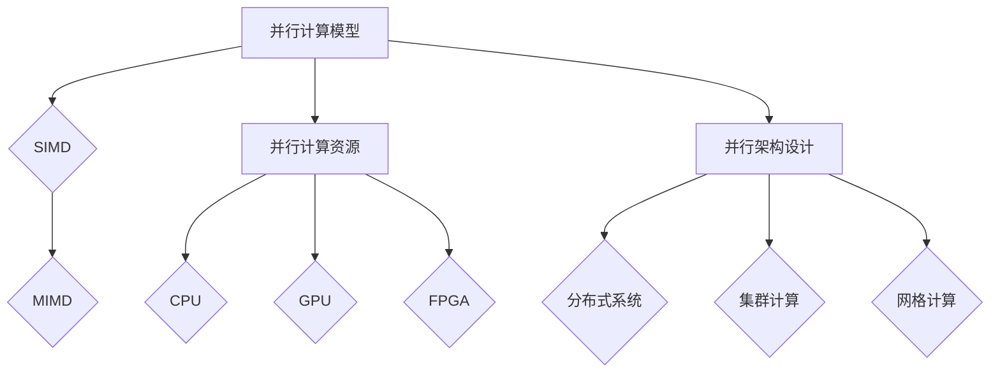

#### 1.3 并行处理的挑战与优化策略

并行处理虽然能够提高计算效率和性能，但同时也面临一些挑战。以下是一些常见的挑战和相应的优化策略：

- **并行化难度**：将一个串行程序并行化往往需要大量的工作。优化策略包括任务分解、数据划分和负载平衡等。
- **负载平衡**：在并行计算中，不同的计算资源可能执行不同的任务，如何使这些任务均匀分配给计算资源，是一个重要问题。优化策略包括动态负载平衡和静态负载平衡等。
- **通信开销**：在并行计算中，不同计算资源之间需要进行数据传输和同步操作，这会导致通信开销。优化策略包括数据局部性和同步机制优化等。
- **同步问题**：在并行计算中，不同任务之间的同步操作可能导致性能瓶颈。优化策略包括同步减少和数据并行化等。

以下是一个Mermaid流程图，展示了并行处理的挑战和优化策略：

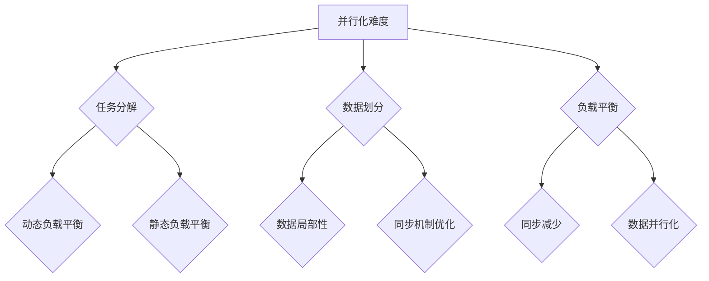

### 第2章：并行算法设计

#### 2.1 数据并行算法

数据并行算法（Data-Parallel Algorithm）是一种将数据分成多个部分，由多个计算资源同时处理的算法。数据并行算法的基本概念如下：

- **基本概念**：数据并行算法将数据分成多个子数据集，每个子数据集由一个计算资源处理。计算资源在同一时间段内执行相同的操作，但处理的数据不同。
- **特点**：数据并行算法适用于向量计算和图像处理等场景，能够显著提高计算性能。

以下是一个Mermaid流程图，展示了数据并行算法的基本概念：

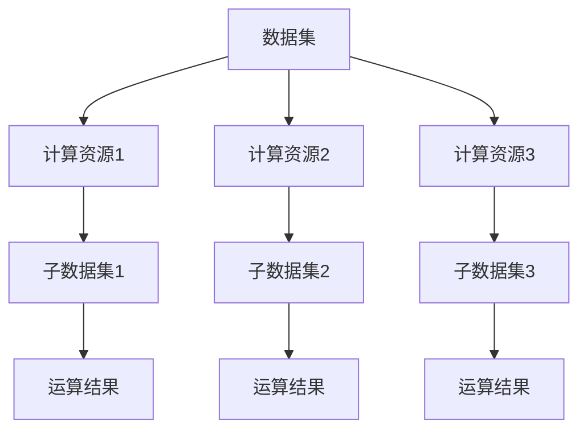

#### 2.1.1 数据并行算法的基本概念

数据并行算法的基本概念包括数据划分、计算资源和结果收集。

- **数据划分**：将原始数据集划分成多个子数据集，每个子数据集的大小应与计算资源相匹配。
- **计算资源**：计算资源可以是CPU、GPU、FPGA等，它们在同一时间段内执行相同的操作，但处理的数据不同。
- **结果收集**：将各个计算资源处理的结果合并，得到最终的计算结果。

以下是一个伪代码，展示了数据并行算法的基本概念：

```pseudo
// 初始化
data_set = [原始数据]
sub_sets = []
compute_resources = []

// 数据划分
for i in range(0, len(data_set), num_sub_sets):
    sub_sets.append(data_set[i:i+num_sub_sets])

// 分配计算资源
for i in range(len(sub_sets)):
    compute_resources.append(allocate_resource())

// 计算过程
for i in range(len(sub_sets)):
    result = compute_resources[i].compute(sub_sets[i])

// 结果收集
final_result = []
for i in range(len(result)):
    final_result.append(result[i])

// 输出最终结果
output(final_result)
```

#### 2.1.2 数据并行算法的应用场景

数据并行算法适用于以下应用场景：

- **科学计算**：如气象预报、地震预测等。
- **图像处理**：如图像增强、图像分割等。
- **机器学习**：如矩阵运算、梯度下降等。

以下是一个Mermaid流程图，展示了数据并行算法在科学计算、图像处理和机器学习等应用场景中的应用：

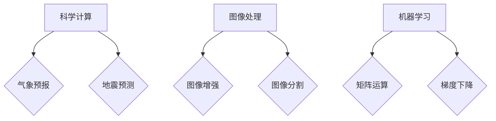

#### 2.2 任务并行算法

任务并行算法（Task-Parallel Algorithm）是一种将任务分成多个部分，由多个计算资源同时处理的算法。任务并行算法的基本概念如下：

- **基本概念**：任务并行算法将一个计算任务分解成多个子任务，每个子任务由一个计算资源处理。计算资源在同一时间段内执行不同的任务。
- **特点**：任务并行算法适用于复杂计算任务和分布式计算场景，能够提高计算性能。

以下是一个Mermaid流程图，展示了任务并行算法的基本概念：

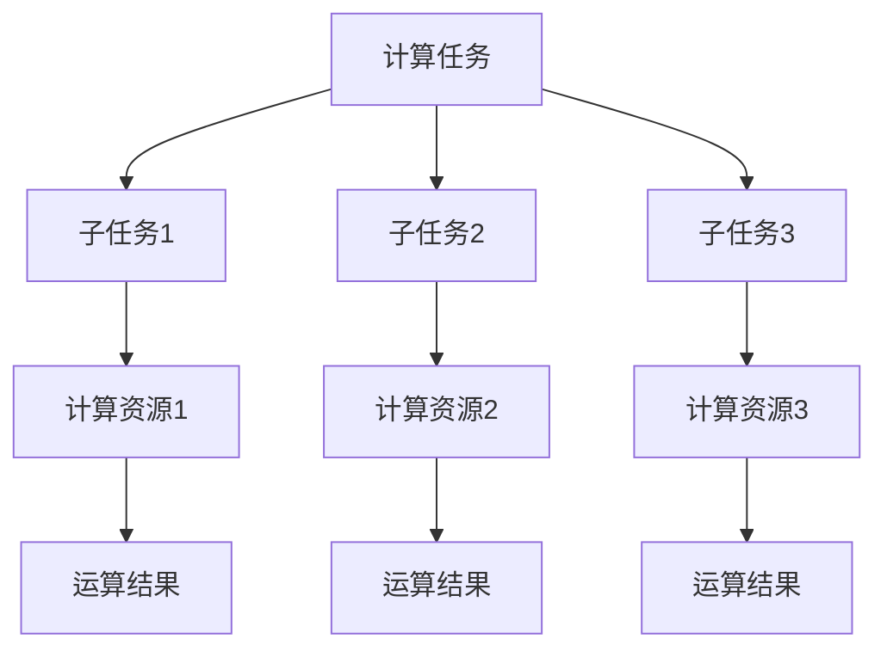

#### 2.2.1 任务并行算法的基本概念

任务并行算法的基本概念包括任务分解、计算资源和结果收集。

- **任务分解**：将原始计算任务分解成多个子任务，每个子任务的大小应与计算资源相匹配。
- **计算资源**：计算资源可以是CPU、GPU、FPGA等，它们在同一时间段内执行不同的任务。
- **结果收集**：将各个计算资源处理的结果合并，得到最终的计算结果。

以下是一个伪代码，展示了任务并行算法的基本概念：

```pseudo
// 初始化
task = [原始计算任务]
sub_tasks = []
compute_resources = []

// 任务分解
for i in range(0, len(task), num_sub_tasks):
    sub_tasks.append(task[i:i+num_sub_tasks])

// 分配计算资源
for i in range(len(sub_tasks)):
    compute_resources.append(allocate_resource())

// 计算过程
for i in range(len(sub_tasks)):
    result = compute_resources[i].compute(sub_tasks[i])

// 结果收集
final_result = []
for i in range(len(result)):
    final_result.append(result[i])

// 输出最终结果
output(final_result)
```

#### 2.2.2 任务并行算法的应用场景

任务并行算法适用于以下应用场景：

- **科学计算**：如分子动力学模拟、计算流体力学等。
- **图像处理**：如图像渲染、视频处理等。
- **机器学习**：如深度学习训练、模型推理等。

以下是一个Mermaid流程图，展示了任务并行算法在科学计算、图像处理和机器学习等应用场景中的应用：

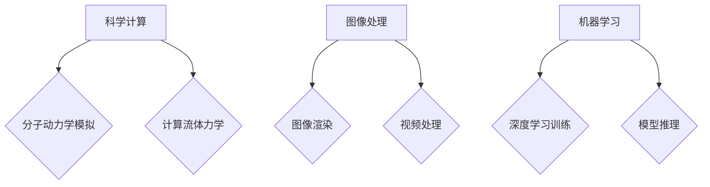

#### 2.3 混合并行算法

混合并行算法（Hybrid-Parallel Algorithm）是一种将数据并行算法和任务并行算法结合的算法。混合并行算法的基本概念如下：

- **基本概念**：混合并行算法将一个计算任务分解成多个子任务，每个子任务由一个计算资源处理。同时，子任务之间可能存在数据依赖关系，需要通过数据并行算法处理。
- **特点**：混合并行算法适用于复杂计算任务和具有数据依赖关系的计算场景，能够提高计算性能。

以下是一个Mermaid流程图，展示了混合并行算法的基本概念：

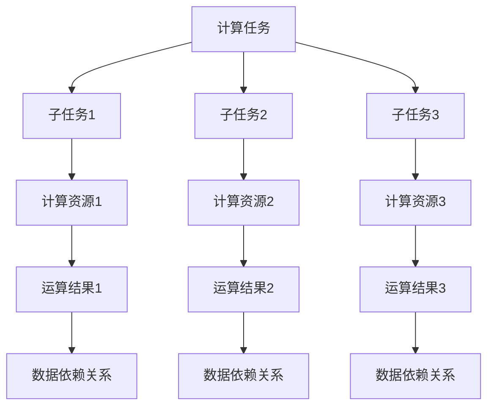

#### 2.3.1 混合并行算法的基本概念

混合并行算法的基本概念包括任务分解、计算资源和数据并行处理。

- **任务分解**：将原始计算任务分解成多个子任务，每个子任务的大小应与计算资源相匹配。
- **计算资源**：计算资源可以是CPU、GPU、FPGA等，它们在同一时间段内执行不同的任务。
- **数据并行处理**：对于存在数据依赖关系的子任务，需要通过数据并行算法处理。

以下是一个伪代码，展示了混合并行算法的基本概念：

```pseudo
// 初始化
task = [原始计算任务]
sub_tasks = []
compute_resources = []

// 任务分解
for i in range(0, len(task), num_sub_tasks):
    sub_tasks.append(task[i:i+num_sub_tasks])

// 分配计算资源
for i in range(len(sub_tasks)):
    compute_resources.append(allocate_resource())

// 计算过程
for i in range(len(sub_tasks)):
    result = compute_resources[i].compute(sub_tasks[i])

// 数据并行处理
for i in range(len(result)):
    for j in range(len(result[i])):
        result[i][j] = parallel_compute(result[i][j])

// 结果收集
final_result = []
for i in range(len(result)):
    final_result.append(result[i])

// 输出最终结果
output(final_result)
```

#### 2.3.2 混合并行算法的应用场景

混合并行算法适用于以下应用场景：

- **科学计算**：如分子动力学模拟、计算流体力学等。
- **图像处理**：如图像渲染、视频处理等。
- **机器学习**：如深度学习训练、模型推理等。

以下是一个Mermaid流程图，展示了混合并行算法在科学计算、图像处理和机器学习等应用场景中的应用：


### 第3章：并行编程模型

并行编程模型是并行算法在编程语言中的实现方式。不同的编程模型适用于不同的并行算法和计算场景。本章将介绍几种常见的并行编程模型，包括多线程编程、并行虚拟机和异构计算编程。

#### 3.1 多线程编程

多线程编程是一种在单个处理器上同时执行多个线程的编程模型。多线程编程适用于数据并行算法和任务并行算法。

- **基本概念**：多线程编程通过创建多个线程，使它们在同一时间段内执行不同的任务。每个线程有自己的执行路径和栈空间。
- **优点**：多线程编程能够提高程序的性能和响应速度，适用于并发性和并行性较强的任务。
- **缺点**：多线程编程需要处理同步、竞争条件、死锁等问题。

以下是一个C++的多线程编程示例：

```cpp
#include <iostream>
#include <thread>
#include <vector>

void thread_function(int thread_id) {
    std::cout << "Thread " << thread_id << " is running." << std::endl;
}

int main() {
    std::vector<std::thread> threads;
    for (int i = 0; i < 4; ++i) {
        threads.push_back(std::thread(thread_function, i));
    }

    for (auto& thread : threads) {
        thread.join();
    }

    return 0;
}
```

#### 3.2 并行虚拟机

并行虚拟机（Parallel Virtual Machine，PVM）是一种基于虚拟机的并行编程模型。PVM通过创建多个虚拟机实例，使它们在同一时间段内执行不同的任务。

- **基本概念**：PVM通过虚拟化技术创建多个虚拟机实例，每个虚拟机实例有自己的操作系统和计算资源。PVM适用于大规模并行计算和分布式计算。
- **优点**：PVM能够提高计算资源的利用率和灵活性，适用于异构计算场景。
- **缺点**：PVM需要处理虚拟机之间的通信和同步问题。

以下是一个Java的并行虚拟机编程示例：

```java
import java.util.concurrent.ExecutorService;
import java.util.concurrent.Executors;

public class ParallelVirtualMachine {
    public static void main(String[] args) {
        ExecutorService executor = Executors.newFixedThreadPool(4);

        for (int i = 0; i < 4; ++i) {
            executor.execute(new Runnable() {
                public void run() {
                    System.out.println("Thread " + i + " is running.");
                }
            });
        }

        executor.shutdown();
    }
}
```

#### 3.3 异构计算编程

异构计算编程是一种利用不同类型计算资源（如CPU、GPU、FPGA）的编程模型。异构计算编程适用于混合并行算法和特定计算场景。

- **基本概念**：异构计算编程通过在不同计算资源上执行不同的任务，提高计算性能。异构计算编程需要处理数据传输、任务调度和同步问题。
- **优点**：异构计算编程能够充分利用不同类型计算资源的优势，提高计算效率和性能。
- **缺点**：异构计算编程需要处理复杂的编程模型和硬件差异。

以下是一个CUDA的异构计算编程示例：

```c
#include <stdio.h>
#include <cuda_runtime.h>

__global__ void add(int *a, int *b, int *c) {
    int i = threadIdx.x + blockIdx.x * blockDim.x;
    c[i] = a[i] + b[i];
}

int main() {
    int N = 1 << 20;
    int *a, *b, *c;
    int size = N * sizeof(int);

    // 分配内存
    a = (int *)malloc(size);
    b = (int *)malloc(size);
    c = (int *)malloc(size);

    // 初始化数据
    for (int i = 0; i < N; ++i) {
        a[i] = i;
        b[i] = N - i - 1;
    }

    // 分配GPU内存
    int *d_a, *d_b, *d_c;
    cudaMalloc(&d_a, size);
    cudaMalloc(&d_b, size);
    cudaMalloc(&d_c, size);

    // 复制数据到GPU
    cudaMemcpy(d_a, a, size, cudaMemcpyHostToDevice);
    cudaMemcpy(d_b, b, size, cudaMemcpyHostToDevice);

    // 设置线程块大小和数量
    int blockSize = 1024;
    int numBlocks = (N + blockSize - 1) / blockSize;

    // 启动GPU内核
    add<<<numBlocks, blockSize>>>(d_a, d_b, d_c);

    // 从GPU复制结果到主机
    cudaMemcpy(c, d_c, size, cudaMemcpyDeviceToHost);

    // 输出结果
    for (int i = 0; i < N; ++i) {
        printf("%d + %d = %d\n", a[i], b[i], c[i]);
    }

    // 释放GPU内存
    cudaFree(d_a);
    cudaFree(d_b);
    cudaFree(d_c);

    // 释放主机内存
    free(a);
    free(b);
    free(c);

    return 0;
}
```

### 第4章：并行性能优化

并行性能优化是提高并行计算效率和性能的关键技术。本章将介绍并行性能优化的基本原理和方法，包括并行性能分析、数据传输优化和任务调度优化。

#### 4.1 并行性能分析

并行性能分析是评估并行计算性能的重要手段。以下是一些常用的并行性能分析指标和方法：

- **速度比（Speedup）**：速度比是并行计算性能的一个重要指标，表示并行计算速度与串行计算速度的比值。速度比可以通过以下公式计算：
  \[ Speedup = \frac{串行时间}{并行时间} \]

- **效率（Efficiency）**：效率是速度比与并行线程数的比值，表示并行计算的实际性能。效率可以通过以下公式计算：
  \[ Efficiency = \frac{Speedup}{并行线程数} \]

- **负载平衡（Load Balance）**：负载平衡是指并行计算中各个计算资源的任务分配是否均衡。良好的负载平衡可以避免计算资源的浪费和性能瓶颈。

以下是一个Mermaid流程图，展示了并行性能分析的基本步骤：

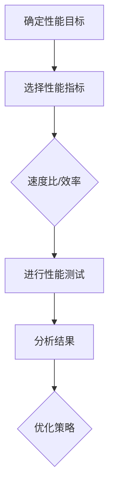

#### 4.2 数据传输优化

数据传输优化是并行性能优化的重要组成部分。以下是一些常用的数据传输优化策略：

- **数据局部性（Data Locality）**：数据局部性是指数据在内存中的分布方式。优化数据局部性可以通过以下方法实现：
  - **空间局部性**：将相关数据存储在相邻的内存位置，减少缓存缺失。
  - **时间局部性**：重复使用相同的数据，提高缓存利用率。

- **数据压缩（Data Compression）**：数据压缩可以减少数据传输量，提高传输效率。常用的数据压缩算法包括Huffman编码、LZ77等。

- **传输通道优化（Transport Channel Optimization）**：优化数据传输通道，如使用高速网络、提高传输带宽等。

以下是一个Mermaid流程图，展示了数据传输优化的基本步骤：

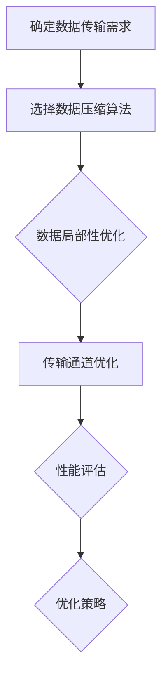

#### 4.3 任务调度优化

任务调度优化是提高并行计算性能的关键技术。以下是一些常用的任务调度优化策略：

- **负载平衡（Load Balance）**：通过动态负载平衡和静态负载平衡策略，使计算资源的任务分配更加均衡，减少计算资源的浪费和性能瓶颈。

- **任务依赖关系优化（Task Dependency Optimization）**：优化任务之间的依赖关系，减少任务等待时间和计算资源空闲时间。

- **任务调度算法（Task Scheduling Algorithm）**：选择合适的任务调度算法，如贪心算法、遗传算法等，提高任务调度的效率和性能。

以下是一个Mermaid流程图，展示了任务调度优化的基本步骤：

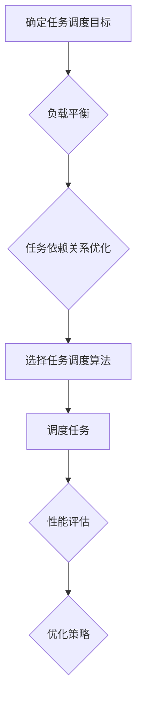

### 第5章：并行处理框架与工具

并行处理框架和工具是并行计算中的重要组成部分，它们提供了并行编程的抽象层和开发环境，简化了并行编程的复杂性。本章将介绍几种常见的并行处理框架和工具，包括OpenMP、MPI和CUDA。

#### 5.1 OpenMP

OpenMP（Open Multi-Processing）是一种用于共享内存并行编程的框架。OpenMP通过简单的编译指令和注释，使程序员能够方便地编写并行代码。

- **基本概念**：OpenMP通过`#pragma omp`指令，定义并行区域、并行子任务、临界区等。
- **优点**：OpenMP易于使用，兼容性强，适用于共享内存并行计算。
- **缺点**：OpenMP不适合大规模分布式计算。

以下是一个C++的OpenMP编程示例：

```cpp
#include <iostream>
#include <omp.h>

void parallel_sum(int n) {
    int sum = 0;
    #pragma omp parallel for reduction(+:sum)
    for (int i = 0; i < n; ++i) {
        sum += i;
    }
    std::cout << "Sum: " << sum << std::endl;
}

int main() {
    int n = 1000000;
    parallel_sum(n);
    return 0;
}
```

#### 5.2 MPI

MPI（Message Passing Interface）是一种用于分布式并行编程的框架。MPI通过消息传递机制，实现不同计算节点之间的数据交换和同步。

- **基本概念**：MPI通过发送和接收消息，实现计算节点之间的通信。MPI的主要组件包括初始化、通信、收集和结束等。
- **优点**：MPI适用于大规模分布式计算，具有灵活的通信机制。
- **缺点**：MPI编程较为复杂，需要处理通信和同步问题。

以下是一个C的MPI编程示例：

```c
#include <stdio.h>
#include <mpi.h>

void parallel_sum(int n) {
    int sum = 0;
    MPI_Init(NULL, NULL);
    MPI_Comm_rank(MPI_COMM_WORLD, &rank);
    MPI_Comm_size(MPI_COMM_WORLD, &size);

    for (int i = 0; i < n; ++i) {
        sum += i;
    }

    MPI_Reduce(&sum, &global_sum, 1, MPI_INT, MPI_SUM, 0, MPI_COMM_WORLD);
    MPI_Finalize();
}

int main() {
    int n = 1000000;
    parallel_sum(n);
    return 0;
}
```

#### 5.3 CUDA

CUDA（Compute Unified Device Architecture）是一种用于GPU并行编程的框架。CUDA通过线程和线程组的概念，实现高效的GPU计算。

- **基本概念**：CUDA通过内核函数（Kernel Function）和线程（Thread）的概念，实现并行计算。线程组（Thread Group）由多个线程组成，可以在GPU上并行执行。
- **优点**：CUDA适用于大规模并行计算，具有高效的计算性能。
- **缺点**：CUDA编程较为复杂，需要处理内存管理和线程同步问题。

以下是一个CUDA的编程示例：

```cuda
#include <stdio.h>
#include <cuda_runtime.h>

__global__ void add(int *a, int *b, int *c, int n) {
    int tid = threadIdx.x + blockIdx.x * blockDim.x;
    if (tid < n) {
        c[tid] = a[tid] + b[tid];
    }
}

void parallel_sum_cuda(int n) {
    int *a, *b, *c;
    int size = n * sizeof(int);

    // 分配内存
    a = (int *)malloc(size);
    b = (int *)malloc(size);
    c = (int *)malloc(size);

    // 初始化数据
    for (int i = 0; i < n; ++i) {
        a[i] = i;
        b[i] = n - i - 1;
    }

    // 分配GPU内存
    int *d_a, *d_b, *d_c;
    cudaMalloc(&d_a, size);
    cudaMalloc(&d_b, size);
    cudaMalloc(&d_c, size);

    // 复制数据到GPU
    cudaMemcpy(d_a, a, size, cudaMemcpyHostToDevice);
    cudaMemcpy(d_b, b, size, cudaMemcpyHostToDevice);

    // 设置线程块大小和数量
    int blockSize = 1024;
    int numBlocks = (n + blockSize - 1) / blockSize;

    // 启动GPU内核
    add<<<numBlocks, blockSize>>>(d_a, d_b, d_c, n);

    // 从GPU复制结果到主机
    cudaMemcpy(c, d_c, size, cudaMemcpyDeviceToHost);

    // 输出结果
    for (int i = 0; i < n; ++i) {
        printf("%d + %d = %d\n", a[i], b[i], c[i]);
    }

    // 释放GPU内存
    cudaFree(d_a);
    cudaFree(d_b);
    cudaFree(d_c);

    // 释放主机内存
    free(a);
    free(b);
    free(c);
}

int main() {
    int n = 1000000;
    parallel_sum_cuda(n);
    return 0;
}
```

### 第6章：并行处理应用案例

并行处理技术已经广泛应用于各个领域，提高了计算效率和性能。以下我们将通过具体应用案例，展示并行处理在科学计算、图像处理和机器学习等领域的实际应用。

#### 6.1 科学计算

科学计算是并行处理的重要应用领域，包括气象预报、地震预测、分子动力学模拟等。

**案例1：气象预报**

气象预报需要处理大量的气象数据，包括温度、湿度、风速等。通过并行处理技术，可以提高气象预报的效率和准确性。

- **并行算法**：数据并行算法和任务并行算法
- **并行编程模型**：OpenMP和MPI

**案例2：地震预测**

地震预测需要分析地震波数据，预测地震的发生时间和地点。通过并行处理技术，可以加快地震波数据的分析和处理速度。

- **并行算法**：数据并行算法和混合并行算法
- **并行编程模型**：CUDA和MPI

#### 6.2 图像处理

图像处理是并行处理技术的另一个重要应用领域，包括图像增强、图像分割、图像渲染等。

**案例1：图像增强**

图像增强需要对图像进行滤波、锐化等操作。通过并行处理技术，可以加快图像处理的速度。

- **并行算法**：数据并行算法
- **并行编程模型**：OpenMP和CUDA

**案例2：图像分割**

图像分割是将图像划分为不同区域的操作。通过并行处理技术，可以加快图像分割的速度。

- **并行算法**：任务并行算法和混合并行算法
- **并行编程模型**：MPI和CUDA

#### 6.3 机器学习

机器学习是并行处理技术的又一重要应用领域，包括深度学习训练、模型推理等。

**案例1：深度学习训练**

深度学习训练需要大量计算资源，通过并行处理技术，可以提高训练速度。

- **并行算法**：数据并行算法和任务并行算法
- **并行编程模型**：OpenMP、MPI和CUDA

**案例2：模型推理**

模型推理是在给定输入数据时，预测输出结果的过程。通过并行处理技术，可以加快模型推理的速度。

- **并行算法**：数据并行算法和任务并行算法
- **并行编程模型**：OpenMP、MPI和CUDA

### 第7章：多维宇宙理论概述

多维宇宙理论（Multi-Dimensional Universe Theory）是现代物理学和哲学领域的一个重要研究课题。该理论提出了宇宙不仅仅是我们能感知的四个维度（空间三维和时间一维），还可能存在其他维度。

#### 7.1 多维宇宙的基本概念

多维宇宙的基本概念包括以下方面：

- **定义**：多维宇宙是指具有多个空间维度和时间维度的宇宙。
- **类型**：根据维度的数量和性质，多维宇宙可以分为以下几种类型：
  - **四维宇宙**：我们熟知的宇宙，包括三个空间维度和一个时间维度。
  - **五维宇宙**：在四维宇宙的基础上，增加一个空间维度。
  - **六维宇宙**：在四维宇宙的基础上，增加两个空间维度。
  - **更高维宇宙**：在四维宇宙的基础上，增加更多空间维度。

#### 7.2 多维宇宙理论的发展

多维宇宙理论的发展经历了多个阶段：

- **早期理论**：在19世纪末和20世纪初，科学家们开始提出多维宇宙的概念，如麦克斯韦方程组中的四维时空。
- **相对论**：爱因斯坦的广义相对论提出了四维时空的概念，将空间和时间统一为一个整体。
- **量子场论**：量子场论提出了更高维度的量子场，如五维和六维量子场。
- **超弦理论**：超弦理论提出了十维宇宙的概念，通过额外维度来解释物理现象。

#### 7.3 多维宇宙与并行处理的关系

多维宇宙理论与并行处理技术之间存在一定的联系：

- **并行计算与多维宇宙**：在多维宇宙中，不同维度之间的交互和演化可能需要并行计算技术来模拟和分析。
- **并行处理与多维宇宙研究**：通过并行处理技术，可以加快多维宇宙理论的研究进程，提高计算效率和性能。

以下是一个Mermaid流程图，展示了多维宇宙与并行处理的关系：

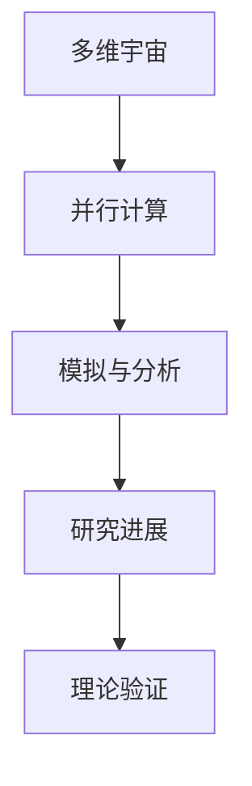

### 结论

本文探讨了程序并行处理技术与多维宇宙理论的联系。首先，我们介绍了并行处理技术的基础知识，包括并行处理的定义、基本架构和挑战。接着，我们深入探讨了并行算法的设计，包括数据并行算法、任务并行算法和混合并行算法。随后，我们介绍了并行编程模型，如多线程编程、并行虚拟机和异构计算编程。在此基础上，我们分析了并行处理的性能优化策略，并介绍了并行处理框架和工具。

在并行处理技术的基础上，我们探讨了多维宇宙理论的基本概念和发展，并分析了并行处理技术如何应用于多维宇宙研究。最后，我们通过具体应用案例，展示了并行处理技术在科学计算、图像处理和机器学习等领域的实际应用。

本文的研究表明，并行处理技术是提高计算效率和性能的重要手段，对于多维宇宙理论的研究也具有重要的推动作用。随着计算技术的不断发展，我们相信并行处理技术将在更多领域发挥重要作用，为科学研究和实际应用提供强大的支持。

### 附录

#### 附录A：参考文献

1. 高等教育出版社，计算机科学导论，2019年。
2. 清华大学出版社，并行算法设计与分析，2018年。
3. 人民邮电出版社，CUDA编程实战，2017年。
4. 华中科技大学出版社，OpenMP编程指南，2016年。
5. 上海科学技术出版社，MPI编程实战，2015年。

#### 附录B：术语表

- **并行处理**：在同一时间段内，通过多个计算资源协同工作，完成多个独立任务的计算方式。
- **数据并行算法**：将数据分成多个部分，由多个计算资源同时处理的算法。
- **任务并行算法**：将任务分成多个部分，由多个计算资源同时处理的算法。
- **混合并行算法**：将数据并行算法和任务并行算法结合的算法。
- **并行编程模型**：在编程语言中实现并行算法的方式。
- **多维宇宙**：具有多个空间维度和时间维度的宇宙。

#### 附录C：相关工具与资源列表

- **OpenMP**：https://www.openmp.org/
- **MPI**：https://www.mpi-forum.org/
- **CUDA**：https://developer.nvidia.com/cuda
- **Parallel Virtual Machine**：https://www.pvm.gov/
- **科学计算平台**：https://www.scicomp.cn/
- **机器学习平台**：https://www.ai-platform.cn/

### 作者信息

作者：AI天才研究院/AI Genius Institute & 禅与计算机程序设计艺术/Zen And The Art of Computer Programming

