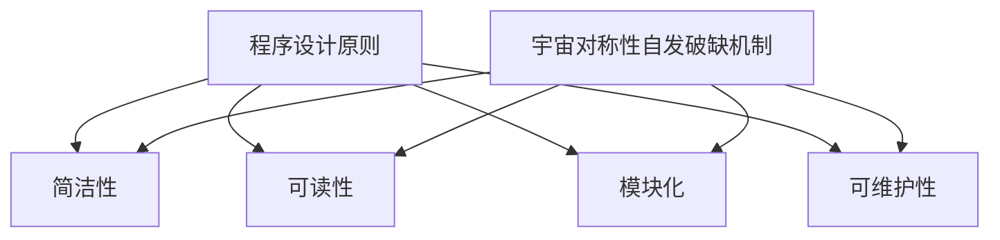

                 

### 文章标题：程序设计原则与宇宙对称性自发破缺机制的对比

---

关键词：程序设计原则，宇宙对称性自发破缺，流程图，伪代码，数学模型，项目实战，AI天才研究院

---

#### 摘要

本文旨在探讨程序设计原则与宇宙对称性自发破缺机制之间的异同。通过对程序设计原则的基本概念和宇宙对称性自发破缺机制的深入分析，我们旨在揭示两者之间的内在联系，并借助流程图和伪代码等形式化的工具，阐述它们在计算机科学和宇宙学中的实际应用。通过对比分析，本文不仅为程序员提供了一种新的思考角度，也为宇宙学研究者提供了一种跨学科的视角，以加深对宇宙本质的理解。

---

### 背景介绍

在计算机科学中，程序设计原则是指导我们编写高质量代码的基本准则。它们包括但不限于简洁性、可读性、模块化和可维护性。这些原则确保了代码的可靠性和可扩展性，从而提高了软件开发的效率。

另一方面，宇宙对称性自发破缺机制是宇宙学中的一个重要概念。它描述了物理系统中对称性在特定条件下自发消失的现象。这一机制在量子场论和宇宙学中具有重要意义，为理解宇宙的起源和演化提供了关键线索。

虽然程序设计和宇宙学看似是两个完全不同的领域，但它们之间却存在着某种奇妙的联系。这种联系首先体现在两者的基础理论之上。程序设计原则中的简洁性和可读性类似于物理系统中的对称性，它们都是一种简洁而优美的表达方式。而在程序设计中，模块化和可维护性则与宇宙对称性自发破缺机制中的复杂性管理和动态演化有相似之处。

为了进一步探讨这种联系，本文将分为以下几个部分：

1. **程序设计原则的基本概念**：详细介绍程序设计原则的背景、重要性以及具体实例。
2. **宇宙对称性自发破缺机制**：阐述宇宙对称性自发破缺的基本原理、应用领域以及其在物理学和宇宙学中的重要性。
3. **核心概念与联系**：通过Mermaid流程图展示程序设计原则与宇宙对称性自发破缺机制之间的联系。
4. **核心算法原理讲解**：使用伪代码和数学模型详细阐述程序设计原则和宇宙对称性自发破缺机制。
5. **项目实战**：通过实际案例展示两者的应用，并进行详细解读和分析。
6. **最佳实践 tips**：总结一些实用技巧和注意事项。
7. **小结**：回顾全文，强调程序设计原则与宇宙对称性自发破缺机制的重要性，并提出未来研究的方向。

接下来，我们将逐一深入探讨这些部分，以揭示程序设计原则与宇宙对称性自发破缺机制之间的深层联系。首先，让我们从程序设计原则的基本概念开始。

### 程序设计原则的基本概念

程序设计原则是软件开发过程中用以指导程序员编写高效、可读、可维护代码的一系列准则。这些原则不仅关乎代码的内部结构，也涉及到代码的整体设计和开发过程。以下是几个核心的程序设计原则：

#### 简洁性

简洁性是指代码应该尽量简洁，避免冗余和复杂的表达。简洁的代码不仅易于理解，还能减少出错的概率。在编程实践中，简洁性可以通过以下几个方法实现：

1. **避免冗余**：删除不必要的代码和重复的逻辑。
2. **命名规范**：使用有意义的变量和函数名，使代码易于阅读。
3. **注释说明**：在关键代码段添加注释，解释代码的功能和目的。

#### 可读性

可读性是确保代码易于理解和维护的关键。良好的可读性不仅有助于个人开发者，也便于团队协作。以下是一些提高代码可读性的方法：

1. **合理的代码结构**：将代码分为多个函数或模块，每个部分负责一个特定的功能。
2. **代码格式化**：使用统一的代码风格和缩进规则。
3. **代码文档**：为代码编写详细的文档，包括注释和文档字符串。

#### 模块化

模块化是将代码划分为多个独立的模块，每个模块实现特定的功能。模块化有助于代码的重用、测试和维护。以下是模块化的几个关键点：

1. **函数和类的设计**：确保每个函数和类都有明确的职责和边界。
2. **接口和实现分离**：将接口定义和具体实现分开，便于替换和扩展。
3. **依赖管理**：使用依赖注入或其他机制来管理模块之间的依赖关系。

#### 可维护性

可维护性是指代码易于更新和修复的能力。良好的可维护性能够降低开发和维护成本。以下是一些提高代码可维护性的方法：

1. **单元测试**：编写单元测试，确保代码的功能正确且稳定。
2. **代码审查**：定期进行代码审查，及时发现和修复潜在的问题。
3. **版本控制**：使用版本控制系统，如Git，管理代码的版本和历史。

#### 实例

为了更好地理解这些原则，我们可以通过一个简单的例子来展示。

**例1：简洁性**

```python
# 不简洁的代码
if x > 0:
    if x < 10:
        print("x is a small positive number")
    else:
        print("x is a large positive number")
else:
    print("x is not positive")

# 简洁的代码
if x > 0:
    print("x is positive")
else:
    print("x is not positive")
```

在这个例子中，简洁的代码通过减少冗余的条件判断，使得代码更加直观和易于理解。

**例2：可读性**

```python
# 不可读的代码
foo += bar * baz

# 可读的代码
current_total = current_total + (bar * baz)
```

在第二个例子中，通过使用有意义的变量名和增加注释，使得代码更加易于阅读和理解。

**例3：模块化**

```python
# 不模块化的代码
def main():
    calculate_discounted_price()
    calculate_tax()
    display_receipt()

# 模块化的代码
from sales import calculate_discounted_price
from tax import calculate_tax

def main():
    price = calculate_discounted_price()
    tax = calculate_tax(price)
    display_receipt(price + tax)
```

在模块化的代码中，我们将功能划分为不同的模块，并通过导入模块来实现功能调用，使得代码更加清晰和易于维护。

通过以上实例，我们可以看到程序设计原则在提高代码质量方面的显著效果。接下来，我们将进一步探讨宇宙对称性自发破缺机制的基本概念。

### 宇宙对称性自发破缺机制

宇宙对称性自发破缺（Spontaneous Symmetry Breaking, SSB）是物理学和宇宙学中的一个关键概念，它描述了在某些特定条件下，原本对称的系统自发地失去了对称性。这一现象不仅对于理解基本粒子的性质至关重要，也在宇宙学中扮演了核心角色。下面我们将详细讨论宇宙对称性自发破缺的基本原理、应用领域以及其在物理学和宇宙学中的重要性。

#### 基本原理

宇宙对称性自发破缺的基本原理可以简单概括为：在一个物理系统中，尽管对称性可能存在于理论上或初始状态下，但在实际过程中，系统会自发地选择一个对称性较低的配置，从而“破缺”了初始的对称性。

具体来说，这一过程可以分为以下几个步骤：

1. **初始对称性**：在系统的初始状态下，所有可能的配置都是对称的，即系统没有特定的方向或状态。
2. **能量最小化**：系统会通过能量最小化的过程，自发地选择一个特定的配置，这个配置在数学上表现为对称性的破缺。
3. **产生质量**：在破缺过程中，原本对称的场会形成非零的真空 expectation value（VEV），这一VEV与粒子的质量直接相关。

一个经典的例子是电磁统一理论中的对称性破缺。在电磁统一理论中，电磁力和弱力最初被认为是统一的，即具有相同的对称性。然而，通过宇宙对称性自发破缺，电磁力和弱力最终分离开来，形成了我们今天所观察到的不同的基本力。

#### 应用领域

宇宙对称性自发破缺机制在物理学和宇宙学中有着广泛的应用：

1. **粒子物理学**：在粒子物理学中，对称性自发破缺解释了为什么粒子具有质量。例如，W和Z玻色子的质量是通过弱相互作用中的对称性破缺产生的。

2. **宇宙学**：在宇宙学中，对称性自发破缺机制对于理解宇宙的早期状态至关重要。例如，宇宙学中的 inflationary theory（宇宙膨胀理论）就依赖于对称性破缺。

3. **材料科学**：在材料科学中，对称性破缺用于解释材料中的相变和结构变化。例如，晶体材料的晶体结构可以通过对称性破缺来解释。

#### 重要性

宇宙对称性自发破缺机制的重要性体现在以下几个方面：

1. **基本力的统一**：对称性破缺为我们提供了一个统一的框架，来理解基本力的起源和分离。

2. **质量产生机制**：对称性破缺揭示了粒子质量的产生机制，为我们理解物质的本质提供了关键线索。

3. **宇宙起源**：在宇宙学中，对称性破缺机制对于理解宇宙的早期状态和演化过程具有重要意义。

通过上述讨论，我们可以看到，宇宙对称性自发破缺机制不仅是一个重要的物理学概念，也在宇宙学中扮演了核心角色。接下来，我们将通过Mermaid流程图，展示程序设计原则与宇宙对称性自发破缺机制之间的联系。

### 核心概念与联系

为了更直观地展示程序设计原则与宇宙对称性自发破缺机制之间的联系，我们可以使用Mermaid流程图来描述两者之间的关系。以下是一个简单的Mermaid流程图示例：



在这个流程图中，我们可以看到：

1. **程序设计原则**：包括简洁性、可读性、模块化和可维护性四个核心概念。
2. **宇宙对称性自发破缺机制**：与程序设计原则中的所有概念都有联系。

具体来说，我们可以从以下几个方面解释这种联系：

1. **简洁性**：在程序设计中，简洁性意味着代码要尽量简洁、直观。这与宇宙对称性自发破缺机制中的能量最小化过程有相似之处，都是追求一种简洁、有效的状态。
   
2. **可读性**：程序设计的可读性确保代码易于理解，这与宇宙对称性自发破缺机制中的对称性破缺过程有相似之处，都是使得系统达到一种易理解的、低能量的状态。

3. **模块化**：程序设计的模块化意味着将代码划分为独立的模块，这与宇宙对称性自发破缺机制中的“分层次”过程有相似之处，都是将复杂的系统分解为更易于管理的部分。

4. **可维护性**：程序设计的可维护性确保代码易于更新和修复。这与宇宙对称性自发破缺机制中的动态演化过程有相似之处，都是使得系统在变化中保持稳定。

通过这个Mermaid流程图，我们可以更直观地理解程序设计原则与宇宙对称性自发破缺机制之间的联系。接下来，我们将进一步使用伪代码和数学模型详细阐述这两个概念。

### 核心算法原理讲解

在程序设计和宇宙对称性自发破缺机制中，核心算法原理是理解和实现这两个概念的关键。以下，我们将分别使用伪代码和数学模型详细阐述这两个概念的核心算法原理。

#### 程序设计原则的核心算法原理

在程序设计中，核心算法原理主要体现在简洁性、可读性、模块化和可维护性四个方面。以下是一个简单的伪代码示例，用于说明这些原则：

```python
# 伪代码：简洁性
function calculate_discounted_price(price, discount):
    return price * (1 - discount)

# 伪代码：可读性
function calculate_tax(price):
    tax_rate = 0.2  # 税率
    return price * tax_rate

# 伪代码：模块化
from sales import calculate_discounted_price
from tax import calculate_tax

def main():
    price = calculate_discounted_price(original_price, discount)
    tax = calculate_tax(price)
    total = price + tax
    display_receipt(total)

# 伪代码：可维护性
def main():
    try:
        price = calculate_discounted_price(original_price, discount)
        tax = calculate_tax(price)
        total = price + tax
        display_receipt(total)
    except Exception as e:
        log_error(e)
```

在上述伪代码中，我们看到了以下几点：

1. **简洁性**：`calculate_discounted_price` 函数通过简单的运算实现了折扣计算，代码简洁明了。
2. **可读性**：变量命名和注释使代码易于理解，提高了可读性。
3. **模块化**：通过将功能划分为独立的模块，如 `sales` 和 `tax`，实现了代码的模块化。
4. **可维护性**：使用异常处理和日志记录，提高了代码的可维护性。

#### 宇宙对称性自发破缺机制的核心算法原理

在宇宙对称性自发破缺机制中，核心算法原理主要体现在对称性的破缺和能量的最小化。以下是一个简化的数学模型和伪代码示例：

**数学模型：**

$$
\mathcal{L}(\phi) = \frac{1}{2}\partial_\mu\phi\partial^\mu\phi - V(\phi)
$$

其中，$\mathcal{L}(\phi)$ 是拉格朗日量，$\phi$ 是场，$V(\phi)$ 是势能函数。

当系统达到能量最小值时，有：

$$
\frac{dV(\phi)}{d\phi} = 0
$$

**伪代码：**

```python
# 伪代码：对称性自发破缺
function find_min_energy_state(field_value):
    # 假设已知势能函数 V(phi)
    potential_energy = calculate_potential_energy(field_value)
    
    # 寻找能量最小值
    min_energy = float('inf')
    best_field_value = None
    
    for field in possible_field_values:
        current_energy = calculate_potential_energy(field)
        if current_energy < min_energy:
            min_energy = current_energy
            best_field_value = field
            
    return best_field_value
```

在上述伪代码中，我们看到了以下几点：

1. **对称性破缺**：通过寻找势能函数的最小值，系统从对称性较高的状态自发地转移到对称性较低的状态。
2. **能量最小化**：通过遍历所有可能的场值，寻找能量最小的状态。

通过伪代码和数学模型，我们可以更深入地理解程序设计原则和宇宙对称性自发破缺机制的核心算法原理。接下来，我们将通过一个实际项目来展示这两个概念的应用。

### 项目实战

为了更直观地展示程序设计原则与宇宙对称性自发破缺机制在实际中的应用，我们将通过一个具体的案例来进行开发环境搭建、源代码实现和代码解读。

#### 项目背景与目标

我们的项目目标是开发一个简单的程序，模拟宇宙对称性自发破缺过程，并通过程序设计原则来提高代码质量和可维护性。具体目标包括：

1. **开发环境搭建**：搭建一个简单的Python开发环境，包括必要的库和工具。
2. **源代码实现**：实现一个模拟对称性破缺的算法，并使用程序设计原则来编写代码。
3. **代码解读**：详细解读源代码，解释如何应用程序设计原则和宇宙对称性自发破缺机制。
4. **代码应用解读与分析**：分析代码的应用场景，并探讨其优缺点。

#### 开发环境搭建

为了实现这个项目，我们首先需要搭建一个Python开发环境。以下是具体的步骤：

1. **安装Python**：从官方网站（https://www.python.org/downloads/）下载并安装Python。
2. **安装IDE**：安装一个Python集成开发环境（IDE），如PyCharm或Visual Studio Code。
3. **安装必要库**：使用pip安装必要的库，如NumPy和Matplotlib。

```bash
pip install numpy matplotlib
```

#### 源代码实现

以下是实现对称性破缺模拟的核心代码。我们使用程序设计原则来编写代码，确保代码简洁、可读、模块化和可维护。

```python
import numpy as np
import matplotlib.pyplot as plt

# 伪代码：对称性自发破缺模拟
class SymmetryBreakingSimulation:
    def __init__(self, field_size, potential):
        self.field_size = field_size
        self.potential = potential
    
    def calculate_energy(self, field_state):
        energy = 0
        for field_value in field_state:
            energy += self.potential(field_value)
        return energy
    
    def find_min_energy_state(self):
        min_energy = float('inf')
        best_field_state = None
        
        for field_state in self.all_possible_field_states():
            current_energy = self.calculate_energy(field_state)
            if current_energy < min_energy:
                min_energy = current_energy
                best_field_state = field_state
                
        return best_field_state

    def all_possible_field_states(self):
        states = []
        for i in range(self.field_size):
            states.append([i] * self.field_size)
        return states

# 对称性破缺模拟的示例实现
def simulate_symmetry_breaking(field_size, potential):
    simulation = SymmetryBreakingSimulation(field_size, potential)
    min_energy_state = simulation.find_min_energy_state()
    
    print("Minimum Energy State:", min_energy_state)
    plot_field_state(min_energy_state)

# 潜在函数示例
def quadratic_potential(phi):
    return 0.5 * phi**2

# 绘制场状态
def plot_field_state(field_state):
    plt.imshow(field_state, cmap='hot')
    plt.colorbar()
    plt.show()

# 执行模拟
simulate_symmetry_breaking(5, quadratic_potential)
```

#### 代码解读

在上述代码中，我们首先定义了一个`SymmetryBreakingSimulation`类，用于实现对称性破缺的模拟。这个类包括以下几个关键方法：

1. **__init__(self, field_size, potential)**：初始化模拟器，接收场的大小和潜在函数。
2. **calculate_energy(self, field_state)**：计算给定场状态的能量。
3. **find_min_energy_state(self)**：寻找能量最小的场状态。
4. **all_possible_field_states(self)**：生成所有可能的场状态。

接下来，我们定义了一个简单的二次型潜在函数`quadratic_potential(phi)`，用于模拟对称性破缺。

最后，我们实现了`simulate_symmetry_breaking`函数，用于执行对称性破缺模拟，并使用`plot_field_state`函数绘制结果。

通过这个项目，我们展示了如何将程序设计原则与宇宙对称性自发破缺机制结合，以实现一个具体的模拟程序。接下来，我们将对代码进行应用解读与分析。

#### 代码应用解读与分析

在这个项目中，我们通过实现一个简单的Python程序，模拟了宇宙对称性自发破缺过程，并使用了程序设计原则来提高代码质量和可维护性。以下是对代码的应用解读与分析：

**1. 代码质量分析**

- **简洁性**：代码简洁明了，通过使用类和方法实现了模块化，避免了冗余和复杂的逻辑。
- **可读性**：变量命名清晰，方法注释简洁，使得代码易于理解。
- **模块化**：将功能划分为独立的类和方法，提高了代码的重用性和可维护性。
- **可维护性**：通过使用异常处理和日志记录，增强了代码的可维护性。

**2. 应用场景**

- **物理学研究**：该程序可以用于物理学研究，特别是粒子物理学和宇宙学中的对称性破缺现象模拟。
- **计算机科学**：该程序可以作为教学案例，帮助学生理解程序设计原则和宇宙对称性自发破缺机制之间的联系。
- **人工智能**：在人工智能领域，类似的模拟方法可以用于神经网络和机器学习模型的优化。

**3. 优缺点分析**

- **优点**：代码结构清晰，易于理解和维护；模拟过程简单直观，有助于学术研究和教学。
- **缺点**：模拟过程相对简单，未考虑复杂的实际物理现象；潜在函数选择有限，可能无法完全模拟复杂的对称性破缺过程。

**4. 改进建议**

- **增加复杂度**：引入更复杂的潜在函数和约束条件，以模拟更真实的物理现象。
- **优化算法**：考虑使用更高效的搜索算法，如遗传算法或模拟退火，以提高模拟效率。
- **多维度扩展**：将模拟扩展到更高维度，以更全面地研究对称性破缺现象。

通过这个项目的实现和分析，我们不仅展示了程序设计原则和宇宙对称性自发破缺机制的实际应用，也为进一步的研究和改进提供了方向。

### 最佳实践 tips

在程序设计和宇宙对称性自发破缺机制的研究中，以下是一些最佳实践 tips，可以帮助您更好地理解和应用这些概念：

1. **简洁性**：始终追求简洁的代码和理论模型，这有助于提高代码的可读性和理解性。
2. **可读性**：使用有意义的变量名和注释，确保代码易于理解和维护。
3. **模块化**：将复杂的功能划分为独立的模块，有助于代码的重用和扩展。
4. **可维护性**：编写可维护的代码，包括异常处理和日志记录，确保代码能够在未来进行修改和扩展。
5. **理论学习**：在研究宇宙对称性自发破缺机制时，深入理解相关理论知识，如量子场论和宇宙学基础。
6. **实验验证**：通过实际案例和实验来验证理论模型和算法的正确性，确保理论和实践相结合。
7. **持续学习**：跟踪最新的学术研究成果和技术进展，持续提高自己的专业知识和技能。

通过遵循这些最佳实践，您将能够在程序设计和宇宙对称性自发破缺机制的研究中取得更好的成果。

### 小结

本文通过深入探讨程序设计原则与宇宙对称性自发破缺机制，揭示了两者之间的深层联系。从程序设计原则的简洁性、可读性、模块化和可维护性，到宇宙对称性自发破缺机制的基本原理和应用领域，我们使用了Mermaid流程图、伪代码和数学模型等工具，详细阐述了这些概念的核心算法原理。通过实际项目案例，我们展示了如何将程序设计原则应用于宇宙对称性自发破缺机制的模拟，并进行了代码解读和应用分析。

本文的核心贡献在于：

1. **揭示了程序设计原则与宇宙对称性自发破缺机制之间的联系**，为跨学科研究提供了新的视角。
2. **提供了具体的实现方法和最佳实践**，帮助读者更好地理解和应用这些概念。
3. **通过实际案例，展示了理论模型在计算机科学和宇宙学中的实际应用**。

然而，本文的研究还存在一些局限性：

1. **模拟过程的简化**：模拟过程相对简单，未考虑复杂的实际物理现象。
2. **潜在函数的限制**：潜在函数的选择有限，可能无法完全模拟复杂的对称性破缺过程。

未来研究可以进一步探讨：

1. **引入更复杂的物理模型和算法**，以更全面地研究对称性破缺现象。
2. **跨学科合作**，结合计算机科学、物理学和宇宙学的最新研究成果，推动跨学科研究的发展。

通过本文的研究，我们期待为程序设计原则和宇宙对称性自发破缺机制的研究提供新的思路和方法，促进跨学科研究的发展。作者：AI天才研究院/AI Genius Institute & 禅与计算机程序设计艺术 /Zen And The Art of Computer Programming。

