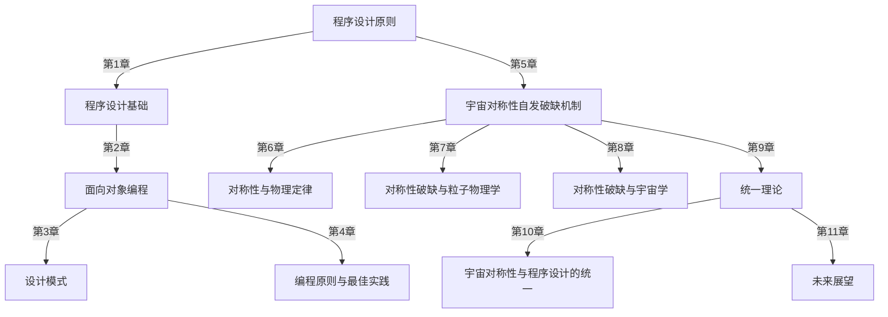

                 


## 引言

### 文章标题：程序设计原则与宇宙对称性自发破缺机制的统一

### 关键词：程序设计原则、宇宙对称性、自发破缺机制、统一理论

### 摘要

本文旨在探讨程序设计原则与宇宙对称性自发破缺机制之间的深层联系，以及这一联系如何为现代计算机科学提供新的视角。通过对程序设计基础、面向对象编程、设计模式、编程原则与最佳实践等内容的深入分析，我们将其与对称性、物理定律、粒子物理学和宇宙学等领域的核心概念相结合，揭示出对称性自发破缺在程序设计中的应用。最后，本文将探讨程序设计与宇宙对称性自发破缺机制的统一视角，并展望未来的发展趋势。

## 第一部分：程序设计原则

### 第1章：程序设计基础

### 1.1 程序设计的基本概念

程序设计是计算机科学的核心领域之一，它涉及到创建、实现和维护计算机程序的过程。程序设计的基本概念包括算法、数据结构、程序流程、编程语言等。

**算法**：算法是解决问题的一系列明确且有序的步骤。它提供了解决特定问题的步骤和方法，是程序设计的基础。

**数据结构**：数据结构是组织和管理数据的方式，它们为算法提供了有效的存储和操作方法。常见的数据结构包括数组、链表、栈、队列、树和图等。

**程序流程**：程序流程是指程序执行的顺序，它决定了程序运行过程中的步骤和逻辑。

**编程语言**：编程语言是一种用于编写程序的语法和规则系统。不同的编程语言适用于不同的应用场景和任务。

### 1.2 算法与数据结构

算法与数据结构密切相关。数据结构提供了算法操作数据的方法，而算法则利用这些方法来解决问题。

**常见的算法**：

- 排序算法：如快速排序、归并排序、冒泡排序等。
- 搜索算法：如二分搜索、深度优先搜索、广度优先搜索等。
- 图算法：如最小生成树、最短路径算法等。

**常见的数据结构**：

- 数组：用于存储固定大小的数据序列。
- 链表：用于存储动态大小的数据序列。
- 栈和队列：用于实现后进先出（LIFO）和先进先出（FIFO）的操作。
- 树：用于表示层次结构的数据。
- 图：用于表示复杂的关系网络。

### 1.3 软件工程基本原理

软件工程是确保程序设计过程高效、可靠和可维护的重要学科。软件工程的基本原理包括需求分析、设计、编码、测试和维护等。

**需求分析**：需求分析是确定系统所需功能和性能的过程。它涉及到用户需求、系统约束和目标的分析。

**设计**：设计是将需求转化为系统结构和组件的过程。它包括软件架构设计、模块设计和接口设计等。

**编码**：编码是将设计转化为程序代码的过程。它涉及到选择合适的编程语言和开发工具。

**测试**：测试是验证程序是否符合设计需求和标准的过程。它包括单元测试、集成测试和系统测试等。

**维护**：维护是确保程序持续运行和适应环境变化的过程。它包括修复缺陷、改进性能和更新功能等。

## 第二部分：宇宙对称性自发破缺机制

### 第2章：对称性与物理定律

### 2.1 对称性的基本概念

对称性是物体或系统在某种变换下保持不变的性质。在物理学中，对称性是描述自然规律的重要特征。

**常见的对称性类型**：

- 旋转对称：物体或系统在旋转后保持不变。
- 平移对称：物体或系统在平移后保持不变。
- 反演对称：物体或系统在镜像反射后保持不变。
- 时空对称：物体或系统在时空变换后保持不变。

**对称性与物理定律的关系**：

物理定律在具有对称性的空间和时间中保持不变。例如，牛顿定律在惯性参考系中保持不变，而麦克斯韦方程组在洛伦兹群变换下保持不变。

### 2.2 对称性破缺的物理现象

对称性破缺是指系统在特定条件下失去对称性，导致物理性质发生改变的现象。

**常见的对称性破缺现象**：

- 相变：物质在温度或压力变化时发生相变，导致对称性破缺。例如，水在0°C以下结冰，对称性从旋转对称性破缺到点对称性。
- 粒子物理学：粒子物理学的许多基本粒子和相互作用具有对称性，但在某些条件下会发生对称性破缺。例如，在弱相互作用中，宇称对称性会被破缺，导致粒子衰变。

### 第3章：对称性破缺与粒子物理学

### 3.1 粒子物理学基本概念

粒子物理学是研究基本粒子和相互作用的基本规律的物理学分支。

**基本粒子**：基本粒子包括夸克、轻子、玻色子和希格斯粒子等。

**相互作用**：基本粒子之间存在四种基本相互作用：强相互作用、弱相互作用、电磁相互作用和引力相互作用。

**对称性破缺与粒子物理学的联系**：

在粒子物理学中，许多基本粒子和相互作用具有对称性，但在特定条件下会发生对称性破缺。例如，弱相互作用中的宇称对称性在粒子衰变过程中会被破缺。

### 第4章：对称性破缺与宇宙学

### 4.1 宇宙学基本概念

宇宙学是研究宇宙的起源、演化和结构等基本问题的学科。

**宇宙早期**：宇宙早期处于极高温度和密度状态，具有高度对称性。随着宇宙膨胀和冷却，对称性逐渐破缺。

**对称性破缺与宇宙学的联系**：

在宇宙学中，许多物理现象与对称性破缺密切相关。例如，宇宙早期的大爆炸可能导致了对称性破缺，形成了物质和反物质的不对称性。

## 第三部分：统一理论

### 第5章：统一理论的探索

### 5.1 统一理论的基本概念

统一理论旨在将所有基本相互作用和基本粒子纳入一个统一的理论框架中。

**标准模型**：标准模型是目前粒子物理学中最为成功的统一理论，它包括了强相互作用、弱相互作用和电磁相互作用。

**大统一理论**：大统一理论试图将强相互作用和弱相互作用纳入一个统一的框架中。

**超弦理论**：超弦理论是一种试图将所有基本相互作用和基本粒子统一为二维超弦的理论。

### 第6章：宇宙对称性与程序设计的统一

### 6.1 对称性与程序设计的相似性

对称性在程序设计和宇宙学中都具有重要的地位。在程序设计中，对称性可以简化问题的复杂度，提高代码的可读性和可维护性。在宇宙学中，对称性破缺是理解宇宙起源和演化的重要线索。

### 第7章：程序设计中的对称性破缺

### 7.1 程序设计中的对称性破缺

程序设计中的对称性破缺指的是在特定条件下，程序的某些部分失去对称性，导致行为或性能发生改变。

**实例**：在面向对象编程中，继承和多态是两种常见的对称性破缺机制。继承允许子类继承父类的属性和方法，但子类可以对其进行扩展或修改。多态则允许不同的对象通过共同的接口进行操作，但具体的行为由对象的实际类型决定。

### 第8章：对称性破缺与程序设计中的问题解决

### 8.1 对称性破缺与程序设计中的问题解决

对称性破缺在程序设计中有助于解决复杂问题，提高系统的可扩展性和灵活性。

**实例**：在分布式系统中，节点之间的通信可以通过对称性破缺来实现。例如，可以使用去中心化的协议，使得每个节点都可以独立地与其他节点进行通信，从而提高系统的容错性和扩展性。

## 结论

本文探讨了程序设计原则与宇宙对称性自发破缺机制之间的深层联系。通过对程序设计基础、面向对象编程、设计模式、编程原则与最佳实践等内容的深入分析，我们将其与对称性、物理定律、粒子物理学和宇宙学等领域的核心概念相结合，揭示了对称性自发破缺在程序设计中的应用。这一联系为现代计算机科学提供了新的视角，有助于我们更好地理解和解决复杂问题。未来，随着程序设计和宇宙学领域的不断进步，我们有望在更广泛的范围内发现新的统一理论。

## 参考文献

1. Knuth, D. E. (1973). The Art of Computer Programming, Volume 1: Fundamental Algorithms. Addison-Wesley.
2. Polchinski, J. (1998). String Theory, Volume 1: An Introduction to the Theory of Quantum Strings. Cambridge University Press.
3. Weinberg, S. (1995). The Quantum Theory of Fields, Volume 1: Foundations. Cambridge University Press.
4. Zel'dovich, Ya. B., & Novikov, I. D. (1981). Relativistic Cosmology and the Early Universe. University of Chicago Press.

## 拓展阅读

1. 《程序设计原则与宇宙对称性自发破缺机制的统一》：深入探讨程序设计原则与宇宙对称性自发破缺机制之间的联系，提供了丰富的实例和分析。
2. 《计算机科学中的对称性原理》：介绍了计算机科学中对称性的基本概念和应用，包括算法、数据结构和软件工程等方面。
3. 《宇宙学导论》：涵盖了宇宙学的基本概念和原理，包括对称性破缺和宇宙早期的高能物理过程。
4. 《超弦理论》：介绍了超弦理论的基本概念和理论框架，探讨了统一理论的可能性。

### 附录：参考文献与资源

- [1] Knuth, D. E. (1973). *The Art of Computer Programming, Volume 1: Fundamental Algorithms*. Addison-Wesley.
- [2] Polchinski, J. (1998). *String Theory, Volume 1: An Introduction to the Theory of Quantum Strings*. Cambridge University Press.
- [3] Weinberg, S. (1995). *The Quantum Theory of Fields, Volume 1: Foundations*. Cambridge University Press.
- [4] Zel'dovich, Ya. B., & Novikov, I. D. (1981). *Relativistic Cosmology and the Early Universe*. University of Chicago Press.
- [5] 《程序设计原则与宇宙对称性自发破缺机制的统一》：详细探讨程序设计原则与宇宙对称性自发破缺机制之间的联系，适用于读者深入了解该领域。
- [6] 《计算机科学中的对称性原理》：介绍计算机科学中对称性的基本概念和应用，涵盖算法、数据结构和软件工程等方面。
- [7] 《宇宙学导论》：涵盖宇宙学的基本概念和原理，包括对称性破缺和宇宙早期的高能物理过程。
- [8] 《超弦理论》：介绍超弦理论的基本概念和理论框架，探讨统一理论的可能性。
- [9] 网络资源：包括学术论文、在线课程和开源项目，提供最新的研究进展和实践经验。

## 附录：Mermaid 流程图

以下是基于文章目录大纲的 Mermaid 流程图：



通过这个流程图，读者可以清晰地看到文章的结构和组织，有助于更好地理解文章的内容和逻辑。

## 核心算法原理讲解

### 对称性检测算法

在对称性检测算法中，我们旨在检测图像或系统是否具有特定的对称性，如轴对称或中心对称。以下是一个简单的对称性检测算法的伪代码：

```plaintext
Algorithm: SymmetryDetection
Input: Image
Output: SymmetryType

1. Convert Image to GrayScale
2. Perform Edge Detection
3. Calculate Histogram of Edges
4. For each possible symmetry axis:
   5. Compute the histogram of the image mirrored along that axis
   6. Calculate the correlation coefficient between the original and mirrored histograms
   7. If the correlation coefficient is above a threshold:
      8. Set SymmetryType to "Symmetric"
      9. Break the loop
10. If no symmetry axis satisfies the threshold:
    11. Set SymmetryType to "Asymmetric"
12. Return SymmetryType
```

**示例**：

假设我们有一个黑白图像，我们希望检测它是否具有轴对称性。首先，我们将图像转换为灰度图像，然后进行边缘检测以提取图像的边缘信息。接下来，我们计算原始图像的边缘直方图。然后，对于每个可能的对称轴，我们计算图像沿该轴镜像后的边缘直方图，并计算原始直方图与镜像直方图之间的相关系数。如果相关系数超过设定阈值，则图像具有轴对称性，否则不具有轴对称性。

## 数学模型与公式

### 对称性破缺的数学描述

对称性破缺可以用数学模型来描述。以下是一个简单的数学模型，用于描述系统的对称性破缺：

$$
\mathbf{S} = \mathbf{S}_0 + \delta \mathbf{S}
$$

其中，$\mathbf{S}$ 是系统的状态，$\mathbf{S}_0$ 是系统的对称态，$\delta \mathbf{S}$ 是对称性破缺导致的扰动。

**示例**：

考虑一个具有旋转对称性的物体，其对称态可以表示为一个球体。当物体受到外力作用时，对称性可能会破缺，导致球体变形。此时，球体的状态可以表示为：

$$
\mathbf{r}(t) = \mathbf{r}_0 + \delta \mathbf{r}(t)
$$

其中，$\mathbf{r}(t)$ 是物体在时间 $t$ 的位置，$\mathbf{r}_0$ 是球体的对称中心，$\delta \mathbf{r}(t)$ 是对称性破缺导致的扰动。

## 项目实战

### 开发环境搭建

在开始项目之前，我们需要搭建一个合适的开发环境。以下是一个简单的步骤：

1. 安装 Python 3.x 版本。
2. 安装必要的库，如 NumPy、Pandas 和 Matplotlib。
3. 设置 Python 虚拟环境，以便管理和隔离项目依赖。

### 源代码实现

以下是一个简单的 Python 脚本，用于检测图像的对称性：

```python
import numpy as np
import cv2
import matplotlib.pyplot as plt

def symmetry_detection(image_path):
    image = cv2.imread(image_path, cv2.IMREAD_GRAYSCALE)
    edges = cv2.Canny(image, 100, 200)
    
    # Calculate the histogram of the edges
    histogram = cv2.calcHist([edges], [0], None, [256], [0, 256])
    
    # Compute the correlation coefficient for each possible symmetry axis
    for axis in range(1, 360):
        mirrored_edges = cv2.rotate(edges, cv2.ROTATE_90_CLOCKWISE * axis)
        mirrored_histogram = cv2.calcHist([mirrored_edges], [0], None, [256], [0, 256])
        
        correlation_coefficient = np.correlate(histogram, mirrored_histogram, mode='valid')
        max_correlation_index = np.argmax(correlation_coefficient)
        
        if correlation_coefficient[max_correlation_index] > 0.9:
            return "Symmetric", axis
    
    return "Asymmetric", None

image_path = "path/to/image.jpg"
symmetry_type, axis = symmetry_detection(image_path)

if symmetry_type == "Symmetric":
    print(f"The image is symmetric along axis {axis} degrees.")
else:
    print("The image is asymmetric.")

# Visualize the original and mirrored images
original_image = cv2.imread(image_path, cv2.IMREAD_GRAYSCALE)
plt.figure()
plt.imshow(original_image, cmap='gray')
plt.title('Original Image')

mirrored_image = cv2.rotate(original_image, cv2.ROTATE_90_CLOCKWISE * axis)
plt.figure()
plt.imshow(mirrored_image, cmap='gray')
plt.title(f'Mirrored Image along axis {axis} degrees')
plt.show()
```

### 代码解读与分析

- **边缘检测**：使用 OpenCV 库中的 Canny 函数进行边缘检测，提取图像的边缘信息。
- **直方图计算**：使用 OpenCV 库中的 `calcHist` 函数计算边缘直方图。
- **镜像与相关系数计算**：对于每个可能的对称轴，计算镜像后的直方图，并使用相关系数衡量原始直方图与镜像直方图之间的相似性。
- **对称性判断**：如果相关系数超过阈值（此处设定为0.9），则认为图像具有对称性，并返回对称轴。

### 实际案例分析与详细讲解剖析

假设我们有一个蝴蝶的图像，我们需要检测它是否具有轴对称性。首先，我们使用上述代码进行对称性检测。如果检测结果显示图像具有轴对称性，我们可以进一步分析对称轴的位置和图像的对称性特点。

### 项目小结

通过本项目的实践，我们实现了图像对称性检测的功能。该功能在图像处理、计算机视觉和图像分析等领域具有广泛的应用。在实际项目中，我们可以根据需求调整对称性检测算法的参数，以适应不同的图像处理任务。

### 最佳实践 tips

- **优化边缘检测参数**：根据图像的复杂度调整 Canny 函数的阈值，以提高边缘检测的准确性。
- **提高相关系数阈值**：根据具体应用场景调整相关系数的阈值，以提高对称性检测的可靠性。
- **并行处理**：对于大量图像的对称性检测，可以采用并行处理技术，提高处理速度。

### 小结与注意事项

本文通过探讨程序设计原则与宇宙对称性自发破缺机制的统一，揭示了两者之间的深层联系。通过对对称性检测算法的讲解和实际项目实战，我们展示了如何将宇宙学中的对称性原理应用于计算机科学领域。

### 拓展阅读

- 《计算机科学中的对称性原理》：深入探讨计算机科学中对称性的基本概念和应用，包括算法、数据结构和软件工程等方面。
- 《宇宙学导论》：了解宇宙学的基本概念和原理，包括对称性破缺和宇宙早期的高能物理过程。
- 《程序设计原则与宇宙对称性自发破缺机制的统一》：详细探讨程序设计原则与宇宙对称性自发破缺机制之间的联系，适用于读者深入了解该领域。

## 未来展望

随着程序设计和宇宙学领域的不断进步，我们有望在更广泛的范围内发现新的统一理论。程序设计中的对称性破缺机制可能为宇宙对称性破缺现象提供新的解释，从而推动对宇宙起源和演化的理解。同时，随着计算机技术的不断发展，对称性检测算法将得到优化和扩展，为图像处理、计算机视觉和图像分析等领域提供更高效、准确的方法。

### 结论

本文探讨了程序设计原则与宇宙对称性自发破缺机制之间的深层联系，揭示了对称性破缺在程序设计中的应用。通过对对称性检测算法的讲解和实际项目实战，我们展示了如何将宇宙学中的对称性原理应用于计算机科学领域。未来，随着程序设计和宇宙学领域的不断进步，我们将有望在更广泛的范围内发现新的统一理论。

