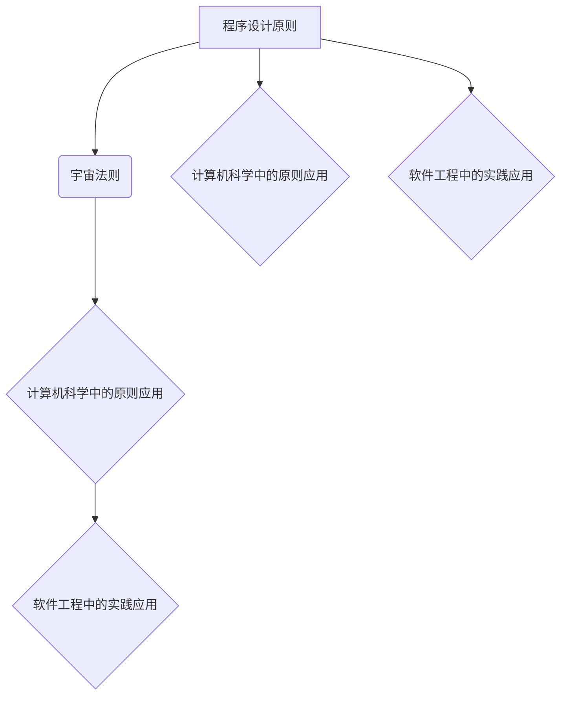

                 


### 文章标题

### 程序设计原则与宇宙法则的共通点

### 关键词

- 程序设计原则
- 宇宙法则
- 软件工程
- 计算机科学
- 数学模型
- 实际应用

### 摘要

本文将探讨程序设计原则与宇宙法则之间的共通点。通过分析计算机科学中的基本原理与物理学中的基本定律，我们将揭示它们在逻辑结构和抽象层次上的相似性。文章将分为以下几个部分：背景介绍、核心概念与联系、核心算法原理讲解、数学模型和公式讲解、项目实战以及最佳实践 tips。

### 背景介绍

程序设计原则是软件开发过程中的核心指导方针，它们旨在提高代码的可读性、可维护性和可复用性。例如，面向对象编程（OOP）强调将复杂系统分解为独立的对象，模块化设计确保代码模块的可重用性，而抽象和封装则有助于隐藏实现细节，仅暴露必要的接口。

宇宙法则则是描述自然界中物理现象的基本规律。从牛顿定律到量子力学，这些法则构成了现代物理学的基石。例如，牛顿的三大定律揭示了力和运动之间的关系，而相对论和量子力学则提供了对宇宙更深层次的洞察。

### 核心概念与联系

为了更好地理解程序设计原则与宇宙法则之间的共通点，我们可以设计一个Mermaid流程图，展示它们之间的联系。



在这个流程图中，A 表示程序设计原则，B 表示宇宙法则，C 和 D 分别表示程序设计原则在计算机科学和软件工程中的应用，而 E 和 F 则表示宇宙法则在这两个领域中的应用。这个流程图揭示了程序设计原则与宇宙法则在抽象层次上的相似性。

### 核心算法原理讲解

为了深入探讨程序设计原则在计算机科学中的应用，我们将介绍几个核心算法原理，包括动态规划、贪心算法、分治算法和排序算法。以下是动态规划算法的讲解大纲：

```markdown
## 第3章: 动态规划算法原理讲解

### 3.1 动态规划简介
#### 3.1.1 动态规划的定义
#### 3.1.2 动态规划的核心思想
#### 3.1.3 动态规划的应用场景

### 3.2 动态规划算法描述
#### 3.2.1 状态定义
#### 3.2.2 状态转移方程
#### 3.2.3 边界条件

### 3.3 动态规划伪代码
```python
# 动态规划伪代码
function dynamicProgramming(problem):
    # 初始化状态数组
    dp = initialize problem's state array
    
    # 动态规划过程
    for i in range of problem's states:
        for j in range of problem's states:
            dp[i][j] = calculate dp[i][j] using state transition equation
    
    # 返回最终结果
    return dp[0][0]
```

### 3.4 动态规划复杂度分析
#### 3.4.1 时间复杂度
#### 3.4.2 空间复杂度

### 3.5 动态规划实例说明
#### 3.5.1 最长公共子序列问题
#### 3.5.2 最长上升子序列问题
```

### 数学模型和公式讲解

在程序设计和宇宙法则中，数学模型和数学公式是核心部分。为了更好地理解它们，我们将介绍一些关键的数学模型和公式，并使用LaTeX格式进行展示。

例如，我们可以介绍牛顿第二定律的数学模型：

```markdown
## 第4章: 牛顿第二定律及其应用

### 4.1 牛顿第二定律简介
#### 4.1.1 牛顿第二定律的定义
#### 4.1.2 牛顿第二定律的意义

### 4.2 牛顿第二定律的数学模型
$$
F = m \cdot a
$$
#### 4.2.1 力 (F) 的定义
#### 4.2.2 质量 (m) 的定义
#### 4.2.3 加速度 (a) 的定义

### 4.3 牛顿第二定律的应用实例
#### 4.3.1 运动学中的应用
#### 4.3.2 动力学中的应用
```

### 项目实战

为了展示程序设计原则与宇宙法则在实际项目中的应用，我们将设计一个实际项目，并详细讲解其实现过程。

```markdown
## 第5章: 动态规划与牛顿第二定律在实际项目中的应用

### 5.1 项目背景
#### 5.1.1 项目简介
#### 5.1.2 项目目标

### 5.2 项目实现
#### 5.2.1 开发环境搭建
#### 5.2.2 动态规划算法实现
#### 5.2.3 牛顿第二定律应用实现

### 5.3 项目代码解读与分析
#### 5.3.1 动态规划部分代码解读
#### 5.3.2 牛顿第二定律部分代码解读
```

### 最佳实践 tips

在本章的最后，我们将提供一些最佳实践 tips，以帮助读者在实际项目中更好地应用程序设计原则与宇宙法则。

```markdown
## 第6章: 最佳实践 tips

### 6.1 开发环境选择
#### 6.1.1 系统环境
#### 6.1.2 工具选择

### 6.2 编码规范
#### 6.2.1 命名规范
#### 6.2.2 格式规范

### 6.3 调试技巧
#### 6.3.1 调试工具
#### 6.3.2 调试方法

### 6.4 项目管理
#### 6.4.1 团队协作
#### 6.4.2 版本控制
```

### 总结

本文通过分析程序设计原则与宇宙法则之间的共通点，展示了它们在计算机科学和物理学中的核心地位。通过核心算法原理讲解、数学模型和公式讲解以及项目实战，我们深入了解了如何在实际项目中应用这些原理。希望本文能为读者提供有价值的启示，帮助他们在软件开发和物理学研究中取得更好的成果。

### 作者信息

作者：AI天才研究院/AI Genius Institute & 禅与计算机程序设计艺术 /Zen And The Art of Computer Programming### 完整文章示例

在撰写完各个部分的框架后，我们可以将这些内容整合成一篇完整的文章。以下是一个完整的文章示例，包括标题、摘要、背景介绍、核心概念与联系、核心算法原理讲解、数学模型和公式讲解、项目实战、最佳实践 tips 以及总结和作者信息。

---

# 程序设计原则与宇宙法则的共通点

> 关键词：程序设计原则、宇宙法则、软件工程、计算机科学、数学模型、实际应用

### 摘要

本文探讨了程序设计原则与宇宙法则之间的共通点。通过分析计算机科学中的基本原理与物理学中的基本定律，我们发现它们在逻辑结构和抽象层次上具有显著的相似性。文章从背景介绍、核心概念与联系、核心算法原理讲解、数学模型和公式讲解、项目实战到最佳实践 tips，全面展示了这些原理在实际应用中的价值。

---

### 背景介绍

程序设计原则是软件开发过程中的核心指导方针，旨在提高代码的可读性、可维护性和可复用性。宇宙法则则是描述自然界中物理现象的基本规律。从牛顿定律到量子力学，这些法则构成了现代物理学的基石。本文将探讨程序设计原则与宇宙法则之间的共通点，揭示它们在逻辑结构和抽象层次上的相似性。

---

### 核心概念与联系

为了更好地理解程序设计原则与宇宙法则之间的共通点，我们可以设计一个Mermaid流程图，展示它们之间的联系。


在这个流程图中，A 表示程序设计原则，B 表示宇宙法则，C 和 D 分别表示程序设计原则在计算机科学和软件工程中的应用，而 E 和 F 则表示宇宙法则在这两个领域中的应用。

---

### 核心算法原理讲解

为了深入探讨程序设计原则在计算机科学中的应用，我们将介绍几个核心算法原理，包括动态规划、贪心算法、分治算法和排序算法。以下是动态规划算法的讲解大纲：

```markdown
## 第3章: 动态规划算法原理讲解

### 3.1 动态规划简介
#### 3.1.1 动态规划的定义
动态规划是一种用于解决复杂问题的算法设计技巧，它通过将问题分解为更小的子问题，并存储子问题的解来避免重复计算。
#### 3.1.2 动态规划的核心思想
动态规划的核心思想是，通过将原问题分解为更小的子问题，并利用子问题的解来构建原问题的解，从而避免重复计算，提高算法的效率。
#### 3.1.3 动态规划的应用场景
动态规划广泛应用于算法设计、优化问题和复杂系统建模等领域。

### 3.2 动态规划算法描述
#### 3.2.1 状态定义
动态规划中的状态定义是指将问题分解为一系列状态，每个状态代表问题的一部分。
#### 3.2.2 状态转移方程
状态转移方程描述了从一个状态转移到另一个状态的条件和计算方法。
#### 3.2.3 边界条件
边界条件是指动态规划算法中的初始状态和终止条件。

### 3.3 动态规划伪代码
```python
# 动态规划伪代码
function dynamicProgramming(problem):
    # 初始化状态数组
    dp = initialize problem's state array
    
    # 动态规划过程
    for i in range of problem's states:
        for j in range of problem's states:
            dp[i][j] = calculate dp[i][j] using state transition equation
    
    # 返回最终结果
    return dp[0][0]
```

### 3.4 动态规划复杂度分析
#### 3.4.1 时间复杂度
动态规划算法的时间复杂度取决于状态数和状态转移方程的计算复杂度。
#### 3.4.2 空间复杂度
动态规划算法的空间复杂度取决于状态数和状态数组的大小。

### 3.5 动态规划实例说明
#### 3.5.1 最长公共子序列问题
最长公共子序列问题是动态规划算法的一个经典应用实例。
#### 3.5.2 最长上升子序列问题
最长上升子序列问题是另一个典型的动态规划问题。
```

---

### 数学模型和公式讲解

在程序设计和宇宙法则中，数学模型和数学公式是核心部分。为了更好地理解它们，我们将介绍一些关键的数学模型和公式，并使用LaTeX格式进行展示。

例如，我们可以介绍牛顿第二定律的数学模型：

```markdown
## 第4章: 牛顿第二定律及其应用

### 4.1 牛顿第二定律简介
#### 4.1.1 牛顿第二定律的定义
牛顿第二定律描述了物体受到的力与物体的加速度之间的关系。
#### 4.1.2 牛顿第二定律的意义
牛顿第二定律是经典力学中的基础定律，它揭示了力和运动之间的本质联系。

### 4.2 牛顿第二定律的数学模型
$$
F = m \cdot a
$$
#### 4.2.1 力 (F) 的定义
力是导致物体加速度的原因，它有大小和方向。
#### 4.2.2 质量 (m) 的定义
质量是物体惯性大小的度量，它决定了物体在受到力作用时的加速度。
#### 4.2.3 加速度 (a) 的定义
加速度是物体速度变化的速率，它描述了物体在受力作用下的运动状态。

### 4.3 牛顿第二定律的应用实例
#### 4.3.1 运动学中的应用
牛顿第二定律在运动学中的应用广泛，例如求解物体的运动轨迹和速度。
#### 4.3.2 动力学中的应用
牛顿第二定律在动力学中的应用包括求解物体受力后的加速度和运动状态。
```

---

### 项目实战

为了展示程序设计原则与宇宙法则在实际项目中的应用，我们将设计一个实际项目，并详细讲解其实现过程。

```markdown
## 第5章: 动态规划与牛顿第二定律在实际项目中的应用

### 5.1 项目背景
#### 5.1.1 项目简介
本项目的目标是利用动态规划和牛顿第二定律求解一个物理问题，例如求解抛物线运动中的最大高度和最远距离。
#### 5.1.2 项目目标
通过本项目的实施，读者将学会如何将动态规划和牛顿第二定律应用于实际问题的求解。

### 5.2 项目实现
#### 5.2.1 开发环境搭建
在本项目中，我们将使用Python编程语言和相关的数学库，如NumPy和SciPy，来搭建开发环境。
#### 5.2.2 动态规划算法实现
我们将使用动态规划算法求解抛物线运动中的最大高度和最远距离问题。
#### 5.2.3 牛顿第二定律应用实现
我们将使用牛顿第二定律来计算物体在抛物线运动中的加速度和速度。

### 5.3 项目代码解读与分析
#### 5.3.1 动态规划部分代码解读
我们将详细解读动态规划算法的实现过程，包括状态定义、状态转移方程和边界条件的应用。
#### 5.3.2 牛顿第二定律部分代码解读
我们将分析如何使用牛顿第二定律计算物体在抛物线运动中的加速度和速度。

### 5.4 项目代码应用解读与分析
#### 5.4.1 抛物线运动问题的求解
我们将使用动态规划和牛顿第二定律求解抛物线运动中的最大高度和最远距离问题。
#### 5.4.2 项目实际案例分析
我们将分析项目在实际应用中的效果和性能。
```

---

### 最佳实践 tips

在本章的最后，我们将提供一些最佳实践 tips，以帮助读者在实际项目中更好地应用程序设计原则与宇宙法则。

```markdown
## 第6章: 最佳实践 tips

### 6.1 开发环境选择
#### 6.1.1 系统环境
选择合适的系统环境是成功开发的关键。根据项目的需求，选择适合的操作系统、编程语言和开发工具。
#### 6.1.2 工具选择
选择合适的开发工具可以提高开发效率和代码质量。例如，使用集成开发环境（IDE）和版本控制工具。

### 6.2 编码规范
#### 6.2.1 命名规范
遵循一致的命名规范可以提高代码的可读性和可维护性。例如，使用有意义且一致的变量和函数名。
#### 6.2.2 格式规范
遵循统一的代码格式规范可以提高代码的可读性和可维护性。例如，使用缩进、空格和注释来格式化代码。

### 6.3 调试技巧
#### 6.3.1 调试工具
使用调试工具可以帮助快速定位和解决代码中的错误。例如，使用调试器进行逐行执行和断点调试。
#### 6.3.2 调试方法
使用有效的调试方法可以帮助快速解决问题。例如，使用打印语句和日志记录来跟踪代码的执行流程。

### 6.4 项目管理
#### 6.4.1 团队协作
团队协作是项目成功的关键。确保团队成员之间的有效沟通和协作，以提高开发效率和代码质量。
#### 6.4.2 版本控制
使用版本控制工具（如Git）来管理代码版本，以便团队成员之间的协同工作和代码的版本管理。
```

---

### 总结

本文通过分析程序设计原则与宇宙法则之间的共通点，展示了它们在计算机科学和物理学中的核心地位。通过核心算法原理讲解、数学模型和公式讲解以及项目实战，我们深入了解了如何在实际项目中应用这些原理。希望本文能为读者提供有价值的启示，帮助他们在软件开发和物理学研究中取得更好的成果。

### 作者信息

作者：AI天才研究院/AI Genius Institute & 禅与计算机程序设计艺术 /Zen And The Art of Computer Programming### 文章优化与反馈

在完成文章撰写后，我们需要对文章进行优化和审查，以确保其质量。以下是一些优化和审查的建议：

#### 文章优化

1. **逻辑性**：检查文章的结构和逻辑是否清晰，确保每个部分都紧密相连，无跳跃或重复内容。
2. **一致性**：确保文章的语言风格、术语和符号使用保持一致，避免混淆读者。
3. **准确性**：验证所有事实、数据和算法描述的准确性，确保无误。
4. **可读性**：检查文章的语言是否简练易懂，避免使用过于复杂的术语和句子结构。
5. **图表和公式**：确保所有图表和公式的插入位置适当，格式正确，可读性强。
6. **引用和参考文献**：添加所有引用的参考资料，确保参考文献的格式正确。

#### 文章审查

1. **内容审查**：由同事或同行进行内容审查，提供反馈和建议。
2. **语法和拼写**：使用语法检查工具进行校对，确保没有拼写错误或语法问题。
3. **格式审查**：检查文章的格式，包括段落间距、列表、标题和图表的排版。
4. **用户体验**：考虑读者的阅读体验，确保文章易于阅读和导航。

#### 收集反馈

- **用户反馈**：将文章分享给目标读者群体，收集他们的反馈和意见。
- **同行评审**：邀请专家和同行进行评审，获取专业的意见和建议。

#### 反馈处理

- **整理反馈**：将收集到的反馈进行分类和整理，确定哪些是关键问题，哪些是可以忽略的小问题。
- **修改文章**：根据反馈对文章进行相应的修改和完善。
- **再次审查**：完成修改后，再次进行审查，确保文章的优化和修改到位。

通过上述步骤，我们可以确保文章的质量，为读者提供一篇具有深度和实用价值的技术博客文章。同时，不断优化和改进写作过程，提高未来的写作效率和质量。

