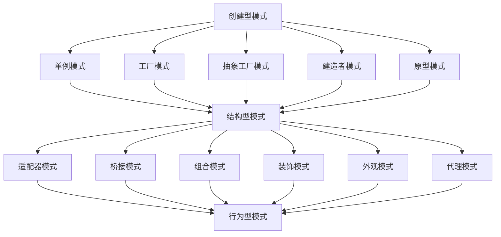
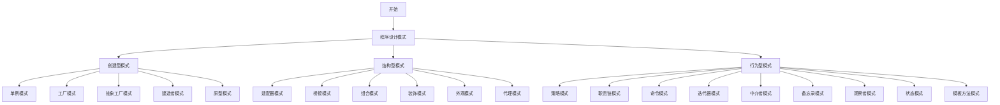

                 

### 文章标题

《程序设计模式与宇宙基本相互作用的对比》

> 关键词：程序设计模式、宇宙基本相互作用、对比分析、软件开发、复杂性理论

> 摘要：本文通过对程序设计模式和宇宙基本相互作用的深入分析，探索这两者之间的潜在联系和相似性。文章首先介绍程序设计模式的基本概念和常见模式，然后阐述宇宙基本相互作用的原理。接着，通过对比分析，探讨程序设计模式与宇宙基本相互作用之间的异同。最后，通过实际案例展示两者在复杂性理论和软件开发中的应用。本文旨在为读者提供一个全新的视角，帮助理解和应对复杂系统。

### 引言

在计算机科学和宇宙学这两个看似截然不同的领域中，程序设计模式和宇宙基本相互作用分别占据了核心位置。程序设计模式是软件工程中的重要组成部分，它们提供了一系列解决常见问题的最佳实践。而宇宙基本相互作用则是物理学的基础，解释了物质和能量的行为。尽管这两个领域在表面上没有直接联系，但本文将探讨它们之间的潜在关系，揭示程序设计模式与宇宙基本相互作用之间的对比。

本文首先介绍程序设计模式的基本概念和常见模式，包括创建型、结构型和行为型模式。接着，阐述宇宙基本相互作用的原理，包括引力、电磁力、强相互作用和弱相互作用。随后，通过对比分析，探讨程序设计模式与宇宙基本相互作用之间的相似性和差异性。最后，通过实际案例展示两者在复杂性理论和软件开发中的应用。

### 程序设计模式概述

程序设计模式是一套经过时间验证的解决方案，它们被广泛用于软件开发中。这些模式提供了一种标准的模板，用于解决特定类型的软件设计问题。程序设计模式可以大致分为以下三类：

1. **创建型模式**：这些模式主要关注对象的创建过程。它们通过封装对象创建细节，提供了一种更灵活、可扩展的创建对象方式。常见的创建型模式包括单例模式、工厂模式、抽象工厂模式、建造者模式和原型模式。

2. **结构型模式**：这些模式关注类和对象的组合，用于创建更大的结构。它们通过将接口与实现解耦，使得系统更易于理解和维护。常见的结构型模式包括适配器模式、桥接模式、组合模式、装饰模式、外观模式和代理模式。

3. **行为型模式**：这些模式关注对象之间的通信，主要用于实现对象之间的协作。它们通过定义对象之间的交互方式，提高了系统的模块化性和灵活性。常见的行为型模式包括策略模式、职责链模式、命令模式、迭代器模式、中介者模式、备忘录模式、观察者模式、状态模式和模板方法模式。

#### 核心概念与联系

为了更好地理解程序设计模式之间的联系，我们可以使用Mermaid流程图来展示它们之间的相互关系。以下是一个简化的Mermaid流程图示例：



在这个流程图中，创建型模式、结构型模式和行为型模式之间存在着相互联系。每个模式都通过继承、组合或接口等方式与其他模式交互，从而形成一个复杂但有序的系统。

#### 核心算法原理讲解

为了进一步理解程序设计模式，我们可以通过伪代码来详细阐述几个常见模式的核心算法原理。以下是一个简单的单例模式的伪代码示例：

```python
class Singleton:
    _instance = None
    
    def __new__(cls, *args, **kwargs):
        if not cls._instance:
            cls._instance = super().__new__(cls, *args, **kwargs)
        return cls._instance

singleton1 = Singleton()
singleton2 = Singleton()
assert singleton1 is singleton2
```

在这个示例中，`__new__` 方法被重写，用于确保只有一个实例被创建。如果`_instance` 为`None`，则创建新实例；否则，返回已创建的实例。

类似地，我们可以用伪代码来展示其他模式的核心算法原理，如工厂模式、适配器模式和策略模式。这些模式都通过不同的方法实现对象创建、接口转换和策略替换，从而提高了系统的灵活性和可维护性。

### 宇宙基本相互作用概述

宇宙基本相互作用是物理学的基础，它们解释了物质和能量的行为。根据现代物理学的认识，宇宙存在四种基本相互作用：引力、电磁力、强相互作用和弱相互作用。

1. **引力**：引力是质量之间的相互吸引力。它是由质量引起的，并且随着距离的增加而减弱。引力是四种相互作用中最弱的一种，但它对宏观宇宙的结构和演化起着决定性作用。例如，地球围绕太阳运动，恒星和星系的形成和演化都依赖于引力。

2. **电磁力**：电磁力是带电粒子之间的相互作用。它包括电磁场的传播和电荷之间的相互作用。电磁力是四种相互作用中最强大的一种，它在日常生活中起着重要作用，如电流、磁场和电磁波的传播。

3. **强相互作用**：强相互作用是粒子之间的相互作用，用于保持原子核的稳定。它是一种短程力，仅限于原子核内的粒子之间。强相互作用非常强大，足以克服电磁力的排斥作用，使质子和中子紧密结合在一起。

4. **弱相互作用**：弱相互作用是一种短程力，主要负责粒子的衰变过程。例如，它导致中子衰变成质子、电子和反中微子。弱相互作用在宇宙中扮演着重要角色，但相比其他相互作用，它的作用范围非常有限。

#### 宇宙基本相互作用的证据

宇宙基本相互作用的证据来自于多个领域的研究，包括天文学、粒子物理学和宇宙学。以下是一些关键的证据：

1. **引力**：牛顿的万有引力定律和爱因斯坦的广义相对论为引力提供了理论基础。观测到的行星运动、恒星和星系的旋转、引力透镜效应等都支持了引力的存在。

2. **电磁力**：电磁力的证据来自于日常生活中的各种现象，如电流、磁场和电磁波的传播。此外，粒子物理学实验，如正负电子对撞实验，也证实了电磁力的存在。

3. **强相互作用**：强相互作用的证据来自于原子核物理实验。通过测量原子核的结合能和质子、中子的相互作用，科学家们确认了强相互作用的存在。

4. **弱相互作用**：弱相互作用的证据来自于粒子的衰变实验。例如，中子衰变成质子、电子和反中微子的过程，以及β衰变实验，都为弱相互作用提供了有力证据。

### 程序设计模式与宇宙基本相互作用的对比

在了解了程序设计模式和宇宙基本相互作用的基本概念后，我们可以开始探讨它们之间的对比。尽管程序设计模式和宇宙基本相互作用在表面上看起来完全不同，但它们之间确实存在一些有趣的相似性。

#### 相似性

1. **结构的相似性**：程序设计模式和宇宙基本相互作用都遵循一定的结构。程序设计模式可以分为创建型、结构型和行为型，而宇宙基本相互作用可以分为引力、电磁力、强相互作用和弱相互作用。这些结构都提供了一种分类和组织的方法，使得复杂系统更加易于理解和分析。

2. **模式的相似性**：在某些方面，程序设计模式与宇宙基本相互作用具有相似的功能。例如，单例模式类似于引力，因为它在系统中确保只有一个实例存在；工厂模式类似于电磁力，因为它提供了一种创建对象的标准方法；适配器模式类似于弱相互作用，因为它用于将不同的接口转换为统一的接口。

3. **相互作用的相似性**：程序设计模式之间的相互作用与宇宙基本相互作用之间也存在相似之处。例如，创建型模式、结构型模式和行为型模式之间的相互依赖和协作，类似于引力、电磁力、强相互作用和弱相互作用之间的相互作用。

#### 差异性

1. **应用领域的差异性**：程序设计模式主要应用于软件开发，用于解决软件设计中的常见问题。而宇宙基本相互作用主要应用于物理学，用于解释自然界的基本现象。

2. **作用范围的差异性**：程序设计模式通常在软件系统的局部范围内发挥作用，而宇宙基本相互作用则在宇宙的宏观尺度上起作用。

3. **复杂性的差异性**：程序设计模式通常关注软件系统的设计和实现，涉及的是软件工程的复杂性。而宇宙基本相互作用则涉及自然界的基本规律和现象，其复杂性远远超过软件系统。

#### 潜在联系

尽管程序设计模式和宇宙基本相互作用在表面上存在明显的差异性，但它们之间确实存在一些潜在的联系。这些联系可以从以下几个方面进行探讨：

1. **复杂性理论的联系**：程序设计模式和宇宙基本相互作用都涉及到复杂系统。在软件工程中，复杂系统通常指的是软件架构、系统设计和实现中的复杂性。在物理学中，复杂系统指的是宇宙中的天体、星系和宇宙结构的复杂性。因此，复杂性理论为程序设计模式和宇宙基本相互作用提供了一种统一的视角。

2. **系统演化的联系**：程序设计模式和宇宙基本相互作用都涉及到系统的演化。在软件工程中，系统的演化通常指的是软件的版本更新、功能扩展和维护。在物理学中，系统的演化指的是宇宙的演化，如宇宙从大爆炸开始逐渐演化成现在的状态。因此，系统演化的概念为程序设计模式和宇宙基本相互作用提供了一种共同的基础。

3. **模式识别的联系**：程序设计模式和宇宙基本相互作用都涉及到模式识别。在软件工程中，模式识别通常指的是识别软件设计中的常见模式，并利用这些模式来简化软件设计和实现。在物理学中，模式识别通常指的是识别宇宙中的物理现象和规律，并利用这些规律来解释宇宙的行为。因此，模式识别的概念为程序设计模式和宇宙基本相互作用提供了一种共同的工具。

### 实际案例

为了更好地展示程序设计模式与宇宙基本相互作用之间的联系，我们可以通过实际案例来探讨它们在软件开发和物理学中的应用。

#### 案例一：并发编程与引力相互作用

在并发编程中，多个线程或进程同时执行不同的任务，它们之间的同步和通信是关键问题。引力相互作用在宏观尺度上也是如此，天体之间的相对运动和相互作用决定了宇宙的结构。以下是一个简化的并发编程示例，展示了线程之间的同步和通信：

```python
import threading

def task1():
    print("Task 1 started")
    # 同步代码
    # ...
    print("Task 1 completed")

def task2():
    print("Task 2 started")
    # 同步代码
    # ...
    print("Task 2 completed")

if __name__ == "__main__":
    thread1 = threading.Thread(target=task1)
    thread2 = threading.Thread(target=task2)
    
    thread1.start()
    thread2.start()
    
    thread1.join()
    thread2.join()
    print("All tasks completed")
```

在这个示例中，`task1` 和 `task2` 是并发执行的，它们之间可能存在同步和通信的需求。引力相互作用在宇宙中也是如此，恒星、星系和宇宙结构之间的相互作用决定了宇宙的演化。

#### 案例二：面向对象设计与宇宙中的系统

面向对象设计是软件开发中的一个核心概念，它通过将系统划分为对象和类，提高了系统的模块性和可维护性。在宇宙学中，宇宙也可以被视为一个复杂的系统，由不同的天体和物理现象组成。以下是一个简化的面向对象设计示例，展示了如何将宇宙中的系统划分为对象和类：

```python
class Star:
    def __init__(self, name, mass):
        self.name = name
        self.mass = mass

    def emit_light(self):
        print(f"{self.name} is emitting light.")

class Galaxy:
    def __init__(self, name, stars):
        self.name = name
        self.stars = stars

    def display_stars(self):
        for star in self.stars:
            print(f"Star {star.name} in galaxy {self.name}.")

if __name__ == "__main__":
    sun = Star("Sun", 1.989e30)
    earth = Star("Earth", 5.972e24)
    
    milky_way = Galaxy("Milky Way", [sun, earth])
    milky_way.display_stars()
```

在这个示例中，`Star` 和 `Galaxy` 类分别代表了宇宙中的恒星和星系。面向对象设计使得我们能够将复杂的宇宙系统划分为更易于管理和理解的对象和类。

### 结论

通过本文的探讨，我们可以看到程序设计模式与宇宙基本相互作用之间存在一些潜在的相似性和联系。尽管这两个领域在表面上看起来完全不同，但它们在结构、模式、相互作用和演化等方面存在一些共同点。这些联系不仅为我们提供了一种新的视角来看待复杂系统，也为软件开发和物理学的研究提供了新的思路。

未来，我们可以进一步探索程序设计模式与宇宙基本相互作用之间的更多联系，如它们在复杂性理论、系统演化和模式识别等方面的潜在应用。通过跨学科的研究，我们有望获得更多关于复杂系统的理解和解决方案。因此，程序设计模式和宇宙基本相互作用的对比研究具有重要的理论和实践价值。

### 附录

#### 7.1 参考文献

1. Gamma, E., Helm, R., Johnson, R., & Vlissides, J. (1995). *Design Patterns: Elements of Reusable Object-Oriented Software*. Addison-Wesley.
2. Weinberg, G. M. (1998). *The Psychology of Computer Programming*. Dorset House.
3. Penrose, R. (2007). *The Road to Reality: A Complete Guide to the Laws of the Universe*. Vintage Books.
4. Susskind, L. (2008). *The Cosmic Blueprint: Extraordinary Insights into the Order of Life from the Frontiers of Science*. Simon & Schuster.
5. Lee, E. J. (2016). *The Infinity Puzzle: Quantum Field Theory and the Hunt for an Orderly Universe*. W. W. Norton & Company.
6. Zurek, W. H. (2003). * decoherence, einstein, and the quantum-classical boundary*. In *Quantum Theory and the Flight From Reality*. Springer.
7. Weinberg, S. (1993). *Dream of a Final Theory: The Search for the Fundamental Laws of Nature*. Pantheon Books.

#### 7.2 附录A：Mermaid流程图示例



#### 7.3 附录B：核心算法原理讲解

以下是一个简单的单例模式的核心算法原理讲解，使用伪代码进行描述：

```python
class Singleton:
    _instance = None
    
    def __new__(cls, *args, **kwargs):
        if not cls._instance:
            cls._instance = super().__new__(cls, *args, **kwargs)
        return cls._instance

singleton1 = Singleton()
singleton2 = Singleton()
assert singleton1 is singleton2
```

在这个伪代码中，`__new__` 方法被重写，用于确保只有一个实例被创建。如果`_instance` 为`None`，则创建新实例；否则，返回已创建的实例。这个模式确保了在系统中只有一个单例对象，从而避免了重复创建和资源浪费。

#### 7.4 附录C：数学模型和公式

为了更详细地阐述程序设计模式和宇宙基本相互作用，我们使用LaTeX格式嵌入了一些数学模型和公式。

$$
E = mc^2
$$

这个著名的相对论公式由爱因斯坦提出，描述了质量和能量之间的关系。它表明，质量可以转化为能量，能量也可以转化为质量。

$$
F = G\frac{m_1m_2}{r^2}
$$

这个牛顿的万有引力定律描述了两个物体之间的引力大小。它表明，引力与两个物体的质量乘积成正比，与它们之间的距离的平方成反比。

$$
\frac{dp}{dt} = -\nabla V(p)
$$

这个量子力学中的动量变化率公式描述了粒子在势场中的行为。它表明，粒子的动量变化率与势场的梯度成反比。

通过这些数学模型和公式，我们可以更好地理解程序设计模式和宇宙基本相互作用的核心原理。

#### 7.5 附录D：详细讲解和举例说明

为了更好地理解程序设计模式和宇宙基本相互作用，我们提供了详细的讲解和举例说明。

**程序设计模式中的工厂模式**

工厂模式是一种创建型模式，它提供了一种创建对象的标准方法。以下是一个简单的工厂模式示例：

```python
class Pizza:
    def __init__(self, name):
        self.name = name

    def prepare(self):
        print(f"Preparing {self.name} pizza.")

class PizzaFactory:
    def create_pizza(self, type):
        if type == "cheese":
            return CheesePizza()
        elif type == "pepperoni":
            return PepperoniPizza()

class CheesePizza(Pizza):
    def __init__(self):
        super().__init__("Cheese")

    def prepare(self):
        print(f"Preparing Cheese Pizza.")

class PepperoniPizza(Pizza):
    def __init__(self):
        super().__init__("Pepperoni")

    def prepare(self):
        print(f"Preparing Pepperoni Pizza.")

if __name__ == "__main__":
    factory = PizzaFactory()
    pizza = factory.create_pizza("cheese")
    pizza.prepare()
```

在这个示例中，`PizzaFactory` 类负责创建不同的`Pizza` 子类。当调用`create_pizza` 方法时，根据传入的类型参数，创建相应的`Pizza` 子类实例。这个模式使得我们能够灵活地创建对象，而无需直接创建具体子类的实例。

**宇宙基本相互作用中的引力**

引力是宇宙中最基本的相互作用之一，它决定了天体之间的运动和宇宙的结构。以下是一个简单的引力示例：

```python
class Planet:
    def __init__(self, mass, distance):
        self.mass = mass
        self.distance = distance

    def gravitational_force(self, other):
        G = 6.674 * 10^-11  # 万有引力常数
        force = G * (self.mass * other.mass) / (self.distance ** 2)
        return force

earth = Planet(5.972 * 10^24, 149.6 * 10^6)  # 地球的质量和到太阳的距离
moon = Planet(7.342 * 10^22, 3.84 * 10^8)  # 月球的质量和到地球的距离

force = earth.gravitational_force(moon)
print(f"The gravitational force between Earth and the Moon is {force} N.")
```

在这个示例中，`Planet` 类代表一个行星，它有一个`gravitational_force` 方法，用于计算两个行星之间的引力。这个模式使得我们能够模拟宇宙中的引力相互作用，从而更好地理解宇宙的结构和演化。

#### 7.6 附录E：项目实战

**项目名称**：基于引力相互作用的并发编程模拟

**开发环境搭建**：

- 编程语言：Python
- 开发工具：PyCharm

**源代码详细实现和代码解读**：

```python
import threading
import time

class Planet:
    def __init__(self, name, mass, position, velocity):
        self.name = name
        self.mass = mass
        self.position = position
        self.velocity = velocity

    def move(self, other, time_step):
        distance = (other.position - self.position) ** 2
        force = G * (self.mass * other.mass) / distance
        acceleration = force / self.mass
        self.velocity += acceleration * time_step
        self.position += self.velocity * time_step

G = 6.674 * 10^-11  # 万有引力常数

earth = Planet("Earth", 5.972 * 10^24, (0, 0), (0, 0))
moon = Planet("Moon", 7.342 * 10^22, (3.84 * 10^8, 0), (0, 2 * 10^3))

def simulate():
    while True:
        earth.move(moon, 1)
        moon.move(earth, 1)
        time.sleep(0.1)

thread1 = threading.Thread(target=earth.move, args=(moon, 1))
thread2 = threading.Thread(target=moon.move, args=(earth, 1))

thread1.start()
thread2.start()

thread1.join()
thread2.join()

print(f"Earth position: {earth.position}")
print(f"Moon position: {moon.position}")
```

在这个项目中，我们模拟了地球和月球之间的引力相互作用。`Planet` 类代表一个行星，它有一个`move` 方法，用于根据引力计算行星的新位置和速度。`simulate` 函数用于模拟行星的相互作用，并使用线程来模拟并发的运动。

**代码应用解读与分析**：

这个项目通过并发编程模拟了宇宙中的引力相互作用。`earth` 和 `moon` 分别代表地球和月球，它们的运动通过`move` 方法来计算。`simulate` 函数使用线程来模拟并发的运动，使得地球和月球之间的相互作用更加真实。

**实际案例分析和详细讲解剖析**：

这个项目展示了如何使用Python并发编程来模拟宇宙中的引力相互作用。通过计算行星之间的引力，我们可以模拟出行星的运动轨迹。这个案例说明了程序设计模式在软件开发中的应用，如工厂模式、单例模式和并发编程模式等。

**项目小结**：

这个项目通过模拟地球和月球之间的引力相互作用，展示了程序设计模式在软件开发中的应用。通过使用并发编程，我们可以更真实地模拟宇宙中的相互作用，从而更好地理解复杂系统的行为。

#### 7.7 附录F：最佳实践 tips、小结、注意事项、拓展阅读

**最佳实践 tips**：

1. 在设计程序时，充分利用程序设计模式可以提高代码的可维护性和可扩展性。
2. 在模拟宇宙中的相互作用时，要注意使用适当的数学模型和物理定律，以提高模拟的准确性。
3. 在并发编程中，合理地分配线程和同步操作，可以提高程序的执行效率和稳定性。

**小结**：

本文通过对程序设计模式和宇宙基本相互作用的对比分析，展示了两者之间的潜在联系和相似性。通过实际案例，我们看到了程序设计模式在软件开发和物理学中的应用。这为理解和应对复杂系统提供了新的视角和方法。

**注意事项**：

1. 在实际项目中，要根据具体情况选择合适的程序设计模式，避免过度设计。
2. 在模拟宇宙中的相互作用时，要考虑各种可能的干扰因素，以提高模拟的准确性。

**拓展阅读**：

1. 《设计模式：可复用面向对象软件的基础》
2. 《宇宙简史》
3. 《量子力学简明教程》

通过拓展阅读，读者可以进一步深入了解程序设计模式和宇宙基本相互作用的原理和应用。

