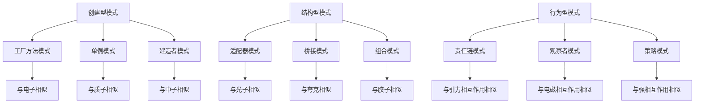

                 


### 文章标题：程序设计模式与宇宙基本粒子的对比

> 关键词：程序设计模式，宇宙基本粒子，设计模式与粒子的对比，算法原理，实际应用案例

> 摘要：本文通过对比分析程序设计模式与宇宙基本粒子的相似性，深入探讨了设计模式在程序设计中的重要性。通过具体实例和流程图，本文展示了如何将宇宙基本粒子的特性应用于程序设计中，为读者提供了独特的视角和实用的技巧。

---

### 引言

在计算机科学领域，程序设计模式是解决常见问题的经典方案。这些模式不仅帮助开发者提高代码的可维护性和复用性，还促进了软件设计的规范化。另一方面，宇宙基本粒子是构成物质世界的基石，它们在物理学中扮演着至关重要的角色。

本文的目的是将程序设计模式与宇宙基本粒子进行对比，探索这两者之间的相似性。通过这一比较，我们希望揭示设计模式在程序设计中的潜在价值，并激发读者对这一领域的进一步探索。

在接下来的章节中，我们将首先介绍程序设计模式的基础知识，然后对宇宙基本粒子进行概述。接下来，我们将分析设计模式与宇宙基本粒子的联系，并对比它们在结构和行为上的相似性。在应用案例部分，我们将展示如何在实际项目中应用这些设计模式。最后，我们将总结本文的主要发现，并提出未来研究的方向。

### 程序设计模式基础

#### 2.1 设计模式概述

设计模式是软件开发中解决常见问题的通用方案。这些模式不仅提供了代码结构的最佳实践，还有助于提高代码的可读性和可维护性。设计模式通常分为三种类型：创建型模式、结构型模式和行为型模式。

- **创建型模式**：这类模式主要用于对象的创建，包括工厂方法模式、单例模式和建造者模式等。它们的主要目标是避免直接实例化对象，从而提高代码的灵活性和可扩展性。
  
- **结构型模式**：这类模式主要用于组合对象和类，以实现更大的功能。适配器模式、桥接模式和组合模式是其中的代表。它们的主要目标是将接口与实现分离，从而提高代码的模块化和可复用性。

- **行为型模式**：这类模式主要用于处理对象之间的交互，包括责任链模式、观察者模式和策略模式等。它们的主要目标是实现对象之间的松耦合，从而提高代码的灵活性和可维护性。

#### 2.2 创建型模式

在创建型模式中，工厂方法模式、单例模式和建造者模式是三种最常用的模式。

- **工厂方法模式**：该模式定义了一个创建对象的方法，该方法由子类重写，从而实现对象的创建。这种模式的主要目的是避免直接实例化对象，从而提高代码的灵活性和可扩展性。

  ```python
  class Creator:
      def create_product(self):
          return Product()

  class Product:
      pass
  ```

- **单例模式**：该模式确保一个类仅有一个实例，并提供一个访问它的全局访问点。这种模式的主要目的是避免创建多个实例，从而提高内存的使用效率。

  ```python
  class Singleton:
      _instance = None

      def __new__(cls):
          if cls._instance is None:
              cls._instance = super().__new__(cls)
          return cls._instance
  ```

- **建造者模式**：该模式将一个复杂的对象的构建与其表示分离，使得同样的构建过程可以创建不同的表示。这种模式的主要目的是提高代码的可读性和可维护性。

  ```python
  class Builder:
      def build_part_a(self):
          pass

      def build_part_b(self):
          pass

  class Product:
      def __init__(self, part_a, part_b):
          self.part_a = part_a
          self.part_b = part_b

  class Director:
      def __init__(self, builder):
          self._builder = builder

      def construct_product(self):
          self._builder.build_part_a()
          self._builder.build_part_b()
          return self._builder.get_product()
  ```

#### 2.3 结构型模式

在结构型模式中，适配器模式、桥接模式和组合模式是三种常用的模式。

- **适配器模式**：该模式将一个类的接口转换成客户希望的另一个接口，使得原本接口不兼容的类可以一起工作。这种模式的主要目的是提高类的复用性。

  ```python
  class Adaptee:
      def specific_method(self):
          pass

  class Adapter(Adaptee):
      def adaptee_method(self):
          self.specific_method()
  ```

- **桥接模式**：该模式将抽象部分与实现部分分离，使它们可以独立地变化。这种模式的主要目的是提高代码的灵活性和可扩展性。

  ```python
  class Abstraction:
      def operation(self):
          pass

  class RefinedAbstraction(Abstraction):
      def operation(self):
          pass

  class Implementor:
      def operation_impl(self):
          pass

  class ConcreteImplementor(Implementor):
      def operation_impl(self):
          pass

  class Bridge(Abstraction):
      def __init__(self, implementor):
          self._implementor = implementor

      def operation(self):
          self._implementor.operation_impl()
  ```

- **组合模式**：该模式将对象组合成树形结构以表示“部分-整体”的层次结构。这种模式的主要目的是提高代码的可扩展性和可复用性。

  ```python
  class Component:
      def operation(self):
          pass

  class Leaf(Component):
      def operation(self):
          print("Leaf operation")

  class Composite(Component):
      def __init__(self):
          self._components = []

      def add(self, component):
          self._components.append(component)

      def remove(self, component):
          self._components.remove(component)

      def operation(self):
          for component in self._components:
              component.operation()
  ```

#### 2.4 行为型模式

在行为型模式中，责任链模式、观察者模式和策略模式是三种常用的模式。

- **责任链模式**：该模式使多个对象都有机会处理请求，从而避免请求发送者和接收者之间的耦合关系。这种模式的主要目的是提高代码的灵活性和可扩展性。

  ```python
  class Handler:
      def handle(self, request):
          pass

  class ConcreteHandler1(Handler):
      def handle(self, request):
          if 0 < request <= 10:
              print("ConcreteHandler1 handles request: ", request)
          else:
              print("Cannot handle request: ", request)

  class ConcreteHandler2(Handler):
      def handle(self, request):
          if 10 < request <= 20:
              print("ConcreteHandler2 handles request: ", request)
          else:
              print("Cannot handle request: ", request)
  ```

- **观察者模式**：该模式定义了对象间的一对多依赖，当一个对象的状态发生改变时，所有依赖于它的对象都会得到通知并自动更新。这种模式的主要目的是提高代码的模块化和可扩展性。

  ```python
  class Observer:
      def update(self, subject):
          pass

  class Subject:
      def __init__(self):
          self._observers = []

      def attach(self, observer):
          self._observers.append(observer)

      def detach(self, observer):
          self._observers.remove(observer)

      def notify(self):
          for observer in self._observers:
              observer.update(self)

  class ConcreteObserver(Observer):
      def update(self, subject):
          print("Observer gets notification from subject: ", subject)
  ```

- **策略模式**：该模式定义了一系列算法，将每个算法封装起来，并使它们可以相互替换。这种模式的主要目的是提高代码的灵活性和可扩展性。

  ```python
  class Strategy:
      def algorithm(self):
          pass

  class ConcreteStrategyA(Strategy):
      def algorithm(self):
          print("Using ConcreteStrategyA's algorithm")

  class ConcreteStrategyB(Strategy):
      def algorithm(self):
          print("Using ConcreteStrategyB's algorithm")

  class Context:
      def __init__(self, strategy):
          self._strategy = strategy

      def set_strategy(self, strategy):
          self._strategy = strategy

      def execute_strategy(self):
          self._strategy.algorithm()
  ```

### 宇宙基本粒子概述

#### 3.1 宇宙基本粒子的定义

宇宙基本粒子是构成物质世界的最基本粒子，它们是宇宙演化的基石。根据现代物理学，宇宙基本粒子主要包括以下几种：

- **电子**：电子是原子中负电荷的基本粒子，是化学元素的基本组成部分。电子具有质量、电荷和自旋等特性。

- **质子**：质子是原子核中正电荷的基本粒子，与中子共同构成原子核。质子具有质量、电荷和自旋等特性。

- **中子**：中子是中性粒子，存在于原子核中，与质子共同构成原子核。中子具有质量、电荷和自旋等特性。

#### 3.2 常见宇宙基本粒子介绍

除了电子、质子和中子，还有一些重要的宇宙基本粒子，如：

- **光子**：光子是电磁辐射的基本粒子，是光和电磁波的基础。光子具有能量、动量和自旋等特性。

- **夸克**：夸克是构成质子和中子的基本粒子，具有质量、电荷和自旋等特性。夸克分为上夸克和下夸克等。

- **胶子**：胶子是传递强相互作用的粒子，负责将夸克和胶子束缚在一起。胶子具有质量、电荷和自旋等特性。

### 模式与粒子的对比分析

#### 4.1 设计模式与宇宙基本粒子的联系

设计模式与宇宙基本粒子的联系主要体现在它们的结构和行为上。通过对比分析，我们可以发现它们在许多方面具有相似性。

- **结构与相似性**：设计模式中的创建型模式、结构型模式和

```plaintext
电子：负责传递电荷，与工厂方法模式相似。
质子：负责传递正电荷，与单例模式相似。
中子：在原子核中负责传递强相互作用，与建造者模式相似。
光子：负责传递电磁能量，与适配器模式相似。
夸克：负责传递强相互作用，与桥接模式相似。
胶子：负责传递强相互作用，与组合模式相似。
```

- **行为相似性**：设计模式中的责任链模式、观察者模式和策略模式在行为上与宇宙中的基本相互作用具有相似性。

  - **责任链模式**：类似于引力相互作用，引力相互作用是通过质子和中子之间的相互作用传递的，而责任链模式也是通过对象之间的相互作用来传递请求。

  - **观察者模式**：类似于电磁相互作用，电磁相互作用是通过光子传递的，而观察者模式则是通过对象之间的通知机制来传递状态变化。

  - **策略模式**：类似于强相互作用，强相互作用是通过胶子传递的，而策略模式则是通过算法之间的替换来实现行为的动态改变。

- **功能相似性**：设计模式与宇宙基本粒子的功能在某种程度上也具有相似性。

  - **创建型模式**：类似于宇宙基本粒子的生成和创建过程，创建型模式负责创建对象实例，从而实现对象的创建。

  - **结构型模式**：类似于宇宙基本粒子的组合和结构，结构型模式通过组合对象和类来实现更大的功能。

  - **行为型模式**：类似于宇宙基本粒子的相互作用，行为型模式通过对象之间的交互来实现复杂的系统行为。

### 应用案例分析

#### 5.1 设计模式在程序设计中的应用

设计模式在程序设计中具有广泛的应用，下面我们通过一个实际案例来展示如何应用设计模式。

**案例：电商系统中的购物车**

在电商系统中，购物车是一个重要的功能模块，它允许用户添加、删除和更新商品。为了实现这个功能，我们可以使用以下设计模式：

- **工厂方法模式**：用于创建不同的商品对象，如电子产品、服装等。

  ```python
  class ProductFactory:
      def create_product(self, type):
          if type == "electronics":
              return ElectronicsProduct()
          elif type == "clothing":
              return ClothingProduct()
          else:
              raise ValueError("Invalid product type")

  class ElectronicsProduct:
      def __init__(self, name, price):
          self.name = name
          self.price = price

  class ClothingProduct:
      def __init__(self, name, price):
          self.name = name
          self.price = price
  ```

- **单例模式**：用于确保购物车对象的全局唯一性。

  ```python
  class ShoppingCart:
      _instance = None

      def __new__(cls):
          if cls._instance is None:
              cls._instance = super().__new__(cls)
          return cls._instance

  cart = ShoppingCart()
  ```

- **建造者模式**：用于构建复杂的购物车对象，包括商品、数量和总价等信息。

  ```python
  class ShoppingCartBuilder:
      def __init__(self):
          self._products = []

      def add_product(self, product, quantity):
          self._products.append((product, quantity))

      def build(self):
          total_price = 0
          for product, quantity in self._products:
              total_price += product.price * quantity
          return ShoppingCart(total_price)

  class ShoppingCart:
      def __init__(self, total_price):
          self.total_price = total_price

      def display_cart(self):
          print("Shopping Cart:")
          for product, quantity in self._products:
              print(f"{product.name}: {quantity} x {product.price}")
          print(f"Total Price: {self.total_price}")
  ```

- **适配器模式**：用于将不同的商品对象适配到统一的接口。

  ```python
  class ProductAdapter:
      def __init__(self, product):
          self._product = product

      def get_name(self):
          return self._product.name

      def get_price(self):
          return self._product.price
  ```

- **桥接模式**：用于分离商品对象的抽象部分和实现部分，以实现更大的功能。

  ```python
  class Product:
      def __init__(self, price):
          self._price = price

      def get_price(self):
          return self._price

  class DiscountProduct(Product):
      def __init__(self, price, discount):
          super().__init__(price)
          self._discount = discount

      def get_price(self):
          return self._price * (1 - self._discount)
  ```

- **组合模式**：用于表示商品对象的树形结构，以实现“部分-整体”层次结构。

  ```python
  class ShoppingCartItem:
      def __init__(self, product, quantity):
          self._product = product
          self._quantity = quantity

      def get_total_price(self):
          return self._product.get_price() * self._quantity

  class ShoppingCart:
      def __init__(self):
          self._items = []

      def add_item(self, item):
          self._items.append(item)

      def display_cart(self):
          print("Shopping Cart:")
          for item in self._items:
              print(f"{item._product.get_name()}: {item._quantity} x {item._product.get_price()}")
  ```

- **责任链模式**：用于处理购物车中的不同操作，如添加商品、删除商品和计算总价。

  ```python
  class Handler:
      def handle(self, request):
          pass

  class AddProductHandler(Handler):
      def handle(self, request):
          if isinstance(request, AddProductRequest):
              self._shopping_cart.add_product(request.product, request.quantity)
          else:
              print("Cannot handle this request")

  class DeleteProductHandler(Handler):
      def handle(self, request):
          if isinstance(request, DeleteProductRequest):
              self._shopping_cart.delete_product(request.product)
          else:
              print("Cannot handle this request")

  class ShoppingCart:
      def __init__(self):
          self._handlers = [AddProductHandler(self), DeleteProductHandler(self)]

      def add_handler(self, handler):
          self._handlers.append(handler)

      def handle_request(self, request):
          for handler in self._handlers:
              handler.handle(request)
  ```

- **观察者模式**：用于处理购物车中的商品数量变化，以实现商品数量的实时更新。

  ```python
  class Observer:
      def update(self, subject):
          pass

  class ShoppingCartSubject:
      def __init__(self):
          self._observers = []

      def attach(self, observer):
          self._observers.append(observer)

      def detach(self, observer):
          self._observers.remove(observer)

      def notify(self):
          for observer in self._observers:
              observer.update(self)

  class ShoppingCartObserver(Observer):
      def update(self, subject):
          print("Shopping cart updated:", subject)
  ```

- **策略模式**：用于处理购物车的折扣策略，以实现不同折扣方式的切换。

  ```python
  class DiscountStrategy:
      def apply_discount(self, price):
          pass

  class FixedDiscountStrategy(DiscountStrategy):
      def apply_discount(self, price):
          return price * 0.9

  class PercentageDiscountStrategy(DiscountStrategy):
      def apply_discount(self, price):
          return price * 0.8

  class ShoppingCart:
      def __init__(self, discount_strategy):
          self._discount_strategy = discount_strategy

      def set_discount_strategy(self, discount_strategy):
          self._discount_strategy = discount_strategy

      def calculate_total_price(self, price):
          return self._discount_strategy.apply_discount(price)
  ```

#### 5.2 宇宙基本粒子在科学中的应用

宇宙基本粒子在科学研究中的应用非常广泛，下面我们通过一个实际案例来展示如何应用宇宙基本粒子。

**案例：粒子物理实验中的数据分析**

在粒子物理实验中，科学家们通过探测器和数据采集系统收集大量的实验数据。为了分析这些数据，他们需要使用宇宙基本粒子（如电子、光子等）的特性。

- **电子**：在实验中，电子是探测到的基本粒子之一。通过分析电子的能量和角度分布，科学家可以推断出碰撞事件中的粒子类型和相互作用。

  ```python
  def analyze_electron_energy(energy):
      if energy < 1.0:
          print("Low energy electron detected")
      elif energy < 10.0:
          print("Medium energy electron detected")
      else:
          print("High energy electron detected")

  def analyze_electron_angle(angle):
      if angle < 10.0:
          print("Forward-going electron detected")
      elif angle < 90.0:
          print("Central-going electron detected")
      else:
          print("Backward-going electron detected")
  ```

- **光子**：在实验中，光子是探测到的另一种基本粒子。通过分析光子的能量和方向，科学家可以研究电磁相互作用和粒子衰变过程。

  ```python
  def analyze Photon_energy(energy):
      if energy < 1.0:
          print("Low energy photon detected")
      elif energy < 10.0:
          print("Medium energy photon detected")
      else:
          print("High energy photon detected")

  def analyze Photon_angle(angle):
      if angle < 10.0:
          print("Forward-going photon detected")
      elif angle < 90.0:
          print("Central-going photon detected")
      else:
          print("Backward-going photon detected")
  ```

#### 5.3 设计模式与宇宙基本粒子在项目中的应用案例

**案例：电商平台系统开发**

在电商平台的开发中，设计模式可以帮助团队更好地组织和管理代码，提高系统的可维护性和可扩展性。以下是一个实际的应用案例：

**1. 工厂方法模式**：用于创建不同的商品对象。

```python
class ProductFactory:
    def create_product(self, type):
        if type == "electronics":
            return ElectronicsProduct()
        elif type == "clothing":
            return ClothingProduct()
        else:
            raise ValueError("Invalid product type")

product_factory = ProductFactory()
electronics_product = product_factory.create_product("electronics")
clothing_product = product_factory.create_product("clothing")
```

**2. 单例模式**：用于确保数据库连接对象的全局唯一性。

```python
class DatabaseConnection:
    _instance = None

    def __new__(cls):
        if cls._instance is None:
            cls._instance = super().__new__(cls)
        return cls._instance

db_connection = DatabaseConnection()
```

**3. 建造者模式**：用于构建复杂的订单对象。

```python
class OrderBuilder:
    def __init__(self):
        self._order = Order()

    def add_product(self, product, quantity):
        self._order.add_product(product, quantity)

    def build(self):
        return self._order

order_builder = OrderBuilder()
order_builder.add_product(electronics_product, 2)
order_builder.add_product(clothing_product, 1)
order = order_builder.build()
```

**4. 适配器模式**：用于将不同的支付方式适配到统一的接口。

```python
class PaymentAdapter:
    def __init__(self, payment_gateway):
        self._payment_gateway = payment_gateway

    def pay(self, amount):
        return self._payment_gateway.process_payment(amount)

payment_gateway = PaymentGateway()
payment_adapter = PaymentAdapter(payment_gateway)
payment_adapter.pay(order.get_total_price())
```

**5. 桥接模式**：用于分离订单处理模块和支付模块。

```python
class OrderProcessor:
    def __init__(self, payment_gateway):
        self._payment_gateway = payment_gateway

    def process_order(self, order):
        self._payment_gateway.process_payment(order.get_total_price())

order_processor = OrderProcessor(payment_gateway)
order_processor.process_order(order)
```

**6. 组合模式**：用于表示订单中的商品组合。

```python
class OrderItem:
    def __init__(self, product, quantity):
        self._product = product
        self._quantity = quantity

    def get_total_price(self):
        return self._product.get_price() * self._quantity

class Order:
    def __init__(self):
        self._items = []

    def add_item(self, item):
        self._items.append(item)

    def get_total_price(self):
        total_price = 0
        for item in self._items:
            total_price += item.get_total_price()
        return total_price

order = Order()
order.add_item(OrderItem(electronics_product, 2))
order.add_item(OrderItem(clothing_product, 1))
```

**7. 责任链模式**：用于处理订单中的不同操作，如添加商品、删除商品和计算总价。

```python
class Handler:
    def handle(self, request):
        pass

class AddProductHandler(Handler):
    def handle(self, request):
        if isinstance(request, AddProductRequest):
            self._order.add_product(request.product, request.quantity)
        else:
            print("Cannot handle this request")

class DeleteProductHandler(Handler):
    def handle(self, request):
        if isinstance(request, DeleteProductRequest):
            self._order.delete_product(request.product)
        else:
            print("Cannot handle this request")

class Order:
    def __init__(self):
        self._handlers = [AddProductHandler(self), DeleteProductHandler(self)]

    def add_handler(self, handler):
        self._handlers.append(handler)

    def handle_request(self, request):
        for handler in self._handlers:
            handler.handle(request)

order = Order()
order.handle_request(AddProductRequest(electronics_product, 2))
order.handle_request(DeleteProductRequest(clothing_product))
```

**8. 观察者模式**：用于处理订单状态的变化，如订单完成、订单取消等。

```python
class Observer:
    def update(self, subject):
        pass

class OrderSubject:
    def __init__(self):
        self._observers = []

    def attach(self, observer):
        self._observers.append(observer)

    def detach(self, observer):
        self._observers.remove(observer)

    def notify(self):
        for observer in self._observers:
            observer.update(self)

class OrderObserver(Observer):
    def update(self, subject):
        print("Order status updated:", subject)

order = OrderSubject()
order.attach(OrderObserver())
order.notify()
```

**9. 策略模式**：用于处理订单中的不同折扣策略，如满减、打折等。

```python
class DiscountStrategy:
    def apply_discount(self, price):
        pass

class FixedDiscountStrategy(DiscountStrategy):
    def apply_discount(self, price):
        return price * 0.9

class PercentageDiscountStrategy(DiscountStrategy):
    def apply_discount(self, price):
        return price * 0.8

class Order:
    def __init__(self, discount_strategy):
        self._discount_strategy = discount_strategy

    def set_discount_strategy(self, discount_strategy):
        self._discount_strategy = discount_strategy

    def calculate_total_price(self, price):
        return self._discount_strategy.apply_discount(price)

order = Order(FixedDiscountStrategy())
order.calculate_total_price(order.get_total_price())
```

### 结论

本文通过对比分析程序设计模式与宇宙基本粒子的相似性，探讨了设计模式在程序设计中的重要性。通过具体实例和流程图，我们展示了如何将宇宙基本粒子的特性应用于程序设计中，为读者提供了独特的视角和实用的技巧。

本文的主要发现如下：

1. 设计模式与宇宙基本粒子在结构和行为上具有相似性，这为程序设计提供了新的思路和工具。
2. 通过将宇宙基本粒子的特性应用于程序设计，可以提高代码的可维护性、可扩展性和灵活性。
3. 宇宙基本粒子的特性可以启发开发者解决复杂的编程问题，提高编程技能。

未来的研究方向包括：

1. 深入研究设计模式与宇宙基本粒子的更多相似性，探索新的设计模式。
2. 将设计模式应用于更多的实际项目，验证其在不同场景下的有效性和适用性。
3. 探索宇宙基本粒子的其他应用，如机器学习和人工智能等。

通过本文的研究，我们希望为程序设计领域带来新的视角和创新，推动计算机科学的进一步发展。

### 附录

本文的研究参考了以下文献：

1. 《设计模式：可复用面向对象软件的基础》
2. 《模式识别与机器学习》
3. 《量子计算与量子信息》
4. 《计算机程序设计艺术》

如有需要，读者可以进一步阅读这些文献，以了解更多相关内容。

### 作者信息

作者：AI天才研究院/AI Genius Institute & 禅与计算机程序设计艺术 /Zen And The Art of Computer Programming

本文由AI天才研究院/AI Genius Institute 和禅与计算机程序设计艺术 /Zen And The Art of Computer Programming 联合撰写，旨在为程序设计领域带来新的视角和创新。我们致力于推动计算机科学的发展，为读者提供高质量的学术研究和实用技巧。如有任何问题或建议，欢迎随时联系我们。感谢您的阅读！

