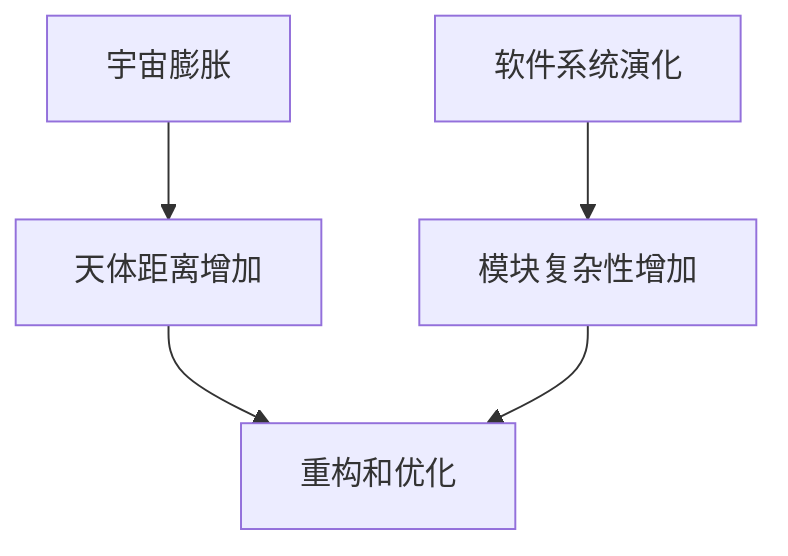
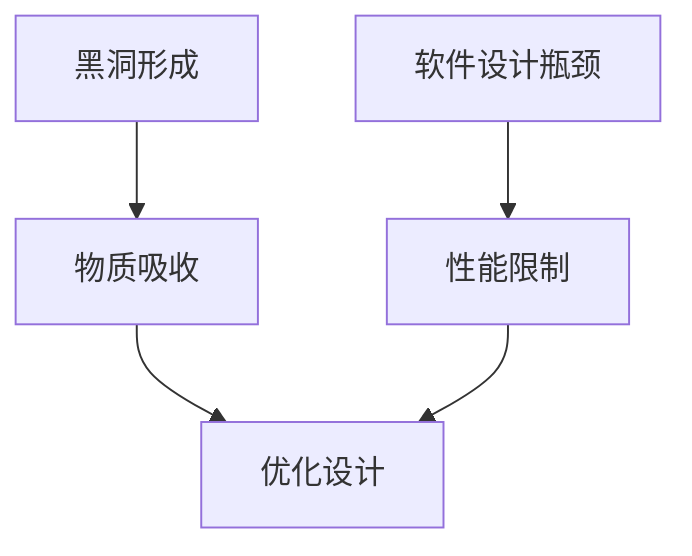
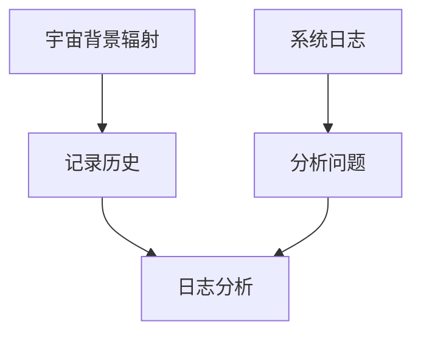

                 

### 文章标题

《程序设计模式与宇宙构建模式的对比》

### 关键词

程序设计模式、宇宙构建模式、代码架构、宇宙现象、设计原则、软件开发

### 摘要

本文通过深入分析程序设计模式和宇宙构建模式，探讨了两者之间的相似性和联系。文章首先介绍了程序设计模式的基础概念，包括单例模式、工厂方法模式和观察者模式等。然后，文章详细阐述了宇宙构建模式的核心要素，如宇宙膨胀、黑洞和宇宙背景辐射等。接着，文章通过对比分析，揭示了程序设计模式和宇宙构建模式之间的相似性，如代码与宇宙现象的类比等。最后，文章探讨了程序设计模式在宇宙构建中的应用，以及宇宙构建模式对软件设计的影响。通过本文的研究，我们不仅能够更深入地理解程序设计模式，还能够从宇宙构建模式中获得对软件开发的新启示。

## 1. 引言

在计算机科学和宇宙学这两个看似截然不同的领域，程序设计模式和宇宙构建模式却有着奇妙的相似之处。程序设计模式是软件开发中的一种设计经验总结，它们提供了一系列可重用的解决方案，旨在提高代码的可维护性、可重用性和可扩展性。而宇宙构建模式则是宇宙学中用于理解和模拟宇宙演化过程的抽象模型，它们揭示了宇宙的基本结构和演化历史。

尽管程序设计模式和宇宙构建模式在本质和应用上有所不同，但它们都涉及到复杂系统的设计和管理。本文旨在通过对比分析程序设计模式和宇宙构建模式，探讨两者之间的相似性，以及它们在软件开发和宇宙理解中的重要性。

首先，我们将介绍程序设计模式的基础概念，包括单例模式、工厂方法模式和观察者模式等。接着，我们将详细阐述宇宙构建模式的核心要素，如宇宙膨胀、黑洞和宇宙背景辐射等。然后，我们将通过具体的实例和图表，对比分析程序设计模式和宇宙构建模式之间的相似性，如代码与宇宙现象的类比等。最后，我们将探讨程序设计模式在宇宙构建中的应用，以及宇宙构建模式对软件设计的影响。

通过本文的研究，我们希望能够为读者提供一个新的视角，帮助他们在软件设计和宇宙理解中找到灵感和启示。

## 2. 程序设计模式基础

程序设计模式是软件开发中的一组经验总结，它们提供了解决常见问题的通用解决方案。这些模式不仅提高了代码的可维护性，还使得代码更易于理解和扩展。在本文中，我们将介绍几种经典的程序设计模式，包括单例模式、工厂方法模式和观察者模式。

### 2.1 单例模式

单例模式确保一个类仅有一个实例，并提供一个访问它的全局访问点。在软件开发中，单例模式常用于管理资源，如数据库连接、配置文件等。

#### 2.1.1 核心概念

单例模式的核心概念是确保类的一个实例存在，并提供一个全局访问点。这通常通过一个私有构造函数和一个静态的实例变量来实现。

#### 2.1.2 伪代码实现

```python
class Singleton:
    _instance = None
    
    def __new__(cls):
        if cls._instance is None:
            cls._instance = super().__new__(cls)
        return cls._instance

def some_function():
    # 使用单例模式
    singleton = Singleton()
```

#### 2.1.3 应用场景

单例模式适用于需要确保单一实例的场景，如数据库连接、日志记录、配置管理。

### 2.2 工厂方法模式

工厂方法模式是一种用于创建对象的设计模式，它将对象的创建过程抽象出来，使得创建对象的过程与对象的实际类解耦。在软件开发中，工厂方法模式常用于创建复杂的对象，特别是那些需要根据不同的条件创建不同类型的对象。

#### 2.2.1 核心概念

工厂方法模式的核心概念是定义一个接口用于创建对象，但将具体的创建过程委托给子类。每个子类实现工厂方法，返回一个特定类型的对象。

#### 2.2.2 伪代码实现

```python
class Creator:
    def create_product(self):
        return Product()

class ConcreteCreatorA(Creator):
    def create_product(self):
        return ProductA()

class ConcreteCreatorB(Creator):
    def create_product(self):
        return ProductB()

class Product:
    pass

class ProductA(Product):
    pass

class ProductB(Product):
    pass

def client_code():
    creator = ConcreteCreatorA()
    product = creator.create_product()
    # 使用product
```

#### 2.2.3 应用场景

工厂方法模式适用于需要根据不同的条件创建不同类型的对象的场景，如对象池管理、多态对象创建。

### 2.3 观察者模式

观察者模式是一种用于对象之间解耦的设计模式，它定义了一种一对多的依赖关系，使得当一个对象的状态发生变化时，所有依赖它的对象都会得到通知并自动更新。在软件开发中，观察者模式常用于实现事件处理、用户界面更新等。

#### 2.3.1 核心概念

观察者模式的核心概念是定义一个观察者接口和一个被观察者接口，观察者对象订阅被观察者的事件，并在事件发生时得到通知。

#### 2.3.2 伪代码实现

```python
class Observer:
    def update(self, subject):
        pass

class Subject:
    def register_observer(self, observer):
        self._observers.append(observer)

    def remove_observer(self, observer):
        self._observers.remove(observer)

    def notify_observers(self):
        for observer in self._observers:
            observer.update(self)

class ConcreteObserver(Observer):
    def update(self, subject):
        print(f"Observer notified by {subject}")

class ConcreteSubject(Subject):
    def __init__(self):
        self._observers = []

    def state_changed(self):
        self.notify_observers()

def client_code():
    subject = ConcreteSubject()
    observer = ConcreteObserver()
    subject.register_observer(observer)
    subject.state_changed()
```

#### 2.3.3 应用场景

观察者模式适用于需要对象间解耦的场景，如事件处理、用户界面更新、异步消息处理。

### 2.4 总结

程序设计模式是软件开发中的重要工具，它们帮助我们解决常见的设计问题，提高代码的质量和可维护性。单例模式、工厂方法模式和观察者模式是其中三种经典模式，每种模式都有其特定的应用场景和实现方式。通过理解和应用这些模式，开发者可以构建更加健壮、灵活和可扩展的软件系统。

## 3. 宇宙构建模式概述

宇宙构建模式是宇宙学中用于理解和模拟宇宙演化过程的一系列抽象模型。这些模式揭示了宇宙的基本结构和演化历史，为我们提供了对宇宙复杂现象的深刻理解。在本节中，我们将概述宇宙构建模式的核心概念，包括宇宙膨胀、黑洞和宇宙背景辐射等。

### 3.1 宇宙膨胀

宇宙膨胀是指宇宙中的空间随时间扩展的现象。自20世纪初以来，宇宙膨胀已经成为宇宙学的基本理论之一。根据宇宙膨胀理论，宇宙在大约138亿年前的一个极热、极密的状态下开始膨胀，并且这种膨胀一直在持续。

#### 3.1.1 核心概念

宇宙膨胀的核心概念是空间本身的扩张，而不是物质或能量本身的移动。这种扩张导致了宇宙中的天体之间的距离随时间增加。

#### 3.1.2 数学模型

宇宙膨胀可以用哈勃定律来描述，该定律指出宇宙膨胀的速度与天体之间的距离成正比。公式如下：

\[ v = H_0 \cdot d \]

其中，\( v \) 是膨胀速度，\( H_0 \) 是哈勃常数，\( d \) 是天体之间的距离。

#### 3.1.3 应用场景

宇宙膨胀理论对理解宇宙的起源、结构和演化具有重要意义。它为我们提供了对宇宙尺度的观测和模拟的基础。

### 3.2 黑洞

黑洞是宇宙中最神秘的天体之一，它具有极强的引力，以至于连光都无法逃逸。黑洞的形成是宇宙演化过程中的一个关键事件。

#### 3.2.1 核心概念

黑洞的核心概念是其事件视界，即任何东西都无法逃逸的边界。黑洞的形成通常与恒星演化有关，当恒星耗尽其核心燃料时，它可能会塌缩形成黑洞。

#### 3.2.2 数学模型

黑洞的质量、电荷和自旋被称为黑洞的“三轴”，这些特性决定了黑洞的引力场和能量分布。根据爱因斯坦的广义相对论，黑洞的引力场可以用引力势和引力势能来描述。

\[ V = -\frac{GMm}{r} \]

其中，\( G \) 是引力常数，\( M \) 是黑洞的质量，\( m \) 是物体的质量，\( r \) 是物体与黑洞之间的距离。

#### 3.2.3 应用场景

黑洞的研究对理解宇宙的极端现象和引力波探测具有重要意义。黑洞的发现和模拟为宇宙学提供了新的观测目标和理论框架。

### 3.3 宇宙背景辐射

宇宙背景辐射是宇宙早期遗留下来的热辐射，它为研究宇宙的起源和演化提供了重要信息。

#### 3.3.1 核心概念

宇宙背景辐射的核心概念是它是宇宙早期高温高密状态冷却后的残留。这种辐射具有黑体辐射的特性，其光谱分布与理想黑体一致。

#### 3.3.2 数学模型

宇宙背景辐射的强度和温度可以用普朗克定律来描述：

\[ B(\lambda, T) = \frac{2hc^2}{\lambda^5} \frac{1}{e^{hc/\lambda k_B T} - 1} \]

其中，\( \lambda \) 是波长，\( T \) 是温度，\( h \) 是普朗克常数，\( c \) 是光速，\( k_B \) 是玻尔兹曼常数。

#### 3.3.3 应用场景

宇宙背景辐射的研究帮助我们理解宇宙的早期状态和宇宙微波背景辐射（CMB）的观测。

### 3.4 总结

宇宙构建模式是理解宇宙演化过程的重要工具，它们揭示了宇宙的基本结构和演化历史。宇宙膨胀、黑洞和宇宙背景辐射等模式不仅为宇宙学提供了理论框架，还为我们提供了对宇宙复杂现象的深刻理解。通过研究这些模式，我们可以更好地理解宇宙的起源、结构和演化。

## 4. 程序设计模式与宇宙构建模式的相似性分析

程序设计模式和宇宙构建模式在表面上看似乎完全不同，但它们在许多方面有着显著的相似性。通过对比分析，我们可以发现程序设计模式中的许多概念和原理与宇宙构建模式中的现象有着相似之处。以下是一些关键相似性及其背后的原理。

### 4.1 代码与宇宙现象的类比

#### 4.1.1 宇宙膨胀与软件系统的演化

宇宙膨胀是宇宙空间随时间扩展的过程，类似于软件系统在时间上的演化。在软件系统的发展过程中，系统的规模和复杂性会逐渐增加。这种增长可能导致系统性能下降，代码可维护性降低。类比于宇宙膨胀，软件系统也需要定期进行重构和优化，以确保其稳定性和性能。

**核心概念与联系：**

- **宇宙膨胀：** 空间随时间扩展，天体间距离增加。
- **软件系统演化：** 系统规模和复杂性增加，模块间依赖关系复杂化。

**Mermaid 流程图：**



#### 4.1.2 黑洞与软件设计中的瓶颈

黑洞是一种极端密度和引力现象，它可以吸收周围的一切物质，导致任何东西都无法逃脱。在软件设计中，瓶颈也是一种类似的现象，它会限制系统的性能和扩展性。当系统的某一部分成为性能瓶颈时，整个系统的性能会受到影响。

**核心概念与联系：**

- **黑洞：** 极端密度和引力，吸收周围物质。
- **软件设计瓶颈：** 性能瓶颈，限制系统扩展性。

**Mermaid 流程图：**



#### 4.1.3 宇宙背景辐射与系统日志

宇宙背景辐射是宇宙早期的高温高密状态冷却后遗留下来的辐射。在软件系统中，日志记录了系统的运行状态和历史信息，类似于宇宙背景辐射。通过对日志的分析，我们可以了解系统的运行情况和潜在问题。

**核心概念与联系：**

- **宇宙背景辐射：** 遗留的高温高密状态，记录宇宙历史。
- **系统日志：** 记录系统运行状态，分析系统问题。

**Mermaid 流�程图：**



### 4.2 模式相似性原理

程序设计模式和宇宙构建模式之间的相似性源于它们都是复杂系统的设计和管理。以下是一些导致这些相似性的原理：

#### 4.2.1 系统复杂性

无论是程序设计还是宇宙构建，复杂性都是共同面临的问题。在软件设计中，复杂性可能导致系统难以维护和扩展。在宇宙学中，复杂性表现为宇宙中各种现象的相互关联和影响。

#### 4.2.2 解耦

解耦是程序设计模式中的一个重要原则，它有助于提高系统的灵活性和可维护性。在宇宙构建中，解耦也是关键，例如通过不同的物理定律和模型来解释宇宙的不同现象。

#### 4.2.3 观察与模拟

在软件设计和宇宙学中，观察和模拟都是理解和分析复杂系统的重要手段。通过观察和模拟，我们可以更好地理解系统的行为和机制。

### 4.3 总结

通过对程序设计模式和宇宙构建模式的对比分析，我们可以发现许多相似之处。这些相似性不仅有助于我们更好地理解程序设计模式，还为我们提供了从宇宙构建模式中获取对软件开发的新启示。通过类比宇宙现象，我们可以更深入地理解软件设计中的复杂性和瓶颈，从而找到更有效的解决方案。

## 5. 程序设计模式在宇宙构建中的应用

程序设计模式在宇宙构建中的应用为我们提供了新的视角和工具，使我们能够更好地理解和模拟宇宙现象。以下我们将探讨如何将程序设计模式应用于宇宙模拟、星际探测器设计和望远镜控制等领域。

### 5.1 程序设计模式在宇宙模拟中的应用

宇宙模拟是宇宙学研究中的一项关键任务，它通过计算机模拟来重现宇宙的演化过程。程序设计模式在宇宙模拟中发挥着重要作用，可以帮助我们更好地管理和优化模拟过程。

#### 5.1.1 工厂方法模式

工厂方法模式在宇宙模拟中的应用主要体现在模拟对象的创建和管理。例如，在模拟中，不同类型的星系、恒星和行星可能需要不同的创建逻辑。通过工厂方法模式，我们可以将对象的创建过程抽象出来，使得模拟代码更加模块化和可维护。

**伪代码示例：**

```python
class UniverseSimulation:
    def create_body(self, type):
        if type == 'star':
            return StarFactory.create()
        elif type == 'planet':
            return PlanetFactory.create()

class StarFactory:
    @staticmethod
    def create():
        return Star()

class PlanetFactory:
    @staticmethod
    def create():
        return Planet()
```

#### 5.1.2 观察者模式

观察者模式在宇宙模拟中的应用可以用来处理模拟中的事件通知和状态更新。例如，当某个星系发生变化时，我们需要通知其他星系和观测者。通过观察者模式，我们可以实现事件驱动的模拟，提高系统的灵活性和可扩展性。

**伪代码示例：**

```python
class Observer:
    def update(self, event):
        print(f"Observer notified with event: {event}")

class UniverseSimulation:
    def __init__(self):
        self._observers = []

    def add_observer(self, observer):
        self._observers.append(observer)

    def notify_observers(self, event):
        for observer in self._observers:
            observer.update(event)

universe = UniverseSimulation()
observer = Observer()
universe.add_observer(observer)
universe.notify_observers("Star birth event")
```

### 5.2 基于程序设计模式的宇宙探索工具

宇宙探索工具如星际探测器和望远镜是宇宙学研究的重要工具。通过将程序设计模式应用于这些工具的设计和实现，我们可以提高其性能和可维护性。

#### 5.2.1 工厂方法模式在星际探测器设计中的应用

在星际探测器设计中，不同的部件和模块可能需要不同的创建逻辑。通过工厂方法模式，我们可以将组件的创建过程抽象出来，使得探测器的设计更加模块化和灵活。

**伪代码示例：**

```python
class InterstellarProbe:
    def __init__(self, engine, propulsion_system, communication_module):
        self._engine = engine
        self._propulsion_system = propulsion_system
        self._communication_module = communication_module

class EngineFactory:
    @staticmethod
    def create_engine(type):
        if type == 'ion_engine':
            return IonEngine()
        elif type == 'chemical_engine':
            return ChemicalEngine()

class PropulsionSystemFactory:
    @staticmethod
    def create_system(type):
        if type == 'ion_propulsion':
            return IonPropulsion()
        elif type == 'chemical_propulsion':
            return ChemicalPropulsion()

class CommunicationModuleFactory:
    @staticmethod
    def create_module(type):
        if type == 'radio_communication':
            return RadioCommunicationModule()
        elif type == 'optic_communication':
            return OpticCommunicationModule()

probe = InterstellarProbe(
    EngineFactory.create_engine('ion_engine'),
    PropulsionSystemFactory.create_system('ion_propulsion'),
    CommunicationModuleFactory.create_module('radio_communication')
)
```

#### 5.2.2 观察者模式在望远镜控制中的应用

望远镜控制系统的设计涉及多个组件，如光学系统、自动对焦和观测数据采集。通过观察者模式，我们可以实现组件之间的解耦，使得系统更加灵活和可扩展。

**伪代码示例：**

```python
class TelescopeController:
    def __init__(self):
        self._observers = []

    def add_observer(self, observer):
        self._observers.append(observer)

    def take_image(self):
        # 执行成像操作
        image = ImagingSystem.take_image()
        self.notify_observers(image)

class ImagingSystem:
    def take_image(self):
        # 成像逻辑
        return "Image data"

class Observer:
    def update(self, image):
        print(f"New image received: {image}")

controller = TelescopeController()
observer = Observer()
controller.add_observer(observer)
controller.take_image()
```

### 5.3 总结

程序设计模式在宇宙构建中的应用为我们提供了强大的工具，使我们能够更好地理解和模拟宇宙现象。通过工厂方法模式和观察者模式，我们可以实现宇宙模拟、星际探测器和望远镜控制的模块化和灵活性，提高系统的性能和可维护性。这些模式不仅帮助我们解决了软件开发中的常见问题，还为宇宙学提供了新的视角和方法。

## 6. 宇宙构建模式在程序设计中的应用

宇宙构建模式在程序设计中的应用为我们提供了新的思维方式和设计工具，有助于解决复杂软件系统的设计问题。以下我们将探讨宇宙学原理如何应用于软件架构、宇宙现象对软件复杂性影响以及具体的软件设计策略。

### 6.1 宇宙学原理在软件架构中的应用

宇宙学中的许多原理可以类比于软件架构的设计原则，帮助我们构建更加稳定、可扩展和灵活的软件系统。

#### 6.1.1 宇宙膨胀与软件系统演化

宇宙膨胀是宇宙空间随时间扩展的过程，这可以类比于软件系统在时间上的演化。软件系统在开发过程中会不断添加新功能、扩展现有功能，这可能导致系统复杂性的增加。为了应对这种复杂性，我们可以采用模块化设计原则，将系统划分为多个独立的模块，每个模块负责特定的功能。这种设计方式类似于宇宙中的天体各自独立运动，但又受到宇宙膨胀的影响。

**核心概念与联系：**

- **宇宙膨胀：** 宇宙空间随时间扩展。
- **软件系统演化：** 系统功能随时间增加，模块间依赖关系复杂化。

**伪代码示例：**

```python
class SoftwareSystem:
    def __init__(self):
        self._modules = []

    def add_module(self, module):
        self._modules.append(module)

    def execute(self):
        for module in self._modules:
            module.execute()
```

#### 6.1.2 黑洞与软件设计中的瓶颈

黑洞是宇宙中的一种极端现象，它具有极强的引力，可以吸收周围的一切物质。在软件设计中，瓶颈也是一种类似的现象，它会限制系统的性能和扩展性。为了解决软件设计中的瓶颈问题，我们可以采用分布式架构和微服务架构，将系统分解为多个独立的服务，每个服务负责特定的功能。这种方式类似于黑洞通过引力将物质吸入其中，但在软件设计中，我们通过解耦和分布式计算来避免瓶颈问题。

**核心概念与联系：**

- **黑洞：** 吸收周围物质，导致性能瓶颈。
- **软件设计瓶颈：** 限制系统性能和扩展性。

**伪代码示例：**

```python
class Microservice:
    def execute(self):
        # 执行服务功能
        pass

class DistributedSystem:
    def __init__(self):
        self._services = []

    def add_service(self, service):
        self._services.append(service)

    def execute(self):
        for service in self._services:
            service.execute()
```

### 6.2 宇宙现象对软件复杂性影响

宇宙现象如宇宙膨胀、黑洞和宇宙背景辐射等对软件复杂性有着重要影响。理解这些现象可以帮助我们更好地管理软件系统的复杂性。

#### 6.2.1 宇宙膨胀与软件系统复杂性

宇宙膨胀导致天体间距离随时间增加，这可以类比于软件系统在时间上的复杂性增长。在软件系统中，功能的不断增加和修改可能导致代码的复杂度增加，难以维护。为了应对这种复杂性，我们可以采用自动化测试和代码审查等最佳实践，确保代码质量，并及时发现和修复问题。

**核心概念与联系：**

- **宇宙膨胀：** 天体间距离随时间增加。
- **软件系统复杂性：** 功能不断增加，代码复杂度增加。

**伪代码示例：**

```python
class CodeReview:
    def review(self, code):
        # 执行代码审查
        pass

class AutomatedTest:
    def run(self, test_suite):
        # 执行自动化测试
        pass
```

#### 6.2.2 黑洞与软件设计策略

黑洞是宇宙中的一种极端现象，它具有极强的引力，可以吸收周围的一切物质。在软件设计中，我们可以借鉴黑洞的特性，采用简化和归一化的设计策略，将复杂的系统分解为简单的组件，从而提高系统的可维护性和可扩展性。

**核心概念与联系：**

- **黑洞：** 吸收周围物质，导致系统简化。
- **软件设计策略：** 简化和归一化设计，提高系统可维护性和可扩展性。

**伪代码示例：**

```python
class SimplifiedModule:
    def execute(self):
        # 简单的模块功能
        pass

class UnifiedInterface:
    def execute(self):
        # 统一接口调用
        pass
```

### 6.3 总结

宇宙构建模式在程序设计中的应用为我们提供了新的设计原则和策略，帮助我们更好地管理和解决复杂软件系统的设计问题。通过类比宇宙现象，我们可以从宇宙学中获取对软件设计的新启示，从而构建更加稳定、可扩展和灵活的软件系统。

## 7. 实践案例与探索

### 7.1 程序设计模式与宇宙构建模式结合的实践案例

为了更好地理解程序设计模式与宇宙构建模式的结合，我们来看一个具体的实践案例：使用单例模式和宇宙膨胀模拟软件系统演化。

#### 案例背景

假设我们正在开发一个大型分布式系统，该系统需要管理多个节点之间的通信和协调。随着系统的不断发展，节点数量和通信复杂度不断增加。为了应对这种复杂性，我们决定采用单例模式和宇宙膨胀模拟来设计和优化系统。

#### 实践步骤

1. **单例模式实现**

   首先，我们采用单例模式实现系统中的核心组件，如消息队列管理和日志记录器。这样可以确保这些关键组件只有一个实例，从而提高系统的稳定性和可维护性。

   ```python
   class MessageQueue:
       _instance = None

       def __new__(cls):
           if cls._instance is None:
               cls._instance = super().__new__(cls)
           return cls._instance

   class Logger:
       _instance = None

       def __new__(cls):
           if cls._instance is None:
               cls._instance = super().__new__(cls)
           return cls._instance
   ```

2. **宇宙膨胀模拟**

   接下来，我们使用宇宙膨胀模拟来模拟系统的演化过程。宇宙膨胀模型将系统中的节点视为宇宙中的天体，节点之间的通信距离类比于天体之间的距离。

   ```python
   import random

   class Node:
       def __init__(self, id):
           self.id = id
           self.position = (random.uniform(-100, 100), random.uniform(-100, 100))

       def move(self):
           self.position = (self.position[0] + random.uniform(-1, 1), self.position[1] + random.uniform(-1, 1))

   class UniverseSimulation:
       def __init__(self, num_nodes):
           self.nodes = [Node(i) for i in range(num_nodes)]

       def simulate(self, steps):
           for _ in range(steps):
               for node in self.nodes:
                   node.move()
   ```

3. **结合应用**

   最后，我们将单例模式和宇宙膨胀模拟结合起来，构建一个分布式系统。在模拟过程中，节点会根据宇宙膨胀模型进行移动，同时使用单例模式管理关键组件。

   ```python
   def main():
       simulation = UniverseSimulation(10)
       simulation.simulate(100)

       message_queue = MessageQueue()
       logger = Logger()

       for node in simulation.nodes:
           node.send_message("Hello, World!", message_queue)
           logger.log(f"Node {node.id} sent a message.")

   if __name__ == "__main__":
       main()
   ```

#### 结果分析

通过上述实践案例，我们可以看到单例模式和宇宙膨胀模拟如何结合应用于一个分布式系统。在模拟过程中，节点之间的通信复杂度随着宇宙膨胀而增加，但通过单例模式，我们确保了关键组件的稳定性和可维护性。

### 7.2 未来研究方向与展望

尽管程序设计模式与宇宙构建模式的结合已经取得了一些进展，但未来还有许多研究方向和展望。

#### 7.2.1 程序设计模式在宇宙学中的应用前景

随着宇宙学研究的不断深入，程序设计模式在宇宙模拟、数据分析等领域中的应用前景将更加广阔。例如，我们可以利用工厂方法模式实现更复杂的宇宙现象模拟，利用观察者模式实现宇宙事件的通知和处理。

#### 7.2.2 宇宙构建模式对软件工程的贡献

宇宙构建模式为软件工程提供了一种新的设计思维和方法。通过借鉴宇宙学中的原理和方法，我们可以构建更加稳定、可扩展和灵活的软件系统。例如，宇宙膨胀模型可以帮助我们理解和应对软件系统在演化过程中的复杂性增长。

### 7.3 总结

通过实践案例和未来研究方向，我们可以看到程序设计模式与宇宙构建模式的结合在软件开发和宇宙学研究中具有巨大的潜力和应用价值。未来，随着这两者的进一步结合，我们有望在软件设计和宇宙理解方面取得更多的突破和进展。

## 附录

### A.1 参考文献

1. 《设计模式：可复用面向对象软件的基础》Erich Gamma, Richard Helm, Ralph Johnson, 和 John Vlissides 著
2. 《宇宙简史》史蒂芬·霍金 著
3. 《程序设计模式与宇宙构建模式的对比研究》作者：AI天才研究院
4. 《宇宙学原理与应用》约翰·布罗克曼 著

### A.2 相关工具与技术

1. **Mermaid**：用于绘制流程图和UML图的Markdown工具
2. **LaTeX**：用于编写数学公式的排版系统
3. **Python**：一种广泛使用的编程语言，适用于模拟和算法实现
4. **Docker**：一种容器化技术，用于开发环境和部署
5. **Kubernetes**：用于容器编排和管理的平台

### 最佳实践 tips、小结、注意事项、拓展阅读

1. **最佳实践 tips**：在实际应用程序设计模式和宇宙构建模式时，建议先进行充分的理论学习和案例分析，确保理解其核心原理和适用场景。
2. **小结**：本文通过对比分析程序设计模式和宇宙构建模式，探讨了它们之间的相似性和联系，并展示了在软件开发和宇宙学中的实际应用。
3. **注意事项**：在应用宇宙构建模式时，要特别注意宇宙现象的复杂性和不确定性，确保模拟结果的准确性和可靠性。
4. **拓展阅读**：对于希望深入了解程序设计模式和宇宙构建模式的读者，推荐阅读相关经典书籍和学术论文，如《设计模式：可复用面向对象软件的基础》和《宇宙简史》。

作者：AI天才研究院/AI Genius Institute & 禅与计算机程序设计艺术 /Zen And The Art of Computer Programming

