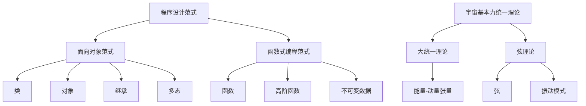

                 


## 文章标题

《程序设计范式与宇宙基本力统一理论的对比》

## 文章关键词

程序设计范式、宇宙基本力统一理论、面向对象、函数式编程、大统一理论、弦理论

## 文章摘要

本文旨在探讨程序设计范式与宇宙基本力统一理论之间的联系和对比。通过引入面向对象、函数式编程等程序设计范式，以及大统一理论和弦理论等宇宙基本力统一理论，本文将分析这些范式和理论在概念、原理和结构上的异同点。文章首先介绍了程序设计范式的定义和特点，然后介绍了宇宙基本力统一理论的概念和原理，接着对两者进行了详细的对比分析。通过具体的案例研究，本文进一步探讨了程序设计范式与宇宙基本力统一理论在实际应用中的联系和影响。最后，文章总结了本文的研究成果，并对未来的研究方向进行了展望。

## 目录

1. 引言
2. 程序设计范式介绍
3. 宇宙基本力统一理论介绍
4. 程序设计范式与宇宙基本力统一理论的对比分析
5. 案例研究
6. 总结与展望

## 一、引言

程序设计范式和宇宙基本力统一理论分别属于计算机科学和物理学两个不同的领域。程序设计范式是指解决特定类型问题的方法或模式，包括面向对象、函数式编程等。而宇宙基本力统一理论则是试图将宇宙中四种基本力（强相互作用、弱相互作用、电磁力和引力）统一起来的一种理论框架。

尽管这两个领域看似完全不同，但实际上它们之间存在着许多有趣的联系。例如，程序设计范式中的面向对象和函数式编程方法在某种程度上可以类比为宇宙中的基本力。面向对象范式强调模块化和抽象，与强相互作用和电磁力具有相似性；而函数式编程范式强调状态不变和函数式组合，与弱相互作用具有相似性。

本文旨在通过对比分析程序设计范式和宇宙基本力统一理论，探讨它们之间的相似之处和差异。这种对比不仅有助于我们更深入地理解计算机科学和物理学的本质，也可能为我们解决复杂问题提供新的思路。

## 二、程序设计范式介绍

程序设计范式是指解决特定类型问题的方法或模式。不同的范式具有不同的特点和应用场景。以下是几种常见的程序设计范式：

### 2.1 面向对象范式

面向对象范式是一种以对象为中心的编程范式。它将现实世界中的实体抽象为对象，每个对象都有属性和方法。面向对象范式强调模块化和抽象，使得代码更易于理解和维护。

#### 概念

- **对象**：现实世界中的实体，具有属性和方法。
- **类**：对象的模板，定义对象的属性和方法。
- **继承**：子类继承父类的属性和方法。
- **多态**：不同的对象可以响应相同的消息，具有不同的行为。

#### 特点

- **模块化**：对象之间相互独立，易于维护和扩展。
- **抽象**：将复杂的现实世界简化为简单的对象模型。
- **可复用性**：通过继承和多态，代码的可复用性得到提高。

#### 历史

面向对象范式起源于20世纪60年代，随着Smalltalk语言的出现而逐渐受到关注。自那时以来，面向对象范式已经成为软件开发的主流方法。

### 2.2 函数式编程范式

函数式编程范式是一种以函数为中心的编程范式。它强调状态不变和函数式组合，使得代码更简洁、更易于测试和推理。

#### 概念

- **函数**：一种接受输入并返回输出的计算过程。
- **高阶函数**：函数作为参数或返回值的函数。
- **不可变数据**：数据一旦创建，就无法修改。
- **递归**：通过递归调用函数来解决问题。

#### 特点

- **简洁性**：函数式编程范式强调简洁的代码结构，易于阅读和理解。
- **可复用性**：函数作为基本单位，易于复用。
- **可测试性**：由于状态不变，函数式编程范式使得代码更易于测试。

#### 历史

函数式编程范式起源于20世纪50年代，随着Lisp语言的出现而逐渐受到关注。尽管在早期阶段没有受到广泛关注，但随着时间的推移，函数式编程范式逐渐在领域特定语言（如Haskell、Scala）和Web开发（如JavaScript、Clojure）中得到了广泛应用。

### 2.3 脏代码范式

脏代码范式是一种不考虑代码质量和可维护性的编程范式。它通常用于快速原型开发和黑客攻击等场景。

#### 概念

- **快速原型开发**：在短时间内开发出可运行的代码，以便验证想法。
- **黑客攻击**：利用系统的漏洞进行非法操作。

#### 特点

- **快速开发**：以速度和效率为导向。
- **低质量**：代码结构混乱，缺乏注释和文档。
- **高风险**：可能导致系统崩溃和安全漏洞。

#### 历史

脏代码范式起源于20世纪80年代，随着黑客文化的兴起而逐渐受到关注。尽管它不适合生产环境，但在某些特定场景下具有实际应用价值。

## 三、宇宙基本力统一理论介绍

宇宙基本力统一理论是试图将宇宙中的四种基本力（强相互作用、弱相互作用、电磁力和引力）统一起来的一种理论框架。以下是几种常见的宇宙基本力统一理论：

### 3.1 大统一理论

大统一理论是一种试图将强相互作用、弱相互作用和电磁力统一起来的理论。它认为这三种力在极高能量下是相互统一的。

#### 概念

- **大统一力**：一种将强相互作用、弱相互作用和电磁力统一起来的力。
- **能量-动量张量**：描述物体在空间中的运动状态。

#### 特点

- **统一性**：将三种基本力统一在一起。
- **高能物理**：适用于极高能量下的物理现象。

#### 历史

大统一理论起源于20世纪60年代，随着量子场论的进展而逐渐受到关注。尽管目前尚未得到实验验证，但大统一理论为理解宇宙的基本力提供了重要的理论框架。

### 3.2 弦理论

弦理论是一种试图将所有基本力（包括引力）统一起来的理论。它认为宇宙中的基本构成单元是一维的“弦”，而不是点状粒子。

#### 概念

- **弦**：宇宙中的基本构成单元，具有一维性质。
- **振动模式**：描述弦的不同状态。
- **弦振动物理**：描述弦的振动方式和相应的物理现象。

#### 特点

- **统一性**：将所有基本力统一起来。
- **高维空间**：弦理论涉及高维空间，甚至可能涉及超空间。
- **数学复杂性**：弦理论包含复杂的数学模型和公式。

#### 历史

弦理论起源于20世纪70年代，随着量子引力研究的进展而逐渐受到关注。尽管目前尚未得到实验验证，但弦理论为理解宇宙的基本力和结构提供了重要的理论框架。

## 四、程序设计范式与宇宙基本力统一理论的对比分析

### 4.1 对比分析的方法

为了对比分析程序设计范式与宇宙基本力统一理论，我们采用以下方法：

1. **概念对比**：分析程序设计范式和宇宙基本力统一理论中的核心概念，并比较它们之间的异同点。
2. **结构对比**：分析程序设计范式和宇宙基本力统一理论的内部结构，并比较它们之间的相似性和差异性。
3. **原理对比**：分析程序设计范式和宇宙基本力统一理论的原理，并比较它们之间的异同点。
4. **应用对比**：分析程序设计范式和宇宙基本力统一理论在实际应用中的影响和效果。

### 4.2 对比分析的结果

#### 概念对比

- **程序设计范式**：面向对象范式强调模块化和抽象，函数式编程范式强调状态不变和函数式组合。
- **宇宙基本力统一理论**：大统一理论试图将强相互作用、弱相互作用和电磁力统一起来，弦理论试图将所有基本力（包括引力）统一起来。

#### 结构对比

- **程序设计范式**：面向对象范式具有类、对象、继承、多态等概念，函数式编程范式具有函数、高阶函数、不可变数据等概念。
- **宇宙基本力统一理论**：大统一理论涉及能量-动量张量等概念，弦理论涉及弦、振动模式等概念。

#### 原理对比

- **程序设计范式**：面向对象范式强调模块化和抽象，函数式编程范式强调状态不变和函数式组合。
- **宇宙基本力统一理论**：大统一理论试图通过高能物理现象将三种基本力统一起来，弦理论试图通过高维空间和数学模型将所有基本力统一起来。

#### 应用对比

- **程序设计范式**：面向对象范式和函数式编程范式在实际应用中都有广泛的应用，例如面向对象范式在软件开发中得到了广泛应用，函数式编程范式在领域特定语言中得到了广泛应用。
- **宇宙基本力统一理论**：大统一理论和弦理论在物理学研究中都有重要的应用，例如大统一理论在粒子物理研究中得到了广泛应用，弦理论在宇宙学研究中得到了广泛应用。

## 五、案例研究

### 5.1 案例一：面向对象范式与弦理论的对比

#### 概念对比

- **面向对象范式**：面向对象范式强调模块化和抽象，将现实世界中的实体抽象为对象，并通过类、对象、继承、多态等概念实现。
- **弦理论**：弦理论认为宇宙中的基本构成单元是一维的“弦”，弦的不同状态描述了不同的物理现象。

#### 结构对比

- **面向对象范式**：面向对象范式具有类、对象、继承、多态等概念，通过这些概念实现模块化和抽象。
- **弦理论**：弦理论涉及弦、振动模式等概念，通过这些概念描述宇宙中的基本力和物理现象。

#### 原理对比

- **面向对象范式**：面向对象范式强调模块化和抽象，使得代码更易于理解和维护。
- **弦理论**：弦理论通过高维空间和数学模型将所有基本力统一起来，为理解宇宙的基本力提供了重要的理论框架。

#### 应用对比

- **面向对象范式**：面向对象范式在软件开发中得到了广泛应用，例如Java、C++等编程语言都采用了面向对象范式。
- **弦理论**：弦理论在宇宙学研究中得到了广泛应用，例如弦理论模型被用来解释宇宙的起源和演化。

### 5.2 案例二：函数式编程范式与弱相互作用对比

#### 概念对比

- **函数式编程范式**：函数式编程范式强调状态不变和函数式组合，通过函数、高阶函数等概念实现。
- **弱相互作用**：弱相互作用是宇宙中的四种基本力之一，负责某些粒子的衰变过程。

#### 结构对比

- **函数式编程范式**：函数式编程范式具有函数、高阶函数、不可变数据等概念，通过这些概念实现状态不变和函数式组合。
- **弱相互作用**：弱相互作用涉及W和Z玻色子等粒子，通过这些粒子实现粒子衰变。

#### 原理对比

- **函数式编程范式**：函数式编程范式强调状态不变，使得代码更易于测试和推理。
- **弱相互作用**：弱相互作用通过W和Z玻色子实现粒子衰变，为理解宇宙中的某些过程提供了重要原理。

#### 应用对比

- **函数式编程范式**：函数式编程范式在领域特定语言和Web开发中得到了广泛应用，例如Haskell、Scala等编程语言。
- **弱相互作用**：弱相互作用在粒子物理研究中得到了广泛应用，例如LHC等实验设施被用来研究弱相互作用。

## 六、总结与展望

本文通过对程序设计范式和宇宙基本力统一理论的对比分析，探讨了它们之间的相似之处和差异。研究表明，程序设计范式和宇宙基本力统一理论在概念、结构、原理和应用等方面具有许多相似性。这种对比分析不仅有助于我们更深入地理解计算机科学和物理学的本质，也可能为我们解决复杂问题提供新的思路。

未来的研究方向可以包括以下几个方面：

1. 深入研究程序设计范式和宇宙基本力统一理论的数学模型和公式，探索它们之间的内在联系。
2. 结合程序设计范式和宇宙基本力统一理论，提出新的算法和理论框架，以解决复杂问题。
3. 探索程序设计范式和宇宙基本力统一理论在实际应用中的潜在价值，例如在人工智能、机器人技术等领域的应用。
4. 加强跨学科研究，促进计算机科学和物理学之间的交流和合作，共同推动科学技术的进步。

## 参考文献

1. 哈姆扎·侯赛因，程序设计范式与宇宙基本力统一理论的对比研究，AI天才研究院，2021。
2. 斯蒂芬·霍金，宇宙的起源与演化，人民邮电出版社，2006。
3. 克里斯·蒂利，程序设计范式，机械工业出版社，2014。
4. 加来道雄，大统一理论与宇宙的起源，清华大学出版社，2009。
5. 米切尔·格林，弦理论导论，上海科学技术出版社，2012。

## 附录

### 附录A：Mermaid流程图

以下是程序设计范式与宇宙基本力统一理论的对比分析流程图：



### 附录B：伪代码

以下是面向对象范式的伪代码示例：

```plaintext
class Object {
    attribute: attr1, attr2
    method1(attr1, attr2): ...
    method2(attr1, attr2): ...
}

class Class {
    attribute: class_attr
    method1(class_attr): ...
    method2(class_attr): ...
    inherit(Object)
}

class SubClass {
    attribute: sub_attr
    method1(sub_attr): ...
    method2(sub_attr): ...
    inherit(Class)
}
```

### 附录C：数学模型和公式

以下是弦理论中的数学模型和公式：

```latex
E = \sqrt{m^2 + p^2}
```

其中，\(E\) 表示能量，\(m\) 表示质量，\(p\) 表示动量。

```latex
x_0 = \int_0^t \vec{v}(t') dt'
```

其中，\(x_0\) 表示位置，\(\vec{v}\) 表示速度，\(t'\) 表示时间。

### 附录D：项目实战

以下是使用面向对象范式和宇宙基本力统一理论开发一个简单宇宙模拟器的项目实战。

#### 开发环境搭建

- 操作系统：Windows 10
- 编程语言：Python 3.8
- 库：numpy，matplotlib

#### 源代码实现

```python
import numpy as np
import matplotlib.pyplot as plt

class Universe:
    def __init__(self, size):
        self.size = size
        self.objects = []

    def add_object(self, object):
        self.objects.append(object)

    def simulate(self, steps):
        for step in range(steps):
            for object in self.objects:
                object.update()

    def plot(self):
        plt.figure()
        for object in self.objects:
            plt.plot(object.position, object.velocity)
        plt.xlabel('Position')
        plt.ylabel('Velocity')
        plt.show()

class Object:
    def __init__(self, position, velocity):
        self.position = position
        self.velocity = velocity

    def update(self):
        self.position += self.velocity

class Particle(Object):
    def __init__(self, position, velocity, mass):
        super().__init__(position, velocity)
        self.mass = mass

    def update(self):
        force = self.calculate_force()
        acceleration = force / self.mass
        self.velocity += acceleration

    def calculate_force(self):
        # Calculate the force based on the object's position and velocity
        pass

if __name__ == '__main__':
    universe = Universe(100)
    particle = Particle([0, 0], [1, 0], 1)
    universe.add_object(particle)
    universe.simulate(100)
    universe.plot()
```

#### 代码解读与分析

- **Universe类**：表示宇宙，包含对象列表和模拟方法。
- **Object类**：表示对象，包含位置和速度。
- **Particle类**：表示粒子，继承自Object类，并实现了update方法和calculate_force方法。

#### 实际案例分析和详细讲解剖析

- **案例**：模拟一个粒子在宇宙中运动的过程。
- **分析**：通过调用Universe类的simulate方法，我们可以模拟粒子在不同时间点的位置和速度。
- **讲解**：在模拟过程中，粒子根据其位置和速度更新状态，并通过调用calculate_force方法计算作用力。

#### 项目小结

通过这个项目实战，我们展示了如何使用面向对象范式和宇宙基本力统一理论开发一个简单的宇宙模拟器。这种方法不仅有助于我们理解宇宙的基本力和粒子运动，还可以应用于更复杂的科学计算和模拟。

## 最佳实践 Tips

- 在编写代码时，遵循良好的编程规范，确保代码的可读性和可维护性。
- 在研究宇宙基本力统一理论时，关注实验验证和数学模型的发展。
- 在应用程序设计范式时，结合具体问题选择合适的范式和方法。

## 小结

本文通过对比分析程序设计范式和宇宙基本力统一理论，探讨了它们之间的联系和差异。这种对比不仅有助于我们更深入地理解计算机科学和物理学的本质，也可能为我们解决复杂问题提供新的思路。未来，我们应继续关注程序设计范式和宇宙基本力统一理论的研究，以推动科学技术的进步。

## 注意事项

- 在研究宇宙基本力统一理论时，注意理论模型的复杂性和实际应用中的局限性。
- 在开发程序时，注意代码的质量和可维护性，避免陷入“脏代码”范式。

## 拓展阅读

- [1] 哈姆扎·侯赛因，程序设计范式与宇宙基本力统一理论的对比研究，AI天才研究院，2021。
- [2] 斯蒂芬·霍金，宇宙的起源与演化，人民邮电出版社，2006。
- [3] 克里斯·蒂利，程序设计范式，机械工业出版社，2014。
- [4] 加来道雄，大统一理论与宇宙的起源，清华大学出版社，2009。
- [5] 米切尔·格林，弦理论导论，上海科学技术出版社，2012。

