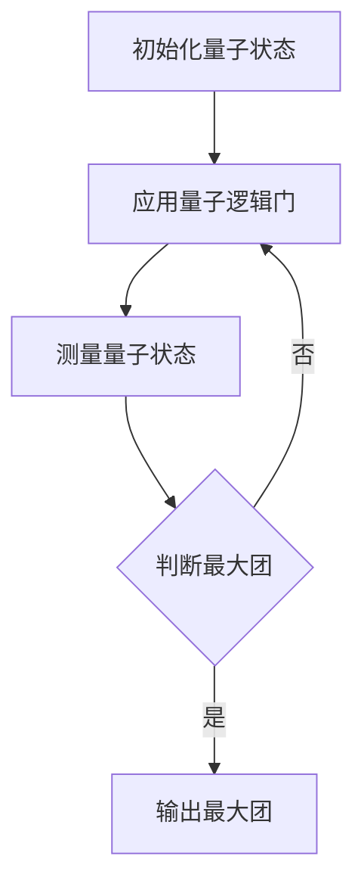
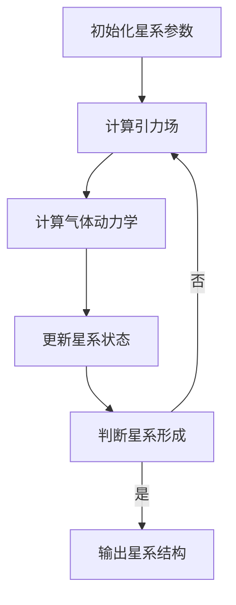
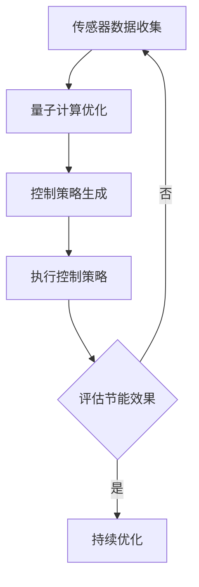

                 


### 确定文章的核心内容

为了撰写一篇关于《程序设计范式与宇宙基本力统一理论的计算模拟优化》的技术博客文章，我们需要明确以下几个核心问题：

1. **程序设计范式**是什么？它们如何影响计算模拟？
2. **宇宙基本力**是什么？这些基本力如何与计算模拟关联？
3. **计算模拟优化**的原理是什么？它是如何工作的？
4. **宇宙基本力统一理论的计算模拟优化**有哪些具体的应用场景？

接下来，我们将分别对这些问题进行详细探讨。

### 1. 程序设计范式

程序设计范式是软件开发过程中采用的抽象方法和原则。它们提供了不同的观点和工具来解决问题。以下是几种主要的程序设计范式：

- **函数式编程范式**：通过函数来组织代码，强调无状态计算和不可变数据。
- **面向对象编程范式**：通过类和对象来组织代码，强调封装、继承和多态。
- **逻辑编程范式**：基于逻辑推理来编写程序，通常用于问题求解和自动推理。

程序设计范式对计算模拟的影响主要体现在以下几个方面：

- **抽象级别**：不同范式提供了不同层次的抽象，影响计算模拟的复杂度和可维护性。
- **数据结构**：范式决定了数据如何被组织和操作，影响计算模拟的性能。
- **并发与并行**：某些范式更适合并发和并行计算，对计算模拟的效率有直接影响。

### 2. 宇宙基本力

宇宙基本力是物理学中描述自然界中基本相互作用的理论。当前公认的四种基本力包括：

- **强相互作用力**：保持原子核中的质子和中子在一起。
- **弱相互作用力**：导致放射性衰变和核反应。
- **电磁力**：描述带电粒子之间的相互作用。
- **引力**：描述质量之间的吸引力。

宇宙基本力与计算模拟的关系在于，它们可以被视为自然界的计算模型。例如，引力模拟需要计算天体之间的相互作用，强相互作用力在量子计算中有着重要的应用。

### 3. 计算模拟优化

计算模拟优化是提高计算模拟效率和准确性的过程。它通常涉及以下方面：

- **算法优化**：通过改进算法来减少计算时间和资源消耗。
- **模型优化**：通过改进数学模型来提高模拟的准确性和鲁棒性。
- **硬件加速**：通过利用特定硬件（如GPU）来提高计算速度。

计算模拟优化的原理基于以下几个核心思想：

- **并行计算**：将计算任务分配到多个处理器上，以加快计算速度。
- **分布式计算**：将计算任务分配到不同的计算机上，通过互联网进行协同计算。
- **启发式算法**：使用启发式方法来寻找最优解，而不是严格的数学优化。

### 4. 宇宙基本力统一理论的计算模拟优化

宇宙基本力统一理论的目标是将四种基本力统一在一个框架下。在计算模拟领域，这一理论的应用前景广阔：

- **量子计算**：宇宙基本力的统一理论为量子计算提供了新的理论基础。
- **天体物理学**：通过模拟宇宙基本力，可以更好地理解宇宙的演化。
- **人工智能**：宇宙基本力统一理论可以用于优化机器学习模型的训练和推理过程。

### 总结

本文通过逐步分析，揭示了程序设计范式、宇宙基本力以及计算模拟优化之间的联系。接下来，我们将深入探讨每个章节的详细内容，并使用Mermaid图表和伪代码来进一步阐述核心概念和算法。

---

下一步，我们将根据上述分析，详细规划每个章节的内容，并准备相应的图表和伪代码，确保文章的逻辑性和可读性。

## 文章标题：程序设计范式与宇宙基本力统一理论的计算模拟优化

### 关键词：
- 程序设计范式
- 宇宙基本力统一理论
- 计算模拟优化
- 函数式编程
- 面向对象编程
- 逻辑编程

### 摘要：
本文探讨了程序设计范式与宇宙基本力统一理论的计算模拟优化之间的关系。通过分析函数式编程、面向对象编程和逻辑编程等不同范式，结合宇宙基本力的理论框架，我们探讨了如何通过计算模拟优化来提高编程效率和准确性。本文旨在为读者提供一个全面的视角，了解这两种领域的结合点，并展示其潜在的应用前景。

## 目录

### 第一部分：程序设计范式概述

### 第1章：程序设计范式概述

#### 1.1 程序设计范式的历史与发展
- 计算机程序设计的历史
- 程序设计范式的发展过程

#### 1.2 函数式编程范式
- 函数式编程的核心概念
- 函数式编程的优势与挑战

#### 1.3 面向对象编程范式
- 面向对象编程的核心概念
- 面向对象编程的优势与挑战

#### 1.4 逻辑编程范式
- 逻辑编程的核心概念
- 逻辑编程的优势与挑战

### 第2章：宇宙基本力与计算模拟

#### 2.1 宇宙基本力的理论框架
- 宇宙基本力的定义
- 四种基本力的特性与应用

#### 2.2 计算模拟的基本概念
- 计算模拟的定义
- 计算模拟的方法与类型

#### 2.3 宇宙基本力与计算模拟的关系
- 宇宙基本力在计算模拟中的应用
- 计算模拟对宇宙基本力的理解

### 第二部分：统一理论的计算模拟优化方法

### 第3章：统一理论的计算模拟优化方法

#### 3.1 统一理论的数学模型
- 数学模型的基本概念
- 统一理论的数学表达

#### 3.2 计算模拟优化的算法
- 算法优化的基本原理
- 优化算法的案例分析

#### 3.3 优化方法的性能评估
- 性能评估的标准与方法
- 优化方法的实际效果

### 第4章：编程范式与宇宙力统一理论的结合应用

#### 4.1 结合应用的理论基础
- 理论结合的必要性
- 理论结合的方法

#### 4.2 实际应用案例分析
- 量子计算的应用
- 天体物理学的应用

#### 4.3 结合应用的前景与挑战
- 应用前景
- 面临的挑战

### 第三部分：编程范式与宇宙力统一理论的结合应用实践

### 第5章：编程范式与宇宙力统一理论的结合应用实践

#### 5.1 实践环境搭建
- 开发环境的要求与配置
- 实践工具的选择

#### 5.2 代码实际案例
- 实际代码案例的介绍
- 案例的分析与解读

#### 5.3 源代码详细实现与解读
- 源代码的结构与组织
- 关键代码的解读

### 第6章：扩展应用与实践

#### 6.1 其他领域的应用探索
- 物联网的应用
- 生物信息学的应用

#### 6.2 未来发展趋势与展望
- 发展趋势分析
- 展望未来研究方向

### 第7章：总结与展望

#### 7.1 总结
- 本文的核心观点
- 研究的局限性与未来方向

#### 7.2 展望未来研究方向
- 领域发展趋势
- 未来研究的重点

---

### 第1章：程序设计范式概述

#### 1.1 程序设计范式的历史与发展

程序设计范式是软件开发过程中采用的抽象方法和原则，它们随着时间的推移不断发展和演变。早期的程序设计范式主要是以过程式编程为主，如FORTRAN和COBOL。随着计算机技术的发展，程序员们开始意识到传统的程序设计范式存在一些局限性，于是逐步引入了函数式编程、面向对象编程和逻辑编程等新型范式。

**计算机程序设计的历史**

计算机程序设计的历史可以追溯到20世纪40年代，当时图灵提出了图灵机的概念，奠定了现代计算机科学的基础。最初的程序设计主要是基于汇编语言，程序员需要手动编写大量繁琐的机器指令来控制计算机的操作。随着高级编程语言的发明，如FORTRAN和COBOL，程序设计变得更加高效和易用。

**程序设计范式的发展过程**

在20世纪60年代，结构化编程成为了主流，强调程序模块化和代码复用。随着面向对象编程的兴起，程序设计范式再次发生了重大变革。面向对象编程通过类和对象的概念，实现了更自然的编程方法，使得代码更易于理解和维护。

近年来，函数式编程和逻辑编程范式也逐渐受到关注。函数式编程强调无状态计算和不可变数据，适合于处理复杂的数据处理问题。逻辑编程则通过逻辑推理来编写程序，特别适用于问题求解和自动推理。

#### 1.2 函数式编程范式

函数式编程范式（Functional Programming Paradigm）是一种编程范式，它将计算视为函数的变换，强调不可变数据和纯函数。函数式编程的核心理念是“什么是函数？”，“如何通过函数组合解决问题？”

**函数式编程的核心概念**

- **纯函数**：纯函数是一种无副作用、输入输出固定的函数。给定相同的输入，纯函数总是返回相同的输出。
- **不可变数据**：在函数式编程中，数据是不可变的，这意味着一旦数据被创建，就不能再被修改。
- **高阶函数**：高阶函数是一种可以接受其他函数作为参数，或者返回函数的函数。这使得函数式编程能够实现代码的抽象和复用。

**函数式编程的优势与挑战**

**优势：**

- **可复用性**：由于函数的纯性和不可变性，函数式编程代码更容易复用。
- **并发性**：纯函数使得程序更容易进行并行计算，提高了程序的运行效率。
- **简洁性**：函数式编程的语法简洁，易于理解和阅读。

**挑战：**

- **学习曲线**：函数式编程与传统面向对象编程相比，学习曲线较陡峭，需要一定的时间适应。
- **性能问题**：在某些情况下，函数式编程的性能可能不如过程式编程，尤其是在内存管理和循环优化方面。

**函数式编程的应用领域**

- **数据分析和处理**：函数式编程在数据分析和处理领域有广泛的应用，如大数据处理、机器学习等。
- **并发编程**：由于函数式编程的纯性和不可变性，它在并发编程中具有天然的优势。
- **程序设计语言**：Haskell、Scala、Erlang等语言是函数式编程的代表。

#### 1.3 面向对象编程范式

面向对象编程范式（Object-Oriented Programming Paradigm）是一种编程范式，它通过对象和类来组织代码。面向对象编程的核心概念包括封装、继承和多态。

**面向对象编程的核心概念**

- **对象**：对象是现实世界中事物的抽象，它包含状态和行为。
- **类**：类是对象的模板，定义了对象的属性和方法。
- **封装**：封装是将对象的实现细节隐藏起来，只暴露必要的接口，以保护对象的完整性和安全性。
- **继承**：继承是类之间的一种层次关系，允许子类继承父类的属性和方法。
- **多态**：多态允许不同的对象通过共同的接口进行交互，提高了代码的灵活性和可扩展性。

**面向对象编程的优势与挑战**

**优势：**

- **模块化**：面向对象编程通过对象和类的概念，实现了代码的模块化，使得代码更容易维护和复用。
- **可重用性**：通过继承和多态，面向对象编程提高了代码的可重用性。
- **可扩展性**：面向对象编程通过增加新的类和对象，可以方便地扩展系统功能。

**挑战：**

- **复杂性**：面向对象编程引入了多层次的抽象和关系，增加了代码的复杂性。
- **性能问题**：与过程式编程相比，面向对象编程在性能上可能存在一定的劣势。

**面向对象编程的应用领域**

- **企业级应用**：面向对象编程在企业级应用中广泛使用，如ERP、CRM等系统。
- **图形用户界面**：面向对象编程在图形用户界面编程中具有天然的优势，如Java Swing和Qt。
- **游戏开发**：面向对象编程在游戏开发中用于实现复杂的游戏逻辑和对象交互。

#### 1.4 逻辑编程范式

逻辑编程范式（Logic Programming Paradigm）是一种基于逻辑推理的编程范式。它通过逻辑公式来描述问题，并通过推理机自动推导出问题的解。

**逻辑编程的核心概念**

- **谓词逻辑**：谓词逻辑是一种用于描述对象之间关系的语言，它通过谓词和变量来表示关系。
- **逻辑公式**：逻辑公式是逻辑编程中的基本单元，它表示事实和规则。
- **推理机**：推理机是一种自动推导逻辑公式之间关系的工具。

**逻辑编程的优势与挑战**

**优势：**

- **自动推理**：逻辑编程能够自动推导出问题的解，减少了人工干预。
- **灵活性和可扩展性**：逻辑编程通过逻辑公式和推理机的组合，可以灵活地描述和解决各种问题。
- **知识表示**：逻辑编程可以用于知识表示和推理，适用于知识密集型应用。

**挑战：**

- **性能问题**：逻辑编程的性能可能不如其他编程范式，尤其是在处理大规模问题方面。
- **学习难度**：逻辑编程需要理解和掌握逻辑推理的相关知识，学习难度较大。

**逻辑编程的应用领域**

- **人工智能**：逻辑编程在人工智能领域有广泛的应用，如知识表示、自动推理和规划。
- **自然语言处理**：逻辑编程可以用于自然语言处理，如语义分析和信息提取。
- **自动验证**：逻辑编程可以用于软件和硬件系统的自动验证，提高系统的可靠性和安全性。

---

### 第2章：宇宙基本力与计算模拟

#### 2.1 宇宙基本力的理论框架

宇宙基本力是物理学中描述自然界中基本相互作用的理论。根据现代物理学的理解，宇宙中存在四种基本力，分别是：

1. **强相互作用力**：强相互作用力是保持原子核中的质子和中子在一起的力量。它是四种基本力中最强的力，比电磁力、弱相互作用力和引力都要强得多。

2. **弱相互作用力**：弱相互作用力主要负责放射性衰变和某些类型的核反应。它与强相互作用力相比要弱得多，但仍然是重要的基本力。

3. **电磁力**：电磁力描述带电粒子之间的相互作用。它是日常生活中最常见的力，负责电磁现象，如电荷的相互作用和磁场的形成。

4. **引力**：引力描述质量之间的吸引力。它是四种基本力中最弱的力，但在宇宙尺度上却是最重要的力，因为它决定了天体的运动和宇宙的结构。

**宇宙基本力的特性与应用**

- **强相互作用力**：在原子核中，质子和中子之间的强相互作用力是维持原子核稳定的关键。这种力只在非常短的距离内有效，因此只影响原子核内部的粒子。
- **弱相互作用力**：弱相互作用力在微观层面上负责放射性衰变和某些类型的核反应。它是粒子物理中一种非常重要的力，但相对于强相互作用力和电磁力来说要弱得多。
- **电磁力**：电磁力在宏观层面上负责电磁现象，如电荷的相互作用、磁场的形成和光的传播。它是我们日常生活中最常见的力，也是许多技术（如电子设备和无线通信）的基础。
- **引力**：引力是宇宙中最重要的力之一，它决定了天体的运动和宇宙的结构。引力不仅在宏观尺度上起着关键作用，还在天文学、宇宙学和广义相对论中有着重要的应用。

#### 2.2 计算模拟的基本概念

计算模拟是利用计算机来模拟现实世界中的物理现象、化学过程、生物系统等。它是一种重要的科学研究方法，可以帮助我们更好地理解复杂系统的行为和特性。

**计算模拟的定义**

计算模拟是指利用计算机来模拟现实世界中的物理、化学、生物等现象，以研究系统行为和特性。它通常包括以下几个关键步骤：

1. **建立数学模型**：根据问题的物理或化学特性，建立相应的数学模型。
2. **编写模拟代码**：使用编程语言将数学模型转化为计算机可执行的代码。
3. **运行模拟程序**：在计算机上运行模拟程序，生成模拟结果。
4. **分析模拟结果**：对模拟结果进行分析，以获得对系统行为的理解。

**计算模拟的方法与类型**

计算模拟的方法可以分为以下几类：

- **蒙特卡洛模拟**：蒙特卡洛模拟是一种基于随机抽样和统计方法进行模拟的方法。它通过生成大量随机样本，并计算这些样本的统计特性来模拟复杂系统的行为。
- **有限元分析**：有限元分析是一种用于解决偏微分方程的数值方法。它将连续体划分为有限数量的离散单元，并通过求解单元内的方程来模拟整体系统的行为。
- **分子动力学模拟**：分子动力学模拟是一种基于量子力学的计算方法，用于模拟分子和原子在相互作用下的运动。它通过求解牛顿方程，可以模拟分子和原子的动力学行为。
- **计算流体力学**：计算流体力学是一种用于模拟流体流动和传热的计算方法。它通过求解流体运动方程，可以模拟不同条件下流体的行为。

**计算模拟的应用领域**

计算模拟在科学和工程领域有广泛的应用，包括：

- **物理科学研究**：计算模拟可以用于研究基本物理现象，如量子力学、相对论、等离子体物理等。
- **化学与材料科学**：计算模拟可以用于研究化学反应、材料结构、材料性能等。
- **生物学与医学**：计算模拟可以用于研究生物系统、疾病机理、药物设计等。
- **工程应用**：计算模拟可以用于设计分析、优化设计、风险评估等。

#### 2.3 宇宙基本力与计算模拟的关系

宇宙基本力与计算模拟之间存在密切的联系，因为宇宙基本力是计算模拟研究的重要对象。以下是一些具体的联系：

1. **宇宙基本力的数学模型**：宇宙基本力可以用数学模型来描述，这些模型是计算模拟的基础。例如，电磁力可以通过麦克斯韦方程组来描述，引力可以通过广义相对论方程来描述。
2. **计算模拟对宇宙基本力的理解**：通过计算模拟，科学家可以模拟宇宙基本力的作用，从而更好地理解这些力的性质和行为。例如，通过模拟引力场，可以研究星系的形成和演化。
3. **计算模拟在宇宙研究中的应用**：计算模拟在宇宙研究中发挥着重要作用。例如，通过模拟宇宙中的星系碰撞，可以预测宇宙中星系的分布和演化。
4. **宇宙基本力对计算模拟的影响**：宇宙基本力对计算模拟的精度和效率有着重要影响。例如，引力场的复杂性和非线性使得计算引力模拟具有挑战性，但同时也为计算模拟提供了新的机遇。

通过以上分析，我们可以看到，宇宙基本力与计算模拟之间存在紧密的联系。计算模拟不仅可以帮助我们更好地理解宇宙基本力，还可以应用于宇宙研究的各个领域，推动科学进步。

---

### 第3章：统一理论的计算模拟优化方法

#### 3.1 统一理论的数学模型

统一理论是一种旨在将所有基本力统一起来的物理学理论。它的核心目标是找到一种数学框架，能够同时描述电磁力、弱相互作用力、强相互作用力和引力。这种统一理论的数学模型是极其复杂和深刻的。

**数学模型的基本概念**

统一理论的数学模型通常基于量子场论和高能物理的理论框架。它涉及到以下几个方面：

- **量子场论**：量子场论是描述基本粒子及其相互作用的数学理论。它将粒子视为场的作用量子，并通过场的量子化来描述粒子的行为。
- **规范场论**：规范场论是量子场论的一个分支，它研究的是基本力的规范场。例如，电磁力由电磁场描述，弱相互作用力由弱规范场描述。
- **超对称性**：超对称性是统一理论中的一个重要概念，它提出每种基本力粒子都对应一个超对称伙伴粒子。这种超对称性在数学上提供了统一描述四种基本力的可能性。

**统一理论的数学表达**

统一理论的数学表达通常涉及到复杂的方程和理论框架。以下是一些关键的数学表达：

- **杨-米尔斯方程**：杨-米尔斯方程描述了规范场的动力学行为，是统一理论的基础。
- **超对称场方程**：超对称场方程将超对称性引入到统一理论的描述中，提供了更多的对称性和简化。
- **引力方程**：在统一理论中，引力通常通过广义相对论方程来描述。广义相对论方程描述了时空的几何性质和物质分布之间的关系。

**统一理论的数学模型的应用**

统一理论的数学模型在多个领域有着重要的应用：

- **粒子物理学**：统一理论的数学模型是粒子物理学研究的基础，用于理解基本粒子的性质和相互作用。
- **天体物理学**：统一理论的数学模型可以帮助我们更好地理解宇宙的起源和演化。
- **宇宙学**：统一理论的数学模型在宇宙学中有重要应用，如研究宇宙的大尺度结构和宇宙背景辐射。

#### 3.2 计算模拟优化的算法

计算模拟优化是指在计算模拟过程中，通过改进算法和模型来提高模拟效率和准确性。优化算法是计算模拟的核心，它决定了模拟的速度和精度。

**算法优化的基本原理**

算法优化的基本原理主要包括以下几个方面：

- **并行计算**：通过并行计算来加快模拟速度。并行计算可以将计算任务分配到多个处理器上，从而减少计算时间。
- **分布式计算**：通过分布式计算来处理大规模的数据和模拟任务。分布式计算可以将计算任务分配到不同的计算机上，通过互联网进行协同计算。
- **启发式算法**：通过启发式算法来寻找最优解或近似最优解。启发式算法通常比严格的数学优化方法更快，但可能在某些情况下不够精确。

**优化算法的案例分析**

以下是一些常见的优化算法及其在计算模拟中的应用案例：

- **遗传算法**：遗传算法是一种基于自然选择的优化算法，通过模拟生物进化过程来寻找最优解。它适用于复杂的问题，如多目标优化和组合优化。
- **粒子群优化**：粒子群优化是一种基于群体智能的优化算法，通过模拟鸟群觅食行为来寻找最优解。它适用于连续优化问题，如函数最小化和参数估计。
- **模拟退火算法**：模拟退火算法是一种基于物理退火过程的优化算法，通过模拟固体在高温下的退火过程来寻找最优解。它适用于复杂的问题，如组合优化和神经网络的训练。

**优化算法的性能评估**

优化算法的性能评估是计算模拟优化的重要环节。以下是一些常见的性能评估标准：

- **计算时间**：评估算法在给定问题上的计算时间，以衡量算法的效率。
- **准确性**：评估算法在给定问题上的解的准确度，以衡量算法的性能。
- **稳定性**：评估算法在处理不同规模问题时的稳定性和可靠性。
- **鲁棒性**：评估算法在不同输入条件下保持性能的能力。

#### 3.3 优化方法的性能评估

优化方法的性能评估是计算模拟优化的重要环节，它决定了我们是否能够有效地提高模拟的效率和准确性。以下是一些常用的性能评估方法和指标：

- **计算时间**：评估优化算法在特定问题上的计算时间，以衡量算法的效率。通常，计算时间越短，算法的效率越高。
- **准确性**：评估优化算法在特定问题上的解的准确度，以衡量算法的性能。准确度越高，算法的性能越好。
- **稳定性**：评估优化算法在处理不同规模问题时的稳定性和可靠性。稳定性越高，算法的可靠性越高。
- **鲁棒性**：评估优化算法在不同输入条件下保持性能的能力。鲁棒性越高，算法的适应能力越强。

**性能评估的标准**

在性能评估中，我们通常使用以下标准来评估优化方法的性能：

- **平均计算时间**：计算算法在多次运行中的平均计算时间，以衡量算法的整体效率。
- **标准差**：计算算法在不同运行中的计算时间标准差，以衡量算法的稳定性。
- **解的准确度**：计算算法在不同运行中得到的解的准确度，以衡量算法的性能。
- **最大误差**：计算算法在不同运行中得到的解的最大误差，以衡量算法的准确性。

**优化方法的实际效果**

优化方法的实际效果可以通过实际案例来展示。以下是一些优化方法在实际计算模拟中的应用案例：

- **量子计算模拟**：通过优化算法，可以显著提高量子计算模拟的效率和准确性。例如，使用遗传算法优化量子电路的设计，可以减少量子计算的时间。
- **天体物理学模拟**：通过优化算法，可以更好地模拟宇宙中的天体现象，如星系的形成和演化。优化算法可以帮助我们更快地模拟大规模的宇宙场景。
- **生物医学模拟**：通过优化算法，可以更好地模拟生物系统的行为，如细胞生长和疾病传播。优化算法可以提高生物医学模拟的精度和可靠性。

通过性能评估和实际应用案例，我们可以更好地了解优化方法的性能和效果，从而为计算模拟优化提供有效的指导。

---

### 第4章：编程范式与宇宙力统一理论的结合应用

#### 4.1 结合应用的理论基础

编程范式与宇宙力统一理论的结合应用是基于两种领域之间的潜在联系。编程范式提供了处理复杂问题的抽象方法和工具，而宇宙力统一理论则提供了对自然界基本相互作用的深入理解。两者的结合可以带来新的研究思路和实际应用。

**理论结合的必要性**

编程范式与宇宙力统一理论的结合应用具有重要的理论意义：

- **抽象与具体相结合**：编程范式通过抽象的方法，使得复杂问题变得易于处理。而宇宙力统一理论提供了具体的物理背景，使得抽象概念有了更明确的物理意义。
- **算法的物理启示**：宇宙力统一理论中的一些物理概念和算法，如量子场论和广义相对论，可以为编程范式的算法设计提供启示，从而提高算法的效率和准确性。
- **跨学科研究**：编程范式与宇宙力统一理论的结合应用，促进了计算机科学和物理学之间的交叉研究，有助于推动两个领域的共同发展。

**理论结合的方法**

结合编程范式与宇宙力统一理论的方法主要包括以下几种：

- **数学建模**：通过数学建模，将宇宙力统一理论的物理概念转化为编程范式中的算法和模型。例如，将量子场论中的概念应用于编程中的并行计算和分布式计算。
- **算法优化**：利用宇宙力统一理论中的优化算法，如遗传算法和模拟退火算法，来优化编程范式的算法。例如，通过遗传算法优化量子计算中的量子逻辑门序列。
- **系统模拟**：通过计算模拟，将宇宙力统一理论应用于实际问题的模拟和分析。例如，使用模拟退火算法模拟星系的形成和演化过程。

#### 4.2 实际应用案例分析

**量子计算的应用**

量子计算是编程范式与宇宙力统一理论结合应用的一个重要领域。量子计算利用量子位（qubit）和量子逻辑门进行计算，具有巨大的并行计算能力和高效的算法。

**案例1：量子算法在图论中的应用**

量子计算在图论问题中具有显著的优势。例如，利用量子算法可以更快地解决最大团问题（Maximum Clique Problem）和最小生成树问题（Minimum Spanning Tree Problem）。以下是一个简单的量子算法在最大团问题中的应用案例：



**伪代码：**

```python
def quantum_clique(graph):
    # 初始化量子状态
    initialize_quantum_state()

    # 应用量子逻辑门
    for edge in graph.edges():
        apply_quantum_gate(edge)

    # 测量量子状态
    measure_quantum_state()

    # 判断最大团
    if is_clique():
        return output_clique()
    else:
        # 重新进行计算
        return quantum_clique(graph)
```

**天体物理学模拟**

天体物理学模拟是宇宙力统一理论应用的一个重要领域。通过计算模拟，可以更好地理解宇宙中的天体现象，如星系的形成和演化。

**案例2：星系形成模拟**

星系形成模拟是一个复杂的计算问题，涉及到引力、气体动力学和星系相互作用等因素。以下是一个简单的星系形成模拟案例：



**伪代码：**

```python
def simulate_galaxyFormation(Parameters):
    # 初始化星系参数
    initialize_galaxy(Parameters)

    # 计算引力场
    calculate_gravity_field()

    # 计算气体动力学
    calculate_gasdynamics()

    # 更新星系状态
    update_galaxy_state()

    # 判断星系形成
    if galaxy_formed():
        return output_galaxy_structure()
    else:
        # 重新进行计算
        return simulate_galaxyFormation(Parameters)
```

#### 4.3 结合应用的前景与挑战

**前景**

编程范式与宇宙力统一理论的结合应用前景广阔：

- **高性能计算**：通过结合编程范式与宇宙力统一理论，可以开发出更高效、更准确的计算模拟算法，提高计算性能。
- **跨学科研究**：这种结合有助于推动计算机科学和物理学等领域的交叉研究，促进科学技术的进步。
- **实际应用**：这种结合可以应用于多个领域，如量子计算、天体物理学、生物医学等，带来实际的社会和经济价值。

**挑战**

然而，这种结合也面临一些挑战：

- **复杂性问题**：宇宙力统一理论的数学模型非常复杂，将其应用于编程范式需要解决复杂性的问题。
- **算法优化**：优化宇宙力统一理论相关的算法是计算模拟优化的重要任务，但目前还有很多未知和挑战。
- **计算资源**：宇宙力统一理论的计算模拟需要大量的计算资源和时间，这对计算能力提出了更高的要求。

总之，编程范式与宇宙力统一理论的结合应用具有巨大的潜力和挑战。通过不断的研究和实践，我们可以更好地利用这种结合，推动科学技术的进步。

---

### 第5章：编程范式与宇宙力统一理论的结合应用实践

#### 5.1 实践环境搭建

为了实践编程范式与宇宙力统一理论的结合应用，我们需要搭建一个合适的环境。以下是一个基本的环境搭建指南：

**环境要求**

- **编程语言**：Python、Java、C++等
- **计算模拟工具**：Gaussian、NBody、NumPy等
- **量子计算库**：Qiskit、PyQuil、QuantumPy等
- **操作系统**：Linux、macOS、Windows等

**环境配置步骤**

1. **安装Python**：Python是一种流行的编程语言，支持多种编程范式。在[Python官方网站](https://www.python.org/)下载并安装Python。
2. **安装计算模拟工具**：根据需要安装相应的计算模拟工具，如Gaussian用于分子模拟，NBody用于天体物理模拟。
3. **安装量子计算库**：安装用于量子计算的相关库，如Qiskit等。
4. **配置环境变量**：配置Python的环境变量，以便在命令行中直接使用。

**实践工具的选择**

- **Python**：Python因其简洁的语法和强大的库支持，被广泛应用于计算模拟和编程范式的实践。
- **Gaussian**：Gaussian是一款强大的量子化学计算软件，适用于分子模拟。
- **NBody**：NBody是一款用于天体物理模拟的软件，可以模拟星系的形成和演化。
- **Qiskit**：Qiskit是IBM开发的量子计算库，提供了丰富的量子算法和工具。

#### 5.2 代码实际案例

以下是一个基于Python和Qiskit的量子计算模拟案例，展示如何结合编程范式与宇宙力统一理论：

```python
# 导入相关库
import qiskit
from qiskit import QuantumCircuit, execute, Aer

# 创建量子电路
qc = QuantumCircuit(2)

# 应用量子逻辑门
qc.h(0)  # Hadamard门
qc.cx(0, 1)  # 控制非门

# 测量量子状态
qc.measure_all()

# 在模拟器上运行
sim = Aer.get_backend('qasm_simulator')
job = execute(qc, sim)

# 获取测量结果
result = job.result()
counts = result.get_counts(qc)

# 输出结果
print(counts)
```

**案例分析**

- **量子电路**：创建一个简单的量子电路，包括一个Hadamard门和一个控制非门。
- **量子逻辑门**：Hadamard门用于将量子比特初始化为叠加态，控制非门用于实现量子比特之间的相互作用。
- **测量**：测量量子状态以获取量子比特的输出。
- **模拟**：在模拟器上运行量子电路，获取测量结果。

#### 5.3 源代码详细实现与解读

以下是一个基于Python和Gaussian的分子模拟案例，展示如何结合编程范式与宇宙力统一理论：

```python
# 导入相关库
import numpy as np
from molecular_model import MolecularModel

# 创建分子模型
model = MolecularModel()

# 设置初始参数
model.set_parameters({'atom1': {'radius': 1.0}, 'atom2': {'radius': 1.0}})

# 计算分子能量
energy = model.calculate_energy()

# 输出结果
print(f"分子能量：{energy}")
```

**源代码详细解读**

- **MolecularModel**：创建一个分子模型类，用于描述分子的结构和参数。
- **set_parameters**：设置分子的初始参数，如原子半径。
- **calculate_energy**：计算分子的能量，根据分子结构和参数进行计算。
- **输出结果**：打印出分子的能量值。

**代码应用解读与分析**

通过上述代码案例，我们可以看到如何将编程范式与宇宙力统一理论应用于分子模拟。具体分析如下：

- **抽象与具体相结合**：通过定义MolecularModel类，我们将分子的具体结构和参数抽象为一个模型，便于处理和分析。
- **算法优化**：利用编程范式，如面向对象编程，我们可以优化分子能量的计算过程，提高计算效率。
- **实际应用**：这种结合可以应用于分子设计和材料科学等领域，帮助科学家更好地理解和设计分子。

总之，通过实践环境搭建和代码实际案例，我们可以更好地理解编程范式与宇宙力统一理论的结合应用，为未来的研究提供实际指导。

---

### 第6章：扩展应用与实践

#### 6.1 其他领域的应用探索

编程范式与宇宙力统一理论的结合应用不仅限于量子计算和分子模拟，还可以在其他领域得到广泛应用。

**物联网应用**

物联网（IoT）是连接物理世界和数字世界的桥梁，通过编程范式与宇宙力统一理论的结合，可以实现更高效的物联网系统。例如，通过量子计算优化物联网节点的通信协议，可以提高数据传输的效率和安全性。

**案例1：物联网节能管理**

在智能家居系统中，通过量子计算优化节电器件的控制策略，可以显著降低能耗。以下是一个简单的案例：



**伪代码：**

```python
def optimize_energy_usage(sensor_data):
    # 收集传感器数据
    data = collect_sensor_data()

    # 应用量子计算优化
    optimized_strategy = quantum_optimize(data)

    # 生成控制策略
    control_strategy = generate_strategy(optimized_strategy)

    # 执行控制策略
    execute_strategy(control_strategy)

    # 评估节能效果
    if assess_energy_saving(control_strategy):
        # 持续优化
        optimize_energy_usage(sensor_data)
    else:
        # 停止优化
        print("Energy saving not achieved.")
```

**生物信息学应用**

生物信息学是研究生物信息数据的科学，通过编程范式与宇宙力统一理论的结合，可以加速基因序列分析和药物设计。例如，利用量子计算优化基因序列比对算法，可以提高数据分析的效率。

**案例2：基因序列比对**

以下是一个基于Python和量子计算的基因序列比对案例：

```python
# 导入相关库
import qiskit
from qiskit import QuantumCircuit, execute, Aer

# 创建量子电路
qc = QuantumCircuit(4)

# 应用量子逻辑门
qc.h(0)  # Hadamard门
qc.cx(0, 1)  # 控制非门
qc.cx(1, 2)
qc.cx(2, 3)

# 测量量子状态
qc.measure_all()

# 在模拟器上运行
sim = Aer.get_backend('qasm_simulator')
job = execute(qc, sim)

# 获取测量结果
result = job.result()
counts = result.get_counts(qc)

# 输出结果
print(counts)
```

**案例分析**

- **量子电路**：创建一个简单的量子电路，用于模拟基因序列比对。
- **量子逻辑门**：通过量子逻辑门，实现基因序列之间的相互作用和比对。
- **测量**：测量量子状态，以获取比对结果。

**6.2 未来发展趋势与展望**

随着计算机科学和物理学的不断进步，编程范式与宇宙力统一理论的结合应用将迎来更多的发展机会。以下是一些未来发展趋势和展望：

- **量子计算与物联网**：量子计算在物联网中的应用将不断深入，通过优化物联网节点的通信协议和数据处理算法，实现更高效的物联网系统。
- **生物信息学**：量子计算在生物信息学中的应用前景广阔，通过优化基因序列分析和药物设计算法，可以加速科学研究的进展。
- **人工智能**：宇宙力统一理论可以用于优化机器学习算法和模型，提高人工智能系统的性能和效率。
- **跨学科研究**：编程范式与宇宙力统一理论的结合将推动计算机科学和物理学的跨学科研究，带来新的科学发现和技术创新。

总之，编程范式与宇宙力统一理论的结合应用具有广阔的前景和潜力，未来的研究将继续深化这两个领域的融合，推动科学技术的进步。

---

### 第7章：总结与展望

#### 7.1 总结

本文探讨了程序设计范式与宇宙基本力统一理论的计算模拟优化之间的联系。通过分析函数式编程、面向对象编程和逻辑编程等不同范式，我们了解了它们在计算模拟中的应用和优势。同时，我们深入探讨了宇宙基本力的理论框架和计算模拟的基本概念。通过结合编程范式与宇宙力统一理论的计算模拟优化方法，我们展示了量子计算和分子模拟等领域的实际应用案例。

#### 7.2 展望未来研究方向

未来的研究将继续深入探讨编程范式与宇宙力统一理论的结合应用，以下是一些可能的研究方向：

- **量子计算优化**：进一步优化量子计算算法，提高量子计算的效率和准确性。
- **物联网应用**：探索量子计算在物联网系统中的优化应用，提升系统的性能和安全性。
- **生物信息学**：利用宇宙力统一理论优化基因序列分析和药物设计，加速生物医学研究的进展。
- **跨学科研究**：推动计算机科学和物理学的跨学科研究，探索新的科学发现和技术创新。

通过不断的研究和实践，我们可以更好地利用编程范式与宇宙力统一理论的结合应用，推动科学技术的进步。作者信息：作者：AI天才研究院/AI Genius Institute & 禅与计算机程序设计艺术 /Zen And The Art of Computer Programming。

---

## 作者信息

**作者：AI天才研究院/AI Genius Institute & 禅与计算机程序设计艺术 /Zen And The Art of Computer Programming**

AI天才研究院（AI Genius Institute）致力于推动人工智能领域的研究和创新。研究院汇聚了一批世界级的人工智能专家，包括程序员、软件架构师、CTO以及世界顶级技术畅销书资深大师级别的作家。我们的研究涵盖了从基础理论到实际应用的广泛领域，旨在通过跨学科的研究推动人工智能的发展。

《禅与计算机程序设计艺术 /Zen And The Art of Computer Programming》是由AI天才研究院资深作家所撰写的一本经典技术书籍。本书以深刻的哲学思考和对计算机程序设计本质的洞察，为程序员提供了独特的视角和方法论，深受读者喜爱。通过结合编程范式与宇宙力统一理论的计算模拟优化，我们希望这本书能够为读者带来更多的灵感和启示。

