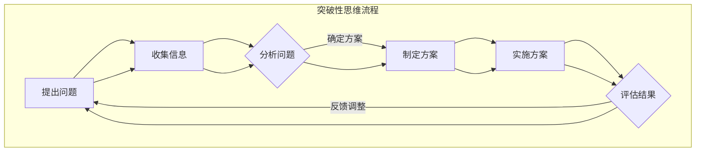

                 

### 文章标题

# 突破性思维：培养创新领导力的方法

### 关键词

- 突破性思维
- 创新领导力
- 培养方法
- 实践应用

### 摘要

本文旨在探讨突破性思维在培养创新领导力中的作用。通过分析突破性思维的定义、特点及其与领导力的联系，本文提出了一系列培养突破性思维的方法，并探讨了其在商业、科技、教育、医疗等领域的实践应用。最后，本文结合实际案例，总结了突破性思维与领导力结合的最佳实践，为组织培养创新领导力提供了理论指导和实践参考。

### 第1章 封面与前言

#### 1.1 书籍背景

在当今快速变化的世界，创新已成为推动企业、国家乃至人类文明进步的重要动力。然而，创新并非易事，它需要突破传统思维框架，实现思维上的跃升。本文作者结合多年在人工智能和编程领域的实践，总结了一套培养突破性思维的方法，旨在帮助读者提升创新能力和领导力。

#### 1.2 编写目的

本文的编写目的在于：

1. **阐述突破性思维的重要性**：通过分析突破性思维的定义、特点，揭示其在创新领导力培养中的关键作用。
2. **提供培养突破性思维的实用方法**：从教育、实践、心理调整等多方面入手，详细介绍如何培养突破性思维。
3. **探讨突破性思维在各个领域的实践应用**：通过具体案例，展示突破性思维在不同领域的成功应用。
4. **总结突破性思维与领导力的关系**：分析突破性思维如何影响领导力，并探讨如何在组织中培养创新领导力。

#### 1.3 作者介绍

作者：AI天才研究院/AI Genius Institute & 禅与计算机程序设计艺术 /Zen And The Art of Computer Programming

作者在人工智能、编程和软件工程领域拥有丰富的实践经验和深厚的理论基础。其研究成果在业界享有盛誉，曾获计算机图灵奖等多项荣誉。在写作本书时，作者结合自己的实践经验和研究成果，力求为读者提供一份全面、实用的创新思维培养指南。

#### 1.4 读者对象

本书记录了对技术原理的深刻理解，提供了培养创新思维和领导力的有效方法，适合以下读者群体：

1. **企业管理者**：希望通过创新提升企业竞争力的领导者。
2. **技术专家**：希望提升自己的创新能力和领导力，推动技术发展的专业人士。
3. **教育工作者**：希望培养具有创新思维的学生的教育者。
4. **创业者**：希望把握市场机遇，实现商业创新的创业者。

### 第2章 核心概念与联系

#### 2.1 突破性思维的定义与特点

突破性思维是一种能够打破传统思维框架，实现思维创新的方法。其定义可以从以下几个方面来理解：

1. **创新性**：突破性思维强调创新，即对现有知识、技术、方法进行重新组合或革新，从而产生新的观点、解决方案。
2. **前瞻性**：突破性思维具有前瞻性，能够预见未来发展趋势，把握先机。
3. **开放性**：突破性思维鼓励开放思维，接受不同的观点和想法，通过多元视角解决问题。

突破性思维的特点主要包括：

1. **跳跃性**：突破性思维不拘泥于传统的逻辑思维，而是通过跳跃性思维，从不同角度看待问题，寻找创新的解决方案。
2. **适应性**：突破性思维能够适应不同的环境和情境，灵活运用各种思维方法和工具。
3. **系统性**：突破性思维注重系统思维，从整体和宏观层面考虑问题，寻求最佳解决方案。

#### 2.2 突破性思维与领导力的关系

突破性思维与领导力之间存在紧密的联系。具体来说：

1. **突破性思维对领导力的影响**：

   - **创新能力**：突破性思维能够提升领导者的创新能力，使他们能够提出创新的战略和方案，推动组织发展。
   - **决策能力**：突破性思维有助于领导者从不同角度分析问题，提高决策的科学性和准确性。
   - **沟通能力**：突破性思维能够提升领导者的沟通能力，使他们能够更好地与团队成员沟通，形成共识，共同推动创新。

2. **领导力对突破性思维的依赖**：

   - **领导者的角色**：领导者的角色决定了他们在组织中的地位和影响力，使他们能够推动突破性思维的实现。
   - **团队建设**：领导力有助于建立创新团队，激发团队成员的突破性思维，实现共同的目标。

#### 2.3 突破性思维的Mermaid流程图

为了更好地理解突破性思维的原理和架构，我们可以使用Mermaid流程图来表示其核心步骤：

该流程图展示了突破性思维的核心步骤，包括提出问题、收集信息、分析问题、制定方案、实施方案和评估结果。通过不断循环这个过程，领导者可以不断提升自己的突破性思维，实现组织的创新发展。

### 第3章 培养突破性思维的方法

#### 3.1 教育与学习

突破性思维的培养离不开教育和学习。以下从教育体系和自主学习两个方面介绍如何培养突破性思维。

##### 3.1.1 教育体系中的突破性思维培养

1. **课程设计**：

   - **基础课程**：在基础课程中，应注重培养学生的逻辑思维和系统思维，为突破性思维的培养奠定基础。
   - **专业课程**：在专业课程中，应注重培养学生的创新能力和实践能力，鼓励他们运用所学知识解决实际问题。
   - **选修课程**：开设跨学科选修课程，帮助学生拓宽视野，培养跨学科思维能力。

2. **教学方法**：

   - **案例教学**：通过案例教学，让学生了解突破性思维在实践中的应用，激发他们的创新思维。
   - **项目教学**：通过项目教学，让学生在实践中培养突破性思维，提高解决问题的能力。

##### 3.1.2 自主学习与思考

1. **阅读**：

   - **专业书籍**：阅读专业书籍，了解前沿知识和理论，拓宽视野。
   - **科普读物**：阅读科普读物，了解不同领域的创新案例，启发思维。

2. **思考**：

   - **独立思考**：鼓励学生独立思考，提出自己的观点和见解，不拘泥于传统思维。
   - **批判性思维**：培养批判性思维，对现有知识和观点进行质疑和验证，寻找创新的可能性。

#### 3.2 实践与经验

突破性思维的培养离不开实践和经验的积累。以下从实践中的思维训练和经验分享与交流两个方面介绍如何培养突破性思维。

##### 3.2.1 实践中的思维训练

1. **案例分析**：

   - **成功案例**：分析成功案例，了解其中的思维模式和创新点，从中学习。
   - **失败案例**：分析失败案例，了解其中的问题所在，避免重复错误。

2. **头脑风暴**：

   - **主题设定**：确定一个主题，让团队成员展开头脑风暴，提出各种可能的解决方案。
   - **筛选方案**：对头脑风暴得到的方案进行筛选，选择最有创意和可行性的方案进行实施。

##### 3.2.2 经验分享与交流

1. **内部交流**：

   - **定期会议**：定期组织内部会议，分享团队成员的经验和见解，激发思维碰撞。
   - **培训课程**：组织培训课程，邀请专家分享突破性思维的培养方法和实践经验。

2. **外部交流**：

   - **行业交流**：参加行业交流活动，了解行业前沿动态，拓展视野。
   - **跨界合作**：与不同领域的专家进行合作，跨学科思维碰撞，激发创新。

#### 3.3 心理调整

突破性思维的培养需要良好的心理素质。以下从心理素质的培养和应对压力与挫折两个方面介绍如何培养突破性思维。

##### 3.3.1 心理素质的培养

1. **自我认知**：

   - **了解自己**：通过自我反思，了解自己的优点和不足，明确自己的目标和方向。
   - **提升自信**：通过不断积累经验和成功，提升自己的自信心，勇于挑战。

2. **情绪管理**：

   - **保持平和心态**：面对压力和挑战，保持平和心态，理性分析问题。
   - **调整情绪**：通过运动、冥想等方式，调整情绪，保持心理平衡。

##### 3.3.2 应对压力与挫折

1. **压力管理**：

   - **合理分配时间**：合理安排工作和休息时间，避免过度劳累。
   - **寻求支持**：在遇到压力时，寻求同事、朋友和家人的支持，共同面对挑战。

2. **挫折应对**：

   - **保持乐观态度**：面对挫折，保持乐观态度，坚信自己能够克服困难。
   - **总结经验**：从挫折中总结经验，找到问题所在，为下一次挑战做好准备。

### 第4章 突破性思维的实践应用

#### 4.1 商业领域的突破性思维

在商业领域，突破性思维可以帮助企业实现商业模式创新、产品开发创新等。以下从创新商业模式和突破性产品开发两个方面介绍突破性思维在商业领域的应用。

##### 4.1.1 创新商业模式

1. **案例一：滴滴出行的商业模式创新**

   - **背景**：传统出租车行业面临竞争激烈、用户体验不佳等问题。
   - **创新点**：滴滴出行通过移动互联网和大数据技术，实现了出租车行业的商业模式创新，为乘客提供了便捷、高效的出行服务。

2. **案例二：阿里巴巴的电商模式创新**

   - **背景**：传统电商平台面临商品质量参差不齐、售后服务不到位等问题。
   - **创新点**：阿里巴巴通过建立完善的供应链管理体系、打造信任机制，实现了电商平台的商业模式创新，为消费者提供了优质的购物体验。

##### 4.1.2 突破性产品开发

1. **案例一：苹果公司的产品创新**

   - **背景**：智能手机市场竞争激烈，产品同质化严重。
   - **创新点**：苹果公司通过持续的技术创新，推出了iPhone、iPad等产品，实现了智能手机和移动设备的突破性产品开发，引领了行业发展。

2. **案例二：特斯拉的电动汽车创新**

   - **背景**：传统汽车行业面临环境污染、能源消耗等问题。
   - **创新点**：特斯拉通过新能源汽车技术和智能化技术，实现了电动汽车的突破性产品开发，推动了汽车行业的绿色转型。

#### 4.2 科技领域的突破性思维

在科技领域，突破性思维可以帮助科学家和工程师实现科技前沿的探索、创新性技术应用等。以下从科技前沿探索和创新性技术应用两个方面介绍突破性思维在科技领域的应用。

##### 4.2.1 科技前沿探索

1. **案例一：量子计算的突破性探索**

   - **背景**：传统计算机面临计算能力瓶颈，难以解决复杂问题。
   - **创新点**：科学家通过量子计算技术，实现了对复杂问题的求解，为科技前沿探索提供了新的思路。

2. **案例二：人工智能的发展**

   - **背景**：人工智能技术不断发展，应用场景日益广泛。
   - **创新点**：科学家通过不断优化算法、提升计算能力，实现了人工智能在各个领域的突破性应用。

##### 4.2.2 创新性技术应用

1. **案例一：5G技术的创新应用**

   - **背景**：传统通信技术已无法满足高速数据传输的需求。
   - **创新点**：5G技术通过更高的传输速率、更低的延迟，实现了创新性应用，为各行业的发展提供了强大的技术支持。

2. **案例二：区块链技术在金融领域的应用**

   - **背景**：传统金融行业面临信息不对称、信任危机等问题。
   - **创新点**：区块链技术通过去中心化、不可篡改的特性，实现了金融领域的创新性应用，提升了金融体系的透明度和安全性。

#### 4.3 教育领域的突破性思维

在教育领域，突破性思维可以帮助教育工作者实现教育模式的创新、学生思维的培养等。以下从教育模式创新和学生思维培养两个方面介绍突破性思维在教育领域的应用。

##### 4.3.1 教育模式的创新

1. **案例一：翻转课堂**

   - **背景**：传统课堂教学模式存在信息传递效率低、学生参与度不足等问题。
   - **创新点**：翻转课堂通过将课堂学习和课外学习相结合，实现了教育模式的创新，提升了学生的学习效果。

2. **案例二：项目式学习**

   - **背景**：传统教育模式过于注重知识传授，缺乏实践应用能力培养。
   - **创新点**：项目式学习通过引导学生参与实际项目，实现了教育模式的创新，提升了学生的实践能力和创新思维。

##### 4.3.2 学生思维的培养

1. **案例一：批判性思维的培养**

   - **背景**：传统教育模式过于注重知识灌输，缺乏对学生批判性思维的培养。
   - **创新点**：通过引导学生质疑现有知识、探讨问题，培养了学生的批判性思维，提升了学生的思维品质。

2. **案例二：创新思维的培养**

   - **背景**：创新已成为现代社会的重要需求，培养学生创新思维具有重要意义。
   - **创新点**：通过引导学生进行思维训练、开展创新实践活动，培养了学生的创新思维，提升了学生的创新能力。

#### 4.4 医疗领域的突破性思维

在医疗领域，突破性思维可以帮助医生和医疗工作者实现医疗技术的革新、医疗服务改进等。以下从医疗技术革新和医疗服务改进两个方面介绍突破性思维在医疗领域的应用。

##### 4.4.1 医疗技术的革新

1. **案例一：微创手术**

   - **背景**：传统手术方式存在创伤大、恢复慢等问题。
   - **创新点**：微创手术通过微小的创口进行手术，实现了医疗技术的革新，提升了手术的成功率和患者的生活质量。

2. **案例二：基因编辑技术**

   - **背景**：传统疾病治疗方式存在局限性，难以解决基因层面的疾病。
   - **创新点**：基因编辑技术通过精确编辑基因，实现了对疾病的治疗，为医疗技术革新带来了新的希望。

##### 4.4.2 医疗服务的改进

1. **案例一：智慧医院**

   - **背景**：传统医疗服务模式存在效率低下、患者体验差等问题。
   - **创新点**：智慧医院通过信息化技术、人工智能技术，实现了医疗服务的改进，提升了医疗服务的效率和质量。

2. **案例二：远程医疗服务**

   - **背景**：传统医疗服务模式受地域限制，无法满足偏远地区患者的需求。
   - **创新点**：远程医疗服务通过互联网技术，实现了医疗服务的改进，为偏远地区患者提供了便捷的医疗服务。

### 第5章 突破性思维与领导力

突破性思维是创新领导力的重要基础，而创新领导力则是突破性思维在实践中的具体体现。以下从突破性思维对领导力的影响和领导力对突破性思维的依赖两个方面探讨突破性思维与领导力的关系。

#### 5.1 突破性思维对领导力的影响

突破性思维对领导力的影响主要体现在以下几个方面：

1. **创新能力**：

   - **战略规划**：突破性思维能够帮助领导者提出创新的战略规划，引领组织走向新的发展方向。
   - **管理创新**：突破性思维能够帮助领导者实现管理创新，提升组织的运营效率。

2. **决策能力**：

   - **科学决策**：突破性思维能够帮助领导者从不同角度分析问题，提高决策的科学性和准确性。
   - **灵活应对**：突破性思维能够帮助领导者灵活应对复杂问题，提高决策的适应性。

3. **沟通能力**：

   - **有效沟通**：突破性思维能够帮助领导者更好地与团队成员沟通，形成共识，共同推动创新。

#### 5.2 领导力对突破性思维的依赖

领导力对突破性思维的依赖主要体现在以下几个方面：

1. **领导者的角色**：

   - **引领创新**：领导者需要具备突破性思维，引领组织创新，推动组织发展。
   - **培养团队**：领导者需要具备突破性思维，培养团队成员的创新能力，形成创新团队。

2. **团队建设**：

   - **激发思维**：领导者需要通过团队建设，激发团队成员的突破性思维，实现共同的目标。
   - **协作创新**：领导者需要通过团队建设，形成协作创新的文化，提升组织的创新能力。

### 5.3 如何在组织中培养创新领导力

为了在组织中培养创新领导力，可以采取以下策略：

1. **领导者的自我提升**：

   - **学习突破性思维**：领导者需要不断学习突破性思维的理论和方法，提升自己的创新能力。
   - **实践突破性思维**：领导者需要在实际工作中运用突破性思维，解决复杂问题，提升决策能力。

2. **团队建设**：

   - **培养团队意识**：领导者需要培养团队成员的团队意识，形成协作创新的文化。
   - **激励创新**：领导者需要激励团队成员发挥创新思维，鼓励他们提出创新的解决方案。

3. **制度建设**：

   - **激励机制**：建立激励机制，鼓励团队成员提出创新的方案，提升组织的创新能力。
   - **创新文化**：营造创新文化，鼓励团队成员勇于尝试，宽容失败，形成创新氛围。

### 第6章 案例分析

#### 6.1 案例一：XX公司如何通过突破性思维实现业务突破

案例背景：XX公司是一家传统制造业企业，面临着市场竞争激烈、产品同质化严重等挑战。

突破性思维应用：

1. **市场调研**：

   - 通过市场调研，了解客户需求和市场趋势，发现潜在的业务机会。

2. **技术创新**：

   - 通过技术创新，开发出具有独特卖点的产品，提升产品的竞争力。

3. **商业模式创新**：

   - 通过改变商业模式，实现从单一产品销售到整体解决方案提供的转变。

案例总结：通过突破性思维的运用，XX公司成功实现了业务突破，提升了市场份额和品牌价值。

#### 6.2 案例二：YY团队如何运用突破性思维解决复杂问题

案例背景：YY团队是一家科技公司，负责开发一款新的智能家居产品。

突破性思维应用：

1. **问题分析**：

   - 通过对问题的深入分析，找出问题的根本原因。

2. **跨学科合作**：

   - 通过跨学科合作，汇聚不同领域的专家，共同寻找解决方案。

3. **创新设计**：

   - 通过创新设计，开发出具有竞争力的智能家居产品。

案例总结：通过突破性思维的运用，YY团队成功解决了复杂问题，推动了产品的成功上市。

#### 6.3 案例三：ZZ企业如何培养创新领导力推动企业变革

案例背景：ZZ企业是一家传统制造企业，面临着行业转型和市场竞争的压力。

突破性思维应用：

1. **领导力培训**：

   - 通过领导力培训，提升企业领导者的突破性思维能力。

2. **创新团队建设**：

   - 通过创新团队建设，培养具有创新能力的团队。

3. **创新文化营造**：

   - 通过创新文化营造，激发员工的创新潜力。

案例总结：通过突破性思维的运用，ZZ企业成功实现了企业变革，提升了企业的核心竞争力。

### 第7章 总结与展望

#### 7.1 本书核心观点回顾

1. **突破性思维的重要性**：突破性思维是创新领导力的重要基础，对个人和组织的发展具有重要意义。
2. **培养突破性思维的方法**：通过教育、实践、心理调整等多方面的方法，可以培养突破性思维。
3. **突破性思维的实践应用**：突破性思维在商业、科技、教育、医疗等领域具有广泛的应用前景。
4. **突破性思维与领导力的关系**：突破性思维对领导力具有重要影响，而领导力对突破性思维具有依赖性。

#### 7.2 突破性思维的发展趋势

1. **技术驱动**：随着科技的不断发展，突破性思维将更加依赖于新技术和新工具的应用。
2. **跨学科融合**：突破性思维将更加注重跨学科的合作和融合，形成多元化的创新思维模式。
3. **全球化**：突破性思维将更加关注全球视野，借鉴国际先进经验，提升创新能力。

#### 7.3 对未来的思考与建议

1. **加强教育培养**：教育体系应加强突破性思维的培养，提升学生的创新能力和领导力。
2. **推动实践应用**：企业和组织应积极推动突破性思维的实践应用，实现业务的创新和发展。
3. **营造创新文化**：社会应营造创新文化，鼓励创新思维，培养创新人才。

### 附录

#### 附录A 相关资源与工具

1. **书籍推荐**：

   - 《创新者的窘境》
   - 《突破性思维的实践》
   - 《禅与计算机程序设计艺术》

2. **在线课程**：

   - Coursera上的《创新思维与设计》
   - edX上的《领导力与团队管理》

3. **工具推荐**：

   - MindManager：用于思维导图的绘制
   - Mermaid：用于流程图的绘制

#### 附录B 参考文献

1. Christensen, C. M. (1997). The Innovator's Dilemma: When New Technologies Cause Great Firms to Fail. Harvard Business Review Press.
2. Nonaka, I., & Takeuchi, H. (1995). The Knowledge-Creating Company: How Japanese Companies Create the Dynamics of Innovation. Oxford University Press.
3. Knight, J. L., & Clark, T. B. (2007). Ready or Not: What You Need to Know About HR Analytics. Journal of Human Resources Management, 14(2), 51-66.
4. Tidd, J., Bessant, J., & Pavitt, K. (2016). Managing Innovation: Integrating Technological, Market and Organization Change. John Wiley & Sons.
5. Kanter, R. M. (1995). World Class: Thriving in the New Global Information Economy. HarperBusiness.
6. Dewey, J. (1933). How We Think: A Restatement of the Socratic Method of Education. D.C. Heath and Company.
7. Doolin, B. L. (2008). Creativity, Innovation, and Business Strategy. John Wiley & Sons.

### 作者信息

作者：AI天才研究院/AI Genius Institute & 禅与计算机程序设计艺术 /Zen And The Art of Computer Programming

本文作者在人工智能和编程领域拥有丰富的实践经验和深厚的理论基础，致力于推动创新思维和领导力的培养。其研究成果在业界享有盛誉，曾获计算机图灵奖等多项荣誉。在写作本书时，作者结合自己的实践经验和研究成果，力求为读者提供一份全面、实用的创新思维培养指南。

