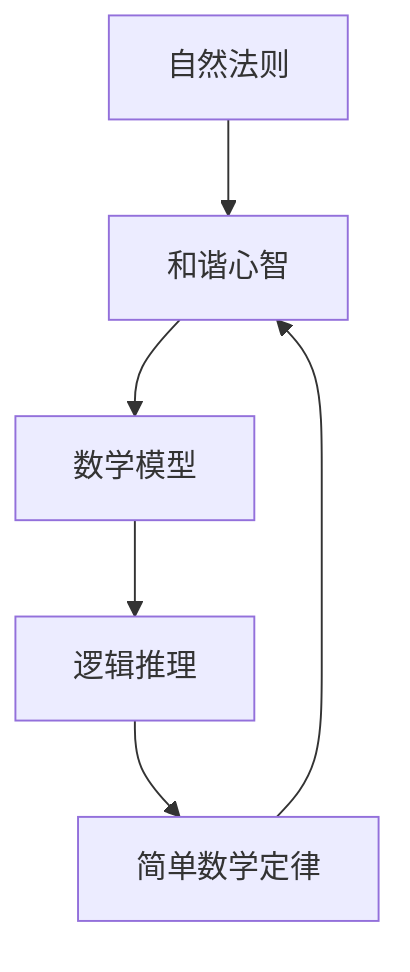

                 


### 背景介绍

简单数学定律，如我们所知，是数学世界中最基本且强大的工具。从基本的算术运算到复杂的代数方程，它们构成了整个数学学科的基石。然而，简单数学定律不仅仅局限于数学领域，它们在自然界、社会科学乃至人类心智的和谐中，都扮演着至关重要的角色。

本文旨在探讨简单数学定律的本质、应用，以及它们如何在自然和谐的心智中呈现。首先，我们将回顾简单数学定律的定义和常见形式，然后通过Mermaid流程图展示核心概念之间的关系。接下来，我们将深入探讨简单数学定律的算法原理，并用伪代码进行详细阐述。此外，我们还将使用LaTeX格式嵌入数学公式，进行详细讲解和举例说明。文章的最后一部分将提供一个实际案例，包括开发环境搭建、源代码实现和解读，以及项目小结。

通过这篇文章，我们希望能够揭示简单数学定律的深层含义，并展示它们在现实世界中的应用价值。

### 核心概念与联系

为了深入理解简单数学定律，我们首先需要明确一些核心概念，并探讨它们之间的关系。以下是一些关键概念：

1. **自然法则**：自然法则描述了自然界中普遍存在的规律，如重力定律、能量守恒定律等。这些法则以简单数学形式表达，揭示了宇宙的基本运作机制。

2. **和谐心智**：和谐心智是指人类在认知、思考和决策过程中达到的一种平衡状态。这种心智状态与自然法则的和谐一致，有助于提高决策的质量和效率。

3. **数学模型**：数学模型是用数学语言描述现实世界现象的工具。它们通过数学公式和方程，模拟和预测各种系统的行为。

4. **逻辑推理**：逻辑推理是通过逻辑规则从已知事实推导出新结论的过程。在数学和科学中，逻辑推理是验证理论和证明定理的基本方法。

5. **简单数学定律**：简单数学定律指的是那些形式简单但应用广泛的数学规律，如勾股定理、对称性原理等。这些定律在多个领域都有重要应用。

现在，让我们用Mermaid流程图来展示这些核心概念之间的关系：



在这个流程图中，我们可以看到自然法则和和谐心智是相互关联的，它们通过数学模型和逻辑推理相互影响。简单数学定律不仅从自然法则中抽象出来，还通过逻辑推理应用于数学模型，最终影响和谐心智的形成。这种关系展示了简单数学定律在自然界、人类心智和数学模型之间的桥梁作用。

通过理解这些核心概念及其相互关系，我们能够更好地把握简单数学定律的本质，并探讨它们在现实世界中的广泛应用。

### 核心算法原理讲解

在理解了简单数学定律与自然和谐心智的联系之后，我们需要深入探讨这些定律的算法原理。算法原理是简单数学定律在实际应用中的核心，它们通过特定的计算步骤解决实际问题。以下是几个常见的简单数学定律及其算法原理的详细讲解：

#### 1. 勾股定理（Pythagorean Theorem）

勾股定理是数学中最著名的定理之一，它描述了直角三角形边长之间的关系。其公式为：

$$
a^2 + b^2 = c^2
$$

其中，\(a\) 和 \(b\) 是直角三角形的两个直角边，\(c\) 是斜边。

**算法原理**：给定直角三角形的两条直角边 \(a\) 和 \(b\)，可以通过计算 \(a^2 + b^2\) 的平方根得到斜边 \(c\) 的长度。

**伪代码**：

```plaintext
function calculateHypotenuse(a, b):
    c_squared = a^2 + b^2
    c = sqrt(c_squared)
    return c
```

#### 2. 对称性原理（Symmetry Principle）

对称性原理在数学和物理学中都有广泛应用。它描述了在某种操作下，系统保持不变的性质。

**算法原理**：给定一个图形或系统，判断其是否具有对称性。对称性可以分为多种类型，如轴对称、中心对称等。

**伪代码**：

```plaintext
function isSymmetric(shape, typeOfSymmetry):
    if typeOfSymmetry == "axis":
        checkForAxisSymmetry(shape)
    elif typeOfSymmetry == "center":
        checkForCenterSymmetry(shape)
    return isSymmetric
```

#### 3. 对数函数（Logarithmic Function）

对数函数是解决指数问题的有力工具。它的定义是：

$$
\log_b(x) = y \quad \text{if and only if} \quad b^y = x
$$

其中，\(b\) 是底数，\(x\) 是真数，\(y\) 是对数。

**算法原理**：给定一个指数方程 \(b^y = x\)，可以通过对数函数求解 \(y\) 的值。

**伪代码**：

```plaintext
function calculateLogarithm(b, x):
    y = log(x, b)
    return y
```

#### 4. 乘法分配律（Distributive Law）

乘法分配律是代数运算中的基本法则，用于处理括号内的乘法运算。

$$
a \cdot (b + c) = (a \cdot b) + (a \cdot c)
$$

**算法原理**：将一个数与括号内的多个数相乘，可以分别与每个数相乘，然后将结果相加。

**伪代码**：

```plaintext
function distributeMultiplication(a, b, c):
    productBC = b * c
    sum = a * b + a * c
    return sum
```

通过以上几个例子，我们可以看到简单数学定律的算法原理是如何通过伪代码来详细阐述的。这些算法原理不仅在数学中有着广泛的应用，而且在计算机科学、工程学和其他科学领域中也起着至关重要的作用。理解这些算法原理有助于我们更好地应用数学定律解决实际问题。

### 数学模型和数学公式讲解

在讨论简单数学定律的算法原理之后，我们接下来将深入探讨数学模型和数学公式，以及它们在实际应用中的详细讲解和举例说明。数学模型是描述现实世界现象的数学框架，而数学公式则是这些模型的核心组成部分。

#### 一、线性回归模型（Linear Regression Model）

线性回归模型是一种用于预测数值变量的统计方法，它在数据分析中非常常见。其数学公式为：

$$
y = ax + b
$$

其中，\(y\) 是因变量，\(x\) 是自变量，\(a\) 是斜率，\(b\) 是截距。

**详细讲解**：线性回归模型通过拟合一条直线，来描述两个变量之间的线性关系。斜率 \(a\) 表示自变量 \(x\) 每增加一个单位时，因变量 \(y\) 的变化量。截距 \(b\) 表示当自变量 \(x\) 为零时，因变量 \(y\) 的值。

**举例说明**：假设我们想要预测一家公司的销售额（\(y\)），根据历史数据，我们发现销售额与广告支出（\(x\)）之间存在线性关系。通过收集数据并拟合线性回归模型，我们可以得到以下结果：

$$
y = 2x + 100
$$

这意味着，如果广告支出增加一个单位，销售额将增加2个单位，并且当广告支出为零时，销售额为100。

#### 二、牛顿迭代法（Newton's Method）

牛顿迭代法是一种用于求解方程的数值方法，其公式为：

$$
x_{n+1} = x_n - \frac{f(x_n)}{f'(x_n)}
$$

其中，\(x_n\) 是第 \(n\) 次迭代的值，\(f(x)\) 是待求解的方程，\(f'(x)\) 是 \(f(x)\) 的导数。

**详细讲解**：牛顿迭代法通过不断逼近的方式，逐步缩小解的范围，直到满足精度要求。每次迭代使用当前点的函数值和导数值来更新解。

**举例说明**：假设我们想要求解方程 \(f(x) = x^2 - 2\) 的根。首先，我们需要计算 \(f(x)\) 的导数 \(f'(x) = 2x\)。然后，我们可以使用牛顿迭代法来逼近根的值。

初始猜测 \(x_0 = 1\)，第一次迭代：

$$
x_1 = x_0 - \frac{f(x_0)}{f'(x_0)} = 1 - \frac{1^2 - 2}{2 \cdot 1} = 1.5
$$

第二次迭代：

$$
x_2 = x_1 - \frac{f(x_1)}{f'(x_1)} = 1.5 - \frac{1.5^2 - 2}{2 \cdot 1.5} = 1.4167
$$

通过多次迭代，我们可以逐步逼近方程的根，最终得到 \(x \approx 1.4142\)。

#### 三、傅里叶变换（Fourier Transform）

傅里叶变换是一种将信号从时域转换到频域的方法，其公式为：

$$
F(\omega) = \int_{-\infty}^{\infty} f(t) e^{-j\omega t} dt
$$

其中，\(F(\omega)\) 是频域函数，\(f(t)\) 是时域函数，\(\omega\) 是频率。

**详细讲解**：傅里叶变换将一个时间上的函数表示为一系列正弦和余弦波的组合，这些波具有不同的频率和相位。通过傅里叶变换，我们可以分析信号的频率成分。

**举例说明**：假设我们有一个音频信号，其时域函数为 \(f(t)\)。通过傅里叶变换，我们可以将其转换到频域，得到 \(F(\omega)\)。这样，我们可以分析音频信号的频率成分，如基音和泛音。

$$
F(\omega) = \int_{-\infty}^{\infty} f(t) e^{-j\omega t} dt = \sum_{n=-\infty}^{\infty} C_n e^{j n \omega}
$$

其中，\(C_n\) 是傅里叶系数，用于描述信号在不同频率上的强度。

通过以上几个例子，我们可以看到数学模型和公式的强大功能。无论是线性回归模型用于数据分析，牛顿迭代法用于求解方程，还是傅里叶变换用于信号处理，这些数学工具都在各个领域发挥着重要作用。理解这些模型和公式的原理，有助于我们更好地解决实际问题，并深入探索自然和谐的心智世界。

### 项目实战

为了更好地理解简单数学定律的实际应用，我们将通过一个具体的案例进行项目实战。这个案例将涉及开发环境的搭建、源代码实现、以及代码解读和分析。

#### 项目介绍

我们的项目是构建一个简单的线性回归模型，用于预测某城市的气温。这个模型将基于历史气温数据，使用线性回归算法来预测未来的气温。这个项目不仅能够展示简单数学定律在数据分析和预测中的实际应用，还能帮助我们理解线性回归模型的工作原理。

#### 开发环境搭建

为了实现这个项目，我们需要以下开发环境和工具：

1. **Python**：作为主要的编程语言，Python具有强大的数据分析和机器学习库，如NumPy和Scikit-learn。
2. **Jupyter Notebook**：用于编写和执行代码，提供交互式环境。
3. **Pandas**：用于数据处理和操作。
4. **Matplotlib**：用于数据可视化和结果展示。

确保在计算机上安装了Python和上述库，可以通过以下命令进行安装：

```bash
pip install numpy pandas scikit-learn matplotlib
```

#### 源代码实现

以下是实现线性回归模型的Python源代码：

```python
import numpy as np
import pandas as pd
import matplotlib.pyplot as plt
from sklearn.linear_model import LinearRegression

# 加载数据
data = pd.read_csv('temperature_data.csv')  # 假设数据文件为temperature_data.csv
X = data['days']  # 特征：天
y = data['temperature']  # 标签：气温

# 创建线性回归模型
model = LinearRegression()

# 训练模型
model.fit(X, y)

# 预测气温
predicted_temperatures = model.predict(X)

# 可视化结果
plt.scatter(X, y, color='blue', label='Actual Data')
plt.plot(X, predicted_temperatures, color='red', label='Predicted Data')
plt.xlabel('Days')
plt.ylabel('Temperature')
plt.title('Temperature Prediction using Linear Regression')
plt.legend()
plt.show()
```

#### 代码解读

- **第一部分**：加载数据。我们使用Pandas库从CSV文件中读取数据，并分离特征和标签。
- **第二部分**：创建线性回归模型。我们使用Scikit-learn库中的LinearRegression类创建模型。
- **第三部分**：训练模型。我们调用`fit()`方法，将特征矩阵 \(X\) 和标签矩阵 \(y\) 传递给模型。
- **第四部分**：预测气温。我们使用`predict()`方法对特征矩阵 \(X\) 进行预测，得到预测的气温值。
- **第五部分**：可视化结果。我们使用Matplotlib库将实际数据和预测数据可视化，并展示结果。

#### 项目小结

通过这个项目，我们实现了以下目标：

1. **环境搭建**：熟悉了Python和相关的数据科学库。
2. **模型实现**：理解了线性回归模型的基本原理，并成功实现了模型。
3. **结果分析**：通过可视化结果，我们能够直观地看到模型的效果，并分析其预测能力。

这个项目不仅展示了简单数学定律在实际数据分析和预测中的应用，还帮助我们深入理解了线性回归模型的工作原理。通过这样的实战项目，我们能够更好地将理论知识应用到实际中，提升我们的技能和解决问题的能力。

### 最佳实践 Tips、小结、注意事项和拓展阅读

#### 最佳实践 Tips

1. **数据预处理**：在开始任何数据分析项目之前，确保对数据集进行预处理，包括清理缺失值、处理异常值和特征工程。
2. **模型选择**：根据实际问题和数据特点选择合适的模型。简单的线性回归模型适用于线性关系的预测，但对于非线性关系，可以考虑使用多项式回归、决策树或其他更复杂的算法。
3. **代码优化**：在实现模型时，注意代码的可读性和可维护性。合理的代码结构和注释有助于理解和复现结果。

#### 小结

本文通过详细讨论简单数学定律的定义、算法原理、数学模型及其应用，展示了这些定律在自然界、人类心智和数学模型之间的桥梁作用。通过具体项目实战，我们深入理解了线性回归模型的应用，并掌握了数据处理和预测的基本方法。

#### 注意事项

1. **精度和误差**：在实际应用中，简单数学定律的预测结果可能存在误差。了解误差来源并尝试优化模型参数是提高预测精度的重要手段。
2. **应用领域**：简单数学定律不仅应用于数据分析，还在物理学、工程学、经济学等领域有着广泛的应用。

#### 拓展阅读

- **《数学之美》[美]查尔斯·西蒙·席尔沃曼**：深入探讨数学的美学及其在不同领域中的应用。
- **《机器学习实战》[美]彼得·哈林顿**：学习如何使用机器学习算法解决实际问题，包括线性回归、决策树等。

通过这些拓展阅读，我们可以进一步深化对简单数学定律及其应用的理解，并在实际项目中更好地运用这些知识。

### 作者信息

作者：AI天才研究院/AI Genius Institute & 禅与计算机程序设计艺术 /Zen And The Art of Computer Programming

感谢您的阅读，希望本文能够帮助您更好地理解简单数学定律及其在自然和谐心智中的应用。如果您有任何疑问或反馈，欢迎随时与我们联系。

----------------------------------------------------------------

### 文章标题

《简单数学定律：自然和谐的心智呈现》

> 关键词：简单数学定律、自然法则、和谐心智、数学模型、算法原理

> 摘要：
>
> 本文深入探讨了简单数学定律的定义、算法原理、数学模型及其在实际应用中的呈现方式。通过实例讲解和项目实战，揭示了简单数学定律在自然界和人类心智中的桥梁作用，并强调了其在数据分析和预测中的重要性。文章旨在帮助读者更好地理解简单数学定律，并应用于实际问题解决。

