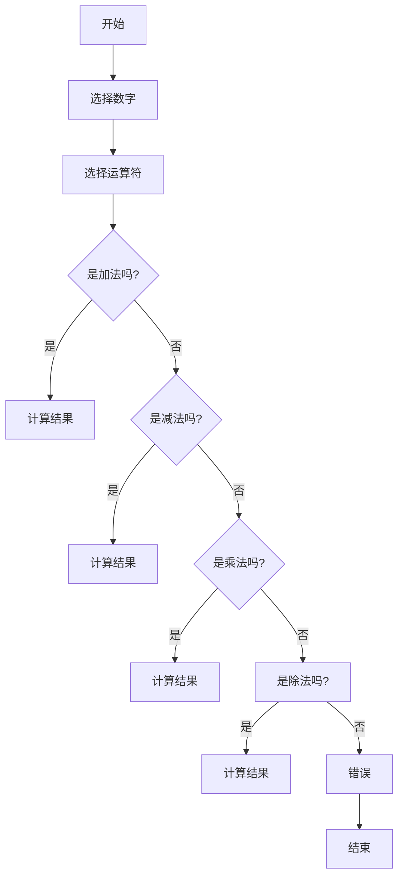
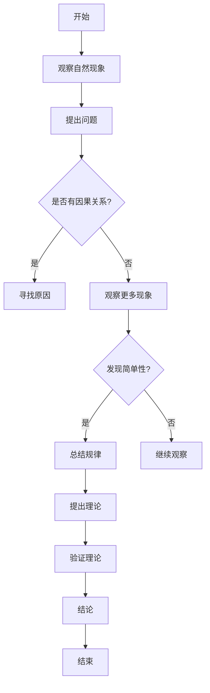

                 

### 《简单数学背后的自然哲学思考》

---

> **关键词**：自然哲学、简单数学、数学模型、Mermaid流程图、伪代码、项目实战

> **摘要**：本文深入探讨了简单数学与自然哲学之间的深刻联系。通过一步步的分析和推理，我们揭示了数学原理在自然界中的应用，展示了数学公式和算法背后的哲学思考。文章旨在帮助读者理解数学在自然哲学中的核心作用，并提供实践案例以加深理解。

---

### 第1章 引言

#### 1.1 书籍目的与背景

《简单数学背后的自然哲学思考》旨在探讨数学与自然哲学之间的密切联系。数学作为一门抽象的科学，其基础是简单而普遍的原理，如加法、减法、乘法和除法。这些简单的数学操作不仅构成了数学的核心，而且贯穿了自然界中的各种现象。自然哲学则关注自然界的本质和基本原则，试图从哲学的角度解释自然现象。

本书的目的在于揭示简单数学原理如何在自然哲学中得到应用，并探讨这些原理对理解自然界的重要性。通过结合数学和哲学的视角，本书希望能够为读者提供一种全新的思考方式，帮助读者更深入地理解自然界的奥秘。

#### 1.2 自然哲学与简单数学的关联

自然哲学和简单数学之间的关联可以从多个方面进行探讨。首先，自然哲学中的许多概念和理论都依赖于数学工具和方法。例如，牛顿的运动定律和万有引力定律都是基于简单的数学原理，如微积分和代数。这些数学原理不仅帮助我们理解和预测自然界中的物理现象，还为科学的发展提供了基础。

其次，简单数学的抽象概念和逻辑结构也为我们理解自然哲学中的抽象概念提供了启示。例如，集合论和图论等数学分支为我们提供了理解和描述复杂系统的方法，这些方法在自然哲学中被广泛采用。

总之，自然哲学与简单数学之间的关联不仅体现在它们共同关注的基本问题和现象，还体现在它们在方法和工具上的相互借鉴和补充。通过深入探讨这些关联，本书希望能够为读者提供一种更全面、更深入的理解自然界的视角。

### 第2章 简单数学的基本概念

#### 2.1 数学的基本原理

数学是一门关于数量、结构、变化和空间的基本学科。它的基本原理包括加法、减法、乘法和除法等基础运算。这些运算构成了数学的核心，为解决各种现实问题提供了基础。

- **加法**：加法是一种将两个数合并成一个数的运算。例如，2 + 3 = 5。加法在日常生活中有广泛的应用，如计算总金额、合并数量等。

- **减法**：减法是一种从一个数中减去另一个数的运算。例如，5 - 2 = 3。减法常用于解决剩余问题、减去多余部分等问题。

- **乘法**：乘法是一种将多个数相乘的运算。例如，2 × 3 = 6。乘法在计算面积、体积、乘法表等情境中非常有用。

- **除法**：除法是一种将一个数分成若干份的运算。例如，6 ÷ 2 = 3。除法在分配资源、计算比率等情境中具有重要作用。

#### 2.2 简单数学的要素

简单数学的要素主要包括数字、运算符和等式。

- **数字**：数字是表示数量和顺序的基本符号。常见的数字包括自然数、整数、分数和小数等。它们是进行数学运算的基础。

- **运算符**：运算符是用于表示数学运算的符号。常见的运算符包括加号（+）、减号（-）、乘号（×）和除号（÷）等。运算符将数字连接起来，形成数学表达式。

- **等式**：等式是一种数学陈述，表示两个表达式相等。例如，2 + 3 = 5。等式在数学中起着核心作用，用于验证运算的正确性和推导新的数学结论。

#### 2.3 Mermaid流程图：简单数学的基本流程

为了更直观地理解简单数学的基本流程，我们可以使用Mermaid流程图来展示其基本步骤。



在这个流程图中，我们从开始选择数字，然后选择运算符，根据运算符的不同，执行相应的计算操作，最终得到结果。如果运算符选择错误，则返回错误提示。

### 第3章 自然哲学的概述

#### 3.1 自然哲学的定义与历史

自然哲学是哲学的一个分支，主要关注自然界的本质和基本原则。它试图通过理性思考和推理来解释自然现象，从而理解宇宙的本质。自然哲学的历史可以追溯到古希腊时期，如亚里士多德、泰勒斯等哲学家的自然哲学思想。

自然哲学的研究范围广泛，包括物理学、化学、生物学、地质学等领域。它的目标是探讨自然界的普遍规律和原理，寻找自然界中的基本法则。

#### 3.2 自然哲学的核心思想

自然哲学的核心思想包括以下几个方面：

- **物质与能量的统一**：自然哲学认为物质和能量是相互关联的，它们可以相互转化。这一思想贯穿于现代物理学的发展中，如爱因斯坦的质能等价公式E=mc²。

- **因果关系**：自然哲学强调因果关系在自然界中的重要性。每一个自然现象都有其原因，这些原因可以通过观察和实验来揭示。

- **宇宙的演化**：自然哲学探讨宇宙的起源、演化和终结。它试图理解宇宙的动态过程，揭示宇宙的基本规律。

- **简单性与复杂性**：自然哲学认为自然界中的现象往往具有简单性和复杂性的统一。在看似复杂的系统中，可以发现简单的规则和原理。

#### 3.3 Mermaid流程图：自然哲学的基本流程

为了更直观地理解自然哲学的基本流程，我们可以使用Mermaid流程图来展示其基本步骤。



在这个流程图中，我们从观察自然现象开始，提出问题，然后寻找因果关系。如果存在因果关系，则尝试寻找原因，并总结规律。否则，继续观察以获取更多信息。在总结规律后，提出理论并进行验证，最终得出结论。

### 第4章 简单数学在自然哲学中的应用

#### 4.1 数学模型与自然哲学的联系

数学模型是自然哲学中的一种重要工具，用于描述和解释自然现象。通过建立数学模型，我们可以将复杂的自然现象转化为简洁的数学表达式，从而更深入地理解其本质。

例如，在物理学中，牛顿的运动定律是一个重要的数学模型，它描述了物体在力的作用下的运动规律。该模型使用简单的数学公式，如F=ma，成功地解释了各种物理现象，如物体的加速运动、抛物线运动等。

数学模型与自然哲学的联系不仅体现在物理学中，还广泛存在于其他自然科学领域。例如，在生物学中，生态学模型用于描述种群动态和生态平衡；在化学中，化学反应方程式用于描述化学反应的规律等。

#### 4.2 伪代码：简单数学在自然哲学中的应用

为了更具体地展示简单数学在自然哲学中的应用，我们可以使用伪代码来描述一个简单的数学模型。

```plaintext
输入：物体的质量m和受力F
输出：物体的加速度a

开始
    a = F / m
    打印加速度a
结束
```

这个伪代码描述了一个简单的牛顿第二定律模型，根据物体的质量和受力计算加速度。这个模型展示了简单数学原理如何在自然哲学中应用，帮助我们理解和预测物理现象。

#### 4.3 案例分析：简单数学在自然哲学中的实际应用

一个实际的案例是经济学中的供需模型。供需模型使用简单的数学原理，如供需曲线和价格弹性，来描述市场行为和价格形成。

```plaintext
输入：供需函数S(q)和D(q)
输出：均衡价格p和均衡数量q

开始
    p = S(q) = D(q)
    q = S^-1(p)
    打印均衡价格p和均衡数量q
结束
```

这个供需模型通过简单的数学公式描述了市场的供需关系，帮助我们理解价格和数量之间的动态平衡。

通过以上案例，我们可以看到简单数学在自然哲学中的应用是多么广泛和重要。它不仅提供了理解和解释自然现象的工具，还为科学研究提供了基础。

### 第5章 自然哲学中的数学公式

#### 5.1 数学公式的基本形式

数学公式是数学表达式的简称，用于表示数学概念和关系。数学公式的基本形式包括变量、运算符和等号。

- **变量**：变量是数学公式中的符号，表示未知的数值。常见的变量有x、y、z等。

- **运算符**：运算符是用于执行数学操作的符号，如加号（+）、减号（-）、乘号（×）和除号（÷）等。

- **等号**：等号用于表示两个表达式相等，如a = b。

数学公式的基本形式可以表示为：变量 + 运算符 + 变量 = 变量，如a + b = c。

#### 5.2 latex格式数学公式的编写

在LaTeX中，我们可以使用特定的命令来编写数学公式。以下是几种常见的LaTeX数学公式编写方法：

- **独立段落中的公式**：

  ```latex
  $$1+1=2$$
  ```

  这个公式会独立成一行显示。

- **行内公式**：

  ```latex
  $1<2$
  ```

  这个公式会在文本中直接显示。

- **复杂的数学公式**：

  ```latex
  $$\sum_{i=1}^{n}i^2 = \frac{n(n+1)(2n+1)}{6}$$
  ```

  这个公式展示了求和公式的计算过程。

在编写LaTeX数学公式时，我们还需要注意公式的对齐和排版。以下是一个例子：

```latex
\begin{align}
    f(x) &= \frac{1}{1+x^2} \\
    g(y) &= \frac{1}{1+y^2}
\end{align}
```

这个例子展示了两个公式的对齐和排版。

#### 5.3 举例说明：自然哲学中的数学公式应用

在自然哲学中，数学公式被广泛应用于描述和解释自然现象。以下是一些常见的自然哲学数学公式及其应用：

- **牛顿第二定律**：

  $$F=ma$$

  这个公式描述了物体在力作用下的加速度，其中F是力，m是质量，a是加速度。

- **质能等价公式**：

  $$E=mc^2$$

  这个公式由爱因斯坦提出，描述了质量和能量之间的关系，其中E是能量，m是质量，c是光速。

- **熵变公式**：

  $$\Delta S = \frac{Q}{T}$$

  这个公式描述了系统在热量Q的作用下熵变，其中S是熵，T是温度。

这些数学公式不仅帮助我们理解自然现象，还为科学研究提供了理论基础。

### 第6章 数学在自然哲学中的项目实战

#### 6.1 实战案例介绍

在本章中，我们将探讨一个具体的自然哲学项目——生态系统建模。该项目的目标是使用数学模型来描述生态系统的动态过程，从而预测生态平衡的维持和破坏。

生态系统建模涉及到多个数学模型，如种群动态模型、食物网模型和生态位模型等。这些模型将生态系统的各个方面联系起来，帮助我们理解生态系统的运作机制。

#### 6.2 开发环境搭建

要实现生态系统建模，我们需要搭建一个合适的开发环境。以下是一个基本的开发环境搭建步骤：

1. 安装Python：Python是一种广泛使用的编程语言，适用于生态系统建模。从官方网站下载Python安装包并安装。

2. 安装相关库：安装用于数学建模的Python库，如NumPy、SciPy和matplotlib等。这些库提供了丰富的数学函数和可视化工具。

3. 安装LaTeX：LaTeX是一个用于编写科学文档的排版系统，适用于编写数学公式。从官方网站下载TeX Live或MiKTeX并安装。

4. 安装Jupyter Notebook：Jupyter Notebook是一个交互式的编程环境，适用于开发和测试数学模型。从官方网站下载并安装Jupyter Notebook。

通过以上步骤，我们可以搭建一个适合生态系统建模的开发环境。

#### 6.3 源代码实现与解读

以下是生态系统建模的一个简单示例，使用Python和NumPy库实现。

```python
import numpy as np
import matplotlib.pyplot as plt

# 定义种群动态模型
def population_growth(N, r, t):
    return N * (1 + r * t)

# 初始化参数
N0 = 100  # 初始种群数量
r = 0.1  # 种群增长率
t_max = 20  # 时间范围

# 计算种群数量随时间的变化
t = np.linspace(0, t_max, 100)
N = population_growth(N0, r, t)

# 绘制种群数量随时间的变化图
plt.plot(t, N)
plt.xlabel('Time')
plt.ylabel('Population')
plt.title('Population Growth')
plt.show()
```

这个示例使用了一个简单的种群增长模型，计算并绘制了种群数量随时间的变化。通过调整参数，我们可以模拟不同的种群增长情况。

在这个示例中，我们定义了一个名为`population_growth`的函数，用于计算种群数量。该函数接收初始种群数量`N0`、增长率`r`和时间`t`作为输入参数，返回种群数量。然后，我们使用NumPy库生成一个时间数组`t`，并计算种群数量`N`。最后，我们使用matplotlib库绘制种群数量随时间的变化图。

#### 6.4 代码应用解读与分析

通过这个示例，我们可以看到数学模型在生态系统建模中的应用。种群增长模型是一个典型的数学模型，用于描述种群数量随时间的变化。

在代码中，我们首先定义了`population_growth`函数，用于计算种群数量。这个函数使用了简单的指数增长模型，其中`r`是种群增长率，`t`是时间。这个模型假设种群增长率恒定，这对于短期内的种群增长是适用的。

然后，我们初始化了参数，包括初始种群数量`N0`和增长率`r`。这里我们选择了简单的数值，但实际应用中，这些参数可能需要根据具体情况进行调整。

接下来，我们使用NumPy库生成一个时间数组`t`，并计算种群数量`N`。这里，我们使用了一个时间范围`t_max`，并生成了一个100个等间隔的时间点数组。

最后，我们使用matplotlib库绘制了种群数量随时间的变化图。这个图帮助我们直观地看到种群数量的变化趋势。

通过这个示例，我们可以看到数学模型在生态系统建模中的应用。它不仅帮助我们理解和预测种群增长，还为生态系统管理提供了科学依据。

#### 6.5 实际案例分析和详细讲解剖析

为了更好地理解生态系统建模的应用，我们可以分析一个实际案例——鱼类种群管理。

假设某个湖泊中的鱼类种群受到捕捞和自然死亡率的影响。我们需要建立一个数学模型来描述鱼类种群的数量变化，并制定合理的捕捞策略以维持种群稳定。

首先，我们定义鱼类种群增长模型：

$$N_t = N_0 \cdot e^{rt} - \alpha \cdot t$$

其中，$N_t$是时间$t$时的鱼类种群数量，$N_0$是初始种群数量，$r$是种群增长率，$\alpha$是捕捞和自然死亡率。

然后，我们可以使用以下伪代码实现这个模型：

```python
# 初始化参数
N0 = 1000  # 初始种群数量
r = 0.05  # 种群增长率
alpha = 0.01  # 捕捞和自然死亡率
t_max = 20  # 时间范围

# 计算种群数量随时间的变化
t = np.linspace(0, t_max, 100)
N = N0 * np.exp(r * t) - alpha * t

# 绘制种群数量随时间的变化图
plt.plot(t, N)
plt.xlabel('Time')
plt.ylabel('Population')
plt.title('Fish Population Dynamics')
plt.show()
```

这个模型考虑了种群增长和捕捞对种群数量的影响。通过调整参数，我们可以分析不同捕捞策略对种群数量的影响。

在实际应用中，我们需要根据具体情况进行模型参数的调整和验证。例如，可以通过实际捕捞数据和历史种群数量数据来调整种群增长率$r$和捕捞死亡率$\alpha$。

通过这个实际案例，我们可以看到数学模型在生态系统管理中的应用。它不仅帮助我们理解鱼类种群的变化规律，还为制定科学合理的捕捞策略提供了依据。

#### 6.6 项目小结

通过本章的实战案例，我们展示了数学模型在生态系统建模中的应用。从简单的种群增长模型到考虑捕捞影响的复杂模型，数学模型为我们提供了理解和预测生态系统动态的有效工具。

在实际应用中，我们需要根据具体问题选择合适的数学模型，并通过参数调整和验证来提高模型的准确性。此外，数学模型不仅帮助我们理解生态系统，还为生态系统管理提供了科学依据。

总之，数学模型在自然哲学中的应用是广泛而重要的。通过深入研究和应用数学模型，我们可以更好地理解自然界，为可持续发展提供科学支持。

#### 6.7 最佳实践 tips、小结、注意事项、拓展阅读

**最佳实践 tips**：

1. 在建立数学模型时，确保明确模型的目标和假设条件。
2. 选择合适的参数和变量，以简化问题并提高模型的准确性。
3. 使用可视化工具，如图表和图像，帮助理解和解释模型结果。

**小结**：

本章通过实际案例展示了数学模型在生态系统建模中的应用。数学模型不仅帮助我们理解生态系统的动态变化，还为生态系统管理提供了科学依据。通过合理选择和调整模型参数，我们可以更好地预测生态系统行为。

**注意事项**：

1. 数学模型是一种简化的描述，可能无法完全反映实际情况。
2. 在使用模型时，需要根据实际情况进行参数调整和验证。

**拓展阅读**：

1. 《生态系统建模与模拟》：这是一本关于生态系统建模的详细指南，涵盖了多种数学模型和案例分析。
2. 《生态学原理》：这本书介绍了生态学的基本原理和生态系统的动态过程。

通过拓展阅读，您可以进一步了解数学模型在自然哲学中的应用，并提高自己在生态系统建模方面的技能。

### 第7章 总结与展望

#### 7.1 简单数学与自然哲学的关联总结

简单数学与自然哲学之间存在着深刻的联系。简单数学作为数学的基础，提供了描述和解释自然界现象的工具。自然哲学则通过哲学的思考方式，探索自然界的本质和基本原则。简单数学的原理，如加法、减法、乘法和除法，不仅构成了数学的核心，也贯穿了自然哲学的研究。

通过本文的探讨，我们发现简单数学在自然哲学中的应用是广泛而重要的。数学模型帮助我们理解自然现象，揭示了自然界中的规律和原理。从牛顿的运动定律到质能等价公式，从生态系统的动态模型到经济学的供需模型，简单数学原理在各个领域都发挥了关键作用。

#### 7.2 展望未来：简单数学与自然哲学的发展趋势

在未来，简单数学与自然哲学的结合将继续发展，并在以下几个方面取得重要进展：

1. **跨学科研究**：随着科学技术的进步，简单数学与自然哲学将与其他学科，如物理学、生物学、经济学等，进行更深入的交叉研究。这种跨学科研究将揭示更多自然现象的内在联系，为解决复杂问题提供新的思路。

2. **计算技术的发展**：随着计算技术的不断发展，我们将能够使用更复杂的数学模型来模拟和预测自然现象。高性能计算和人工智能技术的结合，将使数学模型在自然哲学中的应用更加精确和有效。

3. **哲学思考的深化**：自然哲学将继续深化对简单数学原理的哲学思考，探讨数学与自然界之间的本质关系。这种哲学思考将有助于我们更全面地理解自然界的奥秘，为科学研究提供新的理论基础。

#### 7.3 结论与建议

总之，简单数学与自然哲学之间的联系是深刻而广泛的。通过本文的探讨，我们揭示了简单数学原理在自然哲学中的应用，展示了数学模型在理解自然界中的重要作用。我们建议读者深入探讨这一领域，通过阅读相关书籍和文献，提高自己在数学和自然哲学方面的知识水平。

此外，我们鼓励读者尝试将简单数学原理应用于实际问题，如生态系统建模、经济预测等。通过实际应用，读者将更好地理解数学原理，并提升解决问题的能力。

作者：AI天才研究院/AI Genius Institute & 禅与计算机程序设计艺术 /Zen And The Art of Computer Programming

