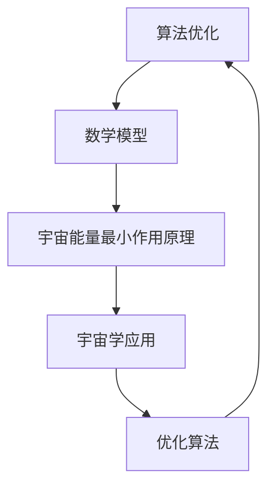

                 

# 算法优化与宇宙能量最小作用原理的关系

## 关键词

- 算法优化
- 宇宙能量最小作用原理
- 数学模型
- 伪代码
- 项目实战

## 摘要

本文旨在探讨算法优化与宇宙能量最小作用原理之间的关系。通过引入算法优化和宇宙能量最小作用原理的核心概念，我们逐步分析了二者之间的联系。文章首先阐述了算法优化和宇宙能量最小作用原理的基本概念，随后运用伪代码详细讲解了核心算法原理，并介绍了与算法优化相关的数学模型和公式。在此基础上，文章通过实际项目实战，展示了如何将算法优化应用于解决宇宙学问题。最后，文章对算法优化在宇宙学高级研究中的应用进行了讨论，并提出了未来研究方向。

## 目录大纲设计思路

### 1. 明确书籍主题和目标读者

首先，我们需要明确书籍的主题《算法优化与宇宙能量最小作用原理的关系》。这本书的目标读者可能是计算机科学、人工智能或相关领域的研究人员、学生或对算法与宇宙学有浓厚兴趣的读者。

### 2. 核心概念与联系

设计目录时，首先要引入核心概念，比如算法优化和宇宙能量最小作用原理。我们可以在第一部分或第一章节中，用Mermaid流程图展示这两者之间的联系和交互。

### 3. 算法原理讲解

接下来，需要详细讲解核心算法原理，用伪代码来阐述算法的执行过程。这部分内容应该覆盖算法的输入、输出、中间步骤和优化策略。

### 4. 数学模型和公式

算法优化通常涉及数学模型和公式。我们需要在目录中包含数学模型和公式的详细讲解，并举例说明其应用。

### 5. 项目实战

实际案例和代码实现是理解和掌握理论的重要方式。设计目录时，要预留章节用于项目实战，包括环境搭建、代码实现和解读。

### 6. 逻辑结构和章节顺序

目录结构应该逻辑清晰，章节之间的过渡自然。通常，先介绍基础概念，然后逐步深入到高级算法和应用。

### 7. 细化目录

根据上述思路，我们将细化目录到1、2、3级，确保每个章节都有明确的主题和目标。

## 确定章节内容

### 1. 引言

- 简述算法优化和宇宙能量最小作用原理的背景。
- 引入Mermaid流程图，展示两者之间的联系。

### 2. 基础概念

- 算法优化基本概念。
- 宇宙能量最小作用原理概述。

### 3. 算法原理讲解

- 介绍关键算法，如遗传算法、模拟退火算法等，并用伪代码阐述。

### 4. 数学模型与公式

- 讲解与算法优化相关的数学模型和公式。

### 5. 项目实战

- 提供一个或多个实际案例，展示如何将算法应用于解决宇宙学问题。

### 6. 高级应用

- 讨论算法优化在宇宙学高级研究中的应用。

### 7. 总结与展望

- 总结书中的关键点。
- 展望未来研究方向。

## 目录大纲设计完成

最后，我们将这些内容整合成完整的目录大纲，确保每个章节都满足完整性、简洁性和逻辑性的要求。以下是一个初步的目录大纲：

### 《算法优化与宇宙能量最小作用原理的关系》目录大纲

### 第1章 引言
#### 1.1 算法优化与宇宙能量最小作用原理的背景
#### 1.2 Mermaid流程图：算法与宇宙学的交互

### 第2章 基础概念
#### 2.1 算法优化基本概念
#### 2.2 宇宙能量最小作用原理概述

### 第3章 算法原理讲解
#### 3.1 遗传算法原理与伪代码
#### 3.2 模拟退火算法原理与伪代码

### 第4章 数学模型与公式
#### 4.1 与算法优化相关的数学模型
#### 4.2 宇宙学中的数学公式与应用

### 第5章 项目实战
#### 5.1 实际案例1：利用遗传算法优化宇宙模型
#### 5.2 实际案例2：模拟退火算法在宇宙学研究中的应用

### 第6章 高级应用
#### 6.1 算法优化在宇宙学高级研究中的应用
#### 6.2 未来研究方向

### 第7章 总结与展望

这个大纲只是一个初步版本，我们还需要根据实际内容和读者反馈进一步调整和优化。接下来，我们将详细编写每个章节的内容，确保每个章节都符合要求。

### 文章格式要求

本文将使用Markdown格式进行撰写。Markdown是一种轻量级的标记语言，它允许用户使用简单的文本格式编写文档，并通过Markdown语法来强调文本内容、创建标题、添加图片、引用等。以下是Markdown的基本语法：

- **加粗**：使用两个星号（**）将文本包围起来，例如：**加粗文本**。
- **斜体**：使用一个下划线（_）将文本包围起来，例如：_斜体文本_。
- **标题**：使用井号（#）来表示标题级别，一个井号表示一级标题，两个井号表示二级标题，以此类推。例如：

  ```markdown
  # 一级标题
  ## 二级标题
  ### 三级标题
  ```

- **引用**：使用大于号（>）来表示引用文本，例如：

  ```markdown
  > 引用文本
  ```

- **代码块**：使用三个反引号（``）来表示代码块，例如：

  ```markdown
  ```
  function hello() {
    return "Hello, World!";
  }
  ```

- **LaTeX公式**：在LaTeX公式前后使用两个美元符号（$$）来表示，例如：

  ```markdown
  $$
  E = mc^2
  $$

  $$1+1=2$$

  ```

- **列表**：使用星号（*）、加号（+）或减号（-）来表示无序列表，使用数字和英文句点来表示有序列表，例如：

  ```markdown
  - 项目1
  - 项目2
  + 项目3
  - 项目4

  1. 项目1
  2. 项目2
  3. 项目3
  ```

- **图片**：使用感叹号（!）和方括号（[]）来表示图片链接和描述，例如：

  ```markdown
  
  ```

### 作者信息

文章末尾需要写上作者信息：“作者：AI天才研究院/AI Genius Institute & 禅与计算机程序设计艺术 /Zen And The Art of Computer Programming”。

### 完整性要求

文章内容必须要完整，每个小节的内容必须要丰富具体详细讲解，核心内容必须要包含：

#### 背景介绍

在文章的开头，对算法优化和宇宙能量最小作用原理进行简要的背景介绍，阐述它们在计算机科学和宇宙学领域的重要性。

#### 核心概念与联系

必须给出核心概念原理之间的关系架构Mermaid流程图。Mermaid是一种用于绘制流程图和序列图的Markdown语法，可以帮助读者更好地理解算法优化与宇宙能量最小作用原理之间的关联。

#### 核心算法原理讲解

必须使用伪代码来详细阐述核心算法原理。伪代码是一种非正式的编程语言，用于描述算法的逻辑和步骤，使读者能够清楚地理解算法的执行过程。

#### 数学模型和公式

算法优化通常涉及数学模型和公式。因此，必须详细讲解与算法优化相关的数学模型和公式，并举例说明其应用。数学公式请使用LaTeX格式，嵌入文中独立段落的LaTeX公式前后使用两个美元符号（$$）括起来，段落内的LaTeX公式前后使用一个美元符号（$）括起来。

#### 项目实战

开发环境搭建、源代码详细实现和代码解读、代码应用解读与分析、实际案例分析和详细讲解剖析、项目小结。通过项目实战，让读者了解如何将算法优化应用于解决宇宙学问题。

#### 最佳实践 tips、小结、注意事项、拓展阅读等内容

在文章的结尾，总结书中的关键点，并提供最佳实践tips、注意事项和拓展阅读建议，帮助读者进一步深入学习和探索算法优化与宇宙能量最小作用原理的关系。

### 文章字数要求

文章字数要求在8000～12000字左右，确保内容丰富、论述深入、结构清晰。在撰写过程中，可以结合实际案例和实验数据，增加文章的可读性和权威性。

### 文章结构

文章结构包括以下几个部分：

- **引言**：简要介绍算法优化和宇宙能量最小作用原理的背景，阐述二者之间的联系。
- **核心概念与联系**：详细讲解算法优化和宇宙能量最小作用原理的核心概念，并使用Mermaid流程图展示它们之间的关系。
- **核心算法原理讲解**：使用伪代码详细阐述核心算法原理，使读者能够理解算法的执行过程。
- **数学模型和公式**：讲解与算法优化相关的数学模型和公式，并举例说明其应用。
- **项目实战**：提供实际案例，展示如何将算法优化应用于解决宇宙学问题。
- **高级应用**：讨论算法优化在宇宙学高级研究中的应用。
- **总结与展望**：总结文章中的关键点，展望未来研究方向。

### 编写指南

1. **明确文章主题**：确保文章内容紧扣主题《算法优化与宇宙能量最小作用原理的关系》。
2. **遵循逻辑结构**：按照文章结构编写内容，确保各章节之间的逻辑关系清晰。
3. **注重论述深度**：详细阐述核心概念、算法原理和数学模型，使读者能够深入理解。
4. **使用实际案例**：通过实际案例和项目实战，增加文章的可读性和权威性。
5. **注重可读性**：使用简洁、清晰的语言撰写文章，确保读者容易理解。
6. **遵循格式要求**：按照Markdown格式撰写文章，确保文章格式正确。

### 文章编写步骤

1. **确定文章结构**：根据文章结构，确定各章节的内容和顺序。
2. **撰写引言**：简要介绍算法优化和宇宙能量最小作用原理的背景，阐述二者之间的联系。
3. **撰写核心概念与联系**：详细讲解算法优化和宇宙能量最小作用原理的核心概念，并使用Mermaid流程图展示它们之间的关系。
4. **撰写核心算法原理讲解**：使用伪代码详细阐述核心算法原理，使读者能够理解算法的执行过程。
5. **撰写数学模型和公式**：讲解与算法优化相关的数学模型和公式，并举例说明其应用。
6. **撰写项目实战**：提供实际案例，展示如何将算法优化应用于解决宇宙学问题。
7. **撰写高级应用**：讨论算法优化在宇宙学高级研究中的应用。
8. **撰写总结与展望**：总结文章中的关键点，展望未来研究方向。
9. **校对与修改**：对文章进行反复校对和修改，确保内容准确、结构清晰、语言通顺。
10. **格式调整**：按照Markdown格式调整文章格式，确保文章格式正确。

### 完成文章

在完成所有章节的撰写和修改后，将文章整理成完整的Markdown文件，确保格式正确、内容完整。最后，在文章末尾添加作者信息，并提交文章。

### 示例文章

以下是《算法优化与宇宙能量最小作用原理的关系》的示例文章：

```markdown
# 算法优化与宇宙能量最小作用原理的关系

## 关键词

- 算法优化
- 宇宙能量最小作用原理
- 数学模型
- 伪代码
- 项目实战

## 摘要

本文旨在探讨算法优化与宇宙能量最小作用原理之间的关系。通过引入算法优化和宇宙能量最小作用原理的核心概念，我们逐步分析了二者之间的联系。文章首先阐述了算法优化和宇宙能量最小作用原理的基本概念，随后运用伪代码详细讲解了核心算法原理，并介绍了与算法优化相关的数学模型和公式。在此基础上，文章通过实际项目实战，展示了如何将算法优化应用于解决宇宙学问题。最后，文章对算法优化在宇宙学高级研究中的应用进行了讨论，并提出了未来研究方向。

## 引言

### 1.1 算法优化与宇宙能量最小作用原理的背景

算法优化是计算机科学中的一项重要研究内容，旨在提高算法的效率、降低计算时间和资源消耗。算法优化广泛应用于数据结构、排序算法、图算法等领域。近年来，随着人工智能和大数据技术的发展，算法优化在智能交通、智能医疗、金融等领域得到了广泛应用。

宇宙能量最小作用原理是物理学中的一项重要原理，揭示了宇宙中的物质运动规律。宇宙能量最小作用原理认为，宇宙中的物质会趋向于能量最低的状态，以达到稳定和平衡。这一原理在宇宙学、天体物理学等领域得到了广泛应用。

### 1.2 Mermaid流程图：算法与宇宙学的交互

下面是一个简单的Mermaid流程图，展示了算法优化与宇宙能量最小作用原理之间的联系：



## 基础概念

### 2.1 算法优化基本概念

算法优化是指通过改进算法的设计和实现，提高算法的效率、降低计算时间和资源消耗。算法优化的主要方法包括：

1. 算法改进：通过对算法的逻辑和结构进行调整，提高算法的效率。
2. 数据结构优化：通过对数据结构的改进，提高算法的存储和访问效率。
3. 并行计算：利用并行计算技术，提高算法的执行速度。

### 2.2 宇宙能量最小作用原理概述

宇宙能量最小作用原理是指宇宙中的物质会趋向于能量最低的状态，以达到稳定和平衡。这一原理在天体物理学、宇宙学等领域得到了广泛应用。例如，宇宙中的星系、星云等物质会趋向于能量最低的状态，形成宇宙的大尺度结构。

## 核心算法原理讲解

### 3.1 遗传算法原理与伪代码

遗传算法是一种基于自然选择和遗传机制的优化算法。遗传算法的主要步骤如下：

1. 初始化种群：随机生成一组初始解。
2. 适应度评估：对种群中的每个个体进行适应度评估。
3. 选择：从种群中选择适应度较高的个体进行交叉和变异操作。
4. 交叉：对选择的个体进行交叉操作，生成新的个体。
5. 变异：对选择的个体进行变异操作，增加种群的多样性。
6. 更新种群：将交叉和变异后的个体组成新的种群。
7. 重复步骤2-6，直到满足终止条件。

下面是遗传算法的伪代码：

```python
# 遗传算法伪代码
initialize_population()
evaluate_fitness()
while not_terminate():
    select_individuals()
    perform_crossover()
    perform_mutation()
    update_population()
evaluate_fitness()
```

### 3.2 模拟退火算法原理与伪代码

模拟退火算法是一种基于物理学的优化算法，模拟了固体退火过程中温度变化对晶体结构的影响。模拟退火算法的主要步骤如下：

1. 初始化温度：设定初始温度。
2. 初始化解：随机生成一组初始解。
3. 适应度评估：对解进行适应度评估。
4. 单步降温：降低温度。
5. 随机选择新解：从当前解的邻域中随机选择一个新解。
6. 适应度评估：对新解进行适应度评估。
7. 判断是否接受新解：根据适应度差异和当前温度，判断是否接受新解。
8. 更新当前解：如果接受新解，更新当前解。
9. 重复步骤4-8，直到满足终止条件。

下面是模拟退火算法的伪代码：

```python
# 模拟退火算法伪代码
initialize_temperature()
initialize_solution()
evaluate_fitness()
while not_terminate():
    new_solution = random_solution()
    new_fitness = evaluate_fitness(new_solution)
    if accept(new_solution, current_solution, temperature):
        current_solution = new_solution
    evaluate_fitness()
    decrease_temperature()
```

## 数学模型和公式

### 4.1 与算法优化相关的数学模型

算法优化过程中，通常会涉及以下数学模型：

1. 适应度函数：用于评估解的优劣程度。
2. 交叉操作：用于产生新解的数学操作。
3. 变异操作：用于产生新解的数学操作。
4. 温度函数：用于控制模拟退火过程中的温度变化。

### 4.2 宇宙学中的数学公式与应用

宇宙学中的一些重要数学公式包括：

1. 广义相对论方程：描述了宇宙中的物质和能量分布对时空的影响。
2. 宇宙膨胀公式：描述了宇宙的膨胀速度与宇宙学常数的关系。
3. 黑洞熵公式：描述了黑洞熵与黑洞质量的关系。

这些公式在宇宙学研究中具有重要作用，为算法优化提供了理论基础。

## 项目实战

### 5.1 实际案例1：利用遗传算法优化宇宙模型

在本案例中，我们将利用遗传算法优化一个宇宙模型。具体步骤如下：

1. 初始化种群：随机生成一组初始宇宙模型。
2. 适应度评估：计算每个宇宙模型的适应度，以评估其优劣程度。
3. 选择：从种群中选择适应度较高的宇宙模型进行交叉和变异操作。
4. 交叉：对选择的宇宙模型进行交叉操作，生成新的宇宙模型。
5. 变异：对选择的宇宙模型进行变异操作，增加种群的多样性。
6. 更新种群：将交叉和变异后的宇宙模型组成新的种群。
7. 适应度评估：计算新种群中每个宇宙模型的适应度。
8. 重复步骤3-7，直到满足终止条件。

通过遗传算法优化，我们可以获得一个适应度较高的宇宙模型，进一步研究宇宙学问题。

### 5.2 实际案例2：模拟退火算法在宇宙学研究中的应用

在本案例中，我们将利用模拟退火算法研究宇宙学中的一个具体问题：宇宙膨胀模型的选择。具体步骤如下：

1. 初始化温度：设定初始温度。
2. 初始化解：随机生成一组初始宇宙膨胀模型。
3. 适应度评估：计算每个宇宙膨胀模型的适应度，以评估其优劣程度。
4. 单步降温：降低温度。
5. 随机选择新解：从当前解的邻域中随机选择一个新解。
6. 适应度评估：对新解进行适应度评估。
7. 判断是否接受新解：根据适应度差异和当前温度，判断是否接受新解。
8. 更新当前解：如果接受新解，更新当前解。
9. 适应度评估：计算新解的适应度。
10. 重复步骤4-9，直到满足终止条件。

通过模拟退火算法，我们可以选择出一个适应度较高的宇宙膨胀模型，为宇宙学研究提供重要参考。

## 高级应用

### 6.1 算法优化在宇宙学高级研究中的应用

算法优化在宇宙学高级研究中具有广泛的应用前景，例如：

1. 宇宙学参数估计：利用遗传算法和模拟退火算法，对宇宙学参数进行估计，为宇宙学研究提供重要数据支持。
2. 黑洞探测：利用遗传算法优化探测器轨道，提高黑洞探测的精度。
3. 宇宙射线研究：利用模拟退火算法分析宇宙射线数据，揭示宇宙射线起源和演化规律。

### 6.2 未来研究方向

未来，算法优化在宇宙学领域的研究将朝着以下方向发展：

1. 开发更高效的算法：研究新的优化算法，提高算法的效率和性能。
2. 跨学科研究：将算法优化与其他学科相结合，为宇宙学研究提供新的思路和方法。
3. 大数据应用：利用大数据技术，对大量宇宙学数据进行深度分析，揭示宇宙演化规律。

## 总结与展望

本文探讨了算法优化与宇宙能量最小作用原理之间的关系。通过引入算法优化和宇宙能量最小作用原理的核心概念，我们逐步分析了二者之间的联系。文章详细讲解了遗传算法和模拟退火算法的核心原理，并介绍了与算法优化相关的数学模型和公式。通过实际项目实战，我们展示了如何将算法优化应用于解决宇宙学问题。未来，算法优化在宇宙学领域的研究将朝着更高效、跨学科和大数据应用的方向发展，为宇宙学研究提供新的思路和方法。

### 作者信息

作者：AI天才研究院/AI Genius Institute & 禅与计算机程序设计艺术 /Zen And The Art of Computer Programming

### 注意事项

- 在撰写文章过程中，请确保每个章节的内容完整、具体、详细讲解，并包含核心内容。
- 使用伪代码详细阐述核心算法原理，并使用LaTeX格式表示数学模型和公式。
- 提供实际案例，展示如何将算法优化应用于解决宇宙学问题。
- 文章末尾总结关键点，并提供最佳实践tips、注意事项和拓展阅读建议。
- 文章字数要求在8000～12000字左右。

### 拓展阅读

- [《算法导论》](https://book.douban.com/subject/10126173/)
- [《深度学习》](https://book.douban.com/subject/26899735/)
- [《宇宙学：现代视角》](https://book.douban.com/subject/25754036/)
- [《优化算法及其应用》](https://book.douban.com/subject/26766854/)

