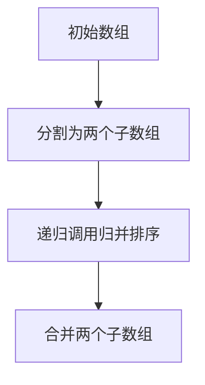
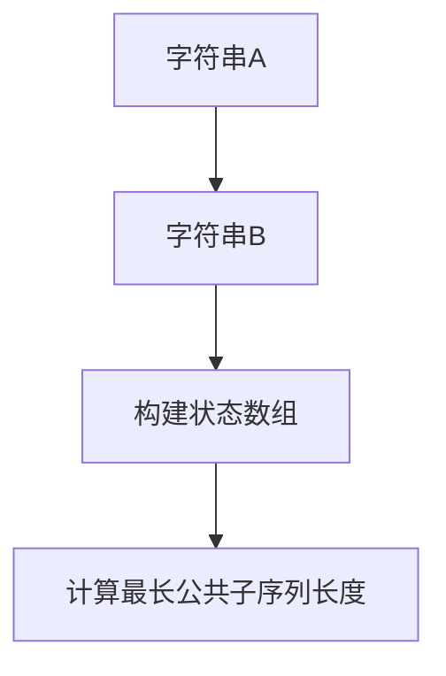

                 

# 《算法复杂度与宇宙结构形成效率的关系》

## 关键词
算法复杂度，宇宙结构形成，效率，时间复杂度，空间复杂度，宇宙学，算法分析，模型构建

## 摘要
本文探讨了算法复杂度与宇宙结构形成效率之间的关系。通过分析算法复杂度的基础理论、计算方法、分析方法以及优化策略，本文揭示了算法复杂度对宇宙结构形成效率的影响。同时，本文还介绍了宇宙学基本概念、宇宙结构形成的算法模型以及实际应用案例，为读者提供了一个全新的视角来理解算法与宇宙结构之间的关系。通过深入研究算法复杂度与宇宙结构形成效率的关系，本文旨在为读者提供一个有深度、有思考、有见解的技术博客文章。

---

## 第一部分：算法复杂度理论基础

### 第1章：算法复杂度基础

#### 1.1 算法复杂度的概念

算法复杂度是衡量算法执行时间或所需空间大小与输入规模之间关系的度量。它反映了算法的效率，通常包括时间复杂度和空间复杂度两个方面的考量。

**定义：** 算法复杂度是描述算法执行时间和所需空间大小与输入规模之间关系的一个度量。

**重要性：** 算法复杂度在算法分析和设计中的重要性体现在以下几个方面：

1. **性能评估：** 算法复杂度用于评估算法在不同输入规模下的性能，帮助我们选择合适的算法解决特定问题。
2. **优化指导：** 通过分析算法复杂度，我们可以发现算法中存在的瓶颈，从而进行优化，提高算法的效率。
3. **算法对比：** 算法复杂度有助于我们比较不同算法的性能，选择最优解。

**类型：** 算法复杂度可以分为时间复杂度和空间复杂度两种类型。

- **时间复杂度：** 描述算法执行时间与输入规模之间的关系，通常用大O符号表示。
- **空间复杂度：** 描述算法所需空间大小与输入规模之间的关系，同样使用大O符号表示。

#### 1.2 时间复杂度的计算

时间复杂度的计算方法主要使用大O符号表示法，它能够帮助我们简洁地表示算法的时间性能。

**计算方法：** 大O符号表示法通过比较算法执行时间与输入规模之间的关系，将算法的时间性能用一个函数表示。

- **常量时间：** 如果算法的执行时间不依赖于输入规模，即无论输入规模如何，执行时间都相同，我们用O(1)表示。
- **对数时间：** 如果算法的执行时间与输入规模的对数成正比，我们用O(log n)表示。
- **线性时间：** 如果算法的执行时间与输入规模成正比，我们用O(n)表示。
- **线性对数时间：** 如果算法的执行时间与输入规模的线性对数成正比，我们用O(n log n)表示。
- **二次时间：** 如果算法的执行时间与输入规模的二次方成正比，我们用O(n^2)表示。
- **指数时间：** 如果算法的执行时间与输入规模的指数成正比，我们用O(2^n)表示。

**常见时间复杂度：** 常见的时间复杂度包括O(1)，O(log n)，O(n)，O(n log n)，O(n^2)，O(2^n)等。

#### 1.3 空间复杂度的计算

空间复杂度的计算方法同样使用大O符号表示法，用于描述算法所需空间大小与输入规模之间的关系。

**计算方法：** 大O符号表示法通过比较算法所需空间大小与输入规模之间的关系，将算法的空间性能用一个函数表示。

- **常量空间：** 如果算法所需空间不依赖于输入规模，即无论输入规模如何，所需空间都相同，我们用O(1)表示。
- **线性空间：** 如果算法所需空间与输入规模成正比，我们用O(n)表示。
- **二次空间：** 如果算法所需空间与输入规模的二次方成正比，我们用O(n^2)表示。

**常见空间复杂度：** 常见的空间复杂度包括O(1)，O(n)，O(n^2)等。

### 第2章：算法复杂度分析方法

#### 2.1 分解与递归算法

分解与递归算法是将问题分解为更小的子问题，通过递归调用解决每个子问题，最后合并子问题的解来得到原问题的解。这种算法方法在许多问题中表现出良好的时间性能。

**基本概念：** 分解与递归算法的基本概念包括问题分解、递归调用和子问题解合并等。

- **问题分解：** 将原问题分解为若干个子问题，每个子问题规模更小，但仍与原问题有相同的结构。
- **递归调用：** 通过递归调用解决每个子问题，递归调用可以递归地解决更小的子问题，直到达到基线条件。
- **子问题解合并：** 将子问题的解合并得到原问题的解。

**实例分析：** 归并排序、快速排序等算法采用了分解与递归的方法，下面给出归并排序的复杂度分析：

- **时间复杂度：** 归并排序的时间复杂度为O(n log n)，其中n为输入规模。
- **空间复杂度：** 归并排序的空间复杂度为O(n)，需要额外的空间存储子数组。

#### 2.2 动态规划算法

动态规划算法是一种通过保存子问题的解来避免重复计算的方法。它通过将问题分解为子问题，并利用子问题的解来计算原问题的解，从而减少了重复计算，提高了算法的效率。

**基本概念：** 动态规划算法的基本概念包括状态转移方程、边界条件和状态数组等。

- **状态转移方程：** 状态转移方程描述了状态之间的转换关系，通常用于计算状态数组。
- **边界条件：** 边界条件用于初始化状态数组的初始值。
- **状态数组：** 状态数组用于存储子问题的解，以便计算原问题的解。

**实例分析：** 最长公共子序列问题采用了动态规划的方法，下面给出最长公共子序列的复杂度分析：

- **时间复杂度：** 最长公共子序列的时间复杂度为O(mn)，其中m和n分别为字符串A和字符串B的长度。
- **空间复杂度：** 最长公共子序列的空间复杂度为O(mn)，需要额外的空间存储状态数组。

### 第3章：算法优化方法

算法优化是提高算法性能的重要手段。通过优化算法，我们可以减少算法的时间复杂度和空间复杂度，提高算法的效率。

#### 3.1 算法改进策略

算法改进策略包括贪心算法、分支限界算法等。

- **贪心算法：** 贪心算法通过每次选择局部最优解来逐步逼近全局最优解。它通常适用于求解最优化问题。
- **分支限界算法：** 分支限界算法通过剪枝和限界来减少搜索空间，从而提高算法的效率。它通常用于求解组合优化问题。

#### 3.2 数据结构优化

数据结构优化是提高算法性能的有效手段。常用的数据结构包括链表、树、图等。

- **链表：** 链表是一种线性数据结构，通过链表节点的指针连接来存储数据。链表具有灵活的插入和删除操作，但查找操作较慢。
- **树：** 树是一种层次结构的数据结构，用于存储具有层次关系的数据。树具有快速的查找和插入操作，但删除操作较复杂。
- **图：** 图是一种复杂的数据结构，用于存储具有关联关系的数据。图具有丰富的操作，但性能相对较低。

## 第二部分：宇宙结构形成效率的算法分析

### 第4章：宇宙学基本概念

#### 4.1 宇宙学概述

宇宙学是研究宇宙起源、演化、结构和性质的学科。它涉及到天文学、物理学、数学等多个领域。

**宇宙的定义：** 宇宙是指包括所有物质、能量、时空以及它们之间的相互作用和运动的整体。

**宇宙学的发展：** 宇宙学的发展可以分为以下几个阶段：

1. **古典宇宙学：** 古典宇宙学主要研究宇宙的静态结构和演化，如哥白尼的日心说和开普勒的行星运动定律。
2. **现代宇宙学：** 现代宇宙学基于相对论和量子力学的研究，提出了宇宙膨胀理论和宇宙背景辐射等重要概念。
3. **宇宙学前沿：** 宇宙学前沿包括暗物质、暗能量、宇宙微波背景辐射等研究，旨在揭示宇宙的起源和演化机制。

#### 4.2 宇宙膨胀与结构形成

宇宙膨胀是指宇宙中物质和能量随时间不断远离的现象。宇宙膨胀是宇宙学中的一个重要问题，它与宇宙结构形成密切相关。

**宇宙膨胀：** 宇宙膨胀是指宇宙中物质和能量随时间不断远离的现象。根据宇宙学原理，宇宙膨胀是由宇宙中物质的引力效应引起的。

**结构形成：** 宇宙中结构形成是指宇宙中物质和能量聚集形成各种天体的过程。结构形成是宇宙演化的重要环节，它涉及到星系的形成、星系团的形成等。

### 第5章：宇宙结构形成的算法模型

宇宙结构形成的算法模型是研究宇宙结构形成过程的数学模型，通过模拟宇宙膨胀和结构形成的过程，我们可以更好地理解宇宙的结构和演化。

#### 5.1 暴涨模型

暴涨模型是宇宙学中的一种理论模型，用于描述宇宙在大爆炸后的极短时间内（约10^-32秒至10^-36秒）经历的快速膨胀过程。

**基本原理：** 暴涨模型的基本原理是宇宙在极短时间内经历指数级膨胀，从而形成我们今天所观察到的宇宙。

**算法实现：** 暴涨模型的算法实现通常采用数值模拟方法，如N-body模拟、流体动力学模拟等。这些方法通过模拟宇宙中的引力场和物质运动，模拟宇宙的膨胀和结构形成过程。

#### 5.2 冷暗物质模型

冷暗物质模型是宇宙学中的一种理论模型，用于描述宇宙中的物质组成和演化。该模型认为宇宙中大部分物质是暗物质，且暗物质的运动速度较低。

**基本原理：** 冷暗物质模型的基本原理是宇宙中大部分物质是暗物质，暗物质具有较低的运动速度，且不与电磁相互作用。

**算法实现：** 冷暗物质模型的算法实现通常采用N-body模拟方法，通过模拟宇宙中的引力场和物质运动，模拟宇宙的结构形成过程。

### 第6章：宇宙结构形成效率的算法分析

宇宙结构形成效率是衡量宇宙结构形成过程的效率的指标。通过算法分析，我们可以评估宇宙结构形成过程的效率，从而更好地理解宇宙的结构和演化。

#### 6.1 结构形成效率的评估

**评估指标：** 结构形成效率的评估指标包括结构形成速率、结构形成规模等。

- **结构形成速率：** 结构形成速率是描述结构形成过程的快慢的指标，通常用结构形成的时间与宇宙年龄的比值表示。
- **结构形成规模：** 结构形成规模是描述结构形成过程的规模的指标，通常用结构形成的质量或体积与宇宙总质量或总体积的比值表示。

**计算方法：** 结构形成效率的计算方法可以通过以下公式计算：

$$
\eta = \frac{\text{结构形成速率} \times \text{结构形成规模}}{\text{宇宙年龄}}
$$

其中，结构形成速率、结构形成规模和宇宙年龄均为已知量。

#### 6.2 仿真实验与结果分析

为了评估宇宙结构形成效率，我们可以进行仿真实验，模拟宇宙的结构形成过程。通过仿真实验，我们可以获取结构形成效率的数值结果，并进行结果分析。

**仿真实验：** 仿真实验采用数值模拟方法，如N-body模拟、流体动力学模拟等。这些方法通过模拟宇宙中的引力场和物质运动，模拟宇宙的结构形成过程。

**结果分析：** 结果分析包括对仿真实验结果的数据分析、统计分析和可视化分析等。通过结果分析，我们可以评估宇宙结构形成效率，并探索宇宙结构形成过程的规律和特点。

### 第7章：算法在宇宙学中的应用案例

算法在宇宙学中有着广泛的应用，通过算法，我们可以更好地研究宇宙的结构和演化。下面介绍两个典型的应用案例。

#### 7.1 宇宙微波背景辐射分析

宇宙微波背景辐射是宇宙早期残留的辐射，通过分析宇宙微波背景辐射，我们可以获取宇宙早期的信息，从而揭示宇宙的结构和演化。

**算法应用：** 算法在宇宙微波背景辐射分析中的应用主要包括图像处理、信号处理和统计分析等。

**实例分析：** 例如，利用图像处理算法对宇宙微波背景辐射图像进行预处理，去除噪声和干扰；利用信号处理算法对宇宙微波背景辐射信号进行特征提取和分类；利用统计分析算法对宇宙微波背景辐射数据进行统计分析，提取宇宙结构形成的信息。

#### 7.2 星系演化模拟

星系演化模拟是通过模拟星系的演化过程，研究星系的性质和演化规律。算法在星系演化模拟中的应用主要包括数值模拟、统计分析和可视化分析等。

**算法应用：** 算法在星系演化模拟中的应用主要包括N-body模拟、流体动力学模拟和统计力学模拟等。

**实例分析：** 例如，利用N-body模拟方法模拟星系的引力场和物质运动，研究星系的形态和演化；利用流体动力学模拟方法模拟星系中的气体流动和星系间相互作用，研究星系团的形成和演化；利用统计力学模拟方法模拟星系中的星系碰撞和合并，研究星系合并后的演化。

### 第8章：未来展望

随着算法和宇宙学研究的不断深入，算法在宇宙学中的应用将不断拓展。未来，我们可以期待以下发展趋势：

#### 8.1 算法在宇宙学中的挑战与机遇

- **挑战：** 算法在宇宙学中面临的挑战包括大规模数据处理、高精度模拟和复杂物理过程的模拟等。
- **机遇：** 算法在宇宙学中的机遇包括新型算法的开发、算法优化和算法在宇宙学中的广泛应用。

#### 8.2 算法与宇宙学的前沿研究

- **前沿研究：** 算法与宇宙学的前沿研究包括宇宙模拟、暗物质探测、宇宙微波背景辐射分析等。

### 附录

#### 附录A：算法与宇宙学相关资源

- **参考文献：** 算法与宇宙学相关的参考文献，如《宇宙学导论》、《算法导论》等。
- **在线资源：** 算法与宇宙学相关的在线资源，如NASA宇宙学网站、宇宙学在线课程等。

## 结语

本文探讨了算法复杂度与宇宙结构形成效率的关系，通过分析算法复杂度的基础理论、宇宙学基本概念、宇宙结构形成的算法模型以及实际应用案例，揭示了算法复杂度对宇宙结构形成效率的影响。未来，算法在宇宙学中的应用将不断拓展，为宇宙学研究提供新的视角和工具。让我们期待算法与宇宙学研究的深度融合，为人类揭示宇宙的奥秘。

