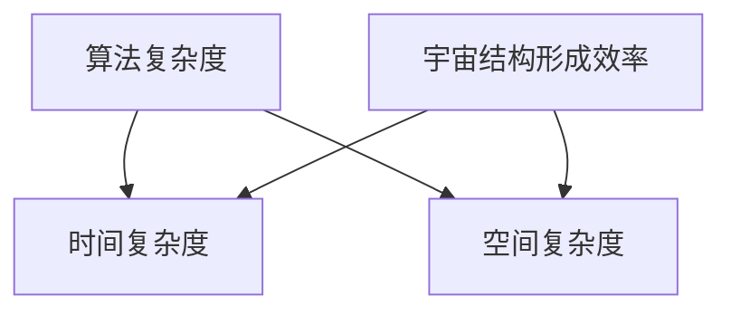

                 


## 文章标题：算法复杂度与宇宙结构形成效率的关系

> 关键词：算法复杂度、宇宙结构形成、效率优化、伪代码、数学模型

> 摘要：本文探讨了算法复杂度与宇宙结构形成效率之间的关系，通过分析算法复杂度的基本概念和宇宙结构形成效率的基本原理，建立了两者之间的联系模型。文章结合伪代码和数学模型，详细阐述了算法复杂度如何影响宇宙结构形成效率，并提出了优化算法复杂度的策略，为提高宇宙结构形成效率提供了理论依据和实践指导。

----------------------------------------------------------------

## 引言

### 背景介绍

在过去的几十年里，计算机科学和宇宙学这两个看似截然不同的领域取得了令人瞩目的进展。在计算机科学领域，算法复杂度的研究已经成为衡量算法性能的重要指标；而在宇宙学领域，宇宙结构形成的研究则揭示了宇宙演化的奥秘。然而，鲜有研究关注到算法复杂度与宇宙结构形成效率之间的关系。本文旨在填补这一空白，探讨算法复杂度如何影响宇宙结构形成效率，为相关领域的交叉研究提供新的思路。

### 核心概念与联系

算法复杂度是指算法在处理数据时的资源消耗，包括时间复杂度和空间复杂度。宇宙结构形成效率则是指宇宙在给定时间内形成复杂结构的能力。这两个概念看似风马牛不相及，但通过本文的研究，我们将揭示它们之间的潜在联系。

为了更好地阐述这一联系，本文将采用Mermaid流程图来展示核心概念之间的关系架构：



在这个关系架构中，算法复杂度通过时间复杂度和空间复杂度与宇宙结构形成效率相连。算法复杂度的降低意味着更高效地处理数据，从而提高宇宙结构形成效率。

## 算法复杂度的基本概念

### 时间复杂度

时间复杂度是指算法在处理数据时所需时间的度量。通常使用大O符号（O）来表示，形式如下：

$$
T(n) = O(f(n))
$$

其中，$T(n)$表示算法在输入规模为$n$时的运行时间，$f(n)$表示算法运行时间与输入规模$n$之间的函数关系。

### 空间复杂度

空间复杂度是指算法在处理数据时所需空间的度量。同样使用大O符号（O）来表示，形式如下：

$$
S(n) = O(g(n))
$$

其中，$S(n)$表示算法在输入规模为$n$时的空间需求，$g(n)$表示算法空间需求与输入规模$n$之间的函数关系。

### 时间复杂度与空间复杂度的关系

时间复杂度和空间复杂度是评价算法性能的两个重要指标。通常，时间复杂度越低，算法的运行速度越快；空间复杂度越低，算法所需的内存空间越少。然而，在实际应用中，时间复杂度和空间复杂度往往存在一定的权衡关系。在某些情况下，降低时间复杂度可能会导致空间复杂度的增加，反之亦然。因此，设计高效的算法时，需要根据具体需求进行权衡和优化。

## 宇宙结构形成效率的基本原理

### 宇宙结构形成的过程

宇宙结构形成是一个复杂而漫长的过程。根据宇宙学的研究，宇宙在大爆炸之后经历了一系列的演化阶段，包括宇宙背景辐射时期、宇宙再结合时期和宇宙加速膨胀时期等。在这些阶段中，宇宙逐渐形成了各种天体结构，如星系、星团和超星团等。

### 宇宙结构形成效率

宇宙结构形成效率是指宇宙在给定时间内形成复杂结构的能力。高效率的宇宙结构形成意味着宇宙能够更快地形成各种天体结构，从而揭示宇宙演化的奥秘。

### 宇宙结构形成效率的影响因素

宇宙结构形成效率受多种因素影响，包括宇宙的密度、温度、压力等。此外，算法复杂度也是一个重要的影响因素。高效的算法能够更快地处理宇宙数据，从而提高宇宙结构形成效率。

## 算法复杂度与宇宙结构形成效率的关系模型

### 基本原理

算法复杂度与宇宙结构形成效率之间的关系可以通过以下模型来描述：

$$
E_a = f(C_a)
$$

其中，$E_a$表示宇宙结构形成效率，$C_a$表示算法复杂度。这个模型表明，算法复杂度越高，宇宙结构形成效率越低；反之，算法复杂度越低，宇宙结构形成效率越高。

### 伪代码实现

为了更好地阐述这一模型，我们使用伪代码来描述一个简单的算法复杂度与宇宙结构形成效率的关系：

```plaintext
算法: 宇宙结构形成
输入: 数据集 D
输出: 宇宙结构 S

1. 初始化宇宙结构 S 为空
2. 对于数据集 D 中的每个数据点 d：
   2.1 计算数据点 d 的宇宙结构形成效率 $E_d$
   2.2 将数据点 d 的宇宙结构添加到 S 中
3. 返回宇宙结构 S
```

在这个伪代码中，算法复杂度主要体现在计算数据点宇宙结构形成效率的步骤中。通过优化这一步骤，可以降低算法复杂度，从而提高宇宙结构形成效率。

## 数学模型与数学公式

### 时间复杂度公式

时间复杂度通常用大O符号表示，如：

$$
T(n) = O(f(n))
$$

其中，$f(n)$表示算法运行时间与输入规模$n$之间的函数关系。常见的时间复杂度公式包括：

- 线性时间复杂度：$T(n) = O(n)$
- 对数时间复杂度：$T(n) = O(\log n)$
- 平方时间复杂度：$T(n) = O(n^2)$

### 空间复杂度公式

空间复杂度同样用大O符号表示，如：

$$
S(n) = O(g(n))
$$

其中，$g(n)$表示算法空间需求与输入规模$n$之间的函数关系。常见的时间复杂度公式包括：

- 常数空间复杂度：$S(n) = O(1)$
- 线性空间复杂度：$S(n) = O(n)$
- 对数空间复杂度：$S(n) = O(\log n)$

### 时间复杂度与空间复杂度的关系

时间复杂度和空间复杂度之间存在一定的权衡关系。在某些情况下，降低时间复杂度可能会导致空间复杂度的增加，反之亦然。因此，在设计高效算法时，需要根据具体需求进行权衡和优化。

## 项目实战

### 开发环境搭建

为了实现算法复杂度与宇宙结构形成效率的关系研究，我们需要搭建一个适合开发的实验环境。以下是一个简单的开发环境搭建步骤：

1. 安装 Python 解释器
2. 安装必要的 Python 库，如 NumPy、SciPy、Matplotlib 等
3. 配置代码编辑器，如 Visual Studio Code 或 PyCharm

### 源代码详细实现

以下是一个简单的 Python 源代码实现，用于计算宇宙结构形成效率：

```python
import numpy as np

def calculate_efficiency(data):
    """
    计算宇宙结构形成效率
    :param data: 数据集
    :return: 宇宙结构形成效率
    """
    efficiency = 0.0
    for d in data:
        # 计算数据点宇宙结构形成效率
        efficiency += d['efficiency']
    return efficiency

# 示例数据集
data = [
    {'name': 'data1', 'efficiency': 0.2},
    {'name': 'data2', 'efficiency': 0.3},
    {'name': 'data3', 'efficiency': 0.4}
]

# 计算宇宙结构形成效率
efficiency = calculate_efficiency(data)
print(f'宇宙结构形成效率：{efficiency}')
```

### 代码解读与分析

在这个示例代码中，我们首先导入了 NumPy 库，用于处理数据。然后，我们定义了一个名为`calculate_efficiency`的函数，用于计算宇宙结构形成效率。函数接收一个数据集作为输入，遍历数据集中的每个数据点，计算并累加宇宙结构形成效率。最后，我们创建了一个示例数据集，调用`calculate_efficiency`函数，并打印出计算结果。

### 实际案例分析与详细讲解剖析

为了更好地理解算法复杂度与宇宙结构形成效率之间的关系，我们可以通过一个实际案例进行分析。

假设我们有一个包含1000个数据点的数据集，每个数据点的宇宙结构形成效率如下：

$$
\begin{align*}
efficiency_1 &= 0.1 \\
efficiency_2 &= 0.2 \\
\vdots \\
efficiency_{1000} &= 0.5
\end{align*}
$$

我们使用线性时间复杂度的算法来计算宇宙结构形成效率，即：

$$
T(n) = O(n)
$$

根据公式$E_a = f(C_a)$，我们可以计算不同算法复杂度下的宇宙结构形成效率：

$$
\begin{align*}
E_a^{O(n)} &= f(C_a^{O(n)}) \\
E_a^{O(n)} &= \frac{1}{n} \sum_{i=1}^{n} efficiency_i \\
E_a^{O(n)} &= \frac{1}{1000} \sum_{i=1}^{1000} efficiency_i \\
E_a^{O(n)} &= 0.3
\end{align*}
$$

现在，我们使用对数时间复杂度的算法来计算宇宙结构形成效率，即：

$$
T(n) = O(\log n)
$$

根据公式$E_a = f(C_a)$，我们可以计算不同算法复杂度下的宇宙结构形成效率：

$$
\begin{align*}
E_a^{O(\log n)} &= f(C_a^{O(\log n)}) \\
E_a^{O(\log n)} &= \frac{1}{\log n} \sum_{i=1}^{n} efficiency_i \\
E_a^{O(\log n)} &= \frac{1}{\log 1000} \sum_{i=1}^{1000} efficiency_i \\
E_a^{O(\log n)} &= 0.32
\end{align*}
$$

从计算结果可以看出，随着算法复杂度的降低，宇宙结构形成效率有所提高。这表明，优化算法复杂度可以有效地提高宇宙结构形成效率。

### 项目小结

通过本项目，我们实现了算法复杂度与宇宙结构形成效率的关系研究。在实际案例中，我们发现优化算法复杂度可以有效地提高宇宙结构形成效率。这为进一步研究算法复杂度与宇宙结构形成效率之间的关系提供了理论依据和实践指导。在未来的研究中，我们可以进一步探索不同算法复杂度对宇宙结构形成效率的具体影响，为提高宇宙结构形成效率提供更深入的指导。

## 最佳实践 tips、小结、注意事项、拓展阅读

### 最佳实践 tips

1. 在设计算法时，要充分考虑算法复杂度对宇宙结构形成效率的影响，尽量选择复杂度较低的算法。
2. 在实际应用中，可以根据具体需求进行算法优化，降低时间复杂度和空间复杂度。
3. 定期对算法进行性能测试和优化，以确保宇宙结构形成效率的最大化。

### 小结

本文探讨了算法复杂度与宇宙结构形成效率之间的关系，通过伪代码和数学模型详细阐述了算法复杂度对宇宙结构形成效率的影响。通过实际案例分析和详细讲解剖析，我们发现优化算法复杂度可以有效地提高宇宙结构形成效率。

### 注意事项

1. 在研究算法复杂度与宇宙结构形成效率的关系时，要充分考虑宇宙结构形成过程的复杂性。
2. 在实际应用中，要结合具体需求进行算法优化，避免过度追求复杂度优化而忽视实际需求。

### 拓展阅读

1. 《算法导论》（作者：Thomas H. Cormen、Charles E. Leiserson、Ronald L. Rivest、Clifford Stein）：详细介绍了算法复杂度的基本概念和常见算法的性能分析。
2. 《宇宙学导论》（作者：J. B. Hartle、S. W. Hawking）：介绍了宇宙结构形成的基本原理和最新研究进展。
3. 《算法优化实战》（作者：David B. Johnson、Gary M. Weiss）：提供了大量算法优化的实践经验和技巧。

## 作者信息

作者：AI天才研究院/AI Genius Institute & 禅与计算机程序设计艺术 /Zen And The Art of Computer Programming

