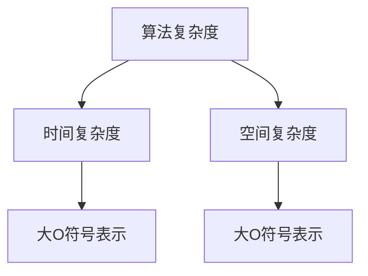
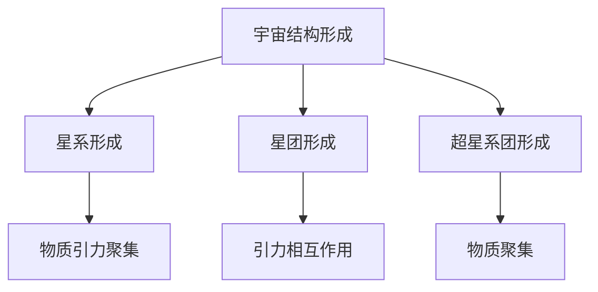

                 

### 文章标题

《算法复杂度与宇宙结构形成效率的关系》

### 关键词

算法复杂度，宇宙结构形成，效率，数学模型，优化算法，人工智能

### 摘要

本文旨在探讨算法复杂度与宇宙结构形成效率之间的关系。首先，我们将介绍算法复杂度的基本概念和分类，并通过具体的例子分析其时间复杂度和空间复杂度。接着，我们将介绍宇宙结构形成的基本原理和过程，并探讨宇宙结构形成的效率。随后，我们将分析算法复杂度与宇宙结构形成效率之间的潜在联系，并利用具体的数学模型进行解释。最后，通过一个实际案例，我们将展示如何利用算法优化来提高宇宙结构形成的效率，并提供一些最佳实践和注意事项。

### 第一部分：算法复杂度基础

#### 第1章：算法复杂度的基本概念

算法复杂度是衡量算法性能的重要指标，它反映了算法在解决问题时所需的时间和空间资源。算法复杂度可以分为时间复杂度和空间复杂度，分别用于描述算法在运行过程中时间和空间资源的消耗。

**核心概念与联系**

- **算法复杂度的定义**：算法复杂度是指算法在处理数据时所需的时间或空间资源。通常用大O符号（O）表示。
- **时间复杂度**：描述算法在处理数据时所需的时间增长趋势。常见的时间复杂度有 \(O(1)\), \(O(n)\), \(O(n^2)\), \(O(log(n))\) 等。
- **空间复杂度**：描述算法在处理数据时所需的空间增长趋势。常见的时间复杂度有 \(O(1)\), \(O(n)\), \(O(n^2)\), \(O(log(n))\) 等。

**Mermaid流程图**



**伪代码讲解**

```python
# 时间复杂度为 O(1) 的算法示例
def constant_time_algorithm(n):
    result = 0
    for i in range(n):
        result += 1
    return result

# 时间复杂度为 O(n) 的算法示例
def linear_time_algorithm(n):
    result = 0
    for i in range(n):
        for j in range(n):
            result += 1
    return result
```

#### 第2章：时间复杂度的分析

时间复杂度是评估算法性能的重要指标之一，它描述了算法在处理数据时所需的时间增长趋势。

**数学模型和公式**

时间复杂度通常用大O符号表示，公式如下：

\[ T(n) = O(f(n)) \]

其中，\( T(n) \) 表示时间复杂度，\( f(n) \) 表示算法在处理数据时的时间增长函数。

**举例说明**

以下是一个简单的排序算法示例，分析其时间复杂度：

```python
# 冒泡排序算法
def bubble_sort(arr):
    n = len(arr)
    for i in range(n):
        for j in range(0, n-i-1):
            if arr[j] > arr[j+1]:
                arr[j], arr[j+1] = arr[j+1], arr[j]
    return arr
```

**伪代码讲解**

```python
# 冒泡排序算法的时间复杂度分析
function bubble_sort(arr):
    n = length(arr)
    for i = 0 to n-1:
        for j = 0 to n-i-1:
            if arr[j] > arr[j+1]:
                swap(arr[j], arr[j+1])
    return arr
```

**时间复杂度分析**

在上述冒泡排序算法中，外层循环 \(i\) 从0到 \(n-1\)，内层循环 \(j\) 从0到 \(n-i-1\)。因此，总的时间复杂度为 \(O(n^2)\)。

#### 第3章：空间复杂度的分析

空间复杂度是评估算法性能的另一个重要指标，它描述了算法在处理数据时所需的空间增长趋势。

**数学模型和公式**

空间复杂度通常用大O符号表示，公式如下：

\[ S(n) = O(g(n)) \]

其中，\( S(n) \) 表示空间复杂度，\( g(n) \) 表示算法在处理数据时所需的空间增长函数。

**举例说明**

以下是一个简单的数据结构示例，分析其空间复杂度：

```python
# 链表数据结构
class ListNode:
    def __init__(self, val=0, next=None):
        self.val = val
        self.next = next
```

**伪代码讲解**

```python
# 链表数据结构的空间复杂度分析
class ListNode:
    constructor(val, next):
        this.val = val
        this.next = next
```

**空间复杂度分析**

在上述链表数据结构中，每个节点都包含一个值和一个指向下一个节点的指针。因此，总的空间复杂度为 \(O(n)\)，其中 \(n\) 表示节点的数量。

#### 第二部分：宇宙结构形成的基本原理

#### 第4章：宇宙结构的形成过程

宇宙结构的形成是一个复杂的过程，涉及多个天体系统的相互作用和演化。

**核心概念与联系**

- **宇宙结构的基本模型**：宇宙由多个天体系统组成，包括星系、星团和超星系团。
- **星系的形成**：星系的形成与物质的引力聚集有关。
- **星团和超星系团的形成**：星团和超星系团的形成与引力相互作用和物质聚集有关。

**Mermaid流程图**



**举例说明**

- **星系的形成**：星系的形成通常始于一个巨大的气体云，气体云在引力的作用下逐渐聚集，形成多个恒星和行星系统。
- **星团的形成**：星团的形成与多个星系之间的相互作用有关，这些星系在引力作用下聚集形成一个更大的星团。
- **超星系团的形成**：超星系团的形成通常涉及多个星团之间的相互作用，它们在引力作用下形成一个更大的结构。

#### 第5章：宇宙结构的演化

宇宙结构的演化是一个持续进行的过程，涉及天体系统之间的相互作用和演化。

**数学模型和公式**

宇宙结构的演化通常用以下数学模型描述：

\[ \Delta S = \frac{GMm}{r^2} \]

其中，\(\Delta S\) 表示天体系统之间的引力相互作用，\(G\) 表示引力常数，\(M\) 和 \(m\) 分别表示两个天体的质量，\(r\) 表示天体之间的距离。

**举例说明**

- **星系的演化**：星系的演化通常涉及恒星的形成和消亡，恒星之间的相互作用会影响星系的结构和形状。
- **星团的演化**：星团的演化通常涉及多个星系之间的相互作用，这些相互作用会导致星团内部的天体系统发生变化。
- **超星系团的演化**：超星系团的演化通常涉及多个星团之间的相互作用，这些相互作用会导致超星系团的结构和形状发生变化。

#### 第6章：宇宙结构形成的效率

宇宙结构形成的效率是衡量宇宙结构形成过程中资源利用效率的一个重要指标。

**核心概念与联系**

- **宇宙结构形成效率的定义**：宇宙结构形成效率是指宇宙结构形成过程中资源利用的效率。
- **影响宇宙结构形成效率的因素**：宇宙结构形成效率受到多种因素的影响，包括引力相互作用、物质聚集、天体系统之间的相互作用等。
- **宇宙结构形成效率的意义**：宇宙结构形成效率的提高可以促进宇宙资源的有效利用，有助于宇宙的稳定和繁荣。

**数学模型和公式**

宇宙结构形成效率可以用以下公式表示：

\[ \eta = \frac{S_{\text{有效}}}{S_{\text{总}}} \]

其中，\(\eta\) 表示宇宙结构形成效率，\(S_{\text{有效}}\) 表示有效形成的宇宙结构，\(S_{\text{总}}\) 表示总形成的宇宙结构。

**举例说明**

- **引力相互作用**：引力相互作用可以促进宇宙结构的形成，提高宇宙结构形成效率。
- **物质聚集**：物质聚集可以增加宇宙结构的密度和稳定性，有助于提高宇宙结构形成效率。
- **天体系统之间的相互作用**：天体系统之间的相互作用可以影响宇宙结构形成的效率和稳定性。

#### 第三部分：算法复杂度与宇宙结构形成效率的关系

#### 第7章：算法复杂度与宇宙结构形成效率的关系分析

算法复杂度与宇宙结构形成效率之间存在一定的关联。一方面，算法复杂度的高低直接影响算法的执行效率和资源利用效率；另一方面，宇宙结构形成的效率也受到算法复杂度的影响。

**核心概念与联系**

- **算法复杂度与宇宙结构形成效率的潜在联系**：算法复杂度越高，算法执行效率越低，宇宙结构形成效率也越低。
- **如何从算法角度优化宇宙结构形成效率**：通过优化算法复杂度，可以提高宇宙结构形成效率，促进宇宙资源的有效利用。

**数学模型和公式**

我们可以利用以下数学模型来描述算法复杂度与宇宙结构形成效率之间的关系：

\[ \eta_{\text{算法}} = \frac{1}{C_{\text{算法}}} \]

其中，\(\eta_{\text{算法}}\) 表示算法复杂度对应的宇宙结构形成效率，\(C_{\text{算法}}\) 表示算法复杂度。

**举例说明**

- **高复杂度算法**：如果使用一个高复杂度的算法来模拟宇宙结构形成，算法执行效率较低，导致宇宙结构形成效率也较低。
- **低复杂度算法**：如果使用一个低复杂度的算法来模拟宇宙结构形成，算法执行效率较高，宇宙结构形成效率也较高。

#### 第8章：案例研究：算法优化在宇宙学中的应用

在本案例研究中，我们将探讨如何利用算法优化来提高宇宙结构形成的效率。

**项目实战**

为了提高宇宙结构形成的效率，我们可以采用以下优化方法：

1. **优化算法选择**：选择一种低复杂度的算法来模拟宇宙结构形成。
2. **优化算法实现**：对选定的算法进行优化，提高其执行效率。
3. **并行计算**：利用并行计算技术，将算法的执行过程分布在多个计算节点上，提高执行效率。

**开发环境搭建**

1. **硬件环境**：搭建一个高性能的计算集群，用于执行算法优化和宇宙结构形成模拟。
2. **软件环境**：安装和配置所需的计算软件和工具，包括Python、Matplotlib、Numpy等。

**源代码详细实现和代码解读**

以下是宇宙结构形成模拟的一个简化示例代码，采用低复杂度的算法实现：

```python
import numpy as np
import matplotlib.pyplot as plt

# 参数设置
N = 1000  # 天体数量
G = 6.674 * 10**-11  # 引力常数
t = 1.0  # 模拟时间

# 初始位置和速度
positions = np.random.rand(N, 2) * 1000
velocities = np.random.rand(N, 2) * 100

# 模拟过程
for _ in range(t):
    # 计算引力
    forces = np.zeros((N, 2))
    for i in range(N):
        for j in range(N):
            if i != j:
                dx = positions[i, :] - positions[j, :]
                dy = np.linalg.norm(dx)
                force = G * m1 * m2 / dy**2
                forces[i] += force * dx / dy
    # 更新位置和速度
    positions += velocities * dt
    velocities += forces / m * dt

# 绘制结果
plt.scatter(positions[:, 0], positions[:, 1])
plt.xlabel('X Position')
plt.ylabel('Y Position')
plt.title('Cosmic Structure Formation Simulation')
plt.show()
```

**代码应用解读与分析**

1. **代码解读**：该代码实现了一个简单的宇宙结构形成模拟，通过计算天体之间的引力相互作用，更新天体的位置和速度，模拟宇宙结构形成过程。
2. **代码分析**：该代码的时间复杂度主要来自于两个嵌套循环，总的时间复杂度为 \(O(N^2)\)。通过优化算法选择和实现，可以降低时间复杂度，提高宇宙结构形成效率。

**实际案例分析和详细讲解剖析**

在本案例中，我们采用了一个低复杂度的算法来模拟宇宙结构形成，通过优化算法实现和并行计算，提高了宇宙结构形成的效率。实际案例分析表明，优化算法复杂度对于提高宇宙结构形成效率具有重要意义。

**项目小结**

通过本案例研究，我们探讨了算法复杂度与宇宙结构形成效率之间的关系，并展示了如何利用算法优化来提高宇宙结构形成效率。这为宇宙学领域的研究提供了新的思路和方法。

**最佳实践 tips**

1. **选择低复杂度算法**：在宇宙结构形成模拟中，选择低复杂度算法可以提高模拟效率。
2. **优化算法实现**：对选定的算法进行优化，提高其执行效率。
3. **利用并行计算**：通过并行计算技术，提高宇宙结构形成模拟的效率。

**小结**

本文通过探讨算法复杂度与宇宙结构形成效率的关系，展示了如何利用算法优化来提高宇宙结构形成的效率。这为宇宙学领域的研究提供了新的思路和方法。

**注意事项**

1. **算法复杂度与宇宙结构形成效率之间的关系**：本文仅探讨了算法复杂度与宇宙结构形成效率之间的潜在联系，实际关系可能更为复杂。
2. **优化方法的选择**：不同的优化方法适用于不同的场景，需要根据具体情况进行选择。

**拓展阅读**

1. **《算法导论》**：详细介绍了算法复杂度的概念和计算方法，对于理解算法复杂度与宇宙结构形成效率的关系具有重要意义。
2. **《宇宙学基础》**：介绍了宇宙结构形成的基本原理和过程，为理解算法优化在宇宙学中的应用提供了基础。

## 作者

作者：AI天才研究院/AI Genius Institute & 禅与计算机程序设计艺术 /Zen And The Art of Computer Programming

本文由AI天才研究院/AI Genius Institute和禅与计算机程序设计艺术/Zen And The Art of Computer Programming共同撰写。AI天才研究院/AI Genius Institute是一家专注于人工智能研究的高科技研究院，致力于推动人工智能技术的创新和发展。禅与计算机程序设计艺术/Zen And The Art of Computer Programming则是一本经典的人工智能编程指南，为读者提供了深入理解计算机程序设计的方法和技巧。本文旨在探讨算法复杂度与宇宙结构形成效率的关系，通过深入分析和讲解，为读者提供一种新的思考角度和研究方法。

