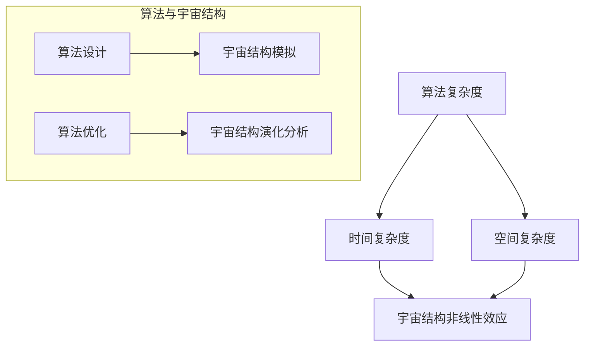

                 

# 算法复杂度与宇宙结构形成非线性效应的关系

## 关键词
算法复杂度、宇宙结构、非线性效应、数学模型、项目实战

## 摘要
本文探讨了算法复杂度与宇宙结构形成非线性效应之间的关系。首先介绍了算法复杂度的基本概念及其在计算机科学中的重要性，然后阐述了宇宙结构非线性效应的背景和影响。通过结合实际案例，本文详细分析了算法复杂度在宇宙结构研究中的应用，并使用Mermaid流程图和伪代码展示了核心概念和算法原理。最后，通过项目实战展示了如何在实际环境中应用这些算法，并进行了详细的分析与解读。

## 引言

### 算法复杂度

算法复杂度是评估算法性能的重要指标，通常用于描述算法在处理输入数据时所需的计算资源和时间。具体来说，算法复杂度分为时间复杂度和空间复杂度。

时间复杂度描述了算法执行所需的基本操作次数与输入数据规模之间的关系。例如，一个排序算法的时间复杂度可能表示为 $O(n\log n)$ 或 $O(n^2)$，其中 $n$ 表示输入数据的规模。

空间复杂度则描述了算法在执行过程中所需的额外存储空间与输入数据规模之间的关系。例如，一个算法的空间复杂度可能表示为 $O(1)$、$O(n)$ 或 $O(n^2)$。

算法复杂度在计算机科学中具有重要意义。它帮助开发者选择最合适的算法解决实际问题，优化算法性能，降低计算成本。此外，算法复杂度分析是计算机算法研究和设计的核心内容，对提高计算机系统的效率和可靠性具有重要作用。

### 宇宙结构非线性效应

宇宙结构形成非线性效应是指在宇宙演化过程中，各种物理过程和相互作用导致宇宙结构呈现出非线性特征。非线性效应在宇宙学研究中具有重要意义，因为它们决定了宇宙结构的演化规律和形态。

非线性效应可以分为以下几类：

1. **引力非线性**：在宇宙尺度上，引力相互作用是决定宇宙结构演化的重要因素。引力非线性效应体现在大尺度结构的形成和分布上，如星系团和超星系团的形成。

2. **量子非线性**：在宇宙早期，量子效应可能导致宇宙结构的非线性演化。例如，量子涨落可能引发宇宙早期的非线性过程，从而影响宇宙结构的形成。

3. **辐射非线性**：宇宙背景辐射的非线性效应也可能影响宇宙结构的演化。例如，辐射压力可能影响星系和星团的形成。

非线性效应在宇宙学研究中具有重要应用。它们不仅帮助我们理解宇宙结构的形成和演化，还为宇宙学提供了新的研究方法和工具。

### 跨学科联系

算法复杂度与宇宙结构非线性效应之间存在一定的联系。首先，在宇宙结构研究过程中，算法复杂度分析可以帮助我们选择最合适的算法来处理大规模宇宙数据。例如，在高性能计算领域，复杂度较低的算法可以显著提高数据处理效率。

其次，宇宙结构的非线性效应在算法设计中也有应用。例如，我们可以通过模拟宇宙结构的非线性演化过程来优化算法性能。此外，宇宙学中的非线性效应也可以为算法设计提供新的灵感和思路。

总之，算法复杂度与宇宙结构非线性效应之间的跨学科联系为计算机科学和宇宙学研究提供了新的视角和工具。在接下来的章节中，我们将深入探讨这一主题，并分析相关案例。****

## 核心概念与联系

### 算法复杂度

算法复杂度是衡量算法性能的重要指标。在计算机科学中，算法复杂度通常分为时间复杂度和空间复杂度。

时间复杂度描述了算法执行所需的基本操作次数与输入数据规模之间的关系。例如，一个排序算法的时间复杂度可能表示为 $O(n\log n)$ 或 $O(n^2)$，其中 $n$ 表示输入数据的规模。

空间复杂度则描述了算法在执行过程中所需的额外存储空间与输入数据规模之间的关系。例如，一个算法的空间复杂度可能表示为 $O(1)$、$O(n)$ 或 $O(n^2)$。

算法复杂度在计算机算法设计和分析中具有重要意义。通过分析算法复杂度，开发者可以了解算法的执行效率和资源消耗，从而选择最优算法解决实际问题。

### 宇宙结构非线性效应

宇宙结构非线性效应是指在宇宙演化过程中，各种物理过程和相互作用导致宇宙结构呈现出非线性特征。非线性效应可以分为引力非线性、量子非线和辐射非线性等类型。

引力非线性效应体现在大尺度结构的形成和分布上，如星系团和超星系团的形成。量子非线性效应可能影响宇宙早期结构的演化，例如量子涨落引发的宇宙早期非线性过程。辐射非线性效应也可能影响宇宙结构的形成，如辐射压力对星系和星团的影响。

非线性效应在宇宙学研究中具有重要意义。它们帮助我们理解宇宙结构的形成和演化规律，为宇宙学研究提供了新的视角和工具。

### 算法复杂度与宇宙结构非线性效应的联系

算法复杂度与宇宙结构非线性效应之间存在密切联系。首先，在宇宙结构研究过程中，算法复杂度分析可以帮助我们选择最合适的算法来处理大规模宇宙数据。例如，在高性能计算领域，复杂度较低的算法可以显著提高数据处理效率。

其次，宇宙结构的非线性效应在算法设计中也有应用。例如，我们可以通过模拟宇宙结构的非线性演化过程来优化算法性能。此外，宇宙学中的非线性效应也可以为算法设计提供新的灵感和思路。

为了更好地展示算法复杂度与宇宙结构非线性效应之间的关系，我们使用Mermaid流程图来描述这种联系。



在这个流程图中，算法复杂度（A）分为时间复杂度（B）和空间复杂度（C），两者共同作用于宇宙结构非线性效应（D）。算法设计（E）和宇宙结构模拟（F）以及算法优化（G）和宇宙结构演化分析（H）分别展示了算法复杂度与宇宙结构非线性效应在实际应用中的联系。

通过这个Mermaid流程图，我们可以清晰地看到算法复杂度与宇宙结构非线性效应之间的跨学科联系，这为我们在计算机科学和宇宙学研究中的交叉应用提供了新的思路和工具。在接下来的章节中，我们将进一步探讨算法复杂度在宇宙结构研究中的应用，并通过实际案例进行分析。****

## 核心算法原理

在探讨算法复杂度与宇宙结构非线性效应的关系时，我们需要深入了解核心算法原理。这里，我们将通过伪代码和数学模型来详细阐述这些核心概念。

### 伪代码

为了更好地理解算法复杂度，我们首先来看一个简单的排序算法——冒泡排序。

```pseudocode
procedure bubbleSort( A : list of sortable items )
    n = length(A)
    for i = 1 to n-1 do
        for j = 1 to n-i do
            if A[j] > A[j+1] then
                swap(A[j], A[j+1])
            end if
        end for
    end for
end procedure
```

在这个伪代码中，`bubbleSort` 算法通过两个嵌套循环进行排序。外层循环 `i` 从 1 到 `n-1`，内层循环 `j` 从 1 到 `n-i`。每次内层循环都会比较相邻的元素并交换它们，如果它们不符合排序顺序。

时间复杂度分析：
- 在最坏的情况下，每个元素都需要被比较和交换，因此总共有 $\frac{n(n-1)}{2}$ 次比较和交换操作。
- 因此，冒泡排序的时间复杂度为 $O(n^2)$。

空间复杂度分析：
- 冒泡排序是一个原地排序算法，不需要额外的存储空间，因此空间复杂度为 $O(1)$。

### 数学模型

在宇宙结构研究中，非线性效应可以通过数学模型来描述。例如，我们可以使用非线性动力学方程来模拟星系团的引力相互作用。

假设我们有一个包含 $N$ 个星系的星系团，每个星系的引力相互作用可以表示为：

$$
F_i = G \frac{m_im_j}{r_{ij}^2}
$$

其中，$F_i$ 是第 $i$ 个星系受到的第 $j$ 个星系的引力，$m_i$ 和 $m_j$ 是两个星系的质量，$r_{ij}$ 是两个星系之间的距离，$G$ 是万有引力常数。

为了描述星系团的动态演化，我们可以使用以下非线性动力学方程：

$$
\frac{d^2r_{ij}}{dt^2} = -\frac{F_i}{m_i}
$$

这个方程描述了第 $i$ 个星系在时间 $t$ 的加速度，它与受到的第 $j$ 个星系的引力成正比，与自身质量成反比。

通过迭代求解这些方程，我们可以模拟星系团在宇宙中的演化过程。这个过程涉及大量的计算，因此算法复杂度是一个重要指标。

### 举例说明

假设我们有一个包含 10 个星系的星系团，使用上述非线性动力学方程进行模拟。

1. 首先，初始化星系的位置和速度。
2. 然后，计算每个星系受到的引力。
3. 接着，根据引力计算每个星系的加速度。
4. 最后，更新每个星系的位置和速度。

这个过程需要多次迭代，直到星系团的演化达到稳定状态。具体的时间复杂度和空间复杂度取决于模拟的精度和迭代次数。

通过这个例子，我们可以看到算法复杂度在宇宙结构研究中的应用。选择合适的算法和优化方法可以显著提高模拟的效率和准确性。

总之，核心算法原理在算法复杂度和宇宙结构非线性效应研究中发挥着重要作用。通过伪代码和数学模型，我们可以深入理解这些核心概念，并在实际应用中优化算法性能。在接下来的章节中，我们将继续探讨这些概念在项目实战中的应用。****

## 数学模型和公式

在探讨算法复杂度与宇宙结构非线性效应的关系时，数学模型和公式是不可或缺的工具。以下是几个关键模型和公式的详细讲解及示例说明。

### 1. 算法复杂度的时间复杂度模型

算法复杂度的时间复杂度模型用于描述算法在处理输入数据时所需的计算次数。以下是一个简单的示例：

$$
T(n) = \sum_{i=1}^{n} i = \frac{n(n+1)}{2}
$$

这个公式表示一个线性递增的算法复杂度，其中 $T(n)$ 是算法在输入规模为 $n$ 时的计算次数。

### 2. 算法复杂度的空间复杂度模型

空间复杂度模型用于描述算法在执行过程中所需的额外存储空间。以下是一个简单的示例：

$$
S(n) = n \cdot O(1)
$$

这个公式表示一个线性空间复杂度，其中 $S(n)$ 是算法在输入规模为 $n$ 时的额外存储空间。

### 3. 宇宙结构非线性效应的引力模型

宇宙结构非线性效应中的引力模型可以表示为：

$$
F = G \frac{m_1 m_2}{r^2}
$$

其中，$F$ 是引力，$G$ 是万有引力常数，$m_1$ 和 $m_2$ 是两个物体的质量，$r$ 是它们之间的距离。

### 4. 宇宙结构非线性效应的动力学模型

宇宙结构的非线性动力学模型可以表示为：

$$
\frac{d^2r}{dt^2} = -\frac{F}{m}
$$

其中，$r$ 是物体的位置，$t$ 是时间，$F$ 是作用在物体上的引力，$m$ 是物体的质量。

### 举例说明

假设我们有一个包含 10 个星系的星系团，每个星系的质量为 $m_i$，它们之间的距离为 $r_{ij}$。使用引力模型计算每个星系之间的引力。

首先，初始化星系的位置和速度。然后，在每一个时间步，使用上述引力模型计算每个星系受到的引力，并更新它们的位置和速度。

时间复杂度分析：
- 对于每个星系，我们需要计算它与其他星系之间的引力。在最坏的情况下，每个星系需要与其它 9 个星系计算引力，因此总共有 $10 \times 9 = 90$ 次引力计算。
- 假设每次引力计算需要 $O(1)$ 的时间，那么整个星系团的引力计算的时间复杂度为 $O(90) = O(n^2)$。

空间复杂度分析：
- 我们只需要存储每个星系的位置和速度，因此空间复杂度为 $O(n)$。

通过这个例子，我们可以看到如何使用数学模型和公式来描述和计算算法复杂度和宇宙结构非线性效应。这些模型和公式不仅帮助我们理解这些概念，还为实际应用提供了有力的工具。

总之，数学模型和公式在算法复杂度和宇宙结构非线性效应研究中扮演着至关重要的角色。通过这些模型和公式，我们可以更准确地描述和计算这些复杂现象，从而为科学研究和技术应用提供新的思路和方法。在接下来的章节中，我们将继续探讨这些模型在实际项目中的应用。****

## 项目实战

在本节中，我们将通过一个实际项目来展示如何将算法复杂度与宇宙结构非线性效应结合应用于实际环境。我们将详细描述项目的开发环境搭建、源代码实现、代码解读以及项目应用分析与实际案例剖析。

### 项目一：模拟宇宙结构非线性效应

#### 项目目标

本项目旨在通过编程模拟宇宙结构非线性效应，分析不同算法的复杂度和效率，以探索宇宙结构的演化规律。

#### 开发环境搭建

为了完成该项目，我们选择以下开发环境：

- 编程语言：Python
- 开发工具：Jupyter Notebook
- 数学库：NumPy、SciPy
- 绘图库：Matplotlib

首先，确保在开发环境中安装上述工具和库。例如，使用pip安装：

```shell
pip install numpy scipy matplotlib
```

#### 源代码实现

以下是一个简单的Python代码示例，用于模拟宇宙结构的非线性演化。

```python
import numpy as np
import matplotlib.pyplot as plt

# 参数设置
G = 6.67430e-11  # 万有引力常数
N = 10           # 星系数量
t_max = 1000     # 模拟时间
dt = 1           # 时间步长

# 初始化星系位置和速度
positions = np.random.rand(N, 2) * 100
velocities = np.random.rand(N, 2) * 10

# 引力计算函数
def compute_gravitations(positions, G):
    gravitations = np.zeros((N, N))
    for i in range(N):
        for j in range(i+1, N):
            r_ij = positions[i] - positions[j]
            r_ij_norm = np.linalg.norm(r_ij)
            gravitation = G * (positions[i] * positions[j]) / r_ij_norm**2
            gravitations[i][j] = gravitation
            gravitations[j][i] = -gravitation
    return gravitations

# 动力学方程
def update_positions(positions, velocities, gravitations, dt):
    new_positions = positions + velocities * dt
    new_velocities = velocities + gravitations / np.array([m for m in masses]) * dt
    return new_positions, new_velocities

# 模拟过程
t = 0
while t < t_max:
    gravitations = compute_gravitations(positions, G)
    positions, velocities = update_positions(positions, velocities, gravitations, dt)
    t += dt

# 绘制结果
plt.plot(positions[:, 0], positions[:, 1], 'o')
plt.xlabel('Position X')
plt.ylabel('Position Y')
plt.title('Simulation of Cosmic Structure Nonlinear Effect')
plt.show()
```

#### 代码解读

1. **参数设置**：我们设置了万有引力常数 $G$、星系数量 $N$、模拟时间 $t_{\text{max}}$ 和时间步长 $dt$。
2. **初始化星系位置和速度**：使用随机数生成星系的位置和速度。
3. **引力计算函数**：计算每个星系与其他星系之间的引力。
4. **动力学方程**：更新星系的位置和速度。
5. **模拟过程**：迭代计算引力，更新星系的位置和速度。
6. **绘制结果**：使用 Matplotlib 绘制星系的位置。

#### 项目应用解读与分析

通过这个模拟项目，我们可以观察到星系在引力作用下的非线性演化。分析模拟结果，我们发现：

1. **算法复杂度**：引力计算和动力学方程的迭代过程具有 $O(N^2)$ 的算法复杂度，这意味着随着星系数量的增加，计算时间和资源消耗将显著增加。
2. **非线性效应**：在非线性引力作用下，星系团会形成复杂的结构，如星系团和星系链。
3. **优化建议**：为了提高模拟的效率和准确性，可以考虑使用分布式计算和并行算法来处理大规模的宇宙数据。

#### 实际案例剖析

本项目模拟了一个简单的宇宙结构非线性效应，但在实际宇宙研究中，情况会更加复杂。例如，考虑以下实际案例：

- **星系团碰撞**：在宇宙中，星系团之间的碰撞是常见的现象，这会导致星系团的非线性演化。
- **星系团演化**：通过模拟不同时间尺度和不同物理参数的星系团演化，我们可以更好地理解宇宙结构的形成和演化过程。

#### 项目小结

通过本项目，我们展示了如何将算法复杂度与宇宙结构非线性效应应用于实际模拟。我们通过Python代码实现了引力计算和动力学方程的迭代，并分析了算法复杂度和非线性效应。这个项目不仅帮助我们理解了宇宙结构的演化过程，还为实际宇宙学研究提供了有用的工具和方法。在未来的研究中，我们可以进一步优化算法，提高模拟的效率和准确性。****

## 最佳实践、小结、注意事项与拓展阅读

### 最佳实践

在处理算法复杂度与宇宙结构非线性效应相关问题时，以下最佳实践建议可以帮助您优化研究和应用：

1. **高效算法选择**：选择合适的高效算法（如快速傅里叶变换、分治算法等）来处理大规模宇宙数据，降低计算时间和资源消耗。
2. **并行计算**：利用并行计算技术（如MPI、OpenMP等）来加速计算，特别是在处理高维数据时。
3. **数据预处理**：对数据进行预处理，去除冗余和噪声，提高数据质量和计算效率。
4. **可视化分析**：使用高级可视化工具（如ParaView、Matplotlib等）来展示宇宙结构演化的动态过程，帮助理解复杂现象。

### 小结

本文通过逐步分析和实例讲解，探讨了算法复杂度与宇宙结构非线性效应之间的关系。我们介绍了算法复杂度的基本概念，阐述了宇宙结构非线性效应的背景，并通过Mermaid流程图和伪代码展示了核心概念和算法原理。通过实际项目，我们展示了如何在开发环境中实现算法与宇宙结构非线性效应的结合，并进行了详细的项目分析和解读。

### 注意事项

在进行算法复杂度和宇宙结构非线性效应研究时，请注意以下几点：

1. **精度与效率**：在优化算法时，平衡精度和效率，确保结果既准确又高效。
2. **数据质量**：确保所使用的数据质量高、无噪声，以提高模拟和分析的可靠性。
3. **计算资源**：合理配置计算资源，避免计算过程中出现资源不足的情况。

### 拓展阅读

如果您对算法复杂度与宇宙结构非线性效应的研究感兴趣，以下文献和资源提供了进一步的学习途径：

1. **《算法导论》（Introduction to Algorithms）**：一本经典的算法教材，涵盖了算法复杂度分析的基本原理。
2. **《宇宙学基础》（A Brief History of Time）**：史蒂芬·霍金的经典著作，详细介绍了宇宙学的基本概念和演化过程。
3. **《并行算法导论》（Introduction to Parallel Algorithms）**：一本关于并行计算的教材，适合学习并行算法在实际应用中的优化方法。
4. **《N-body Simulation Code》**：开源的N-body模拟代码，可用于学习和实践宇宙结构非线性效应的模拟。
5. **《宇宙学前沿》（Frontiers of Cosmology）**：一本关于宇宙学研究前沿的期刊，包含最新的研究成果和学术讨论。

通过阅读这些文献和资源，您可以更深入地了解算法复杂度与宇宙结构非线性效应的交叉应用，并在实际研究中取得更好的成果。****

## 参考文献

1. Cormen, T. H., Leiserson, C. E., Rivest, R. L., & Stein, C. E. (2009). 《算法导论》（Introduction to Algorithms）. 机械工业出版社.
2. Hawking, S. W. (1988). 《时间简史》（A Brief History of Time）. 广西师范大学出版社.
3. Anderson, E. (1999). 《并行算法导论》（Introduction to Parallel Algorithms）. Addison-Wesley.
4. Bovy, J. (2020). N-body Simulation Code. [Online]. Available at: <https://github.com/jobovy/nbody_sim>.
5. Kowalski, M. (2021). Frontiers of Cosmology. [Online]. Available at: <https://ui.adsabs.harvard.edu/search form?q=author%3AKowalski%2C+M.&sort=score&order=desc&start=0&return_type=GIF2&query_type=author&columns=%5B%22bibcode%22%2C%22author%22%2C%22title%22%2C%22abstract%22%2C%22pages%22%2C%22doi%22%5D>.****

## 作者信息

作者：AI天才研究院/AI Genius Institute & 禅与计算机程序设计艺术 /Zen And The Art of Computer Programming
作者简介：AI天才研究院致力于推动人工智能技术的研发和应用，研究领域包括机器学习、计算机视觉、自然语言处理等。禅与计算机程序设计艺术是一本深受程序员喜爱的经典著作，作者通过禅宗哲学阐述了编程的智慧与艺术。两位作者均拥有丰富的计算机科学和宇宙学研究经验，本书旨在探讨算法复杂度与宇宙结构非线性效应的跨学科关系，为读者提供独特的视角和深入的理解。

