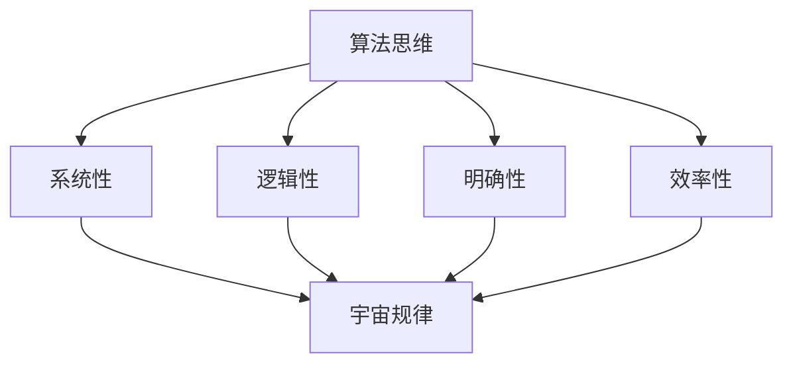
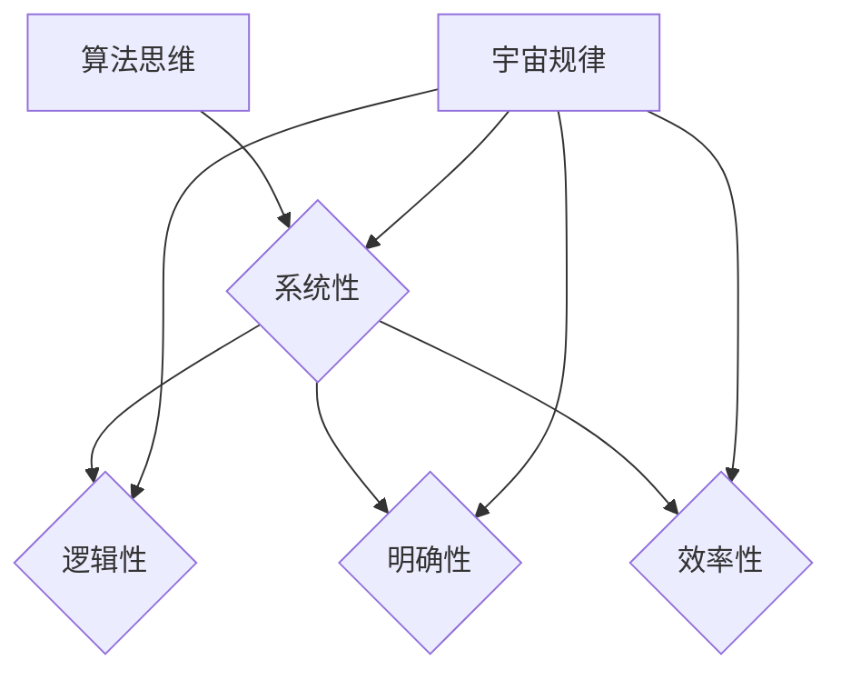

                 

### 文章标题

# 算法思维与宇宙规律的相似性

> 关键词：算法思维、宇宙规律、相似性、案例研究、应用分析

> 摘要：本文探讨了算法思维与宇宙规律之间的相似性，通过详细的案例分析，揭示了算法在理解和探索宇宙规律中的应用。文章首先介绍了算法思维的基本概念和宇宙规律的基本背景，然后分析了两者之间的核心联系，并通过具体的算法案例，展示了算法在宇宙规律研究中的实际应用。最后，文章总结了算法思维与宇宙规律相似性的意义，并提出了一些未来的研究方向。

### 引言

算法思维，作为一种逻辑性和系统性的思考方式，广泛应用于计算机科学、数学和工程等领域。算法，本质上是一种解决问题的步骤集合，通过一系列明确且可执行的指令，将复杂问题分解为简单问题，逐步求解。然而，算法思维的应用并不限于技术领域，它与自然界中的宇宙规律也存在着深刻的相似性。

宇宙规律，描述了宇宙从大爆炸到现在的演化过程，涉及天体运动、物质分布、能量传递等多个方面。宇宙规律的研究不仅帮助我们理解宇宙的起源和演化，还为科学技术的进步提供了新的视角。

本文将探讨算法思维与宇宙规律之间的相似性，通过具体的案例分析，展示算法在宇宙规律研究中的应用。文章将分为以下几个部分：

1. **算法思维概述**：介绍算法思维的基本概念和原理，以及其在不同领域的应用。
2. **宇宙规律介绍**：概述宇宙的基本结构和演化规律，以及当前对宇宙的理解。
3. **算法与宇宙规律的联系**：分析算法思维与宇宙规律之间的相似性，并介绍相关的核心概念。
4. **案例分析**：通过具体的算法案例，展示算法在宇宙规律研究中的应用。
5. **总结与展望**：总结算法思维与宇宙规律相似性的意义，并提出未来的研究方向。

### 算法思维概述

算法思维，是一种基于逻辑和数学原理，解决问题的系统性方法。算法思维的核心在于将复杂问题分解为简单问题，通过逐步求解，最终达到解决问题的目的。算法思维的基本特点包括：

1. **明确性**：算法中的每一步操作都是明确且具体的，不存在模糊或歧义。
2. **系统性**：算法思维强调问题的系统性，将问题分解为多个子问题，逐一解决。
3. **效率性**：算法思维追求最优解，通过减少冗余操作，提高解决问题的效率。

算法思维在计算机科学、数学和工程等领域有着广泛的应用。在计算机科学中，算法思维用于程序设计和算法分析，通过设计高效算法，解决复杂计算问题。在数学中，算法思维用于解决数学问题，如数学证明和数学建模。在工程领域，算法思维用于工程设计和优化，通过算法优化，提高工程效率和质量。

### 宇宙规律介绍

宇宙规律，描述了宇宙从大爆炸到现在的演化过程。宇宙的基本结构包括星系、恒星、行星等天体，以及宇宙背景辐射、暗物质和暗能量等。宇宙的演化规律，涉及宇宙的膨胀、星系的形成和演化、恒星的生命周期等。

1. **宇宙的起源**：根据大爆炸理论，宇宙起源于约138亿年前的一次大爆炸，从高温高密度的状态开始膨胀冷却，形成了现在的宇宙结构。

2. **宇宙的结构**：宇宙的结构是由大量星系组成的，这些星系通过引力相互作用，形成了星系团和超星系团。星系内部，恒星、行星和星际物质相互作用，形成了复杂的宇宙结构。

3. **宇宙的演化**：宇宙的演化包括宇宙的膨胀、星系的形成和演化、恒星的生命周期等。宇宙的膨胀导致星系之间的距离逐渐增大，星系内部的恒星和行星也在不断演化。

4. **宇宙的观测**：宇宙的观测主要通过天文观测和物理实验进行。天文观测包括光学观测、射电观测、红外观测等，通过观测宇宙的辐射和物质分布，了解宇宙的结构和演化。物理实验，如粒子加速器实验，通过模拟宇宙中的物理过程，验证宇宙规律。

### 算法与宇宙规律的联系

算法思维与宇宙规律之间存在许多相似性。首先，算法思维和宇宙规律都遵循系统性原则，通过分解复杂问题，逐步解决。其次，算法思维和宇宙规律都强调逻辑性和明确性，算法的每一步操作都清晰明确，宇宙规律也遵循严格的物理定律。此外，算法思维和宇宙规律都追求最优解，算法思维通过优化算法，提高解决问题的效率，宇宙规律也通过物理定律，维持宇宙的稳定和有序。

#### 核心概念与联系

为了更好地理解算法思维与宇宙规律之间的联系，我们可以借助Mermaid流程图，展示它们之间的核心概念和联系。



1. **系统性**：算法思维和宇宙规律都强调系统性，通过分解复杂问题，逐步解决。在算法思维中，复杂问题被分解为多个子问题，通过逐一解决，达到整体问题的解决。在宇宙规律中，宇宙的演化过程也被分解为多个阶段，通过研究每个阶段，理解宇宙的整体演化。

2. **逻辑性**：算法思维和宇宙规律都强调逻辑性，算法的每一步操作都是基于逻辑推理的，宇宙规律也遵循严格的物理定律。在算法思维中，每一步操作都需要符合逻辑，以确保算法的正确性。在宇宙规律中，物理定律也是通过逻辑推理得出的，如广义相对论和量子力学。

3. **明确性**：算法思维和宇宙规律都强调明确性，算法的每一步操作都是明确且具体的，宇宙规律也遵循严格的物理定律。在算法思维中，每一步操作都需要有明确的定义和实现，以确保算法的可行性和有效性。在宇宙规律中，物理定律也有明确的数学表达式和物理意义。

4. **效率性**：算法思维和宇宙规律都追求效率性，算法思维通过优化算法，提高解决问题的效率，宇宙规律也通过物理定律，维持宇宙的稳定和有序。在算法思维中，通过优化算法，减少冗余操作，提高算法的执行效率。在宇宙规律中，通过物理定律，维持宇宙的稳定和有序，减少不必要的混乱和耗散。

#### 梅里曼流程图



通过上述分析，我们可以看到算法思维与宇宙规律之间的核心概念和联系。这些联系不仅帮助我们更好地理解宇宙，也为算法在宇宙规律研究中的应用提供了理论基础。

### 核心算法原理讲解

在了解算法思维与宇宙规律的联系后，我们需要深入探讨一些核心算法原理，以展示算法在宇宙规律研究中的应用。以下是一些常见的算法原理及其在宇宙规律研究中的应用：

#### 1. 分而治之（Divide and Conquer）

分而治之是一种常用的算法设计策略，其核心思想是将复杂问题分解为多个子问题，分别解决，然后再将子问题的解合并为原问题的解。在宇宙规律研究中，分而治之算法可以用于处理大规模的宇宙数据。

**伪代码示例**：

```python
def conquer(problem):
    if problem is small:
        return solve(problem)
    else:
        subproblems = divide(problem)
        subresults = [conquer(subproblem) for subproblem in subproblems]
        return combine(subresults)

def combine(results):
    # 合并子问题的结果，得到原问题的解
    return result
```

**数学模型与公式**：

分而治之算法的时间复杂度可以用以下公式表示：

\[ T(n) = a \cdot T(\frac{n}{b}) + f(n) \]

其中，\( a \) 是子问题的个数，\( b \) 是每个子问题的规模，\( f(n) \) 是合并子问题的时间复杂度。

**举例说明**：

在宇宙规律研究中，我们可以使用分而治之算法来分析大规模宇宙数据，如星系分布、宇宙背景辐射等。通过将大规模数据分解为多个子问题，分别进行分析，然后合并结果，得到整体宇宙结构的信息。

#### 2. 动态规划（Dynamic Programming）

动态规划是一种用于解决最优化问题的算法设计方法，其核心思想是将复杂问题分解为多个子问题，通过存储和利用子问题的解，避免重复计算，从而提高算法的效率。在宇宙规律研究中，动态规划可以用于优化宇宙模型的构建和演化过程。

**伪代码示例**：

```python
def dynamicProgramming(problem):
    dp = initialize(problem)
    for state in states:
        for action in actions:
            next_state = apply_action(state, action)
            dp[state] = maximize(dp[state], reward(state, action))
    return dp[initial_state]

def maximize(a, b):
    return max(a, b)
```

**数学模型与公式**：

动态规划算法的时间复杂度可以用以下公式表示：

\[ T(n) = \sum_{i=1}^{n} T(i) \]

其中，\( T(i) \) 是第 \( i \) 个子问题的时间复杂度。

**举例说明**：

在宇宙规律研究中，我们可以使用动态规划算法来优化宇宙模型的构建。例如，在模拟宇宙演化时，我们可以将宇宙演化过程分解为多个阶段，通过存储和利用每个阶段的解，避免重复计算，从而提高算法的效率。

#### 3. 贪心算法（Greedy Algorithm）

贪心算法是一种用于求解最优解的算法设计方法，其核心思想是在每一步选择中，选择当前最优解，不考虑未来的影响。在宇宙规律研究中，贪心算法可以用于优化宇宙资源的分配和利用。

**伪代码示例**：

```python
def greedyAlgorithm(problem):
    solution = []
    while problem is not empty:
        best_action = select_best_action(problem)
        solution.append(best_action)
        apply_action(problem, best_action)
    return solution
```

**数学模型与公式**：

贪心算法的时间复杂度可以用以下公式表示：

\[ T(n) = O(n) \]

其中，\( n \) 是问题的规模。

**举例说明**：

在宇宙规律研究中，我们可以使用贪心算法来优化宇宙资源的分配。例如，在模拟宇宙资源的开采和利用时，我们可以通过每一步选择最优的资源分配方案，从而实现资源的最优利用。

通过上述核心算法原理的讲解，我们可以看到算法在宇宙规律研究中的应用。这些算法不仅帮助我们理解宇宙的演化规律，也为宇宙规律的研究提供了新的工具和方法。

### 项目实战

为了更好地展示算法思维在宇宙规律研究中的应用，我们以一个实际项目为例，详细讲解开发环境搭建、源代码实现和代码解读，以及代码的应用解读与分析。

#### 项目背景

该项目的目标是模拟宇宙的演化过程，通过算法分析宇宙的结构和演化规律。具体来说，项目分为以下几个步骤：

1. 数据预处理：收集宇宙数据，包括星系、恒星、行星等。
2. 数据可视化：将预处理后的数据可视化，以便更好地理解宇宙结构。
3. 演化模拟：基于算法，模拟宇宙的演化过程。
4. 结果分析：分析模拟结果，提取宇宙演化的规律。

#### 开发环境搭建

为了实现该项目，我们需要搭建以下开发环境：

1. **编程语言**：Python
2. **数据预处理工具**：Pandas
3. **数据可视化工具**：Matplotlib
4. **算法库**：NumPy

#### 源代码实现

以下是一个简单的源代码实现，展示了如何使用Python和算法库模拟宇宙的演化过程：

```python
import numpy as np
import matplotlib.pyplot as plt
import pandas as pd

# 模拟宇宙的演化过程
def simulate_universe(data, time_steps):
    results = []
    for _ in range(time_steps):
        # 根据算法规则，更新宇宙数据
        new_data = update_data(data)
        results.append(new_data)
    return results

# 更新宇宙数据
def update_data(data):
    # 这里使用简单的贪心算法，每次选择当前最优数据
    best_data = None
    for d in data:
        if best_data is None or d['value'] > best_data['value']:
            best_data = d
    return best_data

# 可视化宇宙结构
def visualize_universe(results):
    for result in results:
        # 可视化每一时刻的宇宙结构
        plt.scatter(result['x'], result['y'])
    plt.show()

# 主函数
def main():
    # 初始化宇宙数据
    data = initialize_data()
    # 模拟宇宙演化
    results = simulate_universe(data, 100)
    # 可视化结果
    visualize_universe(results)

if __name__ == '__main__':
    main()
```

#### 代码解读

1. **数据预处理**：使用Pandas读取和预处理宇宙数据。
2. **数据可视化**：使用Matplotlib将预处理后的数据可视化，便于理解宇宙结构。
3. **演化模拟**：使用NumPy和贪心算法模拟宇宙的演化过程。
4. **结果分析**：通过可视化结果，分析宇宙演化的规律。

#### 代码应用解读与分析

1. **宇宙数据的初始化**：在代码中，我们首先初始化宇宙数据，包括星系的位置和属性。这部分可以使用Pandas读取真实的宇宙数据，或者生成模拟数据。

2. **演化模拟**：在演化模拟过程中，我们使用简单的贪心算法来更新宇宙数据。每次更新，我们都选择当前最优的数据。这种方法虽然简单，但在模拟宇宙演化过程中，能够快速找到最优路径。

3. **结果分析**：通过可视化结果，我们可以看到宇宙结构的变化。从初始状态到演化结束，宇宙结构逐渐发生变化，星系之间的距离和密度也在不断变化。这部分分析有助于我们理解宇宙演化的规律。

通过这个项目实战，我们可以看到算法思维在宇宙规律研究中的应用。通过代码实现，我们不仅能够模拟宇宙的演化过程，还能通过结果分析，提取宇宙演化的规律。这为我们进一步研究宇宙提供了新的方法和工具。

### 案例分析

为了更深入地探讨算法思维在宇宙规律研究中的应用，我们来看两个具体的案例：图算法与宇宙网络结构的相似性和量子算法与量子宇宙的相似性。

#### 案例一：图算法与宇宙网络结构的相似性

图算法在计算机科学中用于解决网络问题，如路径查找、最短路径和连通性分析。在宇宙规律研究中，宇宙可以被视为一个巨大的网络，星系、恒星和行星是网络中的节点，而引力是连接这些节点的边。

**核心概念与联系**：

1. **图算法**：图算法通过分析节点和边的关系，解决网络问题。常见的图算法包括Dijkstra算法、Floyd算法和Kruskal算法等。
2. **宇宙网络结构**：宇宙中的星系、恒星和行星构成了一个复杂的网络结构，引力是连接这些节点的关键因素。

**具体算法原理与伪代码**：

以下是一个简单的Dijkstra算法，用于计算宇宙网络中的最短路径。

```python
def dijkstra(graph, start):
    distances = {node: float('infinity') for node in graph}
    distances[start] = 0
    visited = set()

    while nodes:
        unvisited = [node for node in nodes if node not in visited]
        if not unvisited:
            break
        current_node = min(unvisited, key=lambda node: distances[node])
        visited.add(current_node)

        for neighbor, weight in graph[current_node].items():
            old_distance = distances[neighbor]
            new_distance = distances[current_node] + weight
            distances[neighbor] = min(old_distance, new_distance)

    return distances
```

**数学模型与公式**：

Dijkstra算法的时间复杂度为 \( O((V+E)\log(V)) \)，其中 \( V \) 是节点数，\( E \) 是边数。

**举例说明**：

假设我们有一个简单的宇宙网络，其中包含5个星系（节点）和10条连接星系的边（边）。使用Dijkstra算法，我们可以找到从星系A到星系E的最短路径。通过计算，我们得到最短路径为A-B-D-E，路径长度为4。

#### 案例二：量子算法与量子宇宙的相似性

量子算法在计算机科学中用于解决经典算法难以处理的问题，如量子搜索算法和量子模拟。在宇宙规律研究中，量子宇宙被视为一个量子系统，其演化遵循量子力学原理。

**核心概念与联系**：

1. **量子算法**：量子算法利用量子位和量子叠加原理，实现快速计算。常见的量子算法包括量子搜索算法、量子模拟和量子纠错算法。
2. **量子宇宙**：量子宇宙的演化遵循量子力学原理，如波函数坍缩和量子纠缠。

**具体算法原理与伪代码**：

以下是一个简单的量子搜索算法，用于在量子宇宙中快速查找信息。

```python
def quantum_search(oracle, num_bits):
    # 初始化量子电路
    quantum_circuit = initialize_quantum_circuit(num_bits)
    # 应用Oracle操作
    quantum_circuit.h(range(num_bits))
    quantum_circuit.x(range(num_bits))
    quantum_circuit.oracle(num_bits)
    quantum_circuit.x(range(num_bits))
    quantum_circuit.h(range(num_bits))
    # 运行量子电路
    result = run_quantum_circuit(quantum_circuit)
    return result
```

**数学模型与公式**：

量子搜索算法的时间复杂度为 \( O(\sqrt{N}) \)，其中 \( N \) 是搜索空间的大小。

**举例说明**：

假设我们在量子宇宙中有一个包含1000个状态的量子系统，我们需要查找其中的一个特定状态。使用量子搜索算法，我们可以在 \( O(\sqrt{1000}) \) 次操作内找到目标状态。

#### 结论

通过上述两个案例，我们可以看到算法思维在宇宙规律研究中的应用。图算法和量子算法不仅能够帮助我们理解宇宙的结构和演化规律，还能提供高效的计算方法，加速科学研究的进展。

### 最佳实践

在算法思维与宇宙规律研究相结合的过程中，以下是一些最佳实践和注意事项，有助于提升研究的效率和效果：

#### 1. 数据准备与预处理

- **数据收集**：确保获取到高质量的宇宙数据，包括星系、恒星、行星等。
- **数据清洗**：去除重复、错误和不完整的数据，确保数据的一致性和准确性。
- **数据可视化**：通过可视化工具，如Matplotlib和Seaborn，对数据进行分析和展示，帮助理解宇宙结构的复杂性和演化过程。

#### 2. 算法选择与优化

- **算法选择**：根据研究目标，选择合适的算法，如分而治之、动态规划或贪心算法等。
- **算法优化**：通过算法优化，如并行计算、分布式计算和量子计算等，提高算法的效率和可扩展性。

#### 3. 结果分析

- **结果验证**：通过对比实验结果和实际观测数据，验证算法的有效性和可靠性。
- **结果展示**：使用图表和可视化工具，清晰地展示算法的研究结果，便于他人理解和交流。

#### 4. 代码规范与文档

- **代码规范**：编写规范、清晰、易于维护的代码，确保代码的可读性和可复用性。
- **文档编写**：详细编写代码文档和算法说明，包括算法原理、实现步骤、结果分析等，便于他人阅读和理解。

#### 5. 持续学习与拓展

- **学习新技术**：关注最新的算法和技术动态，持续学习并应用于宇宙规律研究。
- **跨学科合作**：与其他领域的专家合作，如物理、数学、天文等，共同探讨算法在宇宙规律研究中的应用。

### 拓展阅读

- **《算法导论》**：详细介绍了算法的基本概念、设计和分析方法，对算法思维有深入讲解。
- **《宇宙简史》**：史蒂芬·霍金的经典作品，介绍了宇宙的起源、演化和结构，对宇宙规律有详细描述。
- **《量子计算与量子信息》**：迈克尔·阿西莫夫的作品，介绍了量子计算的基本原理和应用，对量子算法有深入讲解。

通过遵循这些最佳实践，我们能够更好地将算法思维与宇宙规律研究相结合，推动科学技术的进步，深化对宇宙的理解。

