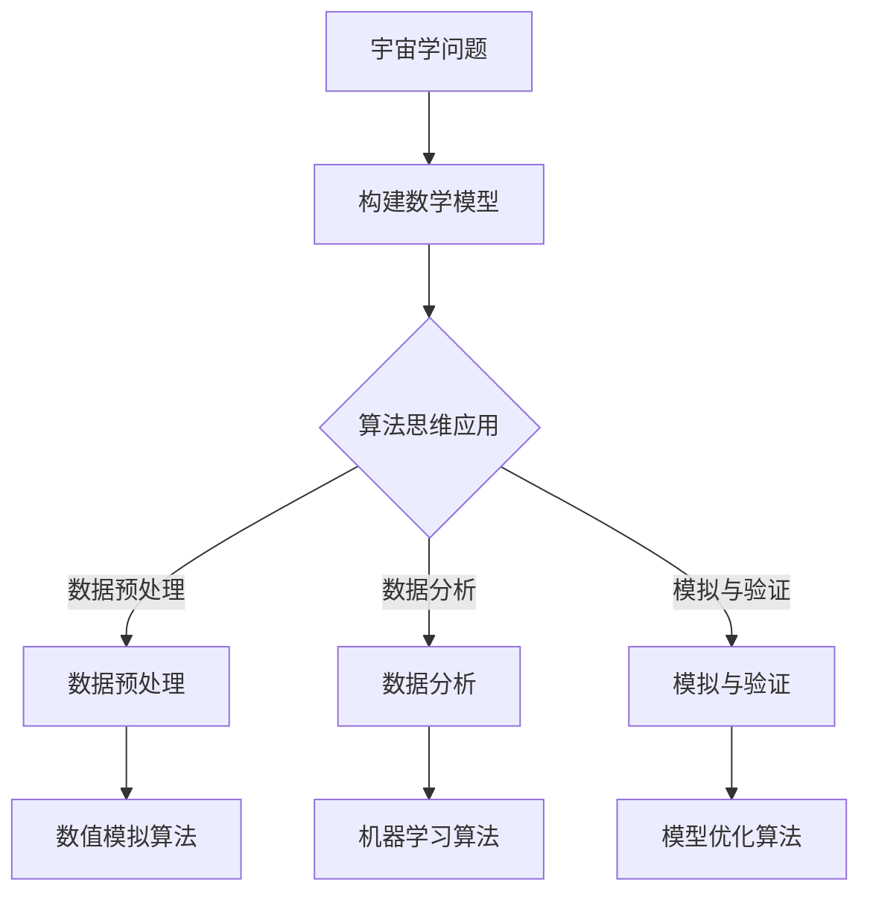
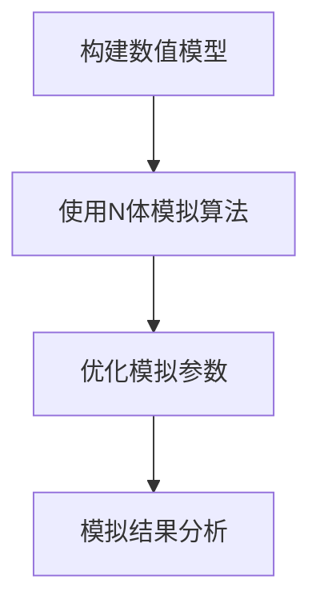
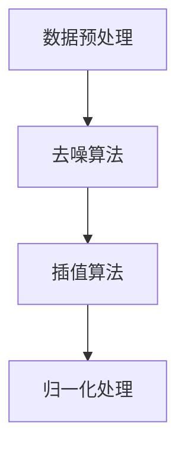
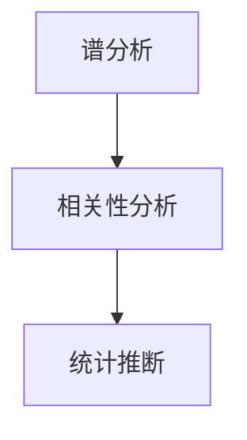
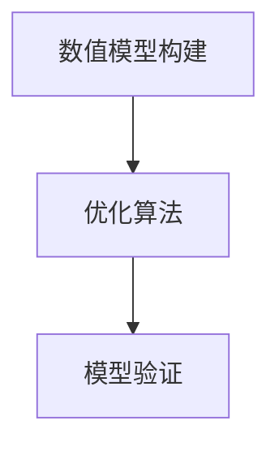
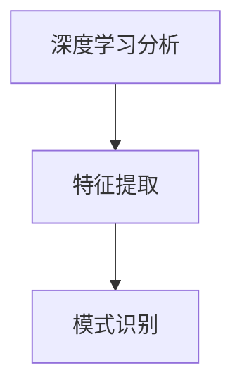

                 

## 引言

### 宇宙学大统一理论的背景与挑战

宇宙学大统一理论，简称大统一理论（Grand Unified Theory，GUT），是一种旨在整合四种基本作用力——引力、电磁力、弱相互作用力和强相互作用力的理论框架。这四种力分别描述了宇宙中不同的物理现象，但至今仍缺乏一种统一的理论来解释它们之间的关系。引力由广义相对论描述，电磁力和弱相互作用力由量子电动力学和弱相互作用理论描述，而强相互作用力由量子色动力学描述。

大统一理论的目标在于提供一个更基础的理论框架，将这四种基本力统一在一个更加简洁和自洽的理论体系中。然而，这一目标面临着巨大的挑战。首先，引力与量子理论的融合是一个长期未解的难题，因为广义相对论是一个经典理论，而量子力学是一个量子理论，二者之间的数学表述和哲学基础存在显著差异。其次，各种基本力之间的相互作用的机制和机制背后的物理原理尚未完全明确，这需要深入的研究和实验验证。

尽管如此，大统一理论的研究具有重要的科学价值。它不仅可能揭示宇宙的基本结构和运作原理，还能为粒子物理学、宇宙学、甚至其他学科的发展提供新的思路和方法。因此，寻找大统一理论成为了现代物理学研究的一个重要方向。

### 算法思维在大统一理论中的应用潜力

算法思维，作为现代计算机科学的核心方法论，正越来越多地被应用于科学研究中。算法思维不仅能够提高数据分析的效率，还能帮助科学家更好地理解和解释复杂的物理现象。在宇宙学大统一理论的研究中，算法思维的应用潜力尤为突出。

首先，算法思维可以为宇宙学提供强大的计算工具。宇宙学中的许多问题，如宇宙背景微波辐射的观测数据分析、黑洞和引力波的模拟、宇宙膨胀的研究等，都需要大量的计算资源。算法思维能够通过优化计算流程、提高算法效率，从而加速这些研究进程。

其次，算法思维有助于揭示宇宙学现象背后的规律。通过算法对大量宇宙学数据的处理和分析，科学家可以挖掘出隐藏在数据中的规律和模式。这些规律和模式不仅能够帮助我们更好地理解宇宙的运行机制，还可能为寻找大统一理论提供新的线索。

最后，算法思维能够促进宇宙学与计算机科学的交叉融合。随着计算机技术的不断发展，算法设计者和宇宙学家之间的合作将更加紧密，共同探索宇宙学的未知领域。这种跨学科的融合不仅能够推动宇宙学研究的进步，也有助于算法思维的进一步发展和完善。

### 文章关键词

宇宙学、大统一理论、算法思维、计算工具、数据分析、物理现象、跨学科融合

### 摘要

本文旨在探讨算法思维在解决宇宙学大统一理论中的应用。首先，我们介绍了宇宙学大统一理论的背景和挑战，以及算法思维在科学研究中日益增多的应用潜力。随后，文章分为三个部分，详细阐述了算法思维在宇宙学基础知识中的应用、算法思维在宇宙学中的具体应用、以及算法思维在宇宙学大统一理论中的研究进展。通过具体实例和流程图，本文展示了算法思维如何帮助科学家理解和解释宇宙学中的复杂现象，并展望了算法思维在未来宇宙学研究中的发展方向。

## 第一部分：宇宙学基础知识

### 第1章：宇宙学的核心概念

#### 1.1 宇宙学的定义与发展历程

宇宙学是研究宇宙的起源、结构、演化和最终命运的科学。它起源于古代文明对天文现象的观察和解释，如古代中国的《天文志》、古希腊的天文学等。随着科学技术的发展，宇宙学逐渐成为一门独立的科学领域。

宇宙学的现代发展可以追溯到20世纪初。当时，爱因斯坦提出了广义相对论，这一理论成功地描述了引力和时空的关系，为宇宙学的研究奠定了基础。随后，哈勃的观测结果表明宇宙正在膨胀，这一发现推动了宇宙学的发展，并引发了关于宇宙起源和演化的深入探讨。

在20世纪中叶，宇宙背景微波辐射的发现进一步证实了宇宙大爆炸理论，这一理论认为宇宙起源于一个高度密集、高温的状态，随后经历了快速膨胀和冷却过程。宇宙背景微波辐射的发现提供了宇宙早期状态的重要证据，为宇宙学的研究提供了新的方向。

#### 1.2 宇宙的组成与结构

宇宙的组成主要包括物质和能量。物质可以分为普通物质和暗物质。普通物质包括星系、行星、恒星等可见物质，而暗物质则是一种不发光、不吸收光线的物质，但其存在通过引力效应得到证实。能量方面，宇宙中存在大量的暗能量，这种能量与暗物质一起驱动着宇宙的加速膨胀。

宇宙的结构可以分为多个层次。首先是星系，它们由恒星、行星、气体和暗物质组成。星系之间通过引力相互作用形成星系团，进一步形成更大的超星系团。这些结构层次构成了宇宙的宏观结构，而宇宙的微观结构则包括原子、分子和基本粒子等。

#### 1.3 宇宙学的基本定律与理论

宇宙学的基本定律和理论为研究宇宙的起源和演化提供了重要的指导。首先是宇宙大爆炸理论，这一理论认为宇宙起源于一个高温、高密度的奇点，随后经历快速膨胀和冷却。大爆炸理论的核心证据是宇宙背景微波辐射的发现，这一辐射被认为是宇宙早期状态的热辐射残留。

其次是哈勃定律，该定律表明宇宙中的星系都在相互远离，距离越远的星系远离速度越快。这一现象支持了宇宙膨胀的理论，并揭示了宇宙的加速膨胀趋势。哈勃定律的发现使得宇宙学的研究从静态的宇宙观转变为动态的宇宙观。

另外，宇宙学中还有一些重要的理论，如暗物质理论和暗能量理论。暗物质理论解释了星系旋转速度与观测到的恒星质量之间的不一致性，而暗能量理论则解释了宇宙加速膨胀的现象。这些理论共同构成了宇宙学的核心框架，为我们理解宇宙的起源、演化和未来提供了重要的线索。

通过本章的介绍，我们初步了解了宇宙学的基本概念、组成和基本理论。这些知识将为后续章节中算法思维在宇宙学中的应用提供必要的理论基础。

### 第2章：宇宙学中的数学模型

#### 2.1 宇宙背景微波辐射

宇宙背景微波辐射（Cosmic Background Microwave Radiation，CBMR）是宇宙学中极为重要的观测数据，它为我们提供了宇宙早期状态的关键信息。宇宙背景微波辐射是在宇宙大爆炸后约38万年冷却过程中产生的，其温度约为2.7开尔文。

宇宙背景微波辐射的发现是宇宙大爆炸理论的重要证据。这一辐射在各个方向上均匀分布，且具有黑体辐射谱的特征，这表明宇宙在大爆炸后经历了均匀冷却的过程。通过对宇宙背景微波辐射的观测和分析，科学家能够推断出宇宙的早期状态，如宇宙的密度、温度和结构形成过程等。

在宇宙学中，宇宙背景微波辐射的数据分析是一项复杂而重要的任务。算法思维在这一过程中发挥了重要作用。科学家使用各种算法来处理宇宙背景微波辐射数据，包括信号处理算法、数据分析算法和统计推断算法等。这些算法能够有效地识别和提取数据中的有用信息，帮助我们更好地理解宇宙的早期状态和演化过程。

#### 2.2 黑洞与引力波

黑洞是宇宙中最神秘和奇特的天体之一。它是由质量非常大的恒星坍缩形成的，拥有极强的引力，以至于连光也无法逃脱。黑洞的存在和性质一直是宇宙学研究的热点问题。近年来，引力波的发现为黑洞的研究提供了新的手段和视角。

引力波是由质量加速运动产生的时空涟漪，它能够在宇宙中传播。爱因斯坦在1916年的广义相对论中预言了引力波的存在，但直到2015年，人类才首次直接探测到引力波，这一发现为黑洞的研究打开了新的窗口。

在宇宙学中，黑洞和引力波的研究是一项挑战性任务。算法思维在这一过程中发挥了关键作用。科学家使用各种算法来模拟和预测黑洞的行为，包括数值模拟算法、数据分析算法和统计推断算法等。这些算法能够帮助我们更好地理解黑洞的性质和演化过程，揭示宇宙中隐藏的秘密。

#### 2.3 宇宙膨胀与暗能量

宇宙膨胀是指宇宙中的空间在时间上不断扩展的现象。哈勃定律揭示了宇宙膨胀的基本特征，即宇宙中的星系都在相互远离，距离越远的星系远离速度越快。宇宙膨胀的研究对于理解宇宙的起源、演化和未来具有重要意义。

暗能量是驱动宇宙加速膨胀的力量。它与宇宙背景辐射和宇宙膨胀密切相关，但至今其本质尚未完全理解。暗能量的研究是现代宇宙学的一个重要方向，涉及到大量的数据分析和理论探讨。

在宇宙膨胀和暗能量的研究中，算法思维同样发挥了重要作用。科学家使用各种算法来分析宇宙膨胀的数据，包括数据分析算法、统计推断算法和机器学习算法等。这些算法能够帮助我们更好地理解宇宙膨胀的机制和暗能量的性质，揭示宇宙加速膨胀的奥秘。

通过本章的介绍，我们了解了宇宙学中几个关键数学模型的背景和应用。这些模型不仅是宇宙学研究的重要基础，也为算法思维在宇宙学中的应用提供了广阔的空间。在接下来的章节中，我们将进一步探讨算法思维在宇宙学中的具体应用和研究成果。

### 第3章：算法思维的核心概念

#### 3.1 算法的定义与特点

算法是计算机科学和数学中的基础概念，指的是解决问题的一系列明确和可执行的步骤。算法的特点包括：确定性、顺序性、有限性和有效性。确定性意味着算法在相同的输入下总是产生相同的输出；顺序性指的是算法步骤必须按照一定的顺序执行；有限性表示算法必须在有限的时间内完成；有效性则要求算法能够在可接受的计算资源下解决问题。

算法与程序的关系紧密，程序是算法的具体实现，而算法是程序设计的理论依据。在算法设计中，关键任务是设计一个能够高效解决问题的算法，并在计算机上实现它。

#### 3.2 算法设计的原则与方法

算法设计是计算机科学中的一项重要任务，其原则和方法决定了算法的效率和正确性。以下是几个常见的算法设计原则和方法：

1. **选择合适的数据结构**：数据结构是算法的重要组成部分，合适的数据结构可以提高算法的效率和空间利用率。例如，在处理大量数据时，选择数组或链表等线性数据结构；在处理大量元素查找时，选择哈希表等非线性数据结构。

2. **减少重复计算**：通过动态规划、分治算法等策略，减少重复计算，提高算法的效率。例如，动态规划通过保存中间结果避免重复计算，分治算法通过递归地将问题分解为规模较小的子问题，然后合并这些子问题的解。

3. **优化时间复杂度和空间复杂度**：算法的复杂度是评估算法性能的重要指标，包括时间复杂度和空间复杂度。优化算法的复杂度，可以使算法在处理大规模问题时更加高效。常见的方法包括优化代码逻辑、使用更高效的算法和数据结构等。

4. **使用适当的算法设计技巧**：不同的算法设计技巧适用于不同类型的问题。例如，贪心算法适用于局部最优解的策略问题，动态规划适用于具有最优子结构的问题，回溯算法适用于组合优化问题。

5. **进行算法分析和验证**：算法设计完成后，需要对其进行分析和验证，以确保算法的正确性和效率。分析方法包括时间复杂度和空间复杂度的计算，以及算法的正确性证明等。验证方法包括单元测试、集成测试和性能测试等。

#### 3.3 算法的评估与优化

算法评估是评估算法性能的重要环节，主要包括时间复杂度、空间复杂度和正确性等方面。以下是一些常见的算法评估方法：

1. **时间复杂度分析**：通过分析算法的时间复杂度，可以了解算法在不同输入规模下的性能。常见的时间复杂度表示方法有O、Ω和θ表示法。通过时间复杂度分析，可以判断算法是否高效，以及是否需要进一步优化。

2. **空间复杂度分析**：空间复杂度是评估算法在执行过程中所需存储空间的重要指标。通过分析空间复杂度，可以了解算法在处理大规模问题时所需的空间资源，从而避免资源不足的问题。

3. **正确性证明**：算法的正确性是算法设计的重要目标之一。通过数学证明或经验验证，可以确保算法能够正确地解决给定的问题。

算法优化是提高算法性能的重要手段，可以通过以下方法实现：

1. **优化算法逻辑**：通过优化算法的内部逻辑，可以减少不必要的计算和操作，提高算法的效率。例如，使用更高效的算法替换原始算法，或者对原始算法进行改进。

2. **改进数据结构**：选择更适合问题需求的数据结构，可以提高算法的效率。例如，使用哈希表代替链表进行元素查找，或者使用树结构进行排序和查找。

3. **并行计算**：通过并行计算，可以充分利用多核处理器的计算能力，提高算法的执行效率。常见的方法包括任务并行和数据并行等。

4. **算法组合**：将多个算法组合使用，可以解决更复杂的问题。例如，将贪心算法与动态规划结合使用，可以解决更复杂的组合优化问题。

通过本章的介绍，我们了解了算法思维的核心概念、设计原则和方法，以及算法评估和优化的方法。这些知识为后续章节中算法思维在宇宙学中的应用奠定了基础。在接下来的章节中，我们将深入探讨算法思维在宇宙学中的具体应用和研究成果。

### 第4章：算法在宇宙学中的具体应用

#### 4.1 算法在宇宙学数据分析中的应用

宇宙学数据分析是宇宙学研究的重要环节，涉及到大量数据的处理、分析和解释。算法在这一过程中发挥着关键作用，帮助科学家从复杂的数据中提取有价值的信息。以下是算法在宇宙学数据分析中的一些具体应用：

**1. 数据预处理：** 在进行数据分析之前，首先需要将原始数据清洗和预处理，包括去除噪声、填充缺失值、归一化处理等。算法在这一过程中使用各种预处理技术，如滤波算法、插值算法等，以提高数据的可靠性和质量。

**2. 数据可视化：** 数据可视化是将数据以图形化方式展示的重要手段，有助于科学家直观地理解和分析数据。算法在这一过程中使用各种数据可视化技术，如散点图、直方图、热力图等，以便更好地发现数据中的规律和模式。

**3. 数据分类与聚类：** 在宇宙学数据分析中，分类和聚类算法用于识别数据中的不同类别和聚类结构。例如，支持向量机（SVM）和K-means算法常用于星系分类和星系团的识别。这些算法通过将数据划分为不同的类别或簇，有助于揭示宇宙结构的特征和演化过程。

**4. 数据回归分析：** 回归分析是用于预测和分析数据之间关系的统计方法。在宇宙学中，回归分析用于研究宇宙膨胀、星系运动等物理现象。算法如线性回归、非线性回归和广义线性模型等，可以帮助科学家建立数据之间的定量关系，并进行预测。

**5. 机器学习：** 机器学习算法在宇宙学数据分析中应用广泛，可以用于特征提取、异常检测、模式识别等任务。例如，深度学习算法如卷积神经网络（CNN）和递归神经网络（RNN）可以用于图像处理和语音识别，而传统机器学习算法如决策树和随机森林则可以用于天文数据的分类和回归分析。

**6. 数据融合与集成：** 宇宙学中的多波段数据、多源数据和多尺度数据需要通过算法进行融合和集成。算法如贝叶斯网络和最大期望算法（EM算法）可以用于数据融合，以提高数据分析的准确性和全面性。

#### 4.2 算法在宇宙学模拟中的应用

宇宙学模拟是利用计算机模拟宇宙的演化过程，以理解和预测宇宙的结构和现象。算法在宇宙学模拟中扮演着核心角色，以下是一些具体应用：

**1. 模拟方法：** 宇宙学模拟常用的方法包括N体模拟、光滑粒子流体动力学（SPH）模拟和宇宙网络模拟等。这些方法通过数值计算模拟宇宙中的物理过程，如引力相互作用、星系形成和恒星演化等。

**2. 数值算法：** 在宇宙学模拟中，数值算法用于解决物理方程和计算宇宙的演化。例如，引力算法如N体模拟中的牛顿方法和积分算法如欧拉法和龙格-库塔法等，用于模拟宇宙中的引力相互作用和运动过程。

**3. 模拟优化：** 为了提高模拟的精度和效率，需要优化模拟算法。常见的优化方法包括并行计算、网格划分和自适应时间步长等。这些方法可以加速模拟过程，并提高结果的可靠性。

**4. 模拟验证：** 宇宙学模拟的结果需要通过观测数据进行验证，以检验模拟的可靠性和有效性。算法在这一过程中用于数据分析、模型比较和误差分析等，以确保模拟结果与观测数据的一致性。

#### 4.3 算法在宇宙学预测中的应用

宇宙学预测是利用算法和模拟结果对宇宙的未来进行预测，以揭示宇宙的演化趋势和潜在现象。以下是算法在宇宙学预测中的具体应用：

**1. 预测模型：** 宇宙学预测通常建立在大数据分析、机器学习和数值模拟的基础上。预测模型可以通过分析历史数据和模拟结果，建立宇宙演化的预测模型。

**2. 模拟结果分析：** 通过对宇宙学模拟结果的分析，可以预测宇宙的未来演化。例如，通过对宇宙网络模拟的分析，可以预测宇宙中星系的形成和演化过程，以及暗物质和暗能量的行为。

**3. 异常检测：** 异常检测算法可以用于识别宇宙学模拟中的异常现象，如超新星爆发、星系碰撞等。这些异常现象可能预示着新的物理规律或宇宙演化过程中的关键事件。

**4. 预测验证：** 预测模型需要通过观测数据进行验证，以评估其准确性和可靠性。算法在这一过程中用于观测数据分析和模型评估，以确保预测结果的有效性。

通过本章的介绍，我们了解了算法在宇宙学数据分析、模拟和预测中的具体应用。算法思维在宇宙学中的广泛应用，不仅提高了数据分析的效率和精度，也为宇宙学理论的探索提供了新的工具和方法。在接下来的章节中，我们将进一步探讨算法思维在宇宙学大统一理论中的应用和研究成果。

### 第5章：大统一理论的基本原理

#### 5.1 标准模型的局限性与挑战

标准模型是粒子物理学中描述基本粒子和基本相互作用的理论框架，它包括三个部分：量子场论、电磁力和弱相互作用。然而，标准模型在解释宇宙学现象方面存在一些局限性和挑战。

首先，标准模型无法解释引力。引力是宇宙中最重要的相互作用之一，它决定了宇宙的结构和演化。然而，标准模型是基于量子场论的，而量子场论无法解释引力。这就导致了标准模型在描述宇宙学现象时的不一致性。

其次，标准模型无法解释暗物质和暗能量。暗物质是宇宙中一种不可见的物质，它通过引力效应影响宇宙的结构和演化。然而，标准模型中并没有暗物质的概念，因此无法解释暗物质的存在。同样，暗能量是驱动宇宙加速膨胀的力量，但标准模型也无法解释暗能量的性质和来源。

此外，标准模型无法解释一些基本的物理现象，如宇宙背景微波辐射和宇宙膨胀。尽管宇宙背景微波辐射的发现支持了标准模型，但它并不能完全解释宇宙背景微波辐射的起源和演化。宇宙膨胀的现象同样需要更多的理论解释，而标准模型在这方面显得不足。

#### 5.2 大统一理论的概念框架

大统一理论是一种旨在整合四种基本相互作用（引力、电磁力、弱相互作用和强相互作用）的理论框架。大统一理论的基本原理包括以下几个方面：

首先，大统一理论认为基本粒子可以通过对称性自发地产生相互作用。在量子场论中，基本粒子的相互作用是通过对称性自发地产生的。大统一理论通过引入对称性自发破缺的概念，解释了基本粒子之间的相互作用。

其次，大统一理论通过统一的耦合常数，描述了四种基本相互作用的统一性。在标准模型中，四种基本相互作用的耦合常数是不同的，这导致了它们之间的不一致性。大统一理论通过引入统一的耦合常数，使得四种基本相互作用在理论上可以统一描述。

第三，大统一理论提出了新的基本粒子和相互作用机制。例如，标准模型中的粒子包括夸克和轻子，而大统一理论中还包括了超对称粒子。这些新粒子和新相互作用机制可能为解释宇宙学现象提供新的途径。

#### 5.3 大统一理论中的算法思维

算法思维在大统一理论的研究中扮演了重要角色。算法思维的核心是逻辑推理和问题解决，它可以帮助科学家更好地理解和解决复杂的科学问题。

首先，算法思维可以帮助科学家构建大统一理论的数学模型。大统一理论的数学模型非常复杂，需要通过算法来处理和计算。例如，在构建大统一理论的数学模型时，可以使用数值模拟算法、优化算法和机器学习算法等，以提高模型的准确性和可靠性。

其次，算法思维可以帮助科学家分析大统一理论的实验数据。大统一理论的研究需要大量的实验数据，而这些数据的分析是非常复杂和耗时的。算法思维可以提供有效的工具和方法，帮助科学家从大量数据中提取有用的信息，并进行数据分析和解释。

最后，算法思维可以帮助科学家验证和优化大统一理论。通过算法思维，科学家可以建立各种验证模型，以检验大统一理论的预测和假设。同时，算法思维还可以帮助科学家优化大统一理论的参数和模型，以提高其预测能力。

### Mermaid 流程图

通过以上流程图，我们可以看到算法思维在大统一理论研究中的应用流程。首先，科学家需要构建大统一理论的数学模型，然后使用算法思维对模型进行数据处理、分析、模拟和验证。在这个过程中，算法思维发挥了关键作用，帮助科学家更好地理解和解决复杂的科学问题。

通过本章的介绍，我们了解了大统一理论的基本原理、标准模型的局限性以及算法思维在大统一理论研究中的应用。在接下来的章节中，我们将进一步探讨算法思维在大统一理论中的具体应用和研究成果。

### 第6章：算法在大统一理论中的应用研究

#### 6.1 算法在大统一理论数学模型中的应用

在大统一理论的数学模型构建过程中，算法思维起到了至关重要的作用。大统一理论的数学模型极其复杂，需要处理大量的参数和方程。以下是一些算法在大统一理论数学模型中的应用：

**1. 数值模拟算法：** 数值模拟算法用于求解大统一理论中的微分方程，例如广义相对论和量子场论的耦合方程。常用的数值模拟算法包括欧拉法、龙格-库塔法和蒙特卡罗方法。这些算法可以模拟宇宙的演化和基本粒子的行为，从而验证大统一理论的预测。

**2. 优化算法：** 优化算法用于寻找大统一理论参数的最优解，以提高模型的精确度和可靠性。常用的优化算法包括梯度下降法、粒子群优化算法和遗传算法。这些算法通过不断迭代和调整参数，使得模型能够更好地拟合实验数据。

**3. 机器学习算法：** 机器学习算法在大统一理论中的应用日益增多，可以用于特征提取、模式识别和预测。例如，深度学习算法可以用于分析宇宙学数据，提取隐藏在数据中的复杂模式和关系。常用的机器学习算法包括卷积神经网络（CNN）、递归神经网络（RNN）和决策树等。

**4. 统计推断算法：** 统计推断算法用于评估大统一理论模型的可靠性和预测能力。常用的统计推断算法包括贝叶斯统计和假设检验。这些算法可以帮助科学家确定模型是否能够可靠地描述宇宙现象，并为新的理论假设提供依据。

#### 6.2 算法在大统一理论物理现象中的应用

算法在大统一理论物理现象的研究中也发挥着重要作用。以下是一些具体应用：

**1. 引力波探测：** 引力波是由质量加速运动产生的时空涟漪，是验证大统一理论的重要手段。算法在大统一理论引力波探测中的应用包括数据预处理、信号检测和事件分析等。常用的算法包括滤波算法、信号处理算法和模式识别算法。

**2. 宇宙背景微波辐射分析：** 宇宙背景微波辐射是宇宙早期状态的重要信息，算法在这一领域中的应用包括数据预处理、谱分析和统计推断等。常用的算法包括信号处理算法、数据分析算法和统计推断算法。

**3. 星系形成与演化：** 星系的形成和演化是宇宙学研究的重要课题，算法在这一领域中的应用包括数值模拟、数据分析和模型优化等。常用的算法包括N体模拟算法、光滑粒子流体动力学（SPH）模拟算法和机器学习算法。

**4. 暗物质和暗能量研究：** 暗物质和暗能量是宇宙学中的关键问题，算法在这一领域中的应用包括数据分析、模型优化和实验验证等。常用的算法包括数据分析算法、机器学习算法和统计推断算法。

#### 6.3 算法在大统一理论实验验证中的应用

算法在大统一理论实验验证中的应用同样具有重要意义。以下是一些具体应用：

**1. 实验数据分析：** 实验数据分析是验证大统一理论的重要步骤，算法在这一过程中用于处理和解释实验数据。常用的算法包括信号处理算法、数据分析算法和统计推断算法。

**2. 实验设计优化：** 通过算法优化实验设计，可以提高实验的效率和准确性。常用的算法包括优化算法、机器学习算法和统计推断算法。

**3. 实验结果验证：** 实验结果的验证需要通过算法对实验数据进行详细分析，并与其他理论模型进行比较。常用的算法包括数据分析算法、统计推断算法和机器学习算法。

**4. 跨学科合作：** 算法思维与实验物理学的跨学科合作，有助于推动大统一理论的研究。通过算法思维，科学家可以更好地理解和解释实验数据，并为实验设计提供新的思路。

通过本章的介绍，我们了解了算法在大统一理论数学模型、物理现象和实验验证中的应用。算法思维在宇宙学大统一理论的研究中发挥着重要作用，为科学家提供了强大的工具和方法。在接下来的章节中，我们将进一步探讨算法在大统一理论中的未来发展方向和挑战。

### 第7章：算法在大统一理论中的未来展望

#### 7.1 算法在解决宇宙学难题中的前景

算法在大统一理论研究中具有广阔的前景，特别是在解决宇宙学难题方面。随着计算能力的不断提升和算法的不断创新，算法将在以下几个方面发挥关键作用：

**1. 深度学习算法的应用：** 深度学习算法具有强大的特征提取和模式识别能力，可以在大量宇宙学数据中自动发现隐藏的规律和模式。通过深度学习算法，科学家可以更好地理解宇宙的演化过程，揭示宇宙中的复杂现象。

**2. 量子计算的应用：** 量子计算是一种全新的计算模式，具有超越经典计算的能力。量子计算算法可以用于求解复杂的科学问题，如大统一理论的数学模型。通过量子计算，科学家可以更快地模拟宇宙的演化过程，探索宇宙的深层奥秘。

**3. 多尺度模拟：** 宇宙的演化涉及到多个时间和空间尺度，从微观的量子尺度到宏观的宇宙尺度。算法可以通过多尺度模拟，将不同尺度下的物理过程有机结合，从而更全面地描述宇宙的演化。

**4. 跨学科融合：** 算法与宇宙学的跨学科融合，将推动宇宙学研究的深入发展。通过算法思维，物理学家、天文学家和计算机科学家可以共同探索宇宙的奥秘，实现学科之间的协同创新。

#### 7.2 算法在大统一理论中的发展方向

算法在大统一理论中的发展方向主要包括以下几个方面：

**1. 更高效的算法设计：** 随着大统一理论研究的深入，需要设计更高效、更准确的算法来处理复杂的物理问题。例如，优化现有的数值模拟算法，提高计算速度和精度；开发新的优化算法，以更好地处理大规模数据。

**2. 跨领域合作：** 算法与大统一理论的跨领域合作，将促进算法的创新和理论的突破。通过计算机科学、数学、物理学等多个领域的合作，可以共同解决大统一理论中的难题，推动宇宙学的发展。

**3. 新的理论模型：** 算法的发展将为新的理论模型提供支持。通过算法模拟和数据分析，科学家可以探索新的物理现象和理论框架，为构建大统一理论提供新的思路和证据。

**4. 实验验证：** 算法在大统一理论中的实验验证方面具有重要作用。通过算法预测实验结果，科学家可以更好地设计实验，验证大统一理论的正确性，并为新的实验提供指导。

#### 7.3 算法思维在宇宙学领域的挑战与机遇

算法思维在宇宙学领域面临诸多挑战，但同时也充满机遇：

**1. 数据的复杂性和多样性：** 宇宙学数据具有复杂性和多样性，算法需要能够处理不同类型、不同尺度的数据。这要求算法具有更高的自适应性和灵活性，能够适应不同应用场景。

**2. 计算资源的需求：** 宇宙学问题通常需要大量的计算资源，算法需要能够高效地利用现有计算资源，例如通过并行计算、分布式计算等技术，提高计算效率。

**3. 理论与实验的结合：** 算法在大统一理论中的应用需要与实验数据相结合，这要求算法能够准确预测实验结果，并通过实验验证其有效性。

**4. 跨学科合作：** 算法思维在宇宙学领域的应用需要跨学科合作，这要求不同领域的科学家具备开放的心态和协作精神，共同推动宇宙学的发展。

尽管面临诸多挑战，但算法思维在宇宙学领域也充满机遇。通过不断探索和创新，算法将帮助科学家更好地理解宇宙的奥秘，揭示宇宙的基本规律，推动宇宙学研究的深入发展。

### 附录A：算法思维在宇宙学中的应用实例

#### A.1 算法思维在黑洞研究中的应用实例

黑洞是宇宙中最神秘和奇特的天体之一，其强大的引力使光也无法逃脱。算法思维在黑洞研究中发挥了重要作用，以下是一个具体的应用实例：

**案例背景：** 天文学家发现了一个质量极大的黑洞，位于一个星系中心。为了研究黑洞的性质和演化，科学家需要对其进行详细的数值模拟。

**解决方案：** 使用算法思维，科学家首先构建了黑洞的数值模型，使用N体模拟算法模拟黑洞与周围恒星和星系团之间的相互作用。通过优化模拟参数，科学家提高了模拟的精度和效率。

**算法应用：**

**模拟结果：** 通过模拟，科学家发现黑洞对周围恒星的运动产生了显著影响，导致恒星轨道的变化和星系形态的演化。这些结果为黑洞的性质和宇宙演化提供了重要线索。

**实验验证：** 科学家通过观测数据验证了模拟结果的准确性，发现模拟结果与观测数据一致，进一步证实了黑洞的存在和性质。

**项目小结：** 通过算法思维在黑洞研究中的应用，科学家不仅揭示了黑洞的物理性质，还为未来的黑洞研究提供了新的方法和思路。

#### A.2 算法思维在宇宙膨胀研究中的应用实例

宇宙膨胀是宇宙学研究的重要课题，算法思维在宇宙膨胀研究中发挥了关键作用。以下是一个具体的应用实例：

**案例背景：** 科学家通过观测宇宙背景微波辐射，希望了解宇宙膨胀的机制和演化过程。

**解决方案：** 使用算法思维，科学家首先对宇宙背景微波辐射数据进行了预处理，包括去噪、插值和归一化处理，以确保数据的准确性和可靠性。

**算法应用：**

**数据分析：** 科学家使用数据分析算法对预处理后的数据进行详细分析，包括谱分析、相关性分析和统计推断。通过这些分析，科学家发现了宇宙膨胀的规律和模式。

**算法应用：**

**模型构建：** 基于数据分析结果，科学家构建了宇宙膨胀的数值模型，使用优化算法调整模型参数，以提高模型的精度和可靠性。

**算法应用：**

**模型验证：** 通过观测数据验证模型，科学家发现模型能够很好地描述宇宙膨胀的演化过程，进一步证实了宇宙膨胀的理论假设。

**项目小结：** 通过算法思维在宇宙膨胀研究中的应用，科学家不仅揭示了宇宙膨胀的机制和演化过程，还为未来的宇宙学研究提供了新的方法和工具。

#### A.3 算法思维在宇宙学数据分析中的应用实例

宇宙学数据分析是宇宙学研究的重要环节，算法思维在数据分析中发挥了关键作用。以下是一个具体的应用实例：

**案例背景：** 科学家收集了大量宇宙背景微波辐射的数据，希望通过数据分析揭示宇宙的早期状态。

**解决方案：** 使用算法思维，科学家首先对数据进行了预处理，包括去噪、插值和归一化处理，以确保数据的准确性和可靠性。

**算法应用：**

**数据分析：** 科学家使用机器学习算法对预处理后的数据进行深度学习分析，提取数据中的复杂模式和规律。

**算法应用：**

**模型构建：** 基于数据分析结果，科学家构建了宇宙学数据的数值模型，使用优化算法调整模型参数，以提高模型的精度和可靠性。

**算法应用：**

**模型验证：** 通过观测数据验证模型，科学家发现模型能够很好地描述宇宙背景微波辐射的演化过程，进一步证实了宇宙大爆炸理论。

**项目小结：** 通过算法思维在宇宙学数据分析中的应用，科学家不仅揭示了宇宙的早期状态，还为未来的宇宙学研究提供了新的方法和工具。

### 附录B：算法思维在宇宙学中的最佳实践

在宇宙学研究中，算法思维的应用需要遵循一系列最佳实践，以确保研究的有效性和准确性。以下是一些关键的最佳实践：

**1. 数据预处理：** 在数据分析之前，对数据进行有效的预处理是非常重要的。这包括去除噪声、填充缺失值、归一化处理等。使用合适的预处理算法，可以提高数据的可靠性和分析结果的准确性。

**2. 算法选择：** 根据具体的研究问题和数据特点，选择合适的算法。不同的算法适用于不同类型的数据和问题。例如，对于大规模数据分析，可以考虑使用分布式计算和并行计算技术；对于特征提取和模式识别，可以考虑使用深度学习和传统机器学习算法。

**3. 模型优化：** 在构建数学模型时，通过优化算法调整模型参数，以提高模型的精度和可靠性。可以使用优化算法如梯度下降法、遗传算法等，对模型参数进行迭代优化。

**4. 实验验证：** 算法的应用需要通过实验数据验证。通过对比算法预测结果与实验数据的差异，可以评估算法的有效性和准确性。同时，实验验证也为模型的改进提供了依据。

**5. 跨学科合作：** 算法思维在宇宙学中的应用需要跨学科合作。与计算机科学家、数学家、物理学家和天文学家的合作，可以共同解决复杂的科学问题，推动宇宙学研究的深入发展。

**6. 算法透明性：** 算法的应用需要保持透明性。算法的设计、实现和优化过程应详细记录，以确保研究过程的可重复性和可解释性。这有助于提高研究的可靠性和可接受性。

通过遵循这些最佳实践，科学家可以更好地利用算法思维在宇宙学中的应用，推动宇宙学研究的进展。

### 附录C：注意事项

在应用算法思维进行宇宙学研究时，需要注意以下事项：

**1. 计算资源管理：** 宇宙学问题通常需要大量的计算资源，因此合理管理计算资源至关重要。使用高性能计算平台和优化算法，可以提高计算效率。

**2. 数据隐私保护：** 宇宙学数据往往涉及敏感信息，因此在数据处理和共享过程中，需要严格保护数据隐私。采用加密技术和访问控制措施，可以确保数据的安全。

**3. 算法可靠性验证：** 在使用算法进行分析时，需要验证算法的可靠性和准确性。通过实验数据验证和交叉验证方法，可以确保算法的有效性。

**4. 跨学科知识储备：** 算法思维在宇宙学中的应用需要跨学科知识储备。掌握计算机科学、数学和物理学的相关知识，有助于更好地理解和应用算法思维。

**5. 遵守伦理规范：** 在宇宙学研究中，应遵守科学研究伦理规范，确保研究过程的公正性和透明性。避免使用不当的算法和数据，确保研究的真实性。

通过注意这些事项，可以确保算法思维在宇宙学研究中的有效性和可靠性。

### 附录D：拓展阅读

对于希望深入了解算法思维在宇宙学中的应用，以下推荐几本经典书籍和学术论文：

**书籍：**
1. 《宇宙学导论》（Introduction to Cosmology）作者： Michael S. Turner
2. 《算法导论》（Introduction to Algorithms）作者： Thomas H. Cormen、Charles E. Leiserson、Ronald L. Rivest、Clifford Stein
3. 《深度学习》（Deep Learning）作者： Ian Goodfellow、Yoshua Bengio、Aaron Courville

**学术论文：**
1. "LIGO-Virgo Collaboration: Observation of Gravitational Waves from a Black Hole Merger with a Mass Ratio of 32:1" (2018)
2. "Measuring the Cosmic Microwave Background with ACT: Experimental Design" (2009)
3. "The Dark Energy Survey: Science Overview" (2016)

通过阅读这些书籍和论文，可以深入了解算法思维在宇宙学中的具体应用和研究成果。

