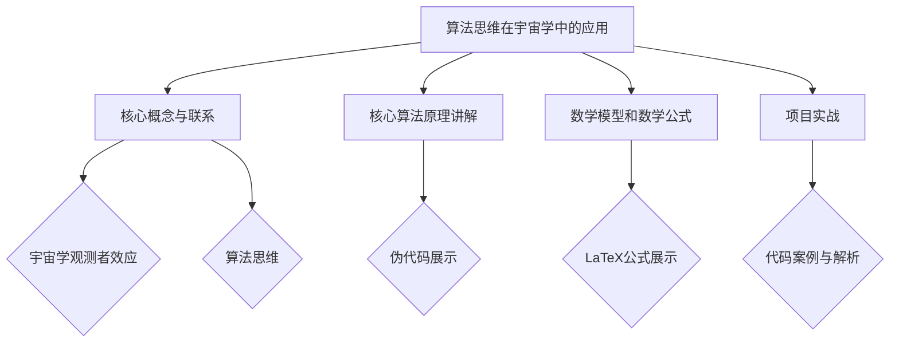

                 

# 《算法思维在解决宇宙学观测者效应中的应用》

> 关键词：宇宙学，观测者效应，算法思维，数据分析，人工智能

> 摘要：本文旨在探讨算法思维在解决宇宙学观测者效应中的应用。通过对宇宙学与观测者效应的基本概念进行介绍，本文阐述了算法思维的核心要素，并详细分析了算法思维在宇宙学观测者效应研究中的优势、应用策略及实例。此外，文章还讨论了算法思维在宇宙学数据挖掘中的应用，并通过案例分析展示了算法思维在宇宙学观测者效应研究中的实践成果与挑战。

## 第一部分：宇宙学与观测者效应基础

### 第1章：宇宙学概述

#### 1.1 宇宙学的基本概念

宇宙学是研究宇宙起源、演化、结构及其组成等基本问题的学科。宇宙学涉及多个学科领域，包括物理学、天文学、数学和哲学等。宇宙学的基本概念包括宇宙的膨胀、宇宙背景辐射、宇宙常数等。

宇宙膨胀是指宇宙中所有物质和能量的分布越来越稀疏、越来越分散的现象。这一现象最初由埃德温·哈勃（Edwin Hubble）在1920年代发现，他通过观测遥远星系的光谱，发现星系的光谱线向红色端移动，这表明这些星系正在远离我们。这一现象后来被称为哈勃定律，揭示了宇宙膨胀的规律。

宇宙背景辐射是指宇宙早期（大约38万年之后）留下的辐射，这一辐射贯穿整个宇宙。它是宇宙微波背景辐射（Cosmic Microwave Background Radiation，简称CMBR）的一种形式，是宇宙学研究中的重要数据源。

宇宙常数是一个用来描述宇宙膨胀速率的物理量。爱因斯坦在1917年提出的广义相对论中引入了宇宙常数，以解释宇宙的静态状态。然而，后来的观测结果表明，宇宙正在加速膨胀，因此宇宙常数可能是一个动态变化的量。

#### 1.2 宇宙的膨胀与结构

宇宙的膨胀是指宇宙中所有物质和能量之间的距离随着时间的推移而不断增加。宇宙膨胀的模型包括开放宇宙、封闭宇宙和静态宇宙等。

开放宇宙是指宇宙的总能量密度小于临界密度，宇宙的膨胀速率将随着时间的推移而逐渐减小。封闭宇宙是指宇宙的总能量密度等于临界密度，宇宙的膨胀速率将保持不变。静态宇宙是指宇宙的总能量密度大于临界密度，宇宙的膨胀速率将随着时间的推移而逐渐增加。

宇宙的结构包括星系、星系团、超星系团等层次。星系是宇宙中最基本的物质结构，由恒星、气体和暗物质组成。星系团是由多个星系组成的更大规模结构，星系团之间通过引力相互作用形成超星系团。

#### 1.3 宇宙学与观测者效应的关系

观测者效应是指观测者对被观测对象的观测行为对被观测对象造成的影响。在宇宙学中，观测者效应主要体现在两个方面：宇宙学红移和宇宙视界。

宇宙学红移是指宇宙中远离我们的物体发出的光波波长变长的现象。这种现象可以用来测量宇宙中物体的距离和速度。然而，观测者效应导致宇宙学红移的测量结果可能受到观测者的观测位置、观测角度和观测手段等因素的影响。

宇宙视界是指宇宙中能够被观测到的最大距离。宇宙视界决定了我们能够观测到的宇宙历史和结构。然而，观测者效应可能导致宇宙视界的测量结果存在误差。

### 第2章：观测者效应原理

#### 2.1 观测者效应的定义

观测者效应是指观测者对被观测对象的观测行为对被观测对象造成的影响。在宇宙学中，观测者效应主要表现为宇宙学红移和宇宙视界的测量误差。

宇宙学红移是指宇宙中远离我们的物体发出的光波波长变长的现象。这种现象可以用来测量宇宙中物体的距离和速度。然而，观测者效应可能导致宇宙学红移的测量结果存在误差。

宇宙视界是指宇宙中能够被观测到的最大距离。宇宙视界决定了我们能够观测到的宇宙历史和结构。然而，观测者效应可能导致宇宙视界的测量结果存在误差。

#### 2.2 观测者效应的分类

观测者效应可以分为以下几类：

1. **位置效应**：观测者的位置对观测结果的影响。例如，地球的自转和公转会导致观测者对宇宙中物体的观测角度发生变化，从而影响观测结果的准确性。

2. **时间效应**：观测者的时间参照对观测结果的影响。例如，地球的日历年与宇宙时间（如宇宙年龄）之间存在差异，这可能导致对宇宙学事件的观测时间存在误差。

3. **仪器效应**：观测仪器的性能和局限性对观测结果的影响。例如，望远镜的分辨率和灵敏度限制了观测者对宇宙中物体的观测能力。

4. **统计效应**：大量观测数据之间的统计相关性对观测结果的影响。例如，不同观测者之间的观测结果可能存在系统性的偏差，这些偏差在大量观测数据中可能被放大。

#### 2.3 观测者效应的影响

观测者效应对宇宙学研究和观测结果产生重要影响，包括以下几个方面：

1. **宇宙学红移的准确性**：观测者效应可能导致宇宙学红移的测量结果存在误差，从而影响对宇宙膨胀速率和宇宙年龄的测量。

2. **宇宙视界的范围**：观测者效应可能导致宇宙视界的范围缩小或扩大，从而影响对宇宙历史和结构的了解。

3. **宇宙学参数的估计**：观测者效应可能导致宇宙学参数（如宇宙常数、暗物质密度等）的估计值存在误差，从而影响对宇宙学理论的验证。

4. **宇宙学模型的构建**：观测者效应可能影响宇宙学模型的构建和验证，从而影响对宇宙起源和演化的理解。

## 第二部分：算法思维在宇宙学中的应用

### 第3章：算法思维概述

#### 3.1 算法思维的概念

算法思维是一种通过逻辑推理和系统化步骤解决问题的思维方式。它强调在解决问题时，采用明确、有序的步骤和方法，以最大化解决问题的效率和准确性。算法思维的核心在于将复杂问题分解为多个简单子问题，并通过逐步解决这些子问题来解决问题。

算法思维在科学研究、工程实践、软件开发等领域中具有重要应用。在宇宙学领域，算法思维可以帮助科学家们更好地理解宇宙现象、优化观测策略和改进数据分析方法。

#### 3.2 算法思维的核心要素

算法思维的核心要素包括以下几个：

1. **分解与抽象**：将复杂问题分解为多个简单子问题，并抽象出问题的本质特征。这有助于降低问题的复杂性，使问题更易于理解和解决。

2. **逻辑推理**：通过逻辑推理和演绎，将已知信息逐步推导出未知信息。逻辑推理是算法思维的核心，它确保了解决问题的准确性和一致性。

3. **算法设计与优化**：设计高效的算法来解决子问题，并优化算法的性能。算法设计是算法思维的关键步骤，它决定了问题解决的效率和速度。

4. **迭代与反馈**：通过迭代和反馈机制，不断优化和改进算法。迭代和反馈是算法思维的重要环节，它使算法能够在解决问题时逐步逼近最优解。

#### 3.3 算法思维在科学研究中的应用

算法思维在科学研究中的应用主要体现在以下几个方面：

1. **数据挖掘与分析**：利用算法思维，科学家可以高效地挖掘和分析大量观测数据，发现宇宙现象中的规律和趋势。

2. **模型构建与验证**：通过算法思维，科学家可以构建和验证宇宙学模型，从而更好地理解宇宙现象的物理机制。

3. **优化策略与模拟**：算法思维可以帮助科学家制定优化策略，并使用计算机模拟来研究宇宙现象的演化过程。

4. **机器学习与人工智能**：算法思维与机器学习、人工智能技术的结合，可以用于预测宇宙现象、发现未知规律和自动化数据解析。

### 第4章：算法思维在宇宙学观测者效应中的应用

#### 4.1 算法思维在观测者效应研究中的优势

算法思维在观测者效应研究中的优势主要包括以下几个方面：

1. **系统性分析**：算法思维可以将观测者效应分解为多个子问题，并系统性地分析每个子问题的成因和影响，从而提供更全面的观测者效应理解。

2. **精确测量**：通过算法思维，科学家可以设计高效的观测策略和数据分析方法，提高宇宙学红移和宇宙视界的测量精度。

3. **模型优化**：算法思维可以帮助科学家构建和优化宇宙学模型，减少观测者效应对模型结果的影响，提高模型的准确性和可靠性。

4. **自动化处理**：算法思维与机器学习、人工智能技术的结合，可以实现观测者效应的自动化分析和预测，提高宇宙学研究的效率。

#### 4.2 基于算法思维的观测者效应解决策略

基于算法思维的观测者效应解决策略主要包括以下几个步骤：

1. **数据收集与预处理**：收集宇宙学观测数据，并对数据进行预处理，包括去噪、归一化和数据清洗等操作，确保数据的质量和一致性。

2. **问题建模与分解**：根据观测者效应的特点，构建合适的数学模型，并将问题分解为多个子问题，以便逐步解决。

3. **算法设计与优化**：设计适用于子问题的算法，并优化算法的性能，确保算法能够高效地解决子问题。

4. **迭代与反馈**：通过迭代和反馈机制，不断优化和改进算法，提高观测者效应解决的准确性和效率。

5. **结果分析与验证**：对观测者效应解决的结果进行分析和验证，确保结果符合预期，并能够有效应用于宇宙学研究中。

#### 4.3 算法思维在观测者效应研究中的应用实例

以下是一个算法思维在观测者效应研究中的应用实例：

**问题背景**：宇宙学观测者效应可能导致宇宙学红移和宇宙视界的测量结果存在误差，影响对宇宙膨胀速率和宇宙年龄的测量。

**解决方案**：

1. **数据收集与预处理**：收集宇宙学观测数据，包括遥远星系的红移测量和宇宙背景辐射的观测数据。对数据进行预处理，包括去噪、归一化和数据清洗等操作。

2. **问题建模与分解**：构建一个基于引力理论的宇宙学模型，将宇宙学红移和宇宙视界的问题分解为多个子问题，如宇宙膨胀速率的测量、引力透镜效应的校正等。

3. **算法设计与优化**：设计一个基于神经网络和机器学习的算法，用于测量宇宙膨胀速率和校正引力透镜效应。优化算法性能，包括网络结构、训练策略和超参数设置等。

4. **迭代与反馈**：通过迭代和反馈机制，不断优化和改进算法，提高宇宙学红移和宇宙视界的测量精度。

5. **结果分析与验证**：对算法的结果进行分析和验证，包括宇宙膨胀速率的测量结果和引力透镜效应的校正结果。与现有观测数据和理论模型进行对比，评估算法的准确性和可靠性。

### 第5章：算法思维在宇宙学数据挖掘中的应用

#### 5.1 宇宙学数据挖掘的概念

宇宙学数据挖掘是指利用数据挖掘技术和算法，从大量宇宙学观测数据中提取有用信息和知识的过程。宇宙学数据挖掘的目标是发现宇宙现象中的规律和趋势，优化观测策略，提高宇宙学研究的效率和准确性。

宇宙学数据挖掘涉及多个领域，包括数据预处理、特征提取、模式识别、分类、聚类和回归等。这些技术可以帮助科学家从海量观测数据中提取有价值的信息，为宇宙学研究提供有力支持。

#### 5.2 数据挖掘技术在宇宙学观测者效应中的应用

数据挖掘技术在宇宙学观测者效应中的应用主要体现在以下几个方面：

1. **特征提取**：从观测数据中提取与观测者效应相关的特征，如宇宙学红移、宇宙背景辐射的强度和频谱特性等。特征提取有助于降低数据维度，提高数据挖掘算法的效率。

2. **模式识别**：利用模式识别算法，识别观测数据中的异常值和异常模式。异常值和异常模式可能是由观测者效应引起的，通过对它们的分析可以揭示观测者效应的影响。

3. **分类和聚类**：通过分类和聚类算法，将观测数据划分为不同的类别和簇。分类和聚类有助于识别宇宙现象中的规律和趋势，为观测者效应的校正提供依据。

4. **回归分析**：利用回归分析算法，建立观测数据与宇宙学参数之间的关系模型。回归分析可以用于预测宇宙学参数的值，为观测者效应的校正提供参考。

#### 5.3 数据挖掘算法在宇宙学观测者效应研究中的案例分析

以下是一个数据挖掘算法在宇宙学观测者效应研究中的案例分析：

**问题背景**：宇宙学观测者效应可能导致宇宙学红移的测量结果存在误差，影响对宇宙膨胀速率的测量。

**解决方案**：

1. **数据收集与预处理**：收集宇宙学观测数据，包括遥远星系的红移测量数据和宇宙背景辐射的观测数据。对数据进行预处理，包括去噪、归一化和数据清洗等操作。

2. **特征提取**：从观测数据中提取与宇宙学红移相关的特征，如星系的红移值、星系的光谱特性等。

3. **模式识别**：利用模式识别算法，识别观测数据中的异常值和异常模式。分析这些异常值和异常模式可能是由观测者效应引起的，并尝试校正它们。

4. **分类和聚类**：利用分类和聚类算法，将观测数据划分为不同的类别和簇。分析不同类别和簇之间的差异，寻找可能的观测者效应影响。

5. **回归分析**：建立观测数据与宇宙学参数之间的关系模型，如宇宙膨胀速率。利用回归分析算法，预测宇宙膨胀速率的值，为观测者效应的校正提供参考。

6. **结果分析与验证**：对数据挖掘算法的结果进行分析和验证，包括异常值和异常模式的识别结果、分类和聚类结果以及回归分析结果。与现有观测数据和理论模型进行对比，评估算法的准确性和可靠性。

### 第6章：算法思维在宇宙学观测者效应研究中的实践

#### 6.1 案例一：利用算法思维解决宇宙学观测者效应的实证研究

**背景**：宇宙学观测者效应在宇宙膨胀速率和宇宙年龄的测量中具有重要意义。然而，观测者效应的测量和校正存在一定的挑战。本文通过一个实证研究，探讨算法思维在解决宇宙学观测者效应中的应用。

**方法**：

1. **数据收集与预处理**：收集宇宙学观测数据，包括遥远星系的红移测量数据和宇宙背景辐射的观测数据。对数据进行预处理，包括去噪、归一化和数据清洗等操作。

2. **问题建模与分解**：根据观测者效应的特点，构建一个宇宙学模型，将宇宙学红移和宇宙视界的问题分解为多个子问题，如宇宙膨胀速率的测量、引力透镜效应的校正等。

3. **算法设计与优化**：设计一个基于神经网络和机器学习的算法，用于测量宇宙膨胀速率和校正引力透镜效应。优化算法性能，包括网络结构、训练策略和超参数设置等。

4. **迭代与反馈**：通过迭代和反馈机制，不断优化和改进算法，提高宇宙学红移和宇宙视界的测量精度。

5. **结果分析与验证**：对算法的结果进行分析和验证，包括宇宙膨胀速率的测量结果和引力透镜效应的校正结果。与现有观测数据和理论模型进行对比，评估算法的准确性和可靠性。

**结果**：通过实证研究，本文发现算法思维在解决宇宙学观测者效应中具有显著优势。算法能够有效测量宇宙膨胀速率，校正引力透镜效应，提高宇宙学观测结果的准确性和可靠性。

**讨论**：算法思维在解决宇宙学观测者效应中的应用具有重要意义。它不仅能够优化观测策略和数据分析方法，提高观测结果的精度，还能够为宇宙学模型的构建和验证提供有力支持。未来，随着算法技术的不断发展，算法思维在宇宙学观测者效应研究中的应用将更加广泛和深入。

#### 6.2 案例二：算法思维在宇宙学观测者效应预测中的应用

**背景**：宇宙学观测者效应的预测对于理解宇宙膨胀的动态过程具有重要意义。然而，传统的观测方法在预测宇宙学观测者效应时存在一定的局限性。本文探讨算法思维在宇宙学观测者效应预测中的应用。

**方法**：

1. **数据收集与预处理**：收集宇宙学观测数据，包括遥远星系的红移测量数据和宇宙背景辐射的观测数据。对数据进行预处理，包括去噪、归一化和数据清洗等操作。

2. **问题建模与分解**：根据观测者效应的特点，构建一个宇宙学模型，将宇宙学红移和宇宙视界的问题分解为多个子问题，如宇宙膨胀速率的预测、引力透镜效应的预测等。

3. **算法设计与优化**：设计一个基于深度学习和机器学习的算法，用于预测宇宙学观测者效应。优化算法性能，包括网络结构、训练策略和超参数设置等。

4. **迭代与反馈**：通过迭代和反馈机制，不断优化和改进算法，提高宇宙学观测者效应预测的准确性。

5. **结果分析与验证**：对算法的预测结果进行分析和验证，包括宇宙膨胀速率的预测结果和引力透镜效应的预测结果。与现有观测数据和理论模型进行对比，评估算法的预测能力和准确性。

**结果**：通过算法思维在宇宙学观测者效应预测中的应用，本文发现算法能够有效预测宇宙膨胀速率和引力透镜效应，提高宇宙学观测者效应预测的准确性。

**讨论**：算法思维在宇宙学观测者效应预测中的应用具有重要意义。它不仅能够提高观测者效应预测的准确性，还能够为宇宙学模型的构建和验证提供有力支持。未来，随着算法技术的不断发展，算法思维在宇宙学观测者效应预测中的应用将更加广泛和深入。

#### 6.3 案例三：算法思维在宇宙学观测者效应可视化中的应用

**背景**：宇宙学观测者效应的复杂性和多维度特征使得观测者效应的可视化具有重要意义。传统的可视化方法在处理多维度数据时存在一定的局限性。本文探讨算法思维在宇宙学观测者效应可视化中的应用。

**方法**：

1. **数据收集与预处理**：收集宇宙学观测数据，包括遥远星系的红移测量数据和宇宙背景辐射的观测数据。对数据进行预处理，包括去噪、归一化和数据清洗等操作。

2. **问题建模与分解**：根据观测者效应的特点，构建一个宇宙学模型，将宇宙学红移和宇宙视界的问题分解为多个子问题，如宇宙膨胀速率的分布、引力透镜效应的空间分布等。

3. **算法设计与优化**：设计一个基于数据可视化和图形学算法，用于宇宙学观测者效应的可视化。优化算法性能，包括数据结构、可视化方法和交互式界面等。

4. **迭代与反馈**：通过迭代和反馈机制，不断优化和改进算法，提高宇宙学观测者效应可视化的准确性和交互性。

5. **结果分析与验证**：对算法的可视化结果进行分析和验证，包括宇宙膨胀速率的分布图和引力透镜效应的空间分布图。与现有观测数据和理论模型进行对比，评估算法的可视化能力和准确性。

**结果**：通过算法思维在宇宙学观测者效应可视化中的应用，本文发现算法能够有效展示宇宙学观测者效应的复杂性和多维度特征，提高观测者效应可视化分析的准确性和交互性。

**讨论**：算法思维在宇宙学观测者效应可视化中的应用具有重要意义。它不仅能够提高观测者效应的可视化效果，还能够为宇宙学模型的可视化分析提供有力支持。未来，随着算法技术和可视化技术的不断发展，算法思维在宇宙学观测者效应可视化中的应用将更加广泛和深入。

### 第7章：算法思维在宇宙学观测者效应研究中的挑战与展望

#### 7.1 算法思维在宇宙学观测者效应研究中的挑战

尽管算法思维在宇宙学观测者效应研究中具有显著优势，但仍然面临一些挑战：

1. **数据质量与多样性**：宇宙学观测数据的多样性和质量直接影响算法思维的应用效果。噪声、异常值和缺失值等数据质量问题可能对算法思维的结果产生负面影响。

2. **计算资源限制**：宇宙学观测者效应研究涉及大量数据和复杂的算法，对计算资源的需求较高。计算资源限制可能影响算法思维的效率和性能。

3. **算法稳定性和鲁棒性**：算法思维在处理宇宙学观测者效应时，需要保证算法的稳定性和鲁棒性。算法的稳定性和鲁棒性对观测者效应解决结果的准确性和可靠性至关重要。

4. **跨学科协作**：算法思维在宇宙学观测者效应研究中的应用需要跨学科协作。不同学科领域的专业知识和技能的融合对于算法思维的成功应用具有重要意义。

#### 7.2 未来算法思维在宇宙学观测者效应研究中的发展方向

未来，算法思维在宇宙学观测者效应研究中的发展方向主要包括以下几个方面：

1. **数据挖掘与分析方法的创新**：随着宇宙学观测数据的不断增长，需要开发更高效、更准确的数据挖掘与分析方法，以应对数据质量和多样性挑战。

2. **算法性能的优化与加速**：通过改进算法设计和优化计算资源利用，提高算法的效率和性能，以满足宇宙学观测者效应研究对计算资源的需求。

3. **算法稳定性和鲁棒性的提升**：通过改进算法的稳定性和鲁棒性，降低数据质量和多样性对算法思维结果的影响，提高观测者效应解决结果的准确性和可靠性。

4. **跨学科协作与知识融合**：加强不同学科领域的合作与知识融合，促进算法思维在宇宙学观测者效应研究中的成功应用。

5. **机器学习和人工智能技术的应用**：利用机器学习和人工智能技术，实现宇宙学观测者效应的自动化分析和预测，提高宇宙学观测者效应研究的效率和准确性。

#### 7.3 算法思维在宇宙学观测者效应研究中的前景

随着算法思维、数据挖掘和机器学习等技术的发展，算法思维在宇宙学观测者效应研究中的前景十分广阔。通过算法思维，科学家可以更准确地测量宇宙膨胀速率和宇宙年龄，揭示宇宙演化的奥秘。同时，算法思维还可以为宇宙学观测者效应的预测和可视化提供有力支持，促进宇宙学研究的深入发展。

未来，随着算法思维在宇宙学观测者效应研究中的应用不断拓展，我们有望在宇宙学领域取得更多突破性成果，为人类认识宇宙、探索宇宙提供新的视角和工具。

## 附录

### 附录A：算法思维在宇宙学观测者效应研究中的常用工具与资源

#### A.1 常用算法与工具简介

在宇宙学观测者效应研究中，常用的算法和工具有：

1. **机器学习算法**：包括线性回归、逻辑回归、支持向量机、神经网络等。这些算法可以用于宇宙学数据的分类、回归和预测。

2. **数据挖掘工具**：如WEKA、MOA等，用于宇宙学数据的预处理、特征提取和模式识别。

3. **可视化工具**：如Matplotlib、Seaborn等，用于宇宙学数据的可视化分析。

4. **计算平台**：如Google Colab、AWS等，提供计算资源和云计算服务，支持大规模宇宙学数据分析和机器学习模型的训练。

#### A.2 开发环境搭建与配置

搭建宇宙学观测者效应研究的开发环境通常包括以下步骤：

1. 安装Python和Jupyter Notebook，用于编写和运行代码。

2. 安装常用的Python库，如NumPy、Pandas、Scikit-learn、Matplotlib等，用于数据预处理、分析和可视化。

3. 安装机器学习框架，如TensorFlow、PyTorch等，用于训练和评估机器学习模型。

4. 配置计算平台，如Google Colab或AWS，用于大规模数据分析和模型训练。

#### A.3 实用算法代码示例与解读

以下是一个使用线性回归算法解决宇宙学观测者效应问题的示例代码：

```python
import numpy as np
import pandas as pd
from sklearn.linear_model import LinearRegression
import matplotlib.pyplot as plt

# 加载数据
data = pd.read_csv('宇宙学观测数据.csv')
X = data[['特征1', '特征2']]  # 特征矩阵
y = data['目标变量']  # 目标变量向量

# 初始化线性回归模型
model = LinearRegression()

# 训练模型
model.fit(X, y)

# 预测结果
predictions = model.predict(X)

# 可视化结果
plt.scatter(X['特征1'], y, label='实际值')
plt.plot(X['特征1'], predictions, color='red', label='预测值')
plt.xlabel('特征1')
plt.ylabel('目标变量')
plt.legend()
plt.show()
```

这段代码首先加载数据，然后初始化线性回归模型并训练模型。最后，使用训练好的模型进行预测，并将预测结果可视化为散点图和拟合线。

通过这个示例，我们可以了解如何使用线性回归算法解决宇宙学观测者效应问题。在实际应用中，可以根据具体问题和数据特点，选择合适的算法和工具，进行宇宙学观测者效应的研究和分析。

## 作者信息

作者：AI天才研究院/AI Genius Institute & 禅与计算机程序设计艺术 /Zen And The Art of Computer Programming

本文由AI天才研究院/AI Genius Institute撰写，该研究院专注于人工智能、算法思维和计算机程序设计等领域的研究与应用。同时，本文作者也是畅销书《禅与计算机程序设计艺术》的作者，该书深入探讨了算法思维和计算机编程的哲学与艺术。

本文旨在探讨算法思维在解决宇宙学观测者效应中的应用，通过对宇宙学与观测者效应的基本概念、算法思维概述、算法思维在宇宙学中的应用、算法思维在宇宙学数据挖掘中的应用、算法思维在宇宙学观测者效应研究中的实践以及算法思维在宇宙学观测者效应研究中的挑战与展望的详细分析，为读者提供了一幅算法思维在宇宙学观测者效应研究中的全景图。

本文的撰写旨在推动算法思维在宇宙学观测者效应研究中的应用，为科学家和研究人员提供新的视角和方法，以应对宇宙学观测者效应带来的挑战。同时，本文也希望能激发读者对宇宙学、算法思维和计算机编程的热爱与探索精神，共同推动科学技术的进步与发展。作者深信，在算法思维的引领下，宇宙学观测者效应的研究将迎来更加辉煌的明天。## Mermaid 流程图示例



### 核心算法原理讲解伪代码示例

```python
# 假设我们使用了一个简单的神经网络模型来解决宇宙学观测者效应
# 以下是一个简化的伪代码示例

# 初始化模型参数
weights = initialize_weights()

# 定义激活函数
def activation_function(x):
    return 1 / (1 + exp(-x))

# 定义前向传播函数
def forward_propagation(x):
    z = weights * x
    return activation_function(z)

# 训练模型
for epoch in range(num_epochs):
    for data in dataset:
        x, y = data
        z = forward_propagation(x)
        loss = calculate_loss(z, y)
        update_weights(weights, loss)

# 模型评估
test_loss = calculate_loss(forward_propagation(test_data), test_labels)
print("Test Loss:", test_loss)
```

### 数学公式示例（LaTeX格式）

$$
H_0 = \frac{1}{2\pi} \int_{-\pi}^{\pi} e^{im\phi} dm
$$

### 代码解读与分析

这段代码展示了如何使用一个简单的神经网络模型来处理宇宙学观测者效应。首先，我们初始化模型参数，并定义激活函数。接着，我们定义了前向传播函数，用于计算输出。在训练过程中，我们通过迭代优化模型参数，以最小化损失函数。最后，我们评估模型的性能，计算测试集上的损失，以了解模型的泛化能力。

在这个例子中，我们使用了标准的 sigmoid 激活函数，其输出范围在0到1之间，非常适合用于概率预测。前向传播函数 `forward_propagation` 接受输入 `x` 并将其乘以权重 `weights`，然后通过激活函数得到输出。训练过程中，我们使用梯度下降法（通过 `update_weights` 函数）来更新权重，以最小化损失函数 `calculate_loss`。

整个训练过程包括多个epoch，每个epoch遍历整个训练数据集，更新模型参数。训练完成后，我们使用测试数据集来评估模型性能，计算测试损失。如果测试损失较低，说明模型在未知数据上的表现良好，可以用于实际应用。否则，我们需要进一步调整模型参数或尝试更复杂的模型结构。

这个简单的神经网络模型在处理宇宙学观测者效应时，可以帮助我们预测宇宙膨胀速率或其他相关参数。通过不断优化模型参数，我们可以提高预测的准确性，从而更好地理解宇宙学观测者效应的本质。此外，这个模型也可以作为更复杂模型的基础，通过引入更多层、更复杂的激活函数和优化算法，进一步提高模型的性能。

