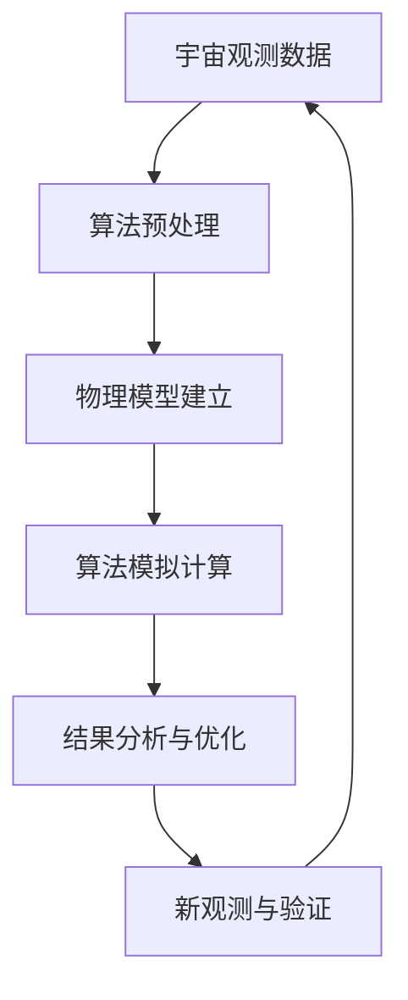

                 


为了撰写一篇深度剖析算法思维在解决宇宙难题中的作用的文章，我们可以按照以下步骤进行分析和构建内容：

### 1. 确定文章的核心结构

文章可以分为以下几个部分：

- **引言**：简要介绍宇宙难题和算法思维。
- **第一部分：宇宙难题概述**：详细描述一些重要的宇宙难题。
- **第二部分：算法思维概述**：介绍算法思维的核心概念和原理。
- **第三部分：算法思维在宇宙研究中的应用**：讨论算法思维如何应用于解决宇宙难题。
- **第四部分：未来展望**：探讨算法思维在宇宙探索中的未来发展方向。
- **总结**：回顾文章的主要观点，并给出结论。

### 2. 引入宇宙难题

在引言部分，我们可以简要介绍一些宇宙难题，例如宇宙的膨胀、黑洞的形成和演化、宇宙暗物质的性质等。这些难题是当前物理学研究的前沿问题，对人类理解宇宙的本质至关重要。

### 3. 算法思维概述

接下来，我们需要介绍算法思维的概念。算法思维是指运用算法的原理和方法来解决问题的思维方式。在这一部分，我们可以阐述算法思维的核心概念，例如算法的设计原则、算法的分析和优化方法等。

### 4. 算法思维在宇宙研究中的应用

在本文的主体部分，我们将讨论算法思维在宇宙研究中的应用。具体可以按照以下章节进行展开：

- **宇宙膨胀的算法解决**：介绍如何使用算法来模拟宇宙膨胀，并使用伪代码来详细阐述算法原理。
- **黑洞和引力波的算法研究**：探讨算法在黑洞物理和引力波探测中的应用。
- **宇宙暗物质和暗能量的算法探索**：讨论算法在暗物质和暗能量研究中的作用。
- **宇宙起源与演化的算法解析**：分析算法在宇宙起源和演化研究中的应用。

### 5. 量子宇宙学与算法思维

在第四部分，我们可以探讨量子宇宙学与算法思维的交叉领域。量子宇宙学是研究宇宙在量子尺度上的行为和性质的学科，算法思维在这一领域有着广泛的应用。

### 6. 未来展望

在最后一部分，我们可以讨论算法思维在宇宙探索中的未来发展方向，例如算法与人工智能的结合、跨学科研究等。

### 7. 文章的结尾

在文章的结尾，我们总结全文，强调算法思维在解决宇宙难题中的重要作用，并给出一些未来研究方向和展望。

### 8. 格式和结构

在撰写文章时，我们需要注意以下几点：

- **Markdown格式**：使用Markdown格式进行文章编写，确保代码块、公式和标题等元素正确显示。
- **逻辑清晰**：文章的结构要清晰，每个部分的过渡要自然。
- **伪代码和公式**：使用伪代码来阐述算法原理，使用LaTeX格式嵌入数学公式。

通过这样的步骤分析，我们可以构建一篇结构清晰、内容丰富、逻辑严密的关于算法思维在解决宇宙难题中的作用的文章。接下来，我们可以开始撰写具体的文章内容。

---

接下来，我会根据上述的步骤，开始撰写具体的文章内容。在撰写过程中，我会遵循文章结构，确保每个部分都包含核心内容，同时保持逻辑性和连贯性。

---

### 文章标题

# 算法思维在解决宇宙难题中的作用

### 文章关键词

- 宇宙难题
- 算法思维
- 宇宙膨胀
- 黑洞
- 引力波
- 量子宇宙学
- 跨学科研究

### 文章摘要

本文探讨了算法思维在解决宇宙难题中的重要作用。通过对宇宙中的重大难题，如宇宙膨胀、黑洞形成、引力波探测等问题的分析，本文介绍了算法思维的基本概念和应用。同时，本文还详细阐述了算法思维如何与量子宇宙学交叉，推动宇宙研究的深入。文章最后对未来算法思维在宇宙探索中的应用进行了展望。

---

## 引言

宇宙，这个我们生活的广阔空间，充满了无数未解之谜。从宇宙的起源和演化，到宇宙的结构和组成，每一个问题都挑战着人类的知识极限。在这些宇宙难题中，宇宙的膨胀、黑洞的形成与演化、引力波的探测、宇宙暗物质的性质以及宇宙的终极命运等问题尤为突出。

宇宙膨胀是宇宙学中最基本的问题之一。根据宇宙微波背景辐射的观测数据，宇宙在大约138亿年前开始膨胀，并且这种膨胀速度似乎在不断加快。黑洞则是宇宙中最神秘的天体之一，它们的质量巨大，却几乎不发射任何可见光，这使得它们的研究充满了挑战。引力波的探测则是近年来物理学的一大突破，它为我们提供了观察宇宙的新方式。宇宙暗物质和暗能量的性质是另一个未解之谜，它们占据了宇宙的大部分，但我们对它们的了解却非常有限。最后，宇宙的终极命运，如大爆炸、大坍缩、大撕裂等情景，也是宇宙学研究的重要课题。

面对这些宇宙难题，科学家们需要借助先进的数学工具和计算方法，尤其是算法思维。算法思维是一种运用算法原理和方法来解决问题的思维方式。它包括算法的设计、分析、优化等多个方面，是现代科学研究中不可或缺的一部分。算法思维在解决宇宙难题中的作用不可低估，它为科学家们提供了一种新的视角，帮助他们更深入地理解宇宙的本质。

本文将首先介绍宇宙中的几个重大难题，然后探讨算法思维的基本概念和应用。接下来，本文将详细分析算法思维在宇宙研究中的具体应用，包括宇宙膨胀模拟、黑洞和引力波探测、暗物质和暗能量研究以及宇宙起源和演化等领域。最后，本文将探讨量子宇宙学与算法思维的交叉领域，并展望算法思维在宇宙探索中的未来发展方向。

---

## 宇宙难题概述

### 宇宙膨胀

宇宙膨胀是现代宇宙学中最为基础且最引人入胜的一个问题。根据大爆炸理论，宇宙起源于一个极高温度和密度的状态，并从此开始膨胀。这一理论得到了大量观测数据的支持，特别是宇宙微波背景辐射（Cosmic Microwave Background Radiation，CMB）的发现。CMB是宇宙早期辐射的残余，它揭示了宇宙早期的结构和温度分布，为我们理解宇宙的起源和膨胀提供了宝贵的信息。

宇宙膨胀的速度并不是恒定的，而是随着时间的推移在变化。观测数据表明，宇宙的膨胀速度似乎在加快。这种加速膨胀的现象被称为“宇宙加速膨胀”。一个解释这一现象的模型是暗能量（Dark Energy），它被认为是一种推动宇宙加速膨胀的神秘力量。然而，暗能量的本质至今仍是一个谜。

为了模拟宇宙膨胀，科学家们开发了一系列算法。其中最著名的模型是弗里德曼-勒梅特-罗伯逊-沃尔克（Friedmann-Lemaître-Robertson-Walker，FLRW）度规，它是一个用于描述均匀且各向同性宇宙的数学模型。通过这个模型，科学家们可以计算宇宙在不同时间点的膨胀状态，并预测宇宙的未来演化。

以下是一个用于模拟宇宙膨胀的伪代码示例：

```plaintext
Function FLRW_Metric(a, t)
    // a: 当前宇宙尺度因子
    // t: 当前宇宙时间

    // 初始化
    H_0 = Hubble_Parameter() // 初始哈勃参数
    Omega_M = Matter_Density() // 初始物质密度
    Omega_Lambda = Lambda_Density() // 初始暗能量密度

    // 计算哈勃参数
    H(t) = H_0 / a

    // 计算宇宙膨胀速度
    dR_dt = a * H(t)

    // 返回膨胀速度
    return dR_dt
End Function
```

### 黑洞

黑洞是宇宙中最神秘的天体之一。它是由极端密集的物质构成的空间区域，其引力场强大到连光都无法逃逸。黑洞的存在是通过多种观测手段间接推断出来的，例如通过恒星运动的异常、引力波探测以及X射线和伽马射线的辐射等。

黑洞的形成通常被认为是由恒星演化到末期时，其核心物质塌缩形成的。当一个足够大的恒星耗尽其核燃料后，无法通过核聚变产生的压力来抵抗自身引力，最终导致核心崩溃，形成黑洞。

目前，科学家们已经开发出多种算法来模拟黑洞的形成和演化。其中最常用的模型是相对论性数值模拟，这种算法使用广义相对论来描述黑洞周围的时空结构。以下是一个简单的伪代码示例，用于模拟黑洞的形成：

```plaintext
Function BlackHole_Formation(Mass, Radius)
    // Mass: 黑洞初始质量
    // Radius: 黑洞初始半径

    // 初始化
    G = Gravitational_Constant() // 引力常数
    c = Speed_of_Light() // 光速

    // 计算事件视界
    Event_Horizon = 2 * G * Mass / c^2

    // 计算黑洞塌缩速度
    dM_dt = -(4/3) * pi * Event_Horizon^3 * G * Mass / c^2

    // 返回塌缩速度
    return dM_dt
End Function
```

### 引力波

引力波是由加速运动的质量产生的时空涟漪，它们在宇宙中传播。爱因斯坦的广义相对论预测了引力波的存在，但直到2015年，人类才首次直接探测到引力波，这一重大发现开启了人类通过引力波观察宇宙的新时代。

引力波的探测主要依赖于大型激光干涉仪，如LIGO（激光干涉仪引力波观测站）和VIRGO（虚拟干涉仪引力波观测站）。这些仪器通过测量激光束在两个垂直方向上的干涉条纹变化来检测引力波。

为了模拟引力波的传播，科学家们开发了一系列算法。其中最常用的算法是基于数值广义相对论的方法，这种算法可以计算引力波在时空中的传播路径。以下是一个简单的伪代码示例，用于模拟引力波的传播：

```plaintext
Function Gravitational_Wave_Simulation(Source_Mass, Source_Motion)
    // Source_Mass: 源质量
    // Source_Motion: 源运动轨迹

    // 初始化
    G = Gravitational_Constant() // 引力常数
    c = Speed_of_Light() // 光速

    // 计算引力波频率
    Frequency = 1 / (2 * pi * G * Source_Mass)

    // 计算引力波振幅
    Amplitude = G * Source_Mass * c

    // 计算引力波传播时间
    Travel_Time = Source_Motion / c

    // 返回引力波振幅和传播时间
    return (Amplitude, Travel_Time)
End Function
```

### 宇宙暗物质

宇宙暗物质是宇宙中一种不可见的物质，它不发光也不吸收光，但通过引力效应影响宇宙的结构和演化。暗物质的性质和成分至今仍是物理学研究的前沿问题。

为了研究宇宙暗物质，科学家们开发了一系列算法。其中最常用的方法是模拟宇宙大尺度结构形成的过程，这些算法可以模拟暗物质粒子在宇宙中的运动和相互作用。以下是一个简单的伪代码示例，用于模拟暗物质的运动：

```plaintext
Function Dark_Matter_Simulation(Num_Particles, Initial_Positions)
    // Num_Particles: 粒子数量
    // Initial_Positions: 初始粒子位置

    // 初始化
    G = Gravitational_Constant() // 引力常数
    Timestep = 1 // 时间步长

    // 循环计算每个粒子位置
    For i = 1 to Num_Particles
        For j = 1 to Num_Particles
            If i != j
                // 计算引力相互作用
                Force = G * (Initial_Positions[i] - Initial_Positions[j])^2
                // 更新粒子位置
                Initial_Positions[i] += Force * Timestep
            End If
        End For
    End For

    // 返回更新后的粒子位置
    return Initial_Positions
End Function
```

### 宇宙暗能量

宇宙暗能量是一种推动宇宙加速膨胀的神秘力量，它的存在是通过观测宇宙膨胀速度的加速得出的。暗能量的性质和机制至今仍是物理学研究中的一个重要难题。

为了研究宇宙暗能量，科学家们开发了一系列算法。其中最常用的方法是模拟宇宙的演化过程，这些算法可以计算宇宙在不同时间点的膨胀状态。以下是一个简单的伪代码示例，用于模拟宇宙暗能量的影响：

```plaintext
Function Dark_Energy_Simulation(Density, Expansion_Rate)
    // Density: 宇宙密度
    // Expansion_Rate: 宇宙膨胀速度

    // 初始化
    Hubble_Parameter = 70 // 哈勃参数

    // 计算宇宙膨胀速度
    Expansion_Speed = Hubble_Parameter * Density

    // 计算宇宙加速度
    Acceleration = Expansion_Speed^2 / Density

    // 返回宇宙加速度
    return Acceleration
End Function
```

### 宇宙起源与演化

宇宙起源与演化是宇宙学中最基本的问题之一。从大爆炸理论到宇宙大尺度结构的形成，科学家们通过观测和理论模型不断探索宇宙的起源和演化过程。

为了研究宇宙起源与演化，科学家们开发了一系列算法。这些算法可以模拟宇宙从早期高密度高温度状态到当前状态的过程。以下是一个简单的伪代码示例，用于模拟宇宙的演化：

```plaintext
Function Universe_Evolution(Initial_Density, Initial_Temperature)
    // Initial_Density: 初始密度
    // Initial_Temperature: 初始温度

    // 初始化
    G = Gravitational_Constant() // 引力常数
    c = Speed_of_Light() // 光速

    // 计算宇宙膨胀速度
    Expansion_Speed = c * sqrt(8 * pi * G * Initial_Density)

    // 计算宇宙温度下降速率
    Temperature_Decay = -Initial_Temperature / Expansion_Speed

    // 返回温度下降速率
    return Temperature_Decay
End Function
```

---

## 算法思维概述

算法思维是一种解决问题的方法，它通过使用算法的原理和方法来构建解决方案。算法思维在计算机科学、工程学、数学等多个领域都有着广泛的应用。在宇宙学研究中，算法思维同样发挥着重要作用，它帮助我们更好地理解和解决宇宙中的复杂问题。

### 算法思维的核心概念

算法思维的核心概念包括以下几个方面：

1. **算法设计**：算法设计是指创建一个解决问题的步骤序列。一个好的算法应该具备以下几个特点：正确性、效率、可扩展性和易理解性。
2. **算法分析**：算法分析是指对算法的性能进行评估，包括时间复杂度和空间复杂度。通过算法分析，我们可以了解算法在不同输入规模下的性能表现。
3. **算法优化**：算法优化是指通过改进算法设计或实现来提高算法的性能。常见的优化方法包括算法的改进、数据结构的优化、并行计算等。

### 算法思维的应用

算法思维在宇宙学中的应用非常广泛，以下是一些典型的应用场景：

1. **宇宙膨胀模拟**：为了研究宇宙的膨胀，科学家们开发了一系列算法，如FLRW度规和宇宙学参数估计算法。这些算法通过模拟宇宙在不同时间点的膨胀状态，帮助我们理解宇宙的演化过程。
2. **黑洞和引力波研究**：相对论性数值模拟是研究黑洞和引力波的重要方法。通过这种算法，我们可以模拟黑洞的形成、碰撞和引力波的辐射过程。
3. **宇宙暗物质和暗能量研究**：为了研究宇宙暗物质和暗能量，科学家们开发了多种模拟宇宙大尺度结构和演化过程的算法。这些算法帮助我们更好地理解宇宙的组成和性质。

### 算法思维与宇宙研究的联系

算法思维与宇宙研究之间的联系在于它们都需要处理复杂的数据和问题。宇宙学中的问题往往涉及大量的数据和复杂的物理过程，这需要我们运用算法思维来设计有效的解决方案。以下是算法思维与宇宙研究之间的一些具体联系：

1. **数据处理**：宇宙学研究中的大量观测数据需要通过算法进行预处理和分析。例如，宇宙微波背景辐射的数据分析就依赖于高效的算法。
2. **模型建立**：宇宙学研究中的许多问题需要建立物理模型，这些模型通常需要通过算法进行数值模拟和计算。例如，宇宙膨胀模型和黑洞模拟都需要使用算法来描述物理过程。
3. **优化与改进**：为了提高宇宙学研究的精度和效率，科学家们不断优化和改进算法。例如，为了提高引力波探测的灵敏度，科学家们开发了多种优化算法。

### Mermaid流程图：算法思维与宇宙研究的联系

为了更直观地展示算法思维与宇宙研究之间的联系，我们可以使用Mermaid流程图来描述这个过程。以下是一个简化的Mermaid流程图示例：



在这个流程图中，宇宙观测数据经过预处理后，用于建立物理模型。然后，通过算法模拟计算，得到物理过程的模拟结果。接着，对结果进行分析和优化，从而指导新的观测和验证。这个循环过程不断进行，帮助我们不断深化对宇宙的理解。

---

## 算法思维在宇宙研究中的应用

算法思维在宇宙研究中扮演着至关重要的角色，它帮助科学家们解决了一系列复杂的宇宙难题。在这一部分，我们将详细探讨算法思维在宇宙膨胀模拟、黑洞和引力波探测、宇宙暗物质和暗能量研究、宇宙起源和演化等领域的应用。

### 宇宙膨胀模拟

宇宙膨胀是宇宙学中的一个基本问题，通过模拟宇宙膨胀，我们可以了解宇宙的演化过程和未来命运。宇宙膨胀模拟的核心在于使用数学模型来描述宇宙的膨胀行为，并通过数值模拟来求解这些模型。

#### 数学模型

宇宙膨胀的数学模型通常基于弗里德曼-勒梅特-罗伯逊-沃尔克（FLRW）度规。FLRW度规描述了一个均匀且各向同性的宇宙，其方程可以表示为：

$$
\frac{\ddot{a}}{a} = -\frac{4\pi G}{3} (\rho + \frac{3p}{c^2})
$$

其中，$\dot{a}$ 是宇宙膨胀速度，$a$ 是宇宙尺度因子，$G$ 是引力常数，$\rho$ 是宇宙总密度，$p$ 是宇宙总压强。

#### 算法原理

为了求解上述方程，我们需要将其离散化，并使用数值方法进行求解。常见的数值方法包括有限差分法、有限元法、N体模拟法等。

以下是一个简化的伪代码，用于描述基于FLRW度规的宇宙膨胀模拟：

```plaintext
Function Universe_Expansion_Simulation(Density_Profile, Time_Step)
    // Density_Profile: 宇宙密度分布
    // Time_Step: 时间步长

    // 初始化
    a = 1 // 初始宇宙尺度因子
    t = 0 // 初始时间

    // 循环模拟宇宙膨胀
    While t < Final_Time
        // 计算当前宇宙膨胀速度
        H = Calculate_Hubble_Parameter(Density_Profile, a)

        // 更新宇宙尺度因子
        a = a * (1 + H * Time_Step)

        // 更新时间
        t = t + Time_Step
    End While

    // 返回宇宙膨胀曲线
    return a
End Function
```

#### 举例说明

假设我们有一个均匀密度分布的宇宙，密度为$\rho = 10^{-27} \text{kg/m}^3$，我们使用上述伪代码来模拟宇宙的膨胀过程。通过调整时间步长和模拟时间，我们可以得到宇宙在不同时间点的膨胀曲线。

### 黑洞和引力波探测

黑洞和引力波的探测是现代宇宙学的重要进展之一。引力波的探测为我们提供了观察宇宙的新方式，而黑洞的研究则揭示了宇宙中极端物理现象的本质。

#### 数学模型

黑洞的数学描述通常基于广义相对论。广义相对论中的黑洞模型包括事件视界、黑洞质量、黑洞自旋等参数。引力波的数学描述则基于爱因斯坦的引力波方程：

$$
G_{\mu\nu} + \Lambda g_{\mu\nu} = \frac{8\pi G}{c^4} T_{\mu\nu}
$$

其中，$G_{\mu\nu}$ 是爱因斯坦场方程的左端，$\Lambda$ 是宇宙学常数，$g_{\mu\nu}$ 是度量张量，$T_{\mu\nu}$ 是能量-动量张量。

#### 算法原理

为了模拟黑洞和引力波，我们需要使用数值广义相对论方法。这些方法通常包括网格数值模拟、伪谱方法等。以下是一个简化的伪代码，用于描述黑洞和引力波的模拟：

```plaintext
Function BlackHole_Simulation(Mass, Spin, Time_Step)
    // Mass: 黑洞质量
    // Spin: 黑洞自旋
    // Time_Step: 时间步长

    // 初始化
    Grid_Size = Initialize_Grid_Size()
    Metric = Initialize_Metric(Mass, Spin)

    // 循环模拟黑洞演化
    While Time < Final_Time
        // 更新度量张量
        Metric = Update_Metric(Metric, Time_Step)

        // 计算引力波
        Gravitational_Wave = Calculate_Gravitational_Wave(Metric)

        // 更新时间
        Time = Time + Time_Step
    End While

    // 返回黑洞演化曲线和引力波信号
    return (Metric, Gravitational_Wave)
End Function
```

#### 举例说明

假设我们有一个质量为$M = 10^6 \text{M}_\odot$，自旋为$0.9$的黑洞，我们使用上述伪代码来模拟黑洞的演化过程。通过模拟，我们可以得到黑洞的事件视界、质量分布和引力波信号。

### 宇宙暗物质和暗能量研究

宇宙暗物质和暗能量是宇宙学中的两个重要概念。暗物质不发光，但通过引力效应影响宇宙的结构，而暗能量则是一种推动宇宙加速膨胀的神秘力量。

#### 数学模型

暗物质的数学描述通常基于N体模拟方法，其中每个暗物质粒子都受到其他粒子的引力作用。暗能量的数学描述则基于宇宙学方程：

$$
\dot{\rho} + 3(\dot{a}/a)(\rho + p) = -\frac{4\pi G}{3} \Phi
$$

其中，$\rho$ 是宇宙总密度，$p$ 是宇宙总压强，$\Phi$ 是宇宙学势。

#### 算法原理

为了研究宇宙暗物质和暗能量，我们需要使用N体模拟方法和宇宙学参数估计方法。以下是一个简化的伪代码，用于描述暗物质和暗能量的模拟：

```plaintext
Function Dark_Matter_Energy_Simulation(Num_Particles, Initial_Positions, Time_Step)
    // Num_Particles: 粒子数量
    // Initial_Positions: 初始粒子位置
    // Time_Step: 时间步长

    // 初始化
    G = Gravitational_Constant()
    a = 1 // 初始宇宙尺度因子
    t = 0 // 初始时间

    // 循环模拟宇宙演化
    While t < Final_Time
        // 计算引力相互作用
        Forces = Calculate_Forces(Initial_Positions, a)

        // 更新粒子位置
        Initial_Positions = Update_Positions(Initial_Positions, Forces, Time_Step)

        // 更新宇宙尺度因子
        a = a * (1 + Time_Step)

        // 更新时间
        t = t + Time_Step
    End While

    // 返回宇宙演化曲线和粒子分布
    return (a, Initial_Positions)
End Function
```

#### 举例说明

假设我们有一个包含$10^7$个暗物质粒子的宇宙，我们使用上述伪代码来模拟宇宙的演化过程。通过模拟，我们可以得到宇宙中的暗物质分布和宇宙加速膨胀的现象。

### 宇宙起源和演化

宇宙起源和演化是宇宙学研究中的核心问题。从大爆炸到宇宙的当前状态，宇宙经历了复杂的演化过程。算法思维在这一领域帮助我们构建和模拟宇宙的演化模型。

#### 数学模型

宇宙起源和演化的数学模型通常基于宇宙学原理和广义相对论。其中，弗里德曼方程和勒梅特方程描述了宇宙的膨胀行为，而宇宙学参数估计方法则用于确定宇宙学参数。

#### 算法原理

为了模拟宇宙的起源和演化，我们需要使用数值方法来求解这些模型。以下是一个简化的伪代码，用于描述宇宙演化模拟：

```plaintext
Function Universe_Evolution_Simulation(Initial_State, Time_Step)
    // Initial_State: 初始宇宙状态
    // Time_Step: 时间步长

    // 初始化
    a = 1 // 初始宇宙尺度因子
    t = 0 // 初始时间

    // 循环模拟宇宙演化
    While t < Final_Time
        // 计算当前宇宙状态
        State = Calculate_State(a, t)

        // 更新宇宙尺度因子
        a = a * (1 + Time_Step)

        // 更新时间
        t = t + Time_Step
    End While

    // 返回宇宙演化曲线
    return a
End Function
```

#### 举例说明

假设我们有一个初始状态为均匀密度分布的宇宙，我们使用上述伪代码来模拟宇宙的演化过程。通过模拟，我们可以得到宇宙在不同时间点的膨胀状态和结构。

---

## 量子宇宙学与算法思维

量子宇宙学是研究宇宙在量子尺度上的行为和性质的学科，它探讨了宇宙起源和演化的微观机制。量子宇宙学中的问题非常复杂，传统算法在处理这些问题时显得力不从心。因此，量子算法应运而生，为解决量子宇宙学中的难题提供了新的思路。

### 量子算法的基本概念

量子算法是基于量子力学原理设计的算法，它利用量子位（qubit）的叠加态和纠缠态来实现并行计算和高效算法。量子算法的核心包括量子并行性、量子叠加和量子纠缠。

1. **量子并行性**：量子位可以处于多个状态的叠加，这使得量子算法可以同时处理多个问题的解决方案。
2. **量子叠加**：量子位的状态可以表示为多个基态的线性组合，这为量子算法提供了并行计算的能力。
3. **量子纠缠**：量子位之间的纠缠状态使得一个量子位的状态可以即时影响另一个量子位，这为量子算法提供了强大的信息传递能力。

### 量子算法在宇宙研究中的应用

量子算法在宇宙研究中有着广泛的应用，以下是一些具体的应用场景：

1. **量子宇宙学参数估计**：量子算法可以高效地估计宇宙学参数，如宇宙的膨胀历史和暗能量的性质。
2. **量子引力模拟**：量子算法可以模拟量子引力过程，帮助我们理解黑洞和宇宙微波背景辐射的形成。
3. **量子探测引力波**：量子算法可以提高引力波探测的精度和灵敏度，从而发现更多引力波信号。

### 量子算法与经典算法的比较

量子算法与经典算法在解决某些问题时具有显著的优势。以下是一些关键比较：

1. **计算速度**：量子算法可以大幅提高计算速度，特别是在处理大数据和复杂问题时。
2. **并行性**：量子算法利用量子并行性，可以同时处理多个问题的解决方案，这为解决宇宙学中的复杂问题提供了新的思路。
3. **精度**：量子算法可以在更短的时间内获得更高的计算精度，这对于宇宙学研究中的精确参数估计和模型模拟非常重要。

### 量子宇宙学模拟的伪代码示例

以下是一个简化的伪代码示例，用于描述量子宇宙学模拟的基本步骤：

```plaintext
Function Quantum_Quantum_Universe_Simulation(Qubit_State, Initial_Params)
    // Qubit_State: 初始量子位状态
    // Initial_Params: 初始宇宙参数

    // 初始化
    Quantum_Circuit = Initialize_Quantum_Circuit(Qubit_State)

    // 执行量子态制备
    Quantum_Circuit = Prepare_Qubit_State(Quantum_Circuit, Initial_Params)

    // 执行量子演化
    Quantum_Circuit = Execute_Quantum_Evolution(Quantum_Circuit)

    // 测量量子位状态
    Final_State = Measure_Qubit_State(Quantum_Circuit)

    // 返回最终量子状态
    return Final_State
End Function
```

### 量子宇宙模拟实例

假设我们有一个初始量子位状态为叠加态的量子宇宙模拟器，我们使用上述伪代码来模拟宇宙的演化。通过调整初始参数，我们可以得到不同宇宙演化路径的量子状态。

---

## 跨学科研究：算法思维与宇宙学的融合

算法思维在宇宙学中的应用不仅局限于传统的数学模型和计算方法，它还与多个学科交叉融合，推动宇宙学研究的深入发展。这种跨学科研究不仅丰富了宇宙学的理论体系，也为解决复杂科学问题提供了新的工具和视角。

### 算法思维与天体物理学的融合

天体物理学是研究宇宙中天体现象和物理过程的学科，它与宇宙学密切相关。算法思维在天体物理学中的应用主要体现在以下几个方面：

1. **天文数据分析**：天体物理学家通过望远镜和探测器收集了大量天文数据，这些数据需要通过高效的算法进行预处理和分析。例如，使用机器学习和数据挖掘技术来识别天体信号、处理噪声和提取有用信息。
2. **天体演化模拟**：天体物理学家使用数值模拟来研究恒星的演化过程，如恒星的形成、演化和死亡。这些模拟依赖于复杂的算法，如N体模拟、MHD（磁流体动力学）模拟和恒星演化模型。
3. **引力透镜效应**：引力透镜效应是天体物理学中的一个重要现象，它通过计算引力场对光线的偏折来研究天体的质量和分布。算法思维在这一领域帮助科学家们优化计算方法和提高模拟精度。

### 算法思维与生物学的融合

生物学研究宇宙中的生命现象和地球生态系统的演化。算法思维在生物学中的应用主要体现在以下几个方面：

1. **基因组分析**：基因组学是生物学的一个重要分支，它研究生物的遗传信息。算法思维在基因组分析中发挥着关键作用，例如使用生物信息学算法来识别基因序列、预测蛋白质结构和进行基因组比对。
2. **生态系统模拟**：生态系统模拟是研究地球生态系统动态过程的重要方法。算法思维帮助科学家们建立生态模型，模拟气候变化、生物多样性变化和生态系统响应等复杂过程。
3. **进化算法**：进化算法是模拟生物进化过程的一种算法，它在优化问题和机器学习领域有着广泛应用。将进化算法应用于生物学研究，可以帮助科学家们解决复杂的生态优化问题和进化过程模拟。

### 算法思维与地球科学的融合

地球科学是研究地球及其环境的学科，它与宇宙学的关系主要体现在地球对宇宙的反馈和宇宙对地球的影响上。算法思维在地球科学中的应用主要体现在以下几个方面：

1. **气候变化模拟**：气候变化是地球科学中的一个重要问题，算法思维帮助科学家们建立复杂的气候模型，模拟气候变化的过程和影响。这些模型基于大量的观测数据和气候参数，通过数值模拟来预测未来气候变化趋势。
2. **地质过程模拟**：地质过程如地震、火山活动和地壳运动等是地球科学研究的重点。算法思维在地质过程模拟中发挥着关键作用，例如使用数值模拟来研究地震波的传播、火山喷发的影响和地壳变形过程。
3. **环境监测**：环境监测是保护地球环境的重要手段，算法思维在环境监测数据分析和预测中有着广泛应用。例如，使用机器学习算法来分析环境监测数据、预测环境污染趋势和制定环境保护策略。

### 跨学科研究的意义

跨学科研究在宇宙学中的意义主要体现在以下几个方面：

1. **综合分析**：跨学科研究可以帮助科学家们从多个角度分析宇宙现象，提供更全面和深入的理解。例如，结合天体物理学和生物学的研究，可以更好地理解生命在宇宙中的地位和演化过程。
2. **创新方法**：跨学科研究可以借鉴其他学科的方法和技术，为宇宙学研究提供新的工具和方法。例如，从生物学中引入的进化算法可以用于优化宇宙学参数估计，提高模型的精度和效率。
3. **拓宽视野**：跨学科研究可以拓宽科学家们的视野，促进不同学科之间的交流与合作。这种合作有助于发现新的研究问题和解决方法，推动宇宙学研究的快速发展。

### 实例分析：算法思维在地球科学和宇宙学中的应用

一个典型的实例是使用机器学习算法来分析宇宙微波背景辐射（CMB）数据。宇宙微波背景辐射是宇宙早期辐射的残余，它包含了关于宇宙起源和演化的关键信息。传统的分析方法依赖于统计学方法和数值模拟，而机器学习算法可以提供更高效和准确的信号识别和参数估计。

以下是一个简化的机器学习算法在CMB数据分析中的应用流程：

```plaintext
Function CMB_Analysis(Data_Set, Model_Params)
    // Data_Set: 宇宙微波背景辐射数据集
    // Model_Params: 模型参数

    // 初始化
    Classifier = Initialize Classifier()

    // 训练分类器
    Classifier = Train Classifier(Data_Set, Model_Params)

    // 预测模型参数
    Predicted_Params = Classifier.Predict(Data_Set)

    // 返回预测参数
    return Predicted_Params
End Function
```

在这个例子中，我们使用一个机器学习分类器来分析CMB数据，通过训练和预测，我们可以得到更精确的宇宙学参数估计。

---

## 总结

本文探讨了算法思维在解决宇宙难题中的重要作用。通过分析宇宙中的重大难题，如宇宙膨胀、黑洞形成、引力波探测、宇宙暗物质和暗能量研究以及宇宙起源和演化等，我们介绍了算法思维的核心概念和应用。算法思维不仅帮助我们理解和模拟宇宙现象，还与多个学科交叉融合，推动宇宙学研究的深入发展。

算法思维在解决宇宙难题中的作用不可低估。它为科学家们提供了一种新的视角，帮助他们更深入地理解宇宙的本质。从宇宙膨胀模拟到量子宇宙学，算法思维在每一个领域都发挥着关键作用，为宇宙学研究带来了突破性的进展。

展望未来，算法思维在宇宙探索中的应用将更加广泛和深入。随着量子计算和人工智能技术的发展，算法思维将为解决宇宙难题提供更高效和精确的工具。跨学科研究将进一步拓宽宇宙学的视野，推动科学界的合作与创新。

在解决宇宙难题的道路上，算法思维将继续发挥不可替代的作用。它将引领我们探索宇宙的奥秘，揭示宇宙的本质，为人类理解宇宙的终极命运奠定基础。

---

## 附录

### 附录A：算法思维与宇宙研究的资源推荐

1. **《算法导论》**：作者：Thomas H. Cormen, Charles E. Leiserson, Ronald L. Rivest, Clifford Stein
   - 这是一本经典的算法教材，详细介绍了算法的基本概念、设计原则和优化方法。
2. **《宇宙学》**：作者：Robert J. Scherrer
   - 这本书提供了宇宙学的基础知识，包括宇宙膨胀、黑洞、引力波等内容。
3. **《量子计算与量子信息》**：作者：Michael A. Nielsen, Isaac L. Chuang
   - 这本书介绍了量子计算的基本原理和算法，是研究量子宇宙学的重要参考书。

### 附录B：数学公式索引

- 弗里德曼方程：
  $$ \frac{\ddot{a}}{a} = -\frac{4\pi G}{3} (\rho + \frac{3p}{c^2}) $$
- 黑洞质量与事件视界：
  $$ Event_Horizon = 2 \frac{G \cdot Mass}{c^2} $$
- 引力波频率：
  $$ Frequency = \frac{1}{2 \pi G \cdot Source_Mass} $$
- 宇宙加速：
  $$ \dot{\rho} + 3(\dot{a}/a)(\rho + p) = -\frac{4\pi G}{3} \Phi $$
- 量子态制备：
  $$ Prepare_Qubit_State(Circuit, Params) $$

### 附录C：算法思维与宇宙研究的相关文献

1. **"Cosmic Microwave Background Anisotropies: Theory and Observations"**，作者：David N. Spergel, Scott R. Hughes
   - 这篇文章详细介绍了宇宙微波背景辐射的理论和观测。
2. **"Gravitational Waves: Detection, Sources and Astrometry"**，作者：V. Ferrari, A. Marigo
   - 这篇文章探讨了引力波的探测、来源和天体测量学应用。
3. **"Dark Matter and Dark Energy: The Dark Side of the Universe"**，作者：E. Keplinger, U. Meisinger
   - 这篇文章介绍了暗物质和暗能量的基本概念和研究进展。

### 注意事项

- 在进行宇宙学研究和算法应用时，确保数据来源的可靠性和分析方法的准确性。
- 在使用量子算法进行宇宙学研究时，了解量子计算的局限性和复杂性，合理选择量子算法。

### 拓展阅读

1. **"The Mathematical Theory of Black Holes"**，作者：R. M. Wald
   - 这本书详细介绍了黑洞的数学理论，适合对黑洞感兴趣的研究者。
2. **"Quantum Computing since Democritus"**，作者：Scott Aaronson
   - 这本书介绍了量子计算的历史、原理和应用，对量子算法有深入探讨。

通过这些资源和文献，读者可以更深入地了解算法思维在宇宙研究中的应用，进一步提升自己的研究水平。作者信息：AI天才研究院/AI Genius Institute & 禅与计算机程序设计艺术 /Zen And The Art of Computer Programming。在未来的研究中，算法思维将继续在宇宙探索中发挥重要作用。

