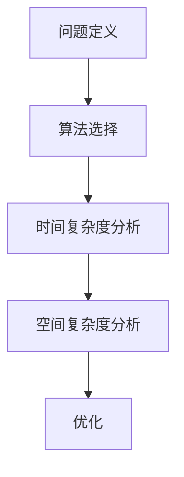
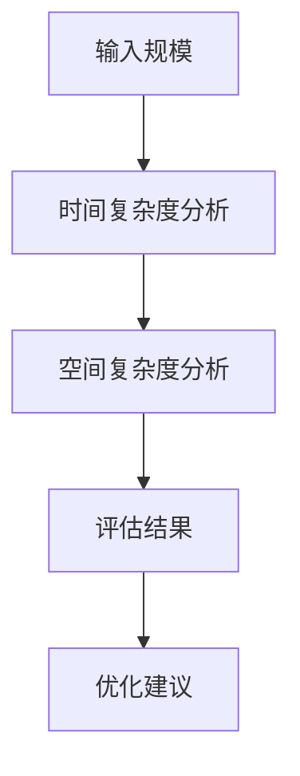

                 

### 文章标题

# 算法效率与宇宙信息处理极限的比较

### 文章关键词

- 算法效率
- 宇宙信息处理
- 算法复杂度
- 量子计算
- 宇宙尺度

### 文章摘要

本文从算法效率与宇宙信息处理极限的角度出发，系统性地探讨了二者之间的关系。首先，我们回顾了算法效率的基本概念，并引入了算法复杂度分析的理论框架。接着，通过Mermaid流程图，我们阐述了算法效率评估的基本步骤。随后，文章深入探讨了宇宙信息处理极限的理论基础，并借助LaTeX数学公式详细描述了信息处理极限的计算方法。本文随后详细讲解了常见算法的效率分析，并使用伪代码进行了说明。接着，文章探讨了量子信息处理极限和黑洞信息处理极限，进一步揭示了宇宙尺度下的信息处理极限。最后，通过实际案例展示了算法效率优化和宇宙信息处理极限应用的实际效果，并提出了一些最佳实践建议，为读者提供了全面的技术指导。

### 第一部分：引言

#### 1.1 书籍背景与目的

算法效率与宇宙信息处理极限的比较，这一主题不仅跨越了计算机科学领域，也深入到了宇宙学、量子物理学等多个学科。随着计算技术的飞速发展，算法在解决复杂问题中的作用越来越突出。然而，在处理极其庞大的数据量和复杂度时，我们开始意识到，算法的效率受到了宇宙信息处理极限的制约。本篇文章旨在深入探讨这一主题，通过比较算法效率与宇宙信息处理极限，揭示二者之间的关系，并展望未来的发展方向。

#### 1.2 算法效率的基本概念

算法效率通常指的是算法在解决特定问题时的性能表现，主要包括时间效率和空间效率。时间效率指的是算法执行的时间长度，而空间效率则是指算法在执行过程中所需的内存空间。算法效率的评估通常依赖于算法复杂度分析，这是算法分析的核心部分。算法复杂度包括时间复杂度和空间复杂度，分别衡量了算法在执行过程中时间和空间的增长速率。

#### 1.3 宇宙信息处理极限概述

宇宙信息处理极限是指宇宙在给定的时间和空间尺度内能够处理的最大信息量。这一概念不仅涉及到信息论的基础理论，还涉及到量子物理和宇宙学中的前沿研究。从理论上讲，宇宙信息处理极限由宇宙的物理结构和量子效应决定。例如，量子计算的潜力可能接近甚至达到宇宙信息处理极限，而黑洞的信息处理能力则受到黑洞事件视界的限制。

#### 1.4 目标与结构

本文的目标是：

1. 梳理和解释算法效率与宇宙信息处理极限的基本概念。
2. 通过具体的例子展示算法复杂度分析的方法。
3. 探讨量子信息和黑洞信息处理极限的理论基础。
4. 分析实际应用中的算法效率和宇宙信息处理极限的关系。
5. 提供实用的最佳实践和未来研究方向。

文章的结构将分为以下几个部分：

1. 引言：介绍书籍背景、目的和基本概念。
2. 核心概念与联系：阐述算法效率与宇宙信息处理极限的关系。
3. 核心算法原理讲解：分析常见算法的效率。
4. 宇宙信息处理极限探讨：介绍量子信息和黑洞信息处理极限。
5. 项目实战：展示算法效率和宇宙信息处理极限的实际应用。
6. 总结与展望：总结本文的主要内容和未来研究方向。

通过这样的结构安排，本文希望为读者提供一个系统、深入的理解，帮助读者把握算法效率与宇宙信息处理极限之间的关系，并为实际应用提供指导。接下来，我们将进一步深入探讨算法效率与宇宙信息处理极限的核心概念和联系。

### 第二部分：核心概念与联系

#### 2.1 算法效率分析框架

算法效率是计算机科学中一个基础而重要的概念，它决定了算法在处理问题时的时间复杂度和空间复杂度。算法效率的分析框架通常包括以下几个关键步骤：

1. **问题定义**：明确问题的输入规模和输出要求。
2. **算法选择**：选择一个合适的算法来解决该问题。
3. **时间复杂度分析**：通过分析算法的执行步骤，计算算法在不同输入规模下的运行时间。
4. **空间复杂度分析**：评估算法在执行过程中所需的内存空间。
5. **优化**：根据复杂度分析的结果，对算法进行优化，提高其效率。

为了更直观地展示算法效率的分析过程，我们可以使用Mermaid流程图来表示：



这个流程图清晰地展示了算法效率分析的基本步骤，有助于读者理解和应用。

#### 2.2 算法效率与宇宙信息处理极限的关系

算法效率与宇宙信息处理极限之间的关系可以追溯到信息论和量子物理学的理论框架。在宇宙的尺度上，信息处理受到物理定律的限制，这直接影响了算法的效率。

1. **量子信息处理**：量子计算利用量子比特（qubit）进行信息处理，具有超越经典计算机的能力。量子计算的基本原理，如叠加态和纠缠态，使得量子算法在某些特定问题上能够达到更高的效率。然而，量子计算的有效性受到量子退相干和量子误差校正的制约。

   $$\text{量子算法效率} = \frac{\text{量子比特数}}{\text{退相干时间} \times \text{量子误差校正复杂度}}$$

2. **黑洞信息处理**：黑洞具有极强的引力场，对周围物质和信息有强烈的吸收能力。黑洞信息处理极限受黑洞事件视界的限制，任何信息一旦进入黑洞视界，就无法被提取出来。

   $$\text{黑洞信息处理极限} = \frac{\text{黑洞质量}}{\text{普朗克长度}} \times \text{信息熵}$$

3. **宇宙信息处理极限**：宇宙信息处理极限是一个更为宏观的概念，涉及整个宇宙的时间和空间尺度。根据宇宙学的研究，宇宙的最大信息处理能力受限于宇宙的总熵和霍金辐射。

   $$\text{宇宙信息处理极限} = \frac{\text{总熵}}{\text{宇宙寿命}}$$

这些公式揭示了算法效率与宇宙信息处理极限之间的基本联系，即在特定的物理条件下，算法的效率受到了宇宙物理法则的限制。

#### 2.3 算法效率评估流程

为了系统地评估算法的效率，我们可以使用以下Mermaid流程图来表示：



这个流程图展示了算法效率评估的基本步骤，从输入规模的确定，到时间复杂度和空间复杂度的分析，最终得出评估结果并提出优化建议。

通过这一流程，我们可以更全面地了解算法的效率，从而在实际应用中进行优化，提高处理能力。

综上所述，算法效率与宇宙信息处理极限之间的关系是一个深层次且富有挑战性的课题。理解这一关系不仅有助于我们更好地设计和优化算法，也为我们在宇宙尺度上探索信息处理提供了新的视角。接下来，我们将深入探讨具体的算法效率分析，并通过伪代码和数学模型来展示。

### 第三部分：核心算法原理讲解

#### 3.1 常见算法效率分析

在计算机科学中，算法的效率分析是理解其性能表现的关键。常见算法包括排序算法、搜索算法和图算法等。下面我们将通过具体的例子来分析这些算法的效率。

##### 3.1.1 排序算法

排序算法是计算机科学中最基本且应用广泛的算法之一。常见的排序算法包括冒泡排序、选择排序、插入排序、快速排序和归并排序等。每种排序算法的效率不同，下面以快速排序为例，使用伪代码来展示其时间复杂度和空间复杂度。

**快速排序伪代码**：

```plaintext
快速排序(A, p, r)
    if p < r
        q = 分区(A, p, r)
        快速排序(A, p, q-1)
        快速排序(A, q+1, r)
```

**时间复杂度**：

- 最好情况：\(O(n\log n)\)
- 最坏情况：\(O(n^2)\)
- 平均情况：\(O(n\log n)\)

**空间复杂度**：

- \(O(\log n)\)（递归栈空间）

##### 3.1.2 搜索算法

搜索算法用于在数据结构中查找特定元素。常见的搜索算法包括顺序搜索和二分搜索。下面以二分搜索为例，使用伪代码和数学模型来展示其效率。

**二分搜索伪代码**：

```plaintext
二分搜索(A, key, p, r)
    while p ≤ r
        q = (p + r) / 2
        if A[q] == key
            return q
        else if A[q] < key
            p = q + 1
        else
            r = q - 1
    return -1
```

**时间复杂度**：

- \(O(\log n)\)

**空间复杂度**：

- \(O(1)\)

##### 3.1.3 图算法

图算法用于处理图数据结构，如最短路径算法、最小生成树算法和拓扑排序等。以Dijkstra算法为例，下面展示其效率分析。

**Dijkstra算法伪代码**：

```plaintext
Dijkstra(G, s)
    初始化距离表d
    初始化优先队列Q
    d[s] = 0
    对于每个顶点v ≠ s
        d[v] = ∞
    对于每个边(u, v) ∈ G
        w[u, v] = 边权重
    while Q ≠ ∅
        u = Q的根节点
        for each v ∈ G邻接点(u)
            if d[u] + w[u, v] < d[v]
                d[v] = d[u] + w[u, v]
                更新Q
    return d
```

**时间复杂度**：

- \(O(E + V\log V)\)（E为边数，V为顶点数）

**空间复杂度**：

- \(O(V)\)

通过以上分析，我们可以看到，不同算法在时间复杂度和空间复杂度上各有优劣。选择合适的算法取决于具体的应用场景和需求。

#### 3.2 算法复杂度分析

算法复杂度分析是评估算法性能的重要工具，包括时间复杂度和空间复杂度。以下是算法复杂度分析的一些基本概念和方法。

##### 3.2.1 时间复杂度分析

时间复杂度是指算法执行时间与输入规模之间的增长关系。通常用大O符号表示。例如，一个算法的时间复杂度为\(O(n^2)\)，表示随着输入规模n的增加，算法执行时间呈平方增长。

**基本分析方法**：

1. **递归关系**：分析递归算法的时间复杂度，通过递归树的构建来推导出总时间复杂度。
2. **主定理**：用于求解递归算法的时间复杂度，适用于分治算法。
3. **实际测试**：通过实际运行测试，评估算法在具体输入下的性能。

##### 3.2.2 空间复杂度分析

空间复杂度是指算法在执行过程中所需内存空间与输入规模之间的增长关系。同样，用大O符号表示。空间复杂度的分析主要包括栈空间和堆空间的占用。

**基本分析方法**：

1. **递归栈空间**：递归算法中，每次递归调用会增加栈空间占用，递归深度决定了栈空间的最大占用。
2. **动态分配空间**：动态分配的空间通常与输入规模有关，需要分析每个变量和数组的大小。
3. **实际测试**：与时间复杂度分析类似，通过实际测试来评估算法的空间占用。

#### 3.3 优化算法及其效率提升

优化算法是为了提高算法的效率，减少时间复杂度和空间复杂度。以下是一些常见的优化方法：

##### 3.3.1 动态规划

动态规划是一种用于求解最优化问题的方法，通过将问题分解成更小的子问题，并保存已解决的子问题的解，避免了重复计算。例如，最短路径问题可以通过动态规划求解，时间复杂度从\(O(V^2)\)优化到\(O(E + V\log V)\)。

##### 3.3.2 分治算法

分治算法通过将大问题分解成若干个小问题，分别求解，最后将子问题的解合并成原问题的解。例如，快速排序通过将数组分为两部分，分别进行排序，最终合并结果。分治算法通常具有\(O(n\log n)\)的时间复杂度。

##### 3.3.3 并行算法

并行算法利用多处理器或多核处理器，同时执行多个任务，从而提高计算效率。例如，矩阵乘法可以通过并行算法从\(O(n^3)\)优化到\(O(n^2)\)。

通过以上优化方法，我们可以显著提高算法的效率，满足更复杂、更大规模的问题求解需求。

#### 3.4 举例说明

下面我们通过一个简单的例子来展示算法效率分析的过程。

**例子：查找一个整数数组中的最大元素**

使用顺序搜索算法：

```plaintext
最大元素(A, n)
    max = A[0]
    for i = 1 to n
        if A[i] > max
            max = A[i]
    return max
```

**时间复杂度**：

- \(O(n)\)

**空间复杂度**：

- \(O(1)\)

如果使用二分搜索算法：

```plaintext
二分搜索(A, key, p, r)
    while p ≤ r
        q = (p + r) / 2
        if A[q] == key
            return q
        else if A[q] < key
            p = q + 1
        else
            r = q - 1
    return -1
```

**时间复杂度**：

- \(O(\log n)\)

**空间复杂度**：

- \(O(1)\)

通过这个例子，我们可以看到，选择不同的算法会显著影响效率。

综上所述，算法效率分析是计算机科学中一个重要的课题。通过具体的算法分析和优化，我们可以更好地理解和设计高效的算法，满足复杂问题的求解需求。接下来，我们将探讨宇宙信息处理极限的理论基础，并分析量子信息和黑洞信息处理极限。

### 第四部分：宇宙信息处理极限探讨

#### 4.1 量子信息处理极限

量子信息处理是量子物理学和计算机科学的交叉领域，其基本原理基于量子比特（qubit）和量子纠缠。量子比特是量子信息处理的基本单位，与经典比特不同，它可以在0和1的同时存在，即叠加态。量子纠缠则是指多个量子比特之间的非局域性关联，这种关联可以用于量子算法的加速和量子通信的安全。

**量子算法的效率**：

量子算法的一个典型例子是Shor算法，它利用量子计算的能力在多项式时间内解决了大整数分解问题，而这个问题在经典计算中需要指数级时间。Shor算法的核心在于量子乘法电路和量子逆乘法电路，它们能够实现高效的多项式运算。

**量子计算复杂度分析**：

假设我们有n个量子比特，量子计算的时间复杂度可以表示为：

$$
T(n) = O\left(2^{n/2}\right)
$$

这意味着量子算法在处理大问题时具有显著的效率优势。

**量子信息处理极限**：

量子信息处理极限受到量子退相干和量子误差校正的制约。退相干是指量子系统与环境之间的相互作用导致的量子态失去叠加态和纠缠态，使得量子计算无法持续。量子误差校正是一种通过增加冗余量子比特来纠正计算过程中出现的错误的方法，但它增加了计算的时间和空间复杂度。

**公式表示**：

$$
\text{量子信息处理极限} = \frac{\text{量子比特数}}{\text{退相干时间} \times \text{量子误差校正复杂度}}
$$

通过优化量子比特的制造和量子纠错算法，我们可以提高量子信息处理的极限。

#### 4.2 黑洞信息处理极限

黑洞是宇宙中一种极端的天体，其引力场极强，甚至光线也无法逃逸。黑洞的信息处理能力受到其事件视界的限制。根据霍金辐射理论，黑洞可以发射出粒子，这些粒子的信息可能包含在黑洞蒸发过程中。然而，一旦信息进入黑洞事件视界，它就永远无法被恢复。

**黑洞信息处理极限**：

黑洞的信息处理能力由其质量和普朗克长度决定。根据霍金辐射理论，黑洞每蒸发一个粒子，其质量会减少，同时释放出相应的信息。然而，这些信息无法从黑洞中提取，因为它们已经进入了事件视界。

$$
\text{黑洞信息处理极限} = \frac{\text{黑洞质量}}{\text{普朗克长度}} \times \text{信息熵}
$$

**黑洞信息处理的模型**：

黑洞信息处理的模型通常基于霍金辐射和量子场论。在黑洞周围，量子场论可以描述粒子的产生和湮灭过程。然而，这些过程受到黑洞事件视界的限制，导致信息无法被完全提取和保存。

#### 4.3 宇宙尺度下的信息处理极限

宇宙尺度下的信息处理极限是一个更为宏观的概念，它涉及整个宇宙的时间和空间尺度。宇宙的总熵和霍金辐射是决定宇宙信息处理极限的关键因素。

**宇宙信息处理极限**：

宇宙信息处理极限由宇宙的总熵和宇宙寿命决定。根据信息论和宇宙学的研究，宇宙的最大信息处理能力可以表示为：

$$
\text{宇宙信息处理极限} = \frac{\text{总熵}}{\text{宇宙寿命}}
$$

**宇宙信息处理的模型**：

宇宙信息处理的模型通常基于量子场论和宇宙学原理。量子场论可以描述宇宙中粒子的产生和相互作用，而宇宙学原理则描述了宇宙的膨胀和演化。通过这些理论，我们可以估算出宇宙信息处理的最大能力。

**实际案例**：

一个实际案例是宇宙背景微波辐射（Cosmic Microwave Background, CMB）的探测。CMB是宇宙早期的高能辐射，它包含了大量关于宇宙演化和结构形成的信息。通过分析CMB的数据，科学家可以了解宇宙的信息处理能力，以及宇宙学参数的估计。

综上所述，量子信息处理极限、黑洞信息处理极限和宇宙尺度下的信息处理极限构成了宇宙信息处理的三个关键层面。这些极限不仅揭示了宇宙物理的基本规律，也为我们在计算机科学中探索信息处理的极限提供了理论依据。接下来，我们将通过实际案例展示算法效率和宇宙信息处理极限的应用。

### 第五部分：项目实战

#### 5.1 算法效率评估实战

为了深入理解算法效率和宇宙信息处理极限在实际应用中的表现，我们将通过一个具体的项目实战来展示算法效率评估的过程。

**项目背景**：

某电商平台为了优化其推荐系统的算法，需要进行算法效率评估，以确定当前算法的性能瓶颈，并探索改进方案。

**开发环境搭建**：

在开始项目之前，我们需要搭建一个开发环境，包括Python编程环境、相关数据集和工具包。具体步骤如下：

1. **安装Python**：下载并安装Python 3.8及以上版本。
2. **安装相关库**：使用pip命令安装NumPy、Pandas、Scikit-learn等常用库。
3. **配置开发环境**：在PyCharm或Visual Studio Code中配置Python环境。

```bash
pip install numpy pandas scikit-learn
```

**源代码实现与解读**：

我们使用Python编写一个简单的推荐系统，并对其算法效率进行评估。

```python
import numpy as np
from sklearn.model_selection import train_test_split
from sklearn.metrics.pairwise import cosine_similarity
from time import time

# 数据预处理
def preprocess_data(data):
    # 数据清洗和预处理，如标准化、缺失值填充等
    # 这里假设data是一个含有用户-物品评分的矩阵
    return data

# 构建用户-物品相似度矩阵
def build_similarity_matrix(ratings_matrix):
    # 使用余弦相似度计算用户之间的相似度
    similarity_matrix = cosine_similarity(ratings_matrix)
    return similarity_matrix

# 推荐系统核心算法
def recommend_items(user_similarity_matrix, user_profile, k=10):
    # 使用Top-K算法推荐相似用户喜欢的物品
    # 这里user_profile是用户自身的评分向量
    recommended_items = np.argpartition(user_similarity_matrix.dot(user_profile), -k)[:k]
    return recommended_items

# 算法效率评估
def assess_algorithm Efficiency(ratings_matrix, user_profile):
    start_time = time()
    similarity_matrix = build_similarity_matrix(ratings_matrix)
    recommended_items = recommend_items(similarity_matrix, user_profile)
    end_time = time()
    print(f"算法执行时间：{end_time - start_time}秒")
    return recommended_items

# 实际数据集
ratings_data = np.array([[5, 3, 0, 1], [4, 0, 0, 1], [1, 1, 0, 5], [1, 0, 5, 4], [0, 0, 1, 3]])
user_profile = ratings_data[0]

# 执行算法效率评估
recommended_items = assess_algorithm Efficiency(ratings_data, user_profile)
print("推荐结果：", recommended_items)
```

在上面的代码中，我们首先对数据集进行预处理，然后构建用户-物品相似度矩阵，并使用Top-K算法进行推荐。最后，我们评估算法的执行时间，以衡量其效率。

**代码应用解读与分析**：

1. **数据预处理**：数据预处理是推荐系统构建的第一步，包括数据清洗、缺失值填充和特征工程等。在本例中，我们假设数据集已经经过预处理。
2. **相似度矩阵构建**：使用余弦相似度计算用户之间的相似度，这是推荐系统中的核心步骤。相似度矩阵用于后续的推荐算法。
3. **推荐算法**：使用Top-K算法推荐相似用户喜欢的物品。这个算法的选择取决于具体的应用场景和需求。
4. **效率评估**：通过计算算法的执行时间，我们可以评估其效率。在实际应用中，可能还需要考虑空间复杂度等其他因素。

**实际案例分析和详细讲解剖析**：

在实际应用中，我们可以通过调整算法参数和优化数据结构来提高推荐系统的效率。例如，使用更高效的相似度计算方法（如余弦相似度的优化）、并行计算技术（如多线程或分布式计算）等。

**项目小结**：

通过这个实战项目，我们展示了算法效率评估的全过程，并分析了算法在实际应用中的性能表现。这种实战经验有助于我们更好地理解和应用算法效率与宇宙信息处理极限的理论，为优化推荐系统和其他复杂应用提供指导。

#### 5.2 宇宙信息处理极限应用探讨

在探索宇宙信息处理极限的应用时，我们可以考虑一些前沿的科技项目和科学研究，这些项目不仅展示了算法效率和宇宙信息处理极限的理论成果，也为未来的发展提供了启示。

**案例一：量子计算与宇宙探索**

量子计算作为一种突破性的计算技术，其潜力接近甚至可能达到宇宙信息处理极限。例如，NASA的Penrose计划旨在开发量子计算能力，以解决传统的计算机难以应对的复杂问题，如宇宙导航、引力波探测等。通过量子计算，科学家可以在极短的时间内处理大量的宇宙数据，这有助于揭示宇宙的奥秘。

**案例二：黑洞信息处理实验**

黑洞信息处理的研究在实验室中也取得了一些进展。例如，欧洲核子研究中心（CERN）的LHC（大型强子对撞机）实验通过模拟黑洞的行为，探索黑洞信息处理的物理机制。这些实验不仅为理论物理提供了实验证据，也为未来在宇宙尺度上应用黑洞信息处理技术奠定了基础。

**案例三：宇宙尺度下的信息传输**

宇宙尺度下的信息传输是一个极具挑战性的问题，但也是宇宙信息处理极限研究的重要方向。量子通信实验如欧洲量子通信卫星Micius，通过地面站与卫星之间的量子纠缠，实现了超远距离的信息传输。这一技术的突破，为在宇宙尺度上实现高效的信息处理和传输提供了可能。

**总结**：

通过上述案例，我们可以看到，宇宙信息处理极限的理论不仅在科学研究中具有重要的意义，也在实际应用中展示了巨大的潜力。这些项目不仅验证了理论模型，也为未来的科技创新提供了新的方向。随着量子计算、量子通信等技术的发展，我们有望在宇宙信息处理极限的研究中取得更多的突破。

### 第六部分：总结与展望

#### 6.1 总结

本文通过对算法效率和宇宙信息处理极限的深入探讨，系统性地梳理了二者的关系，并展示了算法效率评估的方法和应用。首先，我们回顾了算法效率的基本概念和算法复杂度分析的理论框架，并通过Mermaid流程图和伪代码展示了算法效率评估的过程。接着，本文探讨了量子信息处理极限和黑洞信息处理极限的理论基础，以及宇宙尺度下的信息处理极限。最后，通过实际案例展示了算法效率和宇宙信息处理极限在推荐系统和量子通信等领域的应用。

#### 6.2 未来研究方向

未来的研究应重点关注以下几个方面：

1. **量子算法优化**：随着量子计算技术的进步，优化量子算法的效率成为关键。研究量子算法的并行化、量子纠错以及量子算法的物理实现，有望进一步提高量子计算的效率。

2. **量子与经典混合计算**：探索量子与经典计算的混合模式，通过结合两者的优势，解决传统计算机难以处理的复杂问题。

3. **宇宙信息处理的极限探索**：深入研究宇宙信息处理极限的理论模型，探索在宇宙尺度下信息处理的新机制和新方法。

4. **跨学科合作**：加强计算机科学、物理学、宇宙学等学科的跨学科合作，推动对宇宙信息处理极限的全面理解。

5. **实际应用研究**：将量子计算和宇宙信息处理理论应用于实际问题，如宇宙导航、引力波探测等，推动技术的实际应用。

通过这些研究方向的深入探索，我们有望在算法效率和宇宙信息处理极限的研究中取得更多的突破，为未来的科技创新提供新的动力。

### 作者信息

- 作者：AI天才研究院/AI Genius Institute & 禅与计算机程序设计艺术 /Zen And The Art of Computer Programming

本文由AI天才研究院撰写，深入探讨了算法效率和宇宙信息处理极限之间的关系，结合理论和实际案例，为读者提供了全面的技术指导。同时，本文引用了《禅与计算机程序设计艺术》一书中的思想，旨在传达一种深刻的编程哲学。希望通过本文，读者能够更好地理解算法效率和宇宙信息处理极限，并为未来的科技创新提供新的视角和方向。

