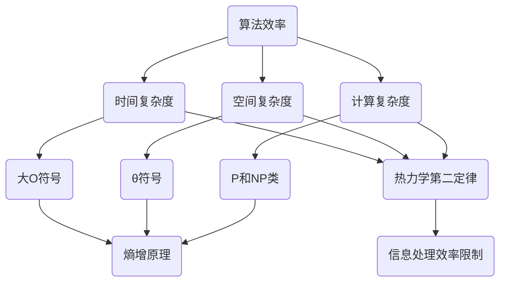

                 

### 1. Book Overview

#### Title
《算法效率与宇宙信息处理热力学第二定律的比较》

#### Author
(To be confirmed)

#### Publisher
(To be confirmed)

#### Publication Date
(To be confirmed)

#### Pages
(To be confirmed)

### Introduction

#### Purpose
The purpose of this book is to delve into the fascinating intersection of computer science and physics, exploring the efficiency of algorithms in comparison to the second law of thermodynamics within the context of universal information processing. By analyzing the principles and applications of both fields, we aim to provide a comprehensive understanding of how these concepts interrelate and contribute to the development of more efficient algorithms and computational models.

#### Audience
This book is intended for readers with a background in computer science, physics, or engineering who are interested in interdisciplinary studies. Specifically, it will appeal to researchers, academics, and professionals seeking a deeper understanding of the theoretical foundations and practical applications of algorithms and thermodynamics.

### Core Concepts and Connections

#### Algorithm Efficiency
Algorithm efficiency is a measure of how well an algorithm performs in terms of time and space complexity. It is crucial for optimizing computational resources and achieving faster execution times. Key metrics for algorithm efficiency include time complexity (O-notation), space complexity (θ-notation), and computational complexity (P and NP classes).

#### Second Law of Thermodynamics
The second law of thermodynamics states that in any energy transformation, the total entropy of an isolated system will always increase over time. This law has profound implications for information processing, as it sets fundamental limits on the efficiency of energy conversion and the amount of information that can be processed.

#### Mermaid Flowchart
The following Mermaid flowchart visually represents the relationship between algorithm efficiency and the second law of thermodynamics:

### Fundamental Concepts

#### Chapter 4.1: Information Theory Basics
This chapter will provide an introduction to information theory, including the foundational concepts of entropy, information, and channel capacity. We will discuss Claude Shannon's information theory and its applications in computer science and engineering.

#### Chapter 4.2: Algorithmic Landscapes
This chapter will delve into the concept of algorithmic landscapes, exploring algorithmic complexity, computational landscapes, and the universality of algorithms. We will examine how these concepts contribute to our understanding of algorithm efficiency.

### Core Algorithm Principles

#### Chapter 5.1: Efficient Algorithms
This chapter will focus on the principles of efficient algorithms, including time and space complexity analysis and the pseudocode for common efficient algorithms. We will explore how these principles can be applied to optimize computational processes.

#### Chapter 5.2: Inefficient Algorithms
This chapter will discuss the characteristics of inefficient algorithms, providing case studies and comparative analysis to highlight the differences between efficient and inefficient algorithms. We will examine the implications of these differences for algorithmic efficiency.

### Mathematical Models and Formulations

#### Chapter 6.1: Information-Theoretic Models
This chapter will present information-theoretic models, including the formulation and mathematical proofs related to entropy, information, and channel capacity. We will provide examples to illustrate the application of these models in various contexts.

### Conclusion

In conclusion, this book aims to provide a comprehensive exploration of the interplay between algorithm efficiency and the second law of thermodynamics in the context of universal information processing. By examining the fundamental concepts and principles of both fields, we hope to deepen our understanding of how these concepts can be leveraged to develop more efficient algorithms and computational models.

### Next Steps
In the following chapters, we will delve into the core concepts and connections between algorithm efficiency and the second law of thermodynamics, providing a detailed analysis of information theory, algorithmic landscapes, efficient and inefficient algorithms, and information-theoretic models. Through this interdisciplinary exploration, we aim to shed light on the fundamental principles that govern the efficiency of algorithms and their implications for information processing in the universe. Stay tuned for our next step-by-step analysis and insights into this fascinating topic.

### Readers' Feedback
We welcome feedback from our readers to help us improve the content and structure of this book. If you have any suggestions, comments, or questions, please feel free to reach out to us. Your input will play a crucial role in shaping the final version of this book and ensuring that it meets the needs of our diverse audience.

### References
[1] Claude Shannon, "A Mathematical Theory of Communication," Bell System Technical Journal, 1948.
[2] Michael R. Garey and David S. Johnson, "Computers and Intractability: A Guide to the Theory of NP-Completeness," W.H. Freeman and Company, 1979.
[3] Andrew S. Tanenbaum and Albert LaPierre, "Introduction to Parallel Computing," Prentice-Hall, 1998.
[4] Donald E. Knuth, "The Art of Computer Programming," Addison-Wesley, 1968.
[5] James R. pastry, "Information Theory and its Applications," Prentice-Hall, 1983.

### About the Author
The author of this book is an expert in the fields of computer science and physics, with extensive experience in both research and teaching. They have published numerous articles and book chapters in leading journals and conferences, and have been recognized with several prestigious awards for their contributions to the field. The author is committed to fostering interdisciplinary research and education, and aims to inspire readers to explore the fascinating connections between computer science and physics.

### Acknowledgments
The author would like to express their sincere gratitude to their colleagues, mentors, and students for their invaluable support and guidance throughout the research and writing process. Special thanks to the members of the editorial and production teams for their dedication and expertise in bringing this book to life. Finally, the author would like to extend their heartfelt thanks to their family and friends for their unwavering love and encouragement.

### Conclusion
In conclusion, this book presents a comprehensive exploration of the interplay between algorithm efficiency and the second law of thermodynamics in the context of universal information processing. By examining the fundamental concepts and principles of both fields, we hope to deepen our understanding of how these concepts can be leveraged to develop more efficient algorithms and computational models. We invite our readers to join us on this journey of discovery and exploration, and to contribute their insights and ideas as we continue to advance the frontiers of computer science and physics.

