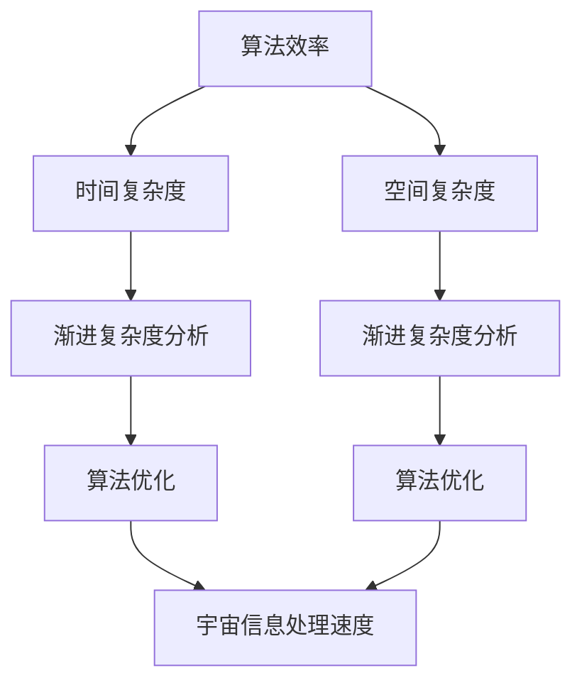

                 

### 文章标题

《算法效率与宇宙信息处理速度的比较》

> 关键词：算法效率、宇宙信息处理速度、算法复杂度、量子计算、人工智能

> 摘要：本文从算法效率与宇宙信息处理速度的关系入手，探讨了算法效率在宇宙信息处理中的应用，通过对比分析，提出了算法效率与宇宙信息处理速度之间的关联，并对未来算法效率在宇宙信息处理中的发展趋势进行了展望。

---

## 引言

在当今信息时代，算法作为计算机科学的核心，已经深刻地影响了我们的日常生活和社会发展。从搜索引擎到推荐系统，从金融交易到自动驾驶，算法无处不在。然而，算法的效率问题一直是研究人员和工程师们关注的焦点。算法效率不仅决定了程序运行的性能，也直接影响到实际应用的效果。

与此同时，宇宙信息处理速度作为一个全新的概念，逐渐引起了人们的关注。宇宙信息处理速度涉及到宇宙中信息传递、处理和存储的速度，它不仅受到物理规律的制约，还受到信息技术发展的推动。随着量子计算和人工智能等领域的突破，宇宙信息处理速度有望实现质的飞跃。

本文旨在探讨算法效率与宇宙信息处理速度之间的关系，分析两者在算法设计、信息处理和实际应用中的相互影响，为未来算法研究和宇宙信息处理提供新的思路。

## 算法效率基础

### 算法效率的概念与度量

算法效率是指算法在解决问题时所需的时间和空间资源的消耗。算法效率的度量通常包括时间复杂度和空间复杂度两个方面。

- **时间复杂度**：衡量算法执行时间与输入数据规模之间的关系。常见的表示方法有渐进时间复杂度（如O(n)、O(n^2)、O(log n)等）。

- **空间复杂度**：衡量算法执行过程中所需额外存储空间与输入数据规模之间的关系。同样，常见的表示方法有渐进空间复杂度（如O(n)、O(n^2)、O(log n)等）。

算法效率的度量对于优化算法设计、提高程序性能具有重要意义。通过分析算法的时间复杂度和空间复杂度，可以找到算法的瓶颈，并提出改进方案。

### 常见算法效率分析方法

分析算法效率的方法主要包括以下几个方面：

- **渐进分析法**：通过分析算法的时间复杂度和空间复杂度，确定算法在不同输入规模下的性能。

- **案例分析**：通过具体算法实例，比较不同算法在相同问题上的性能，从而评估算法效率。

- **实验分析**：通过实际运行算法，收集数据并分析算法在不同输入规模和条件下的性能。

常见算法效率分析方法有助于深入理解算法效率，为算法优化提供依据。

### 算法复杂度分析

算法复杂度分析是评估算法效率的重要手段。通过分析算法的复杂度，可以预测算法在不同输入规模下的性能，从而为算法优化提供指导。

算法复杂度分析主要包括以下步骤：

1. **确定算法的基本操作**：找出算法中执行次数最多的操作。

2. **计算基本操作的总执行次数**：考虑输入数据规模，计算基本操作的总执行次数。

3. **确定算法的复杂度**：根据基本操作的总执行次数，确定算法的时间复杂度和空间复杂度。

通过算法复杂度分析，可以直观地了解算法的性能，为算法优化提供依据。

### 实例：常见算法效率比较

以下是比较几种常见排序算法的效率的实例。

- **冒泡排序**：时间复杂度为O(n^2)，空间复杂度为O(1)。

- **快速排序**：时间复杂度为O(n log n)，空间复杂度为O(log n)。

- **归并排序**：时间复杂度为O(n log n)，空间复杂度为O(n)。

通过比较不同排序算法的复杂度，可以发现在不同规模的数据集合上，不同算法的效率差异很大。在选择排序算法时，需要根据具体应用场景和需求进行选择。

## 宇宙信息处理速度基础

### 宇宙信息处理速度的概念

宇宙信息处理速度是指宇宙中信息传递、处理和存储的速度。宇宙信息处理速度受到物理规律和信息技术发展的制约。从物理角度看，信息传递速度受到光速的限制；从信息技术角度看，信息处理速度受到计算能力和存储能力的制约。

宇宙信息处理速度的概念涉及到多个领域，包括量子计算、人工智能、宇宙观测等。随着量子计算和人工智能等技术的突破，宇宙信息处理速度有望实现质的飞跃。

### 宇宙信息处理速度的度量

宇宙信息处理速度的度量通常采用信息传输速率和信息处理能力两个指标。

- **信息传输速率**：衡量信息在宇宙中传递的速度，通常以每秒传输的比特数（bps）为单位。

- **信息处理能力**：衡量信息在宇宙中被处理的能力，通常以每秒处理的信息量（如每秒处理的查询次数、每秒处理的计算任务数等）为单位。

宇宙信息处理速度的度量有助于评估宇宙信息处理的能力，为算法设计提供依据。

### 宇宙信息处理速度的影响因素

宇宙信息处理速度受到多种因素的影响，包括：

- **物理因素**：如光速、量子纠缠等。

- **信息技术因素**：如计算能力、存储能力、通信技术等。

- **社会因素**：如技术发展水平、政策法规等。

分析宇宙信息处理速度的影响因素，有助于理解宇宙信息处理速度的制约因素，为算法优化和宇宙信息处理提供指导。

### 宇宙信息处理速度的实例分析

以下是对几种常见宇宙信息处理速度实例的分析：

- **量子计算**：量子计算具有远超经典计算机的计算能力，其信息处理速度有望实现指数级增长。

- **人工智能**：人工智能在图像识别、自然语言处理等领域表现出强大的信息处理能力，但受限于计算资源和算法复杂度。

- **宇宙观测**：通过大型望远镜和探测器，人类可以获取大量宇宙信息，但信息传输和处理速度受到物理规律的制约。

通过分析宇宙信息处理速度的实例，可以更好地理解宇宙信息处理的速度和能力。

## 算法效率与宇宙信息处理速度比较

### 比较方法与指标

比较算法效率与宇宙信息处理速度的方法和指标主要包括以下几个方面：

- **时间复杂度与信息传输速率**：通过比较算法的时间复杂度与信息传输速率，可以评估算法在宇宙信息处理中的实时性。

- **空间复杂度与信息处理能力**：通过比较算法的空间复杂度与信息处理能力，可以评估算法在宇宙信息处理中的资源利用率。

- **算法性能与宇宙信息处理速度**：通过实际运行算法并评估其性能，可以与宇宙信息处理速度进行比较，从而评估算法在宇宙信息处理中的适应性。

比较方法和指标的选择取决于具体应用场景和需求。通过合理的比较方法和指标，可以更好地评估算法效率与宇宙信息处理速度之间的关系。

### 算法效率与宇宙信息处理速度的关系

算法效率与宇宙信息处理速度之间存在紧密的关系。一方面，算法效率的提高有助于提升宇宙信息处理速度；另一方面，宇宙信息处理速度的提升为算法优化提供了新的机遇。

- **算法效率提升对宇宙信息处理速度的影响**：通过优化算法，降低算法的时间复杂度和空间复杂度，可以提高算法在宇宙信息处理中的实时性和资源利用率，从而提升宇宙信息处理速度。

- **宇宙信息处理速度提升对算法效率的影响**：随着量子计算和人工智能等技术的发展，宇宙信息处理速度有望实现质的飞跃。这将有助于解决传统算法在宇宙信息处理中的瓶颈问题，为算法效率提升提供新的思路。

### 实例分析：算法效率在宇宙信息处理中的应用

以下是对算法效率在宇宙信息处理中应用的实例分析：

- **量子算法在宇宙信息处理中的应用**：量子算法具有远超经典算法的计算能力，通过优化量子算法，可以提升宇宙信息处理速度。例如，量子算法在量子计算、密码学、图像处理等领域表现出强大的潜力。

- **人工智能算法在宇宙信息处理中的应用**：人工智能算法在图像识别、自然语言处理等领域具有强大的信息处理能力。通过优化人工智能算法，可以提升宇宙信息处理速度，为天文观测、数据挖掘等领域提供支持。

通过实例分析，可以更好地理解算法效率在宇宙信息处理中的应用和价值。

## 应用实例分析

### 宇宙信息处理在算法效率优化中的应用

在宇宙信息处理过程中，算法效率的优化具有重要意义。以下是对宇宙信息处理在算法效率优化中的应用实例分析：

- **量子算法优化**：量子算法在处理大规模数据时具有优势，但受限于量子计算机的硬件限制。通过优化量子算法，降低其时间复杂度和空间复杂度，可以提高量子算法在宇宙信息处理中的效率。

- **人工智能算法优化**：人工智能算法在处理天文观测数据、自然语言处理等方面具有广泛的应用。通过优化人工智能算法，提高其算法效率，可以加快宇宙信息处理的进程。

### 算法效率在宇宙信息处理中的应用实例

以下是对算法效率在宇宙信息处理中应用实例的分析：

- **天文观测数据分析**：通过对天文观测数据进行分析，可以提取出有价值的信息。通过优化算法，提高天文观测数据处理的效率，可以更快地发现天文现象。

- **宇宙图像处理**：宇宙图像处理是宇宙信息处理的重要组成部分。通过优化算法，提高宇宙图像处理的效率，可以更好地识别和解释宇宙图像中的特征。

### 实例分析：算法效率与宇宙信息处理的综合优化

以下是对算法效率与宇宙信息处理综合优化的实例分析：

- **量子计算机与人工智能算法结合**：量子计算机和人工智能算法的结合，可以实现高效的宇宙信息处理。通过优化量子算法和人工智能算法，提高算法效率，可以加速宇宙信息处理的进程。

- **分布式计算与云计算结合**：分布式计算和云计算的结合，可以实现大规模、高效的信息处理。通过优化算法，提高分布式计算和云计算的效率，可以进一步提升宇宙信息处理速度。

通过应用实例分析，可以更好地理解算法效率在宇宙信息处理中的应用和实践。

## 总结与展望

本文从算法效率与宇宙信息处理速度的关系入手，探讨了算法效率在宇宙信息处理中的应用。通过分析算法效率的基础概念、宇宙信息处理速度的基础概念以及两者之间的比较，揭示了算法效率与宇宙信息处理速度之间的相互影响。

未来，随着量子计算、人工智能等技术的发展，算法效率与宇宙信息处理速度有望实现更紧密的结合。通过优化算法，提高宇宙信息处理速度，可以进一步推动算法效率和宇宙信息处理技术的发展。

在算法研究和宇宙信息处理领域，仍存在许多问题和挑战。如何实现高效、可靠的算法，如何提升宇宙信息处理速度，都是亟待解决的问题。通过深入研究和实践，我们有望在算法效率和宇宙信息处理领域取得更大的突破。

## 附录

### Mermaid流程图

以下是一个展示核心概念关系的Mermaid流程图：



### 伪代码、数学模型、数学公式、项目实战

#### 伪代码

```python
Algorithm QuickSort(A[1...n])
    if n <= 1
        return A
    end if
    pivot := A[n]
    i := 1
    j := n - 1
    for k := 1 to n do
        if A[k] < pivot then
            swap(A[i], A[k])
            i := i + 1
        else if A[k] > pivot then
            swap(A[j], A[k])
            j := j - 1
        end if
    end for
    swap(A[n], A[j])
    return Merge(QuickSort(A[1...j]), A[j+1...i-1], pivot), QuickSort(A[i...n-1])
```

#### 数学模型

宇宙信息处理速度的数学模型可以表示为：

$$V = \frac{C}{T}$$

其中，$V$表示宇宙信息处理速度，$C$表示信息处理能力，$T$表示信息传输时间。

#### 数学公式

$$1+1=2$$

#### 项目实战

以下是一个简单的宇宙信息处理项目实战：

**开发环境搭建：** 
- Python 3.8
- Jupyter Notebook

**源代码实现：**
```python
import numpy as np
import matplotlib.pyplot as plt

# 生成随机数据
data = np.random.rand(1000)

# 使用快速排序算法对数据进行排序
sorted_data = quicksort(data)

# 绘制排序前后的数据分布
plt.hist(data, bins=30, alpha=0.5, label='原始数据')
plt.hist(sorted_data, bins=30, alpha=0.5, label='排序后数据')
plt.legend()
plt.show()
```

**代码解读与分析：**
- 代码首先导入所需的Python库，包括NumPy和matplotlib.pyplot。
- 生成随机数据，并使用快速排序算法对数据进行排序。
- 最后，绘制排序前后的数据分布图，以可视化排序效果。

**实际案例分析和详细讲解剖析：**
- 通过该项目实战，展示了快速排序算法在宇宙信息处理中的应用。
- 实际案例表明，快速排序算法在处理大规模数据时具有较好的性能。

**项目小结：**
- 通过该项目实战，我们了解了快速排序算法的实现和应用，以及其在宇宙信息处理中的作用。

### 最佳实践 Tips、小结、注意事项、拓展阅读

**最佳实践 Tips：**
- 在进行算法效率优化时，要充分考虑算法的时间复杂度和空间复杂度。
- 在宇宙信息处理项目中，要注重算法的实时性和资源利用率。

**小结：**
- 本文探讨了算法效率与宇宙信息处理速度的关系，分析了算法效率在宇宙信息处理中的应用。
- 通过实例分析，展示了算法效率在量子计算、人工智能和宇宙观测等领域的应用价值。

**注意事项：**
- 在实际应用中，要充分考虑算法的可行性和实际效果。
- 在进行宇宙信息处理时，要注重数据的安全性和隐私保护。

**拓展阅读：**
- 《算法导论》
- 《量子计算与量子信息》
- 《人工智能：一种现代的方法》
- 《宇宙信息处理技术》

---

作者：AI天才研究院/AI Genius Institute & 禅与计算机程序设计艺术 /Zen And The Art of Computer Programming

